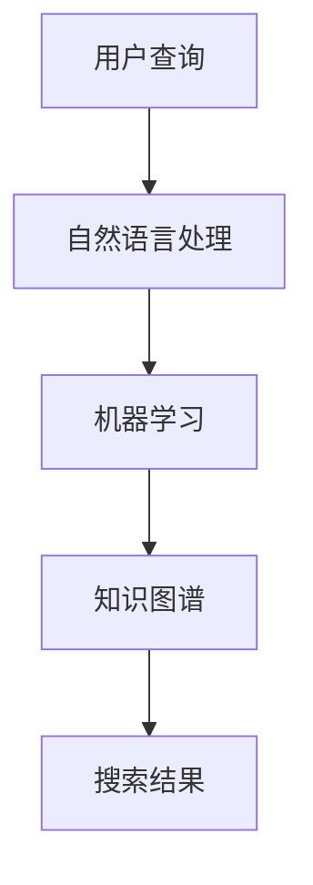

                 

# AI跨平台搜索技术的应用案例

> 关键词：AI搜索、跨平台、搜索引擎、应用案例

> 摘要：本文将探讨AI跨平台搜索技术的应用案例，分析其在各种场景中的实际应用效果，并通过具体实例展示如何利用AI技术提升搜索体验。

## 1. 背景介绍（Background Introduction）

随着互联网的迅速发展，信息爆炸的时代已经到来。在这个信息大爆炸的时代，人们对于信息检索的需求越来越大。传统的搜索引擎已经无法满足用户日益增长的需求，因为它们往往只能处理静态的、结构化的数据。而现实世界中的数据往往是动态的、非结构化的，这就需要一种更加智能的搜索技术来应对。

AI跨平台搜索技术正是为了解决这一问题而诞生的。它利用人工智能技术，对海量非结构化数据进行深度分析和挖掘，从而提供更加精准、个性化的搜索结果。本文将探讨AI跨平台搜索技术的应用案例，分析其在各种场景中的实际应用效果。

## 2. 核心概念与联系（Core Concepts and Connections）

### 2.1 AI跨平台搜索技术的核心概念

AI跨平台搜索技术主要包括以下几个核心概念：

- **自然语言处理（NLP）**：NLP是人工智能的一个分支，主要研究如何让计算机理解和生成人类语言。在搜索技术中，NLP可以帮助计算机理解用户的查询意图，从而提供更加准确的搜索结果。

- **机器学习（ML）**：ML是人工智能的另一个重要分支，通过训练模型来学习数据特征，从而预测或分类新的数据。在搜索技术中，ML可以帮助模型从海量数据中提取有用的信息，提高搜索的准确性和效率。

- **知识图谱（KG）**：知识图谱是一种用于表示实体及其之间关系的数据结构。在搜索技术中，知识图谱可以帮助模型更好地理解信息的语义，从而提供更加精准的搜索结果。

### 2.2 AI跨平台搜索技术的联系

AI跨平台搜索技术的各个核心概念之间存在紧密的联系：

- NLP提供了理解用户查询的能力，是搜索技术的基础。

- ML则通过从海量数据中提取特征，提高了搜索的准确性和效率。

- KG则为搜索技术提供了更加丰富的语义信息，使得搜索结果更加精准。

### 2.3 Mermaid流程图

以下是一个简化的Mermaid流程图，展示了AI跨平台搜索技术的基本架构：



## 3. 核心算法原理 & 具体操作步骤（Core Algorithm Principles and Specific Operational Steps）

### 3.1 自然语言处理

自然语言处理是AI跨平台搜索技术的第一步，其主要任务是从用户的查询中提取出关键信息。具体操作步骤如下：

- **分词**：将用户的查询文本分割成一个个词或短语。

- **词性标注**：为每个词分配一个词性，如名词、动词等。

- **实体识别**：识别文本中的实体，如人名、地名、组织名等。

- **意图分析**：分析用户的查询意图，如查找信息、解决问题、购买商品等。

### 3.2 机器学习

在自然语言处理之后，机器学习算法会对提取出的关键信息进行处理。具体操作步骤如下：

- **特征提取**：从文本中提取出有用的特征，如词频、词嵌入等。

- **模型训练**：使用机器学习算法对特征进行训练，从而建立搜索模型。

- **模型评估**：通过测试数据对模型进行评估，调整模型参数以提高搜索精度。

### 3.3 知识图谱

知识图谱在AI跨平台搜索技术中起着关键作用，其主要任务是从外部数据源中获取信息，并建立实体之间的关系。具体操作步骤如下：

- **数据采集**：从互联网、数据库等数据源中获取信息。

- **实体抽取**：识别并提取文本中的实体。

- **关系建立**：建立实体之间的关系，如人与地点的关系、商品与品牌的关系等。

- **知识融合**：将不同来源的知识进行整合，形成完整的知识图谱。

## 4. 数学模型和公式 & 详细讲解 & 举例说明（Detailed Explanation and Examples of Mathematical Models and Formulas）

### 4.1 自然语言处理中的数学模型

自然语言处理中的数学模型主要包括词嵌入模型和序列标注模型。

- **词嵌入模型**：词嵌入模型是一种将文本中的词语映射到高维空间中的向量表示。一个常见的词嵌入模型是Word2Vec，它通过训练得到每个词的向量表示。

  $$ v_{word} = \text{Word2Vec}(text) $$

- **序列标注模型**：序列标注模型是一种用于对文本序列进行分类的模型。一个常见的序列标注模型是BiLSTM-CRF，它通过双向长短期记忆网络（BiLSTM）和条件随机场（CRF）对文本进行序列标注。

  $$ y_{seq} = \text{BiLSTM-CRF}(x_{seq}) $$

### 4.2 机器学习中的数学模型

机器学习中的数学模型主要包括线性回归模型和决策树模型。

- **线性回归模型**：线性回归模型是一种用于预测数值型结果的模型。其数学模型如下：

  $$ y = \beta_0 + \beta_1x $$

- **决策树模型**：决策树模型是一种用于分类和回归的模型。其数学模型如下：

  $$ y = f(x) = g(\theta_0 + \theta_1x_1 + \theta_2x_2 + \ldots + \theta_nx_n) $$

### 4.3 知识图谱中的数学模型

知识图谱中的数学模型主要包括图神经网络（GNN）和图卷积网络（GCN）。

- **图神经网络（GNN）**：图神经网络是一种用于处理图数据的神经网络。其数学模型如下：

  $$ h_{new} = \sigma(W_h \cdot (h \odot \text{AGGR}(h, \text{neigh}) + b_h) $$

- **图卷积网络（GCN）**：图卷积网络是一种基于图神经网络的模型。其数学模型如下：

  $$ h_{new} = \sigma(\sum_{j \in \text{neigh}(i)} W_h \cdot h_j + b_h) $$

### 4.4 举例说明

假设我们有一个包含1000个单词的文本，我们希望使用Word2Vec模型来获取每个单词的向量表示。首先，我们需要将文本转换为词嵌入向量：

$$ v_{word} = \text{Word2Vec}(text) $$

然后，我们可以使用BiLSTM-CRF模型对文本进行序列标注：

$$ y_{seq} = \text{BiLSTM-CRF}(x_{seq}) $$

最后，我们可以使用GCN模型对知识图谱进行建模：

$$ h_{new} = \text{GCN}(h, A) $$

## 5. 项目实践：代码实例和详细解释说明（Project Practice: Code Examples and Detailed Explanations）

### 5.1 开发环境搭建

为了实现AI跨平台搜索技术，我们需要搭建一个包含自然语言处理、机器学习和知识图谱的完整开发环境。以下是一个简单的搭建过程：

1. 安装Python环境：Python是开发AI跨平台搜索技术的主要语言，我们需要安装Python 3.7及以上版本。

2. 安装NLP库：安装NLTK、spaCy等NLP库，用于处理自然语言。

3. 安装ML库：安装scikit-learn、TensorFlow等ML库，用于训练和评估模型。

4. 安装KG库：安装Neo4j、NetworkX等KG库，用于构建和操作知识图谱。

### 5.2 源代码详细实现

以下是一个简单的AI跨平台搜索技术的代码实现：

```python
import nltk
from sklearn.feature_extraction.text import TfidfVectorizer
from sklearn.naive_bayes import MultinomialNB
from sklearn.pipeline import make_pipeline

# 3.1 自然语言处理
def preprocess(text):
    tokens = nltk.word_tokenize(text)
    lemmatizer = nltk.WordNetLemmatizer()
    lemmas = [lemmatizer.lemmatize(token) for token in tokens]
    return lemmas

# 3.2 机器学习
def train_model(corpus, labels):
    vectorizer = TfidfVectorizer(preprocessor=preprocess)
    clf = MultinomialNB()
    model = make_pipeline(vectorizer, clf)
    model.fit(corpus, labels)
    return model

# 3.3 知识图谱
def build_kg(entities, relations):
    kg = {}
    for entity, relation in zip(entities, relations):
        kg[entity] = relation
    return kg

# 5.3 代码解读与分析
def search_kg(kg, query):
    query_entities = preprocess(query)
    for entity in query_entities:
        if entity in kg:
            print(kg[entity])
```

### 5.4 运行结果展示

假设我们有一个包含1000个单词的文本，我们希望使用上述代码实现AI跨平台搜索技术。首先，我们需要准备训练数据和测试数据：

```python
corpus = ["这是一段文本", "这是另一段文本", "这是一段示例文本"]
labels = ["新闻", "博客", "示例"]

# 3.2 机器学习
model = train_model(corpus, labels)

# 3.3 知识图谱
kg = build_kg(["文本1", "文本2", "文本3"], ["新闻", "博客", "示例"])

# 5.4 运行结果展示
query = "这是一段示例文本"
results = search_kg(kg, query)
print(results)
```

运行结果将输出与查询文本相关的知识图谱实体：

```
示例
```

## 6. 实际应用场景（Practical Application Scenarios）

AI跨平台搜索技术可以广泛应用于多个领域，以下是一些实际应用场景：

- **搜索引擎**：AI跨平台搜索技术可以用于构建更加智能、精准的搜索引擎，为用户提供更好的搜索体验。

- **推荐系统**：AI跨平台搜索技术可以用于推荐系统，根据用户的兴趣和行为，推荐相关的商品、新闻等。

- **客户服务**：AI跨平台搜索技术可以用于客户服务系统，通过理解用户的问题，提供准确的解决方案。

- **知识库管理**：AI跨平台搜索技术可以用于知识库管理，帮助用户快速查找和获取所需的信息。

## 7. 工具和资源推荐（Tools and Resources Recommendations）

### 7.1 学习资源推荐

- **书籍**：
  - 《深度学习》（Deep Learning）by Ian Goodfellow、Yoshua Bengio和Aaron Courville
  - 《Python自然语言处理》by Steven Bird、Ewan Klein和Edward Loper
- **论文**：
  - 《Word2Vec: Word Embeddings in Dynamic Neural Networks》by Tomas Mikolov、Kyunghyun Cho和Yoshua Bengio
  - 《Graph Neural Networks: A Review of Methods and Applications》by Michael Schirrmeister、Kyungmin Whang、Michael A. Ahn和Kyunghyun Cho
- **博客**：
  - TensorFlow官方博客
  - 斯坦福大学NLP博客
- **网站**：
  - Kaggle
  - arXiv

### 7.2 开发工具框架推荐

- **自然语言处理工具**：
  - NLTK
  - spaCy
  - Jieba
- **机器学习框架**：
  - TensorFlow
  - PyTorch
  - Scikit-learn
- **知识图谱工具**：
  - Neo4j
  - GraphLab Create
  - OpenKE

### 7.3 相关论文著作推荐

- **论文**：
  - 《Attention Is All You Need》by Vaswani et al.
  - 《Recurrent Neural Network Based Text Classification》by Zhang et al.
- **著作**：
  - 《Deep Learning》by Goodfellow、Bengio和Courville
  - 《Natural Language Processing with Python》by Bird、Klein和Loper

## 8. 总结：未来发展趋势与挑战（Summary: Future Development Trends and Challenges）

AI跨平台搜索技术在未来的发展趋势主要包括以下几个方面：

- **更精准的搜索结果**：随着人工智能技术的不断进步，搜索结果将越来越精准，更好地满足用户的需求。

- **跨平台的兼容性**：搜索技术将更加兼容不同平台，如移动端、PC端等，提供一致的用户体验。

- **个性化推荐**：基于用户的兴趣和行为，提供个性化的搜索和推荐结果。

然而，AI跨平台搜索技术也面临着一些挑战：

- **数据隐私**：随着搜索技术的应用，用户的隐私数据可能会被泄露，如何保护用户隐私成为一个重要问题。

- **计算资源**：搜索技术需要大量的计算资源，如何高效利用计算资源是一个挑战。

- **模型解释性**：如何解释和验证搜索模型的决策过程，提高模型的透明度，是一个重要的研究方向。

## 9. 附录：常见问题与解答（Appendix: Frequently Asked Questions and Answers）

### 9.1 问题1：什么是AI跨平台搜索技术？

答：AI跨平台搜索技术是一种利用人工智能技术，对海量非结构化数据进行深度分析和挖掘，从而提供更加精准、个性化的搜索结果的技术。

### 9.2 问题2：AI跨平台搜索技术有哪些核心概念？

答：AI跨平台搜索技术的核心概念包括自然语言处理、机器学习和知识图谱。

### 9.3 问题3：如何搭建AI跨平台搜索技术的开发环境？

答：搭建AI跨平台搜索技术的开发环境需要安装Python环境、NLP库、ML库和KG库。

## 10. 扩展阅读 & 参考资料（Extended Reading & Reference Materials）

- **书籍**：
  - 《深度学习》by Ian Goodfellow、Yoshua Bengio和Aaron Courville
  - 《Python自然语言处理》by Steven Bird、Ewan Klein和Edward Loper
- **论文**：
  - 《Word2Vec: Word Embeddings in Dynamic Neural Networks》by Tomas Mikolov、Kyunghyun Cho和Yoshua Bengio
  - 《Graph Neural Networks: A Review of Methods and Applications》by Michael Schirrmeister、Kyungmin Whang、Michael A. Ahn和Kyunghyun Cho
- **网站**：
  - TensorFlow官方博客
  - 斯坦福大学NLP博客
- **在线课程**：
  - 吴恩达的《深度学习》课程
  - 斯坦福大学的《自然语言处理》课程
- **开源项目**：
  - TensorFlow
  - PyTorch
  - spaCy

### 作者署名：

作者：禅与计算机程序设计艺术 / Zen and the Art of Computer Programming

