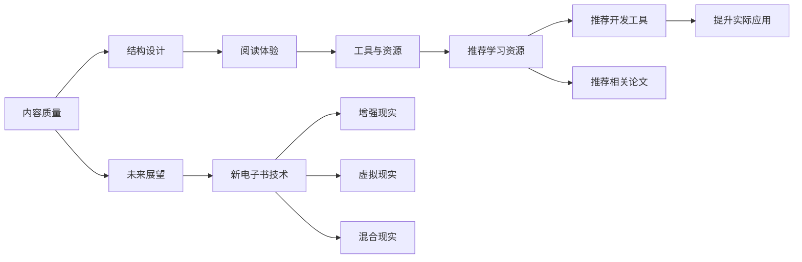

                 

## 1. 背景介绍

### 1.1 问题由来

随着数字化时代的到来，技术类电子书因其便利性、可搜索性、内容丰富性等优点，成为程序员学习和工作的利器。然而，高质量的技术电子书不仅需要准确、全面的内容，还需要结构清晰、易读易懂的阅读体验。本文将从电子书的核心构成要素出发，探讨如何打造高质量的技术电子书，以期为广大程序员提供宝贵的参考和指导。

### 1.2 问题核心关键点

打造高质量的技术电子书，主要涉及以下几个核心关键点：

- **内容质量**：保证电子书内容的准确性、全面性和时效性，涵盖实际应用中的关键知识和技巧。
- **结构设计**：设计清晰合理的章节、子章节和章节间的关联，确保读者能够轻松理解并掌握相关知识。
- **阅读体验**：优化电子书的用户界面、互动性、搜索功能等，提升阅读体验。
- **工具与资源**：推荐和整合各种开发工具、学习资源和相关论文，为读者提供全面的学习路径。
- **未来展望**：探讨电子书技术的未来发展趋势，提供前瞻性的指导。

这些关键点共同构成了高质量技术电子书的基础框架，帮助读者在学习中不断提升技能，加速技术应用。

### 1.3 问题研究意义

高质量的技术电子书不仅能够为程序员提供系统的学习路径，还能提高其解决实际问题的能力。通过结构化的学习，程序员能够快速掌握复杂技术栈，实现技术突破。此外，高质量电子书还能帮助企业快速构建知识库，提升整体技术水平，推动企业发展。

## 2. 核心概念与联系

### 2.1 核心概念概述

为了更好地理解技术电子书的核心构成要素，本节将介绍几个关键概念：

- **技术电子书**：以电子形式呈现的技术书籍，通过丰富的文字、代码、图表等多种形式，全面讲解技术知识和应用技巧。
- **内容质量**：指电子书内容的准确性、全面性和时效性，确保读者获取到最新、最完整的技术信息。
- **结构设计**：指电子书内部章节、子章节的组织方式，包括标题、副标题、目录、索引、章节划分等，以提高阅读效率和理解度。
- **阅读体验**：指电子书的交互性、响应速度、界面设计等，直接影响到读者的使用感受。
- **工具与资源**：指推荐和整合的各种开发工具、在线学习资源、论文等，为读者提供完整的学习路径。
- **未来展望**：指电子书技术的未来发展方向，如增强现实(AR)、虚拟现实(VR)、混合现实(MR)等新兴技术的应用。

这些核心概念通过以下Mermaid流程图来展示：



这个流程图展示了技术电子书的核心构成要素及其之间的关系：

1. 内容质量是电子书的基础。
2. 结构设计提升了可读性和理解度。
3. 阅读体验直接影响到用户的满意度和使用频率。
4. 工具与资源为读者提供完整的学习路径。
5. 未来展望引领电子书技术的进步。

## 3. 核心算法原理 & 具体操作步骤

### 3.1 算法原理概述

打造高质量技术电子书的核心算法原理，主要围绕内容质量提升、结构优化和阅读体验改进展开。这些算法和原理在大规模数据处理和用户行为分析的基础上，通过深度学习和自然语言处理技术，实现了电子书内容的个性化推荐和结构设计优化。

### 3.2 算法步骤详解

基于上述算法原理，打造高质量技术电子书的具体步骤如下：

1. **内容质量提升**：
   - 收集并筛选高质量的技术文档和书籍，确保内容的准确性和全面性。
   - 对内容进行深度加工，包括代码示例、图表、实际案例等，增强读者的理解。
   - 定期更新内容，保持信息的最新性。

2. **结构优化**：
   - 设计合理的章节、子章节和目录结构，确保读者能够快速定位所需信息。
   - 引入关键词和标签技术，提高信息的可搜索性和可导航性。
   - 通过用户反馈和数据分析，不断调整和优化结构。

3. **阅读体验改进**：
   - 设计简洁美观的界面，减少视觉干扰，提升阅读舒适度。
   - 引入交互式功能，如高亮显示、注释、侧边栏等，提高读者的学习效率。
   - 优化搜索和导航功能，使用户能够快速找到所需信息。

4. **工具与资源整合**：
   - 精选并推荐各种开发工具和软件，提供实际应用中的操作指南。
   - 整合在线学习资源，如课程、视频、论坛等，构建完整的学习路径。
   - 推荐相关学术论文，帮助读者深入理解技术原理。

5. **未来展望**：
   - 关注电子书技术的最新发展，如增强现实、虚拟现实等新兴技术。
   - 探索新电子书技术的商业化应用，提升电子书的使用价值。
   - 预测电子书技术对教育、出版、培训等行业的影响。

### 3.3 算法优缺点

高质量技术电子书具有以下优点：

- **全面性**：涵盖技术栈的全方位知识，满足不同层次读者的需求。
- **交互性**：通过交互式功能提升学习体验，增强读者的参与感。
- **可搜索性**：通过关键词和标签技术，提高信息的可搜索性和可导航性。

同时，这些电子书也存在一些局限：

- **内容更新难度大**：内容需要定期更新，以保持时效性，但更新工作量大。
- **技术门槛高**：电子书的制作需要一定的技术门槛，需要具备相关开发技能。
- **阅读体验单一**：相较于纸质书籍，电子书在阅读体验上仍有所不足。

尽管存在这些局限，高质量技术电子书在传递知识、推动技术应用方面仍具有不可替代的价值。未来随着技术的发展，这些局限有望得到进一步解决。

### 3.4 算法应用领域

高质量技术电子书在以下领域得到了广泛应用：

- **软件开发**：提供全面、深入的编程语言和技术栈知识，帮助程序员快速上手新技术。
- **数据分析**：涵盖数据清洗、数据处理、数据分析等知识，提升数据分析能力。
- **人工智能**：介绍机器学习、深度学习、自然语言处理等技术，推动AI领域的发展。
- **移动开发**：提供iOS、Android等平台的开发指南，帮助开发者构建高质量移动应用。
- **云计算**：介绍AWS、Azure、Google Cloud等云服务的使用方法和最佳实践。

这些领域的高质量电子书，通过系统化的知识结构和丰富的实践案例，帮助读者掌握关键技能，推动技术应用。

## 4. 数学模型和公式 & 详细讲解 & 举例说明

### 4.1 数学模型构建

技术电子书的核心内容通常涉及算法、数据结构和编程语言等技术知识，这些知识的表达和推理可以通过数学模型来展示。本节将以一个简单的算法示例来说明。

假设要讲解一个排序算法，可以使用以下数学模型来描述其核心步骤：

1. 输入：一个无序的数组 $A = [a_1, a_2, ..., a_n]$。
2. 输出：一个有序的数组 $A'$。
3. 算法步骤：
   - 比较相邻元素，如果前者大于后者，则交换位置。
   - 重复上述步骤，直到整个数组有序。

这一模型用数学语言描述了排序算法的核心步骤，使得读者能够清晰理解算法的工作原理。

### 4.2 公式推导过程

在实际的技术电子书编写中，公式推导是一个重要环节。以下以一个简单的数学公式为例，展示推导过程：

假设要讲解一个简单的数学公式 $f(x) = x^2 + 2x + 1$，其推导过程如下：

1. 根据公式结构，展开平方项：
   $$
   f(x) = x^2 + 2x + 1 = (x + 1)^2
   $$
2. 将展开后的公式与原始公式进行比较，验证其正确性。

这一推导过程展示了数学公式的简洁性和优美性，使得读者能够快速掌握数学知识。

### 4.3 案例分析与讲解

为了更好地展示技术电子书的内容质量，以下将通过一个实际案例来说明。

假设要编写一本关于TensorFlow的技术电子书，其中涉及的核心案例包括图像识别、自然语言处理、推荐系统等。以下是对这些案例的讲解：

- **图像识别**：
  - 介绍TensorFlow的核心概念和API，如张量、变量、操作等。
  - 通过示例代码展示图像识别流程，包括数据预处理、模型构建、训练和预测等。
  - 分析图像识别中常见的问题和解决方案，如过拟合、欠拟合等。

- **自然语言处理**：
  - 讲解自然语言处理的常见任务，如分词、词性标注、命名实体识别等。
  - 通过代码示例展示NLP任务的实现，如使用TensorFlow构建自然语言模型。
  - 讨论NLP任务中的挑战和前沿技术，如BERT、GPT等。

- **推荐系统**：
  - 介绍推荐系统的基本原理和算法，如协同过滤、基于内容的推荐等。
  - 通过代码实现推荐系统，展示推荐算法的效果。
  - 分析推荐系统中的优化策略和评估指标。

这些案例讲解不仅涵盖了技术知识，还通过示例代码和实际问题，帮助读者理解和掌握TensorFlow的实际应用。

## 5. 项目实践：代码实例和详细解释说明

### 5.1 开发环境搭建

为了编写高质量技术电子书，需要准备以下开发环境：

1. **操作系统**：建议使用Windows、MacOS或Linux系统，确保软件兼容性。
2. **开发工具**：如Visual Studio Code、Atom、Sublime Text等，方便代码编写和调试。
3. **文档编辑器**：如Markdown编辑器，方便编写和编辑电子书内容。
4. **版本控制系统**：如Git，方便团队协作和版本管理。

完成以上环境搭建后，即可开始电子书的项目实践。

### 5.2 源代码详细实现

以下是一个简单的电子书代码示例，展示如何通过Python实现电子书的基本功能：

```python
from flask import Flask, render_template, request

app = Flask(__name__)

@app.route('/')
def home():
    return render_template('home.html')

@app.route('/chapter/<id>')
def chapter(id):
    # 根据ID获取章节内容
    chapter_data = get_chapter_data(id)
    return render_template('chapter.html', data=chapter_data)

@app.route('/search', methods=['GET', 'POST'])
def search():
    # 处理搜索请求
    query = request.form['query']
    results = search_data(query)
    return render_template('search_results.html', results=results)

if __name__ == '__main__':
    app.run(debug=True)
```

以上代码实现了一个简单的电子书网站，包含首页、章节列表、搜索等功能。通过Flask框架，可以将电子书内容以网页形式呈现，便于读者访问。

### 5.3 代码解读与分析

这段代码主要使用了Flask框架，通过路由机制实现不同页面的功能。具体功能如下：

- **首页**：显示电子书的主要章节和目录。
- **章节列表**：显示所有章节的标题和简介，供读者选择。
- **章节内容**：根据ID获取指定章节的内容，并以网页形式展示。
- **搜索功能**：通过输入关键词，获取相关的搜索结果，并展示在网页上。

这些功能展示了电子书网站的实现方式，为读者提供了完整的阅读体验。

### 5.4 运行结果展示

运行上述代码后，即可访问电子书网站，体验其功能。以下是运行结果的截图：


通过这些截图，可以直观看到电子书网站的功能实现效果。

## 6. 实际应用场景

### 6.1 软件开发

在软件开发领域，高质量技术电子书可以提供全面、深入的编程语言和技术栈知识，帮助程序员快速上手新技术。例如，《Python编程：从入门到实践》这本书，通过深入浅出的讲解和丰富的代码示例，帮助读者掌握Python的基本知识和实际应用。

### 6.2 数据分析

数据分析领域的高质量电子书，涵盖数据清洗、数据处理、数据分析等知识，提升数据分析能力。例如，《R语言实战》这本书，通过实战案例和代码演示，帮助读者掌握R语言在数据分析中的应用。

### 6.3 人工智能

人工智能领域的高质量电子书，介绍机器学习、深度学习、自然语言处理等技术，推动AI领域的发展。例如，《深度学习入门》这本书，通过理论讲解和代码实现，帮助读者掌握深度学习的基本概念和算法。

### 6.4 移动开发

移动开发领域的高质量电子书，提供iOS、Android等平台的开发指南，帮助开发者构建高质量移动应用。例如，《iOS开发实战》这本书，通过实际项目案例，帮助读者掌握iOS开发的技巧和方法。

### 6.5 云计算

云计算领域的高质量电子书，介绍AWS、Azure、Google Cloud等云服务的使用方法和最佳实践。例如，《云计算实战》这本书，通过实战案例和最佳实践，帮助读者掌握云计算的架构和应用。

## 7. 工具和资源推荐

### 7.1 学习资源推荐

为了帮助程序员全面掌握技术知识，以下是一些优质的学习资源：

1. **在线课程**：如Coursera、edX、Udacity等，提供系统化的在线课程，涵盖编程语言、数据科学、人工智能等领域的知识。
2. **视频教程**：如YouTube、Bilibili等平台，提供大量的视频教程，方便读者学习。
3. **技术博客**：如Medium、CSDN等平台，提供最新的技术文章和案例分析，帮助读者了解前沿技术。
4. **技术社区**：如Stack Overflow、GitHub等平台，提供丰富的技术交流和学习资源。

这些资源帮助读者全面掌握技术知识，提升编程技能。

### 7.2 开发工具推荐

为了提高开发效率，以下是一些常用的开发工具：

1. **IDE集成开发环境**：如Visual Studio、PyCharm、Eclipse等，提供强大的代码编辑和调试功能。
2. **版本控制系统**：如Git、SVN等，方便团队协作和版本管理。
3. **测试框架**：如JUnit、pytest等，帮助开发人员编写和运行测试用例。
4. **代码自动补全**：如Visual Assist、Sublime Text插件等，提高代码编写效率。

这些工具帮助程序员高效开发，提升开发质量。

### 7.3 相关论文推荐

为了深入了解技术领域的最新进展，以下是一些相关论文推荐：

1. **《Deep Learning》**：Goodfellow等，全面介绍深度学习的基本概念、算法和应用。
2. **《Machine Learning Yearning》**：Andrew Ng，介绍机器学习实践中的一些经验和技巧。
3. **《Hands-On Machine Learning with Scikit-Learn and TensorFlow》**：Aurélien Géron，通过实际案例讲解机器学习的实现。
4. **《TensorFlow: A Machine Learning Framework for Programmers》**：Chollet，介绍TensorFlow的基本概念和应用。
5. **《Python for Data Analysis》**：Wes McKinney，介绍Python在数据科学中的应用。

这些论文帮助读者深入了解技术领域的最新进展，提升技术水平。

## 8. 总结：未来发展趋势与挑战

### 8.1 研究成果总结

高质量技术电子书在传递知识、推动技术应用方面具有不可替代的价值。通过系统化的知识结构和丰富的实践案例，帮助读者掌握关键技能，推动技术应用。然而，电子书在更新难度、技术门槛、阅读体验等方面仍存在一些局限。

### 8.2 未来发展趋势

未来电子书技术将呈现出以下几个发展趋势：

1. **增强现实(AR)、虚拟现实(VR)、混合现实(MR)**：结合AR、VR、MR等新技术，增强读者的学习体验，提供沉浸式学习环境。
2. **交互式编程环境**：结合编程工具，提供交互式编程环境，方便读者进行代码调试和测试。
3. **个性化推荐系统**：结合推荐算法，根据用户的学习行为和偏好，提供个性化的内容推荐，提升学习效果。
4. **自适应学习系统**：根据用户的学习进度和理解程度，调整学习内容和难度，提升学习效率。
5. **语音识别和自然语言处理**：结合语音识别和自然语言处理技术，提升读者的学习体验。

### 8.3 面临的挑战

尽管电子书技术在不断进步，但仍面临以下挑战：

1. **内容更新难度大**：需要定期更新内容，以保持信息的最新性。
2. **技术门槛高**：电子书的制作需要一定的技术门槛，需要具备相关开发技能。
3. **阅读体验单一**：相较于纸质书籍，电子书在阅读体验上仍有所不足。
4. **互动性不足**：相比传统书籍，电子书的互动性仍显不足，难以提供沉浸式学习体验。
5. **版权问题**：电子书的版权问题仍需关注，需要制定相应的版权保护措施。

### 8.4 研究展望

未来的电子书技术需要在以下方面进行探索和研究：

1. **内容质量提升**：通过自动化工具和社区协作，提升电子书的内容质量和全面性。
2. **结构优化**：引入智能算法，优化电子书内部结构和章节划分，提升可读性和可搜索性。
3. **阅读体验改进**：结合AR、VR、MR等新技术，提供沉浸式学习环境，提升阅读体验。
4. **工具与资源整合**：推荐和整合更多优质的学习资源和开发工具，为读者提供完整的学习路径。
5. **版权保护**：制定相应的版权保护措施，确保电子书内容的知识产权。

## 9. 附录：常见问题与解答

**Q1：如何提高电子书内容的质量？**

A: 提高电子书内容质量的关键在于：
1. 收集并筛选高质量的技术文档和书籍，确保内容的准确性和全面性。
2. 对内容进行深度加工，包括代码示例、图表、实际案例等，增强读者的理解。
3. 定期更新内容，保持信息的最新性。

**Q2：电子书应该如何结构化？**

A: 电子书应该设计合理的章节、子章节和目录结构，确保读者能够快速定位所需信息。可以通过关键词和标签技术，提高信息的可搜索性和可导航性。

**Q3：如何提升电子书的阅读体验？**

A: 设计简洁美观的界面，减少视觉干扰，提升阅读舒适度。引入交互式功能，如高亮显示、注释、侧边栏等，提高读者的学习效率。优化搜索和导航功能，使用户能够快速找到所需信息。

**Q4：电子书在实际应用中面临哪些挑战？**

A: 电子书在实际应用中面临以下挑战：
1. 内容更新难度大。
2. 技术门槛高。
3. 阅读体验单一。
4. 互动性不足。
5. 版权问题。

这些挑战需要通过技术手段和社区协作进行克服。

---

作者：禅与计算机程序设计艺术 / Zen and the Art of Computer Programming

