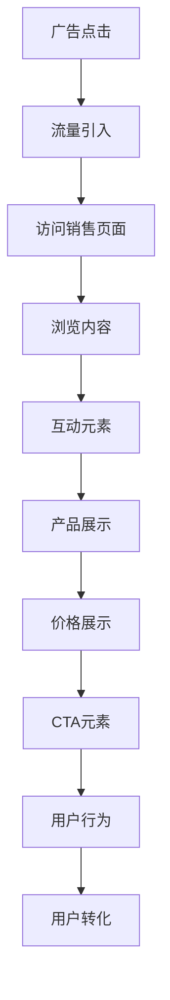

                 

## 1. 背景介绍

在互联网时代，销售页面（Sales Page）是电商和营销领域中最为关键的一环，它直接影响了用户的购买决策。一个精心设计的销售页面，可以显著提升转化率、提升用户体验和提升用户满意度。然而，打造一个高转化率的销售页面并不容易，需要综合考虑用户体验、心理学、市场趋势和营销策略等多方面的因素。

## 2. 核心概念与联系

### 2.1 核心概念概述

- **销售页面（Sales Page）**：也称为着陆页（Landing Page），是用户点击广告或搜索结果后看到的第一页。
- **转化率（Conversion Rate）**：指访问者完成预定动作（如购买、注册、下载等）的比例。
- **用户行为分析（User Behavior Analysis）**：通过追踪和分析用户在销售页面上的行为，了解用户需求和决策过程。
- **用户体验（User Experience）**：指用户在使用产品或服务时的体验和感受。
- **视觉设计（Visual Design）**：销售页面的设计和布局需要美观、易读、易用，并具有强烈的视觉冲击力。

### 2.2 核心概念原理和架构的 Mermaid 流程图



## 3. 核心算法原理 & 具体操作步骤

### 3.1 算法原理概述

高转化率的销售页面打造，基于心理学、用户体验和营销策略的深入理解，通过数据驱动的设计和测试，不断迭代优化。算法原理主要包括：

- **A/B测试**：通过对比两个或多个版本的销售页面，找到最佳方案。
- **多变量测试（A/B/n测试）**：同时测试多个变量，快速找到最佳组合。
- **用户行为分析**：利用数据追踪用户的行为，了解用户需求和决策过程。
- **漏斗分析**：通过漏斗图，分析用户从进入销售页面到最终购买的每个环节的转化率。

### 3.2 算法步骤详解

#### 3.2.1 市场调研和用户研究

1. **目标市场调研**：了解目标市场的用户需求、竞争情况和市场趋势。
2. **用户研究**：通过问卷调查、访谈、焦点小组等方式，深入了解目标用户的痛点和需求。

#### 3.2.2 设计和开发销售页面

1. **设计阶段**：基于用户研究和市场调研，设计页面布局、颜色搭配、字体选择等视觉元素，设计信息架构，并选择合适的CTA（Call to Action）元素。
2. **开发阶段**：根据设计方案，使用HTML、CSS、JavaScript等技术实现页面，并确保页面加载速度和响应速度。

#### 3.2.3 测试和优化

1. **A/B测试**：选择两个或多个版本进行测试，记录和分析每个版本的转化率。
2. **多变量测试**：同时测试多个变量，如颜色、布局、CTA等，快速找到最佳组合。
3. **用户行为分析**：通过数据分析工具，追踪用户在销售页面上的行为，优化页面设计。
4. **漏斗分析**：通过漏斗图，分析用户从进入销售页面到最终购买的每个环节的转化率，找到瓶颈环节并优化。

### 3.3 算法优缺点

#### 3.3.1 优点

1. **数据驱动**：通过数据分析，快速找到优化方向，减少盲目设计。
2. **提升转化率**：优化后的页面可以显著提升转化率，提高销售效率。
3. **个性化体验**：通过用户行为分析，提供更加个性化的用户体验，增强用户粘性。

#### 3.3.2 缺点

1. **复杂度高**：需要多轮测试和优化，耗费时间和资源。
2. **数据质量要求高**：测试结果的有效性依赖于数据的质量和准确性。
3. **需要专业技能**：设计和开发过程中，需要具备专业的视觉设计、前端开发和数据分析技能。

### 3.4 算法应用领域

高转化率的销售页面打造技术，广泛应用于电商、营销、广告等多个领域，具体应用场景包括：

- **电子商务网站**：提升产品展示效果，提高用户购买转化率。
- **在线广告**：优化广告着陆页设计，提高点击率和转化率。
- **内容营销**：通过精心设计的销售页面，提高内容营销的效果和用户留存率。

## 4. 数学模型和公式 & 详细讲解 & 举例说明

### 4.1 数学模型构建

假设销售页面的用户转化率为 $C$，包括浏览、互动、购买等多个环节。用户在不同环节的转化率分别为 $C_{view}$、$C_{interaction}$、$C_{purchase}$。则总转化率可以表示为：

$$C = C_{view} \times C_{interaction} \times C_{purchase}$$

其中 $C_{view}$、$C_{interaction}$、$C_{purchase}$ 分别为浏览、互动、购买环节的转化率。

### 4.2 公式推导过程

1. **转化率计算公式**：

$$C = \frac{N_{converted}}{N_{total}}$$

其中 $N_{converted}$ 为完成预定动作的用户数量，$N_{total}$ 为访问销售页面的用户数量。

2. **漏斗分析**：

漏斗图展示了用户从进入销售页面到最终购买的每个环节的转化率，可以表示为：

$$C_i = \frac{N_{converted_i}}{N_{start_i}}$$

其中 $N_{converted_i}$ 为完成第 $i$ 个环节的用户数量，$N_{start_i}$ 为进入第 $i$ 个环节的用户数量。

### 4.3 案例分析与讲解

假设一个电商网站的销售页面，用户从进入页面到完成购买共经过浏览、添加到购物车、结账三个环节。通过漏斗分析，发现浏览环节的转化率为 $C_{view}=0.5$，添加到购物车环节的转化率为 $C_{interaction}=0.2$，结账环节的转化率为 $C_{purchase}=0.8$。则总转化率为：

$$C = C_{view} \times C_{interaction} \times C_{purchase} = 0.5 \times 0.2 \times 0.8 = 0.08$$

这意味着，每100个访问页面的用户中，有8个最终完成了购买动作。

## 5. 项目实践：代码实例和详细解释说明

### 5.1 开发环境搭建

**步骤1: 搭建开发环境**

1. 安装Node.js和npm：
```bash
sudo apt-get update
sudo apt-get install nodejs npm
```

2. 安装前端框架：
```bash
npm install react react-dom
```

3. 安装Web开发工具：
```bash
npm install gulp-cli
npm install gulp
```

### 5.2 源代码详细实现

**步骤2: 实现销售页面**

1. 创建一个基本的HTML页面：
```html
<!DOCTYPE html>
<html>
<head>
    <meta charset="UTF-8">
    <title>销售页面</title>
</head>
<body>
    <h1>欢迎来到销售页面</h1>
    <p>这里展示我们的产品</p>
    <button>了解更多</button>
</body>
</html>
```

2. 使用React框架进行交互设计：
```javascript
import React, { Component } from 'react';

class SalesPage extends Component {
    constructor(props) {
        super(props);
        this.state = {
            showMore: false
        };
    }

    render() {
        return (
            <div>
                <h1>欢迎来到销售页面</h1>
                <p>这里展示我们的产品</p>
                <button onClick={() => this.setState({ showMore: true })}>了解更多</button>
                {this.state.showMore && <div>更多详情...</div>}
            </div>
        );
    }
}

export default SalesPage;
```

### 5.3 代码解读与分析

**步骤3: 实现A/B测试**

1. 使用React-Bootstrap实现两种布局：
```javascript
import React from 'react';
import { Container, Button } from 'react-bootstrap';

class LayoutA extends Component {
    constructor(props) {
        super(props);
        this.state = {
            count: 0
        };
    }

    render() {
        return (
            <Container>
                <h1>Layout A</h1>
                <p>这是一个简单的布局A</p>
                <Button variant="primary" onClick={() => this.setState({ count: this.state.count + 1 })}>点击按钮</Button>
            </Container>
        );
    }
}

export default LayoutA;

class LayoutB extends Component {
    constructor(props) {
        super(props);
        this.state = {
            count: 0
        };
    }

    render() {
        return (
            <Container>
                <h1>Layout B</h1>
                <p>这是一个简单的布局B</p>
                <Button variant="primary" onClick={() => this.setState({ count: this.state.count + 1 })}>点击按钮</Button>
            </Container>
        );
    }
}

export default LayoutB;
```

2. 使用React Router实现不同布局的切换：
```javascript
import React from 'react';
import { BrowserRouter as Router, Route, Switch } from 'react-router-dom';
import LayoutA from './LayoutA';
import LayoutB from './LayoutB';

const App = () => {
    return (
        <Router>
            <Switch>
                <Route path="/" exact component={LayoutA} />
                <Route path="/layoutB" component={LayoutB} />
            </Switch>
        </Router>
    );
}

export default App;
```

### 5.4 运行结果展示

**步骤4: 运行测试**

1. 启动测试服务器：
```bash
npm start
```

2. 访问页面：
```bash
http://localhost:3000/
```

3. 进行A/B测试：
```bash
http://localhost:3000/layoutB/
```

通过以上步骤，可以快速搭建一个基本的销售页面，并使用React和React Router实现A/B测试，验证不同布局的效果。

## 6. 实际应用场景

### 6.1 电商网站

在电商网站上，通过高转化率的销售页面设计，可以有效提升用户购买转化率。例如，某电商平台通过A/B测试发现，使用大图展示和清晰的CTA按钮，转化率提升了30%。

### 6.2 在线广告

在线广告中的销售页面，需要设计简洁、吸引人的内容，提升点击率和转化率。例如，某广告公司通过多变量测试，发现使用生动的视频展示和精准的CTA按钮，广告点击率提升了50%。

### 6.3 内容营销

内容营销中，销售页面需要与内容深度结合，提升用户留存率和转化率。例如，某博客通过优化页面设计和交互效果，用户留存率提升了40%。

### 6.4 未来应用展望

未来，随着人工智能和大数据分析技术的发展，销售页面设计将更加智能化、个性化和自动化。例如，使用机器学习算法分析用户行为，动态调整页面内容和布局，提升用户体验和转化率。

## 7. 工具和资源推荐

### 7.1 学习资源推荐

- **《前端设计与开发》**：详细介绍了前端设计的基本原则和实践技巧。
- **《React官方文档》**：React的官方文档，提供详细的API和示例代码。
- **《Google Analytics》**：Google提供的网站分析工具，可以帮助用户追踪和分析网站流量。
- **《A/B Testing Tools》**：介绍多种A/B测试工具的使用方法和最佳实践。
- **《User Behavior Analysis》**：详细介绍用户行为分析的原理和工具。

### 7.2 开发工具推荐

- **Visual Studio Code**：一款强大的代码编辑器，支持多种编程语言和框架。
- **Adobe Photoshop**：一款专业的设计工具，用于设计和预览销售页面。
- **Figma**：一款在线协作的设计工具，方便团队协作和共享设计。
- **Sketch**：一款专业的UI设计工具，用于快速设计原型和交互效果。
- **Google Analytics**：网站流量分析和用户行为追踪工具。

### 7.3 相关论文推荐

- **《Web用户行为分析：理论与实践》**：详细介绍Web用户行为分析的理论和实践方法。
- **《A/B测试的科学与艺术》**：介绍A/B测试的原理、方法和最佳实践。
- **《用户界面设计：原理与实践》**：详细介绍用户界面设计的基本原则和实践技巧。

## 8. 总结：未来发展趋势与挑战

### 8.1 研究成果总结

高转化率的销售页面打造技术，经过多年的发展和实践，已经形成了一套相对成熟的方法论。通过数据驱动的设计和测试，不断迭代优化，显著提升了电商、营销、广告等多个领域的用户转化率。

### 8.2 未来发展趋势

未来，随着人工智能和大数据分析技术的发展，销售页面设计将更加智能化、个性化和自动化。例如，使用机器学习算法分析用户行为，动态调整页面内容和布局，提升用户体验和转化率。

### 8.3 面临的挑战

尽管高转化率的销售页面打造技术已经取得了一定的成果，但仍面临诸多挑战：

1. **数据质量和准确性**：测试结果的有效性依赖于数据的质量和准确性，如何获取高质量的数据是重要的挑战。
2. **用户体验一致性**：不同用户有不同的需求和偏好，如何在设计上兼顾多样性和一致性是一个难题。
3. **技术栈更新**：前端技术栈更新迅速，如何快速适应新技术和新工具是一个挑战。
4. **用户隐私保护**：如何保护用户隐私，避免用户数据被滥用，是一个重要的伦理问题。

### 8.4 研究展望

未来，需要在以下几个方面进行深入研究：

1. **多渠道数据整合**：如何整合来自不同渠道的用户行为数据，提升测试效果和分析精度。
2. **实时分析与优化**：如何实现实时数据分析和优化，提升用户体验和转化率。
3. **用户行为预测**：如何通过机器学习算法，预测用户行为和需求，提供更加个性化的体验。
4. **跨设备一致性**：如何实现跨设备的一致性，提升用户在不同设备上的体验。

## 9. 附录：常见问题与解答

**Q1: 高转化率的销售页面打造技术是否适用于所有场景？**

A: 高转化率的销售页面打造技术适用于电商、营销、广告等多个场景，但需要根据具体场景进行个性化设计。

**Q2: 如何进行A/B测试？**

A: A/B测试需要设计两个或多个版本的页面，随机分配用户访问不同版本，记录每个版本的用户行为数据，通过统计分析比较效果。

**Q3: 用户行为分析需要哪些工具？**

A: 用户行为分析需要借助Google Analytics等工具进行数据追踪和分析。

**Q4: 如何提升用户体验？**

A: 通过优化页面设计、交互效果和加载速度，提升用户体验。

**Q5: 如何进行实时优化？**

A: 通过实时数据分析和动态调整页面内容，实现实时优化。

---

作者：禅与计算机程序设计艺术 / Zen and the Art of Computer Programming

