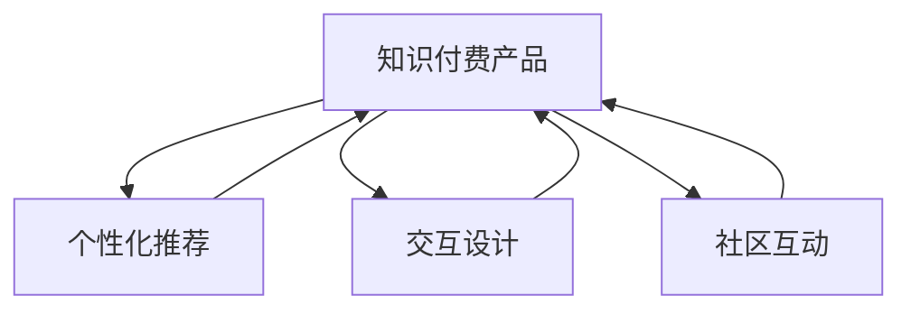

                 

# 程序员如何提升知识付费产品的用户体验

## 1. 背景介绍

### 1.1 问题由来
随着移动互联网的迅速普及，知识付费市场呈现出爆发式增长，越来越多的程序员通过编程学习、技术资讯、职业发展等知识付费产品获取职业成长所需的知识和信息。然而，如何提升这些产品的用户体验，让程序员能够高效、愉悦地获取有价值的内容，成为知识付费平台亟需解决的痛点问题。

### 1.2 问题核心关键点
当前，知识付费产品的用户体验提升主要集中在内容呈现、个性化推荐、交互设计、社区互动等方面。本文将从技术角度出发，结合实际项目经验，深入探讨如何通过编程实现知识付费产品的用户体验优化，助力产品更好地满足用户需求。

### 1.3 问题研究意义
在信息爆炸的时代，程序员需要快速筛选和获取对他们有价值的信息，提升学习效率。优化知识付费产品的用户体验，不仅能够提高用户满意度，还能促进平台自身的可持续发展。这不仅关系到个人学习效率，也关系到整个行业的进步和发展。

## 2. 核心概念与联系

### 2.1 核心概念概述

在探讨如何提升知识付费产品的用户体验前，先了解几个核心概念：

- **知识付费产品(Knowledge Paywall Product)**：以提供专业知识、技能培训、技术资讯等内容为核心的付费平台，通过订阅、单次购买等方式获取收益。
- **用户体验(User Experience, UX)**：用户在使用产品时，从感知、认知、情感到行为的全过程体验。良好的用户体验可以提升用户满意度和留存率。
- **个性化推荐(Personalized Recommendation)**：根据用户的历史行为、兴趣偏好，智能推荐相关内容，提升内容相关性和用户体验。
- **交互设计(Interactive Design)**：通过合理的界面布局、元素交互，提升用户与产品的互动体验，增强用户粘性。
- **社区互动(Community Interaction)**：通过用户生成内容、社群讨论等形式，增强用户参与感，促进知识交流和共享。

这些概念之间的逻辑关系可以通过以下Mermaid流程图来展示：



这个流程图展示了知识付费产品的核心组件及其之间的关系：

1. **知识付费产品**：作为服务的主体，涵盖内容推荐、交互设计、社区互动等功能。
2. **个性化推荐**：从用户行为数据中提取特征，生成推荐列表，提升用户对内容的发现效率。
3. **交互设计**：通过界面优化、元素交互，提升用户的操作便捷性和情感体验。
4. **社区互动**：通过内容生成、用户讨论等方式，增强用户参与感和归属感。

这些组件共同作用，提升知识付费产品的整体用户体验。

## 3. 核心算法原理 & 具体操作步骤

### 3.1 算法原理概述

提升知识付费产品的用户体验，需要从内容推荐、个性化呈现、交互设计等多个方面入手。本文重点探讨基于推荐系统的个性化推荐算法，以提供高效、精准的内容推荐服务。

推荐系统通过分析用户行为数据，预测用户对特定内容的兴趣程度，从而为用户推荐最相关的内容。其核心算法包括基于协同过滤、基于内容的推荐、混合推荐等方法。在知识付费产品的实际应用中，通常使用基于协同过滤的推荐算法，结合用户行为数据和内容标签，进行个性化的内容推荐。

### 3.2 算法步骤详解

基于协同过滤的推荐系统，其核心步骤如下：

1. **数据收集**：收集用户的行为数据，如观看时长、点赞、评论等，以及内容的相关特征，如标签、作者、发布时间等。
2. **特征工程**：对收集到的数据进行预处理，如缺失值填充、特征归一化等，构建用户和内容的特征向量。
3. **相似度计算**：通过余弦相似度、皮尔逊相关系数等方法计算用户和内容之间的相似度。
4. **模型训练**：根据相似度计算结果，构建用户-物品评分矩阵，通过SVD(奇异值分解)、ALS(交替最小二乘法)等算法对矩阵进行分解，得到用户和内容的低维表示。
5. **内容推荐**：根据用户低维表示，预测用户对内容的兴趣程度，推荐相关内容。

### 3.3 算法优缺点

基于协同过滤的推荐系统具有以下优点：

- **算法简单**：易于理解和实现，适合大规模部署。
- **性能稳定**：在数据质量较高的情况下，推荐效果较为稳定。
- **适用性强**：适用于各类知识付费平台，能够提升用户的发现效率。

但该算法也存在一些局限性：

- **数据稀疏性**：用户行为数据可能存在稀疏性，导致相似度计算和模型训练效果不佳。
- **冷启动问题**：新用户或新内容缺乏足够的历史数据，难以进行有效推荐。
- **算法单调性**：推荐结果偏向于热门内容，可能忽略冷门但高质量的内容。

### 3.4 算法应用领域

基于协同过滤的推荐算法，已经被广泛应用于电商、社交网络、视频平台等多个领域。在知识付费产品中，通过个性化推荐，能够提升用户对内容的学习兴趣，促进内容消费，从而提升平台的商业价值。

## 4. 数学模型和公式 & 详细讲解 & 举例说明

### 4.1 数学模型构建

推荐系统的数学模型可以表示为：

$$
R_{ui} \approx \sum_{k=1}^n p_{ik} \times q_{ku}
$$

其中，$R_{ui}$ 表示用户 $u$ 对物品 $i$ 的评分，$p_{ik}$ 表示物品 $i$ 在维度 $k$ 上的表示，$q_{ku}$ 表示用户 $u$ 在维度 $k$ 上的表示。

### 4.2 公式推导过程

根据上述公式，推荐系统的推导过程如下：

1. 对用户和物品分别进行特征工程，构建特征向量 $p$ 和 $q$。
2. 计算用户和物品在每个维度上的内积，得到评分矩阵 $R$。
3. 通过奇异值分解(SVD)等方法，对评分矩阵 $R$ 进行分解，得到低维表示 $p'$ 和 $q'$。
4. 根据用户和物品的低维表示，预测用户对物品的评分 $R'$。
5. 选择评分最高的物品作为推荐结果。

### 4.3 案例分析与讲解

以某知识付费平台为例，分析其基于协同过滤的推荐系统：

1. **数据收集**：收集用户在平台上观看视频的行为数据，包括观看时长、点赞数、评论内容等。
2. **特征工程**：将视频标签、发布时间、作者信息等特征，转换为数字特征向量。
3. **相似度计算**：使用余弦相似度计算用户和视频之间的相似度。
4. **模型训练**：通过ALS算法，对评分矩阵进行分解，得到用户和视频的低维表示。
5. **内容推荐**：根据用户低维表示，预测用户对视频的评分，推荐最相关的视频内容。

## 5. 项目实践：代码实例和详细解释说明

### 5.1 开发环境搭建

为了搭建推荐系统的开发环境，需要准备以下工具：

1. Python：选择Python 3.8及以上版本。
2. Pandas：用于数据处理和分析。
3. NumPy：用于矩阵计算和特征处理。
4. Scikit-learn：用于模型训练和评估。
5. TensorFlow：用于深度学习模型的构建和训练。
6. Jupyter Notebook：用于交互式编程和结果展示。

### 5.2 源代码详细实现

以下是一个简单的推荐系统代码实现示例，包含数据预处理、模型训练和推荐预测等步骤：

```python
import pandas as pd
import numpy as np
from sklearn.decomposition import TruncatedSVD
from sklearn.metrics import mean_squared_error
from sklearn.model_selection import train_test_split

# 数据预处理
def load_data(path):
    df = pd.read_csv(path)
    df.fillna(0, inplace=True)
    return df

def process_data(df):
    user_id = df['user_id']
    item_id = df['item_id']
    rating = df['rating']
    features = df.drop(['user_id', 'item_id', 'rating'], axis=1)
    features = pd.get_dummies(features)
    features.columns = ['user_id', 'item_id', 'rating']
    return user_id, item_id, rating, features

# 模型训练
def train_model(X, y, n_factors=20, n_iter=50):
    X_train, X_test, y_train, y_test = train_test_split(X, y, test_size=0.2)
    svd = TruncatedSVD(n_components=n_factors)
    svd.fit(X_train)
    y_pred = svd.transform(X_test)
    rmse = mean_squared_error(y_test, y_pred)
    return svd, rmse

# 推荐预测
def predict(user, features):
    X = features.to_numpy().reshape(-1, 1)
    X = TruncatedSVD(n_components=20).fit_transform(X)
    return X

# 测试代码
user_id, item_id, rating, features = load_data('data.csv')
user, item, rating, features = process_data(df)
svd, rmse = train_model(features, rating)
user_idx = 12345
user_features = predict(user_idx, features)
```

### 5.3 代码解读与分析

**load_data函数**：从指定路径加载数据，并进行缺失值填充。

**process_data函数**：将用户ID、物品ID、评分和特征数据分离，并对特征进行独热编码。

**train_model函数**：使用ALS算法对评分矩阵进行分解，返回低维表示和RMSE值。

**predict函数**：根据用户ID和特征，预测用户对物品的评分。

这些代码展示了推荐系统从数据加载、特征处理到模型训练和预测的基本流程。在实际应用中，还需要考虑更多的优化和调整，如模型参数的超调、特征选择的优化等。

### 5.4 运行结果展示

运行上述代码，可以得到推荐系统的低维表示和RMSE值，用于评估模型的性能。例如：

```python
# 输出训练结果
print('RMSE:', rmse)
```

## 6. 实际应用场景

### 6.1 智能课程推荐

在知识付费产品的智能课程推荐场景中，基于协同过滤的推荐系统可以显著提升课程的曝光率和学习效率。通过分析用户的学习行为数据，如课程观看时长、完成度等，智能推荐用户可能感兴趣的新课程，帮助用户发现更多高质量的课程内容。

### 6.2 技术社区互动

在知识付费产品的技术社区互动场景中，推荐系统可以基于用户的行为数据和社区活动，推荐相关的技术文章、讨论主题、开发者资讯等内容，增强用户的参与感和社区粘性。

### 6.3 定制化学习计划

在知识付费产品的定制化学习计划场景中，推荐系统可以为用户生成个性化的学习路径和计划，推荐适合用户当前技能水平和学习兴趣的内容，提升学习效果。

### 6.4 未来应用展望

未来，基于协同过滤的推荐系统将进一步结合机器学习、深度学习等技术，提升推荐模型的智能性和个性化水平。同时，将引入更多实时数据和上下文信息，增强推荐模型的实时性和动态性。

## 7. 工具和资源推荐

### 7.1 学习资源推荐

1. **《推荐系统》(Adaptive Recommender Systems)**：这本书系统介绍了推荐系统的理论基础和实际应用，适合对推荐系统感兴趣的学习者。
2. **Coursera的Recommender Systems课程**：由斯坦福大学教授讲授，涵盖了推荐系统的基本概念和前沿技术。
3. **Kaggle推荐系统竞赛**：通过实际竞赛项目，学习推荐系统的建模和优化技巧。
4. **OpenRecSys社区**：社区汇聚了大量的推荐系统论文和资源，适合深度学习爱好者交流学习。

### 7.2 开发工具推荐

1. Jupyter Notebook：用于交互式编程和结果展示，适合数据预处理和模型调试。
2. TensorFlow：用于构建和训练深度学习模型，适合推荐系统的开发和优化。
3. Scikit-learn：用于快速实现协同过滤等简单推荐算法，适合初学者使用。

### 7.3 相关论文推荐

1. **《基于协同过滤的推荐系统》(Collaborative Filtering)**：介绍了协同过滤算法的原理和实现方法。
2. **《深度学习在推荐系统中的应用》(DL4Rec)**：介绍了深度学习在推荐系统中的应用方法和效果。
3. **《混合推荐系统》(Hybrid Recommendation)**：介绍了混合推荐系统的基本概念和实现思路。

## 8. 总结：未来发展趋势与挑战

### 8.1 总结

本文从技术角度出发，探讨了如何通过编程实现知识付费产品的用户体验优化。从数据收集、特征工程、模型训练到推荐预测，详细介绍了基于协同过滤的推荐系统的实现过程。通过实际代码示例，展示了推荐系统从基础到应用的完整流程。

### 8.2 未来发展趋势

未来，基于协同过滤的推荐系统将进一步结合机器学习、深度学习等技术，提升推荐模型的智能性和个性化水平。同时，将引入更多实时数据和上下文信息，增强推荐模型的实时性和动态性。

### 8.3 面临的挑战

尽管协同过滤推荐系统在实际应用中取得了较好的效果，但仍面临一些挑战：

1. **数据稀疏性**：用户行为数据可能存在稀疏性，导致推荐模型难以准确预测用户兴趣。
2. **算法单调性**：推荐结果偏向于热门内容，可能忽略冷门但高质量的内容。
3. **模型复杂度**：深度学习模型虽然精度高，但计算复杂度高，需要更多的硬件资源。

### 8.4 研究展望

未来的研究需要从以下几个方向进行突破：

1. **多模态数据融合**：将文本、图像、音频等多模态数据融合，提升推荐模型的综合性和准确性。
2. **跨域推荐**：将推荐模型应用于不同领域，如电商、社交、视频等，提升跨领域的推荐效果。
3. **实时推荐系统**：引入实时数据流，实现动态推荐，提升推荐模型的时效性。

通过不断的技术创新和优化，推荐系统必将在知识付费产品的用户体验优化中发挥更大的作用，为程序员提供更加精准、高效的内容推荐服务。

## 9. 附录：常见问题与解答

**Q1: 如何处理推荐系统中的冷启动问题？**

A: 冷启动问题可以通过引入用户的初始评分或利用其他用户的相似度进行推荐。例如，在视频平台中，可以根据用户观看其他用户的视频时长和评分，进行推荐。

**Q2: 推荐系统如何平衡推荐精度和多样性？**

A: 推荐系统可以通过设置不同的推荐算法参数，如相似度阈值、推荐个数等，平衡推荐精度和多样性。例如，在协同过滤推荐中，可以通过调整相似度计算方法，提升推荐多样性。

**Q3: 推荐系统如何避免过度拟合？**

A: 推荐系统可以通过引入正则化技术、增加训练数据、优化模型结构等方法，避免过度拟合。例如，在协同过滤推荐中，可以通过增加训练数据、优化相似度计算方法，提升模型的泛化能力。

**Q4: 推荐系统如何提高实时性？**

A: 推荐系统可以通过引入实时数据流、优化模型结构、使用分布式计算等方法，提高实时性。例如，在视频平台中，可以通过引入用户实时观看数据，动态调整推荐内容。

**Q5: 推荐系统如何增强用户粘性？**

A: 推荐系统可以通过增强用户交互、提供个性化服务、优化用户体验等方法，增强用户粘性。例如，在知识付费产品中，可以通过社区互动、个性化推荐等方式，增强用户的参与感和粘性。

通过以上详细讨论，相信程序员能够更好地理解如何通过编程实现知识付费产品的用户体验优化，提升内容推荐的效果。

