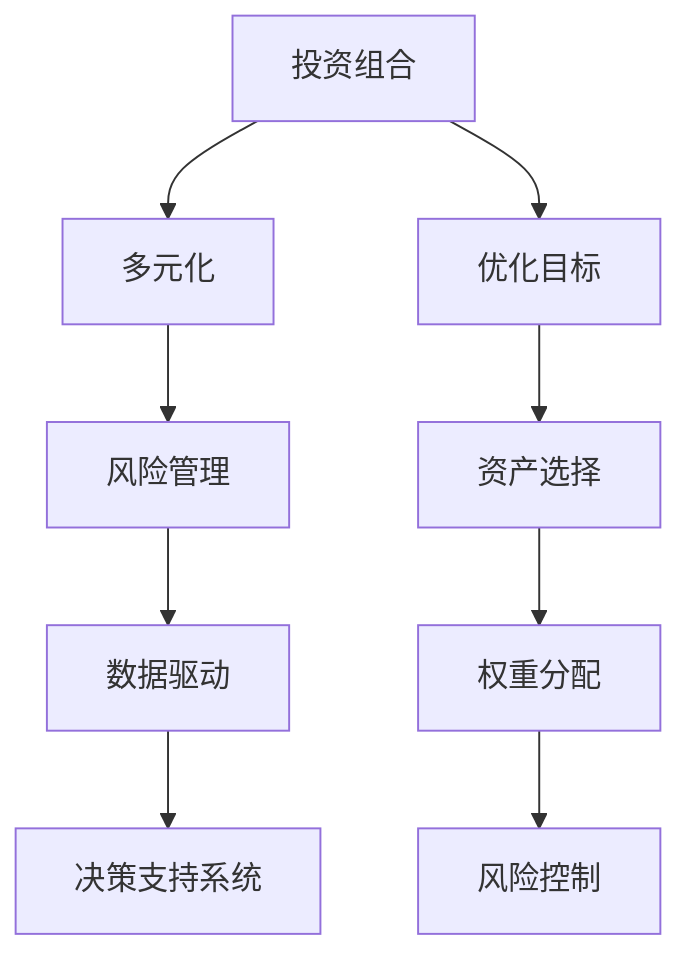

                 

# 程序员如何构建多元化投资组合

> 关键词：投资组合,多元化,算法,风险管理,数据驱动,决策支持

## 1. 背景介绍

在当今数字化经济时代，程序员已经成为了金融、科技、数据等领域的重要参与者。如何利用程序化思维和技能，构建一个多元化的投资组合，实现风险分散、收益最大化，成为程序员需要掌握的关键技能。本文将深入探讨如何通过程序化算法和数据分析技术，构建一个高效、稳健的投资组合，以应对市场波动和风险挑战。

## 2. 核心概念与联系

### 2.1 核心概念概述

为更好地理解程序员如何构建多元化投资组合，本节将介绍几个密切相关的核心概念：

- **投资组合**：由多种不同资产组成，通过分散风险来优化投资回报率的集合。
- **多元化**：通过投资不同领域、不同风险级别的资产，降低整体投资组合的风险。
- **风险管理**：通过数学模型、统计分析和算法手段，量化和控制投资组合的风险。
- **数据驱动**：基于大量历史数据和市场信息，构建模型和算法，做出科学、合理的投资决策。
- **决策支持系统**：利用先进算法和数据分析技术，辅助投资者进行投资决策。

这些核心概念之间的逻辑关系可以通过以下Mermaid流程图来展示：



这个流程图展示了一体化的投资组合构建流程：

1. 从目标优化开始，选择合适的资产并分配权重。
2. 利用多元化分散风险。
3. 通过风险管理手段控制风险。
4. 基于数据驱动进行科学决策。
5. 决策支持系统辅助投资。

## 3. 核心算法原理 & 具体操作步骤

### 3.1 算法原理概述

构建多元化投资组合的算法原理，主要基于以下几个方面：

- **Markowitz模型**：通过数学模型计算不同资产之间的协方差矩阵，构建投资组合的优化问题，寻找在给定风险水平下的最大收益。
- **现代组合理论**：引入非线性规划、半正定矩阵、对冲等高级概念，优化投资组合的收益-风险特征。
- **数据分析与机器学习**：利用历史市场数据和机器学习算法，预测资产未来的表现，优化投资组合。

### 3.2 算法步骤详解

构建多元化投资组合的算法步骤如下：

1. **目标设定**：确定投资组合的目标收益、风险水平和投资时间。
2. **资产选择**：从股票、债券、商品、房地产等各类资产中选择合适的投资品种。
3. **权重分配**：根据资产的期望收益和风险特征，使用优化算法确定各资产在组合中的权重。
4. **风险控制**：使用风险管理技术，如VaR、CVaR、协方差矩阵等，控制组合的风险。
5. **持续优化**：根据市场变化和投资者需求，定期重新评估和调整投资组合。

### 3.3 算法优缺点

构建多元化投资组合的算法优点包括：

- **系统化决策**：通过算法实现科学决策，避免主观情绪干扰。
- **高效分散风险**：通过多元化投资，降低整体组合风险。
- **实时动态调整**：基于最新数据和市场变化，实时调整投资组合。

算法的缺点包括：

- **模型依赖**：模型的选择和参数设定对结果影响较大。
- **计算复杂**：优化问题复杂，计算成本高。
- **市场适应性**：模型假设可能不适用于某些极端市场情况。

### 3.4 算法应用领域

构建多元化投资组合的算法广泛应用于金融、资产管理、财富管理等领域。以下是一些具体应用场景：

- **投资基金管理**：基金经理使用算法构建多资产投资组合，优化基金收益和风险。
- **量化交易**：高频交易员利用算法实时分析市场数据，快速交易，提高收益。
- **私人财富管理**：私人银行使用算法为高净值客户定制化投资组合。
- **企业财务规划**：企业财务部门使用算法优化企业资产配置，提升投资回报率。

## 4. 数学模型和公式 & 详细讲解 & 举例说明

### 4.1 数学模型构建

构建多元化投资组合的数学模型主要基于Markowitz的均值-方差模型。假设资产数量为 $n$，期望收益为 $\mu_i$，方差为 $\sigma_i^2$，协方差为 $\sigma_{ij}$，无风险收益率为 $r_f$，风险容忍度为 $\alpha$，投资期为 $T$，则Markowitz模型的目标函数为：

$$
\max \ \mu'_w \quad \text{s.t.} \ \sigma_w'_w \leq \alpha
$$

其中 $w$ 为资产权重向量，$\mu'_w$ 为组合期望收益，$\sigma_w'_w$ 为组合方差。

### 4.2 公式推导过程

基于Markowitz模型，我们可以得到组合的期望收益和方差的计算公式：

$$
\mu_w = \sum_{i=1}^n w_i \mu_i
$$

$$
\sigma_w^2 = \sum_{i=1}^n \sum_{j=1}^n w_i w_j \sigma_{ij}
$$

其中，$w_i$ 为资产 $i$ 的权重，$w_j$ 为资产 $j$ 的权重。

### 4.3 案例分析与讲解

假设我们有三个资产，期望收益和方差如表所示：

| 资产 | 期望收益 $\mu$ | 方差 $\sigma^2$ | 协方差 $\sigma_{ij}$ |
|------|----------------|----------------|---------------------|
| A    | 0.1             | 0.01           | 0.01                 |
| B    | 0.05            | 0.04           | 0.02                 |
| C    | 0.08            | 0.09           | 0.03                 |

根据Markowitz模型，我们可以构建如下目标函数和约束条件：

$$
\max \ 0.1w_A + 0.05w_B + 0.08w_C
$$

$$
\text{s.t.} \ w_A^2 + w_B^2 + w_C^2 \leq 0.03
$$

其中，$w_A, w_B, w_C$ 分别为资产 A、B、C 的权重。

通过求解上述优化问题，我们可以得到最优权重向量 $w$，从而构建出最优投资组合。

## 5. 项目实践：代码实例和详细解释说明

### 5.1 开发环境搭建

在进行投资组合构建的代码实践前，我们需要准备好开发环境。以下是使用Python进行Pandas、NumPy、Matplotlib等库开发的Python环境配置流程：

1. 安装Anaconda：从官网下载并安装Anaconda，用于创建独立的Python环境。

2. 创建并激活虚拟环境：
```bash
conda create -n investment-env python=3.8 
conda activate investment-env
```

3. 安装相关库：
```bash
conda install pandas numpy matplotlib scipy statsmodels 
```

4. 安装Plotly、Scikit-Learn等可视化与机器学习库：
```bash
conda install plotly scikit-learn
```

完成上述步骤后，即可在`investment-env`环境中开始投资组合构建的代码实践。

### 5.2 源代码详细实现

以下是一个基于Python的简单投资组合构建代码实现，使用了SciPy库中的优化器求解Markowitz模型：

```python
import numpy as np
from scipy.optimize import minimize

# 假设资产收益和方差
mean = np.array([0.1, 0.05, 0.08])
std_dev = np.array([0.01, 0.04, 0.09])
cov = np.array([[0.01, 0.02, 0.03],
               [0.02, 0.04, 0.03],
               [0.03, 0.03, 0.09]])

# 无风险收益率为0
rf = 0

# 风险容忍度为0.03
alpha = 0.03

# 目标函数和约束条件
def objective(w):
    return -np.dot(mean, w)

def constraint(w):
    return np.dot(w, np.dot(cov, w)) - alpha

# 初始权重
w0 = np.ones(3) / 3

# 求解优化问题
res = minimize(objective, w0, constraints={'type': 'ineq', 'fun': constraint})

# 输出最优权重
print(res.x)
```

### 5.3 代码解读与分析

让我们再详细解读一下关键代码的实现细节：

**目标函数**：
- 定义了组合期望收益的计算公式，使用数组向量进行矩阵乘法计算。

**约束条件**：
- 定义了组合方差的上限，使用矩阵乘法和矩阵不等式表示。

**初始权重**：
- 初始权重设置为各资产等量分配，作为求解的起点。

**求解优化问题**：
- 使用SciPy的`minimize`函数，设置目标函数和约束条件，求解Markowitz模型。

**输出最优权重**：
- 输出求解得到的最优资产权重向量。

可以看到，基于Python的代码实现简洁高效，通过SciPy库提供了强大的优化计算能力，可以方便地求解复杂的投资组合优化问题。

当然，实际应用中还需要考虑更多因素，如市场数据获取、风险控制策略等。以下是一个完整的投资组合构建系统架构，涵盖数据输入、模型计算、风险控制、决策输出等多个环节：

```
+-------------------+
| 数据输入         |
+-------------------+
           |
           v
+-------------------+
| 数据清洗与预处理 |
+-------------------+
           |
           v
+-------------------+
| 市场预测         |
+-------------------+
           |
           v
+-------------------+
| 投资组合构建     |
+-------------------+
           |
           v
+-------------------+
| 风险管理         |
+-------------------+
           |
           v
+-------------------+
| 决策输出         |
+-------------------+
```

**数据输入**：获取市场数据和投资者偏好数据，进行清洗和预处理。

**市场预测**：使用机器学习算法预测市场表现，生成未来价格预测。

**投资组合构建**：根据Markowitz模型构建投资组合，确定各资产权重。

**风险管理**：使用VaR、CVaR等风险管理技术，评估组合风险。

**决策输出**：根据风险管理结果和市场预测，给出最优投资建议。

## 6. 实际应用场景

### 6.1 智能投顾系统

智能投顾系统是基于大数据和算法驱动的投资顾问系统，可以为客户提供个性化的投资组合构建和管理。在实际应用中，智能投顾系统通过收集客户的风险偏好、收益目标等数据，结合市场预测模型，构建个性化的投资组合，并提供实时投资建议。

### 6.2 量化交易策略

量化交易策略是基于算法和数学模型进行高频交易的策略。交易员通过构建多个小策略组合，分散风险，提升交易收益。在实际交易中，量化交易系统根据实时市场数据和策略计算结果，自动下单和执行交易。

### 6.3 资产管理平台

资产管理平台是帮助投资者构建和管理投资组合的平台。通过平台，投资者可以选择各种资产进行组合配置，根据市场变化调整组合权重，同时提供风险分析和投资报告，帮助投资者做出科学决策。

### 6.4 未来应用展望

展望未来，投资组合构建将与更多先进技术相结合，进一步提升其科学性和实用性：

1. **人工智能和机器学习**：引入深度学习、强化学习等先进算法，提高预测精度和投资决策效率。
2. **大数据和云计算**：利用大数据技术和云计算平台，实时获取和处理海量市场数据，优化投资组合构建。
3. **区块链和智能合约**：引入区块链技术，实现资产智能管理，提高透明度和安全性。
4. **多模态融合**：结合图像、声音等多模态数据，增强投资组合的风险管理能力。
5. **元宇宙投资**：利用虚拟现实和区块链技术，提供元宇宙场景中的投资组合构建和管理。

这些技术融合将推动投资组合构建向更智能、更安全、更高效的方向发展，为投资者提供更好的决策支持。

## 7. 工具和资源推荐

### 7.1 学习资源推荐

为了帮助开发者系统掌握投资组合构建的理论基础和实践技巧，这里推荐一些优质的学习资源：

1. 《投资组合理论》书籍：详细介绍了投资组合构建的数学模型和实际应用。
2. Coursera的《投资组合管理》课程：斯坦福大学开设的NLP明星课程，有Lecture视频和配套作业，带你入门NLP领域的基本概念和经典模型。
3. 《Python for Finance》书籍：介绍了使用Python进行金融数据处理和算法优化的最佳实践。
4. QuantConnect平台：提供了丰富的量化交易学习资源和社区支持。
5. Kaggle竞赛：通过实际数据集进行量化交易和资产管理竞赛，积累实战经验。

通过对这些资源的学习实践，相信你一定能够快速掌握投资组合构建的精髓，并用于解决实际的金融问题。

### 7.2 开发工具推荐

高效的开发离不开优秀的工具支持。以下是几款用于投资组合构建开发的常用工具：

1. Python：基于Python语言的开发环境，功能强大，开源社区丰富。
2. Jupyter Notebook：基于Web的交互式开发环境，方便实时调试和共享代码。
3. Scipy：基于NumPy的数学计算库，提供了优化、统计、线性代数等多种功能。
4. Pandas：数据处理和分析库，支持多种数据格式和操作。
5. Matplotlib：数据可视化库，支持多种图表和动画效果。

合理利用这些工具，可以显著提升投资组合构建的开发效率，加快创新迭代的步伐。

### 7.3 相关论文推荐

投资组合构建领域的研究工作已经积累了丰富的成果，以下是几篇奠基性的相关论文，推荐阅读：

1. Markowitz模型：马科维茨在其经典论文《资产组合的选择》中提出了均值-方差优化模型。
2. Black-Litterman模型：布莱克和利特曼在其论文《资产定价模型：基于均衡的资本资产定价模型》中，提出了贝叶斯模型方法，应用于资产定价和组合构建。
3. Fama-French三因子模型：法玛和法国在其论文《共同因素和投资回报率》中，提出了基于市场、市值和账面市值比的三因子模型。
4. GARCH模型：由英格兰银行在其论文《理论、应用与实践》中提出，用于处理金融时间序列的波动性问题。
5.机器学习在金融领域的应用：包括基于神经网络的金融预测、基于强化学习的交易策略等，拓展了投资组合构建的技术边界。

这些论文代表了大模型微调技术的发展脉络。通过学习这些前沿成果，可以帮助研究者把握学科前进方向，激发更多的创新灵感。

## 8. 总结：未来发展趋势与挑战

### 8.1 总结

本文对程序员如何构建多元化投资组合进行了全面系统的介绍。首先阐述了投资组合构建的核心理论和实践流程，明确了多元化投资组合在分散风险、优化收益方面的独特价值。其次，从原理到实践，详细讲解了投资组合构建的数学模型和关键步骤，给出了投资组合构建的完整代码实例。同时，本文还广泛探讨了投资组合构建在智能投顾、量化交易、资产管理等多个行业领域的应用前景，展示了投资组合构建的广阔潜力。此外，本文精选了投资组合构建的技术资源，力求为读者提供全方位的技术指引。

通过本文的系统梳理，可以看到，基于程序化算法和数据分析的投资组合构建，已成为金融技术发展的重要方向。利用先进的数学模型和算法，程序员能够构建科学、稳健的投资组合，为投资者提供更具价值的服务。未来，伴随算法和数据技术的持续进步，投资组合构建必将进一步优化，为金融领域带来更多的机遇和挑战。

### 8.2 未来发展趋势

展望未来，投资组合构建技术将呈现以下几个发展趋势：

1. **算法迭代优化**：随着算法技术的不断进步，投资组合构建将引入更多高级算法，如深度学习、强化学习、遗传算法等，提升组合构建的精度和效率。
2. **大数据与云计算**：利用大数据技术和云计算平台，实时获取和处理海量市场数据，优化投资组合构建。
3. **多模态融合**：结合图像、声音等多模态数据，增强投资组合的风险管理能力。
4. **元宇宙投资**：利用虚拟现实和区块链技术，提供元宇宙场景中的投资组合构建和管理。
5. **智能投顾普及**：基于大数据和算法驱动的智能投顾系统，将普及到更多普通投资者，提供个性化的投资建议。

这些趋势凸显了投资组合构建技术的广阔前景。这些方向的探索发展，必将进一步提升投资组合构建的科学性和实用性，为金融行业带来更多的创新和机遇。

### 8.3 面临的挑战

尽管投资组合构建技术已经取得了显著进展，但在迈向更加智能化、普适化应用的过程中，它仍面临着诸多挑战：

1. **数据获取与处理**：市场数据和投资者数据的获取和处理成本较高，数据质量也难以保证。如何高效、准确地获取和处理数据，是投资组合构建的重要瓶颈。
2. **模型复杂性**：高级算法模型复杂度高，计算成本大，难以实时求解。如何简化模型，降低计算成本，提升模型实时性，是需要解决的问题。
3. **市场适应性**：模型假设可能不适用于某些极端市场情况，如何提升模型的鲁棒性和适应性，是一个重要的研究方向。
4. **算法透明度**：复杂算法难以解释，如何提高算法的透明度和可解释性，增强用户信任，是另一个重要问题。
5. **风险管理**：如何更好地量化和控制投资组合的风险，避免灾难性风险，是投资组合构建的重要挑战。

这些挑战需要研究人员和开发者共同努力，不断探索和创新，才能推动投资组合构建技术向更高水平发展。

### 8.4 研究展望

面对投资组合构建所面临的挑战，未来的研究需要在以下几个方面寻求新的突破：

1. **数据驱动的算法优化**：开发更多基于大数据和深度学习的算法优化方法，提升投资组合构建的效率和准确性。
2. **多模态数据融合**：结合多种数据源，提升投资组合的风险管理能力。
3. **智能投顾与交互设计**：开发更智能、更直观的智能投顾系统，增强用户体验。
4. **透明度与可解释性**：开发更可解释的算法模型，提高算法的透明度和可解释性。
5. **元宇宙与区块链融合**：结合元宇宙技术和区块链技术，提供更加安全、透明、高效的投资组合构建和管理。

这些研究方向的探索，必将引领投资组合构建技术迈向更高的台阶，为金融行业带来更多的创新和机遇。面向未来，投资组合构建技术还需要与其他金融技术进行更深入的融合，如资产定价、风险管理、量化交易等，多路径协同发力，共同推动金融行业的进步。只有勇于创新、敢于突破，才能不断拓展投资组合构建的边界，为金融领域带来更大的价值。

## 9. 附录：常见问题与解答

**Q1：投资组合构建与传统的基于规则的投资策略有何不同？**

A: 投资组合构建基于数学模型和算法，通过数据驱动的方式进行科学决策，相比传统的基于规则的投资策略，更具备自动化、科学化的特点。投资组合构建可以处理大量复杂的数据，并且能够通过模型优化，最大化投资回报，同时控制风险。

**Q2：如何选择最适合的投资组合构建方法？**

A: 投资组合构建方法的选择，需要考虑投资者的风险偏好、市场环境、数据可获得性等因素。对于风险厌恶的投资者，可以选择较为保守的策略，如均值-方差模型；对于高风险投资者，可以选择更激进的策略，如基于深度学习的策略。需要根据具体情况选择合适的构建方法。

**Q3：投资组合构建中的风险管理方法有哪些？**

A: 投资组合构建中的风险管理方法包括VaR、CVaR、协方差矩阵等。其中，VaR（Value at Risk）计算在给定置信水平下的最大可能损失，CVaR（Conditional Value at Risk）计算在给定置信水平下期望的额外损失，协方差矩阵用于量化资产之间的相关性。这些方法可以帮助投资者评估和控制组合风险。

**Q4：如何应对市场极端情况？**

A: 市场极端情况是投资组合构建中常见的挑战之一。为了应对市场极端情况，可以引入高级算法，如鲁棒优化、强化学习等，增强模型的鲁棒性。同时，可以引入对冲策略，通过多种资产的组合，降低极端市场风险。

**Q5：投资组合构建的未来方向是什么？**

A: 投资组合构建的未来方向包括算法迭代优化、大数据与云计算、多模态融合、元宇宙投资、智能投顾普及等。这些方向将推动投资组合构建向更智能、更安全、更高效的方向发展，为金融行业带来更多的创新和机遇。

---

作者：禅与计算机程序设计艺术 / Zen and the Art of Computer Programming

