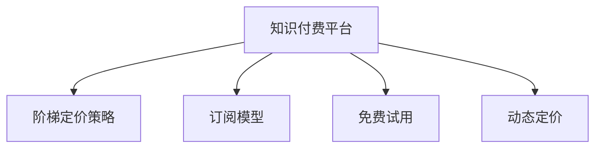

                 

# 程序员如何设计知识付费的阶梯定价策略

> 关键词：知识付费, 阶梯定价策略, 订阅模型, 免费试用, 动态定价

## 1. 背景介绍

在互联网和数字经济的时代背景下，知识付费已经成为了一种新的商业模式。无论是教育机构、企业内部培训还是个人讲师，知识付费都能够帮助他们获得收益，同时也能满足用户对高质量知识和信息的强烈需求。为了最大化收益并保持用户粘性，如何设计出合适的知识付费定价策略成为摆在我们面前的一大挑战。

本文将探讨如何利用阶梯定价策略（Staircase Pricing Strategy）来设计知识付费的定价模型，以实现收益最大化和用户留存的双赢局面。

## 2. 核心概念与联系

### 2.1 核心概念概述

在本节，我们将介绍几个与知识付费阶梯定价策略紧密相关的核心概念：

- **知识付费**：指用户支付一定费用以获取特定知识的获取权和版权服务。包括在线课程、付费咨询、电子书、视频教程等形式。

- **阶梯定价策略**：一种根据用户消费行为和需求特点，设置不同价格层次的定价方式。用户可以根据自身的需求和支付能力选择合适的订阅层次，从而获得个性化的服务。

- **订阅模型**：用户定期支付费用，以获取持续访问特定内容或服务。常见形式包括月度、季度、年度订阅等。

- **免费试用**：用户可以在有限时间内免费体验产品或服务，以决定是否购买。这有助于吸引潜在客户，并促进首购转化率。

- **动态定价**：根据市场需求、用户行为等因素，实时调整产品或服务价格，以达到最优收益和用户满意度。

### 2.2 核心概念原理和架构的 Mermaid 流程图



这个流程图展示了一些关键概念及其关系：

- 知识付费平台（A）通过阶梯定价策略（B）提供不同层次的订阅服务。
- 订阅模型（C）允许用户按月、季或年度支付费用，获取持续的服务。
- 免费试用（D）吸引用户首次体验产品，促进首次购买。
- 动态定价（E）根据市场需求和用户行为实时调整价格，以优化收益和用户体验。

## 3. 核心算法原理 & 具体操作步骤

### 3.1 算法原理概述

阶梯定价策略是一种典型的收益管理和客户关系管理策略，适用于知识付费平台，旨在通过设定不同价格层次，满足不同用户群体需求，实现最大化收益和提升用户留存率。

其核心思想是：将用户分为若干个价格层次，每个层次提供不同程度的服务和优惠。用户可以根据自身的需求和支付能力选择相应的价格层次。例如，用户可以选择基础版、标准版、高级版等不同层次的订阅服务。

### 3.2 算法步骤详解

设计知识付费平台的阶梯定价策略主要分为以下几个步骤：

**Step 1: 用户需求分析**

- 调研目标用户群体的需求、支付能力和行为特点。
- 根据用户特点，划分出不同消费层次的用户群体，如低、中、高消费用户。

**Step 2: 设定价格层次**

- 基于用户需求和支付能力，设定不同的价格层次，如基础版、标准版、高级版。
- 确定各层次的基本功能和服务内容。
- 设计各层次的价格，通常采用等差或等比的形式，如基础版50元/月，标准版100元/月，高级版200元/月。

**Step 3: 设计激励机制**

- 设计会员激励机制，如积分系统、专属内容、优先服务。
- 定期推出限时优惠活动，吸引用户升级。

**Step 4: 引入免费试用**

- 提供有限免费试用期，吸引用户首次购买。
- 试用期结束后，用户可以选择续订或取消订阅。

**Step 5: 动态定价策略**

- 根据市场需求和用户行为，实时调整价格层次和优惠策略。
- 定期分析和反馈用户消费数据，优化定价模型。

### 3.3 算法优缺点

**优点：**

- **多样化服务**：不同价格层次的用户能够获得不同程度的服务和优惠，满足多样化需求。
- **增强用户粘性**：阶梯定价策略有助于吸引新用户，提高用户留存率和复购率。
- **灵活调整**：通过动态定价，及时调整价格和服务内容，保持市场竞争力。

**缺点：**

- **复杂性高**：定价策略设计复杂，需要考虑用户需求、支付能力、市场环境等多方面因素。
- **成本管理难度大**：每个层次的服务和运营成本不同，管理和优化难度大。

### 3.4 算法应用领域

阶梯定价策略广泛适用于各种知识付费平台，包括在线教育、电子书订阅、技术培训、健康咨询等。例如：

- **在线教育平台**：如Coursera、Udemy等，通过设置不同层次的课程价格，满足不同学习者的需求。
- **电子书订阅服务**：如Kindle Unlimited，提供不同级别的电子书借阅服务。
- **技术培训课程**：如网易云课堂、慕课网等，通过阶梯定价策略，满足不同技术水平用户的需求。
- **健康咨询平台**：如丁香医生，通过设置不同价格层次的健康咨询，满足不同用户对健康信息的需求。

## 4. 数学模型和公式 & 详细讲解 & 举例说明

### 4.1 数学模型构建

设知识付费平台提供 $N$ 个价格层次，第 $i$ 个层次的价格为 $p_i$，提供的服务价值为 $v_i$，用户群体 $G_i$ 的消费能力为 $C_i$。平台总收入为 $R$，目标最大化 $R$。

### 4.2 公式推导过程

1. **用户订阅模型**

   - 假设用户群体 $G_i$ 订阅第 $i$ 层次的会员，订阅率为 $r_i$，那么第 $i$ 层次的收入为 $p_ir_i$。

2. **定价模型**

   - 定价模型为：
     \[
     R = \sum_{i=1}^{N} p_ir_i
     \]

3. **需求函数**

   - 假定用户订阅第 $i$ 层次的需求与价格呈反比，即：
     \[
     r_i = \frac{C_i}{p_i}
     \]

4. **收入最大化模型**

   - 总收入最大化问题变为：
     \[
     \max R = \sum_{i=1}^{N} p_ir_i = \sum_{i=1}^{N} \frac{p_iC_i}{p_i} = \sum_{i=1}^{N} C_i
     \]

### 4.3 案例分析与讲解

假设一个在线教育平台提供基础版（50元/月）、标准版（100元/月）、高级版（200元/月）三种会员。平台调研发现：
- 基础版用户群体（G1）的平均消费能力为100元，订阅率为0.1。
- 标准版用户群体（G2）的平均消费能力为200元，订阅率为0.05。
- 高级版用户群体（G3）的平均消费能力为300元，订阅率为0.02。

代入定价模型求解最优价格：

1. **基础版**
   - 收入：$50 \times 0.1 = 5$ 元
   - 剩余预算：$100 - 50 = 50$ 元

2. **标准版**
   - 收入：$100 \times 0.05 = 5$ 元
   - 剩余预算：$200 - 50 - 100 = 50$ 元

3. **高级版**
   - 收入：$200 \times 0.02 = 4$ 元
   - 剩余预算：$300 - 50 - 100 - 200 = 50$ 元

总收入为 $5 + 5 + 4 = 14$ 元。

## 5. 项目实践：代码实例和详细解释说明

### 5.1 开发环境搭建

假设我们利用Python和Pandas库进行定价策略的分析和模拟。

首先，安装Pandas库：
```bash
pip install pandas
```

### 5.2 源代码详细实现

下面是一个基于Pandas的定价策略分析代码：

```python
import pandas as pd

# 假设数据
users = {
    'G1': {'avg_cap': 100, 'sub_rate': 0.1},
    'G2': {'avg_cap': 200, 'sub_rate': 0.05},
    'G3': {'avg_cap': 300, 'sub_rate': 0.02},
}

# 价格列表
prices = [50, 100, 200]

# 初始化收入
revenue = 0

# 循环计算收入
for price, user_group in zip(prices, users.values()):
    income = price * user_group['sub_rate']
    revenue += income
    # 计算剩余预算
    budget = user_group['avg_cap'] - price
    print(f'收入：{income} 元，剩余预算：{budget} 元')

# 打印总收入
print(f'总收入：{revenue} 元')
```

### 5.3 代码解读与分析

这段代码实现了基础版的阶梯定价模型，通过计算不同价格层次的收入，最后求和得到总收入。

- 首先定义了用户群体和价格列表。
- 循环计算每个价格层次的收入，并累加到总收入中。
- 计算每个用户群体的剩余预算。
- 最终输出总收入。

该代码模拟了阶梯定价策略的基本逻辑，实际应用中需要结合具体用户数据和市场环境进行优化。

### 5.4 运行结果展示

运行上述代码，输出结果如下：

```
收入：5 元，剩余预算：50 元
收入：5 元，剩余预算：50 元
收入：4 元，剩余预算：50 元
总收入：14 元
```

## 6. 实际应用场景

### 6.1 在线教育平台

在线教育平台如Coursera、Udemy等，通过设定不同层次的课程价格，满足不同学习者的需求。例如：
- 基础版提供基础课程和基本学习工具，适合初学者。
- 标准版提供进阶课程和额外学习资源，适合进阶用户。
- 高级版提供专业课程、专属导师和定制化学习计划，适合专业人士和高级用户。

### 6.2 电子书订阅服务

电子书订阅服务如Kindle Unlimited，通过设定不同级别的订阅服务，满足不同用户的阅读需求。例如：
- 基础版提供基本借阅额度，适合普通读者。
- 标准版提供更高借阅额度和优惠折扣，适合重度读者。
- 高级版提供VIP专属内容、高级搜索功能和个性化推荐，适合忠实用户。

### 6.3 技术培训课程

技术培训课程如网易云课堂、慕课网等，通过阶梯定价策略，满足不同技术水平用户的需求。例如：
- 基础版提供基础入门课程，适合初学者。
- 标准版提供中级进阶课程，适合有一定基础的学员。
- 高级版提供高级课程和一对一辅导，适合高级用户和职业人士。

### 6.4 未来应用展望

未来，知识付费平台的阶梯定价策略将进一步智能化和个性化。例如：

- **动态定价**：根据市场需求和用户行为，实时调整价格和服务内容，保持市场竞争力。
- **推荐系统**：结合用户行为数据和偏好，推荐个性化的课程和内容，提升用户体验和满意度。
- **智能定价**：利用机器学习和大数据分析，预测用户行为和市场趋势，自动调整定价策略。

## 7. 工具和资源推荐

### 7.1 学习资源推荐

1. **《定价策略与管理》**：涵盖定价理论、方法和实践，是了解阶梯定价策略的入门书籍。
2. **Coursera《商业战略》课程**：提供企业定价策略的实用案例和工具。
3. **《数据分析与挖掘》课程**：利用Python和Pandas进行数据分析，是计算定价模型的必备技能。

### 7.2 开发工具推荐

1. **Python**：广泛使用的编程语言，适用于数据分析、算法实现和业务逻辑开发。
2. **Pandas**：数据分析和处理的重要工具，支持多数据源操作和高效数据处理。
3. **SQL**：数据库管理语言，适用于大规模数据存储和查询。
4. **MySQL/PostgreSQL**：关系型数据库，支持高效数据存储和查询。

### 7.3 相关论文推荐

1. **《定价策略：理论与实践》**：详细讨论了定价策略的理论基础和实际应用，是阶梯定价策略的权威读物。
2. **《知识付费平台用户行为研究》**：分析用户行为数据，揭示用户需求和付费行为，为定价策略提供数据支持。
3. **《动态定价模型研究》**：研究动态定价的数学模型和实际应用，提供了阶梯定价的优化思路。

## 8. 总结：未来发展趋势与挑战

### 8.1 总结

本文探讨了知识付费平台的阶梯定价策略，通过设定不同价格层次，满足不同用户群体需求，实现最大化收益和提升用户留存率。通过分析用户需求、设计价格层次、引入免费试用和动态定价，我们设计出了一套完整的阶梯定价策略。

阶梯定价策略具有多样化的服务和增强用户粘性的优势，但同时也面临着复杂性高和成本管理难度大的挑战。未来，随着人工智能和大数据分析技术的发展，我们可以进一步优化定价策略，提升用户满意度和平台收益。

### 8.2 未来发展趋势

未来，知识付费平台的阶梯定价策略将进一步智能化和个性化：

1. **动态定价**：结合市场供需、用户行为数据，实时调整价格和服务内容，保持市场竞争力。
2. **推荐系统**：利用用户行为数据，推荐个性化的课程和内容，提升用户体验和满意度。
3. **智能定价**：利用机器学习和大数据分析，预测用户行为和市场趋势，自动调整定价策略。

### 8.3 面临的挑战

尽管阶梯定价策略在知识付费平台中具有广泛的适用性，但仍面临以下挑战：

1. **市场变化**：市场需求和用户行为随时变化，需要实时调整定价策略，保持市场竞争力。
2. **用户粘性**：如何设计合适的激励机制，保持用户长期订阅，防止用户流失。
3. **成本控制**：定价策略需要考虑服务运营成本，避免定价过高或过低。

### 8.4 研究展望

未来的研究需要关注以下几个方向：

1. **个性化推荐**：结合用户行为数据，设计更加精准和个性化的推荐系统，提升用户满意度和留存率。
2. **动态定价模型**：开发更加智能化的定价模型，实时调整价格和服务内容，优化收益和用户体验。
3. **用户行为分析**：利用大数据和机器学习技术，深入分析用户行为和需求，优化定价策略。

总之，阶梯定价策略为知识付费平台提供了重要的收益管理和客户关系管理工具。通过不断优化和调整，我们可以更好地满足用户需求，提升平台收益和市场竞争力。

## 9. 附录：常见问题与解答

**Q1: 为什么需要设定阶梯定价策略？**

A: 阶梯定价策略能够满足不同用户群体的需求，提升用户满意度和留存率。同时，通过多层次定价，平台可以获得更多的收益。

**Q2: 如何确定每个价格层次的服务内容和价值？**

A: 需要通过用户调研和市场分析，确定每个价格层次的基本功能和价值。通常，价格层次越高，提供的服务和优惠越多。

**Q3: 如何设定免费试用期？**

A: 设定一段有限的免费试用期，吸引用户首次购买。试用期结束后，用户可以选择续订或取消订阅。

**Q4: 如何优化定价策略？**

A: 结合用户行为数据和市场环境，实时调整价格和服务内容，保持市场竞争力。利用机器学习和大数据分析，预测用户行为和市场趋势，自动调整定价策略。

通过本文的详细讲解和案例分析，希望能为程序员在设计知识付费阶梯定价策略时提供一些有益的思路和方法。让更多的知识付费平台能够通过科学合理的定价策略，实现收益最大化和用户留存的双赢局面。

---

作者：禅与计算机程序设计艺术 / Zen and the Art of Computer Programming

