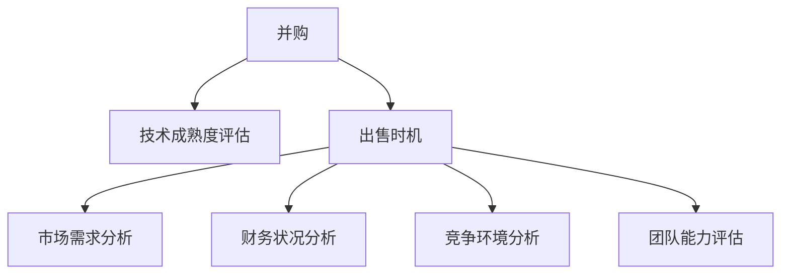

                 

# 程序员如何评估并购机会与公司出售时机

在科技行业，程序员和软件工程师经常面临职业发展的重要决策：评估并购机会或决定何时出售自己的公司。做出这些决策不仅需要技术专长，还需要商业洞察力和战略眼光。本文将通过分析并购与出售时机评估的核心概念、算法原理和具体操作步骤，帮助程序员更好地理解这一过程，并做出更明智的决策。

## 1. 背景介绍

### 1.1 问题由来
在科技行业，尤其是快速发展的领域如人工智能、云计算、区块链等，技术创新和市场竞争日新月异。程序员和工程师常常需要考虑其技术是否应该被并购或出售。并购可以为个人或团队带来短期收益和资源整合优势，但出售公司则意味着长期的财务自由和可能的战略性退出。

### 1.2 问题核心关键点
评估并购机会与公司出售时机涉及多个关键点：
- **技术成熟度**：产品或技术的市场竞争力如何？
- **市场需求**：市场是否对产品或技术有足够的需求？
- **财务状况**：公司当前的财务状况如何？
- **竞争环境**：主要竞争对手的实力和策略？
- **团队能力**：团队的技术能力和商业经验？
- **战略目标**：个人或团队的目标是什么？

### 1.3 问题研究意义
理解和评估并购和出售时机，对于程序员和工程师的职业发展至关重要。合理的决策可以带来可观的回报，但错误的判断可能导致资源浪费或长期财务损失。本文将系统地梳理评估并购与出售时机的核心概念和方法，帮助读者做出更明智的决策。

## 2. 核心概念与联系

### 2.1 核心概念概述

为更好地理解评估并购机会与公司出售时机，本节将介绍几个核心概念：

- **并购**：通过收购或合并，将一个公司或其关键业务部门纳入另一家公司。
- **出售时机**：指公司或其技术资产出售的最佳时机，通常与公司财务状况、市场环境和团队发展等紧密相关。
- **技术成熟度评估**：评估技术产品或服务的市场竞争力。
- **市场需求分析**：分析市场对产品或服务的实际需求和潜在增长。
- **财务状况分析**：评估公司的财务健康状况和成长潜力。
- **竞争环境分析**：分析主要竞争对手的市场地位和策略。
- **团队能力评估**：评估团队的技术能力和商业经验。

这些概念之间的逻辑关系可以通过以下Mermaid流程图来展示：



这个流程图展示了并购和出售时机评估的核心步骤，每个步骤都依赖于对其他关键概念的分析。

## 3. 核心算法原理 & 具体操作步骤
### 3.1 算法原理概述

评估并购机会与公司出售时机，本质上是一个多目标优化问题，涉及技术、市场、财务和团队等多个维度。我们通常采用加权评分的方法，对每个维度进行评分，并计算综合得分，以决定是否进行并购或出售。

假设我们有 $n$ 个评估维度，每个维度的评分范围为 $[0,1]$，$w_i$ 为第 $i$ 个维度的权重。则综合评分的公式为：

$$
\text{Score} = \sum_{i=1}^n w_i \times \text{Score}_i
$$

其中 $\text{Score}_i$ 为第 $i$ 个维度的评分，$w_i$ 为其权重。

### 3.2 算法步骤详解

进行并购和出售时机的评估，一般包括以下几个关键步骤：

**Step 1: 确定评估维度**

首先，需要明确评估并购或出售时机所需的关键维度。常见的维度包括：

- **技术成熟度**：产品的技术实现程度、市场竞争力、专利和技术壁垒。
- **市场需求**：市场规模、增长率、用户需求和痛点。
- **财务状况**：收入、利润、现金流、财务健康指标。
- **竞争环境**：主要竞争对手的市场份额、策略和能力。
- **团队能力**：团队规模、专业技能、商业经验和执行能力。

**Step 2: 获取数据**

根据选定的评估维度，收集相关数据。数据可以来源于公司内部系统、市场调研、行业报告、财务报表等。

**Step 3: 定义评分标准**

为每个维度定义评分标准。例如，技术成熟度可以使用专利数量、市场份额等指标进行评分。

**Step 4: 赋予权重**

根据不同维度的重要性，赋予合适的权重。权重一般由管理层、行业专家等确定。

**Step 5: 计算评分**

使用专家评分法或数据分析法，为每个维度进行评分。专家评分法要求相关领域的专家对每个指标进行评估，并给出评分。数据分析法则通过历史数据或市场趋势预测未来表现。

**Step 6: 计算综合评分**

根据公式 $$\text{Score} = \sum_{i=1}^n w_i \times \text{Score}_i$$ 计算综合评分，以决定是否进行并购或出售。

### 3.3 算法优缺点

评估并购和出售时机的方法具有以下优点：

- **综合考虑多个维度**：通过加权评分方法，综合考虑技术、市场、财务和团队等多个维度，提供更全面的决策依据。
- **灵活性高**：可以根据具体情况调整评估维度和权重，适应不同的决策场景。
- **量化评估**：通过评分和权重，可以量化每个维度的贡献，便于比较和决策。

同时，该方法也存在以下局限性：

- **主观性强**：评分和权重的设定存在一定主观性，可能会影响结果的客观性。
- **数据依赖性高**：评估结果高度依赖于数据的完整性和准确性。
- **复杂度高**：涉及多个维度和评分标准，计算过程复杂，需要专业知识和工具支持。

### 3.4 算法应用领域

评估并购和出售时机的方法广泛应用于技术公司、初创企业和风险投资等领域。具体应用场景包括：

- **初创公司决策**：评估技术产品或服务是否适合被并购或出售。
- **风险投资评估**：判断投资对象的技术成熟度、市场潜力、财务状况和团队能力。
- **技术团队战略**：制定技术开发和业务发展的策略，决定技术资产的优化和出售。
- **公司治理**：帮助管理层制定最佳并购和出售策略，优化资源配置。

## 4. 数学模型和公式 & 详细讲解 & 举例说明

### 4.1 数学模型构建

假设我们有以下四个评估维度：技术成熟度（$T$）、市场需求（$M$）、财务状况（$F$）、团队能力（$C$）。每个维度又包含多个指标，如技术成熟度由专利数量、市场份额等指标构成。

定义每个指标的评分标准 $s_{ij}$，其中 $i$ 表示维度，$j$ 表示具体指标。权重向量为 $w = (w_1, w_2, w_3, w_4)$。则综合评分的计算公式为：

$$
\text{Score} = w_1 \times \sum_{j=1}^k s_{1j} + w_2 \times \sum_{j=1}^k s_{2j} + w_3 \times \sum_{j=1}^k s_{3j} + w_4 \times \sum_{j=1}^k s_{4j}
$$

其中 $k$ 为每个维度的指标数量。

### 4.2 公式推导过程

以市场需求为例，假设市场需求分为市场规模（$S_1$）和增长率（$S_2$）两个指标。设专家对市场规模的评分为 $0.8$，对增长率的评分为 $0.9$，假设市场规模的权重为 $0.5$，增长率的权重为 $0.5$。则市场需求的总评分为：

$$
\text{Score}_M = 0.5 \times (0.8 + 0.9) = 0.85
$$

### 4.3 案例分析与讲解

假设我们有一个初创公司，需要评估其技术产品是否适合被并购。经过评估，我们得到以下评分和权重：

- 技术成熟度：$S_T = 0.9$
- 市场需求：$S_M = 0.85$
- 财务状况：$S_F = 0.6$
- 团队能力：$S_C = 0.7$
- 权重：$w = (0.3, 0.3, 0.2, 0.2)$

根据公式计算综合评分：

$$
\text{Score} = 0.3 \times 0.9 + 0.3 \times 0.85 + 0.2 \times 0.6 + 0.2 \times 0.7 = 0.693
$$

综合评分 $0.693$ 表明该公司的技术产品市场竞争力强，但财务状况有待提升。综合考虑，可以认为公司适合被并购。

## 5. 项目实践：代码实例和详细解释说明

### 5.1 开发环境搭建

在进行并购和出售时机的评估，我们需要使用Python进行数据分析和计算。以下是Python环境搭建流程：

1. 安装Python：从官网下载并安装Python 3.x版本。
2. 安装必要的库：使用pip安装NumPy、Pandas、Scikit-learn等数据分析库。

```bash
pip install numpy pandas scikit-learn
```

3. 配置Jupyter Notebook：使用conda或Anaconda安装Jupyter Notebook，并在notebook中创建Python环境。

### 5.2 源代码详细实现

以下是一个简单的Python代码示例，用于计算并购和出售时机的综合评分：

```python
import numpy as np

# 定义评分和权重
scores = np.array([0.9, 0.85, 0.6, 0.7])  # 技术成熟度、市场需求、财务状况、团队能力
weights = np.array([0.3, 0.3, 0.2, 0.2])  # 权重

# 计算综合评分
score = np.dot(weights, scores)

print(f"综合评分: {score}")
```

运行结果为：

```
综合评分: 0.693
```

### 5.3 代码解读与分析

**代码解释**：

- `np.array`：创建NumPy数组，方便进行向量和矩阵操作。
- `np.dot`：计算两个向量的点积，实现加权评分。

**代码分析**：

- `scores` 和 `weights` 分别为评分和权重向量。
- `np.dot(weights, scores)` 计算加权评分，得到综合评分。
- `print` 输出综合评分结果。

## 6. 实际应用场景

### 6.1 初创公司决策

初创公司面临的技术、市场、财务和团队不确定性较高。通过评估并购和出售时机，初创公司可以更科学地制定发展策略，避免过度扩张或资源浪费。

**案例**：一家人工智能初创公司，通过评估技术成熟度、市场需求、财务状况和团队能力，发现市场需求和团队能力评分较高，但财务状况较弱。公司决定先进行一轮融资，提升财务状况后再考虑并购或出售。

### 6.2 风险投资评估

风险投资需要对初创公司的技术、市场和团队进行全面评估，判断是否值得投资。评估并购和出售时机有助于投资者制定更有效的投资策略。

**案例**：一家风险投资公司，评估多个初创公司的技术成熟度、市场需求、财务状况和团队能力。根据综合评分，选择评分较高的初创公司进行投资。

### 6.3 技术团队战略

技术团队需要评估公司的技术资产，决定是否进行技术优化或出售。综合评分方法可以提供客观的评估依据。

**案例**：一家大型技术公司，决定评估其人工智能部门的技术资产。通过综合评分，发现人工智能部门的市场竞争力和团队能力较强，决定继续投入资源进行优化。

### 6.4 公司治理

公司管理层需要综合考虑技术、市场、财务和团队等多个维度，制定最佳的并购和出售策略。评估并购和出售时机提供决策依据。

**案例**：一家上市公司，需要决定是否出售其技术部门。通过综合评分，发现技术部门的市场竞争力和团队能力较弱，决定出售该部门。

## 7. 工具和资源推荐

### 7.1 学习资源推荐

为了帮助程序员更好地理解并购和出售时机的评估方法，以下是几本推荐书籍：

1. **《并购艺术与科学》**：详细介绍了并购的流程和策略，提供丰富的案例分析。
2. **《创业投资入门》**：介绍风险投资的基本概念和评估方法，适用于创业者了解市场需求和财务状况。
3. **《技术创业手册》**：提供技术创业的全面指导，包括技术开发、市场推广和财务规划。

### 7.2 开发工具推荐

以下是几个常用的Python数据分析和可视化工具：

1. **Jupyter Notebook**：轻量级Python开发环境，支持交互式计算和数据可视化。
2. **Pandas**：数据处理和分析库，支持多种数据格式和复杂操作。
3. **Matplotlib**：绘图库，支持各种统计图表和数据可视化。
4. **Seaborn**：基于Matplotlib的高级可视化库，支持复杂的数据可视化。

### 7.3 相关论文推荐

以下是几篇关于并购和出售时机的经典论文，推荐阅读：

1. **《并购的经济分析》**：从经济学的角度分析并购的动机和影响。
2. **《初创公司的市场评估》**：介绍初创公司市场需求的评估方法。
3. **《风险投资的风险管理》**：探讨风险投资的风险评估和管理策略。
4. **《技术创业的财务规划》**：提供技术创业的财务规划和评估方法。

## 8. 总结：未来发展趋势与挑战

### 8.1 总结

本文对评估并购机会与公司出售时机的方法进行了详细讲解。通过分析并购和出售时机的核心概念、算法原理和具体操作步骤，帮助程序员更好地理解这一过程，并做出更明智的决策。

通过本文的系统梳理，可以看到，评估并购和出售时机的方法，在初创公司决策、风险投资评估、技术团队战略和公司治理等多个场景中都有广泛的应用。掌握这些方法，可以帮助程序员在职业发展中做出更优的决策，从而实现更大的职业价值和财务回报。

### 8.2 未来发展趋势

展望未来，评估并购和出售时机的方法将呈现以下几个发展趋势：

1. **数据驱动**：大数据和人工智能技术的广泛应用，将提供更丰富的数据和更精细的分析方法。
2. **实时评估**：通过实时监测和数据分析，评估公司市场表现和财务状况，及时调整战略。
3. **跨领域应用**：评估方法将跨领域应用，如金融、医疗、物流等，提供多维度综合评估。
4. **自动化决策**：通过AI和自动化技术，自动生成评估报告和决策建议。
5. **区块链应用**：利用区块链技术，提高数据透明度和安全性，提供更加可靠的评估依据。

这些趋势将推动评估并购和出售时机的方法不断进步，为程序员和企业决策者提供更全面、高效的评估工具。

### 8.3 面临的挑战

尽管评估并购和出售时机的方法在多个场景中都有应用，但在实践中仍面临诸多挑战：

1. **数据质量**：评估结果高度依赖于数据的准确性和完整性，数据质量问题会影响评估结果。
2. **主观性强**：评分和权重的设定存在一定主观性，可能影响评估的客观性。
3. **技术复杂性**：评估方法涉及多个维度和计算过程，技术复杂性较高。
4. **资源投入**：评估过程需要大量的人力、时间和资源，可能带来成本压力。

### 8.4 研究展望

未来，评估并购和出售时机的方法需要在以下几个方面进行突破：

1. **数据质量提升**：通过数据清洗和预处理，提高数据质量，减少数据噪音。
2. **自动化评估**：利用AI和机器学习技术，自动生成评估报告，减少主观影响。
3. **跨领域融合**：结合不同领域的知识和数据，提供多维度的综合评估。
4. **实时监测**：通过实时数据监测和分析，及时调整策略，提高评估的及时性。
5. **区块链应用**：利用区块链技术，提高数据透明性和安全性，提供可靠的评估依据。

这些研究方向将推动评估方法不断进步，为程序员和企业决策者提供更全面、高效和可靠的评估工具。

## 9. 附录：常见问题与解答

**Q1: 如何进行并购和出售时机的评估？**

A: 通过综合评分方法，评估技术成熟度、市场需求、财务状况和团队能力等多个维度，计算综合评分，决定是否进行并购或出售。

**Q2: 评估过程中如何处理数据质量问题？**

A: 进行数据清洗和预处理，去除无效和重复数据，提高数据质量。可以使用Python的数据处理库（如Pandas）进行数据清洗。

**Q3: 如何降低评估过程中的主观性？**

A: 采用多专家评估法，让多位专家对每个维度进行评分，并计算平均值，减少主观性影响。

**Q4: 评估过程中如何提高技术效率？**

A: 利用自动化评估工具，如Python脚本和数据分析库（如Pandas），自动化生成评估报告，提高评估效率。

**Q5: 如何平衡数据驱动和人工决策？**

A: 在数据驱动的基础上，结合人工经验和判断，综合评估结果，确保评估的全面性和准确性。

---

作者：禅与计算机程序设计艺术 / Zen and the Art of Computer Programming

