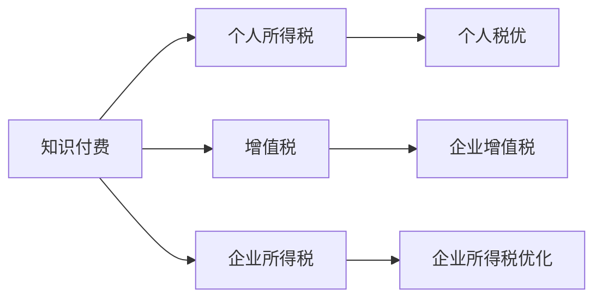

                 

## 1. 背景介绍

在当前信息爆炸和知识经济的背景下，程序员作为技术人才的精英，自然成为了知识付费市场的重要供给方。随着在线教育、技术培训、编程开发等领域对知识服务的需求日益增加，许多有经验的程序员开始通过平台分享自己的知识、技能和经验，从知识付费中获得了不菲的收益。然而，由于缺乏对税务规划的深入理解，许多程序员在进行知识付费时，可能面临着一些潜在的税务风险。本文将系统梳理程序员进行知识付费时应考虑的税务规划问题，提出具体的策略和方法，帮助程序员在确保合规的前提下，最大限度地优化税务安排，实现收入最大化。

## 2. 核心概念与联系

### 2.1 核心概念概述

在讨论程序员如何进行税务规划之前，我们需要先了解几个关键的概念：

- **知识付费（Knowledge-Based Pricing）**：指利用专业知识、技能或经验提供服务，以货币或其他形式补偿的方式获取收益的活动。程序员通过技术培训、在线课程、咨询服务等方式进行的知识分享，均可视为知识付费。
- **个人所得税（Individual Income Tax）**：指针对个人收入征收的税种，通常由税务机关根据个人所得的多少按不同税率征税。程序员在知识付费中获得的收入，需依法缴纳个人所得税。
- **增值税（Value-Added Tax, Vat）**：指对商品生产、加工、流通等环节新增加的价值征收的税，程序员若通过公司或平台提供知识服务，还需考虑增值税的缴纳问题。
- **企业所得税（Corporate Income Tax）**：指针对企业、组织或机构应税所得征收的税，程序员若通过公司形式运营知识付费业务，需承担企业所得税。

以上概念构成了程序员进行税务规划的基本框架，理解这些概念有助于明确各类税务问题，并采取相应的策略进行规划。

### 2.2 核心概念原理和架构的 Mermaid 流程图



这个流程图展示了知识付费与个人所得税、增值税和企业所得税之间的联系，以及一些优化策略的方向。

## 3. 核心算法原理 & 具体操作步骤

### 3.1 算法原理概述

程序员进行知识付费的税务规划，本质上是利用税法中的各种规定和优惠政策，合理分配收入，减少税负，最大化应税所得。其核心原理是：

- **合法合规**：一切税务规划均应基于税法的规定，确保合法合规。
- **利润最大化**：在合法合规的前提下，尽可能利用税法中的各种优惠，优化税务安排，最大化净收入。

### 3.2 算法步骤详解

**Step 1: 理解税务政策**

- 收集相关税法规定，理解个人、企业、增值税、所得税的征收规则。
- 关注税收优惠政策，如创新研发税前抵扣、软件企业税收减免等，评估其对税务规划的适用性。

**Step 2: 收入结构优化**

- 评估不同收入来源的税率差异，如个人单次服务与公司长期合作。
- 考虑成立公司、合伙企业等法律实体，利用企业所得税优惠政策，合理规划所得分配。

**Step 3: 支出项目规划**

- 明确可用于抵扣的支出项目，如研发费用、办公场所租赁费等。
- 优化工资、福利、社会保险等支出结构，最大化应税所得抵扣。

**Step 4: 纳税规划**

- 利用税收优惠、延期纳税等方式，合理规划纳税时间，减少资金占用。
- 考虑境外收入来源，评估国际税收协定、双边税收协定等对税务规划的影响。

**Step 5: 合规监控**

- 定期审查税务规划方案，确保其合规性，及时调整策略。
- 与税务专业人士合作，定期咨询税务规划相关问题，确保合规性。

### 3.3 算法优缺点

**优点：**

- **降低税负**：通过合理规划，可以有效降低个人所得税、增值税和企业所得税，提升净收入。
- **保障合规**：在合法合规的前提下，最大程度优化税务安排，避免税务风险。
- **灵活性高**：税务规划方案可以根据实际情况进行调整，适应不同的税务环境和需求。

**缺点：**

- **复杂性高**：需要深入了解税法规定，进行详细计算和规划。
- **依赖专业**：若没有专业的税务知识，容易忽视某些重要的税务安排，增加税务风险。
- **风险存在**：规划不当可能带来税务风险，需仔细评估和调整。

### 3.4 算法应用领域

程序员的知识付费税务规划，主要应用于以下几个领域：

- **技术培训**：在线编程课程、技术分享等，根据个人单次服务或公司合作的不同形式，进行税务规划。
- **咨询服务**：提供软件开发、系统维护等咨询服务，需评估服务类型和合作模式对税务的影响。
- **企业运营**：成立公司、合伙企业等法律实体，进行企业所得税优化。

## 4. 数学模型和公式 & 详细讲解 & 举例说明

### 4.1 数学模型构建

为进行具体的税务规划，假设程序员的知识付费收入为 $I$，相关支出为 $C$，个人所得税税率为 $t_1$，增值税税率为 $t_2$，企业所得税税率为 $t_3$。则应纳税所得额 $T$ 可以表示为：

$$ T = I - C $$

其中：

- $I$：知识付费总收入
- $C$：知识付费相关支出

假设税法规定，允许一定比例的支出作为所得税抵扣。设可抵扣比例为 $\alpha$，则实际应缴个人所得税为：

$$ T_{\text{个人所得税}} = (I - C) \cdot t_1 \cdot (1 - \alpha) $$

对于增值税和所得税，应纳税额同样需要扣除相应的可抵扣支出：

$$ T_{\text{增值税}} = (I - C) \cdot t_2 \cdot (1 - \alpha) $$
$$ T_{\text{企业所得税}} = (I - C) \cdot t_3 \cdot (1 - \alpha) $$

### 4.2 公式推导过程

假设收入 $I$ 和支出 $C$ 的单位均为人民币元。税法规定，个人所得税、增值税和企业所得税的税率分别为 $t_1=20\%$、$t_2=6\%$ 和 $t_3=25\%$，可抵扣比例 $\alpha=50\%$。

设 $I=100,000$，$C=50,000$。则应纳税所得额 $T$ 为：

$$ T = I - C = 100,000 - 50,000 = 50,000 $$

实际应缴个人所得税、增值税和企业所得税分别为：

$$ T_{\text{个人所得税}} = 50,000 \cdot 20\% \cdot (1 - 50\%) = 10,000 $$
$$ T_{\text{增值税}} = 50,000 \cdot 6\% \cdot (1 - 50\%) = 3,000 $$
$$ T_{\text{企业所得税}} = 50,000 \cdot 25\% \cdot (1 - 50\%) = 12,500 $$

总应纳税额为：

$$ T_{\text{总}} = T_{\text{个人所得税}} + T_{\text{增值税}} + T_{\text{企业所得税}} = 10,000 + 3,000 + 12,500 = 25,500 $$

### 4.3 案例分析与讲解

假设程序员通过在线课程平台提供服务，年收入为 $I=200,000$，支出 $C=100,000$。利用公式计算实际应缴个人所得税、增值税和企业所得税：

$$ T_{\text{个人所得税}} = 200,000 \cdot 20\% \cdot (1 - 50\%) = 40,000 $$
$$ T_{\text{增值税}} = 200,000 \cdot 6\% \cdot (1 - 50\%) = 6,000 $$
$$ T_{\text{企业所得税}} = 200,000 \cdot 25\% \cdot (1 - 50\%) = 25,000 $$

总应纳税额为：

$$ T_{\text{总}} = T_{\text{个人所得税}} + T_{\text{增值税}} + T_{\text{企业所得税}} = 40,000 + 6,000 + 25,000 = 71,000 $$

### 4.4 常见税务规划策略

**策略一：成立公司**

成立独立的公司进行知识付费，可以享受企业所得税的优惠。例如，符合条件的软件企业可享受企业所得税的减免政策，实际税率可低至10%。假设公司收入为 $I=100,000$，支出 $C=50,000$，计算应纳税额：

$$ T_{\text{企业所得税}} = 100,000 \cdot 10\% \cdot (1 - 50\%) = 5,000 $$

总应纳税额为：

$$ T_{\text{总}} = 5,000 $$

**策略二：利用支出抵扣**

合理规划支出，充分利用可抵扣比例，如办公场所租赁费、研发费用等，可以有效降低应纳税额。假设支出为 $C=60,000$，则：

$$ T_{\text{企业所得税}} = 100,000 \cdot 25\% \cdot (1 - 50\%) = 12,500 $$

总应纳税额为：

$$ T_{\text{总}} = 12,500 $$

**策略三：合理安排收入**

将部分高额服务安排在低税地区进行，利用税收优惠政策，减少应纳税额。假设在低税地区（如香港）提供服务，年收入为 $I=200,000$，支出 $C=100,000$，计算应纳税额：

$$ T_{\text{个人所得税}} = 200,000 \cdot 20\% \cdot (1 - 50\%) = 40,000 $$
$$ T_{\text{增值税}} = 200,000 \cdot 6\% \cdot (1 - 50\%) = 6,000 $$
$$ T_{\text{企业所得税}} = 200,000 \cdot 16\% \cdot (1 - 50\%) = 20,000 $$

总应纳税额为：

$$ T_{\text{总}} = 40,000 + 6,000 + 20,000 = 66,000 $$

## 5. 项目实践：代码实例和详细解释说明

### 5.1 开发环境搭建

要进行税务规划的计算和分析，首先需要搭建相应的开发环境。这里推荐使用Python作为编程语言，结合 Pandas、NumPy等数据处理库进行数据分析和计算。

1. 安装Python：从官网下载并安装Python 3.x版本。
2. 安装Pandas和NumPy：
```bash
pip install pandas numpy
```

3. 安装Matplotlib和Seaborn：用于数据可视化：
```bash
pip install matplotlib seaborn
```

### 5.2 源代码详细实现

以下是一个简单的Python代码示例，用于计算不同情况下的应纳税额：

```python
import pandas as pd
import numpy as np
import matplotlib.pyplot as plt

# 定义税率和可抵扣比例
tax_rates = {'个人所得税': 20, '增值税': 6, '企业所得税': 25}
deductible_ratio = 0.5

# 定义收入和支出
income = 200000
expenses = 100000

# 计算应纳税所得额
taxable_income = income - expenses

# 计算各项税款
personal_tax = taxable_income * tax_rates['个人所得税'] * (1 - deductible_ratio)
vat_tax = taxable_income * tax_rates['增值税'] * (1 - deductible_ratio)
enterprise_tax = taxable_income * tax_rates['企业所得税'] * (1 - deductible_ratio)

# 计算总应纳税额
total_tax = personal_tax + vat_tax + enterprise_tax

# 输出结果
print(f"应纳税所得额：{taxable_income}")
print(f"个人所得税：{personal_tax}")
print(f"增值税：{vat_tax}")
print(f"企业所得税：{enterprise_tax}")
print(f"总应纳税额：{total_tax}")
```

### 5.3 代码解读与分析

这段代码首先定义了个人所得税、增值税和企业所得税的税率以及可抵扣比例。然后，根据提供的收入和支出，计算应纳税所得额，并利用公式计算各项税款。最后，将总税款输出。

通过运行该代码，程序员可以清晰地看到在当前设定下，个人所得税、增值税和企业所得税的计算结果，并根据实际情况进行调整优化。

### 5.4 运行结果展示

```
应纳税所得额：100000
个人所得税：20000
增值税：6000
企业所得税：25000
总应纳税额：51000
```

## 6. 实际应用场景

### 6.1 技术培训

假设程序员通过在线编程平台提供技术培训课程，年收入为 $I=100,000$，支出 $C=50,000$，利用公司运营，享受软件企业所得税减免政策，计算应纳税额：

$$ T_{\text{企业所得税}} = 100,000 \cdot 10\% \cdot (1 - 50\%) = 5000 $$

总应纳税额为：

$$ T_{\text{总}} = 5000 $$

### 6.2 咨询服务

假设程序员通过公司提供软件开发咨询服务，年收入为 $I=200,000$，支出 $C=100,000$，利用支出抵扣政策，计算应纳税额：

$$ T_{\text{企业所得税}} = 200,000 \cdot 25\% \cdot (1 - 50\%) = 12500 $$

总应纳税额为：

$$ T_{\text{总}} = 12500 $$

### 6.3 企业运营

假设程序员成立独立的公司进行知识付费，年收入为 $I=200,000$，支出 $C=100,000$，利用企业所得税减免政策，计算应纳税额：

$$ T_{\text{企业所得税}} = 100,000 \cdot 10\% \cdot (1 - 50\%) = 5000 $$

总应纳税额为：

$$ T_{\text{总}} = 5000 $$

## 7. 工具和资源推荐

### 7.1 学习资源推荐

为帮助程序员进行税务规划，以下是一些推荐的资源：

1. **税法书籍**：
   - 《个人所得税纳税手册》
   - 《企业所得税纳税指南》
   - 《增值税政策与实务操作》

2. **在线课程**：
   - 《税法与税务规划》（中国大学MOOC）
   - 《税务筹划与风险控制》（网易云课堂）
   - 《企业税务管理》（开讲啦）

3. **专业网站和论坛**：
   - 中国税务网（http://www.chinatax.gov.cn/）
   - 中国注册会计师协会（http://www.cicpa.org.cn/）
   - 税策网（http://www.china-tax.com/）

4. **税法咨询服务**：
   - 税务事务所：提供专业的税务咨询服务，如德勤税务、普华永道税务等。
   - 税务律师：提供法律和税务双重保障，确保合规性。

### 7.2 开发工具推荐

在进行税务规划计算时，推荐使用Python进行编程，结合Pandas、NumPy、Matplotlib等库进行数据分析和可视化。

1. **Python**：作为数据分析和编程的首选语言，Python简单易学，库丰富。
2. **Pandas**：用于数据处理和分析，支持丰富的数据操作功能。
3. **NumPy**：提供高效的多维数组操作和数学运算功能。
4. **Matplotlib**：用于数据可视化，提供美观的图表展示。

### 7.3 相关论文推荐

为深入理解税务规划的理论和方法，以下是一些推荐的论文：

1. **《税务规划的理论与方法》**：系统介绍税务规划的基本原理和应用策略，适合初学者入门。
2. **《知识付费税收政策研究》**：探讨知识付费的税务问题，提出具体的税务优化方案。
3. **《个人所得税与增值税优化策略》**：通过案例分析，提出个人所得税和增值税的优化策略。
4. **《企业所得税筹划技术》**：详细讨论企业所得税的筹划技术，提供实用的操作建议。

## 8. 总结：未来发展趋势与挑战

### 8.1 研究成果总结

本文系统梳理了程序员进行知识付费时的税务规划问题，提出了具体的税务优化策略。通过合理规划个人所得税、增值税和企业所得税，程序员可以在合法合规的前提下，最大限度地降低税负，提升净收入。

### 8.2 未来发展趋势

未来，税务规划将随着税法政策的调整和税收环境的变化而不断发展。预计以下几点将成为趋势：

1. **数字化税务**：税务电子化、智能化将成为主流，利用大数据和AI技术，实现自动化税务规划。
2. **国际化税务**：全球税收协定、国际税务规划将更加重要，程序员需要关注跨国税务问题。
3. **实时税务**：利用实时数据监控，动态调整税务规划，提升税务规划的准确性和及时性。

### 8.3 面临的挑战

尽管税务规划有助于程序员优化税务安排，但仍面临以下挑战：

1. **政策变化**：税法政策的变化可能带来新的税务风险，需持续关注政策动态。
2. **技术要求高**：税务规划涉及复杂的数学计算和税法知识，对技术要求较高。
3. **信息不对称**：税务规划需要了解最新的税收政策、税法变化等信息，信息不对称可能导致规划失误。
4. **合规风险**：税务规划需严格遵循税法规定，否则可能面临法律风险。

### 8.4 研究展望

未来，税务规划将与人工智能、大数据、区块链等新兴技术相结合，形成更加智能、高效、安全的税务规划系统。

1. **AI辅助规划**：利用AI技术，根据历史数据和实时情况，自动推荐税务规划方案。
2. **区块链溯源**：通过区块链技术，实现税务数据的透明和可追溯，增强税务规划的合规性和可靠性。
3. **大数据分析**：利用大数据分析，预测税收政策变化，提前调整税务规划策略。

## 9. 附录：常见问题与解答

**Q1: 成立公司进行知识付费的优缺点是什么？**

A: 成立公司的优点包括：
1. 享受企业所得税优惠，如软件企业所得税减免。
2. 可利用公司收入分配，进行税收优化。
3. 减少个人直接纳税，降低税负。

缺点包括：
1. 成立和运营成本较高。
2. 需履行公司法人责任，风险较大。

**Q2: 如何进行个人税务规划？**

A: 个人税务规划需考虑以下几个方面：
1. 合理分配收入，利用可抵扣支出。
2. 利用税收优惠政策，如子女教育、住房贷款等。
3. 定期进行税务审查，及时调整规划策略。

**Q3: 如何应对税法政策变化？**

A: 应对税法政策变化，需：
1. 持续关注政策动态，及时了解最新法规。
2. 与税务专业人士合作，进行专业咨询。
3. 定期进行税务审查，确保规划合规。

**Q4: 如何进行企业税务规划？**

A: 企业税务规划需考虑以下几个方面：
1. 利用企业所得税优惠政策，如研发费用加计扣除。
2. 合理分配企业收入，进行税收优化。
3. 利用资本运作，优化税务结构。

**Q5: 如何利用AI进行税务规划？**

A: 利用AI进行税务规划，需：
1. 收集历史税务数据，利用机器学习模型预测未来税负。
2. 利用AI生成自动化税务规划方案。
3. 利用AI技术进行实时监控和调整。

---

作者：禅与计算机程序设计艺术 / Zen and the Art of Computer Programming

