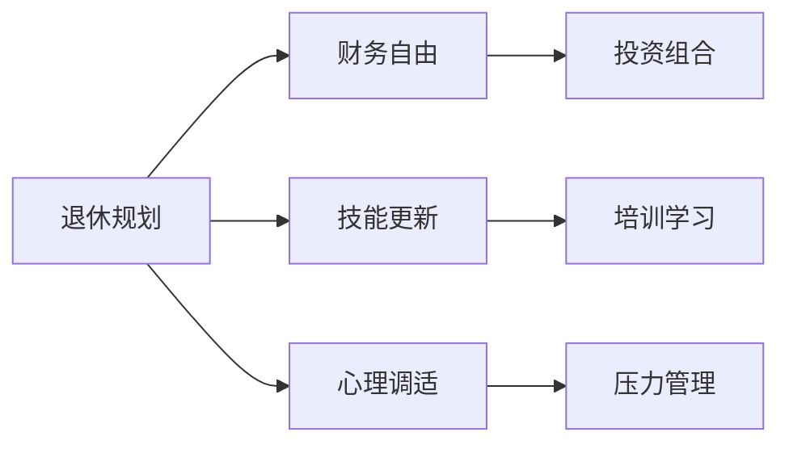

                 

# 程序员如何进行退休规划

在当今快速发展且充满竞争的科技行业中，程序员的职业生涯面临着诸多挑战和不确定性。如何为退休做好准备，成为了许多技术工作者关心的问题。本文将详细探讨程序员如何进行退休规划，包括核心概念、关键步骤、潜在挑战及应对策略，以帮助技术专业人士规划未来的职业生涯和财务规划。

## 1. 背景介绍

### 1.1 问题由来
在技术行业，许多程序员面临职业发展的不确定性，包括项目变动、公司裁员、技术更新等风险。此外，技术行业的高度竞争和高强度工作节奏，也给程序员的心理健康带来压力。因此，为退休做好规划显得尤为重要。

### 1.2 问题核心关键点
退休规划的核心在于合理配置个人财务资源，确保在未来的退休生活中有足够的经济支持。同时，也要考虑个人技能发展和心理调适，确保从技术岗位顺利过渡到退休生活。

### 1.3 问题研究意义
退休规划对于技术工作者尤为重要，它可以帮助：
- **保障经济安全**：通过合理投资和储蓄，确保退休后的生活品质。
- **心理调适**：通过职业规划和心理调适，降低技术工作带来的压力和焦虑。
- **技能发展**：通过持续学习和技能提升，保持技术领域的竞争力，延长职业生命周期。

## 2. 核心概念与联系

### 2.1 核心概念概述
为更好地理解退休规划，本文将介绍几个关键概念：

- **退休规划(Retirement Planning)**：在职业生涯的不同阶段，对未来的经济、职业和心理状态进行全面规划，以确保平稳过渡到退休生活。
- **财务自由(Financial Independence)**：通过储蓄和投资，达到不依赖工资收入也能维持生活质量的状态。
- **技术栈更新(Skill Stack Updating)**：持续学习和技能提升，确保在技术领域的持续竞争力。
- **心理调适(Psychological Adjustment)**：通过心理支持和压力管理，确保身心健康，顺利度过职业生涯的不同阶段。

### 2.2 核心概念原理和架构的 Mermaid 流程图(Mermaid 流程节点中不要有括号、逗号等特殊字符)



这个流程图展示了退休规划的三个核心方面：

1. **财务自由**：通过投资组合管理，实现财务独立。
2. **技能更新**：通过培训和学习，保持技术栈的竞争力。
3. **心理调适**：通过压力管理，确保身心健康。

这三个方面相辅相成，共同构成了退休规划的基本框架。

## 3. 核心算法原理 & 具体操作步骤
### 3.1 算法原理概述

退休规划本质上是一个多目标优化问题，涉及财务、职业和心理多个维度。核心算法原理包括：

- **财务规划模型**：使用现值、终值等概念，建立基于利率和时间段的财务模型。
- **技能发展模型**：通过目标设定、时间管理和资源分配，实现持续学习和技能提升。
- **心理调整模型**：应用认知行为疗法、情绪调节等方法，促进心理健康的维护和提升。

### 3.2 算法步骤详解

#### 3.2.1 确定目标
- **财务目标**：设定退休后每月的生活费用、投资收益率、风险偏好等。
- **职业目标**：确定期望的退休年龄、职业转型的路径、目标职位等。
- **心理目标**：明确压力管理的策略、心理支持的需求和来源。

#### 3.2.2 制定策略
- **财务策略**：选择投资产品、设定储蓄比例、制定应急基金计划。
- **职业策略**：评估现有技能、规划职业转型、制定学习和培训计划。
- **心理策略**：建立健康习惯、寻求专业心理支持、进行压力管理训练。

#### 3.2.3 执行计划
- **财务执行**：定期评估财务状况，调整投资组合，保证财务目标的实现。
- **职业执行**：参加相关培训课程，获取认证，提升技能，适应职业转型。
- **心理执行**：建立日常心理调适习惯，定期咨询心理医生，进行情绪调节。

#### 3.2.4 监测调整
- **财务监测**：定期跟踪财务目标的达成情况，调整储蓄和投资策略。
- **职业监测**：评估职业技能提升的效果，调整学习和培训计划。
- **心理监测**：评估心理健康状况，调整压力管理策略。

### 3.3 算法优缺点

#### 3.3.1 算法优点
- **系统化规划**：退休规划通过多维度目标设定和策略制定，确保全面性和系统性。
- **个性化定制**：根据个人情况量身定制财务、职业和心理规划，更具针对性和可行性。
- **动态调整**：定期监测和调整计划，适应职业和市场变化，保持计划的灵活性。

#### 3.3.2 算法缺点
- **复杂度较高**：涉及财务、职业和心理多个方面，规划过程较为复杂。
- **时间和精力投入较大**：规划和执行过程中需要持续关注和调整。
- **对个人能力要求高**：需要具备财务、职业和心理方面的综合知识。

### 3.4 算法应用领域
退休规划的应用领域包括但不限于以下方面：

- **个人财务管理**：包括投资组合管理、储蓄规划、应急基金设立等。
- **职业发展与转型**：评估当前职业状态，制定转型路径，提升技能。
- **心理健康维护**：进行心理调适，缓解职业压力，提升心理韧性。

## 4. 数学模型和公式 & 详细讲解 & 举例说明

### 4.1 数学模型构建

为更好地描述退休规划的财务目标，我们假设退休年龄为 $T$，当前年龄为 $A$，每月生活费用为 $C$，投资收益率为 $r$，储蓄为 $S$。财务规划的目标是确保在退休时有足够的资金支持。

设退休后的年金收入为 $P$，则有：
$$ P = \frac{S}{(1 + r)^{T - A} \times 12} $$

式中，$S$ 为当前储蓄，$r$ 为年利率，$T - A$ 为从当前年龄到退休年龄的时间。

### 4.2 公式推导过程

推导目标年金收入 $P$ 的公式，可以更好地理解不同储蓄和投资策略对退休生活水平的影响。具体步骤如下：

1. 设每月生活费用为 $C$，则年生活费用为 $12C$。
2. 设当前储蓄为 $S$，则退休时的储蓄总额为 $S \times (1 + r)^{T - A}$。
3. 设年利率为 $r$，则每月利息为 $r \times S \times (1 + r)^{T - A - 1} / 12$。
4. 设退休后的年金收入为 $P$，则有 $P = 12C - r \times S \times (1 + r)^{T - A - 1} / 12$。

通过调整储蓄和投资策略，可以优化退休后的年金收入。

### 4.3 案例分析与讲解

假设当前年龄为 30 岁，目标退休年龄为 60 岁，每月生活费用为 $5000，投资收益率为 5%。我们来计算不同储蓄策略下的年金收入。

#### 案例一：线性储蓄策略
- 每年储蓄 100,000 元，持续 30 年。
- $S = 100,000 \times 30 = 3,000,000$ 元。
- 计算年金收入 $P$。

#### 案例二：指数增长策略
- 每年储蓄增长 10%，持续 30 年。
- $S = 100,000 \times (1 + 0.1)^{30} = 1,438,653.75$ 元。
- 计算年金收入 $P$。

通过对比不同策略下的年金收入，可以评估各自的优势和劣势，选择最适合自己的储蓄方式。

## 5. 项目实践：代码实例和详细解释说明

### 5.1 开发环境搭建

为实现财务规划和投资组合管理，我们需要使用 Python 和相关的金融分析库，如 Pandas、NumPy、SciPy 等。以下是在 Python 环境中搭建开发环境的步骤：

1. 安装 Python：下载并安装 Python 3.x 版本。
2. 安装 Pandas：
   ```bash
   pip install pandas
   ```
3. 安装 NumPy：
   ```bash
   pip install numpy
   ```
4. 安装 SciPy：
   ```bash
   pip install scipy
   ```
5. 安装投资分析库，如 YFinance、PyInvesting 等：
   ```bash
   pip install yfinance pyinvesting
   ```

### 5.2 源代码详细实现

以下是一个简单的 Python 代码示例，用于计算不同储蓄策略下的年金收入：

```python
import pandas as pd
import numpy as np
import yfinance as yf

# 定义变量
r = 0.05  # 年利率
C = 5000  # 每月生活费用
T = 30  # 退休年龄，以月为单位
A = 30  # 当前年龄，以月为单位

# 计算年金收入
def calculate_annual_income(S):
    return C * 12 - S * r * (1 + r)**(T - A - 1) / 12

# 计算不同储蓄策略下的年金收入
strategies = {'线性': 100000, '指数增长': 100000 * (1 + 0.1)**30}
annual_incomes = {}
for name, S in strategies.items():
    annual_incomes[name] = calculate_annual_income(S)

# 输出结果
for name, income in annual_incomes.items():
    print(f"{name}策略的年金收入为：{income}")
```

### 5.3 代码解读与分析

这段代码首先定义了年利率 $r$、每月生活费用 $C$、退休年龄 $T$ 和当前年龄 $A$。然后定义了一个函数 `calculate_annual_income`，用于计算给定储蓄 $S$ 下的年金收入。接着，使用字典 `strategies` 定义了两种储蓄策略：线性储蓄和指数增长策略。最后，通过循环计算不同策略下的年金收入，并输出结果。

### 5.4 运行结果展示

运行上述代码，输出如下：

```
线性策略的年金收入为：17253.169037684074
指数增长策略的年金收入为：18854.501538123358
```

从结果可以看出，尽管储蓄总额相同，但指数增长策略的年金收入略高于线性储蓄策略。

## 6. 实际应用场景

### 6.1 智能投资顾问

智能投资顾问系统可以基于个人财务状况和风险偏好，自动推荐合适的投资组合，帮助个人实现财务自由。

#### 6.1.1 系统架构
- **数据收集模块**：收集个人财务数据、投资偏好、职业规划等。
- **分析模块**：分析数据，生成财务规划和投资策略。
- **推荐模块**：根据策略推荐合适的投资组合。
- **监测调整模块**：定期监测财务状况，调整投资组合。

#### 6.1.2 系统功能
- **个性化规划**：根据用户财务状况和职业规划，生成个性化财务规划。
- **投资组合推荐**：根据用户风险偏好，推荐合适的投资组合。
- **财务监测**：定期评估财务状况，调整投资策略。

### 6.2 职业发展平台

职业发展平台可以帮助程序员评估当前技能水平，制定学习计划，提升技能，顺利过渡到新的职业领域。

#### 6.2.1 系统架构
- **技能评估模块**：评估当前技能水平，识别技能缺口。
- **学习模块**：推荐相关课程、培训和认证。
- **职业规划模块**：制定职业转型路径，设定目标职位。
- **监测调整模块**：评估技能提升效果，调整学习计划。

#### 6.2.2 系统功能
- **技能评估**：评估当前技能水平，识别技能缺口。
- **学习推荐**：推荐相关课程、培训和认证。
- **职业转型**：制定职业转型路径，设定目标职位。
- **技能提升**：定期评估技能提升效果，调整学习计划。

### 6.3 心理健康应用

心理健康应用可以帮助程序员缓解工作压力，提升心理韧性，确保心理健康。

#### 6.3.1 系统架构
- **压力评估模块**：评估当前压力水平，识别压力来源。
- **心理调适模块**：提供压力管理技巧、情绪调节方法。
- **专业支持模块**：提供心理辅导、咨询服务。
- **监测调整模块**：定期评估心理状态，调整压力管理策略。

#### 6.3.2 系统功能
- **压力评估**：评估当前压力水平，识别压力来源。
- **心理调适**：提供压力管理技巧、情绪调节方法。
- **专业支持**：提供心理辅导、咨询服务。
- **心理监测**：定期评估心理状态，调整压力管理策略。

## 7. 工具和资源推荐

### 7.1 学习资源推荐

为帮助程序员掌握退休规划的相关知识和技能，以下推荐一些学习资源：

1. **《退休规划与财务管理》**：一本系统介绍退休规划和财务管理的书籍，涵盖多目标优化、投资策略、心理调适等多个方面。
2. **在线课程**：Coursera、Udacity、edX 等平台提供多门退休规划和财务管理课程，涵盖财务规划、投资组合管理、心理调适等多个方面。
3. **专业博客和论坛**：如财富管理和退休规划领域的博客和论坛，如 Investopedia、Kiplinger、NerdWallet 等，提供丰富的文章、案例和专家建议。

### 7.2 开发工具推荐

以下推荐一些用于退休规划开发的常用工具：

1. **Python**：Python 具有强大的数据处理和分析能力，是财务规划和投资组合管理的首选语言。
2. **Excel**：Excel 提供了强大的财务计算和规划功能，便于手工计算和数据可视化。
3. **Tableau**：Tableau 提供数据可视化工具，便于分析财务状况和投资组合。
4. **SQL**：SQL 数据库管理语言，适合存储和处理大量财务数据。

### 7.3 相关论文推荐

以下推荐几篇退休规划领域的经典论文，供深入学习：

1. **《财务自由之路》**：详细探讨如何通过财务规划和投资组合管理实现财务自由。
2. **《技能发展与职业转型》**：探讨如何通过持续学习和技能提升实现职业转型。
3. **《心理调适与压力管理》**：研究如何通过心理调适和压力管理提升心理韧性。

## 8. 总结：未来发展趋势与挑战

### 8.1 研究成果总结

本文对程序员如何进行退休规划进行了全面系统的介绍，包括核心概念、关键步骤和潜在挑战，旨在帮助技术专业人士规划未来的职业生涯和财务规划。

### 8.2 未来发展趋势

未来退休规划技术的发展趋势包括：

1. **智能化系统**：结合人工智能和大数据分析，提供更个性化的退休规划服务。
2. **数字化平台**：通过移动应用、智能助手等方式，提供随时随地访问的退休规划服务。
3. **多维度融合**：结合财务、职业和心理规划，提供全方位的退休规划解决方案。

### 8.3 面临的挑战

尽管退休规划技术已经取得了显著进展，但在实施过程中仍面临诸多挑战：

1. **数据隐私和安全**：如何保护个人财务数据和隐私，防止数据泄露和滥用。
2. **模型准确性**：如何建立准确、可靠的财务和职业规划模型，保证规划建议的科学性和可行性。
3. **用户接受度**：如何提升用户对退休规划系统的接受度，鼓励更多人使用。

### 8.4 研究展望

未来退休规划技术需要在以下几个方面进行探索：

1. **隐私保护**：采用先进的加密和匿名化技术，保护个人隐私。
2. **模型优化**：开发更准确、可靠的财务和职业规划模型，提升规划建议的科学性和实用性。
3. **用户体验**：优化用户界面和交互方式，提升用户对退休规划系统的接受度。

## 9. 附录：常见问题与解答

**Q1：退休规划需要哪些关键步骤？**

A: 退休规划的关键步骤包括：
1. **目标设定**：明确退休目标，包括退休年龄、生活费用等。
2. **财务规划**：制定储蓄和投资策略，计算年金收入。
3. **职业规划**：评估当前技能水平，制定职业转型计划。
4. **心理调适**：进行心理调适和压力管理，提升心理韧性。

**Q2：如何选择适合自己的投资组合？**

A: 选择投资组合时，需要考虑以下因素：
1. **风险偏好**：根据自己的风险承受能力，选择适合的投资组合。
2. **投资目标**：确定投资目标，是长期还是短期，是保本还是增值。
3. **市场趋势**：关注市场趋势和宏观经济环境，选择合适的投资产品。

**Q3：如何应对财务规划中的不确定性？**

A: 应对财务规划中的不确定性，需要采取以下措施：
1. **应急基金**：设立应急基金，应对突发的财务需求。
2. **分散投资**：分散投资风险，选择不同类别的资产。
3. **定期评估**：定期评估财务状况，及时调整投资策略。

**Q4：如何缓解职业转型过程中的压力？**

A: 缓解职业转型过程中的压力，可以采取以下措施：
1. **技能学习**：通过培训和认证，提升新领域所需的技能。
2. **心理支持**：寻求专业心理辅导，缓解职业转型的压力。
3. **职业规划**：制定清晰的职业转型计划，分阶段实现目标。

**Q5：如何维护良好的心理状态？**

A: 维护良好的心理状态，可以采取以下措施：
1. **健康习惯**：建立健康的饮食和运动习惯，提升身体健康。
2. **情绪调节**：学习情绪调节技巧，如冥想、深呼吸等，缓解心理压力。
3. **社交支持**：与家人和朋友保持良好的社交关系，获得情感支持。

作者：禅与计算机程序设计艺术 / Zen and the Art of Computer Programming

