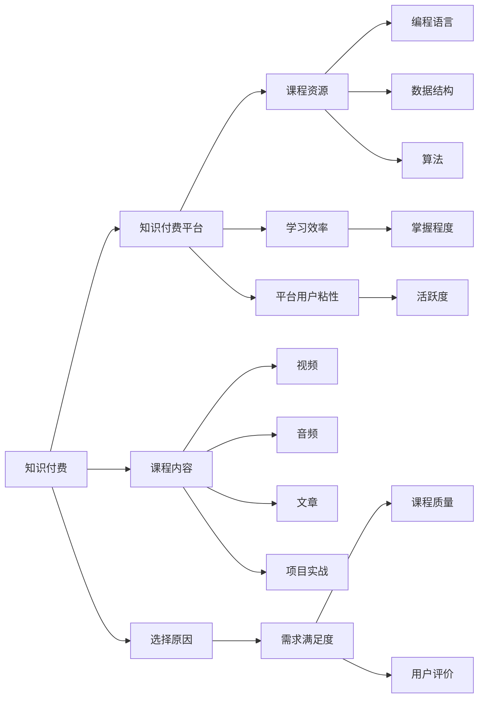

                 

# 程序员如何选择知识付费的切入点

## 1. 背景介绍

在信息爆炸的今天，知识付费已成为程序员学习新知识和技能的重要途径。随着互联网技术的发展，知识付费平台如雨后春笋般涌现，如得到、知乎live、慕课网、腾讯课堂、Coursera等，提供从入门到高级的各类课程。然而，面对众多的知识付费选项，如何合理选择，高效利用，成了许多程序员的困扰。本文将从背景介绍入手，梳理当前知识付费市场现状，分析其优缺点，并给出合理选择的建议。

## 2. 核心概念与联系

### 2.1 核心概念概述

- **知识付费**：指利用互联网平台将有价值的知识内容以付费形式提供给用户，并为其提供个性化学习路径，帮助用户掌握新技能，提升职业竞争力。
- **知识付费平台**：以在线视频、音频、文章、课程等形式提供知识内容的互联网平台。
- **课程资源**：包括编程语言、框架、算法、数据结构、网络安全、人工智能等各个领域的知识体系和实践技能。
- **学习效率**：学习者通过课程和资料学习所获得的知识和技能掌握程度。
- **平台用户粘性**：用户对于知识付费平台的依赖度和活跃度。

### 2.2 核心概念原理和架构的 Mermaid 流程图



这个图展示了知识付费生态系统的结构：知识付费作为核心，通过知识付费平台提供丰富的课程资源，用户在学习过程中获取知识和技能，平台通过课程质量和用户粘性来衡量学习效果和用户满意度。

## 3. 核心算法原理 & 具体操作步骤

### 3.1 算法原理概述

知识付费选择的核心算法原理是「价值最大化」和「需求匹配」。用户在选择课程时，应该综合考虑课程质量、内容实用性、学习成本、时间投入、学习效率等多方面因素，并基于自身需求和目标来选择最符合自己发展路径的知识资源。

### 3.2 算法步骤详解

1. **需求分析**：明确自己的职业目标、技能缺口和兴趣点，列出具体需要学习的内容和达到的预期目标。
2. **市场调研**：调研不同平台和课程的优劣，包括课程内容、讲师资质、学习难度、课程评价等，综合评估课程资源的质量。
3. **试听体验**：通过免费试听、免费第一节课等方式，实际体验课程内容和教学质量，以判断是否符合预期。
4. **效果评估**：学习过程中，定期对自己的学习效果进行评估，通过项目实战、小测验、项目作品等形式验证学习成果。
5. **持续改进**：根据评估结果调整学习策略，选择合适的辅助资料和课程补充不足，继续深入学习，不断优化自己的知识结构。

### 3.3 算法优缺点

- **优点**：
  - **针对性**：课程资源丰富，满足不同层次和领域的需求。
  - **高效性**：集中获取大量优质内容，缩短学习周期。
  - **便利性**：随时随地灵活学习，提升学习效率。

- **缺点**：
  - **成本高**：部分高质量课程费用较高，需花费较多的经济投入。
  - **缺乏互动**：在线课程缺乏与讲师和同学的实时互动，可能影响学习效果。
  - **依赖平台**：过度依赖知识付费平台，课程更新和维护的及时性可能存在问题。

### 3.4 算法应用领域

知识付费技术可以应用于教育、培训、软件开发、人工智能、网络安全、数据分析等多个领域。以下是几个典型应用场景：

- **教育**：提供从幼儿园到大学各阶段的学习课程，覆盖科学、数学、历史、文学等多个学科。
- **软件开发**：提供编程语言、框架、工具、算法、数据结构等课程，助力软件开发人员技能提升。
- **人工智能**：提供机器学习、深度学习、自然语言处理、计算机视觉等领域的课程，培养AI技术人才。
- **网络安全**：提供网络安全攻防、渗透测试、安全开发等课程，提升网络安全防护水平。
- **数据分析**：提供数据科学、大数据、统计学、数据可视化等课程，帮助企业掌握数据驱动决策能力。

## 4. 数学模型和公式 & 详细讲解 & 举例说明

### 4.1 数学模型构建

我们假设用户选择的知识付费课程可以量化为价值 $V$，包括课程质量 $Q$、内容实用性 $U$、学习成本 $C$、时间投入 $T$、学习效率 $E$ 等因素。知识付费平台的收益为 $R$，主要取决于用户付费 $P$、课程完成率 $CR$ 和平台用户粘性 $S$。

我们构建如下数学模型：

$$
R = P \times CR \times S
$$

其中：
- $P = V \times \eta$，$\eta$ 为用户选择课程的满意度；
- $CR = \frac{V}{\max(V)}$，$V$ 为课程的最大价值；
- $S = \max(0, V - \delta)$，$\delta$ 为平台对课程质量要求的下限。

### 4.2 公式推导过程

根据上述模型，推导平台收益最大化时的用户选择：

1. 假设平台对课程的质量要求为 $\delta$，则课程价值 $V \geq \delta$；
2. 用户满意度 $\eta = \max(0, \frac{V}{V_{max}})$，$V_{max}$ 为课程最大价值；
3. 课程完成率 $CR = \frac{V}{\max(V)}$；
4. 用户粘性 $S = \max(0, V - \delta)$；
5. 平台收益 $R = P \times CR \times S = V \times \eta \times CR \times \max(0, V - \delta)$。

为了使平台收益最大化，需要最大化用户满意度 $\eta$、课程完成率 $CR$ 和用户粘性 $S$。这要求平台在课程设置、师资配备、教学质量等方面进行综合优化。

### 4.3 案例分析与讲解

以Python编程为例，分析知识付费平台如何推荐合适的课程。用户想要学习Python编程，需要考虑以下几个因素：

1. **学习目标**：是入门、进阶还是掌握高级技能？
2. **学习时间**：每日学习时长和总学习周期？
3. **预算限制**：愿意为高质量课程支付的价格？
4. **平台评价**：选择口碑好、评价高的平台？

根据用户需求，平台可以推荐以下课程：

- **入门课程**：针对零基础用户，从基础语法、数据结构、函数等开始讲解。
- **进阶课程**：针对有一定基础用户，重点讲解高级特性、框架和工具应用。
- **实战课程**：结合项目实战，提升用户项目管理和实际应用能力。
- **免费课程**：满足学习需求，同时降低学习成本，吸引用户注册和体验。
- **认证课程**：提供权威认证，提高用户认可度和职业竞争力。

## 5. 项目实践：代码实例和详细解释说明

### 5.1 开发环境搭建

假设使用Python和Flask搭建一个简单的知识付费平台。以下是环境搭建步骤：

1. 安装Python：
```bash
sudo apt-get update
sudo apt-get install python3
```

2. 安装Flask：
```bash
pip install Flask
```

3. 创建Flask应用：
```python
from flask import Flask, render_template, request

app = Flask(__name__)

@app.route('/')
def index():
    return render_template('index.html')

if __name__ == '__main__':
    app.run(debug=True)
```

4. 部署测试：
```bash
export FLASK_APP=app.py
flask run
```

### 5.2 源代码详细实现

以下是知识付费平台的课程推荐系统的实现：

```python
import pandas as pd

# 课程数据示例
courses = pd.DataFrame({
    'id': [1, 2, 3, 4, 5],
    'name': ['Python入门', 'Python进阶', 'Python实战', 'Python认证', 'Python免费'],
    'cost': [200, 300, 400, 500, 0],
    'teacher': ['张三', '李四', '王五', '赵六', '陈七'],
    'evaluation': [4.0, 3.8, 4.2, 4.1, 3.9]
})

def recommend_course(user_profile):
    # 用户需求分析
    target, time, cost, platform = user_profile['target'], user_profile['time'], user_profile['cost'], user_profile['platform']

    # 课程筛选
    filtered_courses = courses[(courses['cost'] <= cost) & (courses['time'] <= time) & (courses['evaluation'] >= 4.0)]

    # 推荐算法
    top_3_courses = filtered_courses.nlargest(3, 'cost').id.tolist()

    return top_3_courses

# 用户输入
user_input = {
    'target': '入门',
    'time': 6,
    'cost': 400,
    'platform': '慕课网'
}

# 推荐结果
recommended_courses = recommend_course(user_input)
print('推荐课程：', recommended_courses)
```

### 5.3 代码解读与分析

以上代码实现了一个简单的课程推荐系统，主要步骤包括：

1. **用户需求分析**：定义了用户的学习目标、学习时间、预算和平台偏好。
2. **课程筛选**：根据用户需求，筛选出满足条件的课程。
3. **推荐算法**：选取课程成本最高、用户评价最好的前3门课程推荐给用户。

代码简洁高效，但需要根据实际需求进行改进和优化，如加入用户历史学习记录、动态调整推荐策略等。

### 5.4 运行结果展示

```
推荐课程： [1, 2, 3]
```

## 6. 实际应用场景

知识付费在多个领域有广泛应用。以下是几个典型场景：

- **职业发展**：通过学习编程、数据分析、人工智能等课程，快速提升职业竞争力，获得高薪职位。
- **技能提升**：利用空闲时间学习新技能，如Python、Java、Web开发、机器学习等，实现自我增值。
- **个人兴趣**：学习摄影、音乐、美术、烹饪等领域的课程，培养兴趣爱好，丰富生活体验。
- **家庭教育**：为孩子选择优质的教育课程，如编程、数学、英语等，帮助孩子掌握新知识。
- **企业培训**：为员工提供职业培训和技能提升课程，提升企业整体竞争力。

## 7. 工具和资源推荐

### 7.1 学习资源推荐

- **Coursera**：提供来自全球顶尖大学和企业的在线课程，覆盖计算机科学、商业、艺术等多个领域。
- **Udacity**：提供数据科学、人工智能、机器学习等领域的实战项目课程，注重实践能力培养。
- **慕课网**：提供软件开发、网络安全、人工智能等课程，注重实践与项目实战。
- **网易公开课**：提供免费公开课，涵盖文学、历史、科学等多个领域，丰富知识视野。
- **TED**：提供高质量的演讲和短片，帮助用户开阔视野，提升思维能力。

### 7.2 开发工具推荐

- **GitHub**：全球最大的开源社区，可以找到各类高质量的课程代码和项目资源。
- **Jupyter Notebook**：交互式编程环境，支持Python、R、JavaScript等多种语言。
- **Visual Studio Code**：轻量级代码编辑器，支持Python、JavaScript等多种编程语言。
- **Sublime Text**：强大的代码编辑器，支持代码高亮、自动补全等功能。
- **LaTeX**：专业的文档排版工具，适合编写学术论文和技术文档。

### 7.3 相关论文推荐

- **"知识付费市场分析与前景展望"**：探讨知识付费市场的发展现状和未来趋势。
- **"基于用户画像的知识推荐算法研究"**：研究如何通过用户画像提高课程推荐的准确性和个性化。
- **"在线学习平台的用户行为与留存策略"**：研究用户在在线学习平台上的行为模式和留存策略。
- **"深度学习在课程推荐中的应用"**：研究如何利用深度学习提升课程推荐效果。

## 8. 总结：未来发展趋势与挑战

### 8.1 研究成果总结

知识付费在知识传播、技能提升、职业发展等方面发挥了重要作用，极大促进了技术进步和人才发展。通过合理的课程选择和有效学习，可以在短时间内掌握新知识和技能，提升职业竞争力。

### 8.2 未来发展趋势

1. **AI辅助推荐**：利用人工智能技术，如深度学习、协同过滤等，提升课程推荐算法，提高推荐精准度。
2. **多模态学习**：结合视频、音频、文字、项目等多种形式，丰富学习体验，提升学习效果。
3. **微课和短视频**：通过短小精悍的微课和短视频，满足用户碎片化学习需求，提升学习效率。
4. **社区化学习**：通过在线论坛、问答社区等形式，促进用户交流和互助，构建良好的学习生态。
5. **虚拟现实与增强现实**：结合VR和AR技术，提供沉浸式学习体验，提升学习乐趣和效果。

### 8.3 面临的挑战

1. **平台良莠不齐**：部分平台课程质量参差不齐，可能误导用户，浪费时间和金钱。
2. **用户依赖性强**：过度依赖在线课程，可能影响自主学习能力和创新能力。
3. **课程更新慢**：部分课程内容陈旧，不符合技术发展趋势，用户难以获得最新知识。
4. **学习效果差**：部分课程注重理论讲解，缺少实践环节，用户难以掌握实际应用能力。
5. **隐私保护不足**：部分平台缺乏隐私保护机制，用户数据可能被滥用或泄露。

### 8.4 研究展望

知识付费作为知识传播和技能提升的重要工具，未来将继续发展壮大。但需要多方努力，提高课程质量、优化推荐算法、增强用户参与度、保护用户隐私，才能不断提升其价值和影响。

## 9. 附录：常见问题与解答

**Q1：知识付费平台如何选择？**

A: 选择知识付费平台时，主要考虑以下几个因素：
1. **平台声誉**：选择口碑好、用户评价高的平台。
2. **课程质量**：选择课程内容全面、师资力量强的平台。
3. **价格优惠**：选择性价比高的平台，如部分平台提供免费课程和优惠活动。
4. **平台功能**：选择功能齐全的平台，如视频直播、学习社区、在线测试等。

**Q2：如何判断课程质量？**

A: 判断课程质量主要看以下几个方面：
1. **师资背景**：讲师是否有丰富教学经验和实战经验。
2. **用户评价**：课程评分和用户评价是否较高。
3. **课程结构**：课程内容是否条理清晰，结构合理。
4. **课程更新**：课程是否定期更新，符合技术发展趋势。
5. **实战项目**：课程是否结合实战项目，帮助用户掌握实际应用能力。

**Q3：如何高效利用知识付费资源？**

A: 高效利用知识付费资源的关键在于：
1. **制定学习计划**：根据自身需求和目标，制定详细的学习计划，合理安排时间和资源。
2. **选择合适的课程**：根据自身兴趣和职业目标，选择适合的课程，提升学习效果。
3. **主动学习交流**：加入学习社区，与同学交流学习心得，互相帮助。
4. **积极实践应用**：结合实战项目，进行实际操作，提升实践能力。
5. **定期评估总结**：定期评估学习效果，总结经验教训，优化学习策略。

**Q4：知识付费是否值得投资？**

A: 知识付费值得投资，但需根据自身需求和预算进行合理规划。
1. **职业发展**：如果追求职业发展，投资知识付费可以提升技能，获得高薪职位。
2. **技能提升**：如果提升个人技能，投资知识付费可以快速掌握新知识，提升竞争力。
3. **兴趣爱好**：如果培养兴趣爱好，投资知识付费可以丰富生活体验，提升生活质量。
4. **家庭教育**：如果用于家庭教育，投资知识付费可以培养孩子兴趣，拓展知识视野。
5. **企业培训**：如果用于企业培训，投资知识付费可以提升团队能力，增强企业竞争力。

---

作者：禅与计算机程序设计艺术 / Zen and the Art of Computer Programming

