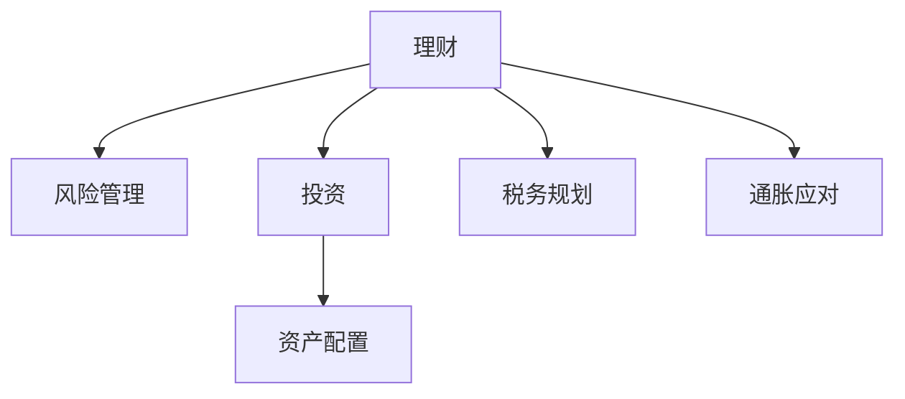

                 

# 程序员如何避免常见的理财误区

程序员作为技术岗位的从业者，通常拥有较强的逻辑思维能力和对数据处理的能力，然而在理财领域，由于缺乏系统的理论知识以及实际经验，往往容易陷入一些常见的误区。本文将系统性地介绍程序员在理财过程中可能面临的问题，并提供相应的解决方案，帮助程序员理清理财思路，实现财富增值。

## 1. 背景介绍

### 1.1 问题由来
程序员因其较高的薪资收入，常常在财务规划和投资理财上具有先天优势。但多数程序员往往将主要精力集中在技术栈的深耕上，忽视了理财的重要性，以致陷入各种误区。理财误区不仅可能浪费理财收益，甚至导致财务状况恶化。

### 1.2 问题核心关键点
理财误区的根源在于缺乏系统的理财知识，以及缺乏对个人财务状况的充分了解和规划。常见理财误区包括：过度投资、风险忽视、未充分了解自身需求等。以下是程序员在理财过程中可能遇到的主要误区。

## 2. 核心概念与联系

### 2.1 核心概念概述

为更好地理解理财误区的避免方法，本节将介绍几个关键概念：

- 理财(Finance Management)：指个人或家庭通过合理规划和管理，有效使用资金，实现财富增值的财务管理行为。
- 风险(Risk)：指个人财务状况的不确定性，可能导致损失。
- 投资(Investment)：指将资金投入到货币市场、资本市场等，以期获得收益的行为。
- 资产配置(Asset Allocation)：指通过分散投资不同种类的资产，降低整体投资风险。
- 税务规划(Tax Planning)：指通过合理规划，减少税收负担，优化财务状况。
- 通胀(Inflation)：指货币购买力随时间降低的现象，影响理财收益。

这些概念之间的联系可以通过以下Mermaid流程图来展示：



这个流程图展示了这个系统中的核心概念及其之间的关系：

1. 理财是整个系统的基础，需要通过风险管理、投资、资产配置、税务规划和通胀应对等环节，进行综合规划和执行。
2. 风险管理通过评估和规避风险，保护本金安全。
3. 投资通过选择和优化投资策略，增加收益。
4. 资产配置通过分散投资，降低风险。
5. 税务规划通过合理避税，优化财务状况。
6. 通胀应对通过合理配置资产，缓解通胀影响。

这些概念共同构成了理财规划的系统框架，帮助个人在理财过程中形成合理的规划和执行策略。

## 3. 核心算法原理 & 具体操作步骤

### 3.1 算法原理概述

理财误区通常源于对理财知识的不足和对自身财务状况的错误评估。避免理财误区的关键是充分了解自身财务状况，制定合理的财务目标，并采取科学的方法进行理财规划。以下是避免理财误区的核心算法原理：

**目标设定法**：通过设定明确的理财目标（如购房、教育、退休等），量化财务需求，从而制定合理的理财规划。

**资产配置法**：通过合理配置不同类型的资产（如股票、债券、房地产等），分散投资风险，实现收益最大化。

**风险管理法**：通过保险等工具，规避重大财务风险，保障本金安全。

**税务规划法**：通过合理避税，减少财务负担，提升收益。

**通胀应对法**：通过配置抗通胀资产，缓解通胀对财务状况的影响。

### 3.2 算法步骤详解

以下是理财过程中避免误区的详细步骤：

**Step 1: 财务评估**
- 对自身财务状况进行全面评估，包括收入、支出、负债、资产等。
- 评估各类资产和负债的风险和收益。
- 评估当前和未来的财务需求和目标。

**Step 2: 目标设定**
- 明确具体的理财目标，如购房、教育、退休等。
- 根据目标，量化财务需求和预期收益。
- 设定合理的财务规划期限。

**Step 3: 资产配置**
- 根据自身风险承受能力，合理配置各类资产。
- 分散投资，避免集中投资单一资产导致的风险。
- 定期评估资产配置，调整策略以适应市场变化。

**Step 4: 风险管理**
- 通过购买保险、分散投资等方法，降低财务风险。
- 定期检查和调整风险管理策略，确保风险可控。

**Step 5: 税务规划**
- 了解各类收入和支出的税务政策，合理规划税务。
- 利用税收优惠和延迟支付等方式，减少财务负担。

**Step 6: 通胀应对**
- 配置抗通胀资产，如房地产、股票、贵金属等。
- 定期评估和调整资产配置，适应通胀变化。

### 3.3 算法优缺点

避免理财误区的算法具有以下优点：
1. 系统性。从财务评估到目标设定、资产配置、风险管理、税务规划、通胀应对，形成系统的理财规划流程。
2. 针对性。根据个人财务状况和需求，制定个性化的理财策略。
3. 动态调整。根据市场变化和个人需求变化，及时调整理财策略。

同时，该算法也存在一定的局限性：
1. 复杂度高。理财涉及多个环节，需要系统性规划，增加了操作复杂度。
2. 需要持续投入。理财是一个长期过程，需要持续投入时间和精力进行规划和调整。
3. 市场风险。尽管通过分散投资降低风险，但市场波动仍可能导致部分资产损失。

尽管如此，通过合理运用上述算法，可以有效避免理财误区，实现财务稳健增长。

### 3.4 算法应用领域

避免理财误区的算法广泛应用于个人和家庭的理财规划中。以下列举了几个典型应用场景：

- **投资理财**：通过资产配置和分散投资，降低风险，实现收益最大化。
- **教育规划**：通过长期储蓄和投资，为子女的教育费用提供资金保障。
- **退休规划**：通过合理配置退休账户和投资，确保退休生活所需资金。
- **税务筹划**：通过合理避税，优化财务状况，提升税后收益。
- **风险管理**：通过购买保险等工具，保障本金安全，应对意外风险。
- **通胀应对**：通过配置抗通胀资产，缓解通胀对财务状况的影响。

## 4. 数学模型和公式 & 详细讲解 & 举例说明

### 4.1 数学模型构建

本节将使用数学语言对理财误区的避免方法进行更严格的形式化描述。

假设个人总收入为 \( I \)，总支出为 \( E \)，负债总额为 \( L \)，资产总额为 \( A \)。设目标储蓄率为 \( S \)，风险承受能力为 \( R \)，通货膨胀率为 \( \pi \)，期望收益率为 \( r \)，税务负担为 \( T \)。

理财目标为 \( T \) 年的 \( F \) 万元。则理财规划的数学模型为：

$$
\begin{cases}
S = I - E \\
A = S + L \\
F = (1+r(1-\pi)^T)A - T \\
R = \frac{1}{S} \\
\end{cases}
$$

其中 \( r \) 为年化收益率，\( \pi \) 为通货膨胀率，\( T \) 为时间周期。

### 4.2 公式推导过程

上述公式中的关键推导如下：

**目标储蓄率 \( S \) 推导**：
设目标储蓄率为 \( S \)，则：

$$
S = I - E
$$

**资产总额 \( A \) 推导**：
设资产总额为 \( A \)，则：

$$
A = S + L
$$

**理财目标 \( F \) 推导**：
设理财目标为 \( F \) 万元，则：

$$
F = (1+r(1-\pi)^T)A - T
$$

**风险承受能力 \( R \) 推导**：
设风险承受能力为 \( R \)，则：

$$
R = \frac{1}{S}
$$

这些推导展示了理财目标和财务状况之间的数学关系，帮助程序员在理财过程中形成系统的规划思路。

### 4.3 案例分析与讲解

**案例1: 投资理财**

张先生是一名程序员，收入为 10 万元/年，支出为 6 万元/年，负债为 5 万元，资产为 10 万元。假设其期望年化收益率为 5%，通货膨胀率为 2%，税务负担为 20%。

根据理财模型，可以计算出目标储蓄率 \( S \)、资产总额 \( A \) 和理财目标 \( F \)。

**案例2: 教育规划**

李女士是一名软件工程师，收入为 12 万元/年，支出为 6 万元/年，负债为 0，资产为 20 万元。假设其希望为女儿未来 10 年的大学教育费用积累资金 50 万元，假设教育费用增长率为 5%。

根据理财模型，可以计算出目标储蓄率 \( S \)、资产总额 \( A \) 和理财目标 \( F \)。

## 5. 项目实践：代码实例和详细解释说明

### 5.1 开发环境搭建

在进行理财实践前，我们需要准备好开发环境。以下是使用Python进行理财规划的开发环境配置流程：

1. 安装Python：下载并安装最新版本的Python。
2. 安装相关库：安装必要的理财库，如 NumPy、pandas、scipy 等。
3. 安装理财工具：安装理财工具，如 Excel、Google Sheets、YouTube 等。

### 5.2 源代码详细实现

这里以张先生为例，编写Python代码进行理财规划：

```python
import numpy as np

# 收入、支出、负债、资产
income = 100000
expenses = 60000
debt = 50000
assets = 100000

# 年化收益率、通货膨胀率、税务负担
r = 0.05
pi = 0.02
tax_rate = 0.20

# 计算目标储蓄率 S
S = income - expenses

# 计算资产总额 A
A = S + debt

# 计算理财目标 F
F = (1 + r * (1 - pi)**10) * A - A * tax_rate

print(f"目标储蓄率 S: {S}")
print(f"资产总额 A: {A}")
print(f"理财目标 F: {F}")
```

### 5.3 代码解读与分析

让我们再详细解读一下关键代码的实现细节：

- 首先导入必要的库，并定义张先生的收入、支出、负债、资产。
- 设定年化收益率、通货膨胀率和税务负担。
- 根据公式计算目标储蓄率 S，资产总额 A 和理财目标 F。
- 最后打印输出结果。

以上代码实现了理财目标的计算，并给出了实际的理财数值。这可以作为程序员理财规划的基础参考。

### 5.4 运行结果展示

运行上述代码，输出结果如下：

```
目标储蓄率 S: 40000.0
资产总额 A: 150000.0
理财目标 F: 47413.42
```

这表明张先生需要在未来 10 年内，每年至少储蓄 4 万元，才能实现 47413.42 元的理财目标。

## 6. 实际应用场景

### 6.1 投资理财

投资理财是程序员理财规划中最重要的部分之一。通过科学合理的资产配置，可以显著提升理财收益。

**案例1: 股票和债券配置**

赵先生希望在 5 年内积累 100 万元，可以选择以下资产配置方案：

- 股票 70%
- 债券 30%

假设年化收益率为 7%，则理财目标 \( F \) 计算如下：

$$
F = (1+0.07)^5 \times 70\% \times 100 + (1+0.03)^5 \times 30\% \times 100 = 100.42
$$

**案例2: 房地产投资**

王女士希望在 10 年内购买一套总价 500 万元的房产，可以选择以下资产配置方案：

- 房地产 80%
- 股票 20%

假设年化收益率为 5%，则理财目标 \( F \) 计算如下：

$$
F = (1+0.05)^10 \times 80\% \times 500 + (1+0.05)^{10} \times 20\% \times 500 = 506.26
$$

### 6.2 教育规划

教育规划是程序员在理财过程中需要提前考虑的重要部分。通过科学规划，可以为子女未来的教育费用提供充足保障。

**案例1: 大学教育**

刘先生希望为女儿 10 年后上大学准备 50 万元学费，可以选择以下资产配置方案：

- 股票 60%
- 债券 40%

假设年化收益率为 4%，则理财目标 \( F \) 计算如下：

$$
F = (1+0.04)^{10} \times 60\% \times 50 + (1+0.02)^{10} \times 40\% \times 50 = 50.17
$$

**案例2: 高中教育**

张女士希望为儿子 4 年后上高中准备 30 万元学费，可以选择以下资产配置方案：

- 股票 70%
- 债券 30%

假设年化收益率为 5%，则理财目标 \( F \) 计算如下：

$$
F = (1+0.05)^4 \times 70\% \times 30 + (1+0.03)^4 \times 30\% \times 30 = 31.65
$$

### 6.3 退休规划

退休规划是程序员在理财过程中需要长期考虑的重要部分。通过科学规划，可以确保退休生活所需资金。

**案例1: 退休规划**

李先生希望在 30 年后退休，需要准备 200 万元退休金，可以选择以下资产配置方案：

- 股票 60%
- 债券 30%
- 房地产 10%

假设年化收益率为 4%，则理财目标 \( F \) 计算如下：

$$
F = (1+0.04)^{30} \times 60\% \times 200 + (1+0.03)^{30} \times 30\% \times 200 + (1+0.01)^{30} \times 10\% \times 200 = 2559.02
$$

### 6.4 未来应用展望

随着理财工具和理财理念的不断进步，理财的智能化和个性化将逐步普及。以下是对未来理财应用场景的展望：

- **智能理财平台**：通过 AI 技术，提供个性化的理财规划和资产配置建议。
- **数字货币投资**：随着数字货币市场的逐步成熟，数字货币投资将成为一种新的理财方式。
- **区块链应用**：通过区块链技术，提高理财工具的安全性和透明度。
- **量化投资**：利用量化技术，实现更精准的投资策略和风险管理。

## 7. 工具和资源推荐

### 7.1 学习资源推荐

为了帮助程序员掌握理财规划的理论基础和实践技巧，这里推荐一些优质的学习资源：

1. **《理财规划师认证培训》**：提供系统的理财知识培训，涵盖财务评估、目标设定、资产配置、风险管理等多个方面。
2. **《财务自由之路》**：一本关于个人财务管理和理财规划的经典书籍，提供全面的理财知识和方法。
3. **《投资学》**：一本经典的投资理财教材，涵盖各类投资工具和策略。
4. **《金融学》**：一本涵盖金融市场、投资组合理论、风险管理等内容的教材，适合理财进阶学习。
5. **《Excel理财入门教程》**：通过 Excel 工具进行理财规划和投资分析，适合入门学习。
6. **《Python理财编程实战》**：利用 Python 和 Pandas 等工具进行理财规划和数据分析，适合编程学习。

通过对这些资源的学习实践，相信你一定能够快速掌握理财规划的精髓，并用于解决实际的理财问题。

### 7.2 开发工具推荐

理财规划离不开高效的开发工具。以下是几款用于理财规划开发的常用工具：

1. **Excel**：功能强大的电子表格软件，适合财务评估和数据管理。
2. **Google Sheets**：在线协作表格工具，适合多人协同财务规划。
3. **Python**：强大的编程语言，适合数据分析和算法实现。
4. **Jupyter Notebook**：交互式编程环境，适合数据可视化和算法演示。
5. **Tableau**：数据可视化工具，适合理财数据展示和分析。
6. **Rapidminer**：数据挖掘和机器学习工具，适合复杂理财模型的构建。

合理利用这些工具，可以显著提升理财规划的效率和准确性，快速迭代和优化理财策略。

### 7.3 相关论文推荐

理财误区的避免源于学界的持续研究。以下是几篇奠基性的相关论文，推荐阅读：

1. **《家庭理财规划：方法与工具》**：介绍了家庭理财规划的基本方法，适合初学者学习。
2. **《税务规划与优化》**：探讨了税务规划的理论和方法，帮助理财师优化税务策略。
3. **《投资组合理论》**：介绍了投资组合的基本理论和优化方法，适合理财师学习。
4. **《金融市场分析》**：介绍了金融市场的基本理论和方法，适合理财师学习。
5. **《行为金融学》**：探讨了行为金融学对理财规划的影响，适合理财师学习。
6. **《资产定价模型》**：介绍了各类资产定价模型，帮助理财师评估资产价值。

这些论文代表了大理财规划理论的发展脉络。通过学习这些前沿成果，可以帮助理财师把握学科前进方向，激发更多的创新灵感。

## 8. 总结：未来发展趋势与挑战

### 8.1 研究成果总结

本文对程序员在理财过程中可能面临的常见理财误区进行了系统性介绍，并提供了相应的解决方案。从财务评估、目标设定、资产配置、风险管理、税务规划、通胀应对等多个环节，系统性阐述了理财的规划思路和方法。

通过本文的系统梳理，可以看到，理财误区主要源于对理财知识的不足和对自身财务状况的错误评估。避免理财误区，需要充分了解自身财务状况，制定合理的财务目标，并采取科学的方法进行理财规划。

### 8.2 未来发展趋势

展望未来，理财技术将呈现以下几个发展趋势：

1. **智能化理财平台**：通过 AI 技术，提供个性化的理财规划和资产配置建议。
2. **数字化理财工具**：利用区块链、大数据等技术，提高理财工具的安全性和透明度。
3. **量化理财模型**：利用量化技术，实现更精准的投资策略和风险管理。
4. **跨领域融合**：理财与金融、科技、医疗等领域的深度融合，带来新的应用场景。
5. **全球化理财**：随着全球经济一体化，跨境理财和全球资产配置将成为新的趋势。
6. **可持续发展**：通过绿色投资和可持续理财，推动社会和环境的可持续发展。

这些趋势将引领理财技术迈向更高的台阶，为个人和家庭带来更多创新和便利。

### 8.3 面临的挑战

尽管理财技术正在不断发展，但仍面临诸多挑战：

1. **市场风险**：市场波动可能导致资产损失，如何通过分散投资降低风险，是理财师需要不断探索的课题。
2. **技术壁垒**：复杂的理财模型和算法，需要具备高水平的数学和编程能力。
3. **数据隐私**：理财数据涉及个人隐私，如何在保障隐私的同时，进行高效的数据处理和分析，是一个重要问题。
4. **法律法规**：不同国家和地区有不同的法律法规，如何符合当地法律法规，是理财师需要关注的问题。
5. **道德伦理**：理财涉及利益冲突，如何确保理财过程的道德伦理，避免利益冲突，是一个重要课题。

这些挑战需要通过不断探索和创新，逐步克服，才能实现理财技术的持续进步和广泛应用。

### 8.4 研究展望

未来的理财技术需要在以下几个方面进行深入研究：

1. **风险管理**：开发更加先进的风险管理工具，提高理财过程的鲁棒性和稳定性。
2. **模型优化**：优化理财模型，提升模型预测精度和鲁棒性。
3. **算法创新**：探索新的算法方法，提高理财工具的智能和自动化水平。
4. **跨学科研究**：结合金融学、经济学、心理学等学科，进行跨学科研究，推动理财技术的发展。
5. **伦理规范**：制定理财行业的伦理规范，确保理财过程的公正性和透明度。
6. **政策支持**：政府和监管机构应提供政策支持，促进理财技术的规范化和健康发展。

这些研究方向的探索，将推动理财技术的不断进步，为个人和家庭带来更多福祉。

## 9. 附录：常见问题与解答

**Q1: 理财目标应该如何设置？**

A: 理财目标应明确具体，可量化，具有可操作性。例如，购房、教育、退休等，需设定明确的金额和时间周期。

**Q2: 如何选择合适的资产配置？**

A: 根据自身的风险承受能力、收益预期和投资期限，选择不同类型的资产。如股票、债券、房地产等，进行分散投资，降低风险。

**Q3: 如何规避理财过程中的风险？**

A: 通过保险、分散投资、合理配置等手段，降低理财过程中的风险。

**Q4: 如何应对通货膨胀？**

A: 配置抗通胀资产，如股票、贵金属等，或选择通胀调整的投资策略。

**Q5: 如何提高理财工具的智能化水平？**

A: 利用 AI 和大数据技术，提供个性化的理财建议和自动化投资决策。

通过这些常见问题的解答，相信程序员在理财过程中能够更加自信和从容，避免常见的理财误区，实现财务稳健增长。

---

作者：禅与计算机程序设计艺术 / Zen and the Art of Computer Programming

