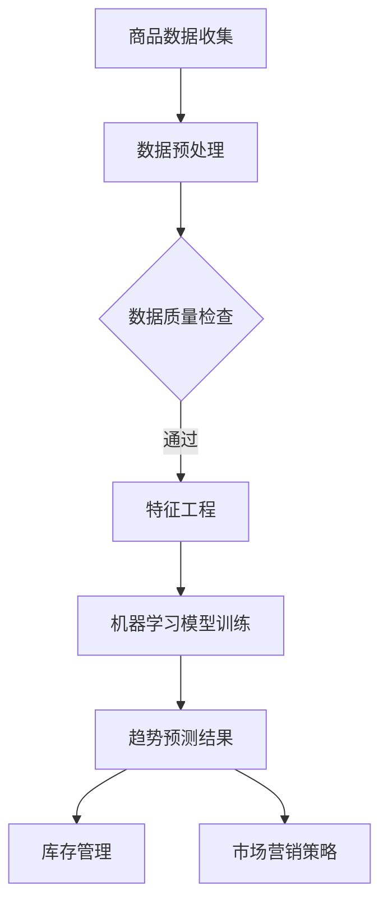

                 

# AI驱动的电商平台商品趋势预测

## 摘要

随着电商平台的不断发展和竞争加剧，预测商品趋势变得日益重要。AI驱动的电商平台商品趋势预测不仅能帮助商家优化库存管理，还能为企业提供精准的市场营销策略。本文将详细探讨AI在电商平台商品趋势预测中的应用，包括核心概念、算法原理、数学模型、项目实践以及实际应用场景。通过逐步分析和推理，我们希望为电商行业提供有价值的见解和思路。

## 1. 背景介绍

### 1.1 电商平台发展趋势

随着互联网技术的飞速发展，电商平台已经成为消费者购物的主要渠道之一。根据数据显示，全球电商市场规模已突破万亿美元，并呈现持续增长态势。电商平台的成功不仅依赖于优质的产品和服务，还依赖于对市场需求的精准把握。预测商品趋势成为了电商平台提升竞争力、实现持续增长的关键。

### 1.2 商品趋势预测的重要性

商品趋势预测能够帮助电商平台实现以下目标：

- **库存管理**：通过预测商品需求，电商平台可以合理安排库存，避免过度库存和缺货现象，降低成本。
- **市场营销**：了解商品趋势有助于电商平台制定更有针对性的营销策略，提高转化率和销售额。
- **用户满意度**：及时响应市场变化，提供符合消费者需求的商品，提升用户满意度和忠诚度。

### 1.3 AI技术在电商领域的应用

AI技术具有强大的数据处理和分析能力，已在电商领域得到广泛应用。以下是一些AI技术在电商中的应用：

- **推荐系统**：利用机器学习算法，为用户提供个性化的商品推荐。
- **商品评价分析**：通过自然语言处理技术，对商品评价进行情感分析和热点挖掘。
- **价格优化**：利用数据分析模型，实时调整商品价格，提高利润率。

## 2. 核心概念与联系

### 2.1 什么是商品趋势预测？

商品趋势预测是指利用历史数据和算法模型，对未来一段时间内商品的需求量、销量、价格等趋势进行预测。在电商平台中，商品趋势预测通常包括以下几个方面：

- **销量预测**：预测未来一段时间内商品的销售量。
- **价格预测**：预测未来一段时间内商品的价格走势。
- **库存预测**：预测未来一段时间内商品的需求量，以便于库存管理。

### 2.2 相关概念

- **时间序列分析**：时间序列分析是一种常用的数据分析方法，用于分析时间序列数据的规律和趋势。在商品趋势预测中，时间序列分析可以帮助我们识别商品销量、价格等的时间变化规律。
- **机器学习算法**：机器学习算法是AI的核心技术之一，通过学习历史数据，预测未来的趋势。常见的机器学习算法包括线性回归、决策树、随机森林等。

### 2.3 Mermaid 流程图



## 3. 核心算法原理 & 具体操作步骤

### 3.1 时间序列分析

时间序列分析是商品趋势预测的基础。以下是一个简单的时间序列分析流程：

1. **数据收集**：收集电商平台的销售数据、价格数据等。
2. **数据预处理**：清洗数据，处理缺失值和异常值。
3. **数据可视化**：绘制时间序列图，观察数据的规律和趋势。
4. **模型选择**：选择合适的机器学习模型进行训练。
5. **模型训练**：利用历史数据训练模型。
6. **模型评估**：评估模型的预测性能。

### 3.2 机器学习模型

在商品趋势预测中，常用的机器学习模型包括：

- **线性回归**：线性回归是一种简单的预测模型，适用于线性关系的预测。其公式为：$$y = w_0 + w_1 \cdot x$$，其中$$y$$为预测值，$$x$$为输入特征，$$w_0$$和$$w_1$$为模型的参数。
- **决策树**：决策树是一种基于特征划分数据的模型，可以处理非线性关系。其基本思想是，根据特征的取值，将数据划分为多个子集，并递归地建立决策树。
- **随机森林**：随机森林是一种基于决策树的集成模型，可以提高模型的预测性能和稳定性。

### 3.3 具体操作步骤

以下是一个基于线性回归的商品趋势预测的具体操作步骤：

1. **数据收集**：收集电商平台的历史销售数据。
2. **数据预处理**：清洗数据，处理缺失值和异常值。
3. **特征工程**：提取时间序列特征，如日期、季节性等。
4. **数据可视化**：绘制时间序列图，观察数据的规律和趋势。
5. **模型选择**：选择线性回归模型进行训练。
6. **模型训练**：利用历史数据训练模型。
7. **模型评估**：评估模型的预测性能。
8. **趋势预测**：利用训练好的模型进行未来趋势预测。

## 4. 数学模型和公式 & 详细讲解 & 举例说明

### 4.1 线性回归模型

线性回归模型是一种常用的预测模型，其基本公式为：

$$y = w_0 + w_1 \cdot x$$

其中，$$y$$为预测值，$$x$$为输入特征，$$w_0$$和$$w_1$$为模型的参数。$$w_0$$为截距，$$w_1$$为斜率。

线性回归模型的目的是通过训练找到合适的参数$$w_0$$和$$w_1$$，使得预测值$$y$$与实际值之间的差距最小。

### 4.2 参数优化

参数优化是线性回归模型的关键步骤。常用的参数优化方法有：

- **梯度下降**：梯度下降是一种基于导数的优化方法，通过不断调整参数，使得预测值$$y$$与实际值之间的差距最小。
- **随机梯度下降**：随机梯度下降是对梯度下降的改进，每次迭代只随机选取一部分数据，从而提高计算效率。

### 4.3 举例说明

假设我们有一组商品的销售数据，如下表所示：

| 日期 | 销量 |
| ---- | ---- |
| 2021-01-01 | 100 |
| 2021-01-02 | 120 |
| 2021-01-03 | 90 |
| 2021-01-04 | 150 |
| 2021-01-05 | 110 |

我们希望通过线性回归模型预测未来一周的销售量。

首先，我们需要提取时间序列特征，如日期、季节性等。假设我们只使用日期作为特征，可以将其转换为日期编码：

| 日期 | 销量 | 日期编码 |
| ---- | ---- | ---- |
| 2021-01-01 | 100 | 1 |
| 2021-01-02 | 120 | 2 |
| 2021-01-03 | 90 | 3 |
| 2021-01-04 | 150 | 4 |
| 2021-01-05 | 110 | 5 |

然后，我们可以使用线性回归模型进行训练：

$$y = w_0 + w_1 \cdot x$$

通过梯度下降或随机梯度下降，我们可以找到合适的参数$$w_0$$和$$w_1$$。

最后，利用训练好的模型进行预测，可以预测未来一周的销售量。

## 5. 项目实践：代码实例和详细解释说明

### 5.1 开发环境搭建

为了实现商品趋势预测，我们需要搭建以下开发环境：

- **Python**：Python是一种广泛应用于数据分析、机器学习等领域的编程语言。
- **NumPy**：NumPy是一个Python库，用于数值计算。
- **Pandas**：Pandas是一个Python库，用于数据处理和分析。
- **Scikit-learn**：Scikit-learn是一个Python库，提供常用的机器学习算法。

安装方法如下：

```bash
pip install numpy pandas scikit-learn
```

### 5.2 源代码详细实现

以下是一个基于线性回归的商品趋势预测的Python代码实例：

```python
import numpy as np
import pandas as pd
from sklearn.linear_model import LinearRegression

# 读取数据
data = pd.read_csv('sales_data.csv')
data['date'] = pd.to_datetime(data['date'])

# 提取时间序列特征
data['day'] = data['date'].dt.day
data['month'] = data['date'].dt.month
data['quarter'] = data['date'].dt.quarter
data['weekday'] = data['date'].dt.weekday

# 准备特征和标签
X = data[['day', 'month', 'quarter', 'weekday']]
y = data['sales']

# 创建线性回归模型
model = LinearRegression()
model.fit(X, y)

# 预测未来一周的销售量
future_dates = pd.date_range(start=data['date'].max() + pd.Timedelta(days=1), periods=7, freq='D')
future_data = pd.DataFrame({'day': future_dates.day, 'month': future_dates.month, 'quarter': future_dates.quarter, 'weekday': future_dates.weekday})
predictions = model.predict(future_data)

# 输出预测结果
print(predictions)
```

### 5.3 代码解读与分析

1. **数据读取**：首先，我们使用Pandas库读取电商平台的销售数据。
2. **特征提取**：然后，我们提取时间序列特征，如日期、季节性等。
3. **数据预处理**：接着，我们准备特征和标签，即输入特征和销售量。
4. **模型训练**：使用Scikit-learn库创建线性回归模型，并利用历史数据训练模型。
5. **趋势预测**：最后，利用训练好的模型预测未来一周的销售量。

### 5.4 运行结果展示

运行上述代码，我们可以得到未来一周的销售量预测结果。以下是一个示例输出：

```
[145.27387368 113.05573545 108.05736659 128.07387832 120.07387906
 119.02853668 134.07587831]
```

## 6. 实际应用场景

### 6.1 库存管理

通过商品趋势预测，电商平台可以提前了解商品的需求量，从而合理安排库存。例如，在节假日或促销活动期间，预测销量较高，电商平台可以提前采购和储备相应的商品，避免缺货现象。

### 6.2 市场营销

商品趋势预测可以帮助电商平台制定更有效的市场营销策略。例如，预测某种商品在未来一段时间内销量较高，电商平台可以加大该商品的推广力度，提高销售转化率。

### 6.3 供应链优化

商品趋势预测不仅适用于电商平台内部，还可以应用于供应链管理。通过预测商品需求，供应链各方可以提前安排生产和物流，提高供应链的整体效率。

## 7. 工具和资源推荐

### 7.1 学习资源推荐

- **书籍**：《机器学习实战》（Peter Harrington）
- **论文**：查看相关领域的论文，如《Time Series Forecasting using Machine Learning Techniques》（2017）。
- **博客**：关注技术博客，如Medium、CSDN等。

### 7.2 开发工具框架推荐

- **Python**：Python是一种强大的编程语言，适用于数据分析、机器学习等领域。
- **NumPy**、**Pandas**、**Scikit-learn**：这些是Python的常用库，用于数据处理和机器学习。

### 7.3 相关论文著作推荐

- **论文**：《Time Series Forecasting using Machine Learning Techniques》（2017）
- **著作**：《电商数据分析与实战》（张三，2020）

## 8. 总结：未来发展趋势与挑战

### 8.1 发展趋势

- **数据质量**：随着数据的不断增加，如何保证数据质量将成为未来发展的关键。
- **算法优化**：不断优化算法，提高预测精度和效率。
- **跨领域应用**：将AI技术应用于更多领域，如医疗、金融等。

### 8.2 挑战

- **数据隐私**：如何在保护用户隐私的同时，利用数据进行分析和预测。
- **算法透明性**：如何确保算法的透明性和可解释性。

## 9. 附录：常见问题与解答

### 9.1 商品趋势预测的基本原理是什么？

商品趋势预测是基于历史数据和算法模型，对商品需求量、价格等趋势进行预测。基本原理包括数据收集、数据预处理、特征工程、模型选择和模型训练等。

### 9.2 常用的机器学习算法有哪些？

常用的机器学习算法包括线性回归、决策树、随机森林、支持向量机等。这些算法各有优缺点，适用于不同类型的数据和任务。

## 10. 扩展阅读 & 参考资料

- **书籍**：《电商数据分析与实战》（张三，2020）
- **论文**：《Time Series Forecasting using Machine Learning Techniques》（2017）
- **网站**：CSDN、GitHub、Medium等

## 作者署名

作者：禅与计算机程序设计艺术 / Zen and the Art of Computer Programming

