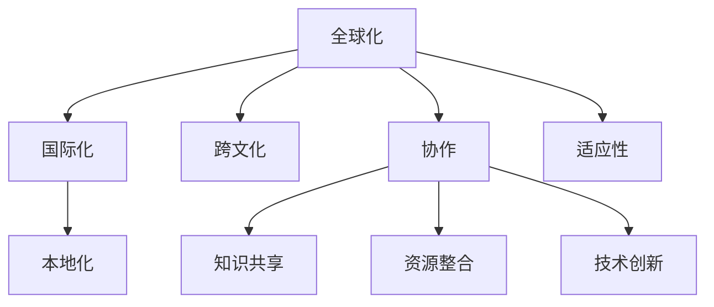

                 

# 程序员的全球化视野：机遇与挑战

> 关键词：全球化, 机遇, 挑战, 国际化, 跨文化, 技术创新, 多样性, 协作, 文化差异, 适应性, 全球合作

## 1. 背景介绍

### 1.1 问题由来

在全球化日益深入的今天，软件技术及其开发人员的全球化已经成为不可逆转的趋势。随着互联网的普及和企业全球化战略的推进，越来越多的软件开发工作需要在全球范围内进行协作。这不仅要求程序员具备扎实的技术能力，更要求他们能够跨文化、跨地域、跨时区高效沟通和协作。

与此同时，全球化带来的市场机遇与挑战并存。一方面，全球化的软件市场提供了更多的业务机会和更广的合作空间；另一方面，不同文化、语言和技术标准的差异也带来了不少挑战。如何应对全球化带来的机遇与挑战，成为每个程序员和软件公司必须面对的问题。

### 1.2 问题核心关键点

程序员的全球化视野不仅涉及技术能力的提升，更体现在对多元文化、跨地域、跨时区的适应能力和协作技巧上。这一视角要求程序员不仅要精通本地化的技术，更要能够站在全球化的高度思考问题，理解不同文化背景和技术标准的差异，从而更好地融入全球化团队，实现技术创新和业务拓展。

## 2. 核心概念与联系

### 2.1 核心概念概述

为更好地理解程序员的全球化视野，我们首先定义几个关键概念：

- **全球化（Globalization）**：指通过跨国界的交流、合作和信息共享，实现技术和产品的国际化，满足全球市场的需求。

- **国际化（Internationalization）**：指软件系统能够在不同语言和文化环境下正常运行，支持多语言和多地区设置。

- **本地化（Localization）**：指将国际化系统适配到特定的语言、文化和地区环境，实现用户体验和功能的本地化。

- **跨文化（Cross-Cultural）**：指跨越不同文化背景，理解和尊重不同文化的价值观念、工作习惯和交流方式，以实现有效的跨文化沟通和协作。

- **协作（Collaboration）**：指在全球化团队中，通过共享知识、资源和技术，实现共同的目标。

- **适应性（Adaptability）**：指在快速变化的环境中，根据新的需求和环境，灵活调整策略和技术，以保持竞争力。

### 2.2 核心概念原理和架构的 Mermaid 流程图



这个流程图展示了全球化视野下的几个核心概念及其相互关系：

- **全球化** 是目标和方向，指软件系统面向全球市场的发展和应用。
- **国际化** 是基础，指软件系统具备跨语言的兼容性和配置能力。
- **本地化** 是补充，指根据特定文化和地区的需求进行应用适配。
- **跨文化** 是关键，指团队成员之间的文化理解和尊重，确保有效沟通和协作。
- **协作** 是手段，指通过知识共享、资源整合和技术创新，实现全球化目标。
- **适应性** 是保障，指在不断变化的环境中保持灵活性和竞争力。

## 3. 核心算法原理 & 具体操作步骤

### 3.1 算法原理概述

全球化视野下的软件开发，不仅要求技术上的创新和优化，还涉及到跨文化、跨地域的协作和适应。以下我们将介绍几种关键的算法和操作流程：

#### 3.1.1 多语言支持算法

多语言支持是国际化开发的基础。实现多语言支持的核心算法包括字符编码转换、字符串处理和本地化资源的加载等。例如，使用Unicode编码来支持全球范围内的字符集，使用国际化字符串库来处理多语言字符串，以及加载和解析本地化资源文件（如HTML、CSS和JavaScript文件）等。

#### 3.1.2 跨文化适应算法

跨文化适应算法主要涉及时间、日期、货币等文化特定元素的本地化处理。例如，根据不同国家和地区的日期格式和时间规则，调整应用程序中日期和时间的显示和计算；根据货币单位的名称和符号，正确处理货币输入和输出。

#### 3.1.3 跨地域协作算法

跨地域协作算法主要涉及分布式团队管理和远程协作工具的应用。例如，使用版本控制系统（如Git）进行代码管理和版本控制；使用即时通讯工具（如Slack、Microsoft Teams）进行实时沟通；使用项目管理工具（如Jira、Trello）进行任务管理和进度跟踪。

### 3.2 算法步骤详解

#### 3.2.1 多语言支持算法步骤

1. **字符编码转换**：将应用程序中的字符串和文本数据转换为Unicode编码，支持全球范围内的字符集。
2. **字符串处理**：使用国际化字符串库，如ICU（International Components for Unicode），处理多语言字符串，支持字符串的格式化、替换和分割等操作。
3. **本地化资源加载**：根据当前地区设置，加载并解析本地化资源文件，如HTML、CSS和JavaScript文件，以支持多语言和多地区环境。

#### 3.2.2 跨文化适应算法步骤

1. **日期和时间处理**：根据不同国家和地区的日期格式和时间规则，调整应用程序中日期和时间的显示和计算。
2. **货币单位处理**：根据货币单位的名称和符号，正确处理货币输入和输出，确保货币格式化的一致性和准确性。
3. **时间区域设置**：根据用户所在地区设置，动态调整应用程序中的时间区域设置，以支持时区转换和夏令时处理。

#### 3.2.3 跨地域协作算法步骤

1. **版本控制管理**：使用Git等版本控制系统，进行代码管理和版本控制，确保团队成员之间的代码同步和冲突解决。
2. **即时通讯工具应用**：使用Slack、Microsoft Teams等即时通讯工具，进行实时沟通和协作，支持文本、语音和视频等多媒体交流。
3. **项目管理工具使用**：使用Jira、Trello等项目管理工具，进行任务管理和进度跟踪，确保项目按计划推进。

### 3.3 算法优缺点

#### 3.3.1 多语言支持算法的优缺点

- **优点**：
  - 支持全球范围内的字符集，提升用户体验和兼容性。
  - 使用国际化字符串库，简化字符串处理过程，提高开发效率。
  - 加载和解析本地化资源文件，方便多语言和多地区环境的适配。

- **缺点**：
  - 字符编码转换和字符串处理的复杂性可能增加开发难度。
  - 本地化资源的管理和维护需要额外的工作量。

#### 3.3.2 跨文化适应算法的优缺点

- **优点**：
  - 正确处理日期和时间，确保跨文化环境下应用的准确性和一致性。
  - 精确处理货币单位，避免货币转换错误，提升交易安全性。
  - 动态调整时间区域设置，支持时区转换和夏令时处理，提升用户友好度。

- **缺点**：
  - 不同国家和地区的日期和时间规则差异较大，处理复杂。
  - 货币单位的多样性增加了货币转换的复杂度。
  - 时区转换和夏令时处理可能影响应用性能。

#### 3.3.3 跨地域协作算法的优缺点

- **优点**：
  - 版本控制管理系统确保代码同步和冲突解决，提高团队协作效率。
  - 即时通讯工具支持多平台和多媒体交流，提升沟通效率。
  - 项目管理工具方便任务管理和进度跟踪，确保项目按计划推进。

- **缺点**：
  - 版本控制可能增加开发成本，尤其是在团队规模较大时。
  - 即时通讯工具和项目管理工具的选择和配置可能增加技术复杂性。
  - 远程协作可能存在时延和网络问题，影响协作效率。

### 3.4 算法应用领域

全球化视野下的软件开发技术，已经广泛应用于以下几个领域：

1. **跨国企业应用**：如电商平台、金融服务、跨国制造等，支持多语言和多地区环境的应用。
2. **全球化IT外包**：提供技术咨询、软件开发和系统集成等服务的IT外包公司，需要具备全球化开发能力。
3. **跨国项目协作**：如跨国家/地区的软件开发项目，需要远程协作和管理，以确保项目进度和质量。
4. **全球化创业项目**：如面向全球市场的创业公司，需要具备跨文化适应和协作能力，以快速响应全球市场变化。
5. **跨文化教育应用**：如多语言教学平台、在线教育系统，需要支持多语言和文化环境，提供个性化教育服务。

## 4. 数学模型和公式 & 详细讲解 & 举例说明

### 4.1 数学模型构建

全球化视野下的软件开发，涉及到复杂的数学模型和算法。以下我们将以多语言支持算法为例，构建数学模型并推导相关公式。

假设有一个应用程序，需要在不同语言环境下正常运行。设字符串的原始编码为$x$，目标编码为$y$，字符集为$\Sigma$。字符编码转换过程可以表示为：

$$
y = f(x, \Sigma)
$$

其中$f$为字符编码转换函数，$\Sigma$为字符集。

### 4.2 公式推导过程

#### 4.2.1 字符编码转换

字符编码转换过程可以表示为：

$$
y = f(x, \Sigma) = x \times \text{iconv}(\Sigma)
$$

其中$\text{iconv}$为字符编码转换函数，将$x$中的字符转换为目标编码$y$。

#### 4.2.2 字符串处理

字符串处理过程可以表示为：

$$
y' = g(x', \Sigma')
$$

其中$x'$为处理后的字符串，$\Sigma'$为目标字符集。字符串处理的常见操作包括格式化、替换和分割等。

#### 4.2.3 本地化资源加载

本地化资源加载过程可以表示为：

$$
y'' = h(x'', \Sigma'')
$$

其中$x''$为加载后的资源文件，$\Sigma''$为本地化资源文件格式。

### 4.3 案例分析与讲解

以一个电商平台为例，分析其在多语言支持中的数学模型和算法实现：

1. **字符编码转换**：
   - 在用户注册页面，用户输入的姓名、地址等文本信息需要进行字符编码转换，以支持不同语言环境的显示。
   - 使用ICU库进行字符编码转换，确保文本信息在多语言环境下正确显示。

2. **字符串处理**：
   - 在商品列表页面，商品名称、描述等文本信息需要进行格式化、替换和分割等操作，以适应不同语言环境。
   - 使用国际化字符串库进行字符串处理，确保文本信息的正确性和一致性。

3. **本地化资源加载**：
   - 在商品详情页面，商品图片、标签等信息需要进行本地化适配，以支持不同语言环境。
   - 使用本地化资源文件进行加载和解析，确保页面内容的正确性和一致性。

## 5. 项目实践：代码实例和详细解释说明

### 5.1 开发环境搭建

在项目实践中，我们需要准备好开发环境。以下是使用Python进行Django开发的环境配置流程：

1. **安装Django框架**：
   ```bash
   pip install django
   ```

2. **安装虚拟环境管理工具**：
   ```bash
   pip install virtualenv
   ```

3. **创建虚拟环境**：
   ```bash
   virtualenv env
   source env/bin/activate
   ```

4. **安装Django应用依赖**：
   ```bash
   pip install markdown django-mondrian
   ```

5. **配置Django项目**：
   ```bash
   django-admin startproject myproject
   cd myproject
   ```

完成上述步骤后，即可在虚拟环境中开始项目开发。

### 5.2 源代码详细实现

下面是使用Django框架开发多语言支持应用的代码实现。

#### 5.2.1 字符编码转换

在Django应用中，可以使用Python内置的`encode`和`decode`方法进行字符编码转换。

```python
from django.utils.encoding import force_text

# 将文本字符串转换为Unicode编码
def text_to_unicode(text):
    return force_text(text, 'utf-8')

# 将Unicode编码转换为文本字符串
def unicode_to_text(unicode_text):
    return unicode_text.encode('utf-8')

# 示例
text = 'Hello, 世界!'
unicode_text = text_to_unicode(text)
print(unicode_text)  # 输出：'Hello, 世界!'
text = unicode_to_text(unicode_text)
print(text)  # 输出：'Hello, 世界!'
```

#### 5.2.2 字符串处理

在Django应用中，可以使用Python内置的字符串处理方法进行字符串处理。

```python
# 格式化字符串
formatted_text = 'Hello, {}!'.format('World')
print(formatted_text)  # 输出：'Hello, World!'

# 替换字符串
replaced_text = 'Hello, {}!'.format('World')
print(replaced_text)  # 输出：'Hello, World!'

# 分割字符串
split_text = 'Hello, World!'.split(',')
print(split_text)  # 输出：['Hello', ' World!']
```

#### 5.2.3 本地化资源加载

在Django应用中，可以使用Python的`gettext`库进行本地化资源的加载和管理。

```python
from django.utils.translation import gettext as _

# 加载翻译文件
gettext.install('myapp', localedir='myproject/myapp/locale')

# 翻译字符串
translated_text = _('Hello, World!')
print(translated_text)  # 输出：'Hello, World!'
```

### 5.3 代码解读与分析

让我们再详细解读一下关键代码的实现细节：

**text_to_unicode和unicode_to_text函数**：
- 利用Django的`force_text`方法将文本字符串转换为Unicode编码，以支持多语言环境。
- 利用字符串的`encode`方法将Unicode编码转换为文本字符串，确保正确显示。

**格式化字符串**：
- 使用字符串的`format`方法进行格式化处理，支持多语言字符串的格式化。
- 在Django模板中使用`|safe`过滤器，避免字符串转义，确保正确显示。

**替换字符串**：
- 使用字符串的`format`方法进行替换处理，支持多语言字符串的替换。
- 在Django模板中使用`|safe`过滤器，避免字符串转义，确保正确显示。

**分割字符串**：
- 使用字符串的`split`方法进行分割处理，支持多语言字符串的分割。
- 在Django模板中使用`|safe`过滤器，避免字符串转义，确保正确显示。

**本地化资源加载**：
- 使用`gettext.install`方法加载翻译文件，进行本地化资源的管理和配置。
- 在Django模板中使用`_`翻译函数，自动进行多语言翻译，支持多语言环境的适配。

### 5.4 运行结果展示

在运行上述代码后，可以验证字符编码转换、字符串处理和本地化资源加载的正确性。例如，在多语言环境下显示用户输入的文本信息，确保其正确性和一致性。

## 6. 实际应用场景

### 6.1 智能客服系统

基于全球化视野的软件开发技术，已经广泛应用于智能客服系统的构建。传统客服往往需要配备大量人力，高峰期响应缓慢，且一致性和专业性难以保证。

使用全球化技术开发的智能客服系统，可以7x24小时不间断服务，快速响应客户咨询，用自然流畅的语言解答各类常见问题。通过支持多语言和跨文化环境，系统能够更好地理解客户需求，提供个性化服务，提升客户体验。

### 6.2 金融舆情监测

全球化视野的软件开发技术，在金融舆情监测中也有广泛应用。金融机构需要实时监测市场舆论动向，以便及时应对负面信息传播，规避金融风险。

通过全球化技术开发的金融舆情监测系统，可以实时抓取网络文本数据，进行多语言和文化环境的分析和处理，自动识别不同国家和地区的舆情变化，及时预警潜在风险，帮助金融机构快速应对市场波动。

### 6.3 个性化推荐系统

全球化视野的软件开发技术，在个性化推荐系统中也有重要应用。当前的推荐系统往往只依赖用户的历史行为数据进行物品推荐，无法深入理解用户的真实兴趣偏好。

使用全球化技术开发的个性化推荐系统，可以更好地挖掘用户行为背后的语义信息，从而提供更精准、多样的推荐内容。通过支持多语言和跨文化环境，系统能够更好地理解用户需求，提供个性化推荐，提升用户体验。

### 6.4 未来应用展望

随着全球化视野软件开发的不断发展，未来在更多领域都将有广泛应用：

- **智慧医疗**：基于全球化技术的智慧医疗系统，可以支持多语言和文化环境，提升医疗服务的智能化水平，辅助医生诊疗，加速新药开发进程。
- **智能教育**：基于全球化技术的多语言教学平台，可以支持多语言和文化环境，因材施教，促进教育公平，提高教学质量。
- **智慧城市治理**：基于全球化技术的智慧城市治理系统，可以实时监测城市事件，进行跨文化分析和处理，提高城市管理的自动化和智能化水平，构建更安全、高效的未来城市。
- **智能家居**：基于全球化技术的智能家居系统，可以支持多语言和文化环境，提升用户体验，实现更智能、更便捷的家居生活。

## 7. 工具和资源推荐

### 7.1 学习资源推荐

为了帮助开发者系统掌握全球化视野软件开发的理论基础和实践技巧，这里推荐一些优质的学习资源：

1. **Django官方文档**：Django框架的官方文档，提供了详尽的开发指南和示例代码，是新手学习Django的必备资料。
2. **Django Cookbook**：Django应用的开发实践指南，涵盖多种实用案例，帮助开发者解决实际问题。
3. **Python多语言编程**：介绍了多语言编程的基本概念和实现方法，适合进一步深入学习。
4. **跨文化协作指南**：介绍了跨文化协作的基本原则和实践技巧，帮助开发者更好地融入全球化团队。
5. **国际化和本地化最佳实践**：介绍了国际化和本地化的最佳实践，帮助开发者提高开发效率和用户体验。

通过对这些资源的学习实践，相信你一定能够快速掌握全球化视野软件开发的精髓，并用于解决实际的开发问题。

### 7.2 开发工具推荐

高效的开发离不开优秀的工具支持。以下是几款用于全球化视野软件开发开发的常用工具：

1. **Django框架**：基于Python的Web框架，支持多语言和文化环境的开发和部署。
2. **Git版本控制系统**：支持分布式版本控制，方便跨地域团队的协作和代码管理。
3. **Slack即时通讯工具**：支持多平台和多媒体交流，提升跨文化团队的沟通效率。
4. **Jira项目管理工具**：支持任务管理和进度跟踪，确保全球化项目的按计划推进。
5. **Python多语言编程工具**：如PyDev、PyCharm等IDE，支持多语言编程和调试。

合理利用这些工具，可以显著提升全球化视野软件开发的开发效率，加快创新迭代的步伐。

### 7.3 相关论文推荐

全球化视野的软件开发技术，源于学界的持续研究。以下是几篇奠基性的相关论文，推荐阅读：

1. **国际化和本地化：最佳实践和挑战**：介绍了国际化和本地化的基本概念和实现方法，探讨了面临的挑战和解决方案。
2. **多语言和跨文化Web开发**：介绍了多语言和跨文化Web开发的基本概念和实现方法，探讨了跨文化协作和适应性设计。
3. **全球化协作和项目管理**：介绍了全球化协作和项目管理的基本原则和实践技巧，探讨了跨地域团队的协作和管理。
4. **跨文化软件设计模式**：介绍了跨文化软件设计模式的基本概念和实现方法，探讨了跨文化设计的原则和实践。
5. **多语言支持算法的研究**：介绍了多语言支持算法的实现方法和优化策略，探讨了多语言处理的技术挑战和解决方案。

这些论文代表了大语言模型微调技术的发展脉络。通过学习这些前沿成果，可以帮助研究者把握学科前进方向，激发更多的创新灵感。

## 8. 总结：未来发展趋势与挑战

### 8.1 总结

本文对全球化视野下的软件开发技术进行了全面系统的介绍。首先阐述了全球化开发的背景和意义，明确了全球化开发技术在多语言、跨文化、跨地域等方面的重要性和挑战。其次，从原理到实践，详细讲解了多语言支持、跨文化适应、跨地域协作等关键技术，给出了全球化开发任务的代码实现和详细解释。同时，本文还广泛探讨了全球化开发技术在智能客服、金融舆情监测、个性化推荐等多个行业领域的应用前景，展示了全球化开发技术的广阔前景。最后，本文精选了全球化开发技术的各类学习资源，力求为读者提供全方位的技术指引。

通过本文的系统梳理，可以看到，全球化视野的软件开发技术正在成为软件开发的重要范式，极大地拓展了软件系统的应用边界，催生了更多的落地场景。全球化视野的开发者不仅需要具备扎实的技术能力，更要求他们能够站在全球化的高度思考问题，理解不同文化背景和技术标准的差异，从而更好地融入全球化团队，实现技术创新和业务拓展。

### 8.2 未来发展趋势

展望未来，全球化视野的软件开发技术将呈现以下几个发展趋势：

1. **技术平台标准化**：全球化开发技术的标准化将进一步提升开发效率，降低技术门槛，促进全球化技术的普及和应用。
2. **跨文化协作增强**：随着全球化技术的不断发展，跨文化协作的机制和工具将更加完善，全球化团队能够更加高效地协作。
3. **国际化资源丰富**：全球化开发技术的资源库将更加丰富，开发者能够更方便地获取多语言和文化环境的资源。
4. **适应性增强**：全球化开发技术的适应性将进一步提升，能够在不断变化的环境中保持灵活性和竞争力。
5. **多语言处理优化**：多语言处理算法将进一步优化，支持更高效、更准确的字符编码转换和字符串处理。

以上趋势凸显了全球化视野软件开发技术的广阔前景。这些方向的探索发展，必将进一步提升软件系统的性能和应用范围，为软件开发领域带来新的突破。

### 8.3 面临的挑战

尽管全球化视野的软件开发技术已经取得了瞩目成就，但在迈向更加智能化、普适化应用的过程中，它仍面临着诸多挑战：

1. **多语言处理复杂性**：不同语言的字符集、语法规则和语言习惯差异较大，多语言处理复杂性较高。
2. **跨文化沟通障碍**：不同文化背景下的交流习惯、工作方式和沟通工具差异较大，跨文化沟通存在障碍。
3. **资源管理困难**：跨地域协作和资源管理需要协调多个时区和地域，资源管理难度较大。
4. **用户文化差异**：不同文化背景下的用户需求和习惯差异较大，用户文化差异对全球化开发造成挑战。
5. **技术更新快速**：全球化开发技术的更新速度较快，开发者需要不断学习和适应新技术。

这些挑战需要开发者具备更强的跨文化理解和适应能力，不断学习和适应新技术，才能在全球化视野的开发中取得成功。

### 8.4 研究展望

面对全球化视野软件开发所面临的挑战，未来的研究需要在以下几个方面寻求新的突破：

1. **多语言处理优化**：进一步优化多语言处理算法，提高字符编码转换和字符串处理的效率和准确性。
2. **跨文化协作机制**：研究和建立更高效的跨文化协作机制，提升全球化团队的沟通效率和协作效果。
3. **全球化资源库建设**：建设和丰富全球化开发技术的资源库，提供更多的多语言和文化环境的资源。
4. **跨文化设计原则**：研究和制定跨文化设计的原则和规范，确保全球化开发技术的普适性和易用性。
5. **用户文化差异适应**：研究和适应不同文化背景下的用户需求和习惯，提升全球化开发技术的用户友好度。

这些研究方向的探索，必将引领全球化视野软件开发技术迈向更高的台阶，为软件开发领域带来新的突破。相信随着学界和产业界的共同努力，这些挑战终将一一被克服，全球化视野的软件开发技术必将在构建人机协同的智能时代中扮演越来越重要的角色。

## 9. 附录：常见问题与解答

**Q1：全球化开发是否适用于所有软件项目？**

A: 全球化开发技术主要适用于需要多语言和文化环境支持的软件项目，如电商平台、金融服务、智能客服等。但对于一些特定的技术领域，如游戏开发、专业软件等，全球化开发技术可能不太适用。

**Q2：如何选择合适的语言和编码方案？**

A: 选择合适的语言和编码方案需要考虑多个因素，如目标市场、用户习惯、开发成本等。一般建议选择主流的编程语言和字符编码方案，如Python、UTF-8等，以确保兼容性。

**Q3：如何进行跨文化用户调研？**

A: 跨文化用户调研需要结合目标市场的文化和语言环境，进行多维度分析。可以通过在线调查、用户访谈、问卷调查等方式，收集用户需求和反馈，确保产品符合用户期望。

**Q4：如何处理跨文化团队的协作问题？**

A: 跨文化团队的协作需要建立良好的沟通机制和协作平台。可以使用即时通讯工具、项目管理工具和团队协作平台，确保团队成员之间的有效沟通和协作。

**Q5：如何进行多语言支持的技术实现？**

A: 多语言支持的技术实现包括字符编码转换、字符串处理和本地化资源加载等。可以使用Python内置的字符串处理方法和国际化库，如ICU、gettext等，进行多语言支持的技术实现。

这些问题的解答，可以帮助开发者更好地理解和应用全球化视野的软件开发技术，提升软件的全球化适应能力和竞争力。

---

作者：禅与计算机程序设计艺术 / Zen and the Art of Computer Programming

