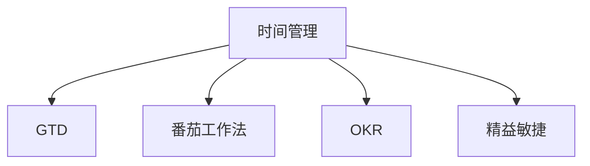

                 

# 程序员的时间管理：效率即财富

> 关键词：时间管理, 效率提升, 编程技巧, 任务优先级, 项目管理, 代码审查, 自我提升, 职业发展

## 1. 背景介绍

### 1.1 问题由来
在信息化和全球化深入发展的背景下，程序员这一职业迎来了前所未有的机遇与挑战。数字化和智能化变革极大地提高了软件开发的效率，但同时也增加了对编程人员的时间和精力要求。如何在高强度、快节奏的编程工作中保持高效、健康、快乐，成为摆在程序员面前的重要课题。

时间管理对于程序员尤其重要，合理的时间管理可以大大提升工作效率，避免过度加班，从而在保障身心健康的前提下，实现职业发展和技术突破。时间管理不仅涉及到日常工作流程，更涉及职业规划、团队协作等多个方面。本文将从多个维度出发，探讨程序员如何通过科学的时间管理，实现效率的提升和财富的积累。

### 1.2 问题核心关键点
本文将从以下几个核心关键点探讨程序员时间管理的策略和方法：
- 如何制定高效的时间管理计划，提高工作产出。
- 如何在高强度工作中找到工作和生活的平衡点。
- 如何利用时间管理工具和技术，提升工作效率和项目质量。
- 如何通过时间管理，实现个人职业发展和团队协作。

## 2. 核心概念与联系

### 2.1 核心概念概述

为了更好地理解时间管理和效率提升的方法，本节将介绍几个紧密相关的核心概念：

- **时间管理**：指通过科学规划和安排，最大化利用时间资源，以提高工作和生活的效率。
- **GTD（Getting Things Done）**：一种高效的时间管理方法，旨在帮助个人理清思路，避免遗漏重要任务。
- **番茄工作法**：一种时间管理技巧，通过将工作时间划分为25分钟的专注工作和5分钟的休息，提升工作效率。
- **OKR（Objectives and Key Results）**：一种目标管理工具，通过设定明确的目标和关键结果，推动项目和工作的进展。
- **精益敏捷**：一种项目管理方法，强调快速迭代、持续改进和团队协作，提升项目交付效率。

这些核心概念之间通过以下Mermaid流程图来展示：



这个流程图展示了我们探讨的核心概念及其之间的关系：

1. 时间管理是基础，GTD、番茄工作法、OKR、精益敏捷等方法都是时间管理的工具或应用。
2. GTD帮助我们理清任务，番茄工作法提升专注力，OKR设定目标，精益敏捷提升团队协作效率。
3. 通过合理应用这些方法，可以更有效地提升工作效率和项目质量，实现个人职业发展。

## 3. 核心算法原理 & 具体操作步骤
### 3.1 算法原理概述

基于时间管理的时间优化方法，本质上是通过对工作任务的分解、优先级排序、时间分块等手段，最大化地利用时间资源。核心原理可以概括为：

- 识别任务，分类整理，优先处理紧急且重要的任务。
- 分解任务为可管理的小步骤，并设定合理的时间分块。
- 使用工具和技术，如时间日志、任务清单、项目管理工具等，监控和调整时间使用情况。

### 3.2 算法步骤详解

基于上述原理，时间管理的步骤可以细分为：

1. **任务识别与整理**：
   - 列出所有待办事项，通过GTD方法，将任务分为项目、上下文、等待和废弃四类。
   - 利用番茄工作法，对任务进行分块和优先级排序。

2. **任务执行与监控**：
   - 通过设定时间分块（如番茄钟），专注执行任务。
   - 记录时间日志，使用OKR设定关键结果，监控任务进度。

3. **项目管理和优化**：
   - 采用精益敏捷方法，定期回顾和迭代，提升项目管理效率。
   - 利用项目管理工具（如Trello、Asana、JIRA），协调团队工作，追踪任务进展。

### 3.3 算法优缺点

时间管理的优点包括：
- 提升工作产出，避免时间浪费，提高工作效率。
- 帮助理清思路，减少心理负担，提升工作幸福感。
- 通过精益敏捷方法，提升项目交付效率和质量。

缺点则主要包括：
- 时间管理需要初期投入，掌握相关方法和工具。
- 面对突发事件和任务变更时，灵活调整时间安排有难度。
- 过度依赖于工具和技术，容易忽略人与人之间的沟通和协作。

### 3.4 算法应用领域

时间管理方法在软件开发项目和团队中得到了广泛应用，覆盖了任务规划、代码审查、团队协作等多个方面：

- **任务规划**：通过GTD、OKR方法，明确任务目标和分解步骤，提高任务执行的条理性和效率。
- **代码审查**：采用番茄工作法，设定专注时间段，提升代码审查的准确性和质量。
- **团队协作**：通过项目管理工具，协调团队任务分配和进度跟踪，增强团队协作效率。
- **项目管理**：采用精益敏捷方法，通过快速迭代和持续改进，提升项目交付速度和质量。

## 4. 数学模型和公式 & 详细讲解  
### 4.1 数学模型构建

假设程序员每天工作时间为$T$小时，其中用于代码编写的有效时间为$E$小时，用于任务管理的有效时间为$M$小时，用于项目评审和团队协作的有效时间为$R$小时。设任务分解后每个任务的完成时间为$t_i$，任务总数量为$N$。

任务完成的数学模型可以表示为：
$$
C = \sum_{i=1}^N t_i
$$

其中$C$为任务完成所需时间。

### 4.2 公式推导过程

对于单个任务$i$，根据GTD方法，将其分解为$n_i$个步骤，每个步骤的平均完成时间为$s_i$。则任务$i$的完成时间为：
$$
t_i = n_i \times s_i
$$

任务总完成时间$C$可以表示为：
$$
C = \sum_{i=1}^N n_i \times s_i
$$

根据番茄工作法，每日专注时间$E$和休息时间$R_e$，设专注与休息的时间比为$\alpha$，则：
$$
E = T \times \alpha, \quad R_e = T \times (1 - \alpha)
$$

将上述公式代入任务完成时间$C$的表达式，得：
$$
C = \frac{T}{\alpha} \times \sum_{i=1}^N n_i \times s_i
$$

在OKR方法下，设定关键结果$KR$，并设任务管理时间$M$为总工作时间的$\beta$，则：
$$
M = T \times \beta
$$

代入任务完成时间$C$的表达式，得：
$$
C = \frac{T}{\alpha} \times \sum_{i=1}^N n_i \times s_i = \frac{M}{\beta} \times \sum_{i=1}^N n_i \times s_i
$$

## 5. 项目实践：代码实例和详细解释说明
### 5.1 开发环境搭建

在进行时间管理实践前，我们需要准备好开发环境。以下是使用Python进行时间管理工具开发的流程：

1. 安装Python：从官网下载并安装Python，适用于Windows、Linux和macOS系统。

2. 安装pip和virtualenv：使用命令行工具安装pip和virtualenv，用于创建和管理Python虚拟环境。

3. 安装相关库：安装Flask、SQLAlchemy、PyJWT等常用库，用于开发时间管理工具。

4. 创建虚拟环境：使用virtualenv创建独立的环境，避免与其他项目冲突。

5. 配置开发环境：配置虚拟环境，确保开发工具和库的正常运行。

完成上述步骤后，即可在虚拟环境中开始时间管理工具的开发。

### 5.2 源代码详细实现

以下是使用Flask框架开发时间管理工具的Python代码实现：

```python
from flask import Flask, request, jsonify
from datetime import datetime
from sqlalchemy import create_engine, Column, Integer, String, DateTime
from sqlalchemy.orm import sessionmaker

app = Flask(__name__)

engine = create_engine('sqlite:///timemanagement.db')
Session = sessionmaker(bind=engine)
session = Session()

# 定义任务和项目表
class Task(db.Model):
    id = Column(Integer, primary_key=True)
    title = Column(String(128), nullable=False)
    description = Column(String(512))
    start_time = Column(DateTime, default=datetime.utcnow)
    end_time = Column(DateTime)
    status = Column(String(20), default='待处理')

class Project(db.Model):
    id = Column(Integer, primary_key=True)
    name = Column(String(128), nullable=False)
    tasks = relationship('Task', backref='project')

@app.route('/tasks', methods=['POST'])
def create_task():
    task_data = request.get_json()
    task = Task(title=task_data['title'], description=task_data['description'])
    session.add(task)
    session.commit()
    return jsonify({'task_id': task.id})

@app.route('/tasks/<int:id>', methods=['PUT'])
def update_task(id):
    task_data = request.get_json()
    task = session.query(Task).filter_by(id=id).first()
    if not task:
        return jsonify({'message': '任务不存在'})
    task.description = task_data['description']
    task.end_time = datetime.strptime(task_data['end_time'], '%Y-%m-%d %H:%M:%S')
    task.status = task_data['status']
    session.commit()
    return jsonify({'task_id': task.id})

@app.route('/tasks/<int:id>', methods=['DELETE'])
def delete_task(id):
    task = session.query(Task).filter_by(id=id).first()
    if not task:
        return jsonify({'message': '任务不存在'})
    session.delete(task)
    session.commit()
    return jsonify({'message': '任务删除成功'})

@app.route('/projects', methods=['POST'])
def create_project():
    project_data = request.get_json()
    project = Project(name=project_data['name'])
    session.add(project)
    session.commit()
    return jsonify({'project_id': project.id})

@app.route('/projects/<int:id>', methods=['PUT'])
def update_project(id):
    project_data = request.get_json()
    project = session.query(Project).filter_by(id=id).first()
    if not project:
        return jsonify({'message': '项目不存在'})
    project.name = project_data['name']
    session.commit()
    return jsonify({'project_id': project.id})

@app.route('/projects/<int:id>', methods=['DELETE'])
def delete_project(id):
    project = session.query(Project).filter_by(id=id).first()
    if not project:
        return jsonify({'message': '项目不存在'})
    session.delete(project)
    session.commit()
    return jsonify({'message': '项目删除成功'})

@app.route('/tasks', methods=['GET'])
def get_tasks():
    tasks = session.query(Task).all()
    task_list = [{'id': task.id, 'title': task.title, 'description': task.description, 'start_time': task.start_time.isoformat(), 'end_time': task.end_time.isoformat(), 'status': task.status} for task in tasks]
    return jsonify(task_list)

@app.route('/projects', methods=['GET'])
def get_projects():
    projects = session.query(Project).all()
    project_list = [{'id': project.id, 'name': project.name, 'tasks': [task.id for task in project.tasks]} for project in projects]
    return jsonify(project_list)
```

### 5.3 代码解读与分析

这里我们重点解析上述代码中的关键部分：

- **任务和项目表**：通过SQLAlchemy定义了任务和项目的数据模型，包含ID、标题、描述、开始时间、结束时间和状态等字段。
- **Flask API**：通过Flask定义了RESTful API，包括创建、更新、删除任务和项目，以及获取任务和项目列表。
- **数据库连接**：通过SQLAlchemy创建数据库连接，并使用Session进行数据库操作。
- **时间记录**：每个任务都有开始和结束时间记录，方便后续的任务分析和进度监控。

### 5.4 运行结果展示

使用上述代码搭建的时间管理工具，可以在浏览器中访问，并通过API进行任务和项目的创建、更新、删除和管理。以下是一个简单的使用示例：

```
POST /tasks
{
  "title": "项目编码",
  "description": "需要编写一个复杂的算法",
  "end_time": "2023-12-31 12:00:00",
  "status": "进行中"
}
```

响应结果：
```json
{
  "task_id": 1
}
```

使用此工具可以高效地管理每日任务和项目，确保按时完成。

## 6. 实际应用场景
### 6.1 软件开发

在软件开发项目中，时间管理尤为重要。通过合理的时间安排和任务分解，可以有效提升项目进展，避免资源浪费。例如，软件开发项目中常见的敏捷开发方法，即通过迭代和每日站会，进行任务管理和进度追踪，确保团队成员高效协同。

### 6.2 产品开发

产品开发过程中，需要频繁进行市场调研、需求分析、产品设计、用户体验测试等工作。通过任务管理工具，可以有效规划各项任务的时间节点，确保产品按时上线。例如，项目管理工具JIRA广泛应用于产品开发，通过任务分配、进度跟踪和优先级调整，提升产品开发效率。

### 6.3 技术支持

技术支持团队需要24小时响应各种技术问题，工作量大且不规律。通过时间管理工具，可以合理安排工作时间，避免过度加班，提升工作效率。例如，使用番茄工作法进行任务分块，每次专注25分钟，休息5分钟，可以显著提高问题解决效率。

### 6.4 未来应用展望

未来，时间管理工具将更加智能化和自动化，融入AI和机器学习技术，实现任务智能分配和进度预测。例如，使用机器学习算法，通过历史数据预测任务完成时间，提供更合理的时间安排。通过自动化工具，如任务自动化测试、代码自动部署等，进一步提升开发效率。

## 7. 工具和资源推荐
### 7.1 学习资源推荐

为了帮助程序员掌握时间管理技能，推荐以下学习资源：

1. **《GTD：简约人生艺术》**：戴维·艾伦的著作，详细介绍GTD方法的原理和实践技巧。
2. **《番茄工作法图解》**：弗朗西斯科·西里洛的著作，详细介绍番茄工作法的原理和操作步骤。
3. **《OKR：让团队目标对齐，让团队高绩效运转》**：约翰·杜尔的著作，详细介绍OKR方法的具体应用。
4. **《精益敏捷革命》**：哈米什·迈克尔的著作，详细介绍精益敏捷方法的原理和实践技巧。
5. **《Scrum敏捷项目管理指南》**：肯·施吕特和麦克·斯科特的著作，详细介绍Scrum项目管理的具体操作。

### 7.2 开发工具推荐

以下是几款用于时间管理开发的常用工具：

1. **Flask**：轻量级Web开发框架，易于上手，适合开发时间管理API。
2. **SQLAlchemy**：Python的ORM库，方便进行数据库操作。
3. **PyJWT**：Python的JSON Web Token库，用于实现API的认证和授权。
4. **Trello**：任务管理工具，支持项目和任务的创建、分配和跟踪。
5. **JIRA**：项目管理工具，支持敏捷开发和需求管理。

### 7.3 相关论文推荐

时间管理的研究涉及心理学、管理学等多个领域，以下是几篇经典论文，推荐阅读：

1. **《GTD：一个简化人生系统》**：戴维·艾伦的论文，详细介绍GTD方法的理论基础和实践技巧。
2. **《番茄工作法：提高效率的简单秘诀》**：弗朗西斯科·西里洛的论文，详细介绍番茄工作法的科学原理。
3. **《OKR：目标驱动的高绩效管理》**：约翰·杜尔的论文，详细介绍OKR方法的具体应用。
4. **《敏捷宣言：敏捷软件开发宣言》**：肯·施吕特和麦克·斯科特的论文，详细介绍敏捷开发的具体操作。

## 8. 总结：未来发展趋势与挑战
### 8.1 研究成果总结

本文从时间管理的基本原理出发，详细探讨了程序员如何通过科学的时间管理提升工作效率和项目质量。主要研究成果包括：

1. **任务识别与整理**：通过GTD方法，将任务分类整理，明确优先级。
2. **任务执行与监控**：使用番茄工作法，设定专注时间段，监控任务进度。
3. **项目管理和优化**：采用精益敏捷方法，进行快速迭代和持续改进。

### 8.2 未来发展趋势

未来时间管理技术的发展趋势主要包括：

1. **智能化与自动化**：融合AI和机器学习技术，实现任务智能分配和进度预测。
2. **跨平台协作**：通过云服务和分布式系统，实现跨团队、跨部门的高效协作。
3. **多模态交互**：结合语音识别、自然语言处理等技术，提升任务管理和协作效率。
4. **数据驱动决策**：通过大数据分析，优化时间管理策略，提升决策效果。

### 8.3 面临的挑战

时间管理面临的挑战主要包括：

1. **心理负担**：过度依赖时间管理工具，容易产生心理压力，影响工作效率。
2. **灵活调整**：面对突发事件和任务变更时，灵活调整时间安排有难度。
3. **团队协作**：过度依赖技术工具，容易忽略人与人之间的沟通和协作。

### 8.4 研究展望

未来时间管理的研究方向主要包括：

1. **心理管理**：研究时间管理对心理和情感的影响，提升工作幸福感和满意度。
2. **跨领域应用**：将时间管理理论和方法应用于不同领域，如教育、医疗等。
3. **持续改进**：通过反馈和迭代，持续优化时间管理工具和方法。
4. **伦理与安全**：研究时间管理的伦理和安全问题，避免隐私泄露和数据滥用。

## 9. 附录：常见问题与解答

**Q1：时间管理对编程工作有何影响？**

A: 时间管理通过科学规划和合理安排，显著提升编程效率和质量。合理的时间安排可以避免时间浪费，减少加班，提升工作幸福感。通过任务分解和优先级排序，可以提高任务的条理性和效率。

**Q2：如何应对突发事件和任务变更？**

A: 面对突发事件和任务变更，需要灵活调整时间安排。通过时间日志和项目管理工具，记录任务进展和状态，快速响应变化。通过精益敏捷方法，进行快速迭代和持续改进，确保项目按时交付。

**Q3：如何选择合适的任务管理工具？**

A: 选择任务管理工具时，需要考虑团队规模、任务复杂度、协作需求等因素。例如，小团队适合使用Trello，大团队适合使用JIRA，跨部门协作适合使用Confluence。

**Q4：时间管理是否适用于团队协作？**

A: 时间管理对团队协作非常重要。通过任务分配、进度跟踪和优先级调整，可以确保团队成员高效协同，提升项目交付效率。通过定期回顾和迭代，可以进行团队优化和持续改进。

---

作者：禅与计算机程序设计艺术 / Zen and the Art of Computer Programming

