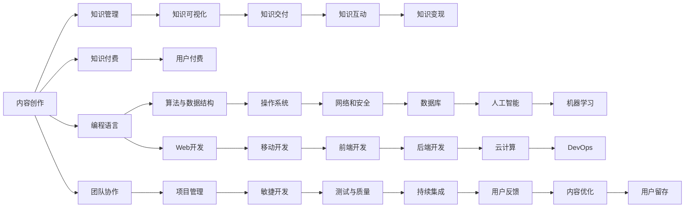

                 

## 1. 背景介绍

在数字化经济浪潮下，知识付费内容创作已成为企业和个人成长的重要手段。但仅仅掌握技术知识已不足够，程序员需要构建全面的知识创作工具箱，实现从技术到内容的多样化输出，提升自身价值和竞争力。本文将详细介绍几个核心概念和工具，帮助程序员在知识付费领域打造出优质内容，同时提升自身技术水平和职业发展。

## 2. 核心概念与联系

### 2.1 核心概念概述

本文涉及的核心概念包括：

- **内容创作(Content Creation)**：将技术知识转化为易于理解、具有教育意义的内容。
- **知识付费(Knowledge-Paid)**：用户为获取有价值知识而支付费用的商业模式。
- **知识管理(Knowledge Management)**：组织、存储、检索知识的方法和工具。
- **知识可视化(Knowledge Visualization)**：使用图表、动画等形式，将复杂知识直观展示。
- **知识交付(Knowledge Delivery)**：通过网络平台，将知识内容推送给用户。
- **知识互动(Knowledge Interaction)**：与用户进行互动，解答疑问，提升内容互动性。
- **知识变现(Knowledge Monetization)**：通过付费、广告、流量分成等方式，将知识内容转化为收益。

这些概念共同构成知识付费内容创作的基础，程序员应结合实际需求，灵活应用这些工具和平台，提升自身价值。

### 2.2 核心概念原理和架构的 Mermaid 流程图



此图展示了从内容创作到知识变现的全流程，每个环节都可以运用不同的工具和技术。

## 3. 核心算法原理 & 具体操作步骤

### 3.1 算法原理概述

内容创作和知识付费的核心算法原理包括：

- **文本生成(Text Generation)**：使用自然语言处理技术，生成易于理解的文章、博客等文本内容。
- **信息检索(Information Retrieval)**：通过算法快速检索相关知识，提高内容查找效率。
- **推荐系统(Recommendation System)**：根据用户行为，推荐最相关的知识内容。
- **情感分析(Sentiment Analysis)**：分析用户反馈，优化内容质量。

这些算法原理贯穿内容创作和知识付费的全过程，程序员应熟悉其原理和应用方法。

### 3.2 算法步骤详解

算法步骤一般包括：

1. **需求分析**：明确内容创作的目标和受众，确定内容形式和主题。
2. **内容策划**：策划具体内容，包括框架、结构、案例等。
3. **素材准备**：收集相关资料、代码片段、案例分析等素材。
4. **内容创作**：将素材转化为内容，使用文字、代码、图表等形式表达。
5. **内容优化**：通过用户反馈和分析，不断优化内容质量。
6. **知识交付**：将内容发布到知识付费平台，进行用户交互和反馈收集。

### 3.3 算法优缺点

算法优缺点如下：

- **优点**：提升内容创作效率，实现个性化推荐，提高用户满意度。
- **缺点**：算法依赖大量数据，需要持续维护和更新。算法模型复杂，难以解释。

### 3.4 算法应用领域

算法应用领域包括：

- **编程教育**：通过文章、视频、代码片段等形式，教授编程语言、算法、数据结构等。
- **技术博客**：将技术问题、案例分析、实战经验等内容化，吸引开发者阅读。
- **技术演讲**：制作幻灯片、视频，结合算法讲解实际问题，提升技术传播效果。
- **技术培训**：开发课程、在线讲座、互动练习等，提供系统化学习体验。

## 4. 数学模型和公式 & 详细讲解 & 举例说明

### 4.1 数学模型构建

数学模型构建通常基于以下框架：

- **目标函数**：定义最优解的数学表达式，如最大化用户满意度、最小化内容错误率等。
- **约束条件**：限制模型行为的条件，如数据范围、计算资源等。
- **优化算法**：求解目标函数的算法，如梯度下降、遗传算法等。

### 4.2 公式推导过程

以文本生成算法为例，公式推导过程如下：

$$
p(x|y) = \frac{p(x,y)}{p(y)}
$$

其中 $x$ 为生成的文本，$y$ 为上下文，$p(x,y)$ 为联合概率分布，$p(y)$ 为上下文概率。

### 4.3 案例分析与讲解

以推荐系统为例，推荐算法可以基于协同过滤、基于内容的推荐、混合推荐等方法实现。协同过滤算法计算用户和物品间的相似度，进行推荐。公式如下：

$$
sim(u,i) = \frac{\sum_{j\in I_u}r_{u,j} \times r_{v,j}}{\sqrt{\sum_{j\in I_u} r_{u,j}^2} \times \sqrt{\sum_{j\in I_v} r_{v,j}^2}}
$$

其中 $u,v$ 为两个用户，$I_u$ 为用户 $u$ 喜欢的物品，$r_{u,j}$ 为用户 $u$ 对物品 $j$ 的评分。

## 5. 项目实践：代码实例和详细解释说明

### 5.1 开发环境搭建

开发环境搭建步骤如下：

1. **安装开发环境**：安装Python、pip、Git等工具。
2. **配置开发工具**：安装IDE、调试工具、版本控制等。
3. **环境依赖管理**：使用pip管理依赖库，如Flask、Django等。
4. **版本控制**：使用Git进行版本控制，管理代码变更。

### 5.2 源代码详细实现

以下是一个简单的Python Flask应用示例：

```python
from flask import Flask, render_template, request

app = Flask(__name__)

@app.route('/')
def index():
    return render_template('index.html')

@app.route('/search', methods=['POST'])
def search():
    query = request.form['query']
    # 执行搜索逻辑，如调用API
    results = search(query)
    return render_template('search.html', results=results)

if __name__ == '__main__':
    app.run(debug=True)
```

### 5.3 代码解读与分析

- **Flask框架**：使用Flask框架实现简单的Web应用。
- **路由和视图**：通过路由定义应用的不同路径，视图函数负责处理请求并返回响应。
- **模板引擎**：使用模板引擎将动态内容渲染为HTML页面。
- **用户交互**：通过表单处理用户输入，调用API进行数据检索和处理。

### 5.4 运行结果展示

运行上述代码，访问`http://localhost:5000/`即可在浏览器中看到应用界面。

## 6. 实际应用场景

### 6.1 编程教育

编程教育中，可以利用算法生成示例代码、问题描述和解答步骤，提升学生学习体验。如使用GPT-3等模型生成课程内容，配合代码片段、问题库、测试工具等，形成系统化编程学习平台。

### 6.2 技术博客

技术博客通过深度分析技术问题和应用案例，吸引技术爱好者阅读和分享。可以使用Markdown、HTML、Jupyter Notebook等工具编写内容，发布到博客平台或个人网站。

### 6.3 技术演讲

技术演讲结合算法讲解实际问题，提升技术传播效果。可以使用PowerPoint、Keynote等工具制作幻灯片，结合代码示例、数据可视化，提升观众理解度和兴趣。

### 6.4 技术培训

技术培训通过课程、在线讲座、互动练习等形式，提供系统化学习体验。可以使用MOOC平台、视频课程、编程练习等工具，构建完整的培训体系。

### 6.5 未来应用展望

未来，知识付费内容创作将更加多样化，包括短视频、直播、音频等形式。同时，知识付费将更多地结合人工智能、大数据、区块链等技术，提升内容质量和变现能力。

## 7. 工具和资源推荐

### 7.1 学习资源推荐

- **在线课程**：Coursera、Udemy、edX等平台提供丰富的编程和数据科学课程。
- **开源项目**：GitHub、GitLab等平台提供大量开源项目和代码库，方便学习和借鉴。
- **书籍资源**：《深入浅出Python》、《算法导论》、《深度学习》等经典书籍，帮助深入理解技术原理。

### 7.2 开发工具推荐

- **IDE集成开发环境**：Visual Studio Code、PyCharm等，提供代码编写、调试、测试等工具。
- **版本控制**：Git、SVN等，管理代码变更和项目协作。
- **文档编写**：Markdown、LaTeX等，编写和发布技术文章、书籍。
- **项目管理**：Trello、Jira等，管理项目进度和任务分配。

### 7.3 相关论文推荐

- **编程教育**：《编程课程设计：原则与实践》（Richard M. N adipiscing, 2012）
- **技术博客**：《如何写出有吸引力的技术博客》（John D. Cook, 2018）
- **技术演讲**：《演讲的艺术与科学》（Douglas Comer, 2016）
- **技术培训**：《敏捷开发实践》（Ken Schwaber, 2004）

## 8. 总结：未来发展趋势与挑战

### 8.1 研究成果总结

知识付费内容创作已成为技术发展的重要趋势，编程教育、技术博客、技术演讲和培训等领域受益颇深。未来，知识付费内容将更多地结合人工智能、大数据、区块链等技术，提升内容质量和变现能力。

### 8.2 未来发展趋势

- **智能化创作**：使用人工智能生成高质量内容，提升创作效率。
- **个性化推荐**：基于用户行为进行个性化推荐，提高用户满意度。
- **社交化互动**：增强内容互动性，促进用户分享和讨论。
- **内容生态化**：构建内容生态系统，提供更多元化的知识服务。

### 8.3 面临的挑战

- **内容质量控制**：确保内容准确性、实用性、易读性。
- **用户反馈机制**：建立有效的用户反馈机制，不断优化内容质量。
- **知识变现难度**：寻找合适的变现模式，提升内容价值。
- **平台竞争压力**：应对其他平台和自媒体的竞争，提升用户粘性。

### 8.4 研究展望

- **知识分类和检索**：构建知识分类体系，优化检索算法。
- **内容多样化**：引入短视频、直播等多样化内容形式。
- **社区化协作**：建立社区协作平台，提升内容创作质量。
- **跨领域融合**：结合人工智能、大数据、区块链等技术，实现知识创新的突破。

## 9. 附录：常见问题与解答

**Q1: 程序员如何构建高质量的知识付费内容？**

A: 程序员构建高质量的内容需注意以下几点：
- **目标受众**：明确目标受众，制定内容策略。
- **内容规划**：制定详细的内容规划，包括内容主题、格式、长度等。
- **内容创作**：注重内容深度和广度，结合案例分析、实战经验，增强用户理解。
- **内容优化**：通过用户反馈和数据分析，不断优化内容质量。

**Q2: 知识付费平台如何提高用户留存率？**

A: 知识付费平台提高用户留存率的关键在于：
- **优质内容**：提供高质量、实用的内容，满足用户需求。
- **互动体验**：增强用户互动性，如问答、讨论、投票等。
- **用户粘性**：通过社区功能、会员权益、推荐系统等，增强用户粘性。
- **内容更新**：定期更新内容，保持平台活跃度。

**Q3: 如何提高内容创作的效率？**

A: 提高内容创作效率的方法包括：
- **工具支持**：使用文本生成工具、代码片段库、模板引擎等，提升创作速度。
- **知识管理**：构建知识库，方便检索和复用。
- **知识可视化**：使用图表、动画等形式，将复杂知识直观展示。
- **团队协作**：组建内容创作团队，分工明确，提高协作效率。

**Q4: 如何评估内容质量？**

A: 评估内容质量需考虑以下几点：
- **准确性**：确保内容事实准确，逻辑清晰。
- **实用性**：内容是否具备实际操作性，能否解决用户实际问题。
- **易读性**：内容是否易于理解，是否通俗易懂。
- **互动性**：内容是否具有互动性，是否鼓励用户参与讨论。

**Q5: 如何平衡内容创作和知识变现？**

A: 平衡内容创作和知识变现的关键在于：
- **内容质量**：确保内容高质量，提升用户满意度。
- **变现模式**：探索多种变现模式，如课程销售、广告分成、会员订阅等。
- **用户反馈**：通过用户反馈，调整内容策略，提升用户粘性。
- **数据分析**：利用数据分析，优化内容变现策略。

作者：禅与计算机程序设计艺术 / Zen and the Art of Computer Programming

