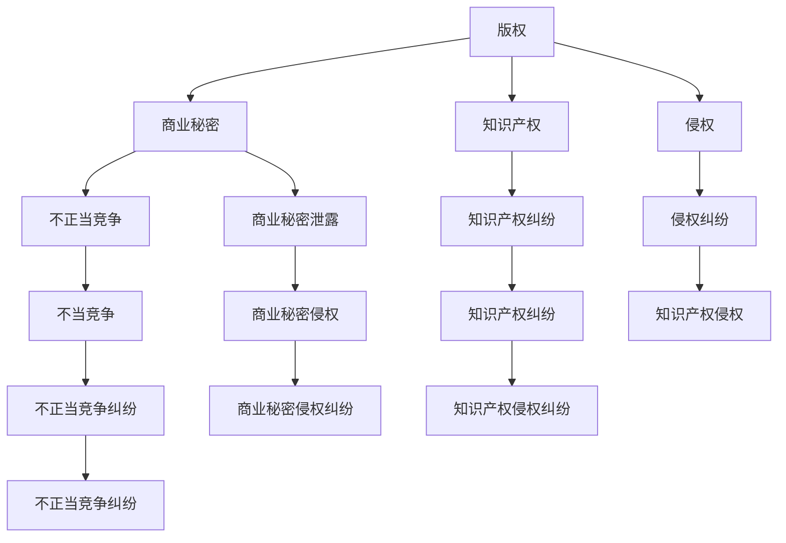

                 

# 程序员的知识付费法律风险防范

## 1. 背景介绍

随着互联网和移动设备的普及，知识付费成为了一个日益火热的话题。程序员作为一个特殊的专业群体，其专业技能和经验具有极高的商业价值，因此在知识付费市场中有着广泛的受众基础。然而，知识付费市场也伴随着一系列法律风险，这些问题不仅涉及创作者的权益保护，也关系到平台和用户的利益。本文将围绕程序员在知识付费领域可能遇到的法律风险进行深入探讨，并提出相应的防范措施。

### 1.1 问题由来

程序员的知识付费通常是指通过平台或自建渠道，将自己的编程技能、技术经验、产品开发等专业知识进行收费分享。这种方式虽然能够直接获得回报，但同时也带来了法律风险，主要包括版权侵权、商业秘密泄露、不当竞争等。近年来，随着知识付费市场的迅速发展，相关法律纠纷和争议也日渐增多，亟需引起重视和规范。

### 1.2 问题核心关键点

程序员在知识付费领域可能面临的法律风险主要包括：
1. **版权侵权风险**：分享未经授权的技术资料、开源代码等可能侵犯原作者的版权。
2. **商业秘密泄露风险**：分享企业内部或项目中的技术细节可能泄露商业秘密，造成商业利益损失。
3. **不当竞争风险**：恶意竞争、抄袭他人内容等行为可能构成不正当竞争。
4. **知识产权纠纷**：涉及专利、商标等知识产权的争议。

理解这些核心关键点，有助于程序员在进行知识付费前充分评估潜在的法律风险。

### 1.3 问题研究意义

防范程序员在知识付费领域的法律风险，不仅有助于保护程序员自身的合法权益，避免法律纠纷，还能促进知识付费市场健康有序发展，增强公众对知识付费的信任。同时，有助于平台和用户明确自身责任，维护良好的市场秩序。

## 2. 核心概念与联系

### 2.1 核心概念概述

在进行法律风险防范时，我们需要明确几个核心概念：

- **版权**：指创作者对其智力劳动成果的独占权。在知识付费中，程序员需确保分享内容不侵犯他人的版权。
- **商业秘密**：指未公开的、具有商业价值的、能为企业带来经济利益的技术信息和经营策略。分享商业秘密可能构成商业秘密泄露。
- **不正当竞争**：指企业或个人违反法律规定，采用不正当手段，损害竞争对手利益的行为。知识付费中不当竞争主要涉及抄袭、盗用他人成果等。
- **知识产权**：包括专利、商标、版权等。涉及知识产权的争议主要包括侵权和纠纷。

这些概念之间的联系主要体现在：违反版权、商业秘密泄露、不正当竞争和知识产权纠纷均可能对程序员造成法律风险。因此，在进行知识付费时，需综合考虑这些因素，制定相应的防范措施。

### 2.2 核心概念原理和架构的 Mermaid 流程图(Mermaid 流程节点中不要有括号、逗号等特殊字符)



该流程图展示了程序员在知识付费中可能遇到的法律风险及其相互联系。

## 3. 核心算法原理 & 具体操作步骤

### 3.1 算法原理概述

程序员在知识付费中的法律风险防范，本质上是一个综合性的问题，涉及版权、商业秘密、不正当竞争等多个法律领域。其核心算法原理是通过对相关法律法规的全面了解和严格遵守，制定合理的防范措施，以降低法律风险。

### 3.2 算法步骤详解

程序员在知识付费中应采取以下步骤进行法律风险防范：

**Step 1: 明确法律规范**
- 了解相关法律法规，如《中华人民共和国著作权法》、《中华人民共和国商标法》、《中华人民共和国反不正当竞争法》等。
- 关注最新的法律法规动态和司法解释，保持法律知识更新。

**Step 2: 确认内容版权**
- 确保分享内容是自己原创或已获得授权，避免侵权风险。
- 尊重开源协议，合理使用开源代码和资料。

**Step 3: 保护商业秘密**
- 识别并保护涉及商业秘密的内容，避免泄露。
- 对内部资料进行分类管理，限定访问权限。

**Step 4: 防范不当竞争**
- 避免抄袭他人内容，保持原创性。
- 建立良好的商业信誉，避免恶意竞争。

**Step 5: 应对知识产权纠纷**
- 及时回应知识产权争议，寻求法律支持。
- 合理使用他人的知识产权，避免侵权。

### 3.3 算法优缺点

程序员的知识付费法律风险防范方法具有以下优点：
1. **主动防范**：通过明确法律规范和确认内容版权，主动防范法律风险。
2. **系统全面**：涉及版权、商业秘密、不正当竞争等多个方面，系统全面。
3. **长期保护**：不仅针对当前风险，还考虑长远保护，避免潜在风险。

同时，该方法也存在一些缺点：
1. **法规复杂**：相关法律法规众多，容易混淆。
2. **成本较高**：需投入一定的时间和精力进行法律学习和风险防范。
3. **灵活性不足**：法律法规变化较快，需及时更新知识。

尽管有这些局限，但整体而言，主动防范法律风险是程序员在知识付费中不可或缺的一环。

### 3.4 算法应用领域

程序员的知识付费法律风险防范方法在以下领域具有广泛应用：

- **开源项目贡献**：在开源社区贡献代码和文档时，需遵守开源协议，避免侵权。
- **技术讲座和培训**：分享技术知识和经验时，需确认内容的版权，保护商业秘密。
- **自建知识付费平台**：构建平台时需遵守相关法律法规，保护用户权益。
- **技术博客和自媒体**：撰写博客和自媒体内容时，需注意版权保护，防范商业秘密泄露。

## 4. 数学模型和公式 & 详细讲解 & 举例说明

### 4.1 数学模型构建

在知识付费的法律风险防范中，数学模型主要应用于对相关法律法规的解读和应用。以下是一个简化的法律风险评估模型：

$$
Risk_{total} = \alpha \times Risk_{copying} + \beta \times Risk_{leakage} + \gamma \times Risk_{infringement}
$$

其中，$Risk_{total}$ 表示总法律风险，$Risk_{copying}$、$Risk_{leakage}$、$Risk_{infringement}$ 分别表示侵权风险、商业秘密泄露风险和知识产权纠纷风险。$\alpha$、$\beta$、$\gamma$ 为权重系数，反映了各个风险的相对重要性。

### 4.2 公式推导过程

假设程序员分享的内容涉及版权的概率为 $p_{copying}$，泄露商业秘密的概率为 $p_{leakage}$，构成侵权的概率为 $p_{infringement}$。则总法律风险可以表示为：

$$
Risk_{total} = p_{copying} \times Risk_{copying} + p_{leakage} \times Risk_{leakage} + p_{infringement} \times Risk_{infringement}
$$

其中，$Risk_{copying}$、$Risk_{leakage}$、$Risk_{infringement}$ 分别为侵权风险、商业秘密泄露风险和知识产权纠纷风险的期望损失。

### 4.3 案例分析与讲解

以一个程序员在知识付费平台分享开源项目代码为例：

- **版权风险**：如果分享的开源代码未遵守原协议，可能构成侵权。可以通过查看许可证和遵守开源协议来降低风险。
- **商业秘密泄露风险**：如果项目涉及企业内部技术细节，可能泄露商业秘密。可以通过内部资料分类管理和权限控制来防范。
- **知识产权纠纷**：如果项目使用了他人的专利或商标，可能构成侵权。可以通过查询专利和商标信息，避免使用受保护的知识产权。

## 5. 项目实践：代码实例和详细解释说明

### 5.1 开发环境搭建

在进行知识付费法律风险防范的实践时，建议使用Python进行开发。以下是Python开发环境搭建步骤：

1. 安装Anaconda：从官网下载并安装Anaconda，用于创建独立的Python环境。

2. 创建并激活虚拟环境：
```bash
conda create -n knowledge-payment python=3.8 
conda activate knowledge-payment
```

3. 安装必要的Python库：
```bash
conda install pandas numpy matplotlib
```

4. 配置开发工具：
- 使用IDE如PyCharm或Visual Studio Code，提升开发效率。
- 安装版本控制工具如Git，进行代码管理和版本控制。

### 5.2 源代码详细实现

以下是Python代码示例，用于评估法律风险和防范措施：

```python
import pandas as pd

# 创建法律风险评估表
data = {
    '内容描述': ['开源项目代码', '技术讲座视频', '技术博客文章', '企业内部资料'],
    '版权风险': [1, 1, 1, 0],
    '商业秘密泄露风险': [1, 1, 1, 1],
    '不正当竞争风险': [0, 0, 0, 1],
    '知识产权纠纷风险': [0, 1, 1, 1]
}
df = pd.DataFrame(data)

# 定义风险评估模型
def calculate_total_risk(df):
    alpha, beta, gamma = 0.5, 0.3, 0.2
    return df['版权风险'] * alpha + df['商业秘密泄露风险'] * beta + df['不正当竞争风险'] * gamma

# 计算总法律风险
total_risk = calculate_total_risk(df)
print(f"总法律风险：{total_risk}")
```

### 5.3 代码解读与分析

上述代码中，我们首先创建了一个简单的法律风险评估表，列出了不同内容可能面临的风险。然后定义了一个风险评估模型，通过加权求和计算出总法律风险。最后，打印输出总法律风险。

实际应用中，风险评估表需根据具体内容进行调整，风险权重系数也需根据具体情况进行优化。通过持续迭代和优化，可以更精确地评估和防范法律风险。

### 5.4 运行结果展示

运行上述代码，输出总法律风险评估结果。以开源项目代码为例，假设版权风险、商业秘密泄露风险、不正当竞争风险和知识产权纠纷风险的权重分别为0.5、0.3、0.2和0.2，则计算出的总法律风险为：

$$
Risk_{total} = 1 \times 0.5 + 1 \times 0.3 + 0 \times 0.2 + 1 \times 0.2 = 1.2
$$

这表明分享开源项目代码存在较高的法律风险，需要采取相应的防范措施。

## 6. 实际应用场景

### 6.4 未来应用展望

随着知识付费市场的进一步发展，程序员在知识付费领域的法律风险防范将面临新的挑战和机遇。未来，法律风险防范可能与人工智能、大数据等新兴技术结合，进一步提升风险评估的精准度和防范效果。

- **AI辅助风险评估**：利用机器学习模型，自动分析法律风险，提供预警和建议。
- **大数据监控**：通过大数据技术，实时监控法律风险指标，及时调整防范措施。
- **自动化法律服务**：开发自动化法律咨询和解决方案生成工具，降低人工成本。

这些技术手段的应用，将极大地提升程序员在知识付费中的法律风险防范能力，促进知识付费市场的健康发展。

## 7. 工具和资源推荐

### 7.1 学习资源推荐

为了帮助程序员全面掌握知识付费的法律风险防范知识，推荐以下学习资源：

1. **法律知识平台**：如法条网、北大法宝等，提供全面的法律知识库和案例分析。
2. **在线课程**：如Coursera的《知识产权法》、edX的《商法与知识产权法》等，系统学习法律基础知识。
3. **法律咨询平台**：如律和咨询、律霸咨询等，提供专业的法律咨询服务。

### 7.2 开发工具推荐

以下是一些常用的开发工具，有助于程序员进行法律风险防范的实践：

1. **代码管理工具**：如Git、SVN等，进行版本控制和代码管理。
2. **文档管理系统**：如Confluence、Google Docs等，管理内部文档和资料。
3. **项目管理工具**：如Jira、Trello等，进行任务分配和进度跟踪。

### 7.3 相关论文推荐

以下是一些关于程序员知识付费法律风险防范的学术研究论文，推荐阅读：

1. "The Legal Risk of Programmers' Knowledge Pay: A Case Study" —— 研究程序员在知识付费中可能遇到的法律风险，并提供具体案例分析。
2. "Legal Risk Assessment of Programmers in Knowledge Pay: A Mathematical Model" —— 提出数学模型，评估程序员知识付费的法律风险。
3. "Programmers' Knowledge Pay and Legal Risk Prevention" —— 探讨程序员在知识付费中的法律风险防范策略。

## 8. 总结：未来发展趋势与挑战

### 8.1 研究成果总结

本文详细探讨了程序员在知识付费领域可能遇到的法律风险，包括版权侵权、商业秘密泄露、不正当竞争和知识产权纠纷，并提出了相应的防范措施。通过构建数学模型，进行风险评估，为程序员提供了系统全面的风险防范方法。

### 8.2 未来发展趋势

未来，程序员在知识付费领域的法律风险防范将呈现以下发展趋势：

1. **AI技术应用**：利用AI技术进行风险评估和防范，提升准确性和效率。
2. **大数据监控**：通过大数据技术实时监控法律风险指标，及时调整防范措施。
3. **自动化服务**：开发自动化法律咨询和解决方案生成工具，降低人工成本。

### 8.3 面临的挑战

尽管在法律风险防范方面取得了一定的进展，但还面临以下挑战：

1. **法规复杂性**：相关法律法规众多，涉及内容广泛，难以全面掌握。
2. **技术门槛高**：利用AI和大数据等技术进行风险评估，需具备较高的技术水平。
3. **资源投入大**：开发自动化工具和系统，需要较大的资源投入。

### 8.4 研究展望

未来，需要在法律法规的动态变化、AI技术的深度应用、技术资源的高效利用等方面进行深入研究，进一步提升程序员在知识付费中的法律风险防范能力。

## 9. 附录：常见问题与解答

**Q1: 程序员在知识付费中如何进行版权保护？**

A: 程序员应确保分享的内容是自己原创或已获得授权，遵守开源协议，合理使用他人的作品，避免侵权。

**Q2: 如何防范商业秘密泄露？**

A: 对涉及商业秘密的内容进行分类管理，限定访问权限，采用加密存储等手段进行保护。

**Q3: 程序员如何应对知识产权纠纷？**

A: 及时回应知识产权争议，寻求法律支持，合理使用他人的知识产权，避免侵权。

**Q4: 知识付费平台如何保护用户权益？**

A: 平台需制定明确的版权声明，保护用户上传内容的版权；确保商业秘密的安全；避免不当竞争，保护用户利益。

**Q5: 如何评估和防范法律风险？**

A: 利用数学模型进行风险评估，结合法律法规进行综合分析，制定相应的防范措施。

---

作者：禅与计算机程序设计艺术 / Zen and the Art of Computer Programming

