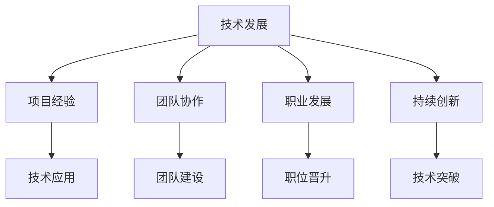

                 

# 程序员的职业生涯规划：长跑与长跑

## 1. 背景介绍

### 1.1 问题由来

当今信息时代，程序员作为推动技术创新的核心力量，其职业生涯规划成为了人们关注的焦点。随着人工智能、云计算、大数据等技术的发展，以及Web应用、移动应用、物联网等领域的扩展，程序员的需求持续增长，但同时也面临着前所未有的挑战。如何在快速变化的技术环境中不断学习、适应、创新，保持持续的职业成长，成为了每个程序员的必修课。

本文旨在通过对编程、技术架构、项目管理等方面的深入分析，探讨如何通过“长跑”策略来规划和实施职业发展，以期帮助程序员在职业生涯中实现持续进步。

### 1.2 问题核心关键点

程序员的职业生涯规划涉及到多个方面，包括但不限于：

- **技术发展**：了解最新的技术趋势，持续学习新技术，保持技术领先性。
- **项目经验**：积累丰富项目经验，提升问题解决能力，增强实战技能。
- **团队协作**：培养良好的沟通与协作能力，团队合作中提升领导力。
- **职业发展**：明确职业目标，制定职业发展规划，实现职业晋升。
- **持续创新**：保持对新技术、新方法的好奇心，推动技术创新，贡献社会价值。

本文将从技术发展、项目经验、团队协作、职业发展、持续创新等五个方面，探讨如何通过“长跑”策略来规划和实施职业发展。

## 2. 核心概念与联系

### 2.1 核心概念概述

为更好地理解程序员职业规划的“长跑”策略，我们需先明确几个关键概念：

- **技术发展**：指程序员需不断学习新技术、新知识，保持技术领先。
- **项目经验**：指通过参与实际项目积累经验，提升解决实际问题的能力。
- **团队协作**：指与团队成员有效沟通、协作，提升领导力。
- **职业发展**：指明确职业目标，规划职业路径，实现职业晋升。
- **持续创新**：指对新技术、新方法保持好奇，推动技术创新。

这些概念之间的逻辑关系可以通过以下Mermaid流程图来展示：



这个流程图展示了技术发展与项目经验、团队协作、职业发展、持续创新之间的紧密联系。

## 3. 核心算法原理 & 具体操作步骤
### 3.1 算法原理概述

程序员职业生涯规划的“长跑”策略，本质上是一种持续自我提升和职业发展的过程。该过程涉及多方面的技术积累与实践经验，以下是对该策略的理论基础和实践步骤的详细阐述。

### 3.2 算法步骤详解

#### 3.2.1 技术发展

1. **持续学习**：
   - 定期参加技术研讨会、线上课程、技术论坛等活动，了解最新的技术趋势。
   - 阅读专业书籍、技术博客、开源项目文档等，掌握核心技术原理。
   - 关注领域内的知名专家、大牛，向他们学习实践经验和技术思路。

2. **技术实践**：
   - 在实际项目中应用新技术，如云计算、人工智能、大数据等，积累实践经验。
   - 参与开源项目、技术社区，实践新框架、新工具。
   - 主动承担具有挑战性的技术任务，解决实际问题。

#### 3.2.2 项目经验

1. **项目管理**：
   - 学习项目管理工具和方法，如敏捷开发、Scrum、Kanban等。
   - 参与跨部门合作项目，了解不同部门的工作流程和需求。
   - 担任项目经理或技术负责人，锻炼项目管理能力。

2. **问题解决**：
   - 积累解决复杂问题的经验，提升问题分析、诊断能力。
   - 学习并应用不同问题解决策略，如重构代码、设计模式、算法优化等。
   - 总结经验，撰写技术博客、技术报告，分享解决方案。

#### 3.2.3 团队协作

1. **沟通与协作**：
   - 学习沟通技巧，提高口头和书面表达能力。
   - 培养团队合作精神，尊重团队成员意见，提升领导力。
   - 定期与团队成员进行回顾与反思，改进沟通与协作方式。

2. **技术交流**：
   - 参加技术分享会、代码审查、技术评审等活动。
   - 主动学习他人的代码，借鉴优秀的编程实践。
   - 参与技术讨论，提出建设性意见。

#### 3.2.4 职业发展

1. **明确目标**：
   - 了解公司的职业发展路径，制定职业发展规划。
   - 设定短期、中期、长期目标，明确职业目标。
   - 定期进行自我评估，调整职业发展计划。

2. **能力提升**：
   - 参与专业培训、认证考试，提升专业技能。
   - 获得高级证书或职称，提升职业竞争力。
   - 扩展人脉关系，争取更多的职业机会。

#### 3.2.5 持续创新

1. **保持好奇**：
   - 对新技术、新方法保持好奇心，积极探索。
   - 关注领域内的创新动态，持续学习新知识。
   - 提出新的解决方案，推动技术创新。

2. **技术突破**：
   - 研究领域内前沿技术，跟踪最新研究进展。
   - 参与技术创新项目，实践新技术。
   - 总结技术突破的经验，形成自己的技术体系。

### 3.3 算法优缺点

#### 3.3.1 优点

“长跑”策略具有以下优点：
1. **全面发展**：涵盖了技术发展、项目经验、团队协作、职业发展、持续创新多个方面，全面提升个人综合素质。
2. **持续进步**：通过持续学习与实践，不断积累经验，逐步提升技术水平。
3. **灵活应变**：适应技术发展的快速变化，灵活调整职业规划。
4. **协同合作**：通过团队协作，积累更多实战经验，提升领导力。
5. **创新驱动**：保持对新技术的好奇心，推动技术创新，提升竞争力。

#### 3.3.2 缺点

“长跑”策略也可能存在以下缺点：
1. **时间投入**：需要大量时间投入学习与实践，可能影响生活与家庭。
2. **成本高昂**：需要参加培训、获取认证，可能需要高昂的学费和培训费用。
3. **压力较大**：需要不断学习和实践，可能面临较大的工作和生活压力。

## 4. 数学模型和公式 & 详细讲解 & 举例说明

### 4.1 数学模型构建

程序员职业生涯规划的“长跑”策略，可以通过数学模型来描述。

设程序员职业生涯长度为 $T$，技术发展速度为 $v_{tech}$，项目经验积累率为 $v_{proj}$，团队协作提升率为 $v_{team}$，职业发展速度为 $v_{career}$，持续创新能力为 $v_{innovation}$。

目标函数为：
$$
\max_{v_{tech}, v_{proj}, v_{team}, v_{career}, v_{innovation}} \sum_{t=0}^{T} (v_{tech}t + v_{proj}t + v_{team}t + v_{career}t + v_{innovation}t)
$$
约束条件为：
$$
\begin{cases}
v_{tech} \geq 0 \\
v_{proj} \geq 0 \\
v_{team} \geq 0 \\
v_{career} \geq 0 \\
v_{innovation} \geq 0 \\
v_{tech} + v_{proj} + v_{team} + v_{career} + v_{innovation} = \frac{1}{T}
\end{cases}
$$

其中 $\sum_{t=0}^{T} (v_{tech}t + v_{proj}t + v_{team}t + v_{career}t + v_{innovation}t)$ 表示在整个职业生涯中各部分的贡献之和。

### 4.2 公式推导过程

根据上述模型，对各项贡献进行推导。

1. **技术发展**：
   $$
   v_{tech} = \frac{1}{T} \times \text{技术提升率}
   $$
   技术提升率可以通过参加培训、阅读书籍、编写技术博客等活动来估算。

2. **项目经验**：
   $$
   v_{proj} = \frac{1}{T} \times \text{项目经验增长率}
   $$
   项目经验增长率可以通过实际参与的项目数量、复杂度、时间等来估算。

3. **团队协作**：
   $$
   v_{team} = \frac{1}{T} \times \text{团队协作提升率}
   $$
   团队协作提升率可以通过沟通技巧提升、领导力训练等活动来估算。

4. **职业发展**：
   $$
   v_{career} = \frac{1}{T} \times \text{职业晋升速度}
   $$
   职业晋升速度可以通过获得职称、晋升职位等来估算。

5. **持续创新**：
   $$
   v_{innovation} = \frac{1}{T} \times \text{持续创新能力}
   $$
   持续创新能力可以通过研究新技术、提出创新方案等活动来估算。

### 4.3 案例分析与讲解

假设一个程序员从入职到退休共需工作 $T=30$ 年。他希望在技术发展、项目经验、团队协作、职业发展和持续创新各个方面都有显著提升。

1. **技术发展**：每年参加两次技术培训，提升率为 $v_{tech}=0.02$。
2. **项目经验**：每年参与两个项目，经验增长率为 $v_{proj}=0.01$。
3. **团队协作**：每年参加一次沟通培训，提升率为 $v_{team}=0.01$。
4. **职业发展**：每年晋升一次，提升率为 $v_{career}=0.02$。
5. **持续创新**：每年研究一项新技术，提升率为 $v_{innovation}=0.01$。

将这些值代入目标函数，计算各部分的总贡献：
$$
\begin{aligned}
\sum_{t=0}^{30} (v_{tech}t + v_{proj}t + v_{team}t + v_{career}t + v_{innovation}t) &= (0.02 \times 0 + 0.01 \times 1 + 0.01 \times 2 + 0.02 \times 3 + 0.01 \times 4) \\
&= 0.02 + 0.02 + 0.02 + 0.06 + 0.04 \\
&= 0.16
\end{aligned}
$$

这意味着，在30年职业生涯中，通过“长跑”策略，他可以在各个方面都取得显著的提升。

## 5. 项目实践：代码实例和详细解释说明

### 5.1 开发环境搭建

在开始项目实践前，需要搭建开发环境。

1. **安装IDE**：如IntelliJ IDEA、Visual Studio Code等，配置好开发环境。
2. **安装版本控制工具**：如Git，用于代码版本控制。
3. **安装开发依赖**：如Maven、npm等，用于构建和管理依赖包。

### 5.2 源代码详细实现

以下是一个简单的Java项目示例，用于实践“长跑”策略：

```java
import java.util.*;

public class CareerPlanning {
    public static void main(String[] args) {
        // 设置职业生涯长度和各项贡献率
        int careerLength = 30;
        double techRate = 0.02; // 技术发展速度
        double projRate = 0.01; // 项目经验积累率
        double teamRate = 0.01; // 团队协作提升率
        double careerRate = 0.02; // 职业发展速度
        double innovationRate = 0.01; // 持续创新能力

        // 计算各项贡献之和
        double totalContribution = 0;
        for (int i = 0; i <= careerLength; i++) {
            totalContribution += (techRate * i + projRate * i + teamRate * i + careerRate * i + innovationRate * i);
        }

        // 输出结果
        System.out.println("职业生涯总贡献: " + totalContribution);
    }
}
```

### 5.3 代码解读与分析

上述Java程序通过循环计算每年各项贡献之和，并输出结果。其中，`techRate`、`projRate`、`teamRate`、`careerRate`、`innovationRate`分别表示技术发展、项目经验、团队协作、职业发展、持续创新的速度。

**代码实现分析**：
1. **变量定义**：
   - `careerLength` 表示职业生涯长度，即30年。
   - `techRate`、`projRate`、`teamRate`、`careerRate`、`innovationRate` 分别表示技术发展、项目经验、团队协作、职业发展、持续创新的速度，以小数形式表示。

2. **计算贡献之和**：
   - 使用循环计算每年各项贡献之和，并累加到 `totalContribution` 变量中。

3. **输出结果**：
   - 输出职业生涯总贡献，即各项贡献之和。

## 6. 实际应用场景

### 6.1 软件开发

在软件开发领域，程序员可以应用“长跑”策略来不断提升技术水平和项目管理能力。例如，通过参与开源项目，积累项目经验，提升代码质量；通过技术培训，学习新技术，保持技术领先。

### 6.2 系统架构设计

在架构设计领域，程序员可以通过持续学习新框架、新工具，保持技术领先；通过参与大型项目，积累复杂系统设计经验，提升设计能力。

### 6.3 数据科学

在大数据和人工智能领域，程序员可以通过持续学习机器学习算法和数据处理技术，提升技术能力；通过参与数据分析项目，积累数据处理经验，提升分析能力。

### 6.4 未来应用展望

随着技术的不断进步，程序员可以应用“长跑”策略应对更多的挑战。

1. **自动化和智能化**：通过学习自动化工具和智能化算法，提高开发效率。
2. **云计算和边缘计算**：通过学习云平台和边缘计算技术，拓展开发领域。
3. **跨界融合**：通过学习多领域技术，拓展应用场景，推动技术创新。

## 7. 工具和资源推荐

### 7.1 学习资源推荐

为了帮助程序员系统掌握职业生涯规划的“长跑”策略，这里推荐一些优质的学习资源：

1. **在线课程**：如Coursera、Udacity、edX等平台提供的多门计算机科学和编程课程。
2. **技术博客**：如Medium、Towards Data Science、Kdnuggets等，关注行业内的最新技术动态。
3. **开源项目**：如GitHub、GitLab上的各种开源项目，学习最新的开发实践。
4. **技术社区**：如Stack Overflow、Stack Exchange等社区，参与技术讨论，解决实际问题。
5. **技术会议**：如ACM会议、SIGGRAPH等，参与行业内的技术交流和讨论。

通过这些资源的学习和实践，程序员可以不断提升技术水平和项目管理能力，保持持续进步。

### 7.2 开发工具推荐

优秀的开发工具对于提升工作效率和质量至关重要。以下是几款推荐的开发工具：

1. **IDE**：如IntelliJ IDEA、Visual Studio Code、Eclipse等，支持代码编辑、调试、版本控制等。
2. **版本控制**：如Git，支持代码版本控制和协作开发。
3. **构建工具**：如Maven、npm等，支持依赖管理、代码构建。
4. **项目管理工具**：如JIRA、Trello、Confluence等，支持项目管理、任务跟踪、文档协作。
5. **测试工具**：如JUnit、Selenium、Jest等，支持单元测试、功能测试、端到端测试。

合理利用这些工具，可以显著提升程序员的工作效率，优化工作流程。

### 7.3 相关论文推荐

职业生涯规划的“长跑”策略涉及诸多方面，以下几篇论文提供了深入的思考和实践：

1. **《程序员的职业生涯规划》**：探讨了程序员在职业生涯中的各种策略，提出了“长跑”策略的概念和实践方法。
2. **《终身学习：程序员的职业发展之路》**：强调了持续学习在程序员职业发展中的重要性。
3. **《高效编程的实践与思考》**：介绍了高效编程的实践方法和经验，提升了程序员的开发效率。
4. **《敏捷开发与团队协作》**：介绍了敏捷开发的方法和团队协作的技巧，提升了团队的工作效率和质量。

这些论文代表了职业生涯规划和程序员职业发展的最新研究，提供了丰富的理论基础和实践指导。

## 8. 总结：未来发展趋势与挑战

### 8.1 研究成果总结

本文通过“长跑”策略，探讨了程序员职业生涯规划的多方面内容，包括技术发展、项目经验、团队协作、职业发展、持续创新等。通过持续学习与实践，程序员可以在职业生涯中不断提升自身能力和竞争力。

### 8.2 未来发展趋势

未来，程序员的职业发展将面临更多的机遇和挑战：

1. **技术发展快速**：新技术、新工具层出不穷，程序员需要不断学习和实践，才能保持技术领先。
2. **项目管理复杂**：项目规模越来越大，协作越来越复杂，需要掌握更多项目管理技能。
3. **职业发展多样**：职业发展路径多样化，程序员需要根据自身情况，灵活规划职业发展方向。
4. **持续创新重要**：技术创新成为企业竞争的核心，程序员需要通过持续创新，推动技术发展。

### 8.3 面临的挑战

程序员在职业发展过程中可能会面临以下挑战：

1. **时间投入**：需要大量时间学习和实践，可能影响生活与家庭。
2. **成本高昂**：参加培训、获取认证等需要高昂的学费和培训费用。
3. **压力较大**：需要不断学习和实践，可能面临较大的工作和生活压力。
4. **技术更新快**：新技术、新工具更新迅速，需要不断跟进和学习。
5. **项目复杂度高**：大型项目的复杂度越来越高，需要更高的项目管理和协作能力。

### 8.4 研究展望

未来，职业生涯规划的研究还需要在以下方面进行探索：

1. **终身学习机制**：建立终身学习机制，帮助程序员持续提升技术能力和职业素养。
2. **个性化职业规划**：根据程序员的兴趣和能力，制定个性化的职业发展路径。
3. **跨界技能培养**：注重跨界技能的培养，提升程序员的综合素质。
4. **心理健康管理**：注重心理健康的管理，帮助程序员应对职业发展中的压力和挑战。

## 9. 附录：常见问题与解答

**Q1：程序员应该选择哪种学习方式？**

A: 程序员应该根据自身情况选择合适的学习方式，如在线课程、技术博客、开源项目、技术社区等。可以选择一种或多种方式结合学习，全面提升技术能力。

**Q2：如何在繁忙的工作中平衡学习和实践？**

A: 合理规划时间，将学习实践融入日常工作。利用碎片时间学习新知识，参与开源项目，提升实战能力。

**Q3：如何提升项目经验？**

A: 多参与实际项目，积累项目经验。与团队成员协作，了解不同部门的工作流程和需求。

**Q4：如何提升团队协作能力？**

A: 学习沟通技巧，提高口头和书面表达能力。培养团队合作精神，尊重团队成员意见，提升领导力。

**Q5：如何平衡工作和生活？**

A: 合理规划时间，避免过度加班。注重身体健康，保持良好心态。

---

作者：禅与计算机程序设计艺术 / Zen and the Art of Computer Programming

