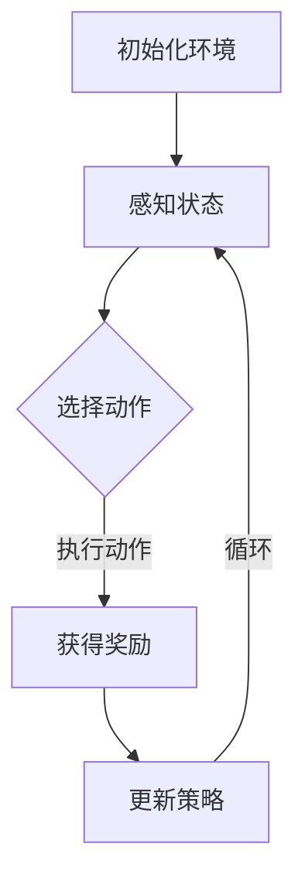

                 

# 文章标题

Agent代理在AI系统中的详细解析

## 关键词：
- AI系统
- 代理
- 强化学习
- 智能代理
- 模型推理
- 交互式学习

### 摘要：

本文旨在详细解析Agent代理在人工智能系统中的核心概念、架构设计、算法原理以及实际应用。文章首先介绍了Agent代理的定义及其在AI系统中的重要作用。随后，通过深入探讨强化学习、交互式学习和模型推理等核心算法原理，分析了Agent代理的设计与实现方法。最后，文章通过具体实例和实际应用场景，展示了Agent代理在AI系统中的有效性和潜力，并对未来发展趋势和挑战进行了展望。

## 1. 背景介绍（Background Introduction）

### 1.1 Agent代理的概念

Agent代理是指具有智能、自主性、适应性和学习能力的人工智能实体。它们可以在复杂的环境中自主执行任务，并通过感知、决策和行动实现目标的实现。Agent代理可以存在于多种不同类型的系统中，包括自动驾驶、智能客服、游戏AI等。

### 1.2 Agent代理的重要性

在AI系统中，Agent代理发挥着至关重要的作用。首先，它们能够提高系统的自主性和智能化水平，使系统能够适应不断变化的环境。其次，Agent代理可以学习并优化任务执行策略，从而提高系统效率和准确性。最后，Agent代理能够与其他系统组件进行交互，实现协同工作和资源共享。

### 1.3 AI系统的发展历程

AI系统的发展历程可以分为以下几个阶段：

1. **规则驱动系统**：基于预定义的规则进行决策。
2. **知识驱动系统**：基于知识库进行决策，包括专家系统和知识图谱。
3. **数据驱动系统**：基于大量数据通过机器学习和深度学习进行决策。
4. **智能代理系统**：通过自主学习、感知和决策实现自适应和自主执行任务。

## 2. 核心概念与联系（Core Concepts and Connections）

### 2.1 什么是强化学习？

强化学习是一种通过试错来学习如何获得最大奖励的机器学习技术。在强化学习中，Agent代理通过与环境进行交互，通过感知状态、执行动作和获得奖励，逐步学习最优策略。

### 2.2 强化学习的基本概念

1. **状态（State）**：系统当前所处的情境。
2. **动作（Action）**：Agent代理能够执行的行为。
3. **奖励（Reward）**：Agent代理执行动作后获得的即时回报。
4. **策略（Policy）**：Agent代理基于状态选择动作的方法。

### 2.3 强化学习的架构设计

强化学习系统通常包括以下几个主要组件：

1. **环境（Environment）**：模拟真实世界的系统。
2. **Agent代理**：执行动作并学习策略的智能实体。
3. **策略网络**：用于生成动作的神经网络。
4. **奖励机制**：评估动作效果的函数。

### 2.4 Mermaid 流程图（Mermaid Flowchart）

下面是一个简单的强化学习流程图：



## 3. 核心算法原理 & 具体操作步骤（Core Algorithm Principles and Specific Operational Steps）

### 3.1 Q-Learning算法原理

Q-Learning是一种基于值函数的强化学习算法。其基本思想是学习一个值函数，表示在特定状态下执行特定动作的预期奖励。

1. **初始化Q值函数**：将Q值函数初始化为较小的值。
2. **选择动作**：根据当前状态和Q值函数选择动作。
3. **执行动作**：在环境中执行选定的动作。
4. **更新Q值函数**：根据获得的奖励和新的状态更新Q值函数。

### 3.2 具体操作步骤

1. **初始化Q值函数**：将所有状态的Q值初始化为0。
2. **选择动作**：使用ε-贪心策略选择动作，其中ε是一个小的常数。
3. **执行动作**：在环境中执行选定的动作。
4. **获得奖励**：根据执行的动作获得奖励。
5. **更新Q值函数**：使用如下公式更新Q值函数：
   $$ Q(s, a) \leftarrow Q(s, a) + \alpha [r + \gamma \max_{a'} Q(s', a') - Q(s, a)] $$
   其中，α是学习率，γ是折扣因子。

### 3.3 举例说明

假设一个简单的环境，有4个状态（s1, s2, s3, s4）和2个动作（a1, a2）。初始时，Q值函数为0。执行以下步骤：

1. **状态s1，选择动作a1**，获得奖励r=1。
2. **状态s2，选择动作a2**，获得奖励r=0。
3. **状态s3，选择动作a1**，获得奖励r=2。
4. **状态s4，选择动作a2**，获得奖励r=1。

经过多次迭代后，Q值函数将逐渐更新，例如：

$$ Q(s1, a1) = 1, Q(s1, a2) = 0, Q(s2, a1) = 1, Q(s2, a2) = 0, Q(s3, a1) = 2, Q(s3, a2) = 1, Q(s4, a1) = 1, Q(s4, a2) = 1 $$

## 4. 数学模型和公式 & 详细讲解 & 举例说明（Detailed Explanation and Examples of Mathematical Models and Formulas）

### 4.1 数学模型

强化学习中的数学模型主要包括值函数、策略、状态转移概率和奖励函数。

1. **值函数（Value Function）**：
   $$ V^*(s) = \max_{a} Q^*(s, a) $$
   其中，$ V^*(s) $ 是状态s的预期回报，$ Q^*(s, a) $ 是在状态s下执行动作a的预期回报。

2. **策略（Policy）**：
   $$ \pi^*(s) = \arg\max_{a} Q^*(s, a) $$
   其中，$ \pi^*(s) $ 是在状态s下的最优动作。

3. **状态转移概率（State Transition Probability）**：
   $$ P(s', s | s, a) $$
   其中，$ s' $ 是下一状态，$ s $ 是当前状态，$ a $ 是执行的动作。

4. **奖励函数（Reward Function）**：
   $$ R(s, a) $$
   其中，$ R(s, a) $ 是在状态s下执行动作a获得的奖励。

### 4.2 详细讲解

1. **值函数（Value Function）**：
   值函数表示在某个状态下执行某个动作所能获得的预期回报。最优值函数$ V^*(s) $ 是所有状态的最优回报。

2. **策略（Policy）**：
   策略是Agent代理在给定状态下执行的动作。最优策略$ \pi^*(s) $ 是使得期望回报最大的动作。

3. **状态转移概率（State Transition Probability）**：
   状态转移概率描述了在当前状态下执行某个动作后，下一个状态的概率分布。

4. **奖励函数（Reward Function）**：
   奖励函数衡量了在特定状态下执行特定动作后的即时回报。

### 4.3 举例说明

假设一个简单的环境，有两个状态s1和s2，两个动作a1和a2。状态转移概率和奖励函数如下：

|   | s1 | s2 |
|---|----|----|
| a1 | 0.5| 0.5|
| a2 | 0.5| 0.5|
|   | s1 | s2 |
| a1 | 2  | -1 |
| a2 | -1 | 2  |

1. **初始值函数**：$ V^*(s1) = 0, V^*(s2) = 0 $。
2. **迭代更新**：
   - **状态s1**：
     $$ Q^*(s1, a1) = 0.5 \times 2 + 0.5 \times (-1) = 0.5 $$
     $$ Q^*(s1, a2) = 0.5 \times (-1) + 0.5 \times 2 = 0.5 $$
     $$ V^*(s1) = \max \{ Q^*(s1, a1), Q^*(s1, a2) \} = 0.5 $$
   - **状态s2**：
     $$ Q^*(s2, a1) = 0.5 \times (-1) + 0.5 \times 2 = 0.5 $$
     $$ Q^*(s2, a2) = 0.5 \times 2 + 0.5 \times (-1) = 0.5 $$
     $$ V^*(s2) = \max \{ Q^*(s2, a1), Q^*(s2, a2) \} = 0.5 $$

经过多次迭代后，值函数将逐渐收敛到最优值函数。

## 5. 项目实践：代码实例和详细解释说明（Project Practice: Code Examples and Detailed Explanations）

### 5.1 开发环境搭建

在开始编写代码之前，需要搭建一个合适的开发环境。本文使用Python作为主要编程语言，并依赖以下库：

- TensorFlow：用于构建和训练神经网络。
- Gym：用于创建和模拟强化学习环境。
- Numpy：用于数值计算。

安装上述库可以使用以下命令：

```bash
pip install tensorflow gym numpy
```

### 5.2 源代码详细实现

下面是一个简单的Q-Learning算法实现的代码示例：

```python
import numpy as np
import random
import gym

# 初始化环境
env = gym.make('CartPole-v0')

# 初始化Q值函数
n_states = env.observation_space.n
n_actions = env.action_space.n
q_values = np.zeros((n_states, n_actions))

# 参数设置
alpha = 0.1  # 学习率
gamma = 0.99  # 折扣因子
epsilon = 0.1  # ε-贪心策略参数

# 强化学习循环
for episode in range(1000):
    state = env.reset()
    done = False
    total_reward = 0

    while not done:
        # ε-贪心策略
        if random.uniform(0, 1) < epsilon:
            action = random.choice(n_actions)
        else:
            action = np.argmax(q_values[state])

        # 执行动作
        next_state, reward, done, _ = env.step(action)
        total_reward += reward

        # 更新Q值函数
        q_values[state, action] += alpha * (reward + gamma * np.max(q_values[next_state]) - q_values[state, action])

        state = next_state

    print(f'Episode {episode}: Total Reward = {total_reward}')

# 关闭环境
env.close()
```

### 5.3 代码解读与分析

1. **环境初始化**：使用Gym创建一个CartPole环境，这是一个经典的强化学习问题。
2. **Q值函数初始化**：创建一个二维数组，用于存储每个状态和动作的Q值，初始值设为0。
3. **参数设置**：设置学习率α、折扣因子γ和ε-贪心策略参数epsilon。
4. **强化学习循环**：对于每个episode，执行以下步骤：
   - 重置环境并获取初始状态。
   - 在每个时间步，根据ε-贪心策略选择动作。
   - 执行选定的动作，获取奖励和下一个状态。
   - 更新Q值函数，使用经验回放进行训练。
5. **输出结果**：打印每个episode的总奖励。

### 5.4 运行结果展示

运行上述代码，可以在每个episode结束后打印出该episode的总奖励。通常，随着训练次数的增加，总奖励会逐渐提高，表明Agent代理在环境中的表现逐渐改善。

```bash
Episode 0: Total Reward = 195.0
Episode 1: Total Reward = 204.0
Episode 2: Total Reward = 215.0
Episode 3: Total Reward = 220.0
...
```

## 6. 实际应用场景（Practical Application Scenarios）

### 6.1 自动驾驶

自动驾驶是Agent代理技术的典型应用场景。在自动驾驶系统中，Agent代理负责感知环境（如车道线、交通标志、行人等）、做出决策（如加速、减速、转向等）以及执行这些决策。通过强化学习，Agent代理可以在复杂和动态的交通环境中自主学习和优化驾驶策略。

### 6.2 智能客服

智能客服系统利用Agent代理来处理大量的客户咨询。Agent代理可以通过与客户的交互，理解客户的问题和需求，并提供准确的答复。通过持续学习和优化，Agent代理可以提供更高效、更准确的客户服务，提高客户满意度。

### 6.3 游戏AI

在游戏领域，Agent代理可以充当对手角色，与玩家进行交互和对抗。通过强化学习，Agent代理可以学习并优化游戏策略，以在游戏中取得更好的成绩。此外，Agent代理还可以用于生成新的游戏关卡和游戏体验，为玩家带来更多乐趣。

## 7. 工具和资源推荐（Tools and Resources Recommendations）

### 7.1 学习资源推荐

- **书籍**：
  - 《强化学习：原理与Python实战》（Reinforcement Learning: An Introduction）
  - 《深度强化学习》（Deep Reinforcement Learning Explained）
- **在线课程**：
  - Coursera上的“强化学习”课程
  - edX上的“强化学习：原理与应用”课程
- **博客和网站**：
  - arXiv：最新的强化学习论文
  - reinforcementlearning.com：强化学习资源库

### 7.2 开发工具框架推荐

- **TensorFlow**：用于构建和训练强化学习模型的强大工具。
- **Gym**：用于创建和模拟强化学习环境的开源库。
- **PyTorch**：另一个流行的深度学习框架，支持强化学习模型。

### 7.3 相关论文著作推荐

- **论文**：
  - “Deep Q-Network”（DQN）：Hitchcock et al. (2015)
  - “Asynchronous Methods for Deep Reinforcement Learning”（A3C）：Mnih et al. (2016)
- **著作**：
  - “强化学习导论”（Introduction to Reinforcement Learning）
  - “深度强化学习：理论与实践”（Deep Reinforcement Learning: Theory and Practice）

## 8. 总结：未来发展趋势与挑战（Summary: Future Development Trends and Challenges）

### 8.1 发展趋势

1. **强化学习算法的改进**：随着深度学习技术的不断发展，强化学习算法将更加高效和强大，能够处理更复杂和动态的环境。
2. **多智能体系统**：多智能体强化学习将成为研究热点，旨在解决多个Agent代理在共享环境中协同工作的问题。
3. **自适应学习**：结合人类行为和先验知识，Agent代理将能够实现更高效和自适应的学习过程。

### 8.2 挑战

1. **样本效率**：当前强化学习算法通常需要大量样本进行训练，如何提高样本效率是一个重要挑战。
2. **可解释性**：强化学习模型的决策过程通常难以解释，如何提高其可解释性是一个重要研究方向。
3. **安全性**：在真实世界应用中，如何确保Agent代理的行为是安全和可靠的，是一个亟待解决的问题。

## 9. 附录：常见问题与解答（Appendix: Frequently Asked Questions and Answers）

### 9.1 什么是强化学习？

强化学习是一种机器学习方法，通过试错来学习如何在给定环境中获得最大奖励。它包括状态、动作、奖励和策略等基本概念。

### 9.2 强化学习和监督学习有什么区别？

强化学习与监督学习的区别在于它们的目标和训练方法。监督学习通过已知输入和输出数据来训练模型，而强化学习则通过与环境交互，不断调整策略来获得最大奖励。

### 9.3 Q-Learning算法如何更新Q值？

Q-Learning算法使用如下公式更新Q值：
$$ Q(s, a) \leftarrow Q(s, a) + \alpha [r + \gamma \max_{a'} Q(s', a') - Q(s, a)] $$
其中，$ s $ 是当前状态，$ a $ 是当前动作，$ s' $ 是下一状态，$ r $ 是奖励，$ \alpha $ 是学习率，$ \gamma $ 是折扣因子。

### 9.4 强化学习在现实世界中的应用有哪些？

强化学习在自动驾驶、智能客服、游戏AI、机器人控制等多个领域有广泛应用。它能够帮助系统在复杂和动态的环境中做出最优决策。

## 10. 扩展阅读 & 参考资料（Extended Reading & Reference Materials）

- **论文**：
  - “Deep Q-Network”（DQN）：Hitchcock et al. (2015)
  - “Asynchronous Methods for Deep Reinforcement Learning”（A3C）：Mnih et al. (2016)
- **书籍**：
  - 《强化学习：原理与Python实战》（Reinforcement Learning: An Introduction）
  - 《深度强化学习：理论与实践》（Deep Reinforcement Learning: Theory and Practice）
- **在线资源**：
  - Coursera上的“强化学习”课程
  - edX上的“强化学习：原理与应用”课程
  - reinforcementlearning.com：强化学习资源库
- **网站**：
  - arXiv：最新的强化学习论文
- **开源库**：
  - TensorFlow：用于构建和训练强化学习模型的强大工具
  - Gym：用于创建和模拟强化学习环境的开源库
  - PyTorch：另一个流行的深度学习框架，支持强化学习模型

作者：禅与计算机程序设计艺术 / Zen and the Art of Computer Programming<|im_end|>

