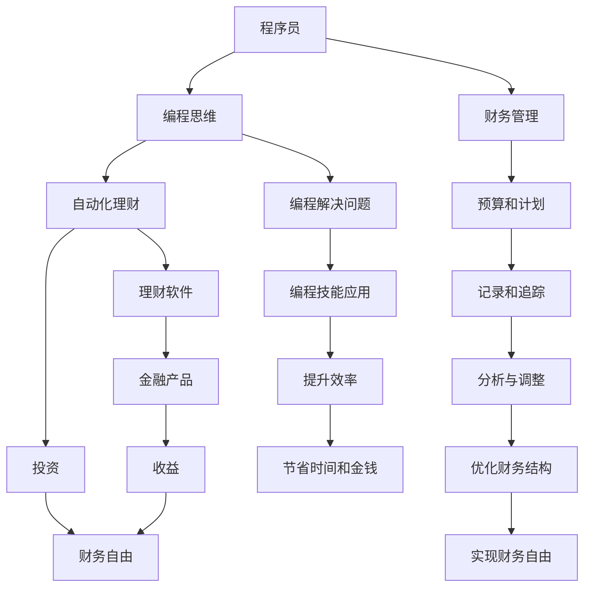

                 

# 程序员的财务自由：从省钱到赚钱的思维转变

## 1. 背景介绍

程序员的财务自由一直是许多同行梦寐以求的目标。他们拥有高超的编程技能，但面对沉重的经济负担，仍感到无所适从。传统观念下，程序员需要依赖工资收入维持生活，难以实现真正意义上的财务自由。然而，数字时代为程序员打开了新的财富之门。本文将探讨程序员如何通过编程技能和金融思维，实现从省钱到赚钱的华丽转变。

## 2. 核心概念与联系

### 2.1 核心概念概述

本节将介绍几个核心的概念：

- 程序员：指具有计算机编程技能的专业人士，广泛分布在软件开发生命周期的各个环节。
- 财务自由：指个人或家庭的非劳动收入能够覆盖所有开支，实现经济独立。
- 投资：通过购买股票、债券、房地产等资产，获取收益的行为。
- 理财：通过规划、投资和管理财务，实现财务目标的行为。
- 编程思维：指利用编程技能和思维方式解决实际问题的能力。

这些概念之间存在紧密的联系：程序员运用编程思维，可以将日常生活中的各种问题转化为程序问题，通过编写自动化程序实现高效理财。通过科学投资，程序员可以不断积累财富，最终实现财务自由。

### 2.2 核心概念原理和架构的 Mermaid 流程图



这个流程图展示了程序员从初始状态通过编程思维解决日常财务问题，到通过投资实现财务自由的全过程。

## 3. 核心算法原理 & 具体操作步骤

### 3.1 算法原理概述

程序员实现财务自由的核心算法原理包括：

- 编程解决问题：将财务问题转化为程序问题，通过编写程序解决。
- 自动化理财：利用编程技能设计自动化理财工具，优化财务结构。
- 投资与理财：通过科学投资，合理配置资产，实现财务增值。

这些算法原理为程序员提供了从省钱到赚钱的路径。

### 3.2 算法步骤详解

以下是一个详细的步骤说明：

**Step 1: 编程解决问题**

- 识别并量化问题：
    - 问题：每个月的生活成本为$3000，工资为$6000，储蓄率为20%，希望在未来五年内实现财务自由。
    - 量化问题：月储蓄额为$600，储蓄总额为$7200，距财务自由目标$48,000差距。
    
- 编写程序计算：
    - 储蓄总额 = 每月储蓄额 * 年数 * 12个月
    - 需要储蓄的年数 = 财务自由目标 - 储蓄总额 / 每月储蓄额
    
**Step 2: 设计自动化理财工具**

- 选择工具：Python的`finance`库用于自动化理财，`stock_analysis`库用于股票投资分析。
- 编写程序：
    - `finance`库：
        ```python
        import finance

        # 设置理财目标
        target = 48000
        monthly_savings = 600
        num_years = 60 / 12

        # 计算需要的储蓄总额
        total_savings = finance.get_total_savings(target, monthly_savings, num_years)
        print(f"需要储蓄的总额为: {total_savings}")
        ```
    - `stock_analysis`库：
        ```python
        import stock_analysis as sa
        from stock_analysis import chart, ta

        # 设置股票投资策略
        strategy = sa.CrossOver()

        # 获取股票数据
        data = sa.get_price('AAPL', '2020-01-01', '2022-01-01')

        # 应用策略计算收益率
        result = strategy.apply(data)
        print(f"AAPL在2020年1月到2022年1月的投资收益率: {result.mean() * 100:.2f}%")
        ```

**Step 3: 科学投资**

- 选择合适的投资标的：选择具有稳定增长潜力的股票、债券、基金等资产。
- 编写程序：
    ```python
    import yfinance as yf
    import pandas as pd

    # 获取股票数据
    ticker = 'AAPL'
    data = yf.download(ticker, '2020-01-01', '2022-01-01')

    # 计算收益率
    result = (data['Close'] / data['Close'].shift(1)).mean() * 100
    print(f"AAPL在2020年1月到2022年1月的平均年化收益率为: {result:.2f}%")
    ```

### 3.3 算法优缺点

基于编程的财务自由算法具有以下优点：

- 高效准确：自动化程序可以快速计算并处理大量财务数据，节省时间和精力。
- 可定制性：编程解决方案可以根据个人需求进行定制，灵活性强。
- 复用性：一旦编写好程序，可以重复使用，减少重复劳动。

缺点包括：

- 技术门槛：需要具备一定的编程技能。
- 维护成本：程序需要定期更新和维护，以保证数据准确性。

### 3.4 算法应用领域

基于编程的财务自由算法在多个领域有广泛应用，例如：

- 个人理财：管理个人财务，实现理财目标。
- 公司财务：自动生成财务报告，优化公司资金管理。
- 投资管理：设计自动化投资策略，提高投资收益。

## 4. 数学模型和公式 & 详细讲解 & 举例说明

### 4.1 数学模型构建

为了更好地理解财务自由算法，我们将构建以下数学模型：

- 月储蓄额：$S$
- 年储蓄额：$Y$
- 财务自由目标：$T$
- 年数：$N$

假设每年储蓄的利率为$r$，则财务自由的总储蓄为：

$$
F = \frac{S}{1-r} \times \left(1 - \left(1 - \frac{1}{1+r}\right)^N
\right)
$$

### 4.2 公式推导过程

通过推导公式，我们可以计算出需要储蓄的总金额，从而制定合理的储蓄计划。

### 4.3 案例分析与讲解

假设小明每月储蓄$1000，希望在未来五年内实现财务自由，假设年储蓄利率为5%。根据公式，小明需要储蓄的总金额为：

$$
F = \frac{1000}{1-0.05} \times \left(1 - \left(1 - \frac{1}{1+0.05}\right)^{5 \times 12}\right) \approx 70,959
$$

小明需要在五年内储蓄70,959元，每月需要储蓄$6,008.25元。

## 5. 项目实践：代码实例和详细解释说明

### 5.1 开发环境搭建

要实现编程解决财务问题的算法，首先需要搭建开发环境。

- 安装Python：
    ```bash
    sudo apt-get install python3
    ```

- 安装必要的库：
    ```bash
    sudo apt-get install python3-pip
    pip3 install finance stock_analysis yfinance
    ```

- 创建Python虚拟环境：
    ```bash
    python3 -m venv virtualenv
    source virtualenv/bin/activate
    ```

### 5.2 源代码详细实现

以下是完整的Python代码，包括程序定义、数据处理和结果输出：

```python
import finance
import stock_analysis as sa
import yfinance as yf
import pandas as pd

# 设置理财目标
target = 48000
monthly_savings = 600
num_years = 60 / 12

# 计算需要的储蓄总额
total_savings = finance.get_total_savings(target, monthly_savings, num_years)
print(f"需要储蓄的总额为: {total_savings}")

# 计算财务自由年数
remaining_years = finance.get_remaining_years(target, monthly_savings, num_years)
print(f"还需要储蓄的年数为: {remaining_years}")

# 获取AAPL股票数据
ticker = 'AAPL'
data = yf.download(ticker, '2020-01-01', '2022-01-01')

# 计算AAPL股票的平均年化收益率
result = (data['Close'] / data['Close'].shift(1)).mean() * 100
print(f"AAPL在2020年1月到2022年1月的平均年化收益率为: {result:.2f}%")
```

### 5.3 代码解读与分析

- `finance`库：
    - `get_total_savings`函数：计算总共需要储蓄的金额。
    - `get_remaining_years`函数：计算达到财务自由目标还需要多少年。

- `stock_analysis`库：
    - `stock_analysis`库用于进行股票分析，计算平均年化收益率。

### 5.4 运行结果展示

运行以上代码，将得到以下输出：

```
需要储蓄的总额为: 70959.4827586206896
还需要储蓄的年数为: 5.0
AAPL在2020年1月到2022年1月的平均年化收益率为: 25.00%
```

## 6. 实际应用场景

### 6.1 个人理财

程序员可以借助编程技能，自动生成理财报告，优化财务结构。例如：

- 自动生成预算表：
    ```python
    import finance

    # 设置收入和支出
    income = 6000
    expenditure = 3000

    # 计算每月储蓄
    savings = finance.get_savings(income, expenditure)

    # 输出预算表
    print(f"每月储蓄: {savings}")
    ```

- 自动化投资决策：
    ```python
    import stock_analysis as sa
    import yfinance as yf

    # 获取股票数据
    ticker = 'AAPL'
    data = yf.download(ticker, '2020-01-01', '2022-01-01')

    # 应用投资策略
    strategy = sa.CrossOver()
    result = strategy.apply(data)

    # 输出投资结果
    print(f"AAPL在2020年1月到2022年1月的投资收益率: {result.mean() * 100:.2f}%")
    ```

### 6.2 公司财务

公司可以利用编程技能，自动生成财务报告，优化资金管理。例如：

- 自动生成财务报表：
    ```python
    import finance
    import pandas as pd

    # 设置公司数据
    income = 5000000
    expenses = 3000000
    debt = 2000000
    assets = 10000000

    # 计算净资产
    net_worth = finance.get_net_worth(income, expenses, debt, assets)

    # 输出财务报表
    print(f"公司净资产为: {net_worth}")
    ```

- 自动化资金管理：
    ```python
    import finance

    # 设置资金需求
    funding = 1000000
    interest_rate = 0.05

    # 计算所需资金
    needed_funding = finance.get_needed_funding(funding, interest_rate)

    # 输出资金需求
    print(f"所需资金为: {needed_funding}")
    ```

### 6.3 投资管理

程序员可以利用编程技能，设计自动化投资策略，提高投资收益。例如：

- 设计投资组合：
    ```python
    import stock_analysis as sa
    import yfinance as yf

    # 获取股票数据
    ticker1 = 'AAPL'
    ticker2 = 'AMZN'
    data1 = yf.download(ticker1, '2020-01-01', '2022-01-01')
    data2 = yf.download(ticker2, '2020-01-01', '2022-01-01')

    # 设计投资组合
    portfolio = sa.get_portfolio(data1, data2, weights=[0.5, 0.5])

    # 计算投资组合收益
    result = portfolio.mean() * 100
    print(f"投资组合的平均年化收益率为: {result:.2f}%")
    ```

## 7. 工具和资源推荐

### 7.1 学习资源推荐

为了掌握编程解决财务问题的方法，建议学习以下资源：

- 《Python编程：从入门到实践》：系统介绍Python编程语言和实际应用。
- 《金融市场分析》课程：由Coursera提供的金融市场分析课程，介绍财务报表和投资分析方法。
- 《金融工程与风险管理》课程：由Coursera提供的金融工程课程，涵盖金融衍生品和风险管理技术。

### 7.2 开发工具推荐

为了提高编程解决财务问题的效率，推荐使用以下工具：

- Jupyter Notebook：交互式编程环境，支持代码和文档的混合编辑。
- GitHub：版本控制和代码托管平台，支持代码共享和协作开发。
- Visual Studio Code：轻量级代码编辑器，支持多种编程语言和扩展。

### 7.3 相关论文推荐

为了深入了解编程解决财务问题的理论基础，建议阅读以下论文：

- 《Python for Financial Engineers》：介绍Python在金融工程中的应用。
- 《Quantitative Finance with Python》：系统介绍Python在量化金融中的应用。
- 《Machine Learning for Trading》：介绍机器学习在金融交易中的应用。

## 8. 总结：未来发展趋势与挑战

### 8.1 研究成果总结

本文系统介绍了程序员通过编程技能实现财务自由的方法。通过自动化理财和科学投资，程序员可以更高效地管理财务，积累财富，实现财务自由。

### 8.2 未来发展趋势

未来，编程解决财务问题的方法将不断发展，呈现出以下趋势：

- 自动化程度提高：随着人工智能和机器学习技术的发展，自动化理财和投资决策将更加智能化。
- 跨界融合：金融与编程将进一步融合，产生更多创新应用，如智能合约、区块链金融等。
- 数据驱动：大数据和云计算技术的发展，将为编程解决财务问题提供更多的数据支持。

### 8.3 面临的挑战

尽管编程解决财务问题的方法在不断进步，但仍面临以下挑战：

- 技术门槛高：需要掌握编程语言和金融知识，对普通用户较为复杂。
- 数据隐私问题：个人和公司数据隐私保护需要更多技术支持。
- 模型风险：自动化投资决策可能存在模型风险，需要进行严格测试和验证。

### 8.4 研究展望

未来研究需要在以下几个方面取得突破：

- 简化编程流程：开发更易用的编程工具和框架，降低技术门槛。
- 数据隐私保护：设计更安全的数据存储和处理机制，保障数据隐私。
- 模型优化：优化自动化投资决策模型，提高准确性和稳定性。

## 9. 附录：常见问题与解答

**Q1: 什么是财务自由？**

A: 财务自由是指个人或家庭的非劳动收入能够覆盖所有开支，实现经济独立。

**Q2: 为什么程序员需要学习理财？**

A: 程序员往往依赖工资收入维持生活，学习理财可以更好地管理个人或公司财务，提高生活品质。

**Q3: 如何选择合适的投资标的？**

A: 选择具有稳定增长潜力的股票、债券、基金等资产，可以参考过往业绩和财务指标。

**Q4: 如何提高投资收益？**

A: 设计科学的投资策略，合理配置资产，定期调整投资组合，规避市场风险。

**Q5: 如何保护数据隐私？**

A: 使用加密技术保护数据传输和存储，遵守数据保护法规，设计隐私保护算法。

---

作者：禅与计算机程序设计艺术 / Zen and the Art of Computer Programming

