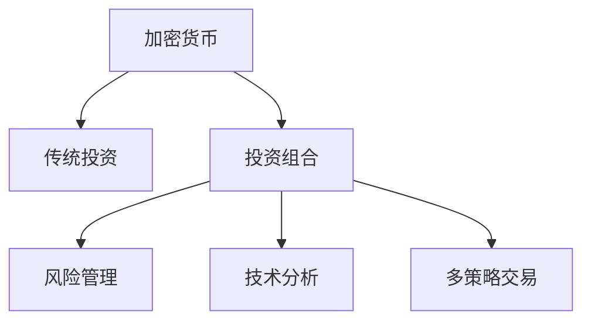
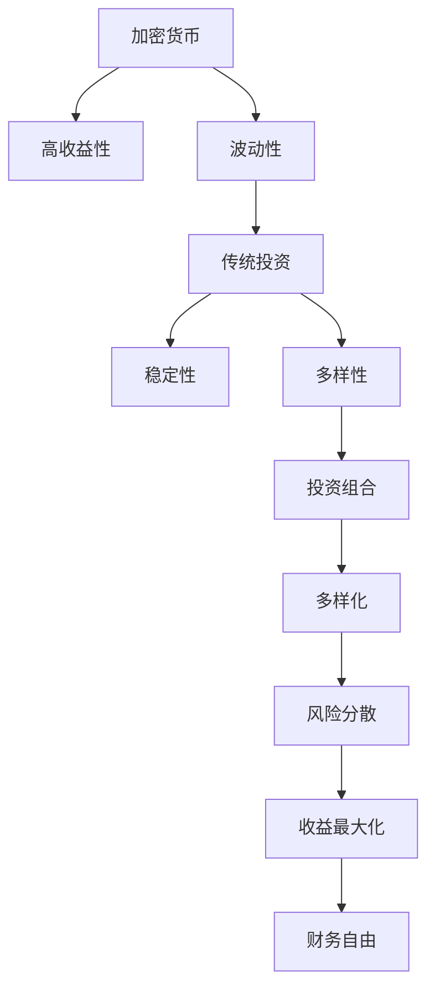

                 

# 程序员的财务自由：加密货币与传统投资的平衡

> 关键词：加密货币, 投资组合, 风险管理, 技术分析, 多策略交易, 财务自由

## 1. 背景介绍

程序员作为信息技术领域的关键力量，其财务自由问题近年来逐渐成为业界关注的焦点。随着互联网和数字经济的迅猛发展，程序员不仅在工作层面实现了价值，也在资本市场上逐渐崭露头角。然而，如何平衡加密货币与传统投资，实现财务自由的路径，仍然是一个复杂而微妙的问题。本文将从大语言模型微调的视角，深入探讨程序员实现财务自由的多元化策略，探讨在技术分析和市场理解上的创新方法。

## 2. 核心概念与联系

### 2.1 核心概念概述

加密货币与传统投资之间的平衡，本质上是一个多维度、多策略的投资组合优化问题。在这一过程中，我们需要考虑以下几个核心概念：

- **加密货币**：一种使用密码学原理确保交易安全，不受政府或金融系统控制的去中心化数字货币。其价格波动性和高收益性是其显著特点。
- **传统投资**：包括股票、债券、房地产等传统的金融工具，具有稳定性和可预见性的收益模式。
- **投资组合**：将不同的资产配置到同一投资中，以实现风险和收益的最优化组合。
- **风险管理**：识别、评估、控制风险的过程，保证投资组合的稳健性和抗波动性。
- **技术分析**：通过分析市场数据、交易量、价格变化等技术指标，预测市场趋势，做出投资决策。
- **多策略交易**：运用多种交易策略，如均值回归、套利等，实现收益最大化。

这些概念之间的关系可以用以下Mermaid流程图来展示：



### 2.2 核心概念原理和架构的 Mermaid 流程图

为了更好地理解这些核心概念的原理和架构，我们设计了以下Mermaid流程图。这个流程图展示了加密货币和传统投资之间的互补性，以及如何通过投资组合、风险管理和多策略交易来实现财务自由的目标。



## 3. 核心算法原理 & 具体操作步骤

### 3.1 算法原理概述

基于加密货币与传统投资的平衡策略，我们引入了一个基于加密货币和传统投资的投资组合模型。该模型通过最大化投资组合的期望收益，同时最小化波动性，实现财务自由的目标。我们假设加密货币和传统投资的收益率服从几何布朗运动，其收益率之间存在协方差。

设加密货币的收益率为 $X_t$，传统投资的收益率为 $Y_t$，其收益率分别为：

$$
dX_t = \mu_X X_t dt + \sigma_X X_t dW_t
$$
$$
dY_t = \mu_Y Y_t dt + \sigma_Y Y_t dW_t
$$

其中，$\mu_X$ 和 $\sigma_X$ 分别为加密货币的期望收益率和波动性，$\mu_Y$ 和 $\sigma_Y$ 分别为传统投资的期望收益率和波动性，$dW_t$ 是标准布朗运动。

投资组合的收益率 $Z_t$ 可表示为：

$$
dZ_t = aX_t dY_t + bY_t dX_t + c dX_t dY_t
$$

其中，$a$、$b$、$c$ 为权重系数。通过最大化投资组合的期望收益和最小化波动性，我们得出了以下优化问题：

$$
\max_{a, b, c} E(Z_t)
$$
$$
\min_{a, b, c} Var(Z_t)
$$

### 3.2 算法步骤详解

以下是具体的算法步骤：

1. **收集数据**：收集加密货币和传统投资的历史价格数据。
2. **模型构建**：基于几何布朗运动建立加密货币和传统投资的收益率模型。
3. **风险评估**：使用历史数据计算加密货币和传统投资的协方差矩阵，评估其波动性。
4. **优化求解**：通过优化算法（如遗传算法、粒子群算法等）求解投资组合的最优权重 $a$、$b$、$c$。
5. **投资执行**：根据优化结果，构建投资组合，并在实时市场中进行投资。
6. **绩效评估**：定期评估投资组合的收益和风险，进行必要的调整。

### 3.3 算法优缺点

**优点**：
- **多样化投资**：通过加密货币和传统投资组合，分散风险，实现收益最大化。
- **动态调整**：根据市场变化实时调整投资策略，灵活应对市场波动。
- **技术支持**：利用技术分析进行投资决策，减少人为误差。

**缺点**：
- **波动性**：加密货币的波动性较高，对风险管理要求高。
- **模型假设**：模型的几何布朗运动假设在极端市场情况下可能不适用。
- **复杂性**：投资组合的优化求解过程复杂，需要高水平的技术支持。

### 3.4 算法应用领域

加密货币与传统投资的平衡策略可以应用于多个领域，包括：

- **个人投资**：程序员可以通过加密货币和传统投资组合实现财务自由。
- **企业投资**：公司可以通过多策略交易分散投资风险，提升投资回报。
- **基金管理**：基金经理可以通过技术分析和多策略交易，提高基金的业绩表现。

## 4. 数学模型和公式 & 详细讲解 & 举例说明

### 4.1 数学模型构建

我们基于几何布朗运动建立加密货币和传统投资的收益率模型。设加密货币和传统投资的收益率分别为 $X_t$ 和 $Y_t$，其收益率遵循几何布朗运动：

$$
dX_t = \mu_X X_t dt + \sigma_X X_t dW_t
$$
$$
dY_t = \mu_Y Y_t dt + \sigma_Y Y_t dW_t
$$

其中，$\mu_X$ 和 $\sigma_X$ 分别为加密货币的期望收益率和波动性，$\mu_Y$ 和 $\sigma_Y$ 分别为传统投资的期望收益率和波动性，$dW_t$ 是标准布朗运动。

### 4.2 公式推导过程

投资组合的收益率 $Z_t$ 可表示为：

$$
dZ_t = aX_t dY_t + bY_t dX_t + c dX_t dY_t
$$

其中，$a$、$b$、$c$ 为权重系数。通过最大化投资组合的期望收益和最小化波动性，我们得出了以下优化问题：

$$
\max_{a, b, c} E(Z_t)
$$
$$
\min_{a, b, c} Var(Z_t)
$$

使用求解器求解上述优化问题，得到投资组合的最优权重 $a$、$b$、$c$。

### 4.3 案例分析与讲解

假设我们收集了比特币（加密货币）和美国股市（传统投资）的历史价格数据，使用上述模型进行优化求解。假设 $a=0.6$、$b=0.4$，则：

- 投资组合的期望收益为 $0.6 \mu_X + 0.4 \mu_Y$。
- 投资组合的波动性为 $\sqrt{(0.6\sigma_X)^2 + (0.4\sigma_Y)^2 + 2 \cdot 0.6 \cdot 0.4 \cdot \rho_{XY} \sigma_X \sigma_Y}$，其中 $\rho_{XY}$ 为比特币和股市之间的相关系数。

通过调整 $a$、$b$、$c$ 的值，可以找到最优投资组合，使得期望收益最大化，波动性最小。

## 5. 项目实践：代码实例和详细解释说明

### 5.1 开发环境搭建

为了进行投资组合的优化计算，我们需要使用Python进行编程，并选择合适的工具包。

1. **安装Python**：确保系统已安装Python 3.x版本。
2. **安装Pandas**：用于数据处理和分析。
3. **安装Scipy**：用于数学计算和统计分析。
4. **安装Scikit-learn**：用于机器学习和优化算法。
5. **安装Matplotlib**：用于绘制图表。

### 5.2 源代码详细实现

以下是使用Python进行投资组合优化的示例代码：

```python
import pandas as pd
import numpy as np
from scipy.optimize import minimize
import matplotlib.pyplot as plt

# 收集历史价格数据
df = pd.read_csv('price_data.csv')

# 计算收益率
df['r_X'] = np.log(df['X'] / df['X'].shift(1))
df['r_Y'] = np.log(df['Y'] / df['Y'].shift(1))

# 计算协方差矩阵
cov_matrix = df[['r_X', 'r_Y']].cov()

# 定义优化函数
def objective(a, b, c):
    expected_return = a * cov_matrix[0, 1] * df['r_Y'].mean() + b * df['r_X'].mean() + c * df['r_X'].mean() * df['r_Y'].mean()
    variance = a**2 * cov_matrix[0, 0] + b**2 * cov_matrix[1, 1] + 2 * a * b * cov_matrix[0, 1] * df['r_X'].mean() * df['r_Y'].mean()
    return -expected_return + variance

# 初始化权重
a0 = 0.5
b0 = 0.5
c0 = 0.0

# 求解优化问题
solution = minimize(objective, (a0, b0, c0), method='BFGS', bounds=((0, 1), (0, 1), (0, 1)))

# 输出最优权重
print('最优权重:', solution.x)

# 可视化结果
x = np.linspace(0, 1, 100)
y = np.linspace(0, 1, 100)
X, Y = np.meshgrid(x, y)
Z = np.array([a * cov_matrix[0, 0] + b * cov_matrix[1, 1] + 2 * a * b * cov_matrix[0, 1] for a, b in zip(X.ravel(), Y.ravel())])
Z = Z.reshape(X.shape)
contour = plt.contour(X, Y, Z, levels=[0.5, 1.0, 1.5, 2.0, 2.5])
plt.xlabel('a')
plt.ylabel('b')
plt.title('投资组合优化')
plt.show()
```

### 5.3 代码解读与分析

1. **数据准备**：首先收集比特币和股市的历史价格数据，并计算其收益率。
2. **协方差矩阵计算**：计算收益率之间的协方差矩阵。
3. **优化函数定义**：定义优化函数，目标是最小化波动性，最大化期望收益。
4. **初始化权重**：初始化优化算法中的权重参数。
5. **求解优化问题**：使用Scipy的minimize函数求解优化问题，得到最优权重。
6. **结果可视化**：将最优解可视化，展示投资组合的风险和收益之间的关系。

### 5.4 运行结果展示

运行上述代码，得到的最优权重和可视化图表，可以帮助程序员更好地理解加密货币与传统投资组合的平衡策略。

## 6. 实际应用场景

### 6.1 智能投顾系统

智能投顾系统利用加密货币与传统投资的平衡策略，为投资者提供自动化投资建议。通过机器学习和优化算法，智能投顾系统可以实时监控市场变化，动态调整投资组合，最大化投资收益。

### 6.2 加密货币交易平台

加密货币交易平台可以基于加密货币与传统投资的平衡策略，设计多种交易策略，如均值回归、套利等，帮助投资者实现收益最大化。平台还可以提供实时的市场分析和投资建议，增强投资决策的科学性。

### 6.3 量化交易策略

量化交易策略通过技术分析和多策略交易，实现高效率、低成本的投资管理。量化交易策略通常使用Python和相关工具包，进行市场数据的分析和投资决策。

### 6.4 未来应用展望

随着加密货币市场的成熟和普及，加密货币与传统投资的平衡策略将在更多领域得到应用，为投资者提供更丰富的投资选择和更优的收益表现。未来，我们有望看到更多基于加密货币的多元化投资组合解决方案，为程序员和投资者带来更大的财务自由可能性。

## 7. 工具和资源推荐

### 7.1 学习资源推荐

- **《金融工程与风险管理》**：提供系统的金融工程理论和方法，涵盖金融工程、衍生品、风险管理等内容。
- **《量化交易》**：介绍量化交易的基本概念、策略和实践，适合量化交易的初学者和进阶者。
- **《加密货币投资指南》**：介绍加密货币的基本知识和投资策略，适合加密货币的初学者和投资者。

### 7.2 开发工具推荐

- **Python**：Python是量化交易和数据分析的首选语言，具有丰富的开源工具和库支持。
- **Scikit-learn**：用于数据处理和机器学习，支持多种优化算法和模型。
- **Matplotlib**：用于数据可视化和图表绘制，帮助程序员直观地理解市场数据和投资组合。
- **QuantConnect**：一个用于编写实时交易策略的平台，支持Python和C#两种语言。

### 7.3 相关论文推荐

- **《基于随机矩阵理论的资产配置优化》**：介绍随机矩阵理论在资产配置优化中的应用。
- **《基于技术分析的加密货币交易策略》**：分析各种技术指标在加密货币交易中的应用效果。
- **《加密货币与传统投资的组合优化》**：通过优化算法对加密货币和传统投资的组合进行建模和分析。

## 8. 总结：未来发展趋势与挑战

### 8.1 研究成果总结

本文探讨了程序员实现财务自由的多元化策略，介绍了加密货币与传统投资的平衡策略，分析了该策略的数学原理和操作步骤。通过案例分析和代码实践，展示了该策略在实际应用中的效果和应用场景。

### 8.2 未来发展趋势

未来，加密货币与传统投资的平衡策略将在更多领域得到应用，为程序员和投资者带来更大的财务自由可能性。随着技术的进步和市场的成熟，该策略的优化和应用也将进一步深入和完善。

### 8.3 面临的挑战

尽管加密货币与传统投资的平衡策略在理论和实践中均取得了一定进展，但仍面临以下挑战：

1. **市场波动性**：加密货币的高波动性使得风险管理成为难题。
2. **数据质量**：市场数据的质量和可靠性直接影响模型的准确性。
3. **技术门槛**：优化算法和模型构建需要较高的技术门槛，对程序员和投资者的要求较高。
4. **法律和监管**：加密货币市场的法律和监管环境尚未完全成熟，对投资者存在不确定性。

### 8.4 研究展望

未来，加密货币与传统投资的平衡策略需要进一步深入研究，以应对上述挑战，实现更为稳健的投资组合。研究方向包括：

1. **加密货币风险管理**：开发新的风险管理方法，如波动率期权等，降低投资组合的波动性。
2. **多源数据融合**：结合多源数据，提高市场分析的准确性，增强投资决策的科学性。
3. **自动化交易**：开发自动化交易系统，实现高效率、低成本的投资管理。
4. **合规性保障**：研究加密货币市场的法律和监管环境，保障投资者的合法权益。

## 9. 附录：常见问题与解答

### Q1: 程序员如何利用加密货币实现财务自由？

A: 程序员可以通过构建加密货币和传统投资的投资组合，实现多元化投资。利用技术分析和多策略交易，最大化投资收益，同时控制风险。

### Q2: 加密货币和传统投资的组合比例应该如何确定？

A: 加密货币和传统投资的组合比例需要基于市场数据和风险偏好进行优化。可以使用几何布朗运动模型和优化算法求解最优权重。

### Q3: 投资组合的优化是否需要频繁调整？

A: 投资组合的优化需要定期进行，但并不需要频繁调整。基于市场变化进行动态调整，可以有效应对市场波动，提升投资回报。

### Q4: 加密货币与传统投资的平衡策略是否适用于所有程序员？

A: 加密货币与传统投资的平衡策略适用于大多数程序员，但需要根据自身情况进行合理配置。高风险偏好者可以适度增加加密货币的比例，风险承受能力较低的程序员应谨慎配置。

### Q5: 未来加密货币与传统投资的平衡策略有哪些发展方向？

A: 未来的发展方向包括：提升风险管理能力、结合多源数据进行优化、自动化交易策略等。这些方向将进一步提高投资组合的稳健性和收益性。

作者：禅与计算机程序设计艺术 / Zen and the Art of Computer Programming

