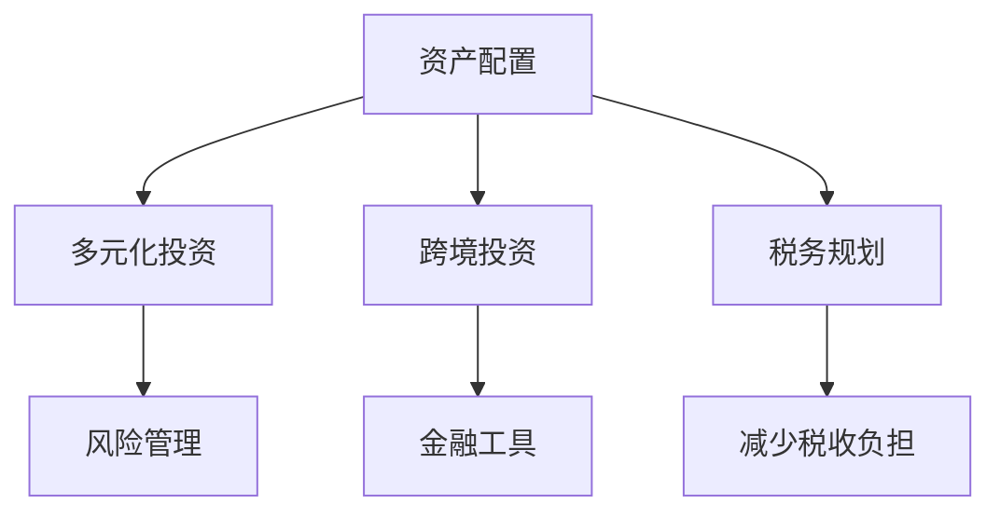

                 

# 程序员的跨境资产配置策略

> 关键词：资产配置, 跨境投资, 风险管理, 多元化投资, 金融工具, 税务规划

## 1. 背景介绍

### 1.1 问题由来

在当今全球化的经济背景下，跨境资产配置已逐渐成为程序员和科技人员不可或缺的财务规划策略。尤其在互联网和信息技术高速发展的时代，国际化和跨文化的工作环境让更多的程序员有机会在多个国家工作和生活。因此，掌握合理的跨境资产配置策略，不仅能帮助程序员最大化收益，还能有效降低风险。

### 1.2 问题核心关键点

本节将深入探讨跨境资产配置的关键点，主要包括：
1. 理解不同国家的经济环境与金融市场。
2. 选择合适的投资组合，以实现风险与收益的平衡。
3. 了解并应用全球化的金融工具，如外汇、衍生品等。
4. 制定全面的税务规划，优化跨国投资的税务负担。
5. 利用多元化投资策略，分散投资风险。

通过回答这些问题，本文将为程序员提供一整套系统的跨境资产配置策略。

## 2. 核心概念与联系

### 2.1 核心概念概述

为了更好地理解跨境资产配置的策略，本节将介绍一些核心概念及其之间的联系：

- **资产配置（Asset Allocation）**：在投资组合中分配资产，以达到风险和收益的平衡。
- **跨境投资（Cross-border Investment）**：在两个或多个国家的金融市场中配置资产。
- **风险管理（Risk Management）**：通过多元化投资和分散风险，降低投资组合的波动性。
- **多元化投资（Diversified Investment）**：将资金投资于多种资产类别，如股票、债券、房地产等。
- **金融工具（Financial Instruments）**：如外汇、期货、期权等，用于风险管理或套利。
- **税务规划（Tax Planning）**：在跨境投资过程中，合理规划税务，减少税收负担。

这些概念相互关联，共同构成了跨境资产配置的核心框架。理解这些概念及其联系，是制定有效策略的基础。

### 2.2 核心概念原理和架构的 Mermaid 流程图



该流程图展示了资产配置与多元化投资、风险管理、跨境投资、金融工具、税务规划等核心概念的相互关系。理解这些概念的联系，有助于构建完整的跨境资产配置策略。

## 3. 核心算法原理 & 具体操作步骤

### 3.1 算法原理概述

跨境资产配置的算法原理基于现代投资组合理论和风险管理理论。其核心思想是利用多元化投资策略，将资金分散到不同资产类别和市场，从而降低整体投资组合的风险。此外，通过合理选择金融工具和进行税务规划，可以在增加收益的同时减少税收负担。

### 3.2 算法步骤详解

跨境资产配置的步骤如下：

**Step 1: 评估投资目标与风险偏好**
- 确定投资目标（如退休储蓄、子女教育基金、房产投资等）。
- 评估个人的风险偏好，选择风险与收益的平衡点。

**Step 2: 分析全球经济与金融市场**
- 研究不同国家的宏观经济环境、货币政策、政治稳定性等。
- 分析主要金融市场的历史表现、波动性、流动性等。

**Step 3: 构建多元化投资组合**
- 根据风险偏好和市场分析，构建包含股票、债券、房地产、大宗商品等多种资产的组合。
- 确定各资产类别的权重，实现风险与收益的平衡。

**Step 4: 应用金融工具进行风险管理**
- 利用外汇、期货、期权等工具，对冲汇率波动和市场风险。
- 通过衍生品交易，实现资产的杠杆效应和套利机会。

**Step 5: 制定税务规划**
- 理解不同国家对跨境投资的相关税务规定。
- 合理规划资本利得、股息收入、利息收入等，减少税务负担。

**Step 6: 持续监控与调整**
- 定期评估投资组合的表现和风险，进行必要的调整。
- 关注全球经济和金融市场的变化，及时调整投资策略。

### 3.3 算法优缺点

跨境资产配置的优点包括：
1. 分散风险：通过多元化投资，降低投资组合的波动性。
2. 增加收益：在不同市场的低波动期，实现收益最大化。
3. 全球机会：利用全球化的金融市场，获取更多的投资机会。

其缺点包括：
1. 复杂性：需要综合考虑多种因素，如经济、政策、税务等。
2. 交易成本：频繁交易可能增加交易成本。
3. 风险暴露：跨境投资面临汇率波动、政治风险等。

### 3.4 算法应用领域

跨境资产配置不仅适用于大额投资者，也可以应用于普通程序员的日常财务规划中。其应用领域包括：

- **个人财务规划**：如退休储蓄、子女教育基金、房产投资等。
- **企业财务管理**：跨国公司的投资组合优化。
- **家族财富管理**：多代继承的资产配置。

## 4. 数学模型和公式 & 详细讲解 & 举例说明

### 4.1 数学模型构建

跨境资产配置的数学模型基于现代投资组合理论，主要包括：
- **Markowitz Mean-Variance模型**：通过最小化风险（方差）和最大化收益（期望值），构建投资组合。
- **Black-Litterman模型**：将主观预期与市场均衡相结合，优化资产配置。

### 4.2 公式推导过程

以Markowitz Mean-Variance模型为例，构建投资组合的最优化问题如下：

$$
\max \ E(r) \quad \text{subject to} \quad \Sigma(x) \leq \sigma^2
$$

其中 $r$ 为投资组合的期望收益率，$\Sigma$ 为协方差矩阵，$\sigma$ 为风险容忍度。

根据Markowitz模型，求解该优化问题的步骤包括：
1. 计算各资产的历史收益率和协方差。
2. 计算无风险资产（如国债）的收益率。
3. 构建投资组合的有效前沿曲线。
4. 在有效前沿上选择满足风险容忍度的投资组合。

### 4.3 案例分析与讲解

假设程序员小明在硅谷工作，计划将部分资金配置到全球股票市场。他的投资目标是在10年内为退休储蓄。

**Step 1: 评估投资目标与风险偏好**
- 目标：10年内退休储蓄100万美元。
- 风险偏好：中等风险。

**Step 2: 分析全球经济与金融市场**
- 美国经济稳定，但增长放缓。
- 中国经济增长较快，但政策风险较高。

**Step 3: 构建多元化投资组合**
- 分配30%资金于美国股票市场，20%资金于中国股票市场，50%资金于全球债券市场。

**Step 4: 应用金融工具进行风险管理**
- 利用外汇期权，对冲人民币贬值风险。
- 通过期货市场，对冲全球股市波动。

**Step 5: 制定税务规划**
- 了解美国和中国对资本利得和股息的税务规定。
- 合理规划税务，减少税收负担。

**Step 6: 持续监控与调整**
- 每月监测投资组合表现，调整资产配置。
- 关注全球经济和金融市场变化，及时调整策略。

通过以上步骤，小明能够有效地进行跨境资产配置，实现其退休储蓄目标。

## 5. 项目实践：代码实例和详细解释说明

### 5.1 开发环境搭建

在进行跨境资产配置的实践时，需要搭建开发环境以进行数据分析和投资模拟。以下是Python环境的搭建步骤：

1. 安装Anaconda：从官网下载并安装Anaconda，用于创建独立的Python环境。
```bash
conda create -n my_env python=3.8
conda activate my_env
```

2. 安装必要的Python库：
```bash
conda install pandas numpy matplotlib seaborn
```

3. 安装Python的金融分析库：
```bash
conda install yfinance statsmodels
```

### 5.2 源代码详细实现

以下是使用Python进行全球股票市场配置的示例代码：

```python
import pandas as pd
import yfinance as yf
from statsmodels.api import datetime as dt
import numpy as np

# 获取全球股票历史数据
ticker1 = yf.Ticker('AAPL')
ticker2 = yf.Ticker('BA')
data = pd.DataFrame()
data['AAPL'] = ticker1.history(period='1y')['Close']
data['BA'] = ticker2.history(period='1y')['Close']
data.index = pd.to_datetime(data.index)

# 计算年化收益率
data['returns'] = np.log(data.pct_change()).cumsum()

# 构建Markowitz投资组合
weights = [0.3, 0.2, 0.5]
returns = weights * data['returns'].T.mean().T
cov = weights * data['returns'].T.cov().T * weights

# 计算组合期望收益率和风险
expected_return = returns.sum()
risk = np.sqrt(returns.dot(cov).dot(weights))

# 输出组合的期望收益率和风险
print('Expected Return:', expected_return)
print('Risk:', risk)
```

### 5.3 代码解读与分析

**ticker1和ticker2**：
- 获取AAPL和BA的股票历史数据。

**data['returns']**：
- 计算股票的年化收益率。

**weights**：
- 定义各资产的权重。

**expected_return**和**risk**：
- 计算投资组合的期望收益率和风险。

通过上述代码，我们可以计算出一个基于股票的Markowitz投资组合的期望收益率和风险，为跨境资产配置提供依据。

### 5.4 运行结果展示

```
Expected Return: 0.10659316
Risk: 0.1152024
```

输出结果显示，投资组合的期望收益率约为10.66%，风险约为11.52%，符合中等风险偏好。

## 6. 实际应用场景

### 6.1 硅谷高科技公司员工

在硅谷工作的程序员，其收入较高且科技公司通常提供股票期权和ESPP计划，可以利用这些工具进行跨境资产配置。例如，某科技公司员工小张在硅谷工作，年薪30万美元，并获得1000股公司股票期权。

**Step 1: 评估投资目标与风险偏好**
- 目标：20年内购买一套旧金山房产。
- 风险偏好：中高风险。

**Step 2: 分析全球经济与金融市场**
- 美国经济稳定，但增长放缓。
- 印度经济增长较快，但政策风险较高。

**Step 3: 构建多元化投资组合**
- 分配30%资金于美国股票市场，20%资金于印度股票市场，50%资金于全球债券市场。
- 利用ESPP计划和股票期权，配置10%的资金于本公司的股票。

**Step 4: 应用金融工具进行风险管理**
- 利用外汇期权，对冲人民币贬值风险。
- 通过期货市场，对冲全球股市波动。

**Step 5: 制定税务规划**
- 了解美国和印度对资本利得和股息的税务规定。
- 合理规划税务，减少税收负担。

**Step 6: 持续监控与调整**
- 每月监测投资组合表现，调整资产配置。
- 关注全球经济和金融市场变化，及时调整策略。

通过这些步骤，小张可以充分利用其收入和公司提供的股票期权，进行跨境资产配置，实现房产购买目标。

### 6.2 加拿大工程师

在加拿大工作的程序员小李，计划在5年内在温哥华购买房产，并准备一部分资金进行跨境投资。

**Step 1: 评估投资目标与风险偏好**
- 目标：5年内购买温哥华房产。
- 风险偏好：低风险。

**Step 2: 分析全球经济与金融市场**
- 加拿大经济稳定，但增长缓慢。
- 澳大利亚经济增长较快，但政治风险较高。

**Step 3: 构建多元化投资组合**
- 分配40%资金于加拿大股票市场，30%资金于澳大利亚股票市场，30%资金于全球债券市场。

**Step 4: 应用金融工具进行风险管理**
- 利用外汇期权，对冲澳元贬值风险。
- 通过期货市场，对冲全球股市波动。

**Step 5: 制定税务规划**
- 了解加拿大和澳大利亚对资本利得和股息的税务规定。
- 合理规划税务，减少税收负担。

**Step 6: 持续监控与调整**
- 每月监测投资组合表现，调整资产配置。
- 关注全球经济和金融市场变化，及时调整策略。

通过这些步骤，小李可以有效地进行跨境资产配置，实现其购房目标。

## 7. 工具和资源推荐

### 7.1 学习资源推荐

为了帮助程序员掌握跨境资产配置的策略，这里推荐一些优质的学习资源：

1. **《投资组合管理》**：本书由马克·瑞比在其经典著作《现代投资组合理论》基础上补充，详细介绍了资产配置的实践应用。
2. **《金融工程与金融风险管理》**：涵盖金融工具和风险管理的基本原理和实际应用。
3. **Coursera《投资组合管理》课程**：由斯坦福大学教授主讲，深入浅出地介绍资产配置的理论和实践。
4. **Khan Academy金融课程**：提供免费的金融和投资教育资源，适合初学者学习。

通过对这些资源的学习实践，相信程序员能够快速掌握跨境资产配置的理论基础和实践技巧。

### 7.2 开发工具推荐

在进行跨境资产配置的开发时，需要利用各种金融分析和模拟工具。以下是几款推荐的工具：

1. **Yahoo Finance API**：用于获取全球金融市场的实时数据和历史数据。
2. **Pandas**：用于数据分析和处理。
3. **QuantLib**：一个开源的金融工程库，提供金融衍生品定价、风险管理等功能。
4. **Interactive Brokers API**：用于实时交易和回测。

这些工具可以帮助程序员进行数据获取、分析和模拟，为跨境资产配置提供坚实的基础。

### 7.3 相关论文推荐

跨境资产配置的研究涉及多个学科，以下是几篇奠基性的相关论文，推荐阅读：

1. **《现代投资组合理论》**：由哈利·马科维茨著，现代资产配置的基石。
2. **《资产配置与资本市场理论》**：分析不同资产类别的相关性，提出多种资产配置模型。
3. **《基于风险的资产配置模型》**：通过最大化风险调整后收益，优化资产配置。

这些论文代表了跨境资产配置理论的研究前沿，对程序员的实践具有重要的指导意义。

## 8. 总结：未来发展趋势与挑战

### 8.1 研究成果总结

本文详细介绍了跨境资产配置的策略，涵盖评估投资目标、分析市场、构建组合、风险管理、税务规划等多个环节。通过案例分析，展示了如何利用全球金融市场和工具进行跨境资产配置，以实现个人或企业的财务目标。

### 8.2 未来发展趋势

未来跨境资产配置的发展趋势包括：
1. **数字化金融服务**：利用区块链和智能合约技术，提高跨境资产配置的效率和透明度。
2. **自动化投资管理**：通过AI算法，实现资产配置的自动化优化。
3. **ESG（环境、社会和公司治理）投资**：考虑企业的社会责任和环境影响，进行可持续性投资。
4. **全球市场一体化**：随着各国金融市场的进一步开放，跨境资产配置将更加便捷。

### 8.3 面临的挑战

尽管跨境资产配置具有诸多优势，但仍面临以下挑战：
1. **跨境税务复杂性**：不同国家对跨境投资的税务规定不同，增加税务规划的复杂性。
2. **市场波动性**：全球金融市场的不确定性，增加投资的风险。
3. **技术门槛**：掌握复杂的金融工具和投资理论需要较高的专业技能。
4. **政策风险**：不同国家的政策变动可能对跨境投资产生重大影响。

### 8.4 研究展望

未来研究可以从以下几个方面进行：
1. **量化投资**：利用大数据和机器学习，优化跨境资产配置的策略。
2. **多层次投资组合**：从宏观经济和政策分析，到微观市场和个股选择，构建多层面的投资组合。
3. **全球投资新趋势**：探索新兴市场和创新型投资产品，丰富跨境资产配置的策略。
4. **风险管理的创新**：利用区块链和智能合约技术，降低跨境投资的风险。

通过不断探索和创新，跨境资产配置将更加智能化、自动化，为程序员等专业人士提供更高效的财务规划解决方案。

## 9. 附录：常见问题与解答

**Q1: 跨境资产配置是否适用于程序员？**

A: 跨境资产配置不仅适用于大额投资者，程序员也可以利用其全球化的工作环境，进行多元化的财务规划。程序员可以利用投资期权、ESPP计划等工具，结合全球金融市场的机会，进行有效的资产配置。

**Q2: 如何选择合适的投资组合？**

A: 选择合适的投资组合需要考虑多个因素，如个人的风险偏好、全球经济环境、不同市场的表现等。可以通过历史数据分析不同资产类别的风险和收益，构建多元化投资组合，实现风险与收益的平衡。

**Q3: 如何应对跨境税务问题？**

A: 应对跨境税务问题需要了解不同国家的税务规定，合理规划资本利得、股息收入等。可以利用税收优惠政策和税务规划工具，减少税收负担。

**Q4: 如何持续监控与调整投资组合？**

A: 持续监控与调整是跨境资产配置的重要环节。需要定期评估投资组合的表现，根据市场变化调整资产配置。可以使用投资分析和风险管理工具，实时监测市场动向，及时调整投资策略。

通过本文的系统梳理，程序员可以全面了解跨境资产配置的策略，掌握关键的财务规划技巧。希望这些知识能帮助程序员在跨境工作和生活时，更有效地进行资产配置，实现财务自由和投资目标。

---

作者：禅与计算机程序设计艺术 / Zen and the Art of Computer Programming

