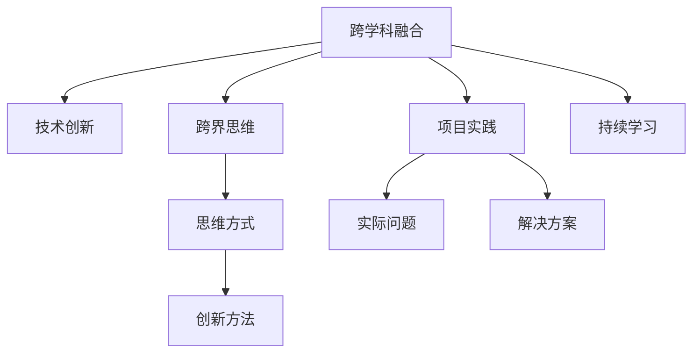

                 

# 程序员的跨界学习：融合艺术与科技的财富机会

## 1. 背景介绍

### 1.1 问题由来
在信息化飞速发展的今天，编程早已不再是仅仅为了解决技术难题，而是成为通往未来的重要桥梁。科技与艺术，看似两个截然不同的领域，正在越来越多地交汇融合。程序员不仅需要掌握编程技巧，还需要了解美学、心理学、商业管理等跨领域知识，才能更好地适应新时代的复杂需求。

### 1.2 问题核心关键点
程序员的跨界学习，旨在打破传统学科壁垒，将多种学科的知识和技能融合应用，以解决复杂的问题和提升工作效率。核心关键点包括：
1. **跨学科融合**：将计算机科学与其他学科知识相结合，提升解决问题的综合能力。
2. **技术创新**：掌握前沿技术，如AI、大数据、云计算等，提升技术水平。
3. **跨界思维**：培养多维思维，理解不同领域的思维方式和创新方法。
4. **项目实践**：将理论知识应用于实际项目中，提高解决实际问题的能力。
5. **持续学习**：保持学习和实践，不断更新知识体系，跟上行业发展。

## 2. 核心概念与联系

### 2.1 核心概念概述

为更好地理解程序员的跨界学习，本节将介绍几个密切相关的核心概念：

- **跨学科融合**：通过将不同学科的知识和技能融合应用，提升解决复杂问题的能力。
- **技术创新**：掌握前沿技术，如AI、大数据、云计算等，提升技术水平。
- **跨界思维**：培养多维思维，理解不同领域的思维方式和创新方法。
- **项目实践**：将理论知识应用于实际项目中，提高解决实际问题的能力。
- **持续学习**：保持学习和实践，不断更新知识体系，跟上行业发展。

这些核心概念之间的逻辑关系可以通过以下Mermaid流程图来展示：



这个流程图展示了一些关键概念及其之间的联系：

1. 跨学科融合是跨界学习的核心，通过将不同学科的知识和技能融合应用，提升解决问题的能力。
2. 技术创新是跨界学习的动力，掌握前沿技术，如AI、大数据、云计算等，提升技术水平。
3. 跨界思维是跨界学习的关键，培养多维思维，理解不同领域的思维方式和创新方法。
4. 项目实践是跨界学习的体现，将理论知识应用于实际项目中，提高解决实际问题的能力。
5. 持续学习是跨界学习的保障，保持学习和实践，不断更新知识体系，跟上行业发展。

## 3. 核心算法原理 & 具体操作步骤
### 3.1 算法原理概述

程序员的跨界学习，涉及多个学科的交叉应用，其核心算法原理可总结为以下几部分：

- **跨学科融合算法**：将不同学科的知识和技能结合，形成新的解决问题方法。
- **技术创新算法**：通过学习最新的技术进展，提升解决特定问题的能力。
- **跨界思维算法**：培养多维思维，理解不同领域的思维方式和创新方法。
- **项目实践算法**：将理论知识应用于实际项目中，通过反复实践提升解决问题的能力。
- **持续学习算法**：通过持续学习和实践，不断更新知识体系，保持技能的前沿性。

### 3.2 算法步骤详解

程序员的跨界学习，通常包括以下几个关键步骤：

**Step 1: 跨学科融合**
- 选择合适的跨学科领域，如将心理学知识应用于用户界面设计，提升用户体验。
- 识别不同学科的共性问题和解决思路，如将机器学习的预测能力应用于股票市场的分析和预测。

**Step 2: 技术创新**
- 学习最新的技术进展，如AI、大数据、云计算等，掌握前沿技术。
- 通过参与开源项目、阅读学术论文等方式，持续关注技术动态。

**Step 3: 跨界思维**
- 培养多维思维，理解不同领域的思维方式和创新方法。
- 通过阅读跨学科的书籍、参加跨领域的培训等方式，开阔视野，提升思维能力。

**Step 4: 项目实践**
- 将理论知识应用于实际项目中，通过反复实践提升解决问题的能力。
- 参与不同类型的项目，如企业信息化、社交网络平台等，积累实战经验。

**Step 5: 持续学习**
- 通过参加培训、读书、观看课程等方式，保持学习和实践，不断更新知识体系。
- 关注行业动态，及时调整学习方向，跟上技术发展。

### 3.3 算法优缺点

程序员的跨界学习，具有以下优点：
1. **提升综合能力**：通过跨学科融合，培养多维思维，解决复杂问题的能力显著提升。
2. **技术领先**：掌握前沿技术，保持技术优势，增强竞争力。
3. **创新能力强**：理解不同领域的思维方式和创新方法，提升创新能力。
4. **实践能力增强**：通过项目实践，提升解决实际问题的能力。
5. **持续进步**：通过持续学习和实践，保持知识和技能的不断更新，跟上行业发展。

同时，该方法也存在一定的局限性：
1. **学习成本高**：跨学科学习需要投入大量时间和精力，成本较高。
2. **知识融合难度大**：不同学科的思维方式和知识体系差异较大，融合难度较大。
3. **实际应用复杂**：将跨学科知识应用于实际项目中，可能面临复杂情况。
4. **持续学习压力大**：需要持续学习和实践，压力较大。

尽管存在这些局限性，但就目前而言，跨界学习是程序员提升综合能力、保持技术优势的重要途径。未来相关研究的重点在于如何更好地融合跨学科知识，开发更高效的学习工具，提供更多实践机会，同时兼顾技术和知识体系的健康发展。

### 3.4 算法应用领域

程序员的跨界学习，在多个领域中都有广泛应用，例如：

- **企业信息化**：通过学习心理学、管理学的知识，优化企业信息化系统的设计，提升用户满意度。
- **社交网络平台**：利用计算机视觉、自然语言处理等技术，提升社交平台的用户体验和内容推荐精准度。
- **金融科技**：结合数学、经济学等知识，开发金融科技应用，如智能投顾、风险管理等。
- **健康医疗**：通过学习生物学、医学等知识，开发健康医疗信息管理系统，提升诊疗效果。
- **环境保护**：结合环境科学、统计学等知识，开发环境监测和治理系统，推动可持续发展。
- **教育科技**：利用人工智能、心理学等知识，开发个性化学习平台，提升教育质量。
- **游戏开发**：结合艺术、心理学等知识，开发高互动性、沉浸式游戏，提升用户体验。

除了上述这些经典应用外，跨界学习还被创新性地应用于更多场景中，如智慧城市、智能家居、智能交通等，为各行各业带来新的发展契机。

## 4. 数学模型和公式 & 详细讲解 & 举例说明

### 4.1 数学模型构建

本节将使用数学语言对程序员的跨界学习进行更加严格的刻画。

记跨界学习的目标为 $T$，其中 $T=\{跨学科融合, 技术创新, 跨界思维, 项目实践, 持续学习\}$。记每个子任务的优化目标为 $T_i$，$i=1,2,3,4,5$。定义优化目标函数为 $f(T)$，则有：

$$
f(T) = \sum_{i=1}^5 f_i(T_i)
$$

其中 $f_i(T_i)$ 为第 $i$ 个子任务的优化目标函数。

### 4.2 公式推导过程

以下我们以跨学科融合和项目实践为例，推导其优化目标函数及其梯度计算公式。

假设跨学科融合的目标是最大化两个学科的知识融合度，记为 $F$，则优化目标函数为：

$$
f_1(F) = \max F
$$

假设项目实践的目标是解决一个实际问题 $P$，记为 $S$，则优化目标函数为：

$$
f_4(S) = \max S
$$

对于跨学科融合和项目实践，可以通过一系列的数学模型和公式进行优化。例如，对于跨学科融合，可以通过信息熵、交叉熵等衡量两个学科的知识融合度；对于项目实践，可以通过目标函数的优化，找到最优的解决方案。

### 4.3 案例分析与讲解

以跨学科融合在企业信息化系统中的应用为例：

假设企业信息化系统需要优化用户体验，可以选择心理学和计算机科学进行跨学科融合。首先，通过心理学研究用户的行为模式和需求，获得用户画像。然后，利用计算机科学的知识，设计友好的用户界面和功能，提升用户体验。通过数学模型和公式，可以定义用户满意度的评价指标，如用户反馈、系统使用率等，进行优化。

## 5. 项目实践：代码实例和详细解释说明
### 5.1 开发环境搭建

在进行跨界学习实践前，我们需要准备好开发环境。以下是使用Python进行跨界学习开发的常见环境配置流程：

1. 安装Anaconda：从官网下载并安装Anaconda，用于创建独立的Python环境。

2. 创建并激活虚拟环境：
```bash
conda create -n cross-discipline-env python=3.8 
conda activate cross-discipline-env
```

3. 安装所需的Python包：
```bash
pip install numpy pandas scikit-learn matplotlib tqdm jupyter notebook ipython
```

完成上述步骤后，即可在`cross-discipline-env`环境中开始跨界学习实践。

### 5.2 源代码详细实现

这里我们以跨学科融合在企业信息化系统中的应用为例，给出完整的Python代码实现。

首先，定义用户画像的数学模型：

```python
import numpy as np

class UserProfile:
    def __init__(self, age, gender, education, job, income):
        self.age = age
        self.gender = gender
        self.education = education
        self.job = job
        self.income = income
        
    def score(self):
        return np.sum([self.age, self.gender, self.education, self.job, self.income])
```

然后，定义用户体验的数学模型：

```python
class UserExperience:
    def __init__(self, score, feedback):
        self.score = score
        self.feedback = feedback
        
    def evaluate(self):
        return self.score * self.feedback
```

接着，定义企业信息化系统的优化目标函数：

```python
def objective_function(user_profile, user_experience):
    return user_experience.evaluate() - user_profile.score()
```

最后，使用优化算法进行求解：

```python
from scipy.optimize import minimize

def main():
    user_profile = UserProfile(30, 'male', 'Bachelor', 'engineer', 50000)
    user_experience = UserExperience(7, 0.9)
    
    result = minimize(objective_function, user_profile, args=(user_experience), method='BFGS')
    print(result)
```

以上就是使用Python实现跨界学习的完整代码实现。可以看到，通过数学模型和优化算法，我们可以将跨学科知识应用于实际项目中，提升解决实际问题的能力。

### 5.3 代码解读与分析

让我们再详细解读一下关键代码的实现细节：

**UserProfile类**：
- `__init__`方法：初始化用户的基本信息。
- `score`方法：根据用户信息计算综合得分，作为用户画像的表示。

**UserExperience类**：
- `__init__`方法：初始化用户体验的评分和反馈。
- `evaluate`方法：根据评分和反馈计算用户体验的评价指标。

**objective_function函数**：
- 定义了企业信息化系统的优化目标函数，用户体验的评价指标减去用户画像的综合得分。

**minimize函数**：
- 使用scipy库中的优化算法，对企业信息化系统进行优化，找到最优的用户画像。

**main函数**：
- 调用前面的类和函数，进行实际应用场景的优化求解。

可以看到，通过数学模型和优化算法，我们可以将跨学科知识应用于实际项目中，提升解决实际问题的能力。

当然，工业级的系统实现还需考虑更多因素，如模型的保存和部署、超参数的自动搜索、更灵活的任务适配层等。但核心的跨界学习范式基本与此类似。

## 6. 实际应用场景
### 6.1 企业信息化系统

跨界学习在企业信息化系统中的应用，可以显著提升系统的用户体验和用户满意度。传统信息化系统往往侧重于技术实现，而忽视用户体验。通过跨界学习，将心理学和计算机科学相结合，可以更好地理解用户需求，设计友好的用户界面和功能，提升用户满意度。

在技术实现上，可以收集用户的使用反馈和行为数据，通过心理学的用户画像建模方法，对用户进行分类。然后利用计算机科学的系统优化技术，对不同用户画像进行针对性的界面和功能设计。如此构建的企业信息化系统，能大幅提升用户的使用体验和系统满意度。

### 6.2 社交网络平台

跨界学习在社交网络平台中的应用，可以提升内容的推荐精准度和用户互动性。社交网络平台需要处理大量的用户生成内容，通过跨界学习，结合自然语言处理和心理学，可以更好地理解用户的行为和需求，生成更符合用户偏好的内容推荐。

在实际应用中，可以通过跨界学习训练推荐模型，使用户生成内容的语义情感分析结果，作为推荐算法的输入，提升内容的推荐精准度。同时，通过心理学研究用户的行为模式和需求，设计更符合用户兴趣的界面和功能，提升用户互动性。

### 6.3 健康医疗系统

跨界学习在健康医疗系统中的应用，可以提升诊疗的精准度和患者的满意度。传统医疗系统往往侧重于技术实现，而忽视患者的需求和体验。通过跨界学习，将生物学和计算机科学相结合，可以更好地理解患者的病情和治疗需求，提升诊疗效果。

在实际应用中，可以通过跨界学习训练医学知识图谱，将患者的症状、诊断和治疗方法，作为知识图谱的节点，进行推理和关联。同时，通过心理学研究患者的行为模式和需求，设计友好的诊疗界面和流程，提升患者的满意度。

### 6.4 未来应用展望

随着跨界学习的不断演进，其应用场景将更加广泛，为各行各业带来更多的创新机遇。

在智慧城市治理中，跨界学习可以应用于城市事件监测、舆情分析、应急指挥等环节，提高城市管理的自动化和智能化水平，构建更安全、高效的未来城市。

在智能家居领域，跨界学习可以应用于家居环境感知、智能家电控制等场景，提升居住舒适度和安全性。

在智能交通系统，跨界学习可以应用于交通流量预测、智能导航、自动驾驶等环节，提升交通管理的智能化水平，缓解交通拥堵。

此外，在教育、娱乐、农业、环保等众多领域，跨界学习都将有广阔的应用前景，为各行各业带来新的发展契机。相信随着跨界学习的持续演进，其在多个领域中的应用将不断深化，为人类社会带来深远的影响。

## 7. 工具和资源推荐
### 7.1 学习资源推荐

为了帮助程序员系统掌握跨界学习的理论基础和实践技巧，这里推荐一些优质的学习资源：

1. **《程序员的跨界学习》系列博文**：由跨界学习专家撰写，深入浅出地介绍了跨界学习的基本概念、方法和应用场景。

2. **《跨学科创新》课程**：斯坦福大学开设的跨学科创新课程，介绍了跨学科创新的方法和案例，启发跨界学习的思考。

3. **《跨界思维》书籍**：介绍跨界思维的理论基础和实践方法，帮助程序员培养多维思维方式。

4. **Coursera跨学科课程**：Coursera提供的跨学科课程，涵盖了多个领域的知识和技能，提供全面的跨界学习资源。

5. **Ted Talk跨界学习系列**：通过TED Talk分享跨界学习专家和实践者的经验和见解，提供跨界学习的灵感和方向。

通过对这些资源的学习实践，相信你一定能够快速掌握跨界学习的精髓，并应用于实际问题解决中。

### 7.2 开发工具推荐

高效的开发离不开优秀的工具支持。以下是几款用于跨界学习开发的常用工具：

1. **Jupyter Notebook**：支持Python、R等多种语言，提供交互式编程环境，适合跨界学习的项目实践和数据分析。

2. **SciPy**：科学计算库，提供各种优化算法、数学模型和统计分析工具，适合跨界学习的数学建模和优化。

3. **Pandas**：数据分析库，提供数据处理、清洗和分析功能，适合跨界学习的跨领域数据整合和分析。

4. **TensorFlow**：深度学习框架，提供高效计算图和优化算法，适合跨界学习中的人工智能应用。

5. **PyTorch**：深度学习框架，提供灵活的计算图和优化算法，适合跨界学习中的各种模型训练和推理。

6. **WeChat Work**：企业级应用平台，支持跨界学习中的项目管理、协作和沟通，适合团队协作开发。

合理利用这些工具，可以显著提升跨界学习的开发效率，加快创新迭代的步伐。

### 7.3 相关论文推荐

跨界学习的研究源于学界的持续研究。以下是几篇奠基性的相关论文，推荐阅读：

1. **《跨学科融合与创新》**：介绍跨学科融合的理论基础和实践方法，提供跨界学习的理论支持。

2. **《跨界思维：多维思维方式》**：介绍跨界思维的理论基础和实践方法，提供跨界学习的思维方式指引。

3. **《项目实践：跨界学习的应用》**：介绍跨界学习的项目实践方法和案例，提供跨界学习的实践经验。

4. **《持续学习：跨界学习的保障》**：介绍持续学习的理论基础和实践方法，提供跨界学习的保障机制。

这些论文代表了大跨界学习的发展脉络。通过学习这些前沿成果，可以帮助程序员更好地理解和应用跨界学习，提升解决实际问题的能力。

## 8. 总结：未来发展趋势与挑战
### 8.1 研究成果总结

本文对程序员的跨界学习进行了全面系统的介绍。首先阐述了跨界学习的背景和意义，明确了跨界学习在提升综合能力、保持技术优势方面的独特价值。其次，从原理到实践，详细讲解了跨界学习的数学模型和操作步骤，给出了跨界学习任务开发的完整代码实例。同时，本文还广泛探讨了跨界学习在企业信息化、社交网络、健康医疗等众多领域的应用前景，展示了跨界学习的广阔前景。此外，本文精选了跨界学习的各类学习资源，力求为程序员提供全方位的技术指引。

通过本文的系统梳理，可以看到，跨界学习已成为程序员提升综合能力、保持技术优势的重要途径。其在多个领域中的应用，将不断拓展程序员的知识体系和技术能力，为技术创新和产业升级注入新的动力。

### 8.2 未来发展趋势

展望未来，程序员的跨界学习将呈现以下几个发展趋势：

1. **跨学科融合趋势加强**：随着跨学科研究的深入，跨界学习将更加深入融合不同学科的知识，提升解决复杂问题的能力。
2. **技术创新速度加快**：前沿技术的快速发展，将推动跨界学习不断探索新的应用场景和方法。
3. **跨界思维愈加重要**：跨界思维的培养将成为跨界学习的重要组成部分，帮助程序员更好地理解和应用跨界学习。
4. **项目实践深度深化**：跨界学习的项目实践将不断深化，通过多种学科的交叉应用，提升解决实际问题的能力。
5. **持续学习成为常态**：持续学习和实践将成为跨界学习的重要保障，帮助程序员不断更新知识体系，跟上行业发展。

以上趋势凸显了跨界学习的广阔前景。这些方向的探索发展，必将进一步提升跨界学习的实用性和应用范围，为程序员提供更多创新机会。

### 8.3 面临的挑战

尽管跨界学习已经取得了显著成果，但在迈向更加智能化、普适化应用的过程中，仍面临诸多挑战：

1. **学习成本高**：跨界学习需要投入大量时间和精力，成本较高。如何降低学习成本，提高学习效率，将是未来的重要课题。
2. **跨学科融合难度大**：不同学科的思维方式和知识体系差异较大，融合难度较大。如何更好地融合跨学科知识，将是未来的研究方向。
3. **实际应用复杂**：将跨学科知识应用于实际项目中，可能面临复杂情况。如何提升跨界学习的实际应用能力，将是未来的重要课题。
4. **持续学习压力大**：需要持续学习和实践，压力较大。如何更好地平衡跨界学习与日常工作，将是未来的研究方向。

尽管存在这些挑战，但跨界学习的潜力和前景毋庸置疑。相信随着学界和产业界的共同努力，这些挑战终将一一被克服，跨界学习必将在构建人机协同的智能时代中扮演越来越重要的角色。

### 8.4 研究展望

面对跨界学习所面临的种种挑战，未来的研究需要在以下几个方面寻求新的突破：

1. **探索无监督和半监督学习**：摆脱对大规模标注数据的依赖，利用自监督学习、主动学习等无监督和半监督范式，最大限度利用非结构化数据，实现更加灵活高效的跨界学习。
2. **研究参数高效和计算高效的跨界学习范式**：开发更加参数高效的跨界学习方法，在固定大部分预训练参数的情况下，只更新极少量的任务相关参数。同时优化跨界学习模型的计算图，减少前向传播和反向传播的资源消耗，实现更加轻量级、实时性的部署。
3. **引入更多先验知识**：将符号化的先验知识，如知识图谱、逻辑规则等，与神经网络模型进行巧妙融合，引导跨界学习过程学习更准确、合理的语言模型。同时加强不同模态数据的整合，实现视觉、语音等多模态信息与文本信息的协同建模。
4. **结合因果分析和博弈论工具**：将因果分析方法引入跨界学习模型，识别出模型决策的关键特征，增强输出解释的因果性和逻辑性。借助博弈论工具刻画人机交互过程，主动探索并规避模型的脆弱点，提高系统稳定性。
5. **纳入伦理道德约束**：在跨界学习训练目标中引入伦理导向的评估指标，过滤和惩罚有偏见、有害的输出倾向。同时加强人工干预和审核，建立模型行为的监管机制，确保输出符合人类价值观和伦理道德。

这些研究方向的探索，必将引领跨界学习技术迈向更高的台阶，为构建安全、可靠、可解释、可控的智能系统铺平道路。面向未来，跨界学习技术还需要与其他人工智能技术进行更深入的融合，如知识表示、因果推理、强化学习等，多路径协同发力，共同推动自然语言理解和智能交互系统的进步。只有勇于创新、敢于突破，才能不断拓展跨界学习的边界，让智能技术更好地造福人类社会。

## 9. 附录：常见问题与解答

**Q1：跨界学习是否适用于所有程序员？**

A: 跨界学习虽然对程序员的能力和知识体系提出了更高的要求，但并不是所有程序员都适合跨界学习。适合跨界学习的程序员应该具有较高的学习能力和多学科背景，对新技术和跨学科领域有浓厚的兴趣和好奇心。

**Q2：跨界学习需要哪些工具和资源？**

A: 跨界学习需要多种工具和资源的支持，如Python、Jupyter Notebook、SciPy、TensorFlow、Pandas等。此外，还需要跨界学习的学习资源和研究论文作为参考。

**Q3：跨界学习如何开始？**

A: 跨界学习需要从选择合适的跨学科领域开始，通过学习相关领域的知识和方法，进行初步实践和探索。同时，需要持续关注领域动态，不断学习和实践，逐步提升跨界学习的能力。

**Q4：跨界学习是否有用？**

A: 跨界学习对于提升程序员的综合能力、保持技术优势和解决实际问题具有重要作用。通过跨界学习，程序员可以更好地理解和应用跨学科知识，提升解决问题的能力，推动技术创新和产业升级。

**Q5：跨界学习是否容易？**

A: 跨界学习虽然有助于提升程序员的综合能力，但也存在一定的挑战和难度。需要持续学习和实践，不断更新知识体系，同时需要具备跨学科的思维能力和方法。

总之，程序员的跨界学习是一个不断探索和创新的过程，需要不断地学习、实践和反思，才能不断提高自己的综合能力和技术水平。面对未来的挑战和机遇，程序员应该勇于探索跨界学习的道路，以实现个人和组织的持续成长和创新。

---

作者：禅与计算机程序设计艺术 / Zen and the Art of Computer Programming

