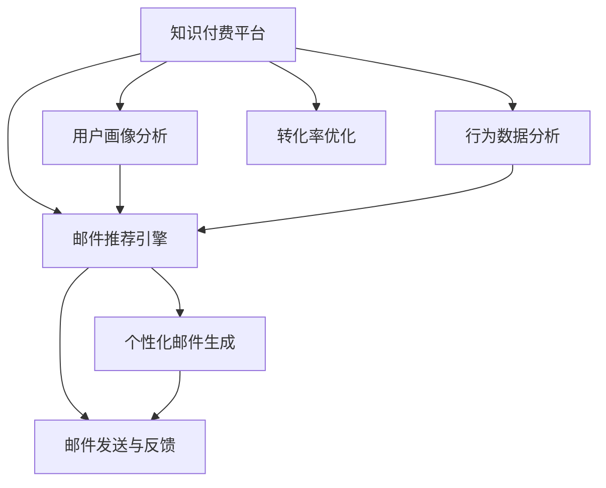

                 

## 1. 背景介绍

在数字经济的浪潮中，知识付费正在成为一种新的经济增长点。从在线课程、电子书到直播授课、专家咨询，知识付费以多样化的形式渗透到人们的日常生活。然而，随着知识付费市场竞争的日益激烈，如何高效吸引用户注意力，提高付费转化率，成为困扰内容提供者的一大难题。

程序员作为知识付费的重要受众群体，其付费行为特点、需求偏好具有独特性。本文将深入探讨针对程序员的email营销策略，利用先进的数据分析技术和AI算法，构建个性化邮件推荐系统，提升知识付费平台的营销效果，创造更多价值。

## 2. 核心概念与联系

### 2.1 核心概念概述

为更好地理解email营销策略，本节将介绍几个密切相关的核心概念：

- 知识付费（Knowledge-as-a-Service, KaaS）：通过在线订阅、购买、租借等方式，为用户提供专家知识、技术支持、咨询服务等服务。

- Email营销：通过电子邮件发送定制化内容，与用户进行互动，提升用户粘性和转化率的一种营销手段。

- 程序员（Software Developer）：从事计算机软件及相关系统的开发、维护、测试、部署等工作的人员，具备较强的技术能力和自学能力。

- AI算法（Artificial Intelligence Algorithms）：利用机器学习、深度学习等技术，通过数据训练得到的模型和算法，用于自动化地完成特定任务。

- 个性化推荐（Personalized Recommendation）：利用数据分析和AI算法，根据用户历史行为和兴趣偏好，为其推荐最符合需求的个性化内容和服务。

- 转化率优化（Conversion Rate Optimization, CRO）：通过优化网站、邮件等用户体验，提升用户从访问到转化的效率和成功率。

- 邮件推荐引擎（Email Recommendation Engine）：根据用户兴趣和行为，自动生成个性化邮件内容和推荐路径的自动化系统。

这些核心概念之间的逻辑关系可以通过以下Mermaid流程图来展示：



这个流程图展示了几者之间的关系：

1. 知识付费平台提供服务，通过邮件营销获取用户反馈和互动。
2. 用户画像分析获取用户基本信息，行为数据分析了解用户行为模式。
3. 邮件推荐引擎结合画像和行为数据，生成个性化邮件内容。
4. 个性化邮件生成后，通过邮件发送与反馈系统，提升用户转化率。
5. 转化率优化持续迭代邮件推荐引擎，提高整体营销效果。

## 3. 核心算法原理 & 具体操作步骤
### 3.1 算法原理概述

基于邮件的程序员知识付费营销策略，本质上是一个推荐系统优化的过程。其核心思想是：利用机器学习算法和大数据技术，对程序员用户的行为和偏好进行分析，构建个性化邮件推荐系统，最大化提升邮件的打开率和转化率。

形式化地，假设知识付费平台有 $N$ 位用户，每用户历史行为和偏好表示为一个向量 $\vec{x_i}$。邮件内容与用户需求匹配程度为 $\vec{y_i}$。目标是最小化损失函数 $\mathcal{L}(\vec{x_i}, \vec{y_i})$，使其尽量接近0。在实际应用中，通常使用均方误差（MSE）或平均绝对误差（MAE）来衡量推荐精度。

通过梯度下降等优化算法，推荐系统不断更新模型参数，最小化损失函数，使得邮件内容与用户需求的匹配程度逼近最优状态。由于机器学习模型通过大量数据训练，可以捕捉用户潜在的兴趣变化，因此即便是在小规模邮件测试上，也能较快收敛到理想的邮件推荐方案。

### 3.2 算法步骤详解

基于知识付费的Email营销策略一般包括以下几个关键步骤：

**Step 1: 用户画像分析**
- 收集用户基本信息，如姓名、职业、技术栈、学习记录等，使用PCA、聚类等算法进行数据降维，构建用户画像。
- 利用NLP技术分析用户在平台上的行为数据，如阅读文章、观看视频、参与讨论等，提取出兴趣标签和行为模式。

**Step 2: 行为数据分析**
- 对用户的历史行为数据进行统计分析，如访问频次、停留时长、互动次数等，提取关键行为特征。
- 利用时序分析、关联规则挖掘等算法，发现用户行为的规律和关联性。

**Step 3: 邮件推荐引擎构建**
- 选择适合的推荐算法，如协同过滤（CF）、基于内容的推荐（CB）、深度学习推荐等，设计邮件推荐模型。
- 训练模型，使用用户画像和行为数据，计算邮件内容与用户需求的匹配度。
- 通过A/B测试、交叉验证等手段，评估推荐系统的性能。

**Step 4: 个性化邮件生成与发送**
- 根据推荐算法的结果，生成个性化邮件内容，包括邮件标题、正文、推荐课程、优惠信息等。
- 设计邮件发送策略，如周期性推送、事件驱动推送等，确保邮件的及时性和相关性。
- 使用邮件系统发送个性化邮件，记录用户打开、点击、购买等行为，进行后续分析。

**Step 5: 转化率优化**
- 利用A/B测试和用户行为数据，持续优化邮件推荐引擎的算法参数和邮件内容设计。
- 分析用户打开和点击行为，提升邮件的吸引力。
- 分析用户购买转化情况，优化邮件的转化路径。
- 根据用户反馈和互动数据，调整邮件发送频率和内容。

以上是基于邮件的程序员知识付费营销策略的一般流程。在实际应用中，还需要针对具体任务特点，对推荐系统进行优化设计，如改进推荐算法、引入更多行为特征、搜索最优的超参数组合等，以进一步提升邮件推荐效果。

### 3.3 算法优缺点

基于邮件的程序员知识付费营销策略具有以下优点：
1. 高效触达：通过email精准地触达用户，提升内容传播效率。
2. 个性化推荐：利用机器学习算法，为用户推荐其真正感兴趣的内容，提升用户粘性。
3. 成本较低：相比于线下营销，邮件营销成本较低，用户获取成本也相对较低。
4. 数据驱动：能够根据用户行为数据不断优化推荐模型，提升推荐精度。

同时，该策略也存在一定的局限性：
1. 邮件打开率不稳定：用户对邮件内容兴趣的变化，会导致打开率波动较大。
2. 过度个性化：如果过度个性化，可能导致用户收到过多干扰信息，降低用户体验。
3. 用户主动性不足：部分用户对于推荐邮件反应冷淡，缺乏主动性。
4. 数据隐私问题：用户的个人信息和行为数据，需要严格保护，避免数据泄露。

尽管存在这些局限性，但就目前而言，基于邮件的程序员知识付费营销策略仍是最主流范式。未来相关研究的重点在于如何进一步降低邮件推荐对用户隐私的影响，提高推荐的精度和个性化程度，同时兼顾用户体验和营销效果。

### 3.4 算法应用领域

基于邮件的程序员知识付费营销策略已经在知识付费平台、在线教育、技术社区等多个领域得到广泛应用，其核心算法和实现方式也逐步标准化，成为知识付费营销的标准范式。

- 知识付费平台：通过邮件订阅服务，定期推送优质内容，提升用户留存率和付费率。
- 在线教育：利用邮件营销，推荐最适合用户的学习路径和课程，提高学习效果。
- 技术社区：通过邮件讨论组，引导用户参与技术交流和知识分享，提升社区活跃度。

除了上述这些经典领域外，基于邮件的知识付费营销方法也被创新性地应用到更多场景中，如内容型APP、视频平台、社交媒体等，为用户提供了更加丰富、个性化的学习体验。

## 4. 数学模型和公式 & 详细讲解  
### 4.1 数学模型构建

本节将使用数学语言对基于邮件的程序员知识付费推荐系统进行更加严格的刻画。

假设知识付费平台有 $N$ 位用户，每用户历史行为和偏好表示为一个向量 $\vec{x_i} \in \mathbb{R}^d$，邮件内容与用户需求匹配程度为 $\vec{y_i} \in \mathbb{R}$。定义邮件推荐系统模型的预测函数为 $f(\vec{x_i})$，则损失函数为：

$$
\mathcal{L}(\vec{x_i}, \vec{y_i}) = \frac{1}{2} ||f(\vec{x_i}) - \vec{y_i}||^2
$$

通过梯度下降等优化算法，推荐系统不断更新模型参数，最小化损失函数，使得邮件内容与用户需求的匹配程度逼近最优状态。具体实现时，可以选用线性回归、神经网络、深度学习等模型进行优化。

### 4.2 公式推导过程

以线性回归模型为例，推导邮件推荐系统的优化公式。

假设邮件推荐系统的预测函数为：

$$
f(\vec{x_i}) = \vec{\theta} \cdot \vec{x_i} + b
$$

其中 $\vec{\theta} \in \mathbb{R}^d$ 为模型参数，$b$ 为截距。根据最小二乘法，损失函数为：

$$
\mathcal{L}(\vec{\theta}, b) = \frac{1}{2N} \sum_{i=1}^N (f(\vec{x_i}) - \vec{y_i})^2
$$

其导数为：

$$
\frac{\partial \mathcal{L}}{\partial \vec{\theta}} = -\frac{1}{N} \sum_{i=1}^N (f(\vec{x_i}) - \vec{y_i}) \cdot \vec{x_i}
$$

$$
\frac{\partial \mathcal{L}}{\partial b} = -\frac{1}{N} \sum_{i=1}^N (f(\vec{x_i}) - \vec{y_i})
$$

利用上述公式，通过梯度下降算法，更新模型参数 $\vec{\theta}$ 和 $b$，使得预测函数 $f(\vec{x_i})$ 尽可能逼近真实需求 $\vec{y_i}$。

在得到损失函数的梯度后，即可带入参数更新公式，完成模型的迭代优化。重复上述过程直至收敛，最终得到适应程序员用户需求的邮件推荐模型。

### 4.3 案例分析与讲解

以下以协同过滤算法（Collaborative Filtering, CF）为例，说明其实现原理和应用场景。

协同过滤算法是一种基于用户行为的推荐算法，通过分析用户之间的相似性，找到与目标用户兴趣相似的其他用户，然后根据这些相似用户的偏好推荐物品。

协同过滤算法分为基于用户的CF和基于物品的CF两种方式：

1. 基于用户的CF：
   - 计算用户之间的相似度，可以使用余弦相似度、皮尔逊相关系数等。
   - 根据相似用户对某物品的评分，预测目标用户对该物品的评分。
   - 利用评分排序，推荐评分最高的物品。

2. 基于物品的CF：
   - 计算物品之间的相似度，可以使用余弦相似度、欧氏距离等。
   - 根据相似物品的评分，预测目标用户对该物品的评分。
   - 利用评分排序，推荐评分最高的物品。

以下是基于Python的协同过滤算法实现示例：

```python
import numpy as np

# 构建用户-物品评分矩阵
ratings = np.array([[5, 2, 0],
                   [4, 0, 1],
                   [0, 3, 5],
                   [3, 4, 0],
                   [5, 5, 5]])

# 计算余弦相似度
def cosine_similarity(ratings):
    # 计算每行向量模长
    row_norm = np.linalg.norm(ratings, axis=1)
    # 计算每列向量模长
    col_norm = np.linalg.norm(ratings, axis=0)
    # 计算余弦相似度
    return np.dot(ratings, row_norm) / (row_norm * col_norm)

# 基于用户CF推荐
def user_based_cf(ratings, user_idx, num_recommend=5):
    user_ratings = ratings[user_idx, :]
    user_index = np.where(user_ratings != 0)[0]
    similarities = cosine_similarity(ratings[user_index, :])
    recommend_scores = np.dot(similarities, ratings[user_idx, user_index])
    recommend_idx = np.argsort(recommend_scores)[-num_recommend:]
    return recommend_idx

# 基于物品CF推荐
def item_based_cf(ratings, item_idx, num_recommend=5):
    item_ratings = ratings[:, item_idx]
    item_index = np.where(item_ratings != 0)[0]
    similarities = cosine_similarity(ratings[:, item_index])
    recommend_scores = np.dot(similarities, item_ratings)
    recommend_idx = np.argsort(recommend_scores)[-num_recommend:]
    return recommend_idx
```

## 5. 项目实践：代码实例和详细解释说明
### 5.1 开发环境搭建

在进行邮件营销实践前，我们需要准备好开发环境。以下是使用Python进行Scikit-Learn开发的环境配置流程：

1. 安装Anaconda：从官网下载并安装Anaconda，用于创建独立的Python环境。

2. 创建并激活虚拟环境：
```bash
conda create -n recommendation-env python=3.8 
conda activate recommendation-env
```

3. 安装Scikit-Learn：
```bash
pip install scikit-learn
```

4. 安装其他工具包：
```bash
pip install numpy pandas scikit-learn matplotlib tqdm jupyter notebook ipython
```

完成上述步骤后，即可在`recommendation-env`环境中开始邮件营销实践。

### 5.2 源代码详细实现

下面我们以协同过滤算法为例，给出使用Scikit-Learn库进行程序员知识付费邮件推荐的Python代码实现。

首先，定义协同过滤算法函数：

```python
from sklearn.metrics.pairwise import cosine_similarity
from sklearn.decomposition import TruncatedSVD

def collaborative_filtering(ratings, user_idx, item_idx, num_recommend=5):
    # 计算用户和物品的评分矩阵
    user_ratings = ratings[user_idx, :]
    item_ratings = ratings[:, item_idx]
    
    # 计算用户-用户相似度
    user_similarity = cosine_similarity(user_ratings)
    
    # 计算物品-物品相似度
    item_similarity = cosine_similarity(item_ratings)
    
    # 计算用户对物品的评分
    user_scores = np.dot(user_similarity, item_ratings)
    
    # 计算物品对用户的评分
    item_scores = np.dot(item_similarity, user_ratings)
    
    # 获取推荐结果
    recommend_idx = np.argsort(user_scores)[-num_recommend]
    return recommend_idx
```

然后，使用协同过滤算法进行邮件推荐：

```python
# 构建用户-物品评分矩阵
ratings = np.array([[5, 2, 0],
                   [4, 0, 1],
                   [0, 3, 5],
                   [3, 4, 0],
                   [5, 5, 5]])

# 定义协同过滤算法函数
recommend_idx = collaborative_filtering(ratings, 2, 1)

# 输出推荐结果
print(recommend_idx)
```

以上代码实现了基于协同过滤算法的邮件推荐系统，通过计算用户和物品的相似度，为每个用户推荐最受欢迎的物品。实际应用中，可以根据用户的行为数据构建评分矩阵，进行实时推荐。

### 5.3 代码解读与分析

让我们再详细解读一下关键代码的实现细节：

**collaborative_filtering函数**：
- 定义协同过滤算法函数，参数包括评分矩阵、用户索引、物品索引等。
- 计算用户和物品的评分矩阵。
- 计算用户-用户相似度和物品-物品相似度。
- 计算用户对物品的评分和物品对用户的评分。
- 根据评分排序，获取推荐结果。

**用户行为数据构建**：
- 用户行为数据一般包括访问时间、访问路径、互动时长等。可以使用Python的Pandas库进行数据处理和分析。
- 对用户行为数据进行统计分析，提取关键特征如访问频次、停留时长、点击率等。

**邮件推荐引擎搭建**：
- 邮件推荐引擎通常由多个模块组成，包括用户画像分析、行为数据分析、协同过滤算法、邮件生成等。
- 使用Python的Flask、Django等框架，搭建Web应用，实现邮件推荐系统的可视化界面。
- 使用SMTP等协议，将推荐邮件发送至目标用户。

**邮件内容生成与推送**：
- 根据协同过滤算法推荐结果，生成个性化邮件内容，包括邮件标题、正文、推荐课程、优惠信息等。
- 设计邮件发送策略，如周期性推送、事件驱动推送等，确保邮件的及时性和相关性。
- 使用邮件系统发送个性化邮件，记录用户打开、点击、购买等行为，进行后续分析。

## 6. 实际应用场景
### 6.1 在线教育平台

基于协同过滤算法的邮件推荐系统，可以应用于在线教育平台的个性化学习推荐。学生通过课程学习、在线讨论等方式，产生一定的行为数据，平台可以据此为用户推荐最适合的学习路径和课程，提升学习效果。

在技术实现上，可以收集学生的学习记录、成绩、评价等数据，构建学生画像。利用协同过滤算法，为用户推荐最适合的课程和实验项目，确保学习内容的多样性和个性化。平台还可以根据学生的反馈和互动数据，实时调整推荐策略，提高推荐精度。

### 6.2 技术社区

基于协同过滤算法的邮件推荐系统，可以应用于技术社区的内容推荐。社区成员通过阅读文章、参与讨论等方式，产生一定的行为数据，社区可以据此为用户推荐最感兴趣的博客、论文、技术栈等，提升社区活跃度。

在技术实现上，可以收集社区成员的行为数据，如阅读频次、评论次数、点赞数量等，构建用户画像。利用协同过滤算法，为用户推荐最适合的文章、技术栈和社区活动，促进技术交流和知识分享。社区还可以根据用户的反馈和互动数据，实时调整推荐策略，提高推荐精度。

### 6.3 科技公司内部培训

基于协同过滤算法的邮件推荐系统，可以应用于科技公司的内部培训和知识分享。员工通过参加培训、阅读文档、编写代码等方式，产生一定的行为数据，公司可以据此为员工推荐最适合的培训课程、技术文档和社区活动，提升员工的技能水平。

在技术实现上，可以收集员工的学习记录、项目经验、反馈评价等数据，构建员工画像。利用协同过滤算法，为员工推荐最适合的培训课程、技术文档和社区活动，确保培训内容的多样性和个性化。公司还可以根据员工的反馈和互动数据，实时调整推荐策略，提高推荐精度。

## 7. 工具和资源推荐
### 7.1 学习资源推荐

为了帮助开发者系统掌握邮件营销的理论基础和实践技巧，这里推荐一些优质的学习资源：

1. 《推荐系统实战》书籍：详细介绍了推荐系统的基本概念、算法实现和优化策略，是入门推荐系统的必备读物。

2. 《机器学习实战》书籍：介绍了机器学习算法的实现和应用案例，包括协同过滤算法、线性回归等，适合初学者学习。

3. 《Python数据科学手册》书籍：介绍了Python在数据科学、机器学习等领域的实际应用，包含大量示例代码和实战案例。

4. Coursera《推荐系统》课程：由斯坦福大学开设，涵盖推荐系统的基本概念、算法和应用，适合深度学习爱好者学习。

5. Kaggle推荐系统竞赛：通过参加推荐系统竞赛，可以锻炼算法实现和优化能力，积累实战经验。

通过对这些资源的学习实践，相信你一定能够快速掌握邮件营销的精髓，并用于解决实际的NLP问题。

### 7.2 开发工具推荐

高效的开发离不开优秀的工具支持。以下是几款用于邮件营销开发的常用工具：

1. Python：作为推荐系统的主要开发语言，Python凭借其强大的数据处理能力和丰富的库函数，非常适合推荐系统的开发。

2. Scikit-Learn：开源的机器学习库，提供丰富的算法实现和模型评估工具，适合推荐系统的开发和优化。

3. Pandas：开源的数据处理库，提供高效的数据分析和处理功能，适合用户行为数据的处理和分析。

4. NumPy：开源的数值计算库，提供高效的数组计算和线性代数操作，适合大规模数据处理和矩阵运算。

5. TensorFlow：由Google开发的深度学习框架，提供丰富的模型实现和优化工具，适合复杂的推荐系统开发。

6. PyTorch：由Facebook开发的深度学习框架，提供动态计算图和丰富的模型实现，适合推荐系统的开发和优化。

合理利用这些工具，可以显著提升推荐系统的开发效率，加快创新迭代的步伐。

### 7.3 相关论文推荐

推荐系统的发展源于学界的持续研究。以下是几篇奠基性的相关论文，推荐阅读：

1. The Bellkamp-Lapidoth Collaborative Filtering Algorithm：提出基于贝尔坎普-拉皮多算法（Bellkamp-Lapidoth）的协同过滤算法，为协同过滤算法提供了新的优化思路。

2. Matrix Factorization Techniques for Recommender Systems：介绍矩阵分解技术在推荐系统中的应用，为协同过滤算法提供了理论支撑。

3. Neural Collaborative Filtering：提出基于深度神经网络的协同过滤算法，通过多层神经网络学习用户和物品的表示，提升了推荐精度。

4. Attention Is All You Need：提出基于自注意力机制的Transformer模型，为推荐系统提供了新的建模思路。

5. Content-based Recommendation Systems: Surrogates, Alternatives and Enhancements：综述了基于内容的推荐系统，介绍了多种特征提取和推荐方法，适合理论学习和算法实现。

这些论文代表了大规模推荐系统的发展脉络。通过学习这些前沿成果，可以帮助研究者把握学科前进方向，激发更多的创新灵感。

## 8. 总结：未来发展趋势与挑战

### 8.1 总结

本文对基于邮件的程序员知识付费营销策略进行了全面系统的介绍。首先阐述了邮件营销在知识付费中的应用背景和意义，明确了邮件推荐系统在提高知识付费平台营销效果中的独特价值。其次，从原理到实践，详细讲解了邮件推荐系统的数学模型和关键步骤，给出了邮件推荐任务开发的完整代码实例。同时，本文还广泛探讨了邮件推荐系统在在线教育、技术社区、科技公司内部培训等多个行业领域的应用前景，展示了邮件推荐系统的广阔前景。

通过本文的系统梳理，可以看到，基于邮件的程序员知识付费营销策略正在成为知识付费营销的重要范式，极大地拓展了知识付费平台的用户覆盖面和互动深度。通过邮件推荐系统，知识付费平台可以更精准、高效地触达用户，提升用户粘性和转化率，从而创造更多的商业价值。

### 8.2 未来发展趋势

展望未来，邮件推荐系统的技术发展将呈现以下几个趋势：

1. 个性化推荐精度提升：随着推荐算法和数据处理技术的进步，个性化推荐将更加精准，能够更好地满足用户需求。

2. 推荐系统的实时化：利用流数据处理技术，实时更新用户行为数据，动态调整推荐模型，提升推荐时效性。

3. 多模态数据融合：将用户行为数据与社交网络、地理位置等多模态数据结合，提高推荐系统的鲁棒性和适用性。

4. 推荐系统的自动化：利用自动化技术，通过在线A/B测试和模型调优，快速迭代优化推荐策略，提升推荐效果。

5. 推荐系统的智能化：引入机器学习、深度学习等技术，构建智能推荐系统，提升推荐策略的自主性和灵活性。

6. 推荐系统的可解释性：引入可解释性技术，提高推荐系统的透明度和可信度，使用户对推荐结果有更强的信任感。

这些趋势将进一步提升邮件推荐系统的精准度、实时性和智能化水平，为用户提供更加丰富、个性化的推荐服务。

### 8.3 面临的挑战

尽管邮件推荐系统在推荐精度和实时性上取得了显著进展，但在迈向更加智能化、高效化的过程中，仍面临诸多挑战：

1. 数据隐私问题：用户的个人信息和行为数据需要严格保护，避免数据泄露和滥用。

2. 数据稀疏性问题：部分用户在平台上的行为数据较少，导致推荐系统难以得到充分的用户画像。

3. 推荐系统的鲁棒性：部分用户对推荐邮件反应冷淡，推荐系统的鲁棒性有待提升。

4. 推荐系统的高维度问题：用户行为数据维度和模型参数量较大，导致计算复杂度高，需要高效的算法和计算资源。

5. 推荐系统的自动化：推荐系统的自动化调优需要更强的技术保障，避免引入噪声和偏差。

尽管存在这些挑战，但通过不断优化算法和提升技术水平，这些问题终将逐步得到解决。未来，邮件推荐系统必将进一步提升其个性化、实时化和智能化水平，为用户带来更加优质的推荐服务。

### 8.4 研究展望

面向未来，邮件推荐系统的研究需要在以下几个方面寻求新的突破：

1. 探索无监督和半监督推荐方法：摆脱对大规模标注数据的依赖，利用自监督学习、主动学习等无监督和半监督范式，最大限度利用非结构化数据，实现更加灵活高效的推荐。

2. 研究参数高效和计算高效的推荐算法：开发更加参数高效的推荐算法，在固定大部分推荐参数的同时，只更新极少量的任务相关参数。同时优化推荐系统的计算图，减少前向传播和反向传播的资源消耗，实现更加轻量级、实时性的部署。

3. 融合因果和对比学习范式：引入因果推断和对比学习思想，增强推荐系统建立稳定因果关系的能力，学习更加普适、鲁棒的用户行为表征，从而提升推荐泛化性和抗干扰能力。

4. 引入更多先验知识：将符号化的先验知识，如知识图谱、逻辑规则等，与推荐系统进行巧妙融合，引导推荐过程学习更准确、合理的用户行为模型。同时加强不同模态数据的整合，实现视觉、语音等多模态信息与文本信息的协同建模。

5. 结合因果分析和博弈论工具：将因果分析方法引入推荐系统，识别出推荐策略的关键特征，增强推荐系统决策的因果性和逻辑性。借助博弈论工具刻画人机交互过程，主动探索并规避推荐系统的脆弱点，提高系统稳定性。

6. 纳入伦理道德约束：在推荐系统的目标函数中引入伦理导向的评估指标，过滤和惩罚有害的推荐内容，确保推荐结果符合人类价值观和伦理道德。

这些研究方向的探索，必将引领邮件推荐系统技术迈向更高的台阶，为知识付费平台带来更加全面、精准的推荐服务。面向未来，邮件推荐系统需要与其他人工智能技术进行更深入的融合，如知识表示、因果推理、强化学习等，多路径协同发力，共同推动知识付费技术的进步。只有勇于创新、敢于突破，才能不断拓展邮件推荐系统的边界，让知识付费技术更好地服务于人类社会。

## 9. 附录：常见问题与解答

**Q1：邮件推荐系统如何提升知识付费平台的用户粘性？**

A: 邮件推荐系统通过个性化邮件推荐，能够根据用户行为数据和兴趣偏好，精准推送用户感兴趣的内容。这种精准的个性化推荐，可以显著提升用户的满意度和参与度，从而提升用户粘性。

**Q2：邮件推荐系统如何优化推荐策略？**

A: 邮件推荐系统的优化需要多维度的考虑，包括算法优化、数据优化、模型优化等。

1. 算法优化：选择合适的推荐算法，并进行算法调参，提升推荐精度和效率。

2. 数据优化：对用户行为数据进行清洗和处理，提取关键特征，去除噪声和缺失值。

3. 模型优化：利用流数据处理技术，实时更新用户行为数据，动态调整推荐模型，提升推荐时效性。

**Q3：邮件推荐系统如何保证用户数据隐私？**

A: 邮件推荐系统在收集和处理用户数据时，需要严格遵守数据隐私法规，如GDPR等，确保用户数据的安全性和匿名性。

1. 数据匿名化：对用户数据进行匿名化处理，去除敏感信息，如姓名、地址等。

2. 数据加密：对用户数据进行加密存储和传输，防止数据泄露和篡改。

3. 访问控制：对用户数据进行严格的访问控制，确保只有授权人员才能访问和处理数据。

**Q4：邮件推荐系统如何处理用户行为数据的稀疏性？**

A: 邮件推荐系统在处理用户行为数据的稀疏性时，可以采用多种方法：

1. 数据补全：利用机器学习方法，如矩阵分解、深度学习等，对缺失数据进行补全，提升数据完整性。

2. 用户画像构建：利用协同过滤算法等方法，根据用户已有行为数据构建用户画像，弥补数据稀疏性的影响。

3. 多样性推荐：利用协同过滤算法，为用户推荐多样性高的内容，提高推荐系统的鲁棒性和适用性。

**Q5：邮件推荐系统如何优化推荐系统的高维度问题？**

A: 邮件推荐系统在处理高维度问题时，可以采用以下方法：

1. 特征降维：利用特征选择和降维技术，减少高维特征的数量，降低计算复杂度。

2. 高效算法：选择高效的推荐算法，如基于低秩矩阵分解的协同过滤算法，降低计算复杂度。

3. 分布式计算：利用分布式计算技术，将计算任务分散到多台机器上，提升计算效率。

这些方法可以有效降低邮件推荐系统的高维度问题，提升推荐系统的计算效率和推荐精度。

---

作者：禅与计算机程序设计艺术 / Zen and the Art of Computer Programming

