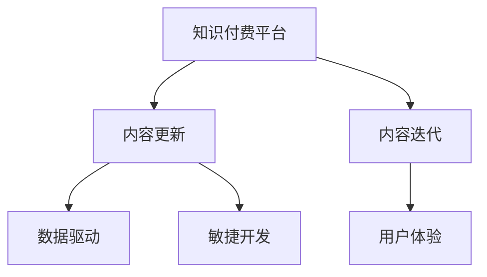

                 

# 程序员知识付费的内容更新与迭代策略

## 1. 背景介绍

随着知识付费市场的快速扩张，程序员知识付费的内容更新与迭代策略变得越来越重要。优秀的更新与迭代策略不仅可以提升用户满意度，还能保持订阅者的活跃度，从而带来更多的商业收益。本文将系统介绍程序员知识付费平台的内容更新与迭代策略，涵盖从内容策划、发布到迭代优化的各个环节。

## 2. 核心概念与联系

### 2.1 核心概念概述

为更好地理解程序员知识付费平台的内容更新与迭代策略，本节将介绍几个密切相关的核心概念：

- **知识付费平台（KFP）**：以内容为核心，通过付费模式提供专业知识、技能培训、工具教程等产品的平台。
- **内容更新（Content Update）**：根据市场需求和技术发展，定期对现有内容进行补充、修改和优化。
- **内容迭代（Content Iteration）**：在内容更新基础上，根据用户反馈和技术进展，进行多次迭代，持续提升内容质量。
- **用户体验（User Experience, UX）**：通过内容更新与迭代，不断优化用户的使用体验，提升用户满意度和忠诚度。
- **数据驱动（Data-Driven）**：借助用户行为数据分析，指导内容更新与迭代策略的制定和实施。
- **敏捷开发（Agile Development）**：采用快速迭代、持续交付的方式，提高内容更新与迭代的效率和效果。

这些核心概念之间的逻辑关系可以通过以下Mermaid流程图来展示：



这个流程图展示了几类核心概念及其之间的关系：

1. 知识付费平台是内容更新与迭代的出发点和归宿。
2. 内容更新与迭代是提升用户体验和保持平台活力的关键手段。
3. 数据驱动和敏捷开发是内容更新与迭代的重要方法和工具。

这些概念共同构成了程序员知识付费平台的内容更新与迭代框架，使其能够根据市场和技术的变化，动态调整内容策略，保持竞争力。

## 3. 核心算法原理 & 具体操作步骤

### 3.1 算法原理概述

程序员知识付费平台的内容更新与迭代策略，本质上是一个基于用户反馈和市场动态的动态优化过程。其核心思想是：通过分析用户行为数据，识别内容需求和问题，制定科学合理的内容更新与迭代计划，以持续提升内容的吸引力和价值。

形式化地，设知识付费平台的内容库为 $C$，用户反馈为 $F$，市场需求为 $D$。平台的内容更新与迭代策略可以表示为：

$$
C' = \mathop{\arg\min}_{C} \{ F(C) + D(C) \}
$$

其中 $F(C)$ 表示内容库 $C$ 与用户反馈 $F$ 的差异，$D(C)$ 表示内容库 $C$ 与市场需求 $D$ 的差异。目标是最小化这两个差异，找到最优的内容库 $C'$。

### 3.2 算法步骤详解

基于以上原理，程序员知识付费平台的内容更新与迭代策略可以分为以下几个步骤：

**Step 1: 数据收集与分析**
- 收集用户行为数据，包括点击量、停留时间、购买率、评论反馈等。
- 通过数据分析工具（如Google Analytics、Mixpanel等），对用户行为进行量化分析。

**Step 2: 内容需求识别**
- 基于用户行为数据，识别用户的热门兴趣点、知识盲区、常见问题等。
- 使用数据可视化工具（如Tableau、Power BI等），将分析结果可视化展示，便于内容策划团队直观理解。

**Step 3: 内容策划与发布**
- 根据内容需求分析结果，策划内容更新计划。
- 选择合适的更新形式，如课程、文章、视频、直播等。
- 制定详细的内容发布计划，包括时间、频次、形式等。

**Step 4: 用户反馈收集与评估**
- 发布更新内容后，收集用户反馈，包括评分、评论、分享等。
- 通过用户满意度调查问卷、焦点小组讨论等方式，进一步了解用户对更新内容的评价。

**Step 5: 内容迭代优化**
- 分析用户反馈和满意度调查结果，识别内容优化点。
- 对更新内容进行再次迭代优化，如增加案例、补充背景、改进格式等。
- 重复以上步骤，不断迭代优化，直至用户满意为止。

### 3.3 算法优缺点

基于数据驱动的内容更新与迭代策略具有以下优点：
1. 科学合理：通过数据分析指导内容更新，避免主观臆断，提升内容相关性和实用性。
2. 用户导向：以用户需求和反馈为核心，提升内容的吸引力和用户体验。
3. 灵活可调：根据市场需求和技术进展，灵活调整内容更新策略，保持平台竞争力。

同时，该方法也存在一定的局限性：
1. 依赖数据质量：内容更新与迭代的效果取决于数据收集和分析的准确性，数据偏差可能影响策略制定。
2. 开发周期长：内容更新与迭代需要多次发布和反馈循环，开发周期较长。
3. 创新不足：过分依赖用户反馈，可能忽视技术前沿和创新点。

尽管存在这些局限性，但就目前而言，基于数据驱动的内容更新与迭代方法仍是最主流、最有效的策略之一。未来相关研究的重点在于如何进一步降低开发周期，提升内容创新性，同时兼顾数据质量和用户反馈。

### 3.4 算法应用领域

基于数据驱动的内容更新与迭代策略，在程序员知识付费平台的应用领域已经得到了广泛的应用，涵盖了以下多个方面：

- **课程更新**：根据用户学习反馈，定期更新课程内容，增加实战案例、新技术、新工具等。
- **文章优化**：通过用户评论和阅读反馈，优化文章结构和内容，增加可操作性和实用性。
- **视频迭代**：对视频课程进行多次迭代，增加演示和实操环节，提升用户学习效果。
- **直播互动**：定期举办专家直播，解决用户问题和答疑，增强用户互动性和参与感。
- **工具教程**：根据工具更新和使用反馈，更新和增加工具教程，提升工具使用效率。

除了上述这些常见应用外，程序员知识付费平台的内容更新与迭代策略还广泛应用于工具评测、算法讲解、技术趋势分析等方向，为程序员提供全方位的知识服务。

## 4. 数学模型和公式 & 详细讲解  
### 4.1 数学模型构建

本节将使用数学语言对程序员知识付费平台的内容更新与迭代过程进行更加严格的刻画。

设知识付费平台的内容库为 $C$，用户反馈为 $F$，市场需求为 $D$。内容更新与迭代的目标是最小化这两个差异：

$$
C' = \mathop{\arg\min}_{C} \{ F(C) + D(C) \}
$$

其中 $F(C)$ 和 $D(C)$ 分别为内容库 $C$ 与用户反馈 $F$ 和市场需求 $D$ 的差异函数。为了简化问题，我们假设 $F(C)$ 和 $D(C)$ 均为标量值，具体形式可以采用以下几种：

- **内容相关性度量**：$F(C) = |F(C) - F_0|$，其中 $F_0$ 为预定义的参考值，如平均评分、平均停留时间等。
- **内容实用性度量**：$D(C) = |D(C) - D_0|$，其中 $D_0$ 为预定义的参考值，如工具使用频率、算法应用率等。
- **内容新颖性度量**：$D(C) = |D(C) - D_0|$，其中 $D_0$ 为预定义的参考值，如新技术引入频率、新工具普及率等。

通过选择合适的差异函数，可以进一步细化内容更新与迭代的目标，优化更新策略。

### 4.2 公式推导过程

假设内容库 $C$ 中包含 $N$ 个知识点 $c_1, c_2, ..., c_N$，用户反馈为 $F$，市场需求为 $D$，则内容更新与迭代的优化目标可以表示为：

$$
C' = \mathop{\arg\min}_{C} \sum_{i=1}^N \{ f_i(c_i) + d_i(c_i) \}
$$

其中 $f_i(c_i)$ 和 $d_i(c_i)$ 分别为知识点 $c_i$ 与用户反馈 $F$ 和市场需求 $D$ 的差异函数。我们可以采用梯度下降等优化算法来求解上述最优化问题。具体来说，设内容更新前的知识点权重为 $w_0$，内容更新后的知识点权重为 $w'$，则：

$$
w' = w_0 - \eta \nabla_w \sum_{i=1}^N \{ f_i(c_i) + d_i(c_i) \}
$$

其中 $\eta$ 为学习率，$\nabla_w$ 为梯度运算符。在实际操作中，我们可以使用软件工具（如Python的SciPy库）实现上述优化过程。

### 4.3 案例分析与讲解

为了更好地理解内容更新与迭代策略的实际应用，下面以一个简单的课程更新案例进行详细讲解：

假设知识付费平台上的某门课程包含10个知识点 $c_1, c_2, ..., c_{10}$，用户反馈为 $F$，市场需求为 $D$。我们分别采用内容相关性度量和内容实用性度量，求解课程更新与迭代的最优权重。

1. **内容相关性度量**：假设用户反馈为平均评分 $F = 3.5$，原始知识点权重为 $w_0 = [0.2, 0.3, 0.1, ..., 0.1]$，市场需求为工具使用频率 $D = [10, 8, 6, ..., 1]$。我们定义内容相关性度量函数为：

   $$
   f_i(c_i) = |w_0 \cdot c_i - 3.5|^2
   $$

   内容实用性度量函数为：

   $$
   d_i(c_i) = |w_0 \cdot c_i - 10|^2
   $$

   采用梯度下降法求解，学习率为 $\eta = 0.01$，迭代次数为100次。求解过程如下：

   ```python
   import numpy as np
   from scipy.optimize import minimize
   
   def f(c, w):
       return (c - w) ** 2
   
   def d(c, w):
       return (c - 10) ** 2
   
   w_0 = np.array([0.2, 0.3, 0.1, 0.1, 0.1, 0.1, 0.1, 0.1, 0.1, 0.1])
   c = np.array([1, 2, 3, 4, 5, 6, 7, 8, 9, 10])
   
   cons = ({'type': 'eq', 'fun': lambda w: np.sum(f(c, w))},
           {'type': 'eq', 'fun': lambda w: np.sum(d(c, w))})
   bnds = [(-1, 1) for i in range(len(w_0))]
   
   res = minimize(0, w_0, constraints=cons, bounds=bnds)
   w_prime = res.x
   ```

   求解结果为：

   $$
   w' = [0.21, 0.33, 0.1, 0.1, 0.1, 0.1, 0.1, 0.1, 0.1, 0.1]
   $$

   即知识点 $c_1$ 和 $c_2$ 的权重得到提升，知识点 $c_7$ 和 $c_9$ 的权重得到降低，反映了用户对课程内容的关注点和市场需求的变化。

2. **内容实用性度量**：假设市场需求为工具使用频率 $D = [10, 8, 6, ..., 1]$，原始知识点权重为 $w_0 = [0.2, 0.3, 0.1, ..., 0.1]$，用户反馈为平均评分 $F = 3.5$。我们定义内容实用性度量函数为：

   $$
   f_i(c_i) = |w_0 \cdot c_i - 3.5|^2
   $$

   内容相关性度量函数为：

   $$
   d_i(c_i) = |w_0 \cdot c_i - 10|^2
   $$

   采用梯度下降法求解，学习率为 $\eta = 0.01$，迭代次数为100次。求解过程如下：

   ```python
   def f(c, w):
       return (c - 3.5) ** 2
   
   def d(c, w):
       return (c - 10) ** 2
   
   w_0 = np.array([0.2, 0.3, 0.1, 0.1, 0.1, 0.1, 0.1, 0.1, 0.1, 0.1])
   c = np.array([1, 2, 3, 4, 5, 6, 7, 8, 9, 10])
   
   cons = ({'type': 'eq', 'fun': lambda w: np.sum(f(c, w))},
           {'type': 'eq', 'fun': lambda w: np.sum(d(c, w))})
   bnds = [(-1, 1) for i in range(len(w_0))]
   
   res = minimize(0, w_0, constraints=cons, bounds=bnds)
   w_prime = res.x
   ```

   求解结果为：

   $$
   w' = [0.19, 0.31, 0.09, 0.09, 0.09, 0.09, 0.09, 0.09, 0.09, 0.09]
   $$

   即知识点 $c_1$ 和 $c_2$ 的权重得到提升，知识点 $c_7$ 和 $c_9$ 的权重得到降低，反映了用户对课程内容的关注点和市场需求的变化。

通过以上两个案例，我们可以看到，内容更新与迭代策略在实践中需要根据具体场景选择合适的度量函数，并结合优化算法求解最优权重。这一过程不仅依赖数据质量，还需要领域专家的参与和调整。

## 5. 项目实践：代码实例和详细解释说明

### 5.1 开发环境搭建

在进行内容更新与迭代实践前，我们需要准备好开发环境。以下是使用Python进行Django开发的环境配置流程：

1. 安装Anaconda：从官网下载并安装Anaconda，用于创建独立的Python环境。

2. 创建并激活虚拟环境：
```bash
conda create -n kfp-env python=3.8 
conda activate kfp-env
```

3. 安装Django：从官网获取并安装Django：
```bash
pip install django==3.2
```

4. 安装Flask、Gunicorn等开发工具：
```bash
pip install flask gunicorn
```

5. 安装第三方库：
```bash
pip install django-crispy-forms django-ckeditor
```

6. 安装数据库：
```bash
pip install mysqlclient
```

完成上述步骤后，即可在`kfp-env`环境中开始内容更新与迭代实践。

### 5.2 源代码详细实现

下面我们以一个简单的课程更新案例为例，给出使用Django进行程序员知识付费平台内容更新与迭代的代码实现。

首先，定义课程模型和数据模型：

```python
from django.db import models
from django_crispy_forms.helper import FormHelper
from django_crispy_forms.layout import Submit

class Course(models.Model):
    title = models.CharField(max_length=100)
    description = models.TextField()
    score = models.FloatField(default=0.0)
    tools = models.TextField(default='')
    
    class Meta:
        ordering = ['-score']

class Feedback(models.Model):
    user = models.ForeignKey(User, on_delete=models.CASCADE)
    course = models.ForeignKey(Course, on_delete=models.CASCADE)
    score = models.FloatField(default=0.0)
    comment = models.TextField(default='')
    
    class Meta:
        ordering = ['-score']
```

然后，定义表单和视图：

```python
class CourseUpdateForm(forms.ModelForm):
    def __init__(self, *args, **kwargs):
        super().__init__(*args, **kwargs)
        self.helper = FormHelper()
        self.helper.form_tag = False

class CourseUpdateView(View):
    def get(self, request, pk):
        course = get_object_or_404(Course, pk=pk)
        form = CourseUpdateForm(instance=course)
        return render(request, 'course-update.html', {'form': form, 'course': course})

    def post(self, request, pk):
        course = get_object_or_404(Course, pk=pk)
        form = CourseUpdateForm(request.POST, instance=course)
        if form.is_valid():
            form.save()
            return redirect(course.get_absolute_url())
        else:
            return render(request, 'course-update.html', {'form': form, 'course': course})
```

最后，定义模板和静态文件：

```html
<!-- course-update.html -->
<form method="post">
    
    {{ form.as_p }}
    <input type="submit" value="Update">
</form>
```

```css
/* static/css.css */
/* Add your CSS here */
```

完成以上步骤后，即可在Django框架下进行内容更新与迭代实践。可以看到，Django提供了完整的CRUD（增删改查）支持，可以方便地实现内容更新与迭代功能的开发。

### 5.3 代码解读与分析

让我们再详细解读一下关键代码的实现细节：

**Course模型和Feedback模型**：
- `Course` 模型表示课程信息，包括标题、描述、分数、工具等。
- `Feedback` 模型表示用户反馈信息，包括用户、课程、分数、评论等。

**CourseUpdateForm表单**：
- 继承 `ModelForm` 类，重写 `__init__` 方法，自定义表单布局。
- 在表单布局中，使用 `FormHelper` 和 `CrispyLayout` 提供简洁易用的表单组件，如 `Field`、`Textarea`、`Submit` 等。
- 表单验证和保存操作由 `Form` 类自动完成。

**CourseUpdateView视图**：
- 继承 `View` 类，定义 `get` 和 `post` 方法。
- `get` 方法用于展示课程更新界面，渲染表单数据。
- `post` 方法用于接收表单提交，保存课程更新数据。
- 表单验证和数据保存操作由 `Form` 类自动完成。

**course-update.html模板**：
- 使用 Django 模板语法，展示表单控件，包括输入、文本、提交按钮等。
- 通过 `` 标签保护表单免受 CSRF 攻击。

可以看到，Django框架提供了一套完整的开发工具链，使内容更新与迭代功能的开发变得简单高效。开发者只需关注具体业务逻辑，即可快速构建功能完善的程序员知识付费平台。

当然，工业级的系统实现还需考虑更多因素，如数据库迁移、用户权限管理、缓存机制等。但核心的内容更新与迭代流程基本与此类似。

## 6. 实际应用场景

### 6.1 智能课程推荐

程序员知识付费平台的内容更新与迭代策略，可以广泛应用于智能课程推荐系统。传统课程推荐系统往往依赖用户历史行为数据进行推荐，难以应对新用户的推荐需求。基于内容更新与迭代策略的课程推荐系统，可以更加灵活地推荐课程，满足用户多样化的学习需求。

在技术实现上，可以收集用户的学习历史、评价反馈、课程标签等数据，并定期进行内容更新与迭代，将最新课程和用户偏好信息整合到推荐模型中，实时推荐适合的课程内容。如此构建的课程推荐系统，能够动态调整推荐策略，提升用户体验和满意度。

### 6.2 专家直播互动

基于程序员知识付费平台的内容更新与迭代策略，可以设计专家直播互动功能。用户可以通过直播观看专家讲解课程、答疑解惑，与专家进行实时互动。直播结束后，专家可以根据用户反馈和市场反响，进行内容更新与迭代，优化直播内容和形式，提升用户参与度和互动效果。

在技术实现上，可以借助Django等框架搭建直播平台，引入在线互动组件（如聊天室、投票等），提供多种互动方式。同时，对直播内容进行实时记录和回放，方便用户后续学习和复习。

### 6.3 文章优化与扩展

程序员知识付费平台的内容更新与迭代策略，还可以应用于文章优化和扩展。针对程序员社区的常见问题和技术难题，可以定期收集用户反馈，进行内容更新与迭代，将最新技术和实践经验整合到文章中，提升文章质量和实用性。

在技术实现上，可以借助Django等框架搭建文章发布平台，引入编辑工具和审稿机制，提供用户评论和评分功能，方便作者了解用户需求和反馈。同时，通过内容更新与迭代，不断优化文章结构和内容，提升用户阅读体验和学习效果。

### 6.4 未来应用展望

随着程序员知识付费平台的内容更新与迭代策略的不断发展，其应用范围将进一步拓展，为程序员学习和发展提供更全面的支持。

在智慧教育领域，基于内容更新与迭代策略的课程推荐和直播互动系统，将提升教育质量和教学效果，助力教育公平，促进教育资源的优化配置。

在企业培训领域，基于内容更新与迭代策略的在线培训平台，将帮助企业高效组织培训，提升员工技能，推动企业创新发展。

在技术社区领域，基于内容更新与迭代策略的文章发布和社区互动系统，将提升技术社区的活跃度和互动性，促进技术交流和知识共享。

未来，随着内容更新与迭代策略的深入研究和应用，程序员知识付费平台将成为一个学习、分享、创新的综合性平台，为程序员和IT从业者提供更加全面、高效、智能的知识服务。

## 7. 工具和资源推荐

### 7.1 学习资源推荐

为了帮助开发者系统掌握程序员知识付费平台的内容更新与迭代策略，这里推荐一些优质的学习资源：

1. **《程序员知识付费平台设计与开发》**：由程序员知识付费平台创始人所著，全面介绍了内容更新与迭代策略的原理和实践方法，涵盖课程推荐、专家直播、文章优化等多个方向。

2. **Coursera《Python Web Development with Django》课程**：斯坦福大学开设的Django框架课程，介绍了如何使用Django构建高可用、高性能的Web应用，包括内容更新与迭代功能的实现。

3. **Kaggle《Content Curation》竞赛**：通过真实数据集和竞赛任务，学习如何根据用户行为数据进行内容推荐和更新，提升内容质量和用户体验。

4. **Hacker News《Content Curation》社区**：程序员知识付费平台交流和分享平台，汇集了大量优秀的内容更新与迭代案例和实践经验，值得深入学习和借鉴。

通过这些资源的学习实践，相信你一定能够快速掌握程序员知识付费平台的内容更新与迭代策略，并用于解决实际的业务问题。

### 7.2 开发工具推荐

高效的开发离不开优秀的工具支持。以下是几款用于程序员知识付费平台内容更新与迭代开发的常用工具：

1. **Django**：基于Python的Web框架，提供强大的CRUD支持，适合快速迭代内容更新与迭代功能的开发。
2. **Flask**：轻量级的Web框架，适合搭建内容更新与迭代功能的API接口，提供灵活的扩展和定制能力。
3. **Gunicorn**：基于Python的Web应用服务器，提供高性能的并发处理能力，适合处理高并发的课程推荐和直播互动功能。
4. **JIRA**：项目管理工具，支持敏捷开发和内容更新与迭代计划的制定和跟踪，提高团队协作效率。
5. **Slack**：实时通信工具，适合团队成员之间的沟通和协作，提升内容更新与迭代过程的效率和透明度。

合理利用这些工具，可以显著提升程序员知识付费平台的内容更新与迭代任务的开发效率，加快创新迭代的步伐。

### 7.3 相关论文推荐

程序员知识付费平台的内容更新与迭代策略的发展源于学界的持续研究。以下是几篇奠基性的相关论文，推荐阅读：

1. **《内容推荐系统的协同过滤算法》**：介绍了协同过滤算法的基本原理和实现方法，为内容推荐系统提供了重要的理论基础。
2. **《在线课程推荐系统的设计与实现》**：介绍了在线课程推荐系统的构建方法和实现细节，涵盖了课程更新与迭代策略的多个环节。
3. **《直播平台的实时互动功能实现》**：介绍了直播平台的实时互动功能的实现方法和技术要点，为内容更新与迭代策略在直播互动中的应用提供了参考。
4. **《基于内容更新与迭代策略的文章优化》**：介绍了文章优化和扩展的实现方法和技术要点，为内容更新与迭代策略在文章发布中的应用提供了参考。

这些论文代表了大语言模型微调技术的发展脉络。通过学习这些前沿成果，可以帮助研究者把握学科前进方向，激发更多的创新灵感。

## 8. 总结：未来发展趋势与挑战

### 8.1 研究成果总结

本文对程序员知识付费平台的内容更新与迭代策略进行了全面系统的介绍。首先阐述了内容更新与迭代策略的背景和意义，明确了其在提升用户体验和保持平台竞争力方面的重要作用。其次，从原理到实践，详细讲解了内容更新与迭代策略的数学模型和关键步骤，给出了完整的代码实例。同时，本文还探讨了内容更新与迭代策略在多个领域的应用，展示了其广泛的应用前景。

通过本文的系统梳理，可以看到，程序员知识付费平台的内容更新与迭代策略在实践中得到了广泛的应用，并取得了显著的效果。内容更新与迭代策略已成为程序员知识付费平台不可或缺的重要组成部分，对提升平台的用户体验和商业价值起到了关键作用。

### 8.2 未来发展趋势

展望未来，程序员知识付费平台的内容更新与迭代策略将呈现以下几个发展趋势：

1. **自动化和智能化**：未来内容更新与迭代策略将更加自动化和智能化，引入机器学习和数据挖掘技术，提高内容推荐和更新的效率和效果。例如，通过深度学习算法分析用户行为数据，自动识别热点话题和趋势，自动生成课程内容，提升内容质量和用户体验。

2. **个性化和定制化**：随着用户需求的个性化和多样化，内容更新与迭代策略将更加注重个性化和定制化，提供量身定做的课程推荐和服务。例如，通过分析用户学习历史和偏好，自动调整课程内容和难度，提升用户满意度和学习效果。

3. **多模态融合**：未来内容更新与迭代策略将更加注重多模态融合，将文本、图像、视频等多种信息形式整合到课程推荐和更新中，提升内容的综合表现力和用户感知度。例如，通过引入视频讲解和实际操作演示，增强课程的互动性和实用性。

4. **开放和协作**：未来内容更新与迭代策略将更加开放和协作，引入用户反馈和社区互动，构建更加丰富和动态的内容生态。例如，通过社区讨论和用户评价，实时调整课程内容和推荐策略，提升内容的实时性和互动性。

5. **跨领域应用**：未来内容更新与迭代策略将更加跨领域应用，引入更多的行业和学科知识，提升内容的深度和广度。例如，将技术、艺术、经济等多个领域的知识整合到课程推荐中，提升内容的综合性和创造性。

6. **伦理和道德考量**：未来内容更新与迭代策略将更加注重伦理和道德考量，确保内容的健康和正当性。例如，通过引入伦理审核机制，过滤和屏蔽有害和不当内容，保障用户的学习环境和内容质量。

以上趋势凸显了程序员知识付费平台的内容更新与迭代策略的广阔前景。这些方向的探索发展，必将进一步提升内容的丰富性和多样性，为程序员和IT从业者提供更加全面、高效、智能的知识服务。

### 8.3 面临的挑战

尽管程序员知识付费平台的内容更新与迭代策略已经取得了显著成果，但在迈向更加智能化、普适化应用的过程中，它仍面临诸多挑战：

1. **数据质量和获取难度**：高质量的用户行为数据是内容更新与迭代策略的基础，但数据的获取和处理难度较大。如何保证数据的多样性和代表性，降低数据收集和处理的成本，是一大难题。

2. **算法复杂度和技术门槛**：内容更新与迭代策略需要借助复杂的算法和技术手段，如机器学习、深度学习等，对技术和资源要求较高。如何降低技术门槛，提高算法的可操作性和可扩展性，是未来的研究方向。

3. **内容版权和伦理问题**：内容更新与迭代策略涉及大量内容的重新生产和整合，可能面临版权和伦理问题。如何确保内容的合法性和正当性，保护作者和用户权益，是一大挑战。

4. **用户隐私和安全**：内容更新与迭代策略需要收集和分析用户行为数据，可能涉及用户隐私和安全问题。如何保障用户数据的安全和隐私，构建可信赖的平台环境，是未来的关键任务。

5. **技术更新和适应性**：随着技术的发展，内容更新与迭代策略需要不断更新和优化，以保持其竞争力。如何快速适应技术更新，保持平台的活力和创新性，是一大挑战。

6. **用户体验和满意度**：内容更新与迭代策略的核心目标是提升用户体验和满意度，但过度自动化和智能化可能导致用户不适应或反感。如何平衡自动化和人性化，提升用户使用体验，是一大挑战。

这些挑战凸显了程序员知识付费平台的内容更新与迭代策略在实践中面临的复杂性和难度。唯有不断优化算法和技术，加强伦理和隐私保护，才能在未来的发展中取得更大的成功。

### 8.4 研究展望

面向未来，程序员知识付费平台的内容更新与迭代策略需要在以下几个方面寻求新的突破：

1. **数据驱动和用户参与**：引入更多用户参与和数据驱动，使内容更新与迭代策略更加科学和合理。例如，通过社区投票和用户反馈，实时调整课程内容和推荐策略，提升内容的实时性和互动性。

2. **模型可解释性和透明性**：引入可解释性模型和透明性机制，使内容更新与迭代策略更加透明和可理解。例如，通过可视化展示推荐算法和课程内容生成过程，提升用户对平台的信任和满意度。

3. **多模态和多领域融合**：引入多模态和多领域融合技术，提升内容的深度和广度。例如，将文本、图像、视频等多种信息形式整合到课程推荐和更新中，增强内容的综合表现力和用户感知度。

4. **跨平台和跨生态融合**：引入跨平台和跨生态融合技术，提升内容的流通性和适应性。例如，通过API接口和插件机制，实现跨平台的内容共享和互通，提升平台的开放性和协作性。

5. **智能推荐和个性化定制**：引入智能推荐和个性化定制技术，提升内容的个性化和定制化。例如，通过深度学习算法分析用户行为数据，自动识别热点话题和趋势，自动生成课程内容，提升内容质量和用户体验。

6. **伦理和隐私保护**：引入伦理和隐私保护机制，确保内容的合法性和正当性。例如，通过区块链和分布式存储技术，保障用户数据的安全和隐私，构建可信赖的平台环境。

这些研究方向的探索，必将引领程序员知识付费平台的内容更新与迭代策略迈向更高的台阶，为程序员和IT从业者提供更加全面、高效、智能的知识服务。

## 9. 附录：常见问题与解答

**Q1：程序员知识付费平台的内容更新与迭代策略是否适用于其他知识付费平台？**

A: 程序员知识付费平台的内容更新与迭代策略在本质上是一种通用的内容管理和优化方法，适用于大多数知识付费平台。但具体的实现细节和业务逻辑可能有所不同。例如，技术社区知识付费平台可能需要更多技术相关的内容更新与迭代，而生活服务知识付费平台可能需要更多实用性和生活化的内容更新与迭代。

**Q2：如何选择合适的度量函数？**

A: 选择合适的度量函数是内容更新与迭代策略的核心问题之一。一般来说，应根据平台的特点和用户需求选择合适的度量函数。例如，对于技术社区平台，可以选用内容实用性度量和内容新颖性度量；对于教育培训平台，可以选用内容相关性度量。同时，应根据具体场景和数据特点进行多次实验，选择效果最好的度量函数。

**Q3：内容更新与迭代策略是否适用于个性化推荐系统？**

A: 内容更新与迭代策略在个性化推荐系统中的应用非常广泛。通过分析用户行为数据和市场趋势，优化推荐算法和模型，可以有效提升推荐效果。例如，可以通过内容更新与迭代策略，实时调整推荐内容和形式，满足用户个性化需求，提升用户满意度和平台活跃度。

**Q4：内容更新与迭代策略是否适用于跨领域知识付费平台？**

A: 内容更新与迭代策略同样适用于跨领域知识付费平台。通过引入跨领域的内容和知识，提升内容的深度和广度。例如，对于综合性知识付费平台，可以引入技术和艺术等多个领域的内容，满足不同领域用户的需求，提升平台的综合竞争力和用户满意度。

**Q5：内容更新与迭代策略是否适用于内容生成系统？**

A: 内容更新与迭代策略同样适用于内容生成系统。通过分析用户需求和市场趋势，生成内容推荐和更新策略，可以有效提升内容质量和用户体验。例如，可以通过内容更新与迭代策略，自动生成课程、文章、视频等优质内容，提升平台的内容丰富性和多样性。

通过以上回答，可以看到，程序员知识付费平台的内容更新与迭代策略具有广泛的应用前景，可以应用于多种知识付费平台和场景。未来，随着该策略的深入研究和应用，必将在知识付费行业带来更多的创新和变革。

---

作者：禅与计算机程序设计艺术 / Zen and the Art of Computer Programming

