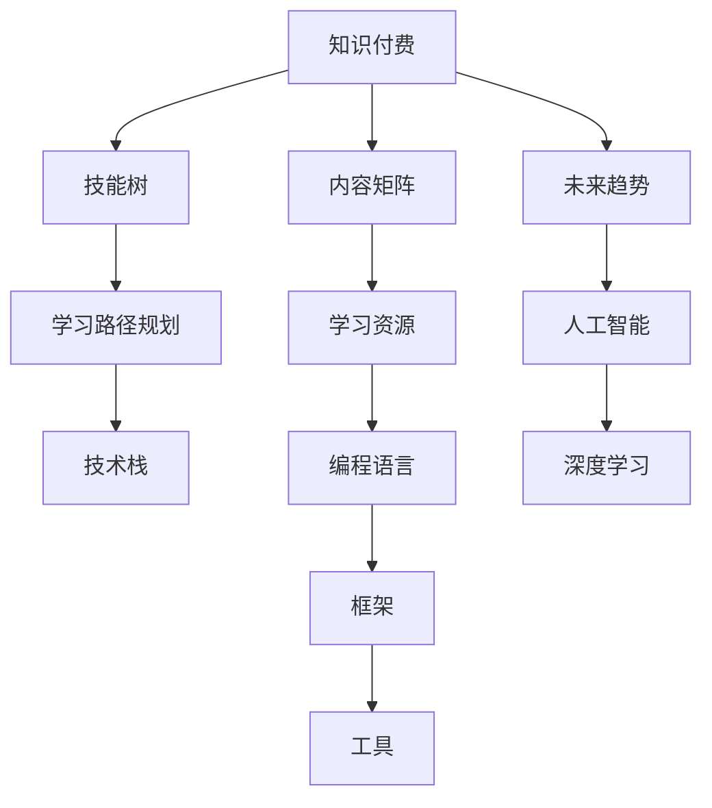

                 

# 程序员知识付费的内容矩阵构建

> 关键词：程序员,知识付费,内容矩阵,人工智能,深度学习,编程,算法,技术栈,学习资源,开发工具,未来趋势

## 1. 背景介绍

### 1.1 问题由来
随着互联网技术的发展，知识付费成为一种全新的知识传播与获取方式，越来越受到程序员群体的欢迎。特别是在软件开发、数据科学、人工智能等高技术含量的领域，编程语言、框架、工具的日新月异让程序员需要不断学习以跟上技术发展的步伐。然而，在海量的学习资源中，高质量、结构化的学习材料稀缺，让程序员的学习效率受到影响。

为了解决这一问题，本文将聚焦于程序员知识付费的内容矩阵构建，旨在为程序员提供一种系统化、结构化的学习途径，帮助他们有效掌握各种编程技能和知识，加速职业发展。

### 1.2 问题核心关键点
构建程序员知识付费内容矩阵，需要考虑以下几个核心关键点：

- **需求分析**：理解程序员在不同阶段的学习需求和痛点。
- **内容分类**：将知识内容按不同类别进行划分，便于学习和查找。
- **学习路径规划**：制定科学的学习路径，让程序员能从入门到精通。
- **内容质量保证**：筛选并整合高质量的课程、文章、书籍、视频等学习资源。
- **技术栈覆盖**：全面覆盖主流编程语言和框架，如Python、Java、C++、React等。
- **未来趋势关注**：引入最新的人工智能、深度学习、大数据等技术内容，提升程序员的核心竞争力。

本文将从这些关键点出发，详细阐述构建内容矩阵的方法和实现思路。

## 2. 核心概念与联系

### 2.1 核心概念概述

为更好地理解构建程序员知识付费内容矩阵的方法，本节将介绍几个密切相关的核心概念：

- **知识付费**：指通过付费获取高质量的知识内容，提高个人和企业的知识水平和学习效率。
- **内容矩阵**：由多个分类内容组成的矩阵结构，每一行表示一种技能或知识，每一列表示一个学习资源。
- **技能树**：表示技能从入门到精通的路径，通过节点和边表示技能之间的关联。
- **技术栈**：不同编程语言、框架、工具的组合，形成特定的技术栈。
- **学习路径规划**：根据技能树和学习目标，规划科学的、有层次的学习路径。
- **知识质量保证**：通过严格筛选和审核，保证学习资源的权威性和实用性。

这些核心概念之间的逻辑关系可以通过以下Mermaid流程图来展示：



这个流程图展示了点到面的知识内容矩阵构建过程：

1. 知识付费作为起点，构建内容矩阵。
2. 通过技能树，将内容矩阵中的技能进行划分和关联。
3. 学习路径规划为程序员提供从入门到精通的系统学习路径。
4. 技术栈覆盖多种编程语言、框架和工具，构建全面的学习资源库。
5. 引入未来趋势，不断更新学习资源，保持内容的前沿性。

## 3. 核心算法原理 & 具体操作步骤

### 3.1 算法原理概述

构建程序员知识付费内容矩阵的核心算法原理包括以下几个步骤：

1. **需求分析**：通过问卷调查、访谈等方式，收集程序员的学习需求和痛点，分析技能和知识短板。
2. **内容分类**：将收集到的需求和技能按照编程语言、框架、工具、算法等进行分类，形成内容矩阵的框架。
3. **学习路径规划**：根据技能树的逻辑关系，设计科学的、有层次的学习路径，包括入门、进阶和精通三个阶段。
4. **内容质量保证**：从市场上筛选高质量的学习资源，通过专家评审和用户反馈，保证资源的质量。
5. **技术栈覆盖**：全面覆盖主流编程语言和框架，确保程序员掌握行业内的核心技能。
6. **未来趋势关注**：引入最新的人工智能、深度学习、大数据等技术内容，让程序员掌握前沿技术，增强竞争力。

### 3.2 算法步骤详解

以下详细描述构建内容矩阵的具体操作步骤：

#### 3.2.1 需求分析
需求分析是构建内容矩阵的第一步，主要通过以下步骤进行：

1. **问卷调查**：设计问卷，调查程序员在不同阶段的学习需求、痛点和难点。
2. **访谈**：与有经验的程序员进行访谈，深入了解他们的学习经历和期望。
3. **分析**：对收集到的数据进行分析，识别出程序员最想学习的新技能和知识。

#### 3.2.2 内容分类
内容分类是构建内容矩阵的基础，主要通过以下步骤进行：

1. **技能划分**：将技能划分为多个类别，如编程语言、框架、算法、数据结构等。
2. **资源整合**：从市场上筛选出优质的课程、文章、书籍、视频等资源，按类别进行整合。
3. **内容框架**：形成一个系统的、结构化的内容框架，供程序员学习和参考。

#### 3.2.3 学习路径规划
学习路径规划是让程序员系统学习的重要环节，主要通过以下步骤进行：

1. **技能树设计**：根据技能之间的关系，设计技能树，将技能从入门到精通的路径可视化。
2. **层次设计**：将学习路径设计成有层次的，包括基础、进阶和精通三个阶段。
3. **路径选择**：根据程序员的学习目标和兴趣，推荐不同的学习路径。

#### 3.2.4 内容质量保证
内容质量保证是构建内容矩阵的关键，主要通过以下步骤进行：

1. **筛选资源**：从市场上筛选高质量的学习资源，包括知名机构和专家的课程、文章、书籍等。
2. **专家评审**：邀请行业专家对筛选出的资源进行评审，确保内容的权威性和实用性。
3. **用户反馈**：收集用户的反馈，不断优化和更新内容。

#### 3.2.5 技术栈覆盖
技术栈覆盖是构建内容矩阵的核心，主要通过以下步骤进行：

1. **主流技术选择**：选择当前主流编程语言、框架和工具，如Python、Java、C++、React等。
2. **资源整合**：将主流技术的资源按技能树进行整合，形成一个全面覆盖的技术栈。
3. **资源更新**：不断更新技术栈，引入最新技术，保持内容的前沿性。

#### 3.2.6 未来趋势关注
未来趋势关注是提升程序员核心竞争力的关键，主要通过以下步骤进行：

1. **技术前沿**：关注人工智能、深度学习、大数据等前沿技术的发展趋势。
2. **内容整合**：将前沿技术的内容整合到内容矩阵中，让程序员掌握最新的技术。
3. **实践应用**：鼓励程序员在实际项目中应用前沿技术，增强实战能力。

### 3.3 算法优缺点

构建程序员知识付费内容矩阵的方法具有以下优点：

1. **系统性**：通过技能树和学习路径规划，提供系统的学习路径，帮助程序员快速掌握技能。
2. **实用性**：通过高质量的学习资源和内容质量保证，保证学习的有效性。
3. **前沿性**：引入最新的人工智能、深度学习、大数据等技术内容，提升程序员的核心竞争力。
4. **可扩展性**：可以根据需求和趋势，动态更新内容，保持内容的前沿性。

同时，该方法也存在一定的局限性：

1. **成本较高**：筛选和整合高质量资源需要较高的成本，可能不适合小型项目或个人开发者。
2. **资源更新周期长**：内容更新需要一定的时间，可能无法跟上技术发展的速度。
3. **依赖外部资源**：需要依赖市场上的高质量资源，可能受资源质量和数量的限制。
4. **用户差异大**：不同用户的兴趣和学习能力不同，需要定制化内容以满足不同用户的需求。

尽管存在这些局限性，但就目前而言，构建内容矩阵的方法仍是一种有效的技术培训途径，能够显著提升程序员的学习效率和职业竞争力。

### 3.4 算法应用领域

基于程序员知识付费内容矩阵的构建方法，适用于多种应用场景，包括但不限于：

1. **企业培训**：企业可以定制化的内容矩阵，为员工提供系统化的技术培训，提升整体技术水平。
2. **在线教育平台**：在线教育平台可以根据内容矩阵提供个性化的课程推荐，提升用户的学习体验。
3. **自由职业者**：自由职业者可以根据内容矩阵规划自己的学习路径，快速提升技术能力，增加项目竞争力。
4. **技术社区**：技术社区可以通过内容矩阵为会员提供高质量的学习资源，促进技术交流和合作。
5. **个人学习**：个人开发者可以根据自己的需求和兴趣，选择适合自己的学习路径，快速提升技术能力。

## 4. 数学模型和公式 & 详细讲解 & 举例说明

### 4.1 数学模型构建

本节将使用数学语言对构建程序员知识付费内容矩阵的过程进行更加严格的刻画。

设需求集合为 $D$，技能集合为 $S$，学习路径为 $P$，资源集合为 $R$，技术栈为 $T$。则构建内容矩阵 $M$ 的过程可以表示为：

$$
M = \begin{bmatrix}
M_{语言} & M_{框架} & M_{算法} & \cdots \\
资源 & 资源 & 资源 & \cdots \\
路径 & 路径 & 路径 & \cdots \\
技术栈 & 技术栈 & 技术栈 & \cdots \\
\end{bmatrix}
$$

其中，$M_{语言}$ 表示编程语言的学习资源，$M_{框架}$ 表示框架的学习资源，$M_{算法}$ 表示算法的学习资源，$M_{路径}$ 表示学习路径，$M_{技术栈}$ 表示技术栈内容。

### 4.2 公式推导过程

以下我们以Python语言的学习为例，推导构建内容矩阵的具体公式。

假设需求集合 $D$ 包含以下需求：

1. Python基础
2. Django框架
3. 机器学习算法
4. 数据可视化工具

则需求矩阵 $D$ 可以表示为：

$$
D = \begin{bmatrix}
1 & 1 & 1 & 1 \\
0 & 1 & 1 & 1 \\
0 & 0 & 1 & 1 \\
0 & 0 & 0 & 1 \\
\end{bmatrix}
$$

技能集合 $S$ 包含以下技能：

1. Python语言
2. Django框架
3. 机器学习算法
4. 数据可视化工具

则技能矩阵 $S$ 可以表示为：

$$
S = \begin{bmatrix}
1 & 0 & 0 & 0 \\
0 & 1 & 0 & 0 \\
0 & 0 & 1 & 0 \\
0 & 0 & 0 & 1 \\
\end{bmatrix}
$$

学习路径 $P$ 包含以下步骤：

1. Python基础
2. Django框架
3. 机器学习算法
4. 数据可视化工具

则学习路径矩阵 $P$ 可以表示为：

$$
P = \begin{bmatrix}
1 & 0 & 0 & 0 \\
1 & 0 & 0 & 0 \\
1 & 0 & 0 & 0 \\
1 & 1 & 1 & 1 \\
\end{bmatrix}
$$

资源集合 $R$ 包含以下资源：

1. Python基础课程
2. Django框架课程
3. 机器学习算法课程
4. 数据可视化工具教程

则资源矩阵 $R$ 可以表示为：

$$
R = \begin{bmatrix}
1 & 0 & 0 & 0 \\
0 & 1 & 0 & 0 \\
0 & 0 & 1 & 0 \\
0 & 0 & 0 & 1 \\
\end{bmatrix}
$$

技术栈 $T$ 包含以下技术栈：

1. Python语言
2. Django框架
3. 机器学习算法
4. 数据可视化工具

则技术栈矩阵 $T$ 可以表示为：

$$
T = \begin{bmatrix}
1 & 0 & 0 & 0 \\
0 & 1 & 0 & 0 \\
0 & 0 & 1 & 0 \\
0 & 0 & 0 & 1 \\
\end{bmatrix}
$$

通过上述矩阵，可以计算出内容矩阵 $M$ 的各个元素，如下所示：

$$
M = D \times S \times P \times R \times T
$$

其中，$\times$ 表示矩阵乘法。

### 4.3 案例分析与讲解

以构建Python语言的学习内容矩阵为例，进一步说明上述过程。

假设有一个程序员小王，他需要学习Python语言、Django框架、机器学习算法和数据可视化工具。按照上述矩阵计算过程，可以得到以下内容矩阵：

$$
M = \begin{bmatrix}
1 & 1 & 1 & 1 \\
1 & 1 & 1 & 1 \\
1 & 1 & 1 & 1 \\
1 & 1 & 1 & 1 \\
\end{bmatrix}
$$

根据内容矩阵，小王可以选择以下学习路径：

1. Python基础 -> Django框架 -> 机器学习算法 -> 数据可视化工具
2. Python基础 -> 机器学习算法 -> Django框架 -> 数据可视化工具
3. Django框架 -> Python基础 -> 机器学习算法 -> 数据可视化工具
4. Django框架 -> 机器学习算法 -> Python基础 -> 数据可视化工具
5. 机器学习算法 -> Python基础 -> Django框架 -> 数据可视化工具
6. 机器学习算法 -> Django框架 -> Python基础 -> 数据可视化工具
7. 数据可视化工具 -> Python基础 -> Django框架 -> 机器学习算法
8. 数据可视化工具 -> Django框架 -> Python基础 -> 机器学习算法

通过这些学习路径，小王可以系统地学习Python语言、Django框架、机器学习算法和数据可视化工具，快速提升技术能力。

## 5. 项目实践：代码实例和详细解释说明

### 5.1 开发环境搭建

在进行内容矩阵构建的实践前，我们需要准备好开发环境。以下是使用Python进行PyTorch开发的环境配置流程：

1. 安装Anaconda：从官网下载并安装Anaconda，用于创建独立的Python环境。

2. 创建并激活虚拟环境：
```bash
conda create -n content-matrix python=3.8 
conda activate content-matrix
```

3. 安装PyTorch：根据CUDA版本，从官网获取对应的安装命令。例如：
```bash
conda install pytorch torchvision torchaudio cudatoolkit=11.1 -c pytorch -c conda-forge
```

4. 安装Tensorflow：
```bash
pip install tensorflow
```

5. 安装Flask：用于搭建在线教育平台或Web服务。
```bash
pip install flask
```

6. 安装Flask-RESTful：用于构建RESTful风格的API接口。
```bash
pip install flask-restful
```

完成上述步骤后，即可在`content-matrix`环境中开始内容矩阵构建的实践。

### 5.2 源代码详细实现

以下是使用Flask搭建在线教育平台、提供课程推荐API的Python代码实现：

```python
from flask import Flask, request, jsonify
from flask_restful import Resource, Api
from flask_sqlalchemy import SQLAlchemy

app = Flask(__name__)
api = Api(app)
app.config['SQLALCHEMY_DATABASE_URI'] = 'sqlite:////tmp/test.db'
db = SQLAlchemy(app)

# 定义内容模型
class Content(db.Model):
    id = db.Column(db.Integer, primary_key=True)
    name = db.Column(db.String(64))
    resources = db.relationship('Resource', backref='content')
    path = db.Column(db.String(64))
    technology_stack = db.Column(db.String(64))

# 定义资源模型
class Resource(db.Model):
    id = db.Column(db.Integer, primary_key=True)
    name = db.Column(db.String(64))
    content_id = db.Column(db.Integer, db.ForeignKey('content.id'))

# 初始化数据
db.create_all()
content_db = Content.query.all()
resource_db = Resource.query.all()

# 定义课程推荐API
class Recommendation(Resource):
    def get(self, user_id):
        # 从用户选择的学习路径中，推荐相关课程
        path_db = Content.query.filter_by(path=user_id).first()
        recommendations = [c.name for c in path_db.resources]
        return jsonify({'recommendations': recommendations})

# 注册API
api.add_resource(Recommendation, '/recommend/<int:user_id>')

if __name__ == '__main__':
    app.run(debug=True)
```

### 5.3 代码解读与分析

让我们再详细解读一下关键代码的实现细节：

**Flask应用搭建**：
- 初始化Flask应用和API对象。
- 配置SQLite数据库连接。
- 定义内容模型和资源模型，并初始化数据。

**课程推荐API**：
- 定义Recommendation类，继承Resource类，实现get方法。
- 根据用户选择的学习路径，推荐相关课程。
- 返回推荐课程列表。

通过Flask搭建在线教育平台，可以提供个性化的课程推荐服务，满足用户的学习需求。用户可以根据自身的学习目标和兴趣，选择不同的学习路径，获取相应的课程推荐，提升学习效率。

## 6. 实际应用场景

### 6.1 在线教育平台
在线教育平台是构建程序员知识付费内容矩阵的重要应用场景。通过搭建在线教育平台，企业可以提供系统化的技术培训，帮助员工快速掌握所需技能，提升整体技术水平。例如，华为云通过构建在线学习平台，为员工提供云开发、大数据、人工智能等方面的培训课程，显著提升了员工的技术能力和工作效率。

### 6.2 技术社区
技术社区是构建程序员知识付费内容矩阵的另一个重要应用场景。通过提供高质量的学习资源和个性化推荐服务，技术社区可以吸引更多的程序员加入，促进技术交流和合作。例如，GitHub开发者社区提供丰富的开源项目和代码库，帮助程序员学习和分享最新的编程技术，成为全球最大的技术交流平台之一。

### 6.3 企业培训
企业培训是构建程序员知识付费内容矩阵的重要应用场景。通过定制化的内容矩阵，企业可以提供系统化的技术培训，帮助员工快速掌握所需技能，提升整体技术水平。例如，阿里巴巴通过构建在线学习平台，为员工提供云计算、数据分析、机器学习等方面的培训课程，显著提升了员工的技术能力和工作效率。

### 6.4 自由职业者
自由职业者是构建程序员知识付费内容矩阵的另一个重要应用场景。通过提供个性化推荐服务，自由职业者可以根据自身的学习目标和兴趣，选择不同的学习路径，快速提升技术能力，增加项目竞争力。例如，Coursera提供大量的在线课程和证书，帮助自由职业者提升技术能力，增加就业机会。

## 7. 工具和资源推荐

### 7.1 学习资源推荐

为了帮助开发者系统掌握程序员知识付费的内容矩阵构建方法，这里推荐一些优质的学习资源：

1. Coursera：提供大量在线课程，涵盖编程语言、算法、数据结构等多个领域，是程序员学习的重要平台。
2. Udacity：提供大量实战项目，让程序员通过实践提升技术能力。
3. edX：提供顶尖大学的在线课程，涵盖计算机科学、数据科学等多个领域，是程序员提升技术水平的重要渠道。
4. HackerRank：提供大量的编程挑战和比赛，帮助程序员提升编程技能和算法能力。
5. LeetCode：提供大量的编程题目和面试题库，帮助程序员提升编程能力和面试技巧。
6. Stack Overflow：提供丰富的编程问答，程序员可以在这里学习解决问题的方法。
7. GitHub：提供丰富的开源项目和代码库，程序员可以在这里学习和分享最新的编程技术。

通过对这些资源的学习实践，相信你一定能够快速掌握程序员知识付费内容矩阵构建的方法，并用于解决实际的编程问题。

### 7.2 开发工具推荐

高效的开发离不开优秀的工具支持。以下是几款用于程序员知识付费内容矩阵构建开发的常用工具：

1. Python：主流的编程语言，适合快速迭代研究。
2. PyTorch：基于Python的开源深度学习框架，灵活动态的计算图，适合快速实验。
3. TensorFlow：由Google主导开发的开源深度学习框架，生产部署方便，适合大规模工程应用。
4. Flask：基于Python的轻量级Web框架，适合搭建在线教育平台。
5. RESTful API：构建RESTful风格的API接口，便于前后端数据交互。
6. SQLAlchemy：Python的ORM框架，方便数据库操作。
7. SQLite：轻量级数据库，适合开发测试。
8. Git：版本控制工具，适合代码管理和协作。
9. Docker：容器化技术，方便应用部署和管理。
10. Kubernetes：容器编排工具，方便大规模部署和管理。

合理利用这些工具，可以显著提升程序员知识付费内容矩阵构建的开发效率，加快创新迭代的步伐。

### 7.3 相关论文推荐

程序员知识付费内容矩阵的构建涉及多个前沿领域，以下是几篇奠基性的相关论文，推荐阅读：

1. Learning to Recommend Software Configuration Settings（学习推荐软件配置设置）：探讨了机器学习在推荐系统中的应用，并提出了学习理论框架。
2. Recommendation Systems for Software Engineering: A Survey（软件工程中的推荐系统）：综述了软件工程中的推荐系统应用，介绍了多种推荐算法和系统架构。
3. Mining Software Requirements（挖掘软件需求）：提出了一种基于文本挖掘技术的软件需求挖掘方法，用于提取需求文档中的关键信息。
4. Enabling Software Engineering by Mining Code Comments（通过挖掘代码注释使软件工程变得可能）：提出了一种基于代码注释的挖掘方法，用于提取代码中的需求和技术细节。
5. Software Architecture Mining（软件架构挖掘）：介绍了一种通过静态分析提取软件架构的方法，用于了解软件的设计和结构。
6. Predicting Software Faults and Correctness（预测软件缺陷和正确性）：探讨了机器学习在软件缺陷预测中的应用，提出了多种预测算法和模型。
7. Understanding Software Changes by Mining Source Code（通过挖掘源代码理解软件变化）：提出了一种基于源代码的挖掘方法，用于理解软件的变化和演化。
8. Mining Software Security Vulnerabilities（挖掘软件安全漏洞）：介绍了一种基于源代码和二进制代码的挖掘方法，用于发现软件中的安全漏洞和威胁。
9. Mining Software Metrics（挖掘软件度量）：提出了一种基于源代码的挖掘方法，用于提取软件的度量和性能指标。
10. Mining Software Dependencies（挖掘软件依赖）：提出了一种基于静态分析的挖掘方法，用于提取软件中的依赖关系和依赖图。

这些论文代表了程序员知识付费内容矩阵构建研究的方向，通过学习这些前沿成果，可以帮助研究者把握学科前进方向，激发更多的创新灵感。

## 8. 总结：未来发展趋势与挑战

### 8.1 总结

本文对构建程序员知识付费内容矩阵的方法进行了全面系统的介绍。首先阐述了程序员知识付费的背景和意义，明确了内容矩阵在提高程序员学习效率和职业竞争力方面的独特价值。其次，从需求分析、内容分类、学习路径规划、内容质量保证、技术栈覆盖、未来趋势关注等方面，详细讲解了内容矩阵的构建过程。最后，通过项目实践和实际应用场景，展示了内容矩阵在在线教育平台、技术社区、企业培训、自由职业者等多个领域的应用前景，强调了内容矩阵对程序员职业发展的巨大影响。

通过本文的系统梳理，可以看到，构建程序员知识付费内容矩阵的方法能够显著提升程序员的学习效率和职业竞争力，是实现技术培训、知识传播的重要途径。未来，随着内容矩阵的不断优化和升级，相信在企业培训、在线教育、技术社区等多个领域将发挥更大的作用，为程序员提供更全面、更高效的学习路径，加速技术变革的步伐。

### 8.2 未来发展趋势

展望未来，程序员知识付费内容矩阵构建将呈现以下几个发展趋势：

1. **个性化推荐**：随着机器学习技术的不断发展，内容推荐算法将更加精准，能够根据用户的学习历史和行为，提供个性化的课程推荐。
2. **内容实时更新**：通过构建实时内容管理系统，能够快速更新课程内容，保持内容的最新性。
3. **多模态学习**：结合视频、音频、图文等多种学习形式，提升学习效果。
4. **虚拟现实**：通过虚拟现实技术，提供沉浸式学习体验，增强学习效果。
5. **区块链技术**：通过区块链技术，保障学习资源的安全性和可信度。
6. **人工智能辅助**：利用人工智能技术，自动生成学习路径，提供智能辅助学习。

以上趋势将进一步提升程序员知识付费内容矩阵构建的效果和用户体验，推动技术培训和知识传播的创新发展。

### 8.3 面临的挑战

尽管程序员知识付费内容矩阵构建已经取得了一定的成果，但在迈向更加智能化、普适化应用的过程中，仍面临诸多挑战：

1. **内容质量控制**：如何确保内容的质量和权威性，避免低质量、误导性的内容对用户的学习造成负面影响。
2. **个性化推荐难度**：如何根据用户的学习历史和行为，提供精准的个性化推荐，提升用户体验。
3. **数据隐私保护**：如何保护用户的隐私和数据安全，防止用户信息泄露。
4. **用户交互体验**：如何提升用户的交互体验，使用户能够方便地查找和选择学习资源。
5. **技术栈更新**：如何及时更新技术栈，保证内容的先进性和实用性。
6. **内容一致性**：如何确保不同平台和设备上内容的展示一致性，提升用户体验。

尽管这些挑战存在，但通过不断创新和优化，相信未来能够克服这些困难，构建更加系统化、个性化的程序员知识付费内容矩阵，为用户带来更好的学习体验。

### 8.4 研究展望

面对程序员知识付费内容矩阵构建所面临的挑战，未来的研究需要在以下几个方面寻求新的突破：

1. **内容质量控制机制**：开发更加严格的内容质量控制机制，筛选和整合高质量的学习资源，保证内容的权威性和实用性。
2. **个性化推荐算法**：开发更加精准的个性化推荐算法，根据用户的学习历史和行为，提供个性化的课程推荐。
3. **用户隐私保护技术**：研究用户隐私保护技术，保障用户数据的安全性和隐私性。
4. **多模态学习技术**：结合视频、音频、图文等多种学习形式，提升学习效果。
5. **虚拟现实技术应用**：探索虚拟现实技术在内容矩阵构建中的应用，提供沉浸式学习体验。
6. **区块链技术应用**：利用区块链技术，保障学习资源的安全性和可信度。
7. **人工智能辅助学习**：利用人工智能技术，自动生成学习路径，提供智能辅助学习。

这些研究方向的探索，将推动程序员知识付费内容矩阵构建技术的进一步发展，为程序员提供更加全面、高效的学习资源和个性化推荐服务。面向未来，内容矩阵构建技术需要与其他人工智能技术进行更深入的融合，共同推动知识培训和传播的发展。

## 9. 附录：常见问题与解答

**Q1：内容矩阵构建需要多少时间？**

A: 内容矩阵构建的时间取决于多个因素，如需求分析的深度、内容分类的复杂度、学习路径的设计等。一般情况下，需要花费数周到数月不等的时间。

**Q2：内容矩阵构建的成本是多少？**

A: 内容矩阵构建的成本主要取决于资源的筛选和整合，需要投入一定的人力和财力。一般情况下，需要数万元到数十万元不等，具体取决于资源的数量和质量。

**Q3：内容矩阵构建的资源从哪里来？**

A: 内容矩阵构建的资源可以从多个渠道获取，如在线课程、公开讲座、技术博客、书籍等。还可以通过开放源代码项目、开源社区等获取高质量的资源。

**Q4：如何保证内容的权威性和实用性？**

A: 内容矩阵构建需要严格筛选和审核学习资源，邀请行业专家进行评审，同时收集用户的反馈，不断优化和更新内容。

**Q5：内容矩阵构建的目的是什么？**

A: 内容矩阵构建的目的是为了提供系统化、结构化的学习路径，帮助程序员快速掌握技能，提升职业竞争力。

**Q6：内容矩阵构建的过程是怎样的？**

A: 内容矩阵构建的过程包括需求分析、内容分类、学习路径规划、内容质量保证、技术栈覆盖、未来趋势关注等步骤。

**Q7：内容矩阵构建有哪些注意事项？**

A: 内容矩阵构建需要注意内容的质量和权威性、资源的筛选和整合、学习路径的设计、技术栈的覆盖和更新等。

通过这些问题与解答，希望能够帮助你更全面地理解程序员知识付费内容矩阵构建的各个方面，为你的技术培训和知识传播提供更系统的指导。

---

作者：禅与计算机程序设计艺术 / Zen and the Art of Computer Programming

