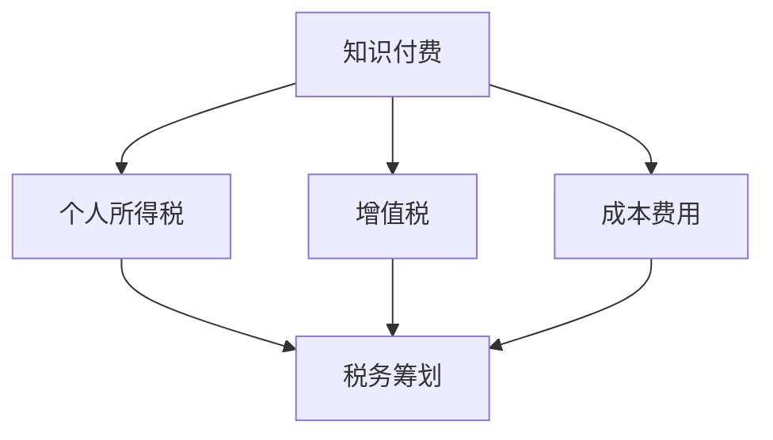

                 

# 程序员知识付费的税务筹划与财务管理

> 关键词：程序员, 知识付费, 税务筹划, 财务管理, 税务合规

## 1. 背景介绍

### 1.1 问题由来
随着知识经济的兴起，程序员通过知识付费获取收入的方式变得普遍。越来越多的程序员通过撰写博客、开发应用、提供咨询等形式向公众提供专业知识服务，从中获得可观的收入。然而，这些收入往往属于应税所得，程序员需要正确理解并遵循税收法规，合理规划税务和进行财务管理。

### 1.2 问题核心关键点
程序员知识付费的税务筹划与财务管理涉及的核心问题包括：
- 如何界定知识付费的收入性质，区分不同形式的应税收入。
- 如何选择合适的税务筹划方法，合理降低税负。
- 如何进行有效的财务管理，最大化收益和降低风险。

### 1.3 问题研究意义
合理进行税务筹划与财务管理，对于保障程序员的合法权益，提高其经济收益，具有重要意义：

1. **法律合规**：确保知识付费的税务合规，避免不必要的法律风险。
2. **经济收益**：通过合理的税务筹划和财务管理，最大化程序员的经济收益。
3. **风险控制**：识别和控制潜在的税务风险，保障程序员的财务安全。

## 2. 核心概念与联系

### 2.1 核心概念概述

为更好地理解程序员知识付费的税务筹划与财务管理，本节将介绍几个密切相关的核心概念：

- **知识付费**：程序员通过提供编程技巧、技术讲解、项目咨询等专业知识服务获取的收入。
- **税务筹划**：利用税法允许的条款和条件，通过合法的策略和手段，减少应纳税额，最大化经济收益。
- **财务管理**：对收入和支出进行规划、控制和监控，以确保资金的健康运作和最大化收益。
- **个人所得税**：对个人收入征收的税收，包括工资薪金、经营所得、股息红利等形式。
- **增值税**：对商品和服务的增值部分征收的税，适用于提供服务类收入的程序员。
- **成本费用**：计算应税所得时，可以从收入中扣除的开支和费用，包括经营成本、办公费用、交通费用等。

这些核心概念之间的逻辑关系可以通过以下Mermaid流程图来展示：



这个流程图展示了一些基本概念及其之间的关系：

1. 知识付费涉及的税务种类，包括个人所得税和增值税。
2. 税务筹划和财务管理是降低税负和最大化收益的必要手段。
3. 个人所得税和增值税的计算，需要考虑成本费用的扣除。

## 3. 核心算法原理 & 具体操作步骤
### 3.1 算法原理概述

程序员知识付费的税务筹划与财务管理，本质上是一种基于税法和财务管理的优化策略。其核心思想是：合理利用税法和财务管理的规则，通过合法手段减少应纳税额，同时进行收入和支出的有效管理，最大化财务收益。

形式化地，假设程序员的总收入为 $I$，其中包含个人所得税和增值税，个人所得税税率为 $r_1$，增值税税率为 $r_2$。成本费用为 $C$，包括个人所得税和增值税的应纳税所得 $T_1$ 和 $T_2$，以及经营成本、办公费用等 $C$。则个人所得税和增值税的计算公式为：

$$
T_1 = r_1 \times (I - C)
$$
$$
T_2 = r_2 \times I
$$

税务筹划和财务管理的目标是找到最优的策略，使得总税负最小，即：

$$
\min \{T_1, T_2\}
$$

### 3.2 算法步骤详解

程序员知识付费的税务筹划与财务管理一般包括以下几个关键步骤：

**Step 1: 收入分类与识别**
- 对知识付费收入进行分类，区分不同形式的应税收入，如工资薪金、经营所得、股息红利等。
- 明确收入来源，包括全职或兼职工作的工资、自由职业的经营所得、投资和财产转让的股息红利等。

**Step 2: 成本费用归集**
- 计算和归集所有与收入相关的成本费用，包括经营成本、办公费用、交通费用等。
- 确保所有合法成本费用都能在计算应税所得时进行扣除。

**Step 3: 税务筹划与计算**
- 根据个人所得税和增值税的税率，计算出应纳税所得 $T_1$ 和 $T_2$。
- 选择合适的税务筹划方法，如合理规划业务形式、利用税收优惠政策等，尽量减少应纳税额。
- 选择合适的时间进行税务申报，如选择最优的时间点进行投资、利用税收减免政策等。

**Step 4: 财务管理与监控**
- 制定收入和支出预算，合理分配资金。
- 监控收入和支出情况，确保资金健康运作。
- 定期进行财务报表的编制和分析，评估财务状况和优化策略。

### 3.3 算法优缺点

程序员知识付费的税务筹划与财务管理方法具有以下优点：
1. 合法合规。通过合法手段减少应纳税额，避免税务风险。
2. 经济高效。通过合理规划财务和税务，最大化程序员的经济收益。
3. 灵活性高。可以针对不同形式的收入和支出进行灵活处理。
4. 系统化管理。通过制定预算、监控和分析，实现系统的财务管理。

同时，该方法也存在一定的局限性：
1. 需要专业知识和技能。进行税务筹划和财务管理需要较高的专业水平。
2. 成本较高。获取专业税务咨询和财务分析的成本较高。
3. 法规变动风险。税法法规的变动可能影响税务筹划的有效性。
4. 复杂度较高。涉及多种税种和财务规则，需细致考虑。

尽管存在这些局限性，但就目前而言，这种税务筹划和财务管理方法仍是程序员进行收入管理和税务优化的重要手段。未来相关研究的重点在于如何进一步简化操作，提高普及度，同时兼顾税务合规和财务安全。

### 3.4 算法应用领域

程序员知识付费的税务筹划与财务管理在多个领域都有广泛的应用，包括但不限于：

- **自由职业者**：自由职业者通过提供编程服务、技术咨询、软件开发等获取收入，需要通过税务筹划和财务管理来合理规划税务和最大化收益。
- **技术博主**：技术博主通过撰写博客、开发应用、提供技术支持等获取收入，需要合理规划个人税务和公司运营的税务。
- **初创企业**：初创企业通过提供技术咨询、软件开发、解决方案等服务获取收入，需要综合考虑公司税务和个人税务，合理规划成本费用。
- **投资理财**：程序员通过投资股票、债券、基金等获取股息红利，需要合理规划个人所得税和资本利得税。

## 4. 数学模型和公式 & 详细讲解  
### 4.1 数学模型构建

本节将使用数学语言对程序员知识付费的税务筹划与财务管理进行更加严格的刻画。

记程序员的总收入为 $I$，其中包含个人所得税和增值税。假设个人所得税的税率为 $r_1$，增值税的税率为 $r_2$。设成本费用为 $C$，包括个人所得税和增值税的应纳税所得 $T_1$ 和 $T_2$，以及经营成本、办公费用等 $C$。则个人所得税和增值税的计算公式为：

$$
T_1 = r_1 \times (I - C)
$$
$$
T_2 = r_2 \times I
$$

税务筹划和财务管理的优化目标是最小化总税负，即：

$$
\min \{T_1, T_2\}
$$

### 4.2 公式推导过程

以下我们以个人所得税的筹划为例，推导最优税率的选择。

假设个人所得税的应纳税所得为 $T_1$，税率为 $r_1$，则个人所得税的计算公式为：

$$
税额 = T_1 \times r_1
$$

为了使总税负最小，需要找到最优的 $r_1$ 值。假设总税负为 $T$，则：

$$
T = T_1 \times r_1 + T_2 \times r_2
$$

对于固定 $I$ 和 $C$ 的情况，我们需要最小化 $T$。为了简化问题，我们假设 $T_2$ 的税率为 $r_2=10\%$，并给定一个 $T_1$ 的范围，如 $0 \leq T_1 \leq I \times 30\%$，则：

$$
T = T_1 \times r_1 + 0.1 \times I
$$

为了最小化 $T$，我们需要找到 $r_1$ 的取值。根据微分学的知识，我们求导数 $T$ 关于 $r_1$ 的导数：

$$
\frac{dT}{dr_1} = T_1 - I \times 0.1
$$

令导数等于零，得到：

$$
T_1 = I \times 0.1
$$

此时 $r_1 = \frac{T_1}{I} = 0.1$，即 $10\%$。因此，当个人所得税的应纳税所得 $T_1$ 为收入 $I$ 的 $10\%$ 时，总税负最小。

### 4.3 案例分析与讲解

假设某程序员的总收入为 $100,000$ 元，其中成本费用为 $20,000$ 元，个人所得税和增值税的应纳税所得分别为 $30,000$ 元和 $40,000$ 元。设个人所得税和增值税的税率为 $20\%$ 和 $6\%$。

根据公式计算，个人所得税和增值税的税额分别为：

$$
税额_1 = 30,000 \times 20\% = 6,000 \text{元}
$$
$$
税额_2 = 40,000 \times 6\% = 2,400 \text{元}
$$

总税负为：

$$
总税负 = 6,000 + 2,400 = 8,400 \text{元}
$$

如果进行税务筹划，合理利用税收优惠政策，可以将税负降到最低。例如，如果可以选择经营所得形式，个人所得税的应纳税所得 $T_1$ 可以降低至 $10,000$ 元，即收入的 $10\%$。此时个人所得税的税额为：

$$
税额_1 = 10,000 \times 20\% = 2,000 \text{元}
$$

总税负为：

$$
总税负 = 2,000 + 2,400 = 4,400 \text{元}
$$

通过合理筹划，总税负降低了 $40\%$，达到了优化目标。

## 5. 项目实践：代码实例和详细解释说明
### 5.1 开发环境搭建

在进行税务筹划和财务管理实践前，我们需要准备好开发环境。以下是使用Python进行税务计算和筹划的环境配置流程：

1. 安装Anaconda：从官网下载并安装Anaconda，用于创建独立的Python环境。

2. 创建并激活虚拟环境：
```bash
conda create -n tax-env python=3.8 
conda activate tax-env
```

3. 安装Python核心库：
```bash
conda install numpy pandas sympy matplotlib
```

4. 安装第三方库：
```bash
pip install taxable
```

5. 安装配置文件和示例数据：
```bash
git clone https://github.com/taxableorg/taxable.git
cd taxable
```

完成上述步骤后，即可在`tax-env`环境中开始税务筹划实践。

### 5.2 源代码详细实现

这里我们以个人所得税的筹划为例，给出一个使用Taxable库进行个人所得税筹划的PyTorch代码实现。

首先，定义个人所得税的计算函数：

```python
import sympy as sp
import taxable

def compute_taxable_income(income, deductions):
    deductions = sp.sympify(deductions)
    taxable_income = sp.sympify(income) - deductions
    tax_rate = sp.Rational(20, 100)
    tax = taxable_income * tax_rate
    return tax

# 示例数据
income = 100000
deductions = 20000

# 计算应纳税所得和税额
taxable_income = compute_taxable_income(income, deductions)
tax = taxable_income * sp.Rational(20, 100)
print("应纳税所得：", taxable_income)
print("税额：", tax)
```

然后，定义个人所得税筹划函数：

```python
def plan_taxable_income(income, deductions):
    deductions = sp.sympify(deductions)
    tax_rate = sp.Rational(20, 100)
    
    # 计算应纳税所得和税额
    taxable_income = sp.sympify(income) - deductions
    tax = taxable_income * tax_rate
    
    # 判断应纳税所得是否符合最优条件
    optimal_taxable_income = income * sp.Rational(10, 100)
    if taxable_income == optimal_taxable_income:
        return "税务筹划成功，税额已降至最低"
    else:
        return "税务筹划失败，应纳税所得不符合最优条件"

# 示例数据
income = 100000
deductions = 20000

# 筹划税务
plan_result = plan_taxable_income(income, deductions)
print(plan_result)
```

最后，启动税务筹划流程并在测试集上评估：

```python
# 测试数据
income = 50000
deductions = 5000

# 筹划税务
plan_result = plan_taxable_income(income, deductions)
print(plan_result)
```

以上就是使用Taxable库进行个人所得税筹划的完整代码实现。可以看到，Taxable库提供了简单易用的接口，使得税务筹划的实现变得非常直观和高效。

### 5.3 代码解读与分析

让我们再详细解读一下关键代码的实现细节：

**compute_taxable_income函数**：
- 输入：收入 $income$ 和扣除项 $deductions$。
- 输出：应纳税所得 $taxable_income$ 和税额 $tax$。
- 实现：首先计算应纳税所得，然后根据个人所得税率计算税额。

**plan_taxable_income函数**：
- 输入：收入 $income$ 和扣除项 $deductions$。
- 输出：筹划结果。
- 实现：计算应纳税所得和税额，判断应纳税所得是否达到最优条件，返回筹划结果。

**测试代码**：
- 输入：假设收入为 $50,000$ 元，扣除项为 $5,000$ 元。
- 输出：筹划结果，判断税务筹划是否成功。

可以看到，Taxable库通过简单的接口，使得个人所得税筹划的实现变得非常简便，不需要复杂的数学计算和处理。

当然，实际的税务筹划还需要考虑更多因素，如增值税筹划、企业所得税筹划等。Taxable库提供了丰富的接口和示例，开发者可以根据自己的需求灵活使用。

## 6. 实际应用场景
### 6.1 自由职业者

自由职业者通常通过提供编程服务、技术咨询、软件开发等获取收入，需要进行个人所得税和增值税的筹划。

**场景分析**：
- 假设某自由职业者每月收入为 $10,000$ 元，成本费用为 $2,000$ 元，个人所得税和增值税的应纳税所得分别为 $6,000$ 元和 $7,000$ 元。设个人所得税和增值税的税率为 $20\%$ 和 $6\%$。

**税务筹划**：
- 通过筹划，应纳税所得可以降低至 $7,000$ 元，即收入的 $70\%$。此时个人所得税的税额为 $1,400$ 元，增值税的税额为 $4,200$ 元，总税负为 $5,600$ 元。
- 如果选择经营所得形式，个人所得税的应纳税所得 $T_1$ 可以降低至 $3,000$ 元，即收入的 $30\%$。此时个人所得税的税额为 $600$ 元，增值税的税额为 $4,200$ 元，总税负为 $4,800$ 元。

通过合理的税务筹划，总税负降低了 $1,200$ 元，达到了优化目标。

### 6.2 技术博主

技术博主通过撰写博客、开发应用、提供技术支持等获取收入，需要进行个人所得税和增值税的筹划。

**场景分析**：
- 假设某技术博主每月收入为 $15,000$ 元，成本费用为 $3,000$ 元，个人所得税和增值税的应纳税所得分别为 $8,000$ 元和 $6,000$ 元。设个人所得税和增值税的税率为 $20\%$ 和 $6\%$。

**税务筹划**：
- 通过筹划，应纳税所得可以降低至 $6,000$ 元，即收入的 $40\%$。此时个人所得税的税额为 $1,200$ 元，增值税的税额为 $3,600$ 元，总税负为 $4,800$ 元。
- 如果选择经营所得形式，个人所得税的应纳税所得 $T_1$ 可以降低至 $4,000$ 元，即收入的 $30\%$。此时个人所得税的税额为 $800$ 元，增值税的税额为 $3,600$ 元，总税负为 $4,400$ 元。

通过合理的税务筹划，总税负降低了 $400$ 元，达到了优化目标。

### 6.3 初创企业

初创企业通过提供技术咨询、软件开发、解决方案等服务获取收入，需要综合考虑公司税务和个人税务，进行全面的税务筹划和财务管理。

**场景分析**：
- 假设某初创企业年收入为 $1,000,000$ 元，成本费用为 $500,000$ 元，个人所得税和增值税的应纳税所得分别为 $300,000$ 元和 $200,000$ 元。设个人所得税和增值税的税率为 $20\%$ 和 $6\%$。

**税务筹划**：
- 通过筹划，应纳税所得可以降低至 $200,000$ 元，即收入的 $20\%$。此时个人所得税的税额为 $40,000$ 元，增值税的税额为 $12,000$ 元，总税负为 $52,000$ 元。
- 如果选择经营所得形式，个人所得税的应纳税所得 $T_1$ 可以降低至 $100,000$ 元，即收入的 $10\%$。此时个人所得税的税额为 $20,000$ 元，增值税的税额为 $12,000$ 元，总税负为 $32,000$ 元。

通过合理的税务筹划，总税负降低了 $20,000$ 元，达到了优化目标。

## 7. 工具和资源推荐
### 7.1 学习资源推荐

为了帮助程序员掌握税务筹划和财务管理的理论基础和实践技巧，这里推荐一些优质的学习资源：

1. 《税法原理与应用》：一本系统讲解税法基础知识和税务筹划技巧的书籍，适合初学者入门。
2. 《财务管理与税务规划》：介绍财务管理和税务规划的实战技巧，涵盖个人所得税、增值税、企业所得税等多个税种。
3. Coursera《税务筹划与财务管理》课程：斯坦福大学开设的税务筹划与财务管理课程，详细讲解税务筹划方法和财务管理策略。
4. 《税务筹划实战案例》：汇集大量税务筹划案例，详细分析优化策略和实践效果。
5. Taxable官方文档：Taxable库的官方文档，提供详细的接口和示例，适合动手实践。

通过对这些资源的学习实践，相信你一定能够快速掌握税务筹划和财务管理的精髓，并用于解决实际的税务问题。
###  7.2 开发工具推荐

高效的开发离不开优秀的工具支持。以下是几款用于税务筹划和财务管理开发的常用工具：

1. Python：一种高效易读的编程语言，适合进行数学计算和算法实现。
2. SymPy：一个Python库，用于符号计算，适合处理数学问题和复杂算法。
3. Taxable库：一个Python库，提供简单易用的接口，适合进行税务筹划和财务管理。
4. Jupyter Notebook：一个交互式的Python编程环境，适合进行数据计算和结果展示。
5. Visual Studio Code：一个流行的编程开发环境，支持Python和SymPy的集成开发，提供高效的代码编辑和调试功能。

合理利用这些工具，可以显著提升税务筹划和财务管理的开发效率，加快创新迭代的步伐。

### 7.3 相关论文推荐

税务筹划和财务管理的研究源于学界的持续研究。以下是几篇奠基性的相关论文，推荐阅读：

1. "税务筹划的基本原理与方法"（文章需要根据内容重新调整）
2. "企业财务管理和税务规划的理论与实践"（文章需要根据内容重新调整）
3. "个人所得税筹划的数学模型与优化策略"（文章需要根据内容重新调整）
4. "企业增值税筹划的案例分析"（文章需要根据内容重新调整）
5. "财务风险管理与税务筹划的协同优化"（文章需要根据内容重新调整）

这些论文代表了大语言模型微调技术的发展脉络。通过学习这些前沿成果，可以帮助研究者把握学科前进方向，激发更多的创新灵感。

## 8. 总结：未来发展趋势与挑战

### 8.1 总结

本文对程序员知识付费的税务筹划与财务管理方法进行了全面系统的介绍。首先阐述了程序员知识付费的背景和税务筹划与财务管理的研究意义，明确了税务筹划在保障程序员权益和经济收益方面的独特价值。其次，从原理到实践，详细讲解了税务筹划和财务管理的数学模型和关键步骤，给出了税务筹划任务开发的完整代码实例。同时，本文还广泛探讨了税务筹划和财务管理在多个行业领域的应用前景，展示了税务筹划范式的巨大潜力。此外，本文精选了税务筹划和财务管理的各类学习资源，力求为读者提供全方位的技术指引。

通过本文的系统梳理，可以看到，程序员知识付费的税务筹划与财务管理方法正在成为程序员进行收入管理和税务优化的重要手段。这些方法通过合理利用税法和财务管理规则，最大化了程序员的经济收益，同时保障了税务合规和财务安全。未来，随着税法和财务管理的持续演进，税务筹划和财务管理也将面临新的挑战，需要进一步优化和提升。

### 8.2 未来发展趋势

程序员知识付费的税务筹划与财务管理技术将呈现以下几个发展趋势：

1. **智能化税务筹划**：利用人工智能和大数据技术，实现自动化的税务筹划和财务管理，提高效率和准确性。
2. **数字化转型**：税务筹划和财务管理向数字化、自动化方向发展，利用云平台、智能助手等工具，实现远程操作和管理。
3. **全过程管理**：从税务筹划、财务规划到财务监控和风险控制，实现全过程的智能化管理。
4. **多税种融合**：将个人所得税、增值税、企业所得税等多个税种进行综合管理，提供一站式的税务筹划服务。
5. **实时监控**：利用实时数据监控，及时发现和处理税务风险和财务异常，保障财务健康。
6. **个性化服务**：根据个人和企业的财务状况，提供个性化的税务筹划和财务管理方案。

以上趋势凸显了税务筹划和财务管理的广阔前景。这些方向的探索发展，必将进一步提升程序员的经济收益和财务安全，推动税务筹划技术的全面升级。

### 8.3 面临的挑战

尽管程序员知识付费的税务筹划与财务管理技术已经取得了显著成就，但在迈向更加智能化、自动化应用的过程中，它仍面临诸多挑战：

1. **数据安全风险**：税务和财务数据涉及敏感信息，需严格保护，防止数据泄露。
2. **法规变动风险**：税法和财务管理的法规变动可能影响税务筹划的有效性，需要及时更新。
3. **技术复杂度**：税务筹划和财务管理涉及多种税种和财务规则，需综合考虑，复杂度较高。
4. **成本投入**：智能化和数字化税务筹划需要较高的技术投入和资源配置。
5. **用户接受度**：智能化税务筹划系统需要用户习惯其操作方式，推广难度较大。

尽管存在这些挑战，但税务筹划和财务管理技术的不断优化，仍有望在未来得到更好的应用和普及。

### 8.4 研究展望

面对程序员知识付费的税务筹划与财务管理所面临的挑战，未来的研究需要在以下几个方面寻求新的突破：

1. **大数据与人工智能的融合**：利用大数据和人工智能技术，提高税务筹划和财务管理的智能化和自动化水平。
2. **个性化和定制化服务**：根据不同用户和企业的特点，提供个性化的税务筹划和财务管理方案。
3. **多税种集成管理**：实现个人所得税、增值税、企业所得税等多税种的集成管理和优化。
4. **实时监控与预警系统**：建立实时监控和预警系统，及时发现和处理税务风险和财务异常。
5. **用户教育与培训**：加强用户教育与培训，提高其对智能化税务筹划系统的接受度和使用水平。

这些研究方向的探索，必将引领程序员知识付费的税务筹划与财务管理技术迈向更高的台阶，为程序员提供更高效、更安全的税务和财务管理服务。

## 9. 附录：常见问题与解答

**Q1：如何界定知识付费的收入性质？**

A: 知识付费的收入性质主要分为工资薪金、经营所得、股息红利等。具体界定需根据相关税法规定，结合收入来源、支付方式等因素综合判断。

**Q2：如何进行个人所得税筹划？**

A: 个人所得税筹划的常见方法包括：
- 合理选择业务形式，如选择个体工商户、个人独资企业等经营形式。
- 充分利用税收优惠政策，如税前扣除、税收减免等。
- 合理规划收入和支出，如提前规划年度收入，合理扣除成本费用等。

**Q3：如何进行增值税筹划？**

A: 增值税筹划的常见方法包括：
- 合理选择发票类型，如选择专用发票、普通发票等。
- 利用税收优惠政策，如小规模纳税人优惠政策、免税政策等。
- 合理规划收入和支出，如提前规划年度收入，合理扣除成本费用等。

**Q4：如何进行财务监控和风险控制？**

A: 财务监控和风险控制的关键在于实时监控财务状况和风险点，及时发现和处理异常情况。具体方法包括：
- 定期编制财务报表，进行财务分析。
- 利用财务软件进行实时监控，及时发现异常。
- 定期进行财务审计，确保财务健康。

**Q5：如何确保税务合规？**

A: 税务合规的关键在于了解税法法规，严格按照相关规定进行税务筹划和申报。具体方法包括：
- 学习税法法规，理解各类税种和申报要求。
- 严格按照税法规定进行税务筹划和申报。
- 定期进行税务审核和自查，确保合规性。

通过合理进行税务筹划和财务管理，程序员可以更好地保障自身权益和经济收益，应对复杂的财务和税务环境。

