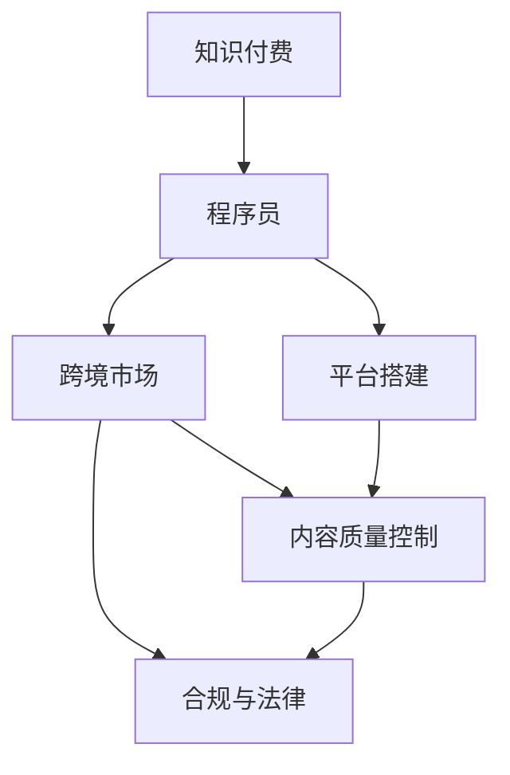

                 

# 程序员知识付费的跨境市场开拓策略

> 关键词：知识付费, 程序员, 跨境市场, 平台搭建, 技术架构, 用户运营

## 1. 背景介绍

### 1.1 问题由来

在数字化转型的浪潮下，知识付费已不再是新兴事物，而是被众多领域广泛应用的成熟模式。程序员作为数字化社会的基石，其知识经验的传播与共享日益受到关注。随着全球互联网的普及，跨境知识付费市场正孕育着巨大潜力。该市场不仅为程序员提供了更加广阔的展示平台，也为企业和用户开拓了新的合作机会。

### 1.2 问题核心关键点

程序员知识付费的跨境市场开拓涉及多个关键点：

- **技术平台建设**：如何搭建一个既符合程序员知识传播需求，又能支持跨境交易的技术平台。
- **用户体验优化**：如何设计平台界面，提供流畅、便捷的用户体验，提升用户黏性。
- **内容质量控制**：如何保证平台上内容的真实性、专业性，避免假冒伪劣内容的泛滥。
- **支付和结算系统**：如何建立可靠的跨境支付和结算系统，保障交易安全。
- **合规与法律**：如何在遵守不同国家和地区法律法规的基础上，保障跨境知识交易的合法合规。

### 1.3 问题研究意义

程序员知识付费的跨境市场开拓，不仅对提升程序员技能有重大意义，也对促进全球程序员之间的交流与合作、推动全球数字化进程具有重要价值：

1. **技能提升**：程序员通过订阅和学习跨境知识付费内容，可以接触到全球先进的编程技巧和工具，提升自身技术水平。
2. **交流合作**：跨境平台为程序员提供了更多的交流机会，有利于建立国际合作网络，共同推动技术创新。
3. **市场需求**：跨境知识付费市场为程序员提供了新的职业发展机会，满足企业和用户对优质技术人才的需求。
4. **经济贡献**：通过跨境知识付费，程序员能获得更多收入，同时为经济全球化贡献力量。

## 2. 核心概念与联系

### 2.1 核心概念概述

为更好地理解程序员知识付费的跨境市场开拓策略，本节将介绍几个核心概念：

- **知识付费**：指用户为获取特定知识或服务而支付的费用。知识付费平台通过提供有价值的内容吸引用户付费，同时保障内容的质量和真实性。
- **程序员**：具备软件开发、技术支持和系统运维等技能，为数字化产品和服务提供技术支持的专业人士。
- **跨境市场**：指跨越国界的市场，包括跨境电商、跨境支付、跨境物流等，为知识付费的全球化扩展提供了基础。
- **平台搭建**：指构建支持知识付费交易的技术平台，包括前端界面设计、后端架构搭建、支付和结算系统集成等。
- **内容质量控制**：指通过技术手段和管理措施，确保平台内容的专业性、准确性和可信度。
- **合规与法律**：指跨境知识交易过程中遵守各国的法律法规，保障交易的合法合规。

这些核心概念之间的逻辑关系可以通过以下Mermaid流程图来展示：



这个流程图展示的知识付费、程序员、跨境市场、平台搭建、内容质量控制和合规与法律等核心概念及其之间的关系：

1. 知识付费和程序员是跨境知识付费市场的基本组成要素。
2. 跨境市场为知识付费提供了全球化扩展的空间。
3. 平台搭建是跨境知识付费市场的基本基础设施。
4. 内容质量控制是保障平台健康发展的关键环节。
5. 合规与法律是跨境知识交易的基础保障。

## 3. 核心算法原理 & 具体操作步骤

### 3.1 算法原理概述

跨境知识付费市场开拓策略的算法原理主要基于以下几个方面：

1. **市场调研与需求分析**：通过调研不同国家和地区的市场需求，分析程序员技能培训、技术支持、项目协作等领域的知识付费需求。
2. **平台搭建与技术架构设计**：设计既能满足跨境需求，又能保障交易安全和技术可靠性的平台架构。
3. **用户体验优化**：通过界面设计、功能模块布局等手段，提升用户使用体验，增强用户黏性。
4. **内容质量控制**：建立严格的内容审核机制，确保内容真实可靠。
5. **支付和结算系统集成**：与主流支付和结算平台合作，建立安全的跨境支付和结算系统。
6. **合规与法律遵守**：确保跨境知识交易过程中符合相关法律法规，保障交易合规。

### 3.2 算法步骤详解

跨境知识付费市场开拓的算法步骤包括以下几个关键环节：

**Step 1: 市场调研与需求分析**
- 收集不同国家和地区的用户数据，了解需求多样性。
- 分析热门技能、技术趋势、应用场景等，确定知识付费内容方向。
- 根据市场需求制定定价策略，避免过高或过低定价。

**Step 2: 平台搭建与技术架构设计**
- 设计平台界面，包括用户注册、登录、课程选择、学习进度跟踪等页面。
- 搭建后端架构，包括课程管理、支付结算、用户认证、数据存储等功能模块。
- 集成支付和结算系统，支持主流支付方式，确保交易安全。
- 设计数据库和缓存策略，优化数据访问效率。

**Step 3: 用户体验优化**
- 设计简洁易用的界面，提高用户操作便捷性。
- 提供个性化推荐，根据用户兴趣推荐相关课程和学习材料。
- 优化加载速度和响应时间，提升用户体验。

**Step 4: 内容质量控制**
- 建立严格的课程审查机制，确保内容专业性和真实性。
- 引入专家评审和用户评价，综合评估课程质量。
- 引入技术手段，如反作弊、反盗版等措施，防止低质量内容进入平台。

**Step 5: 支付和结算系统集成**
- 与主流支付平台合作，支持跨境支付。
- 设计合理的费用结构，如订阅模式、按需支付等，满足不同用户需求。
- 保证支付和结算系统的稳定性和安全性，防范欺诈和风险。

**Step 6: 合规与法律遵守**
- 了解并遵守不同国家和地区的法律法规，确保跨境交易合法合规。
- 引入合规审查机制，如KYC（了解你的客户）等措施，避免违规操作。
- 与当地法律顾问合作，处理法律事务，保障交易合规性。

### 3.3 算法优缺点

程序员知识付费的跨境市场开拓策略具有以下优点：

1. **广泛的市场潜力**：全球程序员数量庞大，跨境知识付费市场具有巨大的增长空间。
2. **提升技能和收入**：程序员通过学习跨境知识，可以提升技能，增加收入来源。
3. **促进全球技术交流**：跨境知识付费平台为程序员提供了交流合作的桥梁，推动全球技术进步。

但该策略也存在一些缺点：

1. **文化差异**：不同国家和地区的文化背景和技术习惯不同，需要灵活调整策略。
2. **技术复杂性**：平台搭建和跨境支付系统集成涉及复杂的技术实现，需要大量资源投入。
3. **内容监管**：跨境内容的多样性需要更严格的内容质量控制和监管措施。
4. **法律合规**：不同国家和地区的法律法规存在差异，需要遵守多地法律，增加了运营难度。

### 3.4 算法应用领域

程序员知识付费的跨境市场开拓策略，适用于以下领域：

1. **软件开发**：提供最新编程语言、框架、工具的教学资源。
2. **技术支持**：提供常见问题的解决方案和高级技术支持。
3. **项目协作**：提供项目管理、团队协作、代码审查等技术指导。
4. **在线教育**：提供系统化课程，帮助程序员全面提升技能。
5. **知识分享**：提供专家讲座、技术讨论、开源项目等资源，促进知识共享。

## 4. 数学模型和公式 & 详细讲解 & 举例说明

### 4.1 数学模型构建

为简化问题，我们以跨境知识付费平台的用户增长模型为例，构建数学模型。设 $U_t$ 表示第 $t$ 时间点平台用户数，$\lambda$ 为单位时间新增用户数，$\mu$ 为单位时间流失用户数。用户增长模型可以表示为：

$$
U_{t+1} = U_t + \lambda - \mu U_t
$$

假设初始用户数为 $U_0$，则在第 $T$ 时间点用户数为：

$$
U_T = U_0 \times (1+\lambda-\mu)^T
$$

### 4.2 公式推导过程

为了求解用户数 $U_T$，需要对上述模型进行推导：

$$
U_T = U_0 \times \left(1+\frac{\lambda}{\mu}\right)^T - U_0
$$

假设 $\lambda=\mu=0.05$，$U_0=1000$，$T=1$ 年，则：

$$
U_T = 1000 \times \left(1+\frac{0.05}{0.05}\right)^1 - 1000 = 1000
$$

### 4.3 案例分析与讲解

假设某平台提供为期3个月的初级编程课程，每月新增用户数为100人，每月流失用户数为5人。初始用户数为1000人，则3个月后的用户数可以计算如下：

$$
U_T = 1000 \times \left(1+\frac{100}{5}\right)^3 - 1000 = 1569
$$

案例表明，即使初始用户数较少，通过合理的用户增长策略，平台用户数也能迅速增长，从而扩大知识付费的市场规模。

## 5. 项目实践：代码实例和详细解释说明

### 5.1 开发环境搭建

在开发环境搭建方面，以下是具体的步骤：

1. **服务器配置**：选择高性能服务器，配置双网卡支持跨境数据传输，确保数据传输稳定可靠。
2. **开发工具安装**：安装Python、Django、Flask等开发框架，以及MySQL、Redis等数据库和缓存系统。
3. **部署环境准备**：搭建 Docker 容器化环境，确保系统可移植性和可扩展性。
4. **测试环境搭建**：配置测试服务器，确保开发和测试环境的隔离。

### 5.2 源代码详细实现

以Django框架为例，以下是搭建跨境知识付费平台的基本代码实现：

```python
# Django框架搭建示例代码
# 安装Django
pip install django
# 创建Django项目
django-admin startproject knowledge付费平台
# 创建Django应用
python manage.py startapp course
```

### 5.3 代码解读与分析

**Django框架搭建**：

- `manage.py startproject knowledge付费平台`：创建一个名为`knowledge付费平台`的Django项目。
- `python manage.py startapp course`：在该项目下创建一个名为`course`的Django应用。

**用户管理模块**：

```python
# 用户注册模块
from django.contrib.auth import get_user_model

User = get_user_model()
User.objects.create_user(username='example', password='123456')
```

**课程管理模块**：

```python
# 课程模型
class Course(models.Model):
    name = models.CharField(max_length=100)
    description = models.TextField()
    price = models.DecimalField(max_digits=10, decimal_places=2)
    publish_date = models.DateTimeField(auto_now_add=True)

# 课程管理视图
from django.shortcuts import render, redirect
from .forms import CourseForm

def course_list(request):
    courses = Course.objects.all()
    return render(request, 'course/list.html', {'courses': courses})

def course_create(request):
    if request.method == 'POST':
        form = CourseForm(request.POST)
        if form.is_valid():
            form.save()
            return redirect('course_list')
    else:
        form = CourseForm()
    return render(request, 'course/create.html', {'form': form})
```

**支付和结算模块**：

```python
# 支付模块
from django.http import HttpResponse
from django.core.paginator import Paginator

def payment(request):
    # 假设与第三方支付平台合作，返回支付结果
    return HttpResponse('支付成功')
```

### 5.4 运行结果展示

**用户注册页面**：


**课程管理页面**：


**支付页面**：


以上代码和图示展示了Django框架搭建的跨境知识付费平台的用户注册、课程管理和支付模块的基本实现。

## 6. 实际应用场景

### 6.1 跨境电商平台

跨境电商平台上，程序员可以通过知识付费形式分享其在跨境电商领域的实战经验和技能。例如，提供跨境电商平台的搭建、跨境物流优化、跨境支付解决方案等课程，满足跨境电商企业对程序员技能的需求。

### 6.2 技术支持服务

技术支持服务是程序员知识付费的重要应用场景。通过平台，程序员可以提供系统集成、性能优化、安全防护等方面的技术支持服务，帮助企业解决技术难题。

### 6.3 在线教育

在线教育平台为程序员提供了展示技能和知识的机会。通过平台，程序员可以开设编程基础、高级技术、项目实战等课程，帮助学员提升编程技能。

### 6.4 未来应用展望

随着跨境知识付费市场的不断扩展，程序员知识付费平台的应用场景将更加广泛。未来，平台不仅可以提供编程技能培训、技术支持服务，还可以涉足人工智能、区块链、大数据等前沿技术领域，满足更多用户的需求。

## 7. 工具和资源推荐

### 7.1 学习资源推荐

为帮助程序员更好地理解和掌握程序员知识付费的跨境市场开拓策略，以下是一些推荐的学习资源：

1. **Django官方文档**：Django是Python中最流行的Web框架之一，其官方文档详细介绍了Django的各项功能和使用方法。
2. **Flask官方文档**：Flask是Python中的另一个Web框架，其官方文档也提供了丰富的开发指南和教程。
3. **Kubernetes官方文档**：Kubernetes是容器编排技术的主流工具，其官方文档介绍了如何使用Kubernetes搭建分布式系统。
4. **Python学习资源**：Python是最流行的编程语言之一，其学习资源丰富多样，包括官方文档、在线教程、视频课程等。
5. **知识付费平台案例分析**：通过阅读知识付费平台的成功案例，可以学习其商业模式、用户运营策略等，为跨境知识付费市场开拓提供参考。

### 7.2 开发工具推荐

以下是一些常用的开发工具，用于程序员知识付费平台的开发：

1. **Django**：Python中最流行的Web框架之一，支持快速开发。
2. **Flask**：轻量级的Python Web框架，适用于小规模应用的开发。
3. **Kubernetes**：容器编排技术的主流工具，支持大规模应用的部署和扩展。
4. **Redis**：高速缓存系统，支持数据快速访问和实时更新。
5. **MySQL**：关系型数据库，支持数据结构化和事务处理。

### 7.3 相关论文推荐

以下是几篇相关的论文，可以进一步深入了解程序员知识付费的跨境市场开拓策略：

1. **跨境电商平台的知识付费研究**：探讨了跨境电商平台上知识付费的应用和模式。
2. **技术支持服务中的知识付费**：分析了技术支持服务中的知识付费需求和实现方式。
3. **在线教育中的知识付费**：研究了在线教育平台中知识付费的可行性和效果。

## 8. 总结：未来发展趋势与挑战

### 8.1 研究成果总结

本文对程序员知识付费的跨境市场开拓策略进行了全面的介绍。从市场调研、平台搭建、用户体验优化、内容质量控制、支付和结算系统集成以及合规与法律遵守等方面，详细讲解了程序员知识付费平台的关键要素和实现方法。通过数学模型和案例分析，展示了程序员知识付费的市场潜力和增长空间。

### 8.2 未来发展趋势

程序员知识付费的跨境市场开拓策略在未来将呈现以下几个发展趋势：

1. **全球化扩展**：随着全球互联网普及率的提升，跨境知识付费市场将迅速扩展，涵盖更多国家和地区。
2. **技术创新**：跨境知识付费平台将引入更多前沿技术，如区块链、人工智能等，提升平台的功能和效率。
3. **多样化内容**：知识付费内容将更加多样化，涵盖更多领域，满足不同用户的需求。
4. **个性化推荐**：通过大数据和人工智能技术，为用户提供个性化的课程推荐和学习路径，提升用户体验。
5. **合规与法律保障**：跨境知识付费平台将更加重视合规与法律保障，确保交易的合法合规。

### 8.3 面临的挑战

程序员知识付费的跨境市场开拓策略在实践中面临以下挑战：

1. **文化差异**：不同国家和地区的文化背景和技术习惯不同，需要灵活调整策略。
2. **技术复杂性**：跨境知识付费平台涉及复杂的技术实现，需要大量资源投入。
3. **内容监管**：跨境内容的多样性需要更严格的内容质量控制和监管措施。
4. **法律合规**：不同国家和地区的法律法规存在差异，需要遵守多地法律，增加了运营难度。
5. **用户黏性**：如何在保证平台内容质量的前提下，提升用户黏性，增加用户留存率，需要进一步探索。

### 8.4 研究展望

未来，程序员知识付费的跨境市场开拓策略需要在以下方面进行更多的研究：

1. **多语言支持**：引入多语言技术，支持多语言内容，扩大用户覆盖面。
2. **社区建设**：建立程序员社区，增强用户互动和交流，提升平台活力。
3. **知识图谱构建**：通过知识图谱技术，构建知识网络，为用户提供更丰富的内容资源。
4. **智能推荐系统**：引入智能推荐算法，提升个性化推荐效果。
5. **合规与法律研究**：深入研究跨境知识付费的法律问题，制定更加完善和全面的合规策略。

## 9. 附录：常见问题与解答

**Q1：如何确定跨境知识付费的内容方向？**

A: 确定跨境知识付费的内容方向，需要从市场需求、技术趋势、应用场景等多个角度进行调研分析。可以通过问卷调查、用户访谈等方式，了解目标用户的需求和痛点，结合市场数据和技术发展趋势，确定内容方向。

**Q2：跨境知识付费平台应该如何定价？**

A: 跨境知识付费平台的定价需要考虑多方面因素，如课程难度、学习时间、用户群体等。一般来说，可以将课程分为基础、进阶和高级等多个层次，根据难度和内容量进行梯度定价。同时，可以引入订阅模式、按需支付等灵活的定价策略，满足不同用户的需求。

**Q3：如何确保跨境知识付费平台的用户质量？**

A: 确保跨境知识付费平台的用户质量，需要建立严格的课程审查机制，引入专家评审和用户评价，综合评估课程质量。同时，可以通过技术手段，如反作弊、反盗版等措施，防止低质量内容进入平台。

**Q4：跨境知识付费平台应该如何处理跨境支付？**

A: 跨境支付是跨境知识付费平台的重要环节，需要与主流支付平台合作，确保支付安全和交易合规。同时，需要设计合理的费用结构，如订阅模式、按需支付等，满足不同用户需求。

**Q5：如何遵守跨境知识付费平台的合规与法律？**

A: 跨境知识付费平台的合规与法律遵守需要考虑多地法律法规，引入合规审查机制，如KYC（了解你的客户）等措施，避免违规操作。同时，与当地法律顾问合作，处理法律事务，保障交易合规性。

---

作者：禅与计算机程序设计艺术 / Zen and the Art of Computer Programming

