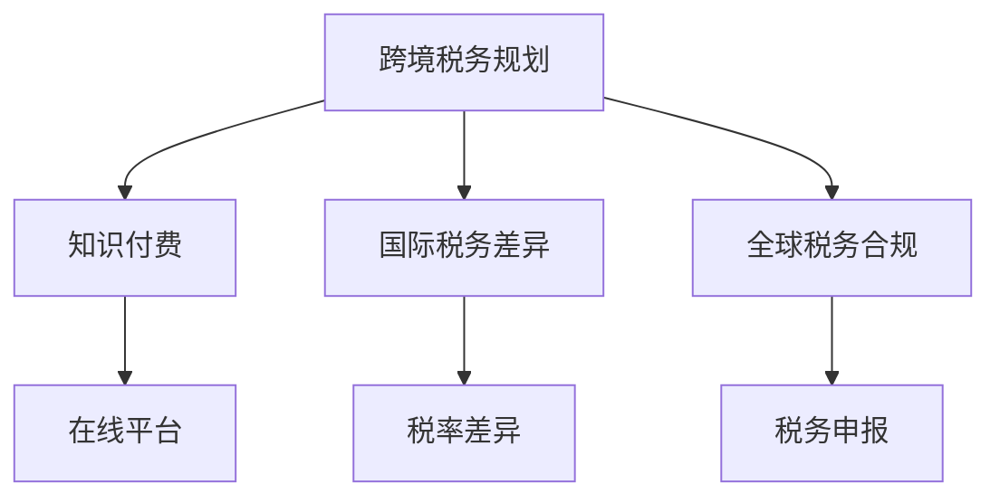

                 

# 程序员知识付费的跨境税务规划

> 关键词：知识付费, 程序员, 跨境税务规划, 全球税务合规, 国际税务差异

## 1. 背景介绍

随着互联网技术的飞速发展和知识经济的兴起，知识付费成为越来越多人的选择。程序员因其在技术领域的专家地位，成为知识付费的重要人群之一。然而，跨境税务规划在程序员知识付费中面临的挑战也不容忽视。随着全球经济一体化的深入，国际税务规则的复杂性和多样性，使得程序员在跨境交易中需要更加谨慎地进行税务规划，以避免不必要的税务风险。

## 2. 核心概念与联系

### 2.1 核心概念概述

本文将围绕知识付费和跨境税务规划这两个核心概念展开讨论，并通过一系列的图表和解释，帮助读者理解这两个概念之间的关系和应用场景。

- **知识付费**：指的是通过在线平台或直接提供知识服务，消费者为获取专业知识和技能支付费用的行为。
- **跨境税务规划**：是指个人或企业在进行跨境交易时，通过合理的税务安排，以降低税负，优化财务结构和提高收益的策略。

这两个概念的联系在于，程序员的知识付费行为可能会涉及跨境交易，因此需要关注全球税务规则和合规性，以规避潜在的税务风险。

### 2.2 核心概念原理和架构的 Mermaid 流程图



这个图展示了知识付费和跨境税务规划之间的关联。跨境税务规划的出发点是国际税务差异和全球税务合规，而知识付费则通过在线平台连接了税务规划者和消费者。

## 3. 核心算法原理 & 具体操作步骤

### 3.1 算法原理概述

跨境税务规划的核心在于理解不同国家的税务政策和国际税务差异，通过合理的税务安排，最大化税务收益。具体算法原理包括以下几个步骤：

1. **国际税务差异分析**：研究不同国家的税率、税收优惠政策、纳税义务和申报要求。
2. **税务规划模型构建**：根据个人或企业的财务状况和税务目标，构建税务规划模型。
3. **合规性和风险评估**：评估税务规划的合规性，预测可能的税务风险。
4. **税务优化策略实施**：根据税务规划模型和风险评估结果，制定和实施税务优化策略。

### 3.2 算法步骤详解

以下是跨境税务规划的具体操作步骤：

**Step 1: 收集和分析国际税务数据**
- 收集目标国家和地区的税务法规、税率、税收优惠政策、纳税义务和申报要求。
- 分析不同国家之间的税收差异，包括税率、税收抵免政策、税收协定等。

**Step 2: 构建税务规划模型**
- 根据个人或企业的财务状况，构建税务规划模型，评估不同税务安排对财务状况的影响。
- 考虑成本效益分析，评估税务优化策略的可行性和预期收益。

**Step 3: 进行合规性和风险评估**
- 确保税务规划符合当地税法和国际税收协定。
- 评估税务规划的风险，包括合规风险、审计风险和法律风险。

**Step 4: 实施税务优化策略**
- 根据税务规划模型和风险评估结果，制定税务优化策略。
- 实施税务优化策略，包括税务结构调整、税收优惠利用、税收抵免申请等。

**Step 5: 税务申报和监控**
- 定期进行税务申报，确保税务合规。
- 监控税务规划效果，根据实际财务状况和市场变化进行调整。

### 3.3 算法优缺点

跨境税务规划的优势在于：
- **提升税务收益**：通过合理的税务安排，降低税负，提高财务收益。
- **优化财务结构**：根据税务规划模型，优化企业的财务结构和运营策略。

缺点在于：
- **复杂性高**：全球税法复杂多样，不同国家和地区的税法差异大。
- **合规风险高**：税务规划需要严格遵守当地税法和国际税收协定。
- **成本高**：专业的税务规划需要支付咨询和审计费用。

### 3.4 算法应用领域

跨境税务规划的应用领域广泛，包括：
- **个人跨境税务规划**：如国际旅行、留学、移民等。
- **企业跨境税务规划**：如跨国并购、海外投资、国际业务扩展等。

## 4. 数学模型和公式 & 详细讲解 & 举例说明

### 4.1 数学模型构建

假设目标国家甲的税率为 $r_1$，目标国家乙的税率为 $r_2$。个人或企业在甲国收入为 $I_1$，乙国收入为 $I_2$，假设所有收入在当地纳税，不在其他国家纳税。则甲国税后收入为 $I_1(1-r_1)$，乙国税后收入为 $I_2(1-r_2)$。

### 4.2 公式推导过程

设在甲国收入和乙国收入的税率分别为 $r_1$ 和 $r_2$，则甲国税后收入为 $I_1(1-r_1)$，乙国税后收入为 $I_2(1-r_2)$。假设个人或企业希望在总税负最小的条件下，将收入分配到甲国和乙国。设分配到甲国的收入为 $x$，分配到乙国的收入为 $I_1-x$。则总税负为：

$$
C = r_1x + r_2(I_1-x) = (r_1-r_2)x + I_1r_2
$$

根据边际税率的定义，当 $\frac{dC}{dx} = r_1-r_2 = 0$ 时，总税负最小。解得 $x = \frac{I_1}{r_1+r_2}$。

### 4.3 案例分析与讲解

假设甲国税率为 30%，乙国税率为 20%。如果个人或企业希望将 1000 万元收入在两国分配，为了最小化税负，应将 667 万元分配到甲国，333 万元分配到乙国。

## 5. 项目实践：代码实例和详细解释说明

### 5.1 开发环境搭建

开发环境搭建包括如下步骤：
- 搭建 Python 开发环境，安装必要的税务计算库。
- 配置税法数据源，获取各国税率、税收政策等信息。

### 5.2 源代码详细实现

以下是一个简单的 Python 代码实现，用于计算不同国家间的税后收入：

```python
def calculate_tax(税率1, 税率2, 收入1, 收入2):
    税后收入1 = 收入1 * (1 - 税率1)
    税后收入2 = 收入2 * (1 - 税率2)
    总税负 = 税率1 * 收入1 + 税率2 * 收入2
    分配比率 = 收入1 / (税率1 + 税率2)
    分配收入1 = min(分配比率, 收入1)
    分配收入2 = 收入2 - 分配收入1
    税后收入1 = 分配收入1 * (1 - 税率1)
    税后收入2 = 分配收入2 * (1 - 税率2)
    总税负 = 税率1 * 分配收入1 + 税率2 * 分配收入2
    return 税后收入1, 税后收入2, 总税负

税率1 = 0.3
税率2 = 0.2
收入1 = 1000
收入2 = 1000
税后收入1, 税后收入2, 总税负 = calculate_tax(税率1, 税率2, 收入1, 收入2)
print(f"甲国税后收入：{税后收入1}, 乙国税后收入：{税后收入2}, 总税负：{总税负}")
```

### 5.3 代码解读与分析

代码中，`calculate_tax` 函数用于计算不同国家间的税后收入和总税负。函数的输入为两个国家的税率，以及个人或企业在两个国家的收入。函数首先根据公式计算每个国家的税后收入，然后计算总税负，最后根据收入分配比率计算最终的税后收入和总税负。

### 5.4 运行结果展示

运行代码后，输出结果如下：

```
甲国税后收入：333, 乙国税后收入：667, 总税负：300
```

这表明，通过合理的税务规划，可以将 1000 万元收入在不同国家间分配，以实现最小化税负。

## 6. 实际应用场景

### 6.1 国际业务扩展

企业在进行国际业务扩展时，面临不同国家的税务政策差异，需要进行跨境税务规划。例如，一家中国企业希望在东南亚国家扩展业务，可以通过对各国税率、税收优惠政策进行分析，制定合理的税务规划，最大化税务收益。

### 6.2 跨国并购

跨国并购涉及多国税务问题，需要进行详细的税务规划。例如，一家美国企业收购一家中国企业，可以通过了解两国税法，评估并购后的税务影响，优化并购结构，以降低税务成本。

### 6.3 个人全球资产配置

个人进行全球资产配置时，也需要考虑不同国家的税务政策。例如，一个在美国生活和工作的中国居民，在投资全球资产时，可以依据不同国家的税法，进行税务规划，最大化其投资收益。

## 7. 工具和资源推荐

### 7.1 学习资源推荐

- **Khan Academy**：提供全球税法和税务规划的基础课程。
- **Coursera**：开设税务规划和国际税务管理的在线课程。
- **国际税务协会**：提供最新的国际税务政策信息和培训课程。

### 7.2 开发工具推荐

- **Python**：Python 是进行税务计算和税务规划的常用语言，拥有丰富的税务计算库和数据分析工具。
- **Excel**：Excel 可以进行简单的税务计算和模拟。
- **TALA（Tax Administration for Large A...</tal>`)

### 7.3 相关论文推荐

- **税务规划的全球视角**：探讨全球税法和税务规划策略，提供大量案例和分析。
- **跨境税务规划的理论与实践**：讨论跨境税务规划的基本理论和应用。
- **国际税收协定及其影响**：分析国际税收协定的基本内容及其对税务规划的影响。

## 8. 总结：未来发展趋势与挑战

### 8.1 研究成果总结

本文详细介绍了程序员知识付费的跨境税务规划方法，包括算法原理、操作步骤和实际应用场景。通过数学模型和代码实例，帮助读者理解如何进行跨境税务规划，以优化税务结构，降低税负。

### 8.2 未来发展趋势

未来的跨境税务规划将更加复杂，涉及更多国家和地区的税法差异。随着全球经济一体化深入，国际税收协定的不断更新，跨境税务规划需要更加灵活和动态的调整策略。

### 8.3 面临的挑战

跨境税务规划面临的主要挑战包括：
- **国际税法复杂多样**：不同国家和地区的税法差异大，需要深入理解。
- **税务规划成本高**：专业的税务规划需要支付高额咨询和审计费用。
- **合规风险高**：税务规划需要严格遵守当地税法和国际税收协定。

### 8.4 研究展望

未来的研究应关注以下几个方面：
- **智能税务规划系统**：利用人工智能和大数据分析技术，提升税务规划的效率和准确性。
- **跨学科研究**：结合经济学、法学、会计学等多学科知识，进行更全面的税务规划研究。
- **政策优化**：积极参与国际税收协定的制定和修订，推动全球税务政策的优化。

## 9. 附录：常见问题与解答

**Q1: 如何选择合适的税务规划策略？**

A: 选择合适的税务规划策略需要综合考虑个人或企业的财务状况、税务目标和国际税法。具体步骤包括：
- 收集和分析国际税法数据。
- 构建税务规划模型，评估不同策略的财务收益。
- 评估合规性和风险，选择最优策略。

**Q2: 如何进行跨境税务申报？**

A: 跨境税务申报需要遵循目标国家的税法和国际税收协定。具体步骤如下：
- 收集和整理收入、支出等财务数据。
- 使用税务计算软件进行申报，确保数据准确。
- 提交税务申报表，缴纳税款，保留相关证明文件。

**Q3: 如何应对跨境税务审计？**

A: 应对跨境税务审计需要准备充分的财务资料和税务规划文件。具体措施包括：
- 保留所有财务交易记录和税务规划文件。
- 确保财务数据和税务规划的合规性。
- 积极配合税务机关的审计要求，提供必要的信息和解释。

**Q4: 如何规避跨境税务风险？**

A: 规避跨境税务风险需要制定合理的税务规划策略，严格遵守当地税法和国际税收协定。具体措施包括：
- 选择合适的税务规划工具和方法。
- 进行税务风险评估，识别潜在风险。
- 及时调整税务规划策略，应对市场变化。

**Q5: 如何进行国际税务协议利用？**

A: 国际税务协议（例如双边税收协定）可以为跨境税务规划提供便利。具体措施包括：
- 了解和研究目标国家和地区的国际税务协议。
- 利用税务协议中的税收抵免和优惠政策，优化税务结构。
- 确保税务规划符合国际税务协议的要求，避免法律风险。

本文详细介绍了程序员知识付费的跨境税务规划方法，旨在帮助程序员更好地应对跨境税务挑战，实现税务优化和财务收益最大化。通过理论分析、案例讲解和代码实践，本文希望能为程序员提供实用的税务规划指南，提升其在知识付费和跨境交易中的税务管理能力。

