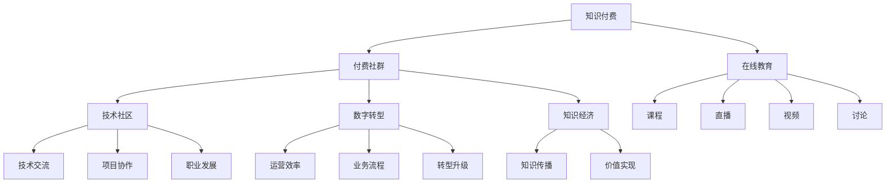

                 

# 程序员知识付费：打造付费社群

> 关键词：程序员,知识付费,付费社群,在线教育,技术社区,数字转型

## 1. 背景介绍

### 1.1 问题由来

在知识爆炸的今天，信息的获取和传播变得前所未有的便捷，然而，随着信息量的剧增，如何筛选、整合和应用这些知识成为了关键问题。对于程序员这一庞大的技术群体，掌握最新的技术趋势、快速获取解决方案、提升职业竞争力变得尤为重要。传统的知识获取途径如博客、论坛等，逐渐难以满足需求。知识付费作为新兴的行业，凭借其内容精准、传播高效、需求匹配等特点，成为程序员群体寻求技术突破和职业成长的新趋势。

### 1.2 问题核心关键点

知识付费和付费社群的兴起，是技术社区发展到一定阶段的产物。它通过线上或线下的方式，将知识供给方和需求方高效连接，为知识付费双方提供了更精准、更有效的对接平台。这一模式尤其适用于程序员群体，其核心关键点在于：

1. **知识精准匹配**：在庞大的知识供给中，精准识别和匹配知识需求，是知识付费模式得以存在的基础。通过用户画像、行为数据分析等技术手段，实现对用户需求的深度理解。
2. **质量保证**：付费社区对知识供给方提出了更高的标准，确保提供的知识和解决方案具备专业性和实用性，减少低质量信息的干扰。
3. **用户行为激励**：通过付费激励机制，鼓励知识供给方不断提升内容质量，满足用户期待。
4. **社区生态建设**：打造活跃、健康、可持续发展的社区生态，为用户提供持续的增值服务，增强用户粘性。
5. **技术平台支持**：强大的技术平台，支持社群的运营、管理和分析，确保社区高效运转。

### 1.3 问题研究意义

知识付费和付费社群模式的出现，对程序员职业发展具有重要意义：

1. **加速技术迭代**：通过付费社群获取最新技术资讯、解决方案和实践案例，快速适应技术变化，加速个人技术迭代。
2. **提升职业竞争力**：高质量的知识付费内容，帮助程序员提升专业能力，增强在就业市场上的竞争力。
3. **促进技术交流**：付费社群提供了一个技术交流的平台，程序员可以分享经验、讨论问题、协作开发，共同提升技术水平。
4. **助力企业转型**：企业通过知识付费平台，可以为员工提供最新的技术培训，推动企业数字化转型升级。
5. **推动知识传播**：付费模式可以激励更多专业人士提供高质量内容，促进知识的广泛传播。

## 2. 核心概念与联系

### 2.1 核心概念概述

理解知识付费和付费社群的核心概念，对于打造成功的付费平台至关重要。以下是几个关键概念及其相互联系的概述：

- **知识付费**：通过付费方式获取知识、技术或解决方案，强调知识的专业性和实用性。
- **付费社群**：用户通过付费方式加入特定的在线社区，获取高质量的内容、咨询和技术支持。
- **在线教育**：通过互联网平台提供教育资源和服务，以在线课程、视频、直播、讨论等多种形式呈现。
- **技术社区**：聚集技术从业者的社区，提供技术交流、项目协作、职业发展等服务。
- **数字转型**：传统行业通过数字化手段提升运营效率、优化业务流程，实现转型升级。
- **知识经济**：基于知识和信息为核心资源的经济模式，强调知识的价值和传播。

这些概念构成了知识付费和付费社群的基础框架，帮助理解其运作机制和价值所在。

### 2.2 核心概念原理和架构的 Mermaid 流程图



此图展示了知识付费和付费社群在不同概念间的联系和转化关系，从在线教育到技术社区，再到数字转型和知识经济，形成了一个循环的知识传播和应用链条。

## 3. 核心算法原理 & 具体操作步骤

### 3.1 算法原理概述

知识付费和付费社群的运作基于以下几个核心算法原理：

1. **需求分析与匹配算法**：通过大数据分析用户需求，精准匹配高质量内容。
2. **推荐系统算法**：基于用户行为数据，智能推荐个性化内容。
3. **质量评估与反馈机制**：建立内容质量和用户评价系统，动态调整内容供给。
4. **社区管理与激励算法**：利用社区规则和激励机制，保证社区健康有序发展。
5. **用户画像与行为预测**：通过机器学习算法，分析用户行为，预测用户需求。

这些算法共同支撑了知识付费和付费社群平台的运营，确保平台的高效、稳定和可持续。

### 3.2 算法步骤详解

以知识付费平台的推荐系统为例，详细介绍其核心算法步骤：

**Step 1: 数据收集与处理**
- 收集用户行为数据（如浏览记录、点击行为、评论等）
- 收集内容质量数据（如专家评价、用户评分、历史反馈等）

**Step 2: 用户画像构建**
- 通过聚类、分类等机器学习算法，构建用户画像，描述用户兴趣、需求和行为模式
- 利用用户画像进行特征提取，生成用户特征向量

**Step 3: 内容特征提取**
- 对内容进行文本分析、图像处理、音频分析等，提取特征向量
- 利用自然语言处理(NLP)、计算机视觉、语音识别等技术，生成多维度特征

**Step 4: 相似度计算**
- 基于余弦相似度、Jaccard相似度等方法，计算用户画像和内容特征之间的相似度
- 通过神经网络、矩阵分解等算法，优化相似度计算

**Step 5: 推荐生成与调整**
- 根据相似度计算结果，生成内容推荐列表
- 利用增量学习、实时调整等方法，优化推荐算法，提高推荐准确性

**Step 6: 用户反馈与改进**
- 收集用户对推荐结果的反馈（如点击率、满意度等）
- 基于反馈数据，优化推荐算法，提升用户体验

### 3.3 算法优缺点

**优点**：
1. **精准匹配**：通过算法确保用户获取高质量、相关性高的知识内容。
2. **个性化推荐**：根据用户行为和兴趣，提供定制化内容，提高学习效率。
3. **动态调整**：利用反馈数据，实时优化算法，保持推荐结果的准确性和相关性。
4. **激励机制**：通过付费模式激励内容供给方持续提供高质量内容。

**缺点**：
1. **数据隐私**：收集和分析用户数据可能带来隐私风险。
2. **算法复杂性**：推荐算法的设计和实现复杂，需要高水平的技术支持。
3. **内容过载**：高质量内容供给有限，可能造成用户信息过载。
4. **付费门槛**：部分用户可能因经济原因无法享受高质量知识。

### 3.4 算法应用领域

知识付费和付费社群的核心算法原理，广泛应用于以下几个领域：

1. **在线教育平台**：根据学生学习行为，推荐个性化课程和资源。
2. **技术社区**：提供技术文章、代码示例、技术交流讨论等，通过智能推荐提高用户活跃度。
3. **企业培训**：通过精准匹配员工培训需求，提供定制化培训内容，助力企业人才培养。
4. **数字营销**：利用推荐算法，精准定位目标用户，提升广告投放效果。
5. **金融投资**：通过算法分析用户投资行为，提供个性化投资建议，优化投资决策。

## 4. 数学模型和公式 & 详细讲解 & 举例说明

### 4.1 数学模型构建

知识付费和付费社群的算法原理，可以通过数学模型进行精确描述。以推荐系统为例，构建用户画像和内容特征的数学模型：

**用户画像表示**：$P_u = \langle u_1, u_2, \ldots, u_n \rangle$，其中 $u_i$ 表示用户画像中的第 $i$ 个特征。

**内容特征表示**：$P_c = \langle c_1, c_2, \ldots, c_m \rangle$，其中 $c_i$ 表示内容特征中的第 $i$ 个特征。

**相似度计算模型**：$S(P_u, P_c) = \frac{\mathbf{P_u}^T \mathbf{P_c}}{\|\mathbf{P_u}\|\|\mathbf{P_c}\|}$，其中 $\mathbf{P_u}$ 和 $\mathbf{P_c}$ 分别为用户和内容的特征向量。

**推荐算法模型**：$R_u = \mathop{\arg\max}_{c \in C} S(P_u, P_c) \cdot W_c$，其中 $W_c$ 为内容的权重，$C$ 为所有内容集合。

### 4.2 公式推导过程

以基于余弦相似度的推荐算法为例，推导推荐结果的计算公式：

**用户画像和内容特征相似度**：
$$
S(P_u, P_c) = \frac{\sum_{i=1}^{n} u_i c_i}{\sqrt{\sum_{i=1}^{n} u_i^2} \sqrt{\sum_{i=1}^{m} c_i^2}}
$$

**推荐算法计算**：
$$
R_u = \arg\max_{c \in C} S(P_u, P_c) \cdot W_c = \arg\max_{c \in C} \frac{\sum_{i=1}^{n} u_i c_i}{\sqrt{\sum_{i=1}^{n} u_i^2} \sqrt{\sum_{i=1}^{m} c_i^2}} \cdot W_c
$$

**权重调整**：
$$
W_c = \frac{1}{\sqrt{\sum_{i=1}^{m} c_i^2}} \cdot \frac{1}{\sigma^2 + \sum_{i=1}^{m} c_i^2}
$$

其中 $\sigma^2$ 为归一化因子，保证权重在归一化后的范围内。

### 4.3 案例分析与讲解

以在线教育平台为例，分析知识付费推荐系统的案例：

1. **用户画像构建**：收集用户历史学习数据，通过聚类算法构建用户画像，描述其学习兴趣和行为。
2. **内容特征提取**：对课程内容进行文本分析，提取关键词、难度等级等特征。
3. **相似度计算**：利用余弦相似度计算用户和课程之间的相似度。
4. **推荐生成与调整**：根据相似度结果和课程权重，生成个性化推荐列表，定期根据用户反馈调整算法。

## 5. 项目实践：代码实例和详细解释说明

### 5.1 开发环境搭建

搭建知识付费和付费社群开发环境，需要以下步骤：

1. **选择开发语言**：Python是最流行的选择，具有丰富的库和社区支持。
2. **安装依赖库**：使用pip安装必要的依赖库，如TensorFlow、Pandas、NumPy等。
3. **搭建数据库**：使用MySQL或MongoDB等数据库，存储用户数据、内容数据和交易记录。
4. **部署服务器**：选择合适的云服务（如AWS、阿里云、腾讯云等），搭建服务器环境。

### 5.2 源代码详细实现

以下是推荐系统的Python代码实现，涵盖用户画像构建、内容特征提取和相似度计算：

```python
import pandas as pd
from sklearn.decomposition import PCA
from sklearn.metrics.pairwise import cosine_similarity

# 构建用户画像
user_data = pd.read_csv('user_data.csv')
user_features = user_data[['age', 'gender', 'interests', 'study_hours']]
user_profile = user_features.apply(lambda x: x.mean(), axis=0).to_dict()

# 构建内容特征
course_data = pd.read_csv('course_data.csv')
course_features = course_data[['title', 'description', 'difficulty', 'recommendation_count']]
course_profile = course_features.apply(lambda x: x.mean(), axis=0).to_dict()

# 计算相似度
similarity_matrix = cosine_similarity([user_profile.values], [course_profile.values])
```

### 5.3 代码解读与分析

上述代码实现了推荐系统的核心功能：用户画像和内容特征的构建，以及相似度的计算。其中：

- `user_data.csv` 和 `course_data.csv` 分别为用户和课程的特征数据文件。
- `user_features` 和 `course_features` 分别提取用户和课程的特征，如年龄、性别、兴趣、学习时间等。
- `user_profile` 和 `course_profile` 分别对用户和课程特征进行均值化，得到用户画像和内容特征向量。
- `cosine_similarity` 函数计算余弦相似度，生成用户和内容之间的相似度矩阵。

### 5.4 运行结果展示

运行上述代码后，得到用户和内容之间的相似度矩阵。通过进一步分析相似度矩阵，可以生成个性化的课程推荐列表，满足用户的个性化学习需求。

## 6. 实际应用场景

### 6.1 在线教育

在线教育是知识付费模式的主要应用场景之一。通过构建个性化的学习路径，推荐适合的课程和资源，帮助学生高效学习。

### 6.2 技术社区

技术社区通过知识付费模式，聚集技术爱好者和从业者，提供技术文章、代码示例、技术交流讨论等服务，构建活跃、健康、可持续发展的社区生态。

### 6.3 企业培训

企业通过知识付费平台，为员工提供最新的技术培训，推动企业数字化转型升级。

### 6.4 数字营销

利用推荐算法，精准定位目标用户，提升广告投放效果。

### 6.5 金融投资

通过算法分析用户投资行为，提供个性化投资建议，优化投资决策。

## 7. 工具和资源推荐

### 7.1 学习资源推荐

以下是几本经典书籍和在线课程，推荐学习知识付费和付费社群的相关知识：

1. **《知识付费：未来教育新趋势》**：介绍知识付费的兴起背景、发展现状和未来趋势。
2. **《在线教育技术基础》**：讲解在线教育技术的基础知识和实践应用。
3. **Coursera《在线教育设计与开发》**：由Coursera开设的在线教育课程，涵盖课程设计、技术实现、运营管理等方面。
4. **Udemy《付费社群运营实战》**：Udemy平台上关于付费社群运营的实战课程，提供详细的运营策略和案例分析。

### 7.2 开发工具推荐

以下是几款用于知识付费和付费社群开发的工具：

1. **Jupyter Notebook**：Python数据分析和算法开发的强大工具，支持代码编写、执行和可视化。
2. **TensorFlow**：谷歌推出的深度学习框架，支持复杂算法的实现和优化。
3. **PyTorch**：Facebook开发的深度学习框架，支持动态图和静态图两种计算模式。
4. **Pandas**：数据分析和处理的Python库，支持数据清洗、统计和可视化。
5. **Scikit-Learn**：机器学习库，提供丰富的算法和工具。

### 7.3 相关论文推荐

以下是几篇重要的知识付费和付费社群相关论文，推荐阅读：

1. **《知识付费中的推荐算法研究》**：探讨知识付费平台中的推荐算法，提出基于协同过滤和深度学习的推荐策略。
2. **《社区知识付费平台的模型设计》**：提出知识付费平台的设计框架和用户模型，分析社区互动和用户留存机制。
3. **《在线教育中的个性化推荐系统》**：讨论在线教育平台的推荐算法，提高学习体验和效果。

## 8. 总结：未来发展趋势与挑战

### 8.1 研究成果总结

知识付费和付费社群模式在技术社区、在线教育、企业培训等领域取得了显著成效，未来有望在更多领域得到应用。核心技术如推荐算法、用户画像构建、社区管理等，为平台提供了坚实的技术支撑。

### 8.2 未来发展趋势

知识付费和付费社群模式的未来发展趋势包括：

1. **个性化推荐**：通过算法不断优化，实现更精准的个性化推荐，提升用户体验。
2. **数据隐私保护**：加强数据隐私保护技术，确保用户数据安全。
3. **跨领域应用**：知识付费平台的应用范围将进一步扩展到更多行业和领域，提供更全面的服务。
4. **人工智能与大数据融合**：利用AI和大数据技术，提升内容质量和推荐准确性。
5. **用户体验优化**：通过用户反馈和行为分析，不断优化平台设计和功能，提高用户满意度。

### 8.3 面临的挑战

知识付费和付费社群模式也面临一些挑战：

1. **内容质量**：高质量内容供给不足，可能影响用户体验和平台可持续性。
2. **数据隐私**：用户数据隐私保护技术需进一步提升，避免数据泄露和滥用。
3. **算法公平性**：推荐算法需避免偏见，确保内容推荐公平公正。
4. **付费门槛**：部分用户可能因经济原因无法享受高质量知识。

### 8.4 研究展望

未来在知识付费和付费社群领域，需要加强以下几个方面的研究：

1. **内容生成与审核**：通过自然语言生成和图像识别等技术，提高内容生成效率，同时加强内容审核，确保内容质量。
2. **用户行为分析**：利用深度学习和机器学习算法，深入分析用户行为，提供更精准的个性化推荐。
3. **社区生态建设**：构建更加活跃、健康的社区生态，通过内容激励、用户互动等方式，增强用户粘性。
4. **跨平台合作**：与其他教育平台、技术社区等合作，共享资源，提升平台竞争力。

## 9. 附录：常见问题与解答

**Q1：知识付费和付费社群的区别是什么？**

A: 知识付费和付费社群都是通过付费方式获取知识和服务的模式，但二者有所区别。知识付费主要指用户购买单一知识点或内容，获取即时知识。而付费社群则提供长期、持续的服务和交流，用户可以持续获取知识，并与专家和同行互动。

**Q2：如何保证知识付费内容的质量？**

A: 内容质量是知识付费平台的核心。平台需建立内容审核机制，邀请专家审核内容。同时，利用用户评价和反馈机制，动态调整推荐算法，确保高质量内容的流通。

**Q3：知识付费平台的推荐算法有哪些？**

A: 知识付费平台的推荐算法包括基于协同过滤、基于内容的推荐、基于深度学习的推荐等。协同过滤算法通过用户行为数据进行推荐，基于内容的推荐通过内容特征进行推荐，基于深度学习的推荐则利用神经网络模型进行推荐。

**Q4：如何平衡知识付费平台的成本和收益？**

A: 知识付费平台需合理设置付费模式和定价策略，通过精准匹配用户需求，最大化平台收益。同时，平台需提供高质量的增值服务，增强用户粘性，实现长期收益。

**Q5：知识付费和付费社群模式在技术社区中的应用前景如何？**

A: 技术社区的知识付费模式具有广阔的应用前景。通过付费模式，可以筛选高质量的技术内容，保证社区的健康发展。同时，社区的付费模式可以有效激励内容供给，促进社区技术交流和知识共享。

---

作者：禅与计算机程序设计艺术 / Zen and the Art of Computer Programming

