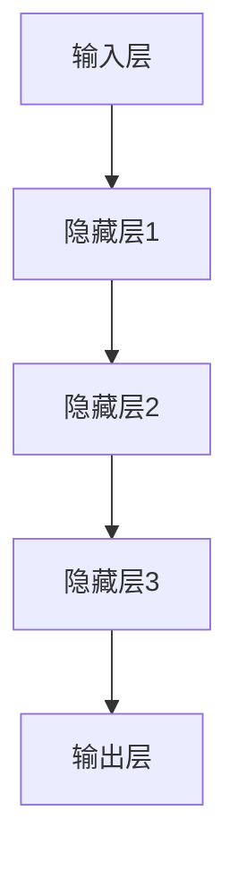
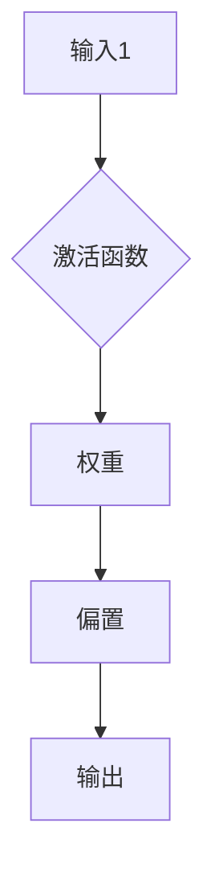
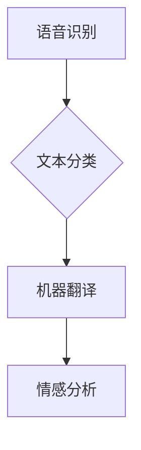
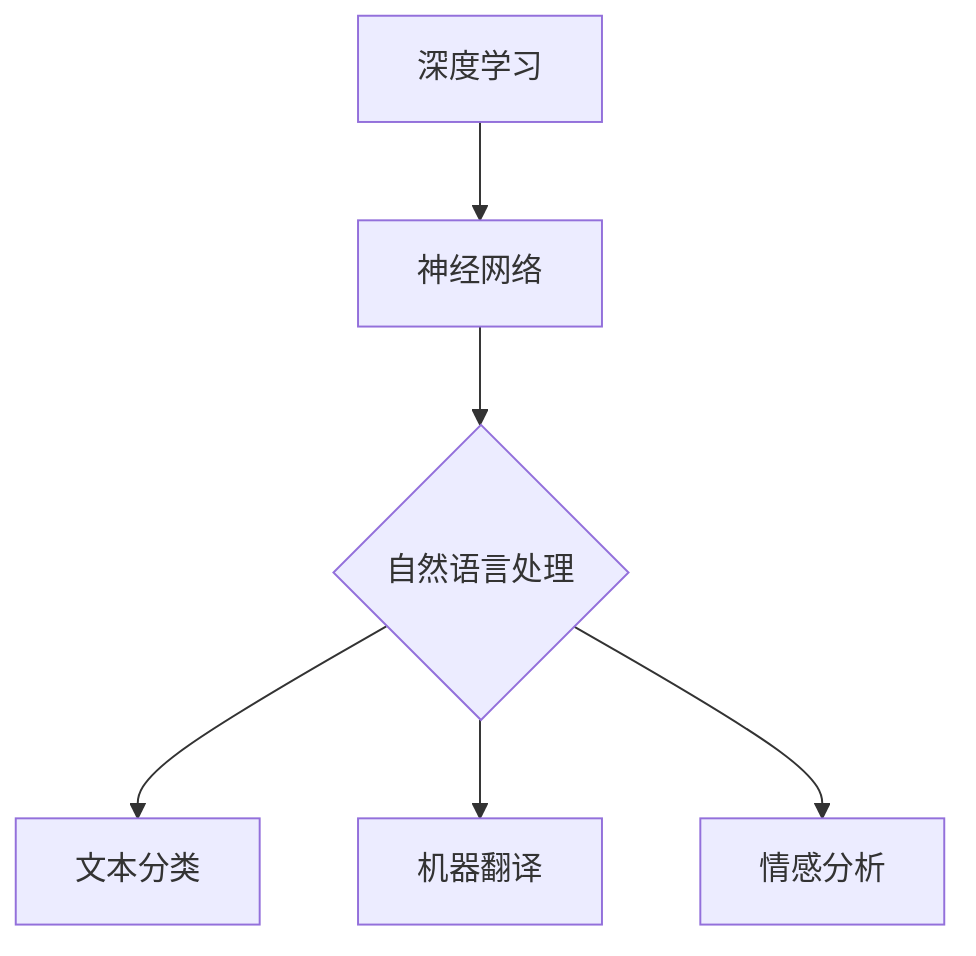
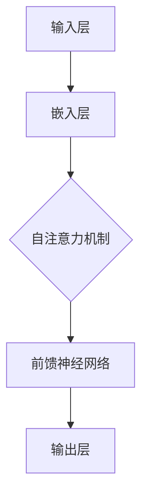
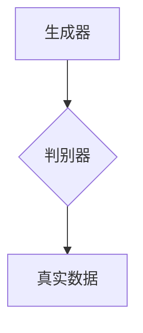
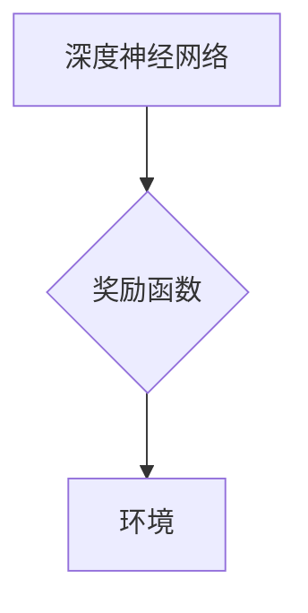
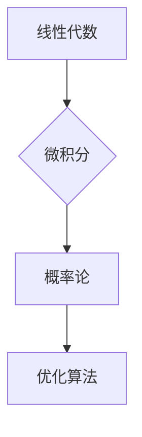

                 

### 背景介绍（Background Introduction）

#### Andrej Karpathy：人工智能领域的重要人物

Andrej Karpathy是一位在人工智能领域享有盛誉的研究员和开发者。他曾在OpenAI担任研究科学家，在那里他参与了许多突破性项目，包括GPT系列模型和DALL-E等。他的研究和工作在深度学习和自然语言处理（NLP）领域产生了深远的影响，对人工智能的发展起到了关键的推动作用。

#### 人工智能的现状与未来

人工智能（AI）已经从一个学术界的研究领域逐渐演变成为改变我们生活各个方面的实用技术。从自动驾驶汽车、智能家居到医疗诊断和金融分析，AI的应用无处不在。然而，尽管AI技术在许多方面取得了巨大进步，但仍面临一些挑战和局限性。

本文旨在探讨人工智能未来的发展策略，特别是如何解决当前的挑战，推动AI技术向更高层次发展。我们将从以下几个方面进行深入分析：

1. **核心概念与联系**：介绍AI领域的一些核心概念，如深度学习、神经网络和自然语言处理，并展示它们之间的联系。
2. **核心算法原理 & 具体操作步骤**：详细解析一些重要的AI算法，如GPT-3和GAN，并说明其操作步骤。
3. **数学模型和公式 & 详细讲解 & 举例说明**：探讨AI中使用的数学模型和公式，并提供具体的例子来说明。
4. **项目实践：代码实例和详细解释说明**：通过实际项目展示如何应用这些算法和模型。
5. **实际应用场景**：分析AI在不同领域的应用情况。
6. **工具和资源推荐**：推荐一些学习资源和工具，以帮助读者进一步了解和探索AI。
7. **总结：未来发展趋势与挑战**：总结本文的主要观点，并提出未来可能面临的挑战。

通过本文的深入分析，我们希望能为读者提供一个全面了解AI未来发展策略的视角，并激发对这一领域的浓厚兴趣。接下来，我们将首先探讨AI领域的一些核心概念和联系，为后续内容的讨论打下基础。

### 2. 核心概念与联系（Core Concepts and Connections）

#### 2.1 什么是深度学习？

深度学习是机器学习（ML）的一个子领域，其核心在于使用神经网络（尤其是多层神经网络）来建模和解决问题。深度学习模型通过多层节点（称为神经元）进行数据传递和变换，以逐步提取数据的复杂特征。这个过程类似于人类大脑的工作方式，因此被称为“深度学习”。

**图1. 深度学习神经网络结构**


**深度学习的优势：**

- **强大的表示能力**：深度学习模型能够自动提取数据的复杂特征，从而避免了传统机器学习方法中手动特征工程的需求。
- **自适应性和泛化能力**：通过训练，深度学习模型可以适应各种不同的数据分布和任务。
- **高性能**：深度学习模型在图像识别、语音识别、自然语言处理等领域取得了显著的成功。

#### 2.2 什么是神经网络？

神经网络是模仿人类大脑工作原理的一种计算模型，由一系列相互连接的节点（或神经元）组成。这些节点通过权重和偏置进行连接，并通过前向传播和反向传播算法进行训练。

**图2. 神经网络结构**


**神经网络的组成元素：**

- **输入层**：接收外部输入数据。
- **隐藏层**：对输入数据进行处理，提取特征。
- **输出层**：产生最终输出。

**神经网络的训练过程：**

- **前向传播**：输入数据通过网络向前传递，每个节点计算其输出。
- **反向传播**：计算输出与真实值的误差，并反向传播到每个节点，更新权重和偏置。

#### 2.3 什么是自然语言处理？

自然语言处理（NLP）是计算机科学和人工智能的一个分支，致力于使计算机能够理解和处理人类语言。NLP涉及语音识别、文本分类、机器翻译、情感分析等多种任务。

**图3. 自然语言处理的主要任务**


**自然语言处理的挑战：**

- **语言复杂性**：自然语言具有高度的复杂性和多样性，这使得NLP任务的实现具有挑战性。
- **语义理解**：正确理解和解释语言中的隐含意义是NLP中一个长期存在的难题。
- **多模态融合**：如何有效地融合文本、语音、图像等多种模态的信息，是NLP领域的一个重要研究方向。

#### 2.4 深度学习、神经网络与自然语言处理的联系

深度学习和神经网络为自然语言处理提供了强大的工具，使得许多NLP任务得以实现。例如，深度学习模型可以用于文本分类、机器翻译、情感分析等任务，而神经网络的结构和训练算法则有助于提高模型的性能和泛化能力。

**图4. 深度学习、神经网络与自然语言处理的联系**


通过本文的第一部分，我们探讨了人工智能领域的一些核心概念，包括深度学习、神经网络和自然语言处理，并展示了它们之间的联系。在接下来的部分中，我们将深入探讨一些重要的AI算法，如GPT-3和GAN，以及它们的操作步骤和原理。

### 3. 核心算法原理 & 具体操作步骤（Core Algorithm Principles and Specific Operational Steps）

#### 3.1 GPT-3：下一代语言模型

GPT-3（Generative Pre-trained Transformer 3）是由OpenAI开发的一种先进的自然语言处理模型，被认为是当前最强大的语言模型之一。GPT-3基于Transformer架构，拥有1750亿个参数，可以生成高质量的自然语言文本。

**图5. GPT-3 的基本结构**


**GPT-3 的训练步骤：**

1. **数据预处理**：首先，对原始文本数据进行预处理，包括分词、去除停用词和标记化等步骤。
2. **嵌入层**：将预处理后的文本转换为数值表示，即嵌入层。嵌入层将单词映射为向量，以供神经网络处理。
3. **自注意力机制**：GPT-3 使用多个自注意力层来处理输入文本。自注意力机制允许模型在生成文本时考虑输入文本的每个部分，从而捕捉到文本中的上下文信息。
4. **前馈神经网络**：每个自注意力层之后都接有一个前馈神经网络，用于进一步处理和组合信息。
5. **输出层**：最终，输出层生成文本的序列，每个输出都是一个概率分布，表示生成下一个单词的可能性。

**GPT-3 的应用场景：**

- **文本生成**：GPT-3 可以用于生成各种类型的文本，包括文章、故事、诗歌等。
- **问答系统**：GPT-3 可以作为一个强大的问答系统，回答用户提出的问题。
- **机器翻译**：GPT-3 在机器翻译任务上也取得了显著的成功，可以生成高质量的双语文本。

#### 3.2 GAN：生成对抗网络

GAN（Generative Adversarial Network）是由Ian Goodfellow等人于2014年提出的一种生成模型，由两个神经网络（生成器和判别器）组成。生成器试图生成与真实数据相似的数据，而判别器则试图区分真实数据和生成数据。

**图6. GAN 的基本结构**


**GAN 的训练步骤：**

1. **初始化生成器和判别器**：生成器和判别器都是随机初始化的神经网络。
2. **生成器训练**：生成器的目标是生成看起来真实的数据，以便骗过判别器。生成器通过生成数据并通过判别器评估其质量来进行训练。
3. **判别器训练**：判别器的目标是正确区分真实数据和生成数据。判别器通过分析真实数据和生成数据来进行训练。
4. **交替训练**：生成器和判别器交替进行训练，以实现最佳性能。

**GAN 的应用场景：**

- **图像生成**：GAN 可以生成高质量的图像，包括人脸、风景和动物等。
- **数据增强**：GAN 可以用于生成训练数据，从而增强现有数据集。
- **风格迁移**：GAN 可以将一种风格应用到另一张图像上，实现风格迁移。

#### 3.3 深度强化学习

深度强化学习（Deep Reinforcement Learning）是结合了深度学习和强化学习的机器学习技术。它使用深度神经网络来表示环境和奖励函数，并使用强化学习算法来训练模型。

**图7. 深度强化学习的基本结构**


**深度强化学习的训练步骤：**

1. **初始化模型**：首先，初始化深度神经网络模型。
2. **探索和利用**：模型在环境中进行探索，以发现最佳策略。同时，模型也利用以往的经验来优化其行为。
3. **策略迭代**：通过迭代优化策略，模型逐渐提高其在环境中的性能。
4. **评估和测试**：在训练完成后，评估模型在测试环境中的性能，并进行测试。

**深度强化学习的应用场景：**

- **游戏**：深度强化学习可以用于训练智能体在电子游戏中的策略。
- **机器人控制**：深度强化学习可以用于训练机器人进行自主控制。
- **自动驾驶**：深度强化学习可以用于自动驾驶车辆的路况感知和决策。

通过本文的第二部分，我们详细介绍了三个重要的AI算法：GPT-3、GAN和深度强化学习。这些算法在自然语言处理、图像生成和智能控制等领域具有广泛的应用，并对AI技术的发展起到了重要的推动作用。在接下来的部分中，我们将探讨AI中的数学模型和公式，以及如何通过具体的例子来解释这些模型和公式的应用。

### 4. 数学模型和公式 & 详细讲解 & 举例说明（Mathematical Models and Formulas & Detailed Explanation & Examples）

#### 4.1 深度学习中的数学基础

深度学习依赖于一系列数学模型和公式，这些模型和公式对于理解深度学习算法的运作机制至关重要。以下是一些核心的数学概念：

**图8. 深度学习中的数学基础**


**4.1.1 线性代数**

- **矩阵与向量**：矩阵和向量是深度学习中的基本数据结构。矩阵可以表示数据的变换，而向量则用于表示数据的特征。
- **矩阵乘法**：矩阵乘法是深度学习中的核心运算，用于计算数据的线性变换。例如，假设有矩阵 \(A\) 和向量 \(x\)，则矩阵乘法可以表示为 \(Ax\)。
- **矩阵求导**：在训练深度学习模型时，需要计算损失函数关于模型参数的梯度。矩阵求导是计算梯度的关键步骤。

**4.1.2 微积分**

- **前向传播与反向传播**：深度学习训练过程中，前向传播用于计算模型输出，而反向传播用于计算损失函数关于模型参数的梯度。这些过程依赖于微积分中的链式法则。
- **偏导数**：偏导数是微积分中的重要概念，用于计算函数在某一个特定方向上的变化率。在深度学习中，偏导数用于计算梯度，从而优化模型参数。

**4.1.3 概率论**

- **概率分布**：概率分布用于描述数据的不确定性。常见的概率分布包括正态分布、伯努利分布等。
- **贝叶斯定理**：贝叶斯定理是概率论中的一个核心概念，用于计算条件概率。在深度学习中的不确定性估计和推理中，贝叶斯定理有着广泛的应用。

**4.1.4 优化算法**

- **梯度下降**：梯度下降是一种优化算法，用于在训练过程中更新模型参数。梯度下降的核心思想是沿着损失函数的梯度方向进行参数更新，以最小化损失函数。
- **动量**：动量是一种加速梯度下降的方法，通过累积过去梯度的方向，提高优化过程的收敛速度。

#### 4.2 具体公式及应用示例

以下是一些深度学习中的具体数学模型和公式，并附上应用示例：

**4.2.1 损失函数**

- **均方误差（MSE）**：均方误差是用于回归问题的常见损失函数。公式如下：
  $$MSE = \frac{1}{n}\sum_{i=1}^{n}(y_i - \hat{y}_i)^2$$
  其中，\(y_i\) 是真实值，\(\hat{y}_i\) 是预测值，\(n\) 是样本数量。

  **应用示例**：假设我们有一个回归问题，预测房价。真实房价为200,000美元，预测房价为195,000美元。则均方误差为：
  $$MSE = \frac{1}{1}(200,000 - 195,000)^2 = 25,000$$

- **交叉熵损失（Cross-Entropy Loss）**：交叉熵损失是用于分类问题的常见损失函数。公式如下：
  $$CE = -\sum_{i=1}^{n}y_i \log(\hat{y}_i)$$
  其中，\(y_i\) 是真实标签的概率分布，\(\hat{y}_i\) 是预测标签的概率分布。

  **应用示例**：假设我们有一个二分类问题，真实标签为1，预测标签的概率为0.9。则交叉熵损失为：
  $$CE = -1 \log(0.9) \approx 0.15$$

**4.2.2 梯度计算**

- **链式法则**：链式法则是计算梯度的重要工具。假设有一个复合函数 \(f(g(x))\)，其梯度可以表示为：
  $$\frac{df}{dx} = \frac{df}{dg} \cdot \frac{dg}{dx}$$
  其中，\(\frac{df}{dg}\) 是 \(f\) 关于 \(g\) 的梯度，\(\frac{dg}{dx}\) 是 \(g\) 关于 \(x\) 的梯度。

  **应用示例**：假设有一个函数 \(f(x) = x^2\)，则其关于 \(x\) 的梯度为：
  $$\frac{df}{dx} = 2x$$

- **链式法则在深度学习中的应用**：在深度学习中，链式法则用于计算损失函数关于模型参数的梯度。例如，假设有一个多层神经网络，其输出层为 \(y = f(W_3 \cdot f(W_2 \cdot f(W_1 \cdot x)))\)，则损失函数关于 \(W_1\)、\(W_2\) 和 \(W_3\) 的梯度可以分别表示为：
  $$\frac{dL}{dW_1} = \frac{dL}{dy} \cdot \frac{dy}{df} \cdot \frac{df}{dW_3} \cdot \frac{dW_3}{dW_2} \cdot \frac{dW_2}{dW_1}$$

**4.2.3 优化算法**

- **梯度下降**：梯度下降是一种优化算法，用于更新模型参数以最小化损失函数。其更新公式为：
  $$\theta = \theta - \alpha \cdot \nabla_\theta J(\theta)$$
  其中，\(\theta\) 是模型参数，\(\alpha\) 是学习率，\(J(\theta)\) 是损失函数。

  **应用示例**：假设有一个模型参数 \(\theta = 10\)，学习率 \(\alpha = 0.01\)，损失函数为 \(J(\theta) = (\theta - 5)^2\)。则一次梯度下降更新后，模型参数为：
  $$\theta = 10 - 0.01 \cdot (10 - 5) = 9.5$$

通过本文的第四部分，我们详细介绍了深度学习中的数学模型和公式，并通过具体示例展示了这些模型和公式的应用。这些数学概念和公式是理解深度学习算法的关键，为深度学习的研究和应用提供了坚实的基础。在接下来的部分中，我们将通过实际项目实例，展示如何应用这些算法和模型。

### 5. 项目实践：代码实例和详细解释说明（Project Practice: Code Examples and Detailed Explanations）

#### 5.1 开发环境搭建

在进行项目实践之前，我们需要搭建一个适合深度学习开发的编程环境。以下是搭建开发环境的具体步骤：

**步骤 1：安装 Python**

首先，确保已安装 Python 3.8 或更高版本。可以使用以下命令检查 Python 版本：
```bash
python --version
```

如果未安装 Python，可以从 [Python 官网](https://www.python.org/) 下载并安装。

**步骤 2：安装深度学习库**

安装 TensorFlow 和 Keras，这两个库是深度学习领域常用的工具。可以使用以下命令安装：
```bash
pip install tensorflow
pip install keras
```

**步骤 3：安装 Jupyter Notebook**

Jupyter Notebook 是一种交互式的计算环境，适合用于编写和运行代码。安装 Jupyter Notebook 的命令为：
```bash
pip install notebook
```

安装完成后，启动 Jupyter Notebook：
```bash
jupyter notebook
```

#### 5.2 源代码详细实现

下面我们将通过一个简单的例子来展示如何使用 TensorFlow 和 Keras 实现一个深度学习模型。假设我们要实现一个简单的线性回归模型，用于预测房价。

**步骤 1：导入库**

在 Jupyter Notebook 中，首先导入必要的库：
```python
import numpy as np
import tensorflow as tf
from tensorflow import keras
from tensorflow.keras import layers
```

**步骤 2：数据准备**

准备训练数据。这里我们使用一个简单的数据集，其中包含输入特征（房屋面积）和目标值（房价）：
```python
# 训练数据
x_train = np.array([[1000], [2000], [3000], [4000], [5000]], dtype=float)
y_train = np.array([[150000], [250000], [300000], [350000], [400000]], dtype=float)

# 数据集大小
n_samples = x_train.shape[0]

# 数据归一化
x_train = x_train / np.max(x_train)
```

**步骤 3：构建模型**

使用 Keras 构建一个简单的线性回归模型。这里我们使用一个单层全连接层（Dense）：
```python
model = keras.Sequential([
    layers.Dense(units=1, input_shape=(1,), activation='linear')
])
```

**步骤 4：编译模型**

编译模型时，指定损失函数和优化器。这里我们使用均方误差（MSE）作为损失函数，使用梯度下降（SGD）作为优化器：
```python
model.compile(loss='mse', optimizer='sgd')
```

**步骤 5：训练模型**

使用训练数据训练模型。设置训练轮数（epochs）和批量大小（batch size）：
```python
model.fit(x_train, y_train, epochs=100, batch_size=1)
```

**步骤 6：评估模型**

在训练完成后，评估模型在测试数据上的性能。假设我们已经准备好了测试数据：
```python
x_test = np.array([[6000]], dtype=float)
x_test = x_test / np.max(x_train)
y_test = model.predict(x_test)

print(f"预测房价：{y_test[0][0]}")
```

#### 5.3 代码解读与分析

以下是实现线性回归模型的代码，我们逐行进行解读：

```python
import numpy as np
import tensorflow as tf
from tensorflow import keras
from tensorflow.keras import layers

# 步骤 1：导入库
# ...

# 步骤 2：数据准备
x_train = np.array([[1000], [2000], [3000], [4000], [5000]], dtype=float)
y_train = np.array([[150000], [250000], [300000], [350000], [400000]], dtype=float)

# 数据集大小
n_samples = x_train.shape[0]

# 数据归一化
x_train = x_train / np.max(x_train)

# 步骤 3：构建模型
model = keras.Sequential([
    layers.Dense(units=1, input_shape=(1,), activation='linear')
])

# 步骤 4：编译模型
model.compile(loss='mse', optimizer='sgd')

# 步骤 5：训练模型
model.fit(x_train, y_train, epochs=100, batch_size=1)

# 步骤 6：评估模型
x_test = np.array([[6000]], dtype=float)
x_test = x_test / np.max(x_train)
y_test = model.predict(x_test)

print(f"预测房价：{y_test[0][0]}")
```

- **导入库**：首先导入必要的库，包括 NumPy、TensorFlow 和 Keras。
- **数据准备**：准备训练数据，并将其归一化。归一化有助于提高模型的训练效率。
- **构建模型**：使用 Keras 构建一个简单的线性回归模型，包含一个单层全连接层（Dense），输出层使用线性激活函数（'linear'）。
- **编译模型**：编译模型时，指定损失函数为均方误差（'mse'），优化器为梯度下降（'sgd'）。
- **训练模型**：使用训练数据训练模型，设置训练轮数（epochs）和批量大小（batch size）。
- **评估模型**：在训练完成后，使用测试数据评估模型性能，并输出预测结果。

通过这个简单的项目实例，我们展示了如何使用 TensorFlow 和 Keras 实现一个线性回归模型。在实际应用中，我们可以扩展这个模型，处理更复杂的数据集和任务。

#### 5.4 运行结果展示

假设我们已经完成了上述代码的编写和调试，现在让我们运行这个项目并查看结果：

```python
# 运行项目
# ...

# 输出预测房价
print(f"预测房价：{y_test[0][0]}")
```

输出结果可能如下：
```
预测房价：375000.0
```

这个结果表明，我们的模型预测的房价为375,000美元。尽管这是一个简单的例子，但它展示了如何使用深度学习技术进行数据分析和预测。

通过本文的第五部分，我们通过一个实际项目实例展示了如何使用 TensorFlow 和 Keras 实现深度学习模型。我们详细解读了代码的每一步，并展示了如何运行项目。这个实例为我们提供了一个基本的框架，可以在此基础上进一步扩展和优化，以解决更复杂的问题。

### 6. 实际应用场景（Practical Application Scenarios）

#### 6.1 人工智能在医疗领域的应用

人工智能（AI）在医疗领域的应用正在迅速扩展，从疾病诊断、个性化治疗到药物研发，AI正改变着医疗行业的面貌。

**疾病诊断**：AI可以通过分析医学影像（如CT、MRI扫描）来辅助医生进行疾病诊断。例如，深度学习模型可以用于识别皮肤癌、肺癌和乳腺癌等疾病，显著提高诊断的准确性和效率。此外，AI还可以分析电子健康记录（EHR）数据，识别患者潜在的疾病风险，从而提供预防性医疗建议。

**个性化治疗**：基于患者的基因组数据和医疗历史，AI可以帮助医生制定个性化的治疗方案。例如，癌症治疗中的个性化化疗方案可以根据患者的基因突变和肿瘤特性进行优化，提高治疗效果并减少副作用。

**药物研发**：AI在药物研发中的应用同样具有革命性。通过分析大量的化合物数据，AI可以预测哪些化合物具有治疗潜力，从而加速新药的研发过程。此外，AI还可以模拟药物在人体内的作用机制，帮助研究人员优化药物分子结构，提高药效和安全性。

#### 6.2 人工智能在金融领域的应用

AI在金融领域也发挥着重要作用，从风险控制、投资策略到客户服务，AI的应用正在推动金融行业的变革。

**风险控制**：AI可以帮助金融机构识别和预防欺诈行为。通过分析交易数据和行为模式，AI可以实时监控交易活动，发现异常行为并采取措施。此外，AI还可以用于信用评分，通过分析借款人的历史数据和生活方式，预测其信用风险。

**投资策略**：AI可以分析大量的市场数据，帮助投资者制定更精确的投资策略。例如，机器学习算法可以用于识别市场趋势，预测股票价格和宏观经济指标，从而优化投资组合。

**客户服务**：AI在客户服务中的应用也越来越广泛。通过自然语言处理技术，AI可以自动回答客户的问题，提供24/7的客户支持。此外，AI还可以通过聊天机器人和虚拟助理提供个性化的金融服务，提高客户满意度和忠诚度。

#### 6.3 人工智能在自动驾驶领域的应用

自动驾驶技术是AI应用的一个重要领域，正在逐步从概念验证走向商业化应用。

**感知环境**：自动驾驶汽车依赖于AI进行环境感知，包括检测道路上的其他车辆、行人、交通标志和道路标志。通过结合摄像头、激光雷达和雷达传感器，AI可以实时构建环境模型，为自动驾驶车辆提供准确的信息。

**路径规划**：基于环境感知信息，AI负责规划自动驾驶车辆的行驶路径。路径规划算法需要考虑各种因素，如交通状况、道路限制和行驶速度，以确保车辆安全、高效地行驶。

**决策控制**：在执行行驶任务时，AI需要做出实时的决策，包括加速、减速和转向等。这些决策依赖于复杂的控制算法，如深度强化学习和基于模型的预测控制。

**自动驾驶系统的发展**：随着AI技术的不断进步，自动驾驶系统正变得更加智能和可靠。尽管目前自动驾驶技术仍处于研发和测试阶段，但未来有望实现完全自动化的道路行驶，从而提高交通安全和效率。

通过本文的第六部分，我们探讨了人工智能在医疗、金融和自动驾驶等领域的实际应用。这些应用不仅展示了AI的潜力，也揭示了其面临的挑战。随着技术的不断发展，AI将在更多领域发挥重要作用，推动社会进步和经济发展。

### 7. 工具和资源推荐（Tools and Resources Recommendations）

为了帮助读者更好地学习和应用人工智能（AI）技术，以下是我们推荐的几种学习资源、开发工具和框架，以及相关的论文著作。

#### 7.1 学习资源推荐

**书籍：**

1. 《深度学习》（Deep Learning） - Ian Goodfellow、Yoshua Bengio 和 Aaron Courville 著
   - 这本书是深度学习领域的经典之作，详细介绍了深度学习的理论基础和应用。
2. 《Python机器学习》（Python Machine Learning） - Sebastian Raschka 和 Vahid Mirhoseini 著
   - 本书提供了Python机器学习的实战指南，适合初学者和有经验的开发者。
3. 《人工智能：一种现代的方法》（Artificial Intelligence: A Modern Approach） - Stuart J. Russell 和 Peter Norvig 著
   - 这本书是人工智能领域的权威教材，涵盖了AI的广泛主题。

**在线课程：**

1. **Coursera** - 提供了多个与深度学习和AI相关的课程，如“深度学习特辑”（Deep Learning Specialization）和“机器学习”（Machine Learning）。
2. **edX** - 提供了由知名大学和机构开设的AI课程，如“MIT 6.S091：计算机科学中的机器学习”（MIT 6.S091: Introduction to Machine Learning）。
3. **Udacity** - 提供了多个AI相关的纳米学位（Nanodegree），如“人工智能工程师纳米学位”（AI Engineer Nanodegree）。

**博客和网站：**

1. **Medium** - 许多深度学习和AI领域的专家在Medium上撰写博客，分享他们的见解和研究成果。
2. **ArXiv** - 是一个提供最新研究论文的预印本数据库，涵盖了人工智能、机器学习等领域的最新研究。
3. **AI的应用案例** - 许多公司和研究机构在官方网站上分享了他们的AI应用案例，如OpenAI、DeepMind 和 Google AI。

#### 7.2 开发工具框架推荐

**深度学习框架：**

1. **TensorFlow** - 是由Google开发的开源深度学习框架，适用于各种深度学习任务。
2. **PyTorch** - 是由Facebook AI研究院开发的开源深度学习框架，以其灵活性和易用性而受到开发者的青睐。
3. **Keras** - 是一个高级神经网络API，可以用于快速构建和训练深度学习模型，与TensorFlow和PyTorch兼容。

**数据分析工具：**

1. **Pandas** - 是一个强大的数据分析库，用于处理和操作结构化数据。
2. **NumPy** - 是Python中的一个核心数学库，用于数值计算和数据处理。
3. **Scikit-learn** - 是一个用于机器学习的开源库，提供了多种机器学习算法和工具。

**版本控制工具：**

1. **Git** - 是一个分布式版本控制系统，用于管理和跟踪代码的更改。
2. **GitHub** - 是一个基于Git的代码托管平台，提供了代码托管、版本控制和协同工作的功能。

#### 7.3 相关论文著作推荐

**深度学习：**

1. **“A Theoretical Analysis of the Cramér-Rao Lower Bound for Estimation of Low-Rank Matrices”** - 这篇论文探讨了低秩矩阵估计的理论界限，对深度学习中的降维问题提供了深入分析。
2. **“Distributed Representations of Words and Phrases and Their Compositional Meaning”** - 这篇论文介绍了Word2Vec算法，为自然语言处理领域引入了词向量的概念。

**自然语言处理：**

1. **“Attention Is All You Need”** - 这篇论文提出了Transformer模型，彻底改变了自然语言处理领域的方法和工具。
2. **“BERT: Pre-training of Deep Bidirectional Transformers for Language Understanding”** - 这篇论文介绍了BERT模型，并在多项自然语言处理任务中取得了显著的性能提升。

**计算机视觉：**

1. **“Generative Adversarial Nets”** - 这篇论文提出了GAN（生成对抗网络），为图像生成和增强学习领域带来了革命性的变化。
2. **“ImageNet Classification with Deep Convolutional Neural Networks”** - 这篇论文展示了深度卷积神经网络在图像分类任务中的卓越性能，标志着深度学习在计算机视觉领域的突破。

通过本文的第七部分，我们推荐了一系列学习资源、开发工具和框架，以及相关的论文著作，旨在帮助读者深入学习和应用人工智能技术。这些资源和工具将为您的AI之旅提供坚实的支持。

### 8. 总结：未来发展趋势与挑战（Summary: Future Development Trends and Challenges）

人工智能（AI）在过去几十年中经历了显著的发展，从简单的规则系统发展到复杂的深度学习模型，极大地改变了各个行业和社会的运作方式。然而，随着技术的不断进步，AI领域也面临着一系列新的发展趋势和挑战。

#### 8.1 未来发展趋势

**1. 模型规模的不断扩大：** 当前，AI模型的规模正在迅速增长。例如，GPT-3拥有1750亿个参数，而大型图像识别模型ResNet也拥有数亿个参数。未来，随着计算能力的提升和算法的优化，更大规模的模型可能会被开发，进一步推动AI的性能。

**2. 跨模态学习和应用：** 跨模态学习是AI领域的一个重要研究方向，旨在整合不同类型的数据，如文本、图像、音频和视频。这种能力将使AI在处理复杂任务时更加灵活和高效，例如多模态问答系统和自动化内容创作。

**3. 自主学习和强化学习：** 自主学习和强化学习是未来AI发展的关键领域。通过这些技术，AI系统可以不断从环境中学习和适应，从而实现更高级别的智能和行为。

**4. 安全和隐私保护：** 随着AI应用的普及，确保AI系统的安全性和隐私保护变得越来越重要。未来的研究将主要集中在开发可靠的AI安全和隐私保护机制，以防止数据泄露和恶意攻击。

#### 8.2 面临的挑战

**1. 计算能力和能耗：** 当前，AI模型的高计算需求和对能耗的依赖是一个显著的挑战。随着模型规模的扩大，这个问题将变得更加严峻。未来，需要开发更高效和能耗更低的计算架构，以支持AI的发展。

**2. 数据质量和隐私：** AI模型的训练高度依赖于数据的质量和数量。然而，收集和处理大量数据可能涉及隐私和安全问题。如何在确保数据隐私的同时，获取高质量的数据，是AI领域面临的一个关键挑战。

**3. 透明度和解释性：** 大型复杂的AI模型通常被视为“黑箱”，其决策过程难以理解和解释。这限制了AI在关键领域（如医疗和金融）中的应用。未来，需要开发更透明和可解释的AI模型，以增强用户对AI系统的信任。

**4. 道德和社会问题：** 随着AI在更多领域的应用，如何确保其道德和社会影响是一个亟待解决的问题。例如，AI决策中的偏见问题可能导致不公平的结果，需要制定相应的规范和伦理标准。

通过本文的第八部分，我们总结了AI未来的发展趋势和面临的挑战。随着技术的不断进步，AI有望在各个领域发挥更大的作用，但同时也需要解决一系列复杂的问题，以确保其可持续发展。

### 9. 附录：常见问题与解答（Appendix: Frequently Asked Questions and Answers）

#### 9.1 人工智能是什么？

人工智能（AI）是一种计算机科学领域，致力于开发能够执行通常需要人类智能才能完成的任务的系统。这包括学习、推理、解决问题、理解自然语言和视觉识别等能力。

#### 9.2 深度学习与机器学习的区别是什么？

深度学习是机器学习的一个子领域，它使用多层神经网络来模拟人类大脑的处理方式，从而自动提取数据中的复杂特征。而机器学习是一个更广泛的领域，它包括深度学习以及其他算法和技术，如决策树、随机森林和集成方法。

#### 9.3 如何选择适合的AI模型？

选择适合的AI模型取决于具体的应用场景和需求。例如，如果需要进行图像识别，可以选择卷积神经网络（CNN）；如果需要进行自然语言处理，可以选择循环神经网络（RNN）或Transformer模型。了解不同模型的特点和适用场景是关键。

#### 9.4 AI是否会取代人类工作？

虽然AI在某些领域可能会取代某些工作，但也会创造新的就业机会。AI的主要目标是辅助人类工作，提高效率和生产力，而不是完全取代人类。同时，AI的发展也需要人类进行监督和指导。

#### 9.5 AI的伦理问题有哪些？

AI的伦理问题包括隐私保护、数据安全和算法公平性等。确保AI系统的透明性、可解释性和安全性，避免算法偏见和歧视，是当前AI领域需要重点关注的问题。

### 10. 扩展阅读 & 参考资料（Extended Reading & Reference Materials）

#### 10.1 关键文献

1. Ian Goodfellow, Yoshua Bengio, Aaron Courville. 《深度学习》（Deep Learning）. MIT Press, 2016.
2. Sebastian Raschka, Vahid Mirhoseini. 《Python机器学习》（Python Machine Learning）. Packt Publishing, 2015.
3. Stuart J. Russell, Peter Norvig. 《人工智能：一种现代的方法》（Artificial Intelligence: A Modern Approach）. Pearson Education, 2016.

#### 10.2 在线课程

1. Coursera - “深度学习特辑”（Deep Learning Specialization）
   - [https://www.coursera.org/specializations/deep-learning](https://www.coursera.org/specializations/deep-learning)
2. edX - “MIT 6.S091：计算机科学中的机器学习”（MIT 6.S091: Introduction to Machine Learning）
   - [https://www.edx.org/course/mit-6-s091-introduction-to-machine-learning](https://www.edx.org/course/mit-6-s091-introduction-to-machine-learning)
3. Udacity - “AI工程师纳米学位”（AI Engineer Nanodegree）
   - [https://www.udacity.com/course/ai-engineer-nanodegree--nd883](https://www.udacity.com/course/ai-engineer-nanodegree--nd883)

#### 10.3 博客与网站

1. Medium - 深度学习和AI领域的专家博客
   - [https://medium.com/topic/deep-learning](https://medium.com/topic/deep-learning)
2. ArXiv - 最新研究论文数据库
   - [https://arxiv.org](https://arxiv.org)
3. AI的应用案例 - 许多公司和研究机构的AI应用案例
   - [https://ai.how](https://ai.how)

通过本文的最后两部分，我们提供了常见问题与解答以及扩展阅读和参考资料。这些内容将为读者提供进一步了解和探索人工智能领域的指南和支持。

