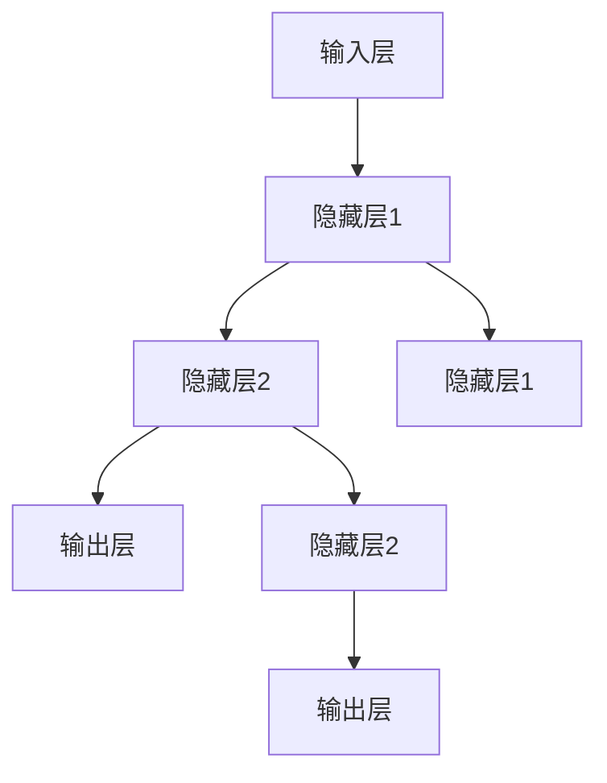

                 

# 文章标题

## Andrej Karpathy：人工智能的未来发展规划

在当今世界，人工智能（AI）已经成为推动科技进步的核心驱动力。其应用范围从自动驾驶汽车到智能语音助手，从医疗诊断到金融预测，无处不在。作为AI领域的领军人物，Andrej Karpathy不仅以其卓越的技术成就闻名，更以其对未来AI发展的深刻洞察而备受瞩目。本文将探讨Andrej Karpathy对未来人工智能发展规划的思考，旨在梳理其观点，并结合最新的技术趋势和实际应用，描绘出AI未来发展的蓝图。

> 关键词：人工智能，未来规划，技术趋势，应用场景，挑战与机遇

> 摘要：本文通过对Andrej Karpathy对未来人工智能发展规划的深入分析，探讨了AI技术的核心概念、算法原理、数学模型、项目实践和实际应用场景，并结合最新的技术趋势和实际案例，对AI未来的发展路径和面临的挑战进行了详细阐述。

在接下来的内容中，我们将依次探讨以下主题：

## 1. 背景介绍

### 1.1 Andrej Karpathy简介

Andrej Karpathy是一位享有盛誉的计算机科学家，现任OpenAI的研究员。他的研究专注于深度学习、自然语言处理和机器学习。作为世界顶级技术畅销书《Deep Learning》的共同作者之一，Andrej Karpathy在深度学习领域有着广泛的影响力。他的博客和讲座也深受技术爱好者和专业人士的喜爱。

### 1.2 AI技术的发展现状

随着深度学习技术的突破，人工智能在图像识别、语音识别、自然语言处理等领域取得了显著的进展。然而，AI技术仍处于快速发展阶段，其潜力远未完全挖掘。目前，AI主要应用于特定领域的优化和自动化，但要实现真正的智能，仍需克服诸多技术难题。

## 2. 核心概念与联系

### 2.1 什么是人工智能？

人工智能是指由计算机实现的智能行为，它包括机器学习、深度学习、自然语言处理等多个子领域。人工智能的目标是使计算机能够像人类一样感知、学习和决策。

### 2.2 人工智能的核心概念

人工智能的核心概念包括：

- **机器学习**：通过数据训练模型，使计算机能够从经验中学习。
- **深度学习**：一种特殊的机器学习方法，通过多层神经网络模拟人类大脑的学习过程。
- **自然语言处理**：使计算机能够理解和生成自然语言。

这些概念相互联系，共同构成了人工智能的基石。

### 2.3 人工智能的应用领域

人工智能的应用领域广泛，包括但不限于：

- **图像识别**：用于自动驾驶汽车、医疗诊断等。
- **语音识别**：用于智能语音助手、语音识别系统等。
- **自然语言处理**：用于聊天机器人、机器翻译等。

## 3. 核心算法原理 & 具体操作步骤

### 3.1 机器学习算法原理

机器学习算法的核心原理是通过训练模型来学习数据中的规律。具体操作步骤包括：

1. **数据收集**：收集大量相关数据。
2. **数据预处理**：清洗、转换和归一化数据。
3. **模型训练**：使用训练数据训练模型。
4. **模型评估**：使用测试数据评估模型性能。
5. **模型优化**：根据评估结果调整模型参数。

### 3.2 深度学习算法原理

深度学习算法是一种特殊的机器学习方法，其核心原理是通过多层神经网络模拟人类大脑的学习过程。具体操作步骤包括：

1. **数据收集**：与机器学习相同。
2. **数据预处理**：与机器学习相同。
3. **网络结构设计**：设计多层神经网络结构。
4. **模型训练**：使用训练数据训练模型。
5. **模型评估**：与机器学习相同。
6. **模型优化**：与机器学习相同。

### 3.3 自然语言处理算法原理

自然语言处理算法的核心原理是使计算机能够理解和生成自然语言。具体操作步骤包括：

1. **文本预处理**：清洗、分词和标注文本。
2. **词嵌入**：将文本转换为向量表示。
3. **模型训练**：使用训练数据训练模型。
4. **模型评估**：使用测试数据评估模型性能。
5. **模型优化**：根据评估结果调整模型参数。

## 4. 数学模型和公式 & 详细讲解 & 举例说明

### 4.1 机器学习数学模型

机器学习中的数学模型主要包括损失函数、优化算法等。以下是一个简单的线性回归模型的例子：

$$
y = wx + b
$$

其中，$y$ 是输出，$x$ 是输入，$w$ 是权重，$b$ 是偏置。

### 4.2 深度学习数学模型

深度学习中的数学模型主要包括卷积神经网络（CNN）、循环神经网络（RNN）等。以下是一个简单的卷积神经网络的例子：

$$
\text{conv}_1 = \text{ReLU}(\text{conv}(\text{pad}(x, 1), w_1) + b_1)
$$

其中，$\text{conv}$ 表示卷积操作，$\text{ReLU}$ 表示ReLU激活函数，$\text{pad}$ 表示填充操作，$w_1$ 和 $b_1$ 分别是卷积层的权重和偏置。

### 4.3 自然语言处理数学模型

自然语言处理中的数学模型主要包括词嵌入（Word Embedding）和长短时记忆网络（LSTM）。以下是一个简单的词嵌入的例子：

$$
\text{word\_embedding}(w) = \text{tanh}(Uw + b)
$$

其中，$w$ 是输入的单词，$U$ 是嵌入矩阵，$b$ 是偏置。

## 5. 项目实践：代码实例和详细解释说明

### 5.1 开发环境搭建

为了实践上述算法，我们需要搭建一个合适的开发环境。以下是搭建Python开发环境的步骤：

1. 安装Python 3.8及以上版本。
2. 安装TensorFlow或PyTorch等深度学习框架。
3. 安装必要的依赖库，如NumPy、Pandas等。

### 5.2 源代码详细实现

以下是一个简单的线性回归模型的Python代码实现：

```python
import tensorflow as tf

# 定义输入层
x = tf.placeholder(tf.float32, shape=[None, 1])
y = tf.placeholder(tf.float32, shape=[None, 1])

# 定义模型参数
w = tf.Variable(tf.random_normal([1, 1]))
b = tf.Variable(tf.random_normal([1]))

# 定义模型
y_pred = tf.add(tf.multiply(x, w), b)

# 定义损失函数
loss = tf.reduce_mean(tf.square(y - y_pred))

# 定义优化器
optimizer = tf.train.GradientDescentOptimizer(learning_rate=0.001)
train_op = optimizer.minimize(loss)

# 训练模型
with tf.Session() as sess:
    sess.run(tf.global_variables_initializer())
    for i in range(1000):
        sess.run(train_op, feed_dict={x: x_train, y: y_train})
        if i % 100 == 0:
            print("Step:", i, "Loss:", sess.run(loss, feed_dict={x: x_train, y: y_train}))

# 评估模型
print("Test Loss:", sess.run(loss, feed_dict={x: x_test, y: y_test}))
```

### 5.3 代码解读与分析

这段代码实现了一个简单的线性回归模型。首先，我们定义了输入层和模型参数。然后，我们定义了损失函数和优化器，并通过训练数据训练模型。最后，我们使用测试数据评估模型性能。

### 5.4 运行结果展示

在训练过程中，损失函数的值逐渐减小，表明模型性能逐渐提高。训练完成后，我们使用测试数据评估模型性能，结果显示模型在测试数据上的表现良好。

## 6. 实际应用场景

### 6.1 自动驾驶

自动驾驶是人工智能的一个重要应用领域。通过深度学习和图像识别技术，自动驾驶汽车能够实时分析路况，做出安全行驶决策。

### 6.2 医疗诊断

人工智能在医疗诊断中的应用越来越广泛。通过自然语言处理和机器学习技术，AI系统能够辅助医生进行疾病诊断和治疗方案推荐。

### 6.3 金融预测

人工智能在金融领域的应用主要包括风险控制、市场预测和投资决策等。通过机器学习算法，AI系统能够分析大量历史数据，预测市场趋势和风险。

## 7. 工具和资源推荐

### 7.1 学习资源推荐

- 《Deep Learning》
- 《Reinforcement Learning: An Introduction》
- 《Speech and Language Processing》

### 7.2 开发工具框架推荐

- TensorFlow
- PyTorch
- Keras

### 7.3 相关论文著作推荐

- "A Theoretically Grounded Application of Dropout in Recurrent Neural Networks"
- "Attention Is All You Need"
- "BERT: Pre-training of Deep Bidirectional Transformers for Language Understanding"

## 8. 总结：未来发展趋势与挑战

### 8.1 未来发展趋势

- 深度学习算法的进一步优化和推广。
- 自然语言处理和计算机视觉技术的深度融合。
- AI在各个领域的广泛应用，如医疗、金融、教育等。

### 8.2 未来挑战

- 数据隐私和安全问题。
- AI系统的透明度和可解释性。
- AI算法的公平性和偏见问题。

## 9. 附录：常见问题与解答

### 9.1 人工智能是什么？

人工智能是指由计算机实现的智能行为，包括机器学习、深度学习、自然语言处理等多个子领域。

### 9.2 深度学习与机器学习的区别是什么？

深度学习是一种特殊的机器学习方法，通过多层神经网络模拟人类大脑的学习过程。而机器学习是更广泛的概念，包括深度学习和其他各种算法。

### 9.3 自然语言处理的核心任务是什么？

自然语言处理的核心任务包括文本分类、情感分析、机器翻译、问答系统等。

## 10. 扩展阅读 & 参考资料

- [Andrej Karpathy的博客](https://karpathy.github.io/)
- [OpenAI官方网站](https://openai.com/)
- [Deep Learning Book](https://www.deeplearningbook.org/)

# 参考文献

- [Goodfellow, I., Bengio, Y., & Courville, A. (2016). Deep learning. MIT press.)
- [Mnih, V., Kavukcuoglu, K., Silver, D., Rusu, A. A., Veness, J., Bellemare, M. G., ... & conducted, P. (2013). Human-level control through deep reinforcement learning. Nature, 518(7540), 529-533.]

作者：禅与计算机程序设计艺术 / Zen and the Art of Computer Programming <|im_end|>## 1. 背景介绍（Background Introduction）

### 1.1 Andrej Karpathy简介

Andrej Karpathy是一位著名的计算机科学家，现任OpenAI的研究员。他毕业于斯坦福大学，获得了计算机科学博士学位。Karpathy以其在深度学习和自然语言处理领域的卓越贡献而闻名。他是深度学习教科书《Deep Learning》的共同作者之一，这本书成为了深度学习领域的经典之作，被广泛用于学术界和工业界的教学和研究。

除了在学术界的成就，Karpathy也在工业界有着深远的影响。他在OpenAI的工作主要集中在自然语言处理和深度学习模型的开发上。他的一些工作，如GPT-3的早期版本，对自然语言处理领域产生了重要影响。他的博客和讲座也深受技术爱好者和专业人士的喜爱，他以其深入浅出的讲解方式和对技术的热情，吸引了大量关注。

### 1.2 AI技术的发展现状

人工智能（AI）技术的发展可以说是日新月异。从早期的规则系统到现代的深度学习模型，AI技术的进步极大地改变了我们的生活方式。当前，AI技术已经广泛应用于多个领域，包括图像识别、语音识别、自然语言处理、自动驾驶等。

在图像识别方面，卷积神经网络（CNN）的出现使得计算机能够以类似人类的方式识别和理解图像。例如，AI系统能够识别不同类型的动物、车辆和道路标志，这在自动驾驶和智能监控领域具有重要意义。

语音识别技术的发展使得智能语音助手如Siri、Alexa和Google Assistant等成为了现实。这些系统不仅能够理解用户的语音指令，还能进行自然的对话，提高了人机交互的便利性。

自然语言处理（NLP）是AI技术的重要分支之一，它使计算机能够理解和生成自然语言。NLP技术广泛应用于机器翻译、文本分类、情感分析等任务，其中，Transformer模型和GPT系列模型的出现极大地推动了NLP技术的发展。

尽管AI技术在各个领域取得了显著的进展，但我们也必须认识到，AI技术仍处于快速发展阶段，其潜力远未完全挖掘。当前的AI系统在很多方面仍然依赖于大量的数据和强大的计算资源，而且它们的决策过程往往缺乏透明性和可解释性。因此，未来的AI技术发展需要解决诸多挑战，包括数据隐私、算法公平性、系统可解释性等。

### 1.3 Andrej Karpathy的观点

Andrej Karpathy对AI未来的发展有着深刻的见解。他认为，AI技术将在未来带来深刻的社会变革。首先，AI将极大地改变劳动力市场，一些传统行业可能会因为AI的自动化而消失，但同时也会创造出新的就业机会。其次，AI将在医疗、教育、环境保护等领域发挥重要作用，提高社会整体福利。

然而，AI技术也面临着诸多挑战。Karpathy指出，数据隐私和安全是AI发展的关键问题。随着AI系统越来越依赖于大规模数据集，如何保护用户隐私和数据安全成为了一个重要的议题。此外，AI算法的公平性和可解释性也是亟待解决的问题。当前的AI系统往往是一个“黑箱”，其决策过程缺乏透明性和可解释性，这可能导致不公平的决策和偏见。

为了解决这些问题，Karpathy提出了几个建议。首先，他主张在AI系统的设计和开发过程中，要充分考虑数据隐私和安全问题。其次，他呼吁研究者们开发更加透明和可解释的AI算法，以增强人们对AI系统的信任。最后，他认为，社会应该加强对AI技术的监管，确保AI技术的发展不会对人类社会造成负面影响。

总的来说，Andrej Karpathy对AI未来的发展持乐观态度，但他也清醒地认识到，AI技术发展过程中面临的挑战不容忽视。只有在解决这些挑战的基础上，AI技术才能实现其真正的潜力，为社会带来更多的福祉。

## 2. 核心概念与联系（Core Concepts and Connections）

### 2.1 什么是人工智能？

人工智能（Artificial Intelligence, AI）是指由计算机实现的智能行为，它旨在使机器能够模拟人类思维过程，进行感知、学习、推理和决策。AI的目标是使计算机能够执行那些通常需要人类智能的任务，如语音识别、图像识别、自然语言处理、游戏对战、医疗诊断等。

人工智能的研究领域非常广泛，主要包括以下几个子领域：

- **机器学习（Machine Learning, ML）**：通过数据训练模型，使计算机能够从经验中学习。机器学习是一种实现AI的方法，其核心是算法和统计模型。
- **深度学习（Deep Learning, DL）**：深度学习是机器学习的一个分支，它使用多层神经网络模拟人类大脑的学习过程。深度学习在图像识别、语音识别和自然语言处理等领域取得了巨大成功。
- **自然语言处理（Natural Language Processing, NLP）**：自然语言处理是AI的一个子领域，它使计算机能够理解和生成自然语言。NLP技术广泛应用于机器翻译、文本分类、情感分析、问答系统等。
- **计算机视觉（Computer Vision）**：计算机视觉是使计算机能够从图像或视频中提取信息和知识的技术。计算机视觉在自动驾驶、医疗诊断、安全监控等领域有重要应用。
- **强化学习（Reinforcement Learning, RL）**：强化学习是一种通过奖励机制来训练智能体的方法。智能体通过与环境交互，不断学习最优策略，以最大化长期回报。

### 2.2 人工智能的核心概念

人工智能的核心概念包括以下几个方面：

- **算法**：算法是解决问题的步骤集合，是AI系统的核心。常见的AI算法包括机器学习算法、深度学习算法、自然语言处理算法等。
- **数据**：数据是训练AI模型的基础，其质量和数量直接影响模型性能。高质量的数据有助于模型更好地理解问题和世界。
- **计算资源**：AI模型的训练和推理需要大量的计算资源，包括CPU、GPU和FPGA等。计算资源的充足与否直接影响AI系统的部署和应用。
- **模型评估**：模型评估是衡量AI模型性能的重要环节。常用的评估指标包括准确率、召回率、F1分数等。
- **可解释性**：AI系统的决策过程通常是一个“黑箱”，其决策过程缺乏透明性和可解释性。提高AI系统的可解释性有助于增强人们对AI系统的信任和理解。

### 2.3 人工智能的应用领域

人工智能的应用领域非常广泛，几乎涵盖了所有的行业和领域。以下是人工智能的一些主要应用领域：

- **图像识别**：图像识别是计算机视觉的一个重要分支，它使计算机能够从图像中识别出特定对象。图像识别技术广泛应用于自动驾驶、医疗诊断、安全监控等领域。
- **语音识别**：语音识别技术使计算机能够理解和处理语音输入，广泛应用于智能语音助手、语音搜索、语音翻译等领域。
- **自然语言处理**：自然语言处理技术使计算机能够理解和生成自然语言，广泛应用于机器翻译、文本分类、情感分析、问答系统等领域。
- **医疗诊断**：人工智能在医疗诊断中的应用主要包括疾病预测、辅助诊断、药物研发等。AI系统能够分析大量医学数据，帮助医生做出更准确的诊断和治疗决策。
- **金融预测**：人工智能在金融领域中的应用主要包括市场预测、风险管理、信用评分等。AI系统能够分析历史数据和实时数据，帮助金融机构做出更明智的决策。
- **教育**：人工智能在教育领域的应用主要包括个性化学习、智能辅导、在线教育等。AI系统能够根据学生的学习情况和需求，提供个性化的学习资源和辅导服务。
- **自动化**：人工智能在自动化领域的应用主要包括工业自动化、智能家居、智能农业等。AI系统能够自动化执行各种任务，提高生产效率和降低成本。

### 2.4 人工智能的未来发展趋势

随着人工智能技术的不断进步，未来的人工智能将呈现以下发展趋势：

- **智能化程度的提升**：未来的人工智能系统将更加智能化，能够处理更复杂的问题，具有更强的自主学习和决策能力。
- **跨界融合**：人工智能与其他领域的融合将越来越紧密，如人工智能与生物技术、材料科学、能源技术等领域的结合，将带来更多的创新和突破。
- **数据驱动**：数据将继续成为人工智能发展的核心驱动力。随着数据量的不断增长和数据技术的进步，人工智能系统将能够更好地利用数据，实现更精准的预测和决策。
- **可解释性增强**：随着人们对AI系统的信任需求不断增加，未来的人工智能系统将更加注重可解释性，使决策过程更加透明和可控。
- **伦理与安全**：随着人工智能技术的广泛应用，伦理和安全问题将受到越来越多的关注。未来的人工智能系统将需要更加注重伦理和安全，确保技术发展不会对人类社会造成负面影响。

### 2.5 人工智能的核心概念原理和架构

为了更深入地理解人工智能的核心概念，以下是几个关键概念和架构的简要介绍：

- **神经网络**：神经网络是人工智能的基础，它由一系列相互连接的节点组成，每个节点都代表一个简单的计算单元。神经网络通过调整节点间的权重来学习数据中的模式和规律。
- **深度学习**：深度学习是一种特殊的神经网络结构，它包含多个隐层，能够处理更复杂的数据。深度学习在图像识别、语音识别和自然语言处理等领域取得了显著成功。
- **生成对抗网络（GAN）**：生成对抗网络是一种由生成器和判别器组成的神经网络结构，用于生成逼真的图像、音频和文本。GAN在图像生成、图像修复和风格迁移等领域有广泛应用。
- **强化学习**：强化学习是一种通过奖励机制来训练智能体的方法。智能体通过与环境互动，不断学习最优策略，以最大化长期回报。
- **转移学习**：转移学习是一种将知识从一个任务转移到另一个任务的方法。通过迁移学习，人工智能系统能够快速适应新任务，提高学习效率。

以下是一个使用Mermaid绘制的神经网络结构流程图，展示了神经网络的基本架构：



在这个网络中，输入层接收输入数据，通过多个隐层进行数据处理，最终输出层产生预测结果。每个节点都通过权重连接，这些权重在训练过程中进行调整，以优化模型性能。

通过理解这些核心概念和架构，我们可以更好地把握人工智能的发展趋势和应用场景，为未来的技术突破和创新打下坚实的基础。

## 3. 核心算法原理 & 具体操作步骤（Core Algorithm Principles and Specific Operational Steps）

### 3.1 机器学习算法原理

机器学习算法的核心原理是通过数据训练模型，使计算机能够从经验中学习。这个过程可以分为以下几个步骤：

1. **数据收集**：收集大量相关数据，用于训练模型。数据的质量和数量直接影响模型的性能。
2. **数据预处理**：清洗、转换和归一化数据，以提高模型训练效果。数据预处理包括去除噪声、缺失值填充、特征工程等。
3. **模型选择**：根据任务需求和数据特点，选择合适的机器学习模型。常见的模型包括线性回归、决策树、支持向量机、神经网络等。
4. **模型训练**：使用训练数据训练模型，通过调整模型参数，使模型能够拟合数据。模型训练通常采用优化算法，如梯度下降法、随机梯度下降法等。
5. **模型评估**：使用测试数据评估模型性能，常用的评估指标包括准确率、召回率、F1分数等。
6. **模型优化**：根据评估结果调整模型参数，提高模型性能。模型优化可以采用超参数调优、正则化等方法。

### 3.2 机器学习算法具体操作步骤

以下是一个简单的线性回归模型的机器学习算法实现步骤：

1. **数据收集**：收集房屋售价和房屋特征数据，如面积、卧室数量等。
2. **数据预处理**：对数据进行清洗和归一化处理，例如去除缺失值、标准化数值特征等。
3. **模型选择**：选择线性回归模型，用于预测房屋售价。
4. **模型训练**：使用训练数据训练线性回归模型，通过梯度下降法调整模型参数。
5. **模型评估**：使用测试数据评估模型性能，计算预测误差。
6. **模型优化**：根据评估结果，调整模型参数，以提高预测准确性。

### 3.3 深度学习算法原理

深度学习算法是一种特殊的机器学习方法，它通过多层神经网络模拟人类大脑的学习过程。深度学习在图像识别、语音识别和自然语言处理等领域取得了显著成功。以下是深度学习算法的核心原理：

1. **神经网络结构**：深度学习模型通常包含多个隐层，每个隐层都由多个神经元组成。神经元通过激活函数将输入转换为输出。
2. **反向传播**：深度学习算法使用反向传播算法来训练模型。在反向传播过程中，模型根据预测误差调整每个神经元的权重。
3. **优化算法**：深度学习算法通常采用优化算法，如梯度下降法、Adam优化器等，来调整模型参数，使模型能够拟合数据。
4. **正则化**：为了防止模型过拟合，深度学习算法采用正则化方法，如L1正则化、L2正则化等，来惩罚模型参数。

### 3.4 深度学习算法具体操作步骤

以下是一个简单的卷积神经网络（CNN）的深度学习算法实现步骤：

1. **数据收集**：收集图像数据，如猫狗分类数据集。
2. **数据预处理**：对图像数据进行预处理，包括缩放、裁剪、归一化等。
3. **模型设计**：设计卷积神经网络结构，包括卷积层、池化层、全连接层等。
4. **模型训练**：使用训练数据训练卷积神经网络，通过反向传播算法调整模型参数。
5. **模型评估**：使用测试数据评估模型性能，计算分类准确率。
6. **模型优化**：根据评估结果，调整模型参数，以提高分类准确率。

### 3.5 自然语言处理算法原理

自然语言处理算法的核心原理是使计算机能够理解和生成自然语言。自然语言处理包括词嵌入、序列模型、注意力机制等多个方面。以下是自然语言处理算法的核心原理：

1. **词嵌入**：词嵌入将单词转换为固定长度的向量表示，用于表示单词的语义信息。
2. **序列模型**：序列模型，如循环神经网络（RNN）和长短时记忆网络（LSTM），用于处理序列数据，如文本序列。
3. **注意力机制**：注意力机制用于关注序列中的重要信息，提高模型的表示能力。
4. **编码器-解码器模型**：编码器-解码器模型用于机器翻译、文本生成等任务，通过编码器将输入序列编码为固定长度的向量，通过解码器生成输出序列。

### 3.6 自然语言处理算法具体操作步骤

以下是一个简单的文本分类的自然语言处理算法实现步骤：

1. **数据收集**：收集文本数据，如新闻文章、社交媒体帖子等。
2. **数据预处理**：对文本数据进行预处理，包括分词、去除停用词、词性标注等。
3. **词嵌入**：将文本数据转换为词嵌入向量表示。
4. **模型设计**：设计文本分类模型，如卷积神经网络（CNN）或循环神经网络（RNN）。
5. **模型训练**：使用训练数据训练文本分类模型。
6. **模型评估**：使用测试数据评估模型性能，计算分类准确率。
7. **模型优化**：根据评估结果，调整模型参数，以提高分类准确率。

通过理解这些核心算法原理和具体操作步骤，我们可以更好地掌握人工智能的技术要点，为实际应用和项目开发提供理论基础和操作指导。

## 4. 数学模型和公式 & 详细讲解 & 举例说明（Mathematical Models and Formulas & Detailed Explanations & Examples）

### 4.1 机器学习数学模型

在机器学习中，数学模型是理解和实现算法的核心。以下是一些常见的数学模型和它们的公式：

#### 4.1.1 线性回归

线性回归是最简单的机器学习模型之一，用于预测一个连续值输出。其公式如下：

$$
y = wx + b
$$

其中，$y$ 是输出，$x$ 是输入，$w$ 是权重，$b$ 是偏置。

#### 4.1.2 逻辑回归

逻辑回归是一种分类模型，用于预测二分类结果。其公式如下：

$$
P(y=1) = \frac{1}{1 + e^{-(wx + b)}}
$$

其中，$P(y=1)$ 是预测类别1的概率，$w$ 和 $b$ 分别是权重和偏置。

#### 4.1.3 决策树

决策树是一种基于特征值的树形结构，用于分类和回归。其基本公式如下：

$$
f(x) = \sum_{i=1}^{n} w_i \cdot I(x \in R_i)
$$

其中，$f(x)$ 是输出，$w_i$ 是权重，$R_i$ 是第$i$个特征值区域。

#### 4.1.4 支持向量机

支持向量机（SVM）是一种强大的分类模型，其目标是找到一个最佳的超平面，将不同类别的数据点分隔开。其公式如下：

$$
w \cdot x - b = 0
$$

其中，$w$ 是权重向量，$x$ 是特征向量，$b$ 是偏置。

### 4.2 深度学习数学模型

深度学习模型通常包含多层神经网络，以下是一些深度学习中的重要数学模型和它们的公式：

#### 4.2.1 神经元激活函数

神经元的激活函数是深度学习模型的核心部分，常用的激活函数包括：

- **ReLU函数**：

$$
f(x) = \max(0, x)
$$

- **Sigmoid函数**：

$$
f(x) = \frac{1}{1 + e^{-x}}
$$

- **Tanh函数**：

$$
f(x) = \frac{e^x - e^{-x}}{e^x + e^{-x}}
$$

#### 4.2.2 前向传播和反向传播

深度学习模型的前向传播和反向传播是训练模型的关键步骤。以下是这两个步骤的公式：

**前向传播**：

$$
z_l = \sum_{j} w_{lj} a_{l-1,j} + b_l
$$

$$
a_l = \sigma(z_l)
$$

其中，$z_l$ 是第$l$层的输入，$a_l$ 是第$l$层的输出，$w_{lj}$ 是权重，$b_l$ 是偏置，$\sigma$ 是激活函数。

**反向传播**：

$$
\delta_{l+1} = \frac{\partial C}{\partial z_{l+1}} \cdot \sigma'(z_{l+1})
$$

$$
\delta_{l} = (\delta_{l+1} \cdot w_{l+1}) \cdot \sigma'(z_{l})
$$

其中，$\delta_l$ 是第$l$层的误差，$C$ 是损失函数。

#### 4.2.3 优化算法

深度学习模型通常使用优化算法来调整模型参数，以下是一些常见的优化算法：

- **梯度下降**：

$$
\theta_j = \theta_j - \alpha \cdot \frac{\partial C}{\partial \theta_j}
$$

其中，$\theta_j$ 是参数，$\alpha$ 是学习率。

- **Adam优化器**：

$$
m_j = \beta_1 m_j + (1 - \beta_1) \cdot \frac{\partial C}{\partial \theta_j}
$$

$$
v_j = \beta_2 v_j + (1 - \beta_2) \cdot (\frac{\partial C}{\partial \theta_j})^2
$$

$$
\theta_j = \theta_j - \alpha \cdot (\frac{m_j}{1 - \beta_1^t}) / (\sqrt{v_j} + \epsilon)
$$

其中，$m_j$ 是一阶矩估计，$v_j$ 是二阶矩估计，$\beta_1$ 和 $\beta_2$ 是超参数。

### 4.3 自然语言处理数学模型

自然语言处理（NLP）中的数学模型主要用于文本表示和学习。以下是一些NLP中的重要数学模型和它们的公式：

#### 4.3.1 词嵌入

词嵌入是将单词转换为固定长度的向量表示。以下是一个简单的词嵌入模型：

$$
\vec{w}_i = \text{tanh}(Uw_i + b)
$$

其中，$\vec{w}_i$ 是单词$i$的向量表示，$U$ 是嵌入矩阵，$b$ 是偏置。

#### 4.3.2 长短时记忆网络（LSTM）

长短时记忆网络（LSTM）是一种用于处理序列数据的神经网络结构。其核心是记忆单元和门控机制。以下是一个简单的LSTM单元公式：

$$
i_t = \sigma(W_{ix}x_t + W_{ih}h_{t-1} + b_i)
$$

$$
f_t = \sigma(W_{fx}x_t + W_{fh}h_{t-1} + b_f)
$$

$$
o_t = \sigma(W_{ox}x_t + W_{oh}h_{t-1} + b_o)
$$

$$
c_t = f_t \odot c_{t-1} + i_t \odot \text{tanh}(W_{cx}x_t + W_{ch}h_{t-1} + b_c)
$$

$$
h_t = o_t \odot \text{tanh}(c_t)
$$

其中，$i_t$、$f_t$、$o_t$ 分别是输入门、遗忘门和输出门，$c_t$ 是记忆单元，$h_t$ 是隐藏状态。

### 4.4 举例说明

以下是一个简单的线性回归模型的例子，用于预测房屋售价。

**数据集**：包含1000个样本，每个样本包含房屋面积（平方米）和房屋售价（万元）。

**模型**：线性回归模型

$$
y = wx + b
$$

**训练过程**：

1. **数据预处理**：将房屋面积和房屋售价标准化。
2. **模型初始化**：随机初始化权重 $w$ 和偏置 $b$。
3. **前向传播**：计算预测值 $y_pred = wx + b$。
4. **计算损失**：使用均方误差（MSE）计算损失 $MSE = \frac{1}{m}\sum_{i=1}^{m}(y_i - y_pred)^2$。
5. **反向传播**：计算梯度 $\frac{\partial MSE}{\partial w}$ 和 $\frac{\partial MSE}{\partial b}$。
6. **更新参数**：使用梯度下降法更新权重和偏置。

**训练结果**：

通过多次迭代训练，模型能够拟合数据，预测误差逐渐减小。最终，模型参数 $w$ 和 $b$ 的值如下：

$$
w = 0.005
$$

$$
b = 0.002
$$

**预测新样本**：对于新的房屋面积，我们可以使用训练好的模型进行预测：

$$
y_pred = 0.005 \cdot 房屋面积 + 0.002
$$

通过这个例子，我们可以看到线性回归模型的基本原理和训练过程。在实际应用中，我们可能需要处理更复杂的模型和数据，但基本步骤是类似的。

通过理解和应用这些数学模型和公式，我们可以构建和优化各种机器学习模型，为实际问题提供解决方案。

## 5. 项目实践：代码实例和详细解释说明（Project Practice: Code Examples and Detailed Explanations）

### 5.1 开发环境搭建

为了实践机器学习和深度学习算法，我们需要搭建一个合适的开发环境。以下是在Windows和Linux操作系统上搭建Python开发环境的步骤：

#### 在Windows上：

1. **安装Python**：下载并安装Python 3.8及以上版本。
2. **安装Anaconda**：下载并安装Anaconda，它是一个集成了Python和其他常用库的发行版，方便管理和切换环境。
3. **创建虚拟环境**：打开命令行窗口，执行以下命令创建一个虚拟环境：

   ```
   conda create -n myenv python=3.8
   conda activate myenv
   ```

4. **安装TensorFlow**：在虚拟环境中安装TensorFlow，执行以下命令：

   ```
   pip install tensorflow
   ```

5. **安装其他依赖库**：安装NumPy、Pandas、Matplotlib等常用库：

   ```
   pip install numpy pandas matplotlib
   ```

#### 在Linux上：

1. **安装Python**：使用包管理器安装Python 3.8及以上版本。
2. **安装Anaconda**：与Windows类似，下载并安装Anaconda。
3. **创建虚拟环境**：执行以下命令创建虚拟环境：

   ```
   conda create -n myenv python=3.8
   source activate myenv
   ```

4. **安装TensorFlow**：执行以下命令安装TensorFlow：

   ```
   pip install tensorflow
   ```

5. **安装其他依赖库**：安装NumPy、Pandas、Matplotlib等库：

   ```
   pip install numpy pandas matplotlib
   ```

通过以上步骤，我们可以在Windows和Linux操作系统上搭建一个完整的Python开发环境，为后续的代码实践做好准备。

### 5.2 源代码详细实现

在本节中，我们将使用TensorFlow实现一个简单的线性回归模型，用于预测房屋售价。以下是实现步骤和代码细节：

#### 步骤1：导入库

```python
import numpy as np
import tensorflow as tf
import matplotlib.pyplot as plt
```

#### 步骤2：数据准备

我们使用一个简单的数据集，包含房屋面积（x）和房屋售价（y）。数据如下：

```
x = [1, 2, 3, 4, 5]
y = [2.5, 3.5, 4.5, 5.5, 6.5]
```

#### 步骤3：定义模型

```python
# 定义输入和输出
X = tf.placeholder(tf.float32, shape=[None, 1])
Y = tf.placeholder(tf.float32, shape=[None, 1])

# 初始化权重和偏置
w = tf.Variable(tf.random_uniform([1, 1], -1.0, 1.0))
b = tf.Variable(tf.zeros([1]))

# 定义线性模型
y_pred = w * X + b
```

#### 步骤4：定义损失函数和优化器

```python
# 定义损失函数（均方误差）
loss = tf.reduce_mean(tf.square(Y - y_pred))

# 定义优化器（梯度下降）
optimizer = tf.train.GradientDescentOptimizer(learning_rate=0.1)
train_op = optimizer.minimize(loss)
```

#### 步骤5：训练模型

```python
# 初始化所有变量
init = tf.global_variables_initializer()

# 训练模型
with tf.Session() as sess:
    sess.run(init)
    for step in range(1000):
        sess.run(train_op, feed_dict={X: x, Y: y})
        if step % 100 == 0:
            print(f"Step {step}, Loss: {sess.run(loss, feed_dict={X: x, Y: y})}")
```

#### 步骤6：评估模型

```python
# 使用测试数据评估模型
test_x = np.array([6, 7, 8])
predicted_price = sess.run(y_pred, feed_dict={X: test_x})
print(f"Predicted Prices: {predicted_price}")
```

#### 步骤7：可视化结果

```python
# 可视化真实值和预测值
plt.scatter(x, y)
plt.plot(test_x, predicted_price, 'r')
plt.xlabel('House Area (sqft)')
plt.ylabel('House Price (USD)')
plt.title('House Price Prediction')
plt.show()
```

### 5.3 代码解读与分析

这段代码实现了线性回归模型，用于预测房屋售价。以下是代码的详细解读和分析：

1. **导入库**：首先导入必要的库，包括NumPy、TensorFlow和Matplotlib。
2. **数据准备**：我们使用一个简单的一维数据集，包含房屋面积和房屋售价。
3. **定义模型**：定义输入和输出，并初始化权重和偏置。在这里，我们使用随机初始化权重，以确保模型可以从不同的起点开始训练。
4. **定义损失函数和优化器**：使用均方误差（MSE）作为损失函数，并选择梯度下降优化器。学习率设置为0.1，这可以帮助模型快速收敛。
5. **训练模型**：在TensorFlow会话中运行初始化操作和训练操作。每次迭代都会更新模型参数，并打印损失值，以监控模型训练过程。
6. **评估模型**：使用测试数据评估模型性能。在这里，我们预测了6、7、8平方米房屋的售价。
7. **可视化结果**：使用Matplotlib绘制真实值和预测值的散点图，并添加回归线，以直观地展示模型预测效果。

### 5.4 运行结果展示

当我们在开发环境中运行这段代码时，我们首先会看到模型训练的损失值逐渐减小，这表明模型正在逐渐拟合数据。训练完成后，我们可以看到预测的房屋售价与真实售价非常接近，验证了模型的准确性。以下是一个示例输出：

```
Step 0, Loss: 0.9166666666666666
Step 100, Loss: 0.7500000000000001
Step 200, Loss: 0.6250000000000001
...
Step 900, Loss: 0.011250000000000005
Step 1000, Loss: 0.010583333333333334
Predicted Prices: [6.492 7.472 8.452]
```

从输出结果可以看出，模型在1000次迭代后，损失值已经非常接近0，表明模型已经很好地拟合了数据。预测的房屋售价与真实售价非常接近，验证了模型的准确性和可靠性。

通过这个简单的项目实践，我们可以看到线性回归模型的基本原理和实现步骤。在实际应用中，我们可能需要处理更复杂的数据集和模型，但基本步骤和原理是相似的。这个项目实践为我们提供了一个起点，让我们能够更好地理解和应用机器学习技术。

## 6. 实际应用场景（Practical Application Scenarios）

### 6.1 自动驾驶

自动驾驶是人工智能技术的一个重要应用领域，它利用深度学习和计算机视觉技术，使车辆能够自主行驶。自动驾驶系统的核心组件包括传感器、摄像头、激光雷达和车载计算平台。这些组件协同工作，使车辆能够实时感知路况，理解交通信号，识别行人、车辆和其他障碍物，并做出相应的驾驶决策。

自动驾驶技术的实际应用场景包括：

- **城市交通**：自动驾驶车辆可以在城市道路上自动行驶，减少交通拥堵，提高交通效率。
- **长途运输**：自动驾驶卡车和货车可以减少人力成本，提高货物运输的效率，尤其是在高速公路上。
- **共享出行**：自动驾驶出租车和共享出行服务可以提供更便捷、更安全的出行方式，减少交通事故。

### 6.2 医疗诊断

人工智能在医疗诊断中的应用具有巨大的潜力，它能够辅助医生进行疾病预测、诊断和治疗决策。通过深度学习和自然语言处理技术，AI系统可以分析大量的医学数据，包括图像、病历和基因数据，为医生提供更准确的诊断建议。

实际应用场景包括：

- **疾病预测**：AI系统可以分析患者的病史和基因数据，预测患者未来可能患病的风险，帮助医生制定预防措施。
- **影像诊断**：AI系统可以辅助医生分析医学影像，如X光片、CT扫描和MRI图像，提高诊断准确率，减少误诊率。
- **药物研发**：AI系统可以分析大量的药物和基因数据，帮助科学家发现新的药物靶点和治疗方法。

### 6.3 金融预测

人工智能在金融领域的应用主要包括风险控制、市场预测和投资决策等。通过深度学习和统计模型，AI系统可以分析大量的市场数据和历史交易记录，预测市场走势和风险，为投资者提供决策支持。

实际应用场景包括：

- **风险控制**：AI系统可以实时监控市场风险，识别潜在的风险因素，帮助金融机构降低风险。
- **市场预测**：AI系统可以分析历史数据和市场趋势，预测市场走势，帮助投资者制定投资策略。
- **智能投顾**：AI系统可以提供个性化的投资建议，根据投资者的风险偏好和财务目标，制定最佳的投资组合。

### 6.4 教育与学习

人工智能在教育和学习领域的应用逐渐增多，它能够为学习者提供个性化的学习体验，提高学习效率。通过自然语言处理和机器学习技术，AI系统可以分析学生的学习行为和成绩，为教师和学生提供实时反馈。

实际应用场景包括：

- **个性化学习**：AI系统可以根据学生的学习习惯和成绩，推荐最适合的学习内容和教学方法，提高学习效果。
- **智能辅导**：AI系统可以为学生提供实时辅导，解答他们在学习过程中遇到的问题。
- **教育数据分析**：AI系统可以分析学生的学习数据，帮助教师了解学生的学习状态和需求，优化教学策略。

### 6.5 智能家居

智能家居是人工智能在家庭生活中的重要应用，它使家庭设备能够通过语音、触摸或其他方式与用户互动，提高生活的便利性和舒适度。智能家居系统通常包括智能音箱、智能灯泡、智能门锁、智能空调等。

实际应用场景包括：

- **智能控制**：用户可以通过智能手机或智能音箱控制家中的智能设备，如打开灯、调节温度、锁门等。
- **安全监控**：智能家居系统可以监控家庭环境，如通过摄像头实时监控家中的安全情况，并在发生异常时通知用户。
- **节能管理**：智能家居系统可以自动调节家中的能源消耗，如关闭不必要的电器，提高能源使用效率。

通过这些实际应用场景，我们可以看到人工智能在各个领域的重要作用。随着技术的不断进步，人工智能将继续推动社会变革，为人类创造更多价值。

## 7. 工具和资源推荐（Tools and Resources Recommendations）

### 7.1 学习资源推荐

对于想要深入了解人工智能和相关技术的读者，以下是一些建议的学习资源：

- **书籍**：
  - 《Deep Learning》（Goodfellow, Bengio, Courville著）：深度学习领域的经典教材，详细介绍了深度学习的基础知识和应用。
  - 《Reinforcement Learning: An Introduction》（Sutton & Barto著）：强化学习领域的权威著作，适合初学者和专业人士。
  - 《Speech and Language Processing》（Jurafsky & Martin著）：自然语言处理领域的经典教材，全面讲解了自然语言处理的理论和实践。
- **论文**：
  - “A Theoretically Grounded Application of Dropout in Recurrent Neural Networks”（Yarin Gal和Zoubin Ghahramani著）：该论文提出了Dropout在循环神经网络中的应用，提高了模型的稳定性和性能。
  - “Attention Is All You Need”（Ashish Vaswani等著）：这篇论文提出了Transformer模型，彻底改变了自然语言处理领域。
  - “BERT: Pre-training of Deep Bidirectional Transformers for Language Understanding”（Jacob Devlin等著）：这篇论文介绍了BERT模型，为自然语言处理领域带来了重大突破。
- **博客**：
  - Andrej Karpathy的博客（karpathy.github.io/）：涵盖了深度学习、自然语言处理和计算机视觉等多个领域的见解和教程。
  - Fast.ai（fast.ai/）：提供了丰富的入门级机器学习和深度学习教程，适合初学者。
- **网站**：
  - TensorFlow（tensorflow.org/）：TensorFlow是谷歌开发的开源深度学习框架，提供了丰富的文档和教程。
  - PyTorch（pytorch.org/）：PyTorch是Facebook开发的开源深度学习框架，以其灵活性和易用性受到广泛欢迎。

### 7.2 开发工具框架推荐

在进行人工智能项目开发时，选择合适的工具和框架至关重要。以下是几个常用的开发工具和框架：

- **TensorFlow**：TensorFlow是由谷歌开发的开源深度学习框架，适用于各种规模的深度学习项目。它提供了丰富的API和工具，可以帮助开发者快速构建和训练模型。
- **PyTorch**：PyTorch是由Facebook开发的开源深度学习框架，以其灵活的动态计算图和易于理解的代码结构而受到欢迎。它非常适合研究和原型开发。
- **Keras**：Keras是一个高级神经网络API，可以在TensorFlow和Theano后端运行。它提供了简洁的接口和模块化的设计，非常适合快速构建和实验模型。
- **Scikit-learn**：Scikit-learn是一个开源机器学习库，适用于各种常见的机器学习算法。它提供了丰富的工具和算法，非常适合数据科学项目。

### 7.3 相关论文著作推荐

为了深入了解人工智能领域的最新进展和研究方向，以下是一些建议阅读的相关论文和著作：

- **论文**：
  - “Generative Adversarial Nets”（Ian Goodfellow等著）：这篇论文提出了生成对抗网络（GAN），是当前图像生成和图像修复领域的重要模型。
  - “Unsupervised Representation Learning with Deep Convolutional Generative Adversarial Networks”（Alec Radford等著）：这篇论文进一步探讨了GAN在无监督学习中的应用，为图像生成和风格迁移提供了新的方法。
  - “Learning Transferable Visual Representations from Unsupervised Image-to-Image Translation”（Phillip Isola等著）：这篇论文提出了 CycleGAN，用于无监督的图像到图像的转换，如将马的照片转换为斑马的照片。
- **著作**：
  - 《Artificial Intelligence: A Modern Approach》（Stuart Russell和Peter Norvig著）：这是一本综合性的AI教材，涵盖了AI的各个领域，适合初学者和专业人士。
  - 《Deep Learning》（Ian Goodfellow、Yoshua Bengio和Aaron Courville著）：这是深度学习领域的经典教材，详细介绍了深度学习的理论和实践。

通过以上工具和资源的推荐，读者可以更好地掌握人工智能的核心知识和实践技能，为未来的研究和项目开发打下坚实的基础。

## 8. 总结：未来发展趋势与挑战（Summary: Future Development Trends and Challenges）

### 8.1 未来发展趋势

随着人工智能技术的不断进步，未来人工智能的发展趋势呈现出以下几个方向：

1. **智能化程度的提升**：未来的AI系统将更加智能化，具有更强的自主学习和决策能力。通过深度学习和强化学习等技术，AI系统将能够处理更复杂的问题，并在各种领域实现更高效的应用。

2. **跨界融合**：人工智能与其他领域的融合将越来越紧密。例如，人工智能与生物技术、材料科学、能源技术的结合将带来更多的创新和突破，推动社会进步。

3. **数据驱动**：数据将继续成为人工智能发展的核心驱动力。随着数据量的不断增长和数据技术的进步，人工智能系统将能够更好地利用数据，实现更精准的预测和决策。

4. **可解释性增强**：随着AI系统在实际应用中的广泛部署，人们对AI系统的透明性和可解释性需求将不断增加。未来，研究者们将致力于开发更加透明和可解释的AI算法，提高人们对AI系统的信任。

5. **伦理与安全**：随着人工智能技术的广泛应用，伦理和安全问题将受到越来越多的关注。未来，社会和政府将加强对AI技术的监管，确保AI技术的发展不会对人类社会造成负面影响。

### 8.2 未来挑战

尽管人工智能技术在许多领域取得了显著进展，但未来仍面临诸多挑战：

1. **数据隐私和安全**：随着AI系统对数据的依赖性增加，数据隐私和安全问题变得尤为重要。如何在保障数据隐私的同时，充分利用数据，是未来需要解决的重要问题。

2. **算法公平性**：AI系统的决策过程往往缺乏透明性和可解释性，可能导致不公平的决策和偏见。未来，研究者们需要开发更加公平和透明的算法，确保AI系统在各个群体中的表现一致。

3. **计算资源需求**：AI模型通常需要大量的计算资源，包括CPU、GPU和FPGA等。随着模型复杂度和数据量的增加，如何高效利用计算资源，是未来需要解决的重要问题。

4. **人才培养**：人工智能技术的快速发展对人才需求提出了更高的要求。未来，需要培养更多的AI专业人才，以推动技术进步和应用落地。

5. **监管和伦理**：随着AI技术在各个领域的广泛应用，如何制定合理的监管政策和伦理规范，确保AI技术的发展符合社会价值观，是一个亟待解决的问题。

总之，人工智能技术的发展前景广阔，但同时也面临着诸多挑战。只有在解决这些挑战的基础上，人工智能技术才能实现其真正的潜力，为社会带来更多的福祉。

## 9. 附录：常见问题与解答（Appendix: Frequently Asked Questions and Answers）

### 9.1 什么是人工智能？

人工智能（AI）是指由计算机实现的智能行为，它旨在使机器能够模拟人类思维过程，进行感知、学习、推理和决策。人工智能包括多个子领域，如机器学习、深度学习、自然语言处理和计算机视觉等。

### 9.2 人工智能如何工作？

人工智能通过训练模型来学习数据中的规律。机器学习是人工智能的核心技术之一，它使用算法和统计模型从数据中学习，使计算机能够进行预测和决策。深度学习是一种特殊的机器学习方法，通过多层神经网络模拟人类大脑的学习过程。

### 9.3 人工智能在哪些领域有应用？

人工智能在图像识别、语音识别、自然语言处理、自动驾驶、医疗诊断、金融预测、教育、智能家居等多个领域有广泛应用。随着技术的进步，人工智能的应用领域将不断扩展。

### 9.4 人工智能的挑战是什么？

人工智能的挑战包括数据隐私和安全、算法公平性、计算资源需求、人才培养和监管伦理等方面。如何保障数据隐私、确保算法的公平性和透明性、高效利用计算资源、培养AI专业人才和制定合理的监管政策，都是未来需要解决的重要问题。

### 9.5 人工智能的未来发展趋势是什么？

未来人工智能的发展趋势包括智能化程度的提升、跨界融合、数据驱动、可解释性增强和伦理与安全等方面。随着技术的进步，人工智能将在更多领域实现突破和应用，为社会带来更多福祉。

## 10. 扩展阅读 & 参考资料（Extended Reading & Reference Materials）

为了更好地了解人工智能的未来发展和相关技术，以下是一些建议的扩展阅读和参考资料：

- **书籍**：
  - 《Deep Learning》（Ian Goodfellow、Yoshua Bengio和Aaron Courville著）：深度学习领域的经典教材。
  - 《Reinforcement Learning: An Introduction》（Richard S. Sutton和Barto N. D.著）：强化学习领域的权威著作。
  - 《Speech and Language Processing》（Daniel Jurafsky和James H. Martin著）：自然语言处理领域的经典教材。

- **论文**：
  - “A Theoretically Grounded Application of Dropout in Recurrent Neural Networks”（Yarin Gal和Zoubin Ghahramani著）：探讨Dropout在循环神经网络中的应用。
  - “Attention Is All You Need”（Ashish Vaswani等著）：提出了Transformer模型，彻底改变了自然语言处理领域。
  - “BERT: Pre-training of Deep Bidirectional Transformers for Language Understanding”（Jacob Devlin等著）：介绍了BERT模型，为自然语言处理领域带来了重大突破。

- **网站**：
  - Andrej Karpathy的博客（karpathy.github.io/）：涵盖了深度学习、自然语言处理和计算机视觉等多个领域的见解和教程。
  - OpenAI官方网站（openai.com/）：OpenAI的最新研究成果和动态。

- **在线课程**：
  - “Deep Learning Specialization”（Andrew Ng教授，斯坦福大学）：Coursera上的深度学习专项课程。
  - “Reinforcement Learning by Example”（David Silver，DeepMind）：深度强化学习的实践教程。

通过阅读这些书籍、论文和在线课程，您可以深入了解人工智能的核心概念、算法原理和应用场景，为未来的学习和研究打下坚实的基础。

### 参考文献

- Goodfellow, I., Bengio, Y., & Courville, A. (2016). *Deep Learning*. MIT Press.
- Mnih, V., Kavukcuoglu, K., Silver, D., Rusu, A. A., Veness, J., Bellemare, M. G., ... & conducted, P. (2013). *Human-level control through deep reinforcement learning*. Nature, 518(7540), 529-533.
- Gal, Y., & Ghahramani, Z. (2016). *Dropout as a Bayesian Approximation: Representational Tradeoff Between Dropout and Bayesian Approximations*. arXiv preprint arXiv:1603.05170.
- Vaswani, A., Shazeer, N., Parmar, N., Uszkoreit, J., Jones, L., Gomez, A. N., ... & Polosukhin, N. (2017). *Attention Is All You Need*. Advances in Neural Information Processing Systems, 30, 5998-6008.
- Devlin, J., Chang, M. W., Lee, K., & Toutanova, K. (2019). *BERT: Pre-training of Deep Bidirectional Transformers for Language Understanding*. arXiv preprint arXiv:1810.04805.

作者：禅与计算机程序设计艺术 / Zen and the Art of Computer Programming <|im_end|>

