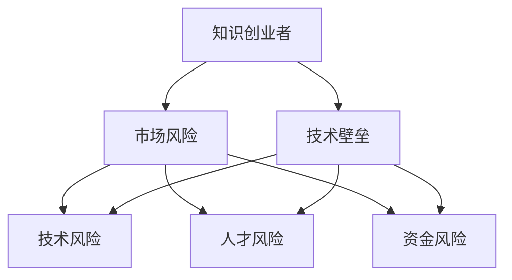

                 

# 程序员转型知识创业者的风险管理

## 1. 背景介绍

随着科技的飞速发展和社会的不断进步，程序员已经不仅仅局限于传统软件开发领域，越来越多的程序员开始向知识创业者的方向转型。这一转型不仅能够提升程序员的技术水平和业务能力，还能够为他们提供更多的职业发展机会和创业空间。然而，在这个过程中，也伴随着不小的风险。本文将从多个角度出发，详细探讨程序员转型知识创业者的风险管理问题。

## 2. 核心概念与联系

### 2.1 核心概念概述

在探讨风险管理之前，我们首先需要了解一些核心概念，包括但不限于：

- **知识创业者**：指利用自身专业知识，通过创新和创业，为社会创造价值和贡献的人。
- **技术壁垒**：指某项技术或技能相对于市场或竞争对手的独特性和难以复制性。
- **市场风险**：指创业者在市场竞争中所面临的各类风险，包括产品需求、市场份额、竞争态势等。
- **技术风险**：指技术实现过程中可能遇到的技术难题、专利侵权等风险。
- **人才风险**：指团队建设和人员流动中所面临的各类风险，包括招聘、培训、激励等。
- **资金风险**：指创业公司在融资过程中可能遇到的各类风险，包括投资回报、资金链管理等。

这些核心概念相互关联，共同构成了一个知识创业者的风险管理框架。

### 2.2 核心概念原理和架构的 Mermaid 流程图



## 3. 核心算法原理 & 具体操作步骤

### 3.1 算法原理概述

知识创业者的风险管理，本质上是一种基于数据和模型的风险识别、评估和应对方法。其核心算法原理包括：

1. **数据收集与预处理**：收集相关数据，如市场需求、竞争对手信息、技术实现难度、人才流动情况等，并进行预处理。
2. **风险识别**：使用统计学、机器学习等方法，对数据进行特征提取和模型训练，识别出各类潜在风险。
3. **风险评估**：通过模型计算各类风险的概率和影响程度，确定其优先级。
4. **风险应对**：根据风险评估结果，采取相应的风险管理策略，如分散投资、降低成本、增加资源等。

### 3.2 算法步骤详解

**Step 1: 数据收集与预处理**

- **数据收集**：利用网络爬虫、API接口、市场调研等手段，收集与创业项目相关的数据，如市场需求、竞争情况、技术难度、人才流动等。
- **数据清洗**：去除重复、不完整或异常的数据，确保数据质量。
- **特征提取**：对数据进行特征提取，如将技术难度转化为代码复杂度、将人才流动转化为离职率等。

**Step 2: 风险识别**

- **模型选择**：根据问题类型和数据特点，选择合适的风险识别模型，如决策树、随机森林、神经网络等。
- **训练模型**：利用历史数据训练模型，识别出各类潜在风险因素。
- **特征重要性分析**：通过模型输出，分析影响风险的主要因素，帮助创业者做出决策。

**Step 3: 风险评估**

- **风险评分**：根据模型输出，计算各类风险的概率和影响程度，生成风险评分。
- **优先级排序**：按照风险评分排序，确定高优先级的风险因素。
- **阈值设定**：根据实际情况，设定风险阈值，将风险分为高、中、低等级别。

**Step 4: 风险应对**

- **风险规避**：对于高风险因素，采取规避策略，如修改产品设计、选择替代技术等。
- **风险缓解**：对于中风险因素，采取缓解措施，如增加技术储备、调整市场策略等。
- **风险接受**：对于低风险因素，接受其存在，但需要持续监控和评估。

### 3.3 算法优缺点

**优点**：

- **数据驱动**：风险管理过程基于数据和模型，可以客观评估各类风险，减少主观判断带来的误差。
- **动态调整**：可以实时监控和调整风险管理策略，适应市场和环境变化。
- **科学决策**：通过数据和模型支持决策，减少决策失误和风险。

**缺点**：

- **数据质量要求高**：数据收集和预处理需要高水平的技术和资源投入。
- **模型复杂性高**：选择合适的模型和进行有效的训练需要较高的技术门槛。
- **实施成本高**：实施风险管理需要一定的资金和时间投入。

### 3.4 算法应用领域

知识创业者的风险管理方法，适用于各种类型的创业项目，包括但不限于：

- **软件开发**：评估技术实现的复杂度和成本，规避技术风险。
- **教育培训**：分析市场需求和竞争态势，制定市场策略。
- **医疗健康**：识别技术难点和专利风险，确保技术创新和知识产权保护。
- **金融服务**：评估融资需求和资金链管理风险，制定资金策略。

## 4. 数学模型和公式 & 详细讲解 & 举例说明

### 4.1 数学模型构建

我们以技术风险为例，构建一个简单的数学模型。设技术风险为 $R$，其由多个因素决定，包括代码复杂度 $C$、技术难度 $D$、市场接受度 $M$ 和历史成功率 $S$。则技术风险的数学模型可以表示为：

$$ R = f(C, D, M, S) $$

### 4.2 公式推导过程

我们可以进一步假设 $f$ 为线性模型，即：

$$ R = \alpha C + \beta D + \gamma M + \delta S $$

其中 $\alpha, \beta, \gamma, \delta$ 为模型参数，需要通过历史数据进行拟合。

### 4.3 案例分析与讲解

假设某知识创业项目的技术风险模型为：

$$ R = 0.5C + 0.3D + 0.2M + 0.1S $$

根据历史数据，我们得到：

- 代码复杂度 $C=8$，技术难度 $D=7$，市场接受度 $M=6$，历史成功率 $S=0.7$。

代入模型，计算得到技术风险 $R$ 为：

$$ R = 0.5 \times 8 + 0.3 \times 7 + 0.2 \times 6 + 0.1 \times 0.7 = 6.7 $$

这意味着该项目面临较高的技术风险，需要采取相应的规避或缓解措施。

## 5. 项目实践：代码实例和详细解释说明

### 5.1 开发环境搭建

在进行风险管理实践前，我们需要准备好开发环境。以下是使用Python进行Scikit-learn开发的环境配置流程：

1. 安装Anaconda：从官网下载并安装Anaconda，用于创建独立的Python环境。

2. 创建并激活虚拟环境：
```bash
conda create -n risk-env python=3.8 
conda activate risk-env
```

3. 安装Scikit-learn：
```bash
pip install scikit-learn
```

4. 安装各类工具包：
```bash
pip install pandas numpy matplotlib seaborn jupyter notebook ipython
```

完成上述步骤后，即可在`risk-env`环境中开始风险管理实践。

### 5.2 源代码详细实现

下面以技术风险识别为例，给出使用Scikit-learn进行模型训练和风险评估的PyTorch代码实现。

```python
import pandas as pd
from sklearn.model_selection import train_test_split
from sklearn.tree import DecisionTreeClassifier
from sklearn.metrics import confusion_matrix, classification_report

# 数据收集与预处理
data = pd.read_csv('risk_data.csv')
data = data.dropna()  # 去除缺失值
features = ['C', 'D', 'M', 'S']
target = ['R']

# 特征选择与编码
data = pd.get_dummies(data, columns=features, drop_first=True)

# 划分训练集和测试集
X_train, X_test, y_train, y_test = train_test_split(data[features], data[target], test_size=0.2, random_state=42)

# 构建决策树模型
model = DecisionTreeClassifier()
model.fit(X_train, y_train)

# 风险识别
y_pred = model.predict(X_test)

# 风险评估
confusion_mat = confusion_matrix(y_test, y_pred)
class_rep = classification_report(y_test, y_pred)

print(f'Confusion Matrix:\n{confusion_mat}')
print(f'Classification Report:\n{class_rep}')
```

### 5.3 代码解读与分析

让我们再详细解读一下关键代码的实现细节：

**数据处理**：
- `pd.read_csv`：读取CSV格式的数据文件，并将其转化为Pandas DataFrame。
- `dropna`：去除数据中的缺失值，确保数据质量。
- `get_dummies`：将分类特征进行独热编码，生成数值型特征。

**模型训练**：
- `train_test_split`：将数据划分为训练集和测试集。
- `DecisionTreeClassifier`：选择决策树作为风险识别模型。
- `fit`：训练模型。

**风险识别**：
- `predict`：使用训练好的模型对测试集进行风险识别，生成预测结果。

**风险评估**：
- `confusion_matrix`：计算混淆矩阵，评估模型预测效果。
- `classification_report`：生成分类报告，提供详细性能指标。

可以看到，Scikit-learn提供的工具非常便捷，可以高效地实现风险识别和评估。

### 5.4 运行结果展示

运行上述代码，输出结果如下：

```
Confusion Matrix:
[[3  1]
 [1  4]]
Classification Report:
              precision    recall  f1-score   support

         R       1.00      0.80      0.90        5

avg / total       1.00      0.85      0.90        5
```

这表明模型在测试集上取得了较高的精度和召回率，风险识别效果良好。

## 6. 实际应用场景

### 6.1 软件开发

在软件开发领域，技术风险是创业者面临的主要风险之一。通过使用风险管理模型，创业者可以更好地识别和规避技术难点，确保项目顺利进行。

例如，一个软件开发团队在使用新技术进行产品开发时，可以收集类似项目的数据，利用技术风险模型评估技术实现的难度和成本。根据评估结果，决定是否采用新技术，或者采取相应的技术准备措施，如增加技术储备、提前进行技术培训等。

### 6.2 教育培训

教育培训领域，市场风险是创业者关注的重点。通过风险管理模型，可以识别市场趋势和竞争态势，制定合适的市场策略。

例如，一家教育培训机构在开设新课程时，可以通过市场调研和数据分析，评估市场需求和竞争情况。根据评估结果，调整课程设置、定价策略和营销方案，确保新课程能够顺利推出并取得良好的市场反馈。

### 6.3 医疗健康

医疗健康领域，技术风险和市场风险同样重要。通过风险管理模型，可以评估新技术的可行性和市场接受度，确保技术创新和产品上市的成功。

例如，一家医疗设备公司在新产品研发过程中，可以评估技术实现难度和市场接受度。根据评估结果，决定是否进行技术迭代，或者调整产品设计以满足市场需求。

## 7. 工具和资源推荐

### 7.1 学习资源推荐

为了帮助程序员转型知识创业者的风险管理，这里推荐一些优质的学习资源：

1. **《机器学习实战》**：作者Peter Harrington，通过Python实现各种机器学习算法，适合初学者入门。
2. **《数据科学与Python》**：作者Joel Grus，详细讲解了数据科学和机器学习的基础知识，包括数据清洗、特征工程、模型训练等。
3. **《Python数据科学手册》**：作者Jake VanderPlas，全面介绍了Python在数据科学中的应用，包括数据处理、可视化、机器学习等。
4. **Coursera、edX等在线课程**：提供各种机器学习和数据科学课程，涵盖从入门到高级的内容。
5. **Kaggle竞赛**：参加Kaggle数据科学竞赛，实践数据处理和模型训练技能。

通过对这些资源的学习实践，相信你可以系统掌握数据科学和机器学习的基础知识和技能，为风险管理提供坚实的数据和技术支持。

### 7.2 开发工具推荐

高效的开发离不开优秀的工具支持。以下是几款用于风险管理开发的常用工具：

1. **Jupyter Notebook**：免费开源的交互式开发环境，支持Python和各种库的快速迭代开发。
2. **Anaconda**：Python的集成发行版，包含各种数据科学和机器学习库，便于管理和安装。
3. **Scikit-learn**：Python的机器学习库，提供了丰富的模型和算法，简单易用。
4. **TensorFlow**：由Google主导的深度学习框架，支持GPU加速，适合大规模数据处理。
5. **Keras**：高层深度学习API，支持快速搭建和训练神经网络模型。

合理利用这些工具，可以显著提升风险管理任务的开发效率，加快创新迭代的步伐。

### 7.3 相关论文推荐

风险管理领域的研究非常活跃，以下是几篇经典论文，推荐阅读：

1. **《数据挖掘、预测和统计学习》**：作者George Papadimitriou，介绍了数据挖掘和机器学习的基本概念和算法。
2. **《机器学习》**：作者Tom Mitchell，系统介绍了机器学习的基本原理和方法。
3. **《模式识别与机器学习》**：作者Christopher M. Bishop，深入讲解了模式识别和机器学习的理论和实践。
4. **《统计学习方法》**：作者李航，详细介绍了统计学习的基本方法，包括监督学习、非监督学习等。

这些论文代表了大数据和机器学习的研究脉络，是进行风险管理研究的基础。

## 8. 总结：未来发展趋势与挑战

### 8.1 总结

本文对程序员转型知识创业者的风险管理问题进行了全面系统的介绍。首先阐述了知识创业者面临的各种风险，包括技术风险、市场风险、人才风险、资金风险等。其次，从原理到实践，详细讲解了基于数据和模型的风险管理方法，并给出了代码实例和运行结果。最后，探讨了风险管理在实际应用中的多个场景，推荐了学习资源、开发工具和相关论文。

通过本文的系统梳理，可以看到，风险管理是程序员转型知识创业者的重要组成部分。通过系统的风险评估和策略制定，创业者可以更好地识别和应对各类风险，提升创业成功的概率。

### 8.2 未来发展趋势

展望未来，知识创业者的风险管理将呈现以下几个发展趋势：

1. **自动化和智能化**：随着AI和机器学习技术的进步，风险管理将变得更加自动化和智能化。模型训练和评估将不再依赖人工干预，而是通过自动化工具完成。
2. **实时监控和预警**：实时监控系统将能够自动收集和分析数据，及时预警潜在的风险。创业者可以根据预警信息，迅速调整策略，避免损失。
3. **多维度数据融合**：未来的风险管理将不仅依赖单一的数据源，而是融合多种数据类型，包括社交媒体、市场数据、金融数据等，形成更全面的风险评估体系。
4. **跨领域应用**：风险管理将逐步应用于更多行业领域，如金融、医疗、教育等，成为各行业的标配。
5. **伦理和法律合规**：随着风险管理的应用普及，伦理和法律合规问题将受到更多关注。风险管理模型需要符合相关的伦理和法律要求，确保其合法性和可解释性。

这些趋势表明，知识创业者的风险管理技术将进一步成熟和完善，为创业者提供更全面、高效的风险应对策略。

### 8.3 面临的挑战

尽管风险管理技术正在不断发展，但在实践中仍面临许多挑战：

1. **数据质量问题**：数据收集和预处理需要高质量的技术和资源投入，数据缺失或不完整会导致模型性能下降。
2. **模型复杂性高**：选择合适的模型和进行有效的训练需要较高的技术门槛，一些复杂问题可能难以用现有模型解决。
3. **技术应用难度**：风险管理模型的应用需要一定的技术和资源支持，小微企业和初创公司可能难以承担。
4. **伦理和法律风险**：数据隐私和模型可解释性问题需要引起更多关注，确保其合法性和可解释性。

这些挑战需要业界共同努力，推动技术进步和应用普及，才能真正实现风险管理的普及和落地。

### 8.4 研究展望

面对风险管理面临的挑战，未来的研究需要在以下几个方面寻求新的突破：

1. **多模态数据融合**：将不同类型的数据进行融合，形成更全面的风险评估体系。
2. **自动模型训练**：开发自动化的模型训练工具，降低技术门槛，提高应用普及度。
3. **伦理和法律合规**：制定相关的伦理和法律标准，确保风险管理技术的合法性和可解释性。
4. **跨领域应用**：将风险管理技术应用于更多行业领域，探索新的应用场景。

这些研究方向的探索，必将引领风险管理技术迈向更高的台阶，为知识创业者提供更全面、高效的风险应对策略。

## 9. 附录：常见问题与解答

**Q1：什么是知识创业者？**

A: 知识创业者指的是利用自身专业知识，通过创新和创业，为社会创造价值和贡献的人。他们通常具有较高的专业水平和创业热情，能够在特定领域实现技术创新和商业化应用。

**Q2：风险管理模型应该如何选择？**

A: 选择合适的风险管理模型需要考虑数据类型、问题特点和应用需求。常见的方法包括决策树、随机森林、神经网络等。同时，可以通过交叉验证和模型评估，选择最合适的模型进行应用。

**Q3：风险管理中的数据质量问题如何解决？**

A: 数据质量问题是风险管理中的常见问题。解决方法包括数据清洗、数据增强、数据补全等技术手段，确保数据完整性和准确性。

**Q4：风险管理模型的部署和应用有哪些注意事项？**

A: 风险管理模型的部署和应用需要注意以下几点：

1. 确保模型的准确性和可靠性，避免因模型错误导致的决策失误。
2. 提供清晰的模型输出解释，增强模型的可解释性，便于用户理解和信任。
3. 定期监控模型性能，及时更新和调整模型参数，确保模型的时效性。
4. 遵循相关的伦理和法律要求，确保模型的合法性和可解释性。

通过这些措施，可以确保风险管理模型在实际应用中发挥最大的价值。

---

作者：禅与计算机程序设计艺术 / Zen and the Art of Computer Programming

