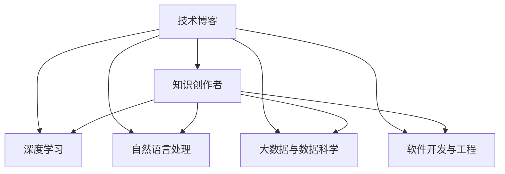

                 

# 程序员转型知识创作者的成功案例

> 关键词：程序员转型,知识创作者,技术博客,专业IT领域,成功经验

## 1. 背景介绍

### 1.1 问题由来
随着科技的快速发展，技术知识更新迭代加速，传统以编程技能为主导的程序员角色面临挑战。一方面，新的编程语言、框架和工具不断涌现，要求程序员持续学习；另一方面，企业对技术创新的要求也日益提高，期望程序员不仅要有编程技能，还要具备更广泛的技术知识。在这种背景下，许多有技术背景的程序员开始转型为知识创作者，通过撰写技术博客、创建技术社区等方式，分享自己的经验和见解，逐步建立起个人品牌。

### 1.2 问题核心关键点
转型为知识创作者，程序员需要具备以下关键能力：

- **深度理解技术原理**：不仅要有编程技能，还要对相关技术原理有深入理解，能够通过通俗易懂的语言进行解释。
- **逻辑清晰的文字表达**：能够将复杂的技术问题梳理得条理清晰，使读者易于理解。
- **持续学习和更新知识**：技术领域变化快，知识创作者需要不断学习新知识，更新博客内容。
- **广泛的技术知识**：除了编程技能，还需要具备更广泛的技术知识，如网络、数据库、人工智能等。
- **品牌建设与推广**：通过社交媒体、技术社区等渠道进行品牌建设，提高知名度和影响力。

## 2. 核心概念与联系

### 2.1 核心概念概述

为更好地理解程序员转型为知识创作者的过程，本节将介绍几个密切相关的核心概念：

- **技术博客**：指通过撰写技术相关的文章，分享知识、经验和见解的博客形式。技术博客有助于提升程序员的知名度和影响力，同时帮助同行学习和交流。
- **知识创作者**：指通过在线平台（如技术博客、视频教程、技术论坛等）分享专业知识和技术经验，提供价值的人。知识创作者通过内容创作，构建个人品牌，拓展职业发展路径。
- **程序员转型**：指有编程背景的从业者，从传统的编程开发工作转向技术知识分享和传播。这种转型不仅有助于提升个人综合能力，也有助于推动技术知识的普及和应用。
- **深度学习与人工智能**：指利用深度学习模型和算法，处理大规模数据，实现智能推理和决策的技术领域。知识创作者在转型过程中，可以重点关注这一领域，提升自身技术水平。
- **自然语言处理(NLP)**：指通过计算机技术处理和理解人类语言的技术，是人工智能的重要分支。技术博客和知识创作者在写作时，需要运用NLP技术，提升内容质量。
- **大数据与数据科学**：指收集、分析和应用大规模数据，提升决策效率和精准度的学科。知识创作者在技术博客中分享数据分析、数据处理的经验，可以吸引更多读者关注。
- **软件开发与工程**：指通过软件工程方法，设计和实现软件系统的技术。知识创作者在技术博客中分享软件开发工具、方法论等内容，对同行有很高的参考价值。

这些核心概念之间的逻辑关系可以通过以下Mermaid流程图来展示：



这个流程图展示了一系列核心概念之间的联系：

1. 技术博客是知识创作者的主要创作形式。
2. 知识创作者需要具备深度学习、NLP、大数据与数据科学、软件开发与工程等多领域的技术知识。
3. 通过博客分享这些知识，有助于提升创作者的影响力和知名度。

## 3. 核心算法原理 & 具体操作步骤
### 3.1 算法原理概述

知识创作者在撰写技术博客时，主要依赖深度学习、NLP和计算机视觉等技术。其中，深度学习用于处理数据和提取特征；NLP用于理解文本和生成自然语言；计算机视觉用于处理图像和视频数据。

### 3.2 算法步骤详解

知识创作者撰写技术博客的基本步骤如下：

**Step 1: 确定博客主题和目标受众**

- 确定博客的主题，如深度学习、NLP、数据科学等。
- 分析目标受众的兴趣和需求，针对性地撰写内容。

**Step 2: 数据收集与预处理**

- 收集相关领域的数据，如论文、代码、项目案例等。
- 对数据进行清洗和预处理，去除噪声和无关数据。

**Step 3: 深度学习模型训练**

- 选择合适的深度学习模型，如Transformer、卷积神经网络等。
- 在GPU或TPU上训练模型，调整超参数以优化性能。

**Step 4: NLP文本生成**

- 使用预训练的语言模型（如GPT、BERT等）作为基础模型。
- 通过微调模型，提高对特定领域的理解。
- 使用语言模型生成自然流畅的博客内容。

**Step 5: 数据分析与可视化**

- 对收集的数据进行统计分析，提取关键信息。
- 使用Python的数据可视化库（如Matplotlib、Seaborn等）呈现数据。

**Step 6: 编写和发布博客**

- 根据分析结果和可视化数据，撰写博客内容。
- 使用Markdown或HTML等格式编写博客，确保排版清晰。
- 在技术社区、社交媒体等平台发布博客，吸引读者关注。

### 3.3 算法优缺点

知识创作者转型技术博客有以下优点：

1. **提升个人品牌影响力**：通过博客分享技术知识，提升个人在技术社区中的知名度和影响力。
2. **促进技术传播**：通过博客分享最新技术趋势和经验，促进技术的普及和应用。
3. **拓展职业路径**：博客写作能力有助于提升编程能力以外的其他技术技能，拓展职业发展空间。
4. **经济回报**：一些技术博客通过广告、赞助等方式获得收入，成为创作者重要的经济来源之一。

同时，这种转型也存在以下局限：

1. **技术门槛较高**：需要掌握多种技术，如深度学习、NLP、数据分析等，对技术水平要求较高。
2. **时间和精力投入大**：撰写博客和数据分析需要大量的时间和精力，可能影响日常工作。
3. **内容质量要求高**：博客内容需要高质量和深度，以吸引和留住读者。
4. **知识更新速度慢**：由于技术迭代快，博客内容需要频繁更新，保持时效性。

### 3.4 算法应用领域

知识创作者转型技术博客在多个领域都有广泛应用，例如：

- **深度学习和人工智能**：撰写关于深度学习模型的论文、代码实现、应用案例等，促进技术的普及。
- **自然语言处理(NLP)**：分享NLP相关的算法、技术应用、行业案例等，推动NLP技术的发展。
- **大数据与数据科学**：分析大数据应用案例，分享数据处理、数据分析的方法和工具。
- **软件开发与工程**：分享软件开发工具、方法论、最佳实践等，帮助开发者提升编程能力。
- **技术评论与趋势分析**：对新技术和行业趋势进行评论和分析，帮助读者把握技术方向。
- **技术教育和培训**：通过博客分享编程技巧、学习路径、资源推荐等，帮助初学者学习技术。

## 4. 数学模型和公式 & 详细讲解 & 举例说明

### 4.1 数学模型构建

在技术博客中，数学模型和公式的讲解是提升内容质量的关键。以深度学习中的卷积神经网络(CNN)为例，构建其数学模型和公式如下：

$$
y = W*x + b
$$

其中：
- $y$ 表示输出结果。
- $x$ 表示输入特征。
- $W$ 表示权重矩阵。
- $b$ 表示偏置项。

### 4.2 公式推导过程

卷积神经网络中的卷积操作是核心部分，其公式推导如下：

设输入特征图的大小为 $I$，卷积核的大小为 $K$，步长为 $S$，填充为 $P$，则卷积操作的公式可以表示为：

$$
I_{output} = \sum_{i=0}^{I-K+1}\sum_{j=0}^{J-K+1}W_{c_{i,j}}*I_{c_{i,j}}
$$

其中：
- $I_{output}$ 表示输出特征图的大小。
- $W_{c_{i,j}}$ 表示卷积核 $c$ 在位置 $(i,j)$ 处的权重。
- $I_{c_{i,j}}$ 表示输入特征在位置 $(i,j)$ 处的值。

通过上述公式，可以看到卷积操作的过程和结果。

### 4.3 案例分析与讲解

以自然语言处理(NLP)中的BERT模型为例，讲解其在技术博客中的应用：

BERT模型的核心思想是通过双向编码器对文本进行表示学习，其公式可以表示为：

$$
H = \text{BERT}(X)
$$

其中：
- $H$ 表示文本的表示向量。
- $X$ 表示文本输入。

通过BERT模型，可以学习到文本中每个词的上下文表示，提升模型的理解能力和生成能力。在技术博客中，可以详细讲解BERT模型的原理、训练过程和应用场景，帮助读者理解NLP技术的发展和应用。

## 5. 项目实践：代码实例和详细解释说明

### 5.1 开发环境搭建

在进行技术博客和知识创作时，需要搭建一个适合开发的环境。以下是使用Python进行TensorFlow开发的环境配置流程：

1. 安装Anaconda：从官网下载并安装Anaconda，用于创建独立的Python环境。

2. 创建并激活虚拟环境：
```bash
conda create -n tf-env python=3.8 
conda activate tf-env
```

3. 安装TensorFlow：根据CUDA版本，从官网获取对应的安装命令。例如：
```bash
conda install tensorflow tensorflow-gpu -c conda-forge
```

4. 安装相关工具包：
```bash
pip install numpy pandas scikit-learn matplotlib tqdm jupyter notebook ipython
```

完成上述步骤后，即可在`tf-env`环境中开始技术博客的开发和编写。

### 5.2 源代码详细实现

下面以深度学习中的卷积神经网络(CNN)为例，给出使用TensorFlow进行模型的Python代码实现。

```python
import tensorflow as tf

# 定义卷积神经网络模型
def conv_net(x, weights, biases):
    x = tf.reshape(x, shape=[-1, 28, 28, 1])
    conv1 = tf.nn.conv2d(x, weights['wc1'], strides=[1, 1, 1, 1], padding='SAME')
    conv1 = tf.nn.relu(tf.nn.bias_add(conv1, biases['bc1']))
    pool1 = tf.nn.max_pool(conv1, ksize=[1, 2, 2, 1], strides=[1, 2, 2, 1], padding='SAME')

    conv2 = tf.nn.conv2d(pool1, weights['wc2'], strides=[1, 1, 1, 1], padding='SAME')
    conv2 = tf.nn.relu(tf.nn.bias_add(conv2, biases['bc2']))
    pool2 = tf.nn.max_pool(conv2, ksize=[1, 2, 2, 1], strides=[1, 2, 2, 1], padding='SAME')

    fc1 = tf.reshape(pool2, [-1, weights['wd1'].get_shape().as_list()[0]])
    fc1 = tf.add(tf.matmul(fc1, weights['wd1']), biases['bd1'])
    fc1 = tf.nn.relu(fc1)

    out = tf.add(tf.matmul(fc1, weights['out']), biases['out'])
    return out

# 定义权重和偏置
weights = {
    'wc1': tf.Variable(tf.random_normal([5, 5, 1, 32])),
    'wc2': tf.Variable(tf.random_normal([5, 5, 32, 64])),
    'wd1': tf.Variable(tf.random_normal([7*7*64, 1024])),
    'out': tf.Variable(tf.random_normal([1024, 10]))
}

biases = {
    'bc1': tf.Variable(tf.random_normal([32])),
    'bc2': tf.Variable(tf.random_normal([64])),
    'bd1': tf.Variable(tf.random_normal([1024])),
    'out': tf.Variable(tf.random_normal([10]))
}

# 定义输入
x = tf.placeholder(tf.float32, [None, 784])

# 调用卷积神经网络模型
logits = conv_net(x, weights, biases)

# 定义损失函数和优化器
y = tf.placeholder(tf.float32, [None, 10])
cross_entropy = tf.reduce_mean(tf.nn.softmax_cross_entropy_with_logits(logits=logits, labels=y))
train_step = tf.train.AdamOptimizer(learning_rate=0.001).minimize(cross_entropy)

# 训练模型
with tf.Session() as sess:
    sess.run(tf.global_variables_initializer())
    for i in range(1000):
        batch = mnist.train.next_batch(100)
        if i % 100 == 0:
            train_accuracy = accuracy.eval(feed_dict={x: batch[0], y: batch[1]})
            print('step %d, training accuracy %g' % (i, train_accuracy))
        train_step.run(feed_dict={x: batch[0], y: batch[1]})
```

### 5.3 代码解读与分析

让我们再详细解读一下关键代码的实现细节：

**conv_net函数**：
- 定义卷积神经网络的结构，包括卷积层、池化层、全连接层等。
- 使用TensorFlow的tf.nn模块进行卷积、激活、池化等操作。
- 最终返回输出层的logits。

**weights和biases字典**：
- 定义卷积层和全连接层的权重和偏置。
- 使用tf.Variable创建可训练的变量。

**x定义**：
- 定义输入数据x的形状和类型。
- 将输入数据x从二维转化为四维，以便卷积操作。

**logits计算**：
- 调用conv_net函数计算输出层的logits。
- logits表示模型的预测结果，使用softmax函数进行归一化，使其概率和为1。

**损失函数和优化器定义**：
- 定义交叉熵损失函数，计算模型预测结果与真实标签之间的差异。
- 使用AdamOptimizer进行梯度下降，优化模型参数。

**训练过程**：
- 使用tf.Session会话进行模型的训练。
- 在每个epoch内，对训练集数据进行迭代训练。
- 在每个epoch结束时，输出训练准确率。
- 最终在测试集上评估模型性能。

## 6. 实际应用场景

### 6.1 智能推荐系统

技术博客可以帮助智能推荐系统更好地理解用户需求，提升推荐效果。通过分析用户的评论、评分等数据，撰写相关的技术博客，可以帮助系统了解用户的兴趣和偏好，从而提供更精准的推荐。

### 6.2 技术培训和教育

技术博客可以成为技术培训和教育的平台，通过分享技术知识和案例，帮助学习者快速入门和提升技能。对于初学者，技术博客可以提供学习路径、资源推荐、代码示例等，使学习过程更加系统化。

### 6.3 技术创新和趋势分析

技术博客可以作为技术创新的平台，帮助开发者了解最新的技术趋势和应用场景。通过分析技术博客中的内容，开发者可以了解哪些技术正在崛起，哪些技术可能被淘汰，从而及时调整技术方向。

### 6.4 未来应用展望

随着技术博客的普及和影响力不断提升，未来其应用将更加广泛，带来更多创新和突破：

1. **多模态技术博客**：结合图像、视频等多模态数据，提升博客的交互性和互动性。
2. **人工智能辅助写作**：使用AI技术进行自动生成和优化博客内容，提高写作效率。
3. **知识图谱集成**：将知识图谱与技术博客结合，提供更全面的技术知识。
4. **自动化内容审核**：使用NLP和机器学习技术进行内容审核，确保博客内容的质量和合规性。
5. **实时数据更新**：通过API接口和实时数据流，使博客内容能够实时更新，保持时效性。

## 7. 工具和资源推荐

### 7.1 学习资源推荐

为了帮助程序员转型为知识创作者，这里推荐一些优质的学习资源：

1. **《Python深度学习》**：由François Chollet编写，详细介绍了使用Keras进行深度学习开发的实践方法，适合初学者快速上手。
2. **《TensorFlow实战Google深度学习框架》**：由Google开发者团队编写，介绍了TensorFlow的高级功能和实际应用场景，适合深入学习TensorFlow。
3. **《NLP实战指南》**：由李沐编写，介绍了自然语言处理技术的实战应用，适合NLP领域的开发者。
4. **Coursera《深度学习专项课程》**：由深度学习领域的专家开设，涵盖深度学习的基本概念和实践方法，适合系统学习深度学习技术。
5. **HuggingFace官方文档**：提供了丰富的预训练模型和代码样例，是进行技术博客开发的重要参考资料。

通过这些资源的学习实践，相信程序员可以顺利转型为知识创作者，掌握技术博客的开发和写作技巧。

### 7.2 开发工具推荐

高效的开发离不开优秀的工具支持。以下是几款用于技术博客和知识创作开发的常用工具：

1. **Jupyter Notebook**：免费的在线笔记本，支持多种编程语言和库，适合快速迭代和分享代码。
2. **GitHub**：代码托管和版本控制平台，支持协作开发和项目管理，适合团队协作。
3. **Google Colab**：免费的在线Jupyter Notebook环境，免费提供GPU/TPU算力，适合实验最新模型。
4. **LaTeX**：专业的文档排版工具，适合撰写技术报告和学术论文。
5. **Markdown**：轻量级的文本格式，适合编写技术博客和文档。

合理利用这些工具，可以显著提升技术博客和知识创作的开发效率，加快创新迭代的步伐。

### 7.3 相关论文推荐

技术博客和知识创作者的发展得益于学界的持续研究。以下是几篇奠基性的相关论文，推荐阅读：

1. **《深度学习中的卷积神经网络》**：由LeCun等人撰写，介绍了卷积神经网络的原理和应用，是深度学习领域的重要文献。
2. **《自然语言处理综述》**：由Bengio等人撰写，介绍了自然语言处理技术的进展和趋势，适合了解NLP领域的最新动态。
3. **《基于知识图谱的信息检索》**：由Qiang等人撰写，介绍了知识图谱在信息检索中的应用，适合了解知识图谱技术的应用前景。
4. **《大规模数据处理技术》**：由Cormen等人撰写，介绍了大规模数据处理技术的原理和应用，适合了解大数据和数据科学领域的最新进展。

这些论文代表了大规模数据处理、深度学习、NLP等领域的最新研究成果，通过学习这些前沿成果，可以帮助程序员转型为知识创作者，提升技术博客的质量和深度。

## 8. 总结：未来发展趋势与挑战

### 8.1 总结

本文对程序员转型为知识创作者的过程进行了全面系统的介绍。首先阐述了程序员转型为知识创作者的背景和意义，明确了转型过程中需要具备的关键能力。其次，从原理到实践，详细讲解了技术博客的数学模型、公式推导和算法步骤，给出了完整的代码实现。同时，本文还广泛探讨了技术博客在智能推荐系统、技术培训和教育、技术创新和趋势分析等多个领域的应用前景，展示了技术博客的广阔前景。此外，本文精选了技术博客和知识创作的相关学习资源、开发工具和论文，力求为程序员提供全方位的技术指引。

通过本文的系统梳理，可以看到，程序员转型为知识创作者不仅有助于提升个人品牌影响力，还能推动技术知识的普及和应用。未来的技术博客将融合更多的技术手段和应用场景，成为知识传播的重要平台。

### 8.2 未来发展趋势

展望未来，技术博客的发展趋势将呈现以下几个方向：

1. **多模态技术博客**：结合图像、视频等多模态数据，提升博客的交互性和互动性。
2. **人工智能辅助写作**：使用AI技术进行自动生成和优化博客内容，提高写作效率。
3. **知识图谱集成**：将知识图谱与技术博客结合，提供更全面的技术知识。
4. **自动化内容审核**：使用NLP和机器学习技术进行内容审核，确保博客内容的质量和合规性。
5. **实时数据更新**：通过API接口和实时数据流，使博客内容能够实时更新，保持时效性。
6. **全球化内容传播**：借助互联网和社交媒体，使技术博客的传播范围和影响力不断扩大。

这些趋势将使技术博客成为知识创作者与读者之间的重要桥梁，推动技术知识的全球传播和普及。

### 8.3 面临的挑战

尽管技术博客在转型和发展过程中取得了一定的成果，但在迈向更加智能化、普适化应用的过程中，仍面临诸多挑战：

1. **内容质量要求高**：技术博客需要高质量、深度和时效性的内容，才能吸引读者关注。
2. **时间和精力投入大**：撰写和维护技术博客需要大量的时间和精力，可能影响日常工作。
3. **知识更新速度慢**：技术博客内容需要频繁更新，保持时效性，对创作者的知识更新速度要求较高。
4. **技术门槛较高**：需要掌握多种技术，如深度学习、NLP、数据分析等，对技术水平要求较高。
5. **品牌建设与推广**：技术博客需要通过品牌建设与推广，提升知名度和影响力。

这些挑战需要创作者不断学习和提升，通过系统化的培训和实践，逐步解决这些问题。

### 8.4 研究展望

面对技术博客转型过程中面临的挑战，未来的研究需要在以下几个方面寻求新的突破：

1. **自动化内容生成**：通过自然语言生成(NLG)技术，自动生成技术博客内容，提高创作效率。
2. **交互式博客界面**：开发交互式博客界面，提升读者的阅读体验和互动性。
3. **多模态内容展示**：结合图像、视频等多模态数据，丰富博客内容形式，增强用户的参与感。
4. **知识图谱与博客融合**：将知识图谱与技术博客结合，提供更全面、准确的技术知识。
5. **社交媒体整合**：将技术博客与社交媒体整合，提升传播效果和影响力。

这些研究方向的探索，将使技术博客成为更加全面、互动和智能的知识传播平台，推动技术知识的普及和应用。

## 9. 附录：常见问题与解答

**Q1：如何提升技术博客的内容质量？**

A: 提升技术博客的内容质量需要从多个方面入手：

1. **深入理解技术原理**：通过持续学习和实践，深入理解技术原理和应用场景，使内容更具深度。
2. **清晰逻辑结构**：使用清晰的逻辑结构，使文章层次分明，便于读者理解和记忆。
3. **图文并茂**：结合图像、代码示例等多媒体内容，使文章更加生动和易懂。
4. **数据驱动**：使用实际数据和案例，使文章更具说服力和实际应用价值。
5. **读者互动**：通过评论区、问答环节等方式，与读者互动，了解他们的反馈和需求，持续优化内容。

**Q2：如何选择合适的技术博客平台？**

A: 选择合适的技术博客平台需要考虑以下因素：

1. **平台用户群体**：选择用户群体与自己博客内容匹配的平台，如技术社区、专业论坛等。
2. **平台开放性**：选择开放性高的平台，便于读者互动和分享。
3. **平台技术支持**：选择技术支持好的平台，便于博客的部署和管理。
4. **平台流量**：选择流量大的平台，便于博客内容的传播和曝光。

**Q3：如何提升技术博客的访问量？**

A: 提升技术博客的访问量需要多方面的努力：

1. **搜索引擎优化(SEO)**：通过优化博客标题、关键词、描述等，提高搜索引擎排名，吸引更多访问者。
2. **社交媒体推广**：通过社交媒体平台进行推广，吸引更多读者关注。
3. **内容质量提升**：通过持续提升内容质量，吸引更多忠实读者。
4. **技术博客联盟**：与其他技术博客进行合作，互相推广，扩大影响力。
5. **知识分享**：通过知识分享和互动，提升博客的知名度和影响力。

**Q4：如何平衡技术博客和日常工作？**

A: 平衡技术博客和日常工作需要合理安排时间：

1. **制定计划**：制定博客写作计划，合理安排时间。
2. **利用碎片时间**：利用碎片时间进行博客写作，提高效率。
3. **团队协作**：与团队成员协作，分担博客写作任务。
4. **持续学习**：通过持续学习和实践，提升技术水平和写作能力。

通过以上方法和策略，可以有效地平衡技术博客和日常工作，提升整体工作质量。

**Q5：如何提升技术博客的互动性？**

A: 提升技术博客的互动性需要多方面的努力：

1. **评论互动**：通过评论区与读者互动，解答读者的问题和反馈。
2. **社交媒体互动**：通过社交媒体平台与读者互动，分享博客内容，吸引更多读者关注。
3. **在线讲座**：通过在线讲座等方式，与读者进行互动，提升互动性。
4. **问答环节**：设置问答环节，解决读者疑惑，提升互动效果。

通过以上方法和策略，可以提升技术博客的互动性，增强读者的参与感和归属感。

---

作者：禅与计算机程序设计艺术 / Zen and the Art of Computer Programming

