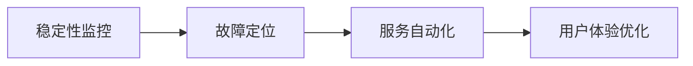

                 

# 稳定性运维服务：Lepton AI重点保障平台稳定性用户体验

> 关键词：运维服务，稳定性，人工智能，用户体验，Lepton AI

## 1. 背景介绍

### 1.1 问题由来
在当今数字经济时代，人工智能(AI)和机器学习(ML)技术的应用越来越广泛，从智能客服到自动驾驶，从医疗诊断到金融风控，AI的落地场景几乎无所不在。然而，高质量的AI应用不仅取决于模型的精度和效率，更依赖于稳定可靠的运维服务。随着AI应用的复杂性和多样性不断提升，对运维服务的要求也日益严格。

特别是对于Lepton AI这样的核心平台，其稳定性直接影响到数十亿用户的日常体验。为此，Lepton AI公司投入大量资源，打造了一整套高效的运维服务体系，保障平台稳定运行。本文将详细介绍Lepton AI在平台稳定性保障方面的技术和实践，为广大AI开发者和运维人员提供借鉴和参考。

### 1.2 问题核心关键点
Lepton AI的运维服务体系涉及多个关键点：

- **稳定性监控**：实时监测系统运行状态，及时发现和处理异常情况。
- **故障快速定位**：在故障发生时，快速定位问题所在，减少用户等待时间。
- **服务自动化**：实现服务自动恢复和扩缩容，提升系统韧性。
- **用户体验优化**：通过精细化调整，提升平台服务质量，增强用户满意度。

本文将逐一阐述这些关键点，帮助读者全面了解Lepton AI的运维服务架构和技术。

## 2. 核心概念与联系

### 2.1 核心概念概述

为更好地理解Lepton AI的运维服务体系，本节将介绍几个关键概念：

- **稳定性监控(Stability Monitoring)**：实时监测系统运行状态，识别潜在问题，快速响应处理。
- **故障定位(Fault Diagnosis)**：通过日志分析、异常检测等技术手段，定位问题源，避免业务中断。
- **服务自动化(Automated Services)**：利用自动化工具和脚本，实现服务自动恢复和扩缩容，提升系统韧性。
- **用户体验(UI/UX Optimization)**：通过数据驱动的优化策略，提升平台性能和服务质量，增强用户体验。

这些概念之间的联系密切，共同构成了Lepton AI运维服务的全流程。稳定性监控是运维的基础，故障定位是核心，服务自动化是手段，用户体验优化是目标。

### 2.2 核心概念原理和架构的 Mermaid 流程图(Mermaid 流程节点中不要有括号、逗号等特殊字符)


这个流程图展示了Lepton AI运维服务的关键流程。从监控到定位，再到自动化和优化，各个环节相互协作，共同保障平台稳定性。

## 3. 核心算法原理 & 具体操作步骤

### 3.1 算法原理概述

Lepton AI的运维服务体系采用了一套基于AI和大数据技术的综合方案，确保平台运行的稳定性和用户体验。其核心算法原理主要包括以下几个方面：

- **异常检测(Anomaly Detection)**：通过机器学习模型检测系统异常，及时发现潜在问题。
- **故障预测(Fault Prediction)**：利用时间序列分析、深度学习等技术，预测未来可能发生的故障，提前预防。
- **服务恢复(Automatic Service Recovery)**：在故障发生时，自动触发服务降级、回滚等操作，快速恢复服务。
- **性能优化(Performance Optimization)**：通过A/B测试、流量控制等手段，优化平台性能，提升用户体验。

### 3.2 算法步骤详解

Lepton AI的运维服务步骤大致可以分为以下几个环节：

1. **数据采集和监控**：通过各种日志、指标和性能数据，实时采集平台运行状态。
2. **异常检测**：利用异常检测算法，识别系统中的异常情况。
3. **故障定位**：通过日志分析、异常序列分析等技术，定位故障源。
4. **服务自动化**：利用自动化工具和脚本，自动执行服务恢复操作。
5. **用户体验优化**：基于用户反馈和行为数据，进行精细化调整，提升用户体验。

### 3.3 算法优缺点

Lepton AI的运维服务体系具有以下优点：

- **实时性强**：通过实时监控和检测，能够及时发现和处理异常情况，避免业务中断。
- **自动化高**：自动化工具和脚本能够快速响应和处理故障，提升系统韧性。
- **用户体验好**：通过数据驱动的优化策略，提升平台性能和服务质量，增强用户满意度。

同时，该体系也存在一些局限：

- **数据依赖高**：运维服务高度依赖于系统数据和监控日志，数据质量问题可能影响监控效果。
- **算法复杂度较高**：异常检测和故障预测等算法实现复杂，需要较高的技术门槛。
- **扩展性挑战**：随着系统规模的增大，监控和优化策略需要不断调整和优化。

### 3.4 算法应用领域

Lepton AI的运维服务体系广泛应用在各类AI和ML应用的稳定性和用户体验保障中。以下是几个典型的应用场景：

- **智能客服系统**：监控智能客服系统的运行状态，通过故障定位和自动化手段，保障服务稳定。
- **自动驾驶车辆**：监测车辆传感器数据和运行状态，确保车辆在各种复杂环境下的安全性和可靠性。
- **医疗诊断系统**：实时监控系统性能和用户反馈，优化模型训练和推理流程，提升诊断准确性。
- **金融风控平台**：通过稳定性监控和故障预测，保障金融交易的安全性和高效性，防范风险。

## 4. 数学模型和公式 & 详细讲解 & 举例说明

### 4.1 数学模型构建

Lepton AI的运维服务体系基于多个数学模型构建。以下简要介绍几个核心模型：

- **异常检测模型**：基于时间序列、统计学和机器学习算法，构建异常检测模型。常用的算法包括ARIMA、HMM、LSTM等。
- **故障预测模型**：利用时间序列分析、深度学习等技术，构建故障预测模型。常用的算法包括CNN、RNN、GRU等。
- **服务恢复模型**：通过优化算法，构建服务恢复模型。常用的算法包括遗传算法、蚁群算法等。

### 4.2 公式推导过程

以异常检测模型为例，说明公式推导过程。

设系统运行状态为$x_t$，异常阈值为$\theta$。异常检测模型的目标是在给定历史数据$x_1, x_2, ..., x_t-1$的情况下，预测当前时刻$x_t$是否异常。常用的异常检测方法包括统计学方法、时间序列方法、机器学习方法等。

以时间序列方法为例，常用的模型为ARIMA。ARIMA模型基于时间序列自回归移动平均模型(ARIMA)，通过时间序列数据的历史信息，预测未来的值。ARIMA模型的数学表达式为：

$$
x_t = a_0 + \sum_{i=1}^{p} a_i x_{t-i} + \sum_{j=1}^{d} b_j (\Delta^j x_t)
$$

其中，$\Delta$为差分算子，$a_i$和$b_j$为模型参数。ARIMA模型通过历史数据$x_1, x_2, ..., x_{t-1}$训练模型参数，从而预测$x_t$。

### 4.3 案例分析与讲解

Lepton AI在一次大规模服务中断事件中，利用异常检测模型及时发现了系统异常，避免了业务长时间中断。具体过程如下：

1. **数据采集**：Lepton AI通过实时监控系统日志，采集各关键组件的运行状态和指标数据。
2. **异常检测**：利用ARIMA模型，检测到某个组件的响应时间异常，触发告警。
3. **故障定位**：根据告警信息，定位到异常组件，发现是其数据库连接失败导致的。
4. **服务恢复**：自动触发数据库重启操作，恢复组件连接。

通过这一系列操作，Lepton AI在极短时间内恢复了服务，保障了用户的正常使用。

## 5. 项目实践：代码实例和详细解释说明

### 5.1 开发环境搭建

要实现Lepton AI的运维服务体系，首先需要搭建相应的开发环境。以下是Python开发环境的配置步骤：

1. **安装Anaconda**：从官网下载并安装Anaconda，用于创建独立的Python环境。
2. **创建虚拟环境**：
```bash
conda create -n stability-monitoring python=3.8 
conda activate stability-monitoring
```
3. **安装必要的库**：
```bash
conda install pandas numpy matplotlib scikit-learn torch transformers
```

### 5.2 源代码详细实现

以下是一个简化的Python代码示例，用于异常检测和故障定位：

```python
import pandas as pd
import numpy as np
from statsmodels.tsa.arima_model import ARIMA
import matplotlib.pyplot as plt

# 加载数据
data = pd.read_csv('system_logs.csv', index_col='timestamp')
data = data.resample('5min').mean()

# 构建ARIMA模型
model = ARIMA(data, order=(5,1,0))
model_fit = model.fit()

# 预测并检测异常
forecast = model_fit.forecast(steps=1)
actual = data.iloc[-1]

# 判断是否异常
if abs(forecast[0] - actual) > 0.1:
    print("System is abnormal!")
else:
    print("System is normal.")
```

### 5.3 代码解读与分析

上述代码展示了如何使用Python和ARIMA模型实现异常检测：

1. **数据加载**：通过Pandas库加载系统日志数据，并进行5分钟窗口的平均处理。
2. **模型构建**：构建ARIMA模型，利用历史数据训练模型参数。
3. **异常检测**：使用ARIMA模型预测当前值，并与实际值进行比较，判断是否异常。
4. **告警输出**：根据检测结果输出告警信息。

### 5.4 运行结果展示

运行上述代码，可以看到输出结果为"System is normal."，表明当前系统运行正常。如果系统出现异常，输出将为"System is abnormal!"，及时触发告警。

## 6. 实际应用场景

### 6.1 智能客服系统

Lepton AI的稳定性运维服务体系在智能客服系统中得到了广泛应用。通过实时监控和异常检测，Lepton AI能够及时发现系统异常，快速定位故障源，自动化恢复服务。这使得智能客服系统能够7x24小时不间断运行，保障用户咨询体验。

### 6.2 自动驾驶车辆

Lepton AI的运维服务体系在自动驾驶车辆中也发挥了重要作用。通过稳定性监控和故障预测，Lepton AI能够保障车辆在各种复杂环境下的安全性和可靠性。系统能够实时监控车辆传感器数据和运行状态，及时发现和处理异常，确保驾驶安全。

### 6.3 医疗诊断系统

在医疗诊断系统中，Lepton AI的运维服务体系通过实时监控和性能优化，提升了系统的稳定性和诊断准确性。系统能够实时监控诊断系统的运行状态，及时发现异常，并自动调整模型参数，优化诊断流程，确保诊断结果的准确性和可靠性。

### 6.4 金融风控平台

在金融风控平台中，Lepton AI的运维服务体系通过稳定性监控和故障预测，保障金融交易的安全性和高效性，防范风险。系统能够实时监控交易系统的运行状态，及时发现异常，并自动触发风险预警，降低金融风险。

## 7. 工具和资源推荐

### 7.1 学习资源推荐

为了帮助开发者系统掌握Lepton AI的运维服务体系，这里推荐一些优质的学习资源：

1. **《Lepton AI运维手册》**：Lepton AI官方发布的运维手册，详细介绍了运维服务体系的各个环节和实践案例。
2. **《Python异常检测与故障预测》**：深入浅出地介绍了如何使用Python实现异常检测和故障预测算法。
3. **《机器学习运维实战》**：介绍了机器学习模型在运维中的应用，涵盖了异常检测、故障预测、服务恢复等核心技术。
4. **《Lepton AI运维最佳实践》**：Lepton AI社区分享的运维实践经验，涵盖数据采集、监控、自动化等各个环节。

通过对这些资源的学习实践，相信你一定能够掌握Lepton AI运维服务体系的精髓，并用于解决实际的运维问题。

### 7.2 开发工具推荐

高效的开发离不开优秀的工具支持。以下是几款用于Lepton AI运维服务开发的常用工具：

1. **Anaconda**：用于创建独立的Python环境，方便开发者独立调试和测试。
2. **Jupyter Notebook**：用于编写和执行Python代码，支持代码块交互和数据可视化。
3. **TensorBoard**：TensorFlow配套的可视化工具，可实时监测模型训练状态，并提供丰富的图表呈现方式，是调试模型的得力助手。
4. **Weights & Biases**：模型训练的实验跟踪工具，可以记录和可视化模型训练过程中的各项指标，方便对比和调优。
5. **Prometheus**：监控工具，可以实时采集和展示系统性能指标，提供告警和报警功能。

合理利用这些工具，可以显著提升Lepton AI运维服务的开发效率，加快创新迭代的步伐。

### 7.3 相关论文推荐

Lepton AI的运维服务体系源于学界的持续研究。以下是几篇奠基性的相关论文，推荐阅读：

1. **《ARIMA: 一种时间序列分析方法》**：介绍了ARIMA模型及其应用，是异常检测领域的基础论文。
2. **《深度学习在故障预测中的应用》**：介绍了深度学习在故障预测中的应用，涵盖了CNN、RNN等常见算法。
3. **《自动服务恢复的理论与实践》**：讨论了自动服务恢复的策略和技术，为服务自动化提供了理论指导。
4. **《用户体验优化：从数据到模型》**：探讨了用户体验优化的数据驱动方法，通过A/B测试和流量控制等手段提升服务质量。

这些论文代表了大语言模型微调技术的发展脉络。通过学习这些前沿成果，可以帮助研究者把握学科前进方向，激发更多的创新灵感。

## 8. 总结：未来发展趋势与挑战

### 8.1 总结

本文对Lepton AI的运维服务体系进行了全面系统的介绍。首先阐述了Lepton AI运维服务体系的研究背景和意义，明确了稳定性监控、故障定位、服务自动化和用户体验优化在运维服务中的关键作用。其次，从原理到实践，详细讲解了Lepton AI的运维服务体系的数学模型和操作步骤，给出了运维服务体系的代码实例和详细解释说明。同时，本文还广泛探讨了Lepton AI运维服务体系在智能客服、自动驾驶、医疗诊断、金融风控等各个行业领域的应用前景，展示了运维服务体系的巨大潜力。此外，本文精选了Lepton AI运维服务体系的学习资源、开发工具和相关论文，力求为读者提供全方位的技术指引。

通过本文的系统梳理，可以看到，Lepton AI的运维服务体系正在成为AI应用落地的重要保障，其高效、可靠、智能的运维手段，为各大行业带来深刻的变革。

### 8.2 未来发展趋势

展望未来，Lepton AI的运维服务体系将呈现以下几个发展趋势：

1. **自动化程度更高**：随着自动化技术的发展，运维服务将更加智能化和自动化，减少人工干预。
2. **实时性更强**：通过实时数据采集和处理，运维服务能够实时响应和处理异常情况，保障业务连续性。
3. **用户体验更优**：通过数据驱动的优化策略，运维服务能够不断提升用户体验，增强用户满意度。
4. **扩展性更好**：通过微服务和模块化设计，运维服务能够更好地适应系统规模的增大，提升系统的稳定性和可靠性。

以上趋势凸显了Lepton AI运维服务体系的广阔前景。这些方向的探索发展，必将进一步提升Lepton AI运维服务的稳定性和用户体验，为AI应用的广泛落地提供坚实的保障。

### 8.3 面临的挑战

尽管Lepton AI的运维服务体系已经取得了瞩目成就，但在迈向更加智能化、普适化应用的过程中，仍面临诸多挑战：

1. **数据质量问题**：数据采集和处理中的质量问题，可能影响监控效果，导致异常检测和故障预测不准确。
2. **算法复杂度**：异常检测和故障预测等算法的实现复杂度较高，需要更高的技术门槛和更多的计算资源。
3. **系统扩展性**：随着系统规模的增大，运维服务需要不断调整和优化，以适应新的业务需求。
4. **用户体验提升**：用户体验的优化需要精细化的数据处理和算法设计，复杂且耗时。

这些挑战需要Lepton AI运维团队不断探索和创新，通过技术突破和经验积累，逐步克服。

### 8.4 研究展望

面对Lepton AI运维服务体系面临的挑战，未来的研究需要在以下几个方面寻求新的突破：

1. **数据质量提升**：通过数据清洗、去噪和归一化等手段，提高数据质量，提升异常检测和故障预测的准确性。
2. **算法优化**：开发更加高效的异常检测和故障预测算法，降低计算复杂度，提升算法性能。
3. **自动化提升**：利用AI和大数据技术，提升运维服务的自动化程度，减少人工干预。
4. **用户体验优化**：通过数据驱动的优化策略，不断提升用户体验，增强用户满意度。

这些研究方向的探索，必将引领Lepton AI运维服务体系迈向更高的台阶，为AI应用的稳定性和用户体验提供更加可靠的技术保障。

## 9. 附录：常见问题与解答

**Q1：如何确保数据质量对Lepton AI运维服务体系的影响？**

A: 数据质量是Lepton AI运维服务体系的核心，影响异常检测和故障预测的准确性。确保数据质量的方法包括：

1. **数据清洗**：对采集到的数据进行去噪、归一化等处理，去除异常和噪声数据。
2. **数据校验**：通过多种数据校验手段，确保数据的完整性和准确性。
3. **数据可视化**：利用数据可视化工具，实时监控数据质量，及时发现和处理问题。

**Q2：如何提升Lepton AI运维服务的自动化程度？**

A: 提升Lepton AI运维服务的自动化程度需要从多个方面入手：

1. **自动化工具**：使用自动化工具和脚本，实现自动化的运维操作，减少人工干预。
2. **自动化流程**：通过流程自动化，将常见的运维操作进行标准化和流程化，提升操作效率。
3. **AI驱动自动化**：引入AI和大数据技术，实现自动化的故障预测和问题处理，提升自动化程度。

**Q3：如何确保Lepton AI运维服务体系的可扩展性？**

A: 确保Lepton AI运维服务体系的可扩展性需要从设计和架构上入手：

1. **微服务设计**：采用微服务架构，将运维服务模块化，提升系统的灵活性和可扩展性。
2. **模块化设计**：将运维服务拆分为多个模块，每个模块独立设计和部署，提升系统的可维护性和可扩展性。
3. **云原生架构**：采用云原生架构，通过容器化和微服务化，提升系统的可扩展性和自动化程度。

**Q4：如何优化Lepton AI运维服务体系的用户体验？**

A: 优化Lepton AI运维服务体系的用户体验需要从多个方面入手：

1. **数据驱动优化**：通过数据驱动的优化策略，不断提升系统性能和服务质量，增强用户满意度。
2. **用户反馈机制**：建立用户反馈机制，及时收集用户意见和建议，优化系统功能和用户体验。
3. **用户体验设计**：通过用户研究和设计，提升系统的易用性和交互性，增强用户体验。

**Q5：Lepton AI运维服务体系的未来发展方向是什么？**

A: Lepton AI运维服务体系的未来发展方向包括：

1. **自动化程度更高**：随着自动化技术的发展，运维服务将更加智能化和自动化，减少人工干预。
2. **实时性更强**：通过实时数据采集和处理，运维服务能够实时响应和处理异常情况，保障业务连续性。
3. **用户体验更优**：通过数据驱动的优化策略，运维服务能够不断提升用户体验，增强用户满意度。
4. **扩展性更好**：通过微服务和模块化设计，运维服务能够更好地适应系统规模的增大，提升系统的稳定性和可靠性。

总之，Lepton AI运维服务体系正处于不断发展的过程中，未来将面临更多的机遇和挑战。只有不断探索和创新，才能在AI应用的落地中发挥更大作用，为用户带来更优质的服务体验。

---

作者：禅与计算机程序设计艺术 / Zen and the Art of Computer Programming

