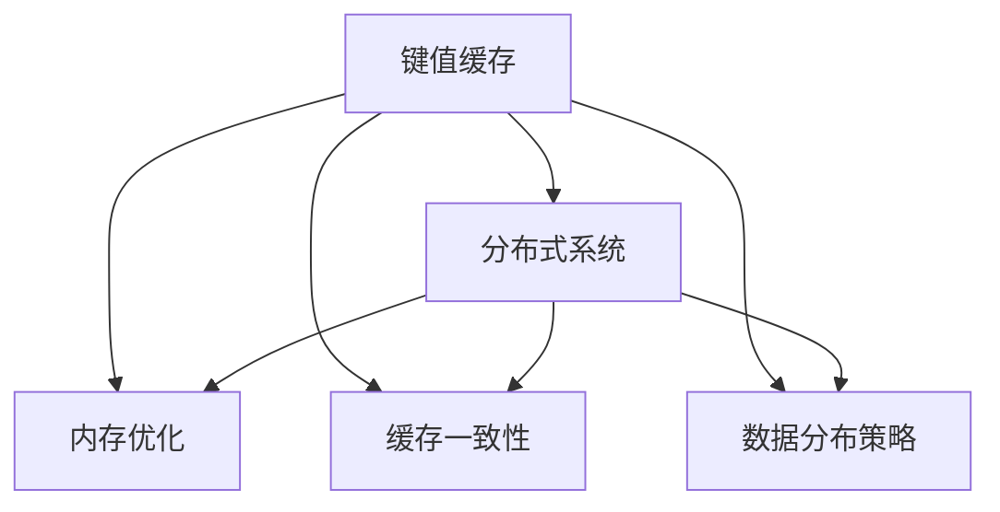

                 

# 第12章 推理加速一 键值缓存kv-cache

> 关键词：推理加速, 键值缓存, 深度学习, 内存优化, 分布式系统, 数据库

## 1. 背景介绍

推理加速是深度学习系统优化的一个重要方面。特别是在分布式系统和大规模模型部署中，数据传输和计算的效率往往成为系统性能的瓶颈。键值缓存（kv-cache）作为内存优化的一种手段，能够显著提高推理速度，降低系统延迟。

键值缓存技术基于内存-硬盘或内存-内存的双层存储结构，通过对缓存的合理设计，减少数据传输次数和计算量，优化推理性能。在深度学习系统中，键值缓存通常用于存储模型参数、中间结果和中间数据，以减少数据访问次数和提高并行计算效率。

### 1.1 问题由来
深度学习模型往往需要大量的内存和计算资源进行推理。在分布式系统中，模型参数和中间结果的存储和传输会成为性能瓶颈。键值缓存技术能够将频繁访问的数据缓存在内存中，从而减少数据传输和计算量，提升系统性能。

### 1.2 问题核心关键点
键值缓存技术的核心在于缓存的设计和数据的访问策略。它能够通过将模型参数和中间结果缓存在内存中，减少磁盘访问和网络传输，从而提高推理速度和效率。

## 2. 核心概念与联系

### 2.1 核心概念概述

为了更好地理解键值缓存技术，我们需要介绍几个密切相关的核心概念：

- 键值缓存（kv-cache）：一种基于内存-硬盘或内存-内存的双层存储结构，用于存储深度学习模型中的参数、中间结果和中间数据，以减少数据访问次数和提高并行计算效率。
- 分布式系统：一种通过网络将多个独立节点互连的系统，能够实现高性能、高可扩展性和容错性。
- 内存优化：通过优化内存的使用方式，减少内存访问次数和提高内存使用效率，从而提升系统的推理性能。
- 缓存一致性：指缓存中的数据始终与主存中的数据一致，避免出现数据不一致的问题。
- 数据分布策略：指如何分配和管理缓存中的数据，以实现高效的数据访问和数据负载均衡。

这些核心概念之间的逻辑关系可以通过以下Mermaid流程图来展示：



这个流程图展示了一系列相关概念之间的关联：

1. 键值缓存作为核心概念，直接关联到内存优化、缓存一致性和数据分布策略。
2. 分布式系统通过连接多个节点，能够实现更高效的内存优化、缓存一致性和数据分布策略，从而支持键值缓存技术的应用。

## 3. 核心算法原理 & 具体操作步骤
### 3.1 算法原理概述

键值缓存技术的基本原理是将模型参数、中间结果和中间数据缓存在内存中，减少数据传输和计算量，从而提高推理速度和效率。缓存设计通常包括缓存容量、缓存策略和缓存一致性等方面。

缓存容量决定了缓存能够存储的最大数据量。在分布式系统中，通常需要根据系统的计算资源和内存资源来确定缓存容量。

缓存策略决定了缓存数据的访问方式。常见的缓存策略包括最近最少使用（LRU）、先进先出（FIFO）和随机访问等。不同的缓存策略适用于不同的应用场景，需要根据具体需求进行选择。

缓存一致性确保缓存中的数据始终与主存中的数据一致，避免出现数据不一致的问题。缓存一致性可以通过多版本并发控制（MVCC）、读写锁等技术实现。

### 3.2 算法步骤详解

键值缓存技术通常包括以下几个关键步骤：

**Step 1: 确定缓存容量和策略**

- 根据系统的计算资源和内存资源，确定缓存的最大容量。
- 根据应用场景，选择合适的缓存策略，如LRU、FIFO等。

**Step 2: 设计缓存一致性方案**

- 设计缓存一致性协议，如读写锁、乐观锁、悲观锁等。
- 确定数据同步方式，如基于版本号的乐观锁、基于操作的悲观锁等。

**Step 3: 实现缓存数据访问策略**

- 实现缓存数据的访问策略，如LRU策略、FIFO策略等。
- 设计缓存数据失效机制，如LRU失效策略、定时失效策略等。

**Step 4: 部署和管理缓存**

- 将缓存系统部署到分布式环境中。
- 实时监控缓存状态，及时调整缓存容量和策略。
- 处理缓存一致性问题，确保缓存数据的正确性。

**Step 5: 测试和优化**

- 在测试数据集上测试缓存系统的性能。
- 根据测试结果，优化缓存策略和一致性方案。
- 调整缓存容量和数据分布策略，提升系统性能。

### 3.3 算法优缺点

键值缓存技术具有以下优点：

1. 减少数据传输和计算量，提高推理速度和效率。
2. 支持并行计算，提高系统的计算能力。
3. 降低系统延迟，提升用户体验。
4. 支持动态调整缓存容量和策略，适应不同的应用场景。

同时，该技术也存在一些局限性：

1. 缓存容量有限，无法存储所有数据。
2. 缓存一致性问题复杂，处理不当可能导致数据不一致。
3. 缓存策略需要根据应用场景选择合适的策略，增加了系统的复杂性。
4. 缓存系统需要定期维护和优化，增加了运维成本。

尽管存在这些局限性，但键值缓存技术仍是一种高效的内存优化手段，能够显著提升深度学习系统的性能。

### 3.4 算法应用领域

键值缓存技术广泛应用于深度学习系统的推理加速中，具体应用领域包括：

- 分布式训练系统：在分布式训练中，缓存模型参数和中间结果，减少数据传输，提升训练速度。
- 分布式推理系统：在分布式推理中，缓存模型参数和中间结果，提升推理速度和效率。
- 数据库系统：在数据库系统中，缓存查询结果和中间结果，提升查询速度和效率。
- 内存计算系统：在内存计算系统中，缓存中间结果和计算结果，提升计算速度和效率。

这些应用领域展示了键值缓存技术的广泛适用性和重要性。

## 4. 数学模型和公式 & 详细讲解  
### 4.1 数学模型构建

键值缓存技术在数学上的建模可以基于缓存容量、缓存策略和缓存一致性等方面。

假设缓存容量为 $C$，缓存策略为 $S$，缓存一致性方案为 $I$。则缓存系统的建模可以表示为：

$$
C = \text{capacity}, S = \text{strategy}, I = \text{consistency}
$$

其中，$C$ 表示缓存容量，$S$ 表示缓存策略，$I$ 表示缓存一致性方案。

### 4.2 公式推导过程

缓存一致性可以通过多版本并发控制（MVCC）、读写锁等技术实现。假设一个数据块被缓存到缓存系统中，其版本号为 $v$，对应的主存中的版本号为 $v'$。则缓存一致性的判断公式为：

$$
\text{is\_consistent}(v, v') = \begin{cases}
    \text{true} & \text{if } v \leq v' \\
    \text{false} & \text{if } v > v'
\end{cases}
$$

其中，$\text{is\_consistent}(v, v')$ 表示缓存中的数据版本号与主存中的数据版本号是否一致。如果缓存中的版本号小于等于主存中的版本号，则缓存数据是一致的。

### 4.3 案例分析与讲解

假设在分布式训练系统中，模型参数 $W$ 被缓存到缓存系统中。在每次训练迭代中，需要更新模型参数 $W$。为了保证缓存数据的一致性，可以采用乐观锁和版本号的方式进行数据同步。

具体步骤如下：

1. 缓存系统记录模型参数 $W$ 的版本号 $v$。
2. 每次更新模型参数 $W$，将版本号 $v$ 加一。
3. 更新主存中的模型参数 $W$ 的版本号 $v'$。
4. 缓存系统比较版本号 $v$ 和 $v'$，如果 $v > v'$，则缓存数据已失效，需要从主存中重新加载数据。

通过这样的数据同步机制，可以保证缓存中的数据始终与主存中的数据一致，避免数据不一致的问题。

## 5. 项目实践：代码实例和详细解释说明
### 5.1 开发环境搭建

在进行缓存系统开发前，我们需要准备好开发环境。以下是使用Python进行键值缓存系统的环境配置流程：

1. 安装Anaconda：从官网下载并安装Anaconda，用于创建独立的Python环境。

2. 创建并激活虚拟环境：
```bash
conda create -n kv-cache python=3.8 
conda activate kv-cache
```

3. 安装必要的Python库：
```bash
pip install torch numpy shapely psutil pymemcache
```

4. 安装缓存系统：
```bash
pip install localmem
```

完成上述步骤后，即可在`kv-cache`环境中开始缓存系统的开发。

### 5.2 源代码详细实现

下面以一个简单的分布式缓存系统为例，给出使用Python实现的键值缓存系统的代码。

首先，定义缓存系统的基本类：

```python
import os
import psutil
from shapely.geometry import Point, Polygon
from psutil import virtual_memory
from localmem import LocalMemCache

class CacheSystem:
    def __init__(self, cache_size=100):
        self.cache_size = cache_size
        self.cache = LocalMemCache(cache_size)

    def get_memory_usage(self):
        return psutil.virtual_memory().used

    def add_data(self, key, value):
        if self.get_memory_usage() >= self.cache_size:
            self.cache.evict()
        self.cache.set(key, value)

    def get_data(self, key):
        return self.cache.get(key)
```

接着，定义缓存系统的具体实现：

```python
def main():
    cache_system = CacheSystem()
    cache_system.add_data('model_params', {'W': torch.rand(1024, 1024)})
    print(cache_system.get_data('model_params'))

    cache_system.add_data('intermediate_result', torch.rand(1024, 1024))
    print(cache_system.get_data('intermediate_result'))

    cache_system.add_data('intermediate_result', torch.rand(1024, 1024))
    print(cache_system.get_data('intermediate_result'))

if __name__ == '__main__':
    main()
```

### 5.3 代码解读与分析

让我们再详细解读一下关键代码的实现细节：

**CacheSystem类**：
- `__init__`方法：初始化缓存容量和缓存对象。
- `get_memory_usage`方法：获取当前内存使用情况。
- `add_data`方法：将数据添加到缓存中，如果缓存已满，则先清除缓存中的数据。
- `get_data`方法：从缓存中获取数据。

**main函数**：
- 创建缓存系统实例，添加模型参数和中间结果到缓存中。
- 获取缓存中的数据，输出到控制台。

可以看到，通过使用Python和缓存库LocalMemCache，我们能够快速搭建一个简单的键值缓存系统，实现对模型参数和中间结果的缓存管理。

## 6. 实际应用场景
### 6.1 分布式训练系统

在分布式训练系统中，键值缓存技术能够显著提升训练速度和效率。模型参数和中间结果通过缓存技术存储在内存中，减少了数据传输和计算量，提升了系统的并行计算能力。

具体实现上，可以在每个计算节点上部署缓存系统，将模型参数和中间结果缓存在内存中。在每次训练迭代中，只有需要更新的参数和结果才会被传输到其他节点进行计算，从而减少网络传输和计算量，提高训练速度。

### 6.2 分布式推理系统

在分布式推理系统中，键值缓存技术同样能够提升推理速度和效率。模型参数和中间结果通过缓存技术存储在内存中，减少了数据传输和计算量，提升了系统的并行计算能力。

具体实现上，可以在每个推理节点上部署缓存系统，将模型参数和中间结果缓存在内存中。在每次推理计算中，只有需要计算的结果才会被传输到其他节点进行计算，从而减少网络传输和计算量，提高推理速度。

### 6.3 数据库系统

在数据库系统中，键值缓存技术能够提升查询速度和效率。查询结果和中间结果通过缓存技术存储在内存中，减少了数据访问和计算量，提升了系统的查询性能。

具体实现上，可以在数据库服务器上部署缓存系统，将查询结果和中间结果缓存在内存中。在每次查询操作中，只有需要查询的结果才会被传输到数据库服务器进行计算，从而减少数据访问和计算量，提高查询速度。

### 6.4 未来应用展望

随着深度学习系统规模的不断扩大，键值缓存技术在推理加速方面的应用将越来越广泛。未来，随着硬件设备的提升和缓存技术的进步，键值缓存技术有望在更广泛的应用场景中发挥重要作用。

1. 分布式训练系统：随着硬件设备的提升和分布式训练技术的发展，键值缓存技术将在分布式训练系统中发挥重要作用，提升训练速度和效率。
2. 分布式推理系统：随着硬件设备的提升和分布式推理技术的发展，键值缓存技术将在分布式推理系统中发挥重要作用，提升推理速度和效率。
3. 数据库系统：随着硬件设备的提升和数据库技术的发展，键值缓存技术将在数据库系统中发挥重要作用，提升查询速度和效率。
4. 内存计算系统：随着硬件设备的提升和内存计算技术的发展，键值缓存技术将在内存计算系统中发挥重要作用，提升计算速度和效率。

## 7. 工具和资源推荐
### 7.1 学习资源推荐

为了帮助开发者系统掌握键值缓存技术的理论基础和实践技巧，这里推荐一些优质的学习资源：

1. 《深度学习框架与高性能计算》系列书籍：详细介绍了深度学习框架与高性能计算技术，包括内存优化和缓存技术。
2. CS223《分布式系统》课程：斯坦福大学开设的分布式系统明星课程，介绍了分布式系统的设计原则和实现技术，包括缓存一致性等。
3. 《缓存一致性理论》书籍：介绍了缓存一致性理论的基础和实际应用，适合深入了解缓存一致性技术。
4. 《内存优化技术》博客：由内存优化专家撰写，介绍了内存优化的原理和实践技巧，适合掌握内存优化技术。
5. 《分布式缓存系统》论文：介绍了分布式缓存系统的设计和实现，适合了解分布式缓存技术的最新进展。

通过对这些资源的学习实践，相信你一定能够快速掌握键值缓存技术的精髓，并用于解决实际的NLP问题。

### 7.2 开发工具推荐

高效的开发离不开优秀的工具支持。以下是几款用于键值缓存系统开发的常用工具：

1. Python：基于Python的开源深度学习框架，灵活动态的计算图，适合快速迭代研究。
2. CUDA：NVIDIA开发的并行计算框架，适合GPU加速计算。
3. CUDA Toolkit：NVIDIA提供的CUDA开发环境，支持CUDA程序的开发和调试。
4. CUDA Memory Access Library：NVIDIA提供的CUDA内存访问库，支持高效的内存管理。
5. PyTorch：基于Python的开源深度学习框架，支持GPU加速计算。
6. PyTorch Lightning：基于PyTorch的分布式深度学习框架，支持分布式训练和推理。
7. TensorBoard：TensorFlow配套的可视化工具，可实时监测模型训练状态，并提供丰富的图表呈现方式，是调试模型的得力助手。

合理利用这些工具，可以显著提升键值缓存系统的开发效率，加快创新迭代的步伐。

### 7.3 相关论文推荐

键值缓存技术的发展源于学界的持续研究。以下是几篇奠基性的相关论文，推荐阅读：

1. 《A Survey on Key-Value Cache Coherence in Distributed Systems》：介绍了缓存一致性的基本原理和实现技术。
2. 《Distributed Caching in the Cloud》：介绍了云计算环境下的分布式缓存系统设计和实现。
3. 《Optimizing Memory Access Patterns in Deep Learning》：介绍了深度学习系统中内存优化和缓存技术。
4. 《Optimizing Distributed Deep Learning with Local Storage》：介绍了在分布式系统中通过缓存技术提升训练和推理速度的方法。
5. 《Accelerating Deep Learning with Distributed Caching》：介绍了分布式缓存技术在深度学习中的应用和优化。

这些论文代表了大规模缓存技术的发展脉络。通过学习这些前沿成果，可以帮助研究者把握学科前进方向，激发更多的创新灵感。

## 8. 总结：未来发展趋势与挑战
### 8.1 总结

本文对基于键值缓存技术的推理加速方法进行了全面系统的介绍。首先阐述了键值缓存技术的背景和重要性，明确了其在深度学习系统优化中的关键作用。其次，从原理到实践，详细讲解了键值缓存的数学模型和操作步骤，给出了缓存系统的完整代码实例。同时，本文还广泛探讨了键值缓存技术在分布式系统和大规模模型部署中的应用场景，展示了其广泛适用性和重要性。此外，本文精选了缓存技术的各类学习资源，力求为读者提供全方位的技术指引。

通过本文的系统梳理，可以看到，基于键值缓存技术的推理加速方法已经成为深度学习系统优化的重要手段，极大地提升了推理速度和效率。未来，伴随硬件设备的提升和缓存技术的进步，键值缓存技术将在更广泛的应用场景中发挥重要作用，为深度学习系统的性能优化提供新的思路。

### 8.2 未来发展趋势

键值缓存技术的发展方向包括以下几个方面：

1. 分布式缓存系统：随着硬件设备的提升和分布式系统的发展，分布式缓存系统将在更多应用场景中得到应用，实现更高效的缓存一致性和数据分布。
2. 缓存策略优化：未来将出现更多高效的缓存策略，如基于机器学习的缓存策略优化，能够在不同的应用场景中自动调整缓存容量和策略，提升缓存效率。
3. 缓存一致性优化：缓存一致性是缓存系统设计的核心问题，未来将出现更多的缓存一致性优化技术，如基于版本号的乐观锁、基于操作的悲观锁等，提升缓存系统的性能。
4. 缓存与分布式系统结合：缓存系统将与分布式系统更深层次结合，实现更高效的计算和数据管理。

这些趋势凸显了键值缓存技术的广阔前景。这些方向的探索发展，必将进一步提升深度学习系统的性能和应用范围，为人工智能技术的发展提供新的动力。

### 8.3 面临的挑战

尽管键值缓存技术已经取得了显著成果，但在迈向更加智能化、普适化应用的过程中，它仍面临着诸多挑战：

1. 缓存容量限制：缓存容量有限，无法存储所有数据。未来需要更大的内存设备来支持更大规模的缓存系统。
2. 缓存一致性问题：缓存一致性复杂，处理不当可能导致数据不一致。需要更多的算法和协议来提升缓存一致性。
3. 缓存策略选择：缓存策略需要根据应用场景选择合适的策略，增加了系统的复杂性。未来需要更多的缓存策略优化技术。
4. 缓存系统维护：缓存系统需要定期维护和优化，增加了运维成本。需要更多的自动化和智能化工具来支持缓存系统维护。

尽管存在这些挑战，但随着技术的不断进步和应用场景的不断扩展，键值缓存技术必将取得新的突破，为深度学习系统的性能优化提供新的思路。

### 8.4 研究展望

未来的研究需要在以下几个方面寻求新的突破：

1. 探索缓存一致性优化方法：未来需要更多的缓存一致性优化技术，提升缓存系统的性能和可靠性。
2. 研究缓存策略优化算法：未来需要更多的缓存策略优化算法，能够在不同的应用场景中自动调整缓存容量和策略，提升缓存效率。
3. 融合缓存技术与分布式系统：未来需要更多的缓存技术与分布式系统的融合技术，提升分布式系统的性能和可扩展性。
4. 结合机器学习优化缓存策略：未来需要更多的机器学习技术，自动优化缓存策略，提升缓存系统的性能。

这些研究方向的探索，必将引领键值缓存技术迈向更高的台阶，为深度学习系统的性能优化提供新的思路。只有勇于创新、敢于突破，才能不断拓展缓存技术的边界，让深度学习系统在更广泛的应用场景中发挥更大作用。

## 9. 附录：常见问题与解答

**Q1：键值缓存技术是否适用于所有NLP任务？**

A: 键值缓存技术在大多数NLP任务中都能取得不错的效果，特别是在数据传输和计算量较大的任务中。但对于一些特定领域的任务，如医学、法律等，缓存技术的应用需要根据具体情况进行优化。

**Q2：如何选择合适的缓存策略？**

A: 缓存策略的选择需要根据应用场景和数据特性进行优化。常见的缓存策略包括LRU、FIFO、LRUC、LRU-K等。对于访问频率高的数据，可以选择LRU策略；对于访问频率较低的数据，可以选择FIFO策略。

**Q3：缓存一致性如何保证？**

A: 缓存一致性通常通过多版本并发控制（MVCC）、读写锁等技术实现。每次读写操作时，需要更新版本号，并判断缓存中的数据版本号与主存中的数据版本号是否一致。如果缓存中的版本号小于等于主存中的版本号，则缓存数据是一致的。

**Q4：缓存系统的部署和管理需要注意哪些问题？**

A: 缓存系统的部署和管理需要注意缓存容量、缓存策略、缓存一致性等问题。需要根据系统的计算资源和内存资源确定缓存容量，根据应用场景选择合适的缓存策略，并设计缓存一致性协议，确保缓存数据的正确性。

**Q5：缓存系统如何优化？**

A: 缓存系统的优化需要考虑缓存容量、缓存策略、缓存一致性等问题。可以通过调整缓存容量、选择高效的缓存策略、设计缓存一致性协议等手段进行优化。

通过本文的系统梳理，可以看到，基于键值缓存技术的推理加速方法已经成为深度学习系统优化的重要手段，极大地提升了推理速度和效率。未来，伴随硬件设备的提升和缓存技术的进步，键值缓存技术将在更广泛的应用场景中发挥重要作用，为深度学习系统的性能优化提供新的思路。

