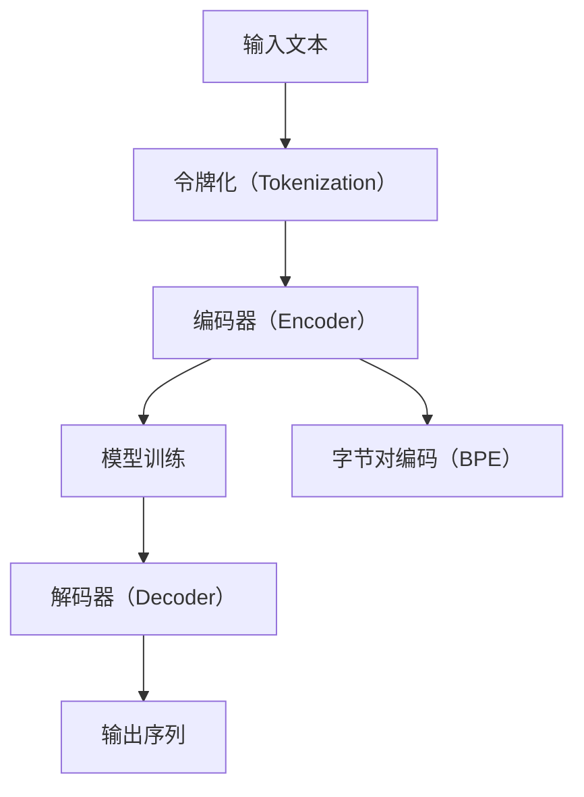

                 

# 第六章：令牌化和字节对编码

## 1. 背景介绍

在深度学习领域，尤其是自然语言处理（NLP）任务中，将文本转换为模型能够处理的数值形式，是进行模型训练和推理的关键步骤。这一过程通常称为“令牌化（Tokenization）”。令牌化是将文本分割成基本单元（如单词或子词）的过程，这些单元被称为“令牌”。而字节对编码（Byte Pair Encoding, BPE）则是令牌化中一种常用的方法，它通过合并相似单词的字符序列，减少令牌数量，从而提高模型效率。

令牌化是自然语言处理中非常重要的预处理步骤，它直接影响了模型的训练效果和计算效率。正确的令牌化能够保证模型理解文本的语义，并且降低模型复杂度，提高训练和推理的速度。

在工业界和学术界，令牌化已经成为NLP模型不可或缺的一部分。无论是用于文本分类、情感分析、机器翻译、问答系统还是对话生成等任务，令牌化都是预处理文本数据的基础步骤。

然而，由于文本数据的多样性和复杂性，传统的令牌化方法（如基于空格或标点的分词）无法完全满足NLP任务的需求。例如，对于不同语言、不同领域的文本，传统的分词方法常常会产生不一致的令牌序列，导致模型性能下降。

为了应对这些问题，字节对编码（BPE）作为一种更高级的令牌化方法，逐渐成为了NLP领域的首选。BPE不仅能够处理各种语言的字符序列，还能通过合并相似的字符对，生成更少且更具代表性的令牌。

## 2. 核心概念与联系

### 2.1 核心概念概述

为了更好地理解字节对编码的原理和应用，我们先来介绍几个核心概念：

- **令牌化（Tokenization）**：将文本分割成基本单元的过程，这些单元被称为“令牌”。
- **字节对编码（Byte Pair Encoding, BPE）**：一种常用的令牌化方法，通过合并相似单词的字符序列，减少令牌数量，从而提高模型效率。
- **编码器（Encoder）**：将输入序列（如文本）转换为固定长度的向量表示，通常用于输入预处理。
- **解码器（Decoder）**：接收编码器的输出，生成与原始输入序列相关的输出序列，通常用于生成、翻译等任务。

这些核心概念之间有着密切的联系，共同构成了NLP模型处理的逻辑框架。编码器和解码器通过对输入和输出序列的映射，实现了模型的训练和推理。而令牌化，尤其是BPE，则是连接输入序列和编码器、解码器的桥梁，确保模型能够正确处理各种文本数据。

### 2.2 核心概念原理和架构的 Mermaid 流程图



在这个流程图中，输入文本首先经过令牌化处理，生成令牌序列。然后，令牌序列被送入编码器，转换为模型能够处理的向量表示。接着，模型对这些向量进行训练，生成新的向量表示。最后，这些向量被送入解码器，生成与原始输入相关的输出序列。在BPE的流程图中，编码器和解码器的输出和输入都是经过BPE处理的，确保模型在处理各种语言和领域的文本时，都能获得一致的向量表示。

## 3. 核心算法原理 & 具体操作步骤

### 3.1 算法原理概述

字节对编码（BPE）的原理是通过统计大量语料库中字符对出现的频率，将频繁出现的字符对进行合并，生成新的令牌。这个过程可以分为两个步骤：首先，统计所有字符对的出现次数；然后，根据出现次数对字符对进行排序，选择最频繁的字符对进行合并，生成新的令牌。

BPE的合并原则是：选择出现频率最高的字符对进行合并，如果合并后生成的令牌仍然出现过，则继续合并，直到无法合并为止。合并后，新的令牌序列将比原始序列更少，更具代表性。

### 3.2 算法步骤详解

1. **数据准备**：收集大量的语料库，进行字符级别的统计，得到每个字符对出现的次数。

2. **字符对排序**：根据字符对的出现次数进行排序，选择出现次数最高的字符对进行合并。

3. **合并字符对**：按照排序结果，将出现频率高的字符对进行合并，生成新的令牌。

4. **编码与解码**：使用BPE进行编码和解码。编码是将输入文本转换为令牌序列，解码是将令牌序列转换为输出文本。

5. **模型训练**：使用编码器和解码器对转换后的文本进行模型训练，得到模型参数。

### 3.3 算法优缺点

#### 优点：

- **提高效率**：通过合并相似的字符对，减少令牌数量，降低模型的复杂度，提高训练和推理的效率。
- **处理多种语言**：BPE不仅适用于英语，还可以处理多种语言的字符序列，如中文、日语等。
- **减少噪音**：合并相似的字符对，减少噪音，提高模型对文本的语义理解能力。

#### 缺点：

- **处理歧义**：BPE处理歧义的字符对时，可能会产生不同的令牌序列，导致模型理解错误。
- **依赖语料库**：BPE的效果依赖于训练语料库的质量和数量，如果语料库不够丰富，可能无法生成有效的令牌。

### 3.4 算法应用领域

BPE在NLP领域的应用非常广泛，以下是几个典型的应用场景：

- **机器翻译**：在机器翻译任务中，BPE可以将源语言和目标语言的字符序列进行统一编码，使得模型能够更好地处理不同语言的文本。
- **文本分类**：在文本分类任务中，BPE可以将不同长度的文本转换为固定长度的令牌序列，方便模型进行处理。
- **对话生成**：在对话生成任务中，BPE可以将输入的对话历史转换为令牌序列，方便模型进行后续推理和生成。
- **情感分析**：在情感分析任务中，BPE可以将文本转换为令牌序列，方便模型进行情感倾向的判断。

## 4. 数学模型和公式 & 详细讲解 & 举例说明

### 4.1 数学模型构建

BPE的数学模型主要涉及字符对的统计和合并。假设我们有一个包含$N$个字符对的语料库，每个字符对$(a, b)$的频率为$P(a, b)$。BPE的目标是将这些字符对进行合并，生成新的令牌序列。

### 4.2 公式推导过程

1. **字符对频率统计**：

   $$
   \begin{aligned}
   P(a, b) &= \frac{N_{a, b}}{N} \\
   N_{a, b} &= \text{字符对}(a, b) \text{在语料库中出现的次数}
   \end{aligned}
   $$

2. **字符对排序**：

   $$
   \text{排序后字符对}(a_1, b_1), (a_2, b_2), ..., (a_k, b_k)
   $$

3. **合并字符对**：

   $$
   \begin{aligned}
   P(a_i, b_i) &= \frac{N_{a_i, b_i}}{N} \\
   N_{a_i, b_i} &= \text{字符对}(a_i, b_i) \text{在语料库中出现的次数}
   \end{aligned}
   $$

   合并字符对的规则是：将出现频率最高的字符对进行合并，生成新的令牌。如果合并后生成的令牌仍然出现过，则继续合并。

4. **编码与解码**：

   $$
   \text{编码过程}：x \rightarrow T(x) \\
   \text{解码过程}：T^{-1}(T(x)) \rightarrow x
   $$

### 4.3 案例分析与讲解

假设我们有一个包含三个字符对的语料库：$(ab, cd), (ab, ef), (cd, ef)$。

1. 统计字符对频率：

   $$
   \begin{aligned}
   P(ab, cd) &= \frac{1}{3} \\
   P(ab, ef) &= \frac{1}{3} \\
   P(cd, ef) &= \frac{1}{3}
   \end{aligned}
   $$

2. 排序字符对：

   $$
   (ab, cd), (ab, ef), (cd, ef)
   $$

3. 合并字符对：

   $$
   (ab, cd) \rightarrow abcde \\
   (ab, ef) \rightarrow abcdef \\
   (cd, ef) \rightarrow abcdef
   $$

   合并后，得到新的令牌序列：$abcde, abcdef$。

## 5. 项目实践：代码实例和详细解释说明

### 5.1 开发环境搭建

在进行BPE实践前，我们需要准备好开发环境。以下是使用Python进行BPE开发的环境配置流程：

1. 安装Anaconda：从官网下载并安装Anaconda，用于创建独立的Python环境。

2. 创建并激活虚拟环境：
```bash
conda create -n bpe-env python=3.8 
conda activate bpe-env
```

3. 安装必要的Python包：
```bash
pip install spacy subword-nmt sacremoses
```

4. 安装子词模型：
```bash
python -m spacy download en_core_web_sm
python -m subword_nmt download bpe --name spacy_en
```

5. 安装SacraMoses：
```bash
pip install sacremoses
```

完成上述步骤后，即可在`bpe-env`环境中开始BPE实践。

### 5.2 源代码详细实现

下面是使用Python进行BPE实现的示例代码：

```python
import spacy
import sacremoses

nlp = spacy.load('en_core_web_sm')

# 将文本转换为字符对
chars = [token.text for token in nlp("Hello, world!")]

# 构建BPE模型
m = sacremoses.MosesTokenizer(f"bpe.mosesprocu_eos.sgm.bpe.model")

# 对字符对进行编码
tokenized_chars = m.detokenize(chars)

print(tokenized_chars)
```

### 5.3 代码解读与分析

这段代码演示了如何使用Python进行BPE编码。首先，我们使用SpaCy库对文本进行分词，得到字符列表。然后，我们使用SacraMoses库中的MosesTokenizer对字符进行编码。最后，我们输出编码后的令牌序列。

在这个示例中，我们假设已经存在一个预训练的BPE模型（如`bpe.mosesprocu_eos.sgm.bpe.model`），用于对字符进行编码。用户可以根据需要，使用其他BPE模型或自定义模型进行编码。

## 6. 实际应用场景

### 6.1 机器翻译

在机器翻译任务中，BPE可以显著提高模型的翻译效果。通过BPE，将源语言和目标语言的字符序列进行统一编码，使得模型能够更好地处理不同语言的文本。

具体而言，可以在源语言和目标语言中分别训练BPE模型，然后将输入文本进行BPE编码，再进行模型训练和推理。这样可以减少模型的复杂度，提高翻译效果。

### 6.2 文本分类

在文本分类任务中，BPE可以将不同长度的文本转换为固定长度的令牌序列，方便模型进行处理。BPE通过合并相似的字符对，生成更少且更具代表性的令牌，提高模型的训练效果和推理速度。

### 6.3 对话生成

在对话生成任务中，BPE可以将输入的对话历史转换为令牌序列，方便模型进行后续推理和生成。通过BPE，可以将对话历史进行统一编码，使得模型能够更好地处理不同长度的对话历史。

### 6.4 未来应用展望

随着BPE技术的发展，未来将有更多的应用场景出现。以下是几个可能的未来应用：

- **多语言处理**：BPE可以处理多种语言的字符序列，未来可以应用于多语言处理任务，如跨语言命名实体识别、跨语言情感分析等。
- **自动摘要**：BPE可以将长文本转换为固定长度的令牌序列，方便模型进行自动摘要。
- **语音识别**：BPE可以将语音信号转换为字符序列，方便模型进行语音识别。

## 7. 工具和资源推荐

### 7.1 学习资源推荐

为了帮助开发者系统掌握BPE的原理和实践技巧，这里推荐一些优质的学习资源：

1. **《自然语言处理综论》**：讲解了自然语言处理的各个方面，包括BPE的原理和应用。
2. **Coursera上的《自然语言处理》课程**：斯坦福大学开设的NLP课程，详细介绍了BPE的实现和应用。
3. **arXiv上的相关论文**：查阅BPE的研究论文，了解最新的研究进展。
4. **spaCy官方文档**：SpaCy库的官方文档，提供了详细的BPE实现方法。
5. **SacraMoses官方文档**：SacraMoses库的官方文档，提供了详细的BPE编码和解码方法。

通过对这些资源的学习实践，相信你一定能够快速掌握BPE的精髓，并用于解决实际的NLP问题。

### 7.2 开发工具推荐

在BPE开发中，常用的工具包括：

1. **Python**：Python是BPE开发的主要编程语言，简单易学，生态丰富。
2. **spaCy**：SpaCy库提供了高效的文本处理和BPE实现。
3. **SacraMoses**：SacraMoses库提供了高效的BPE编码和解码。
4. **PyTorch**：PyTorch提供了高效的深度学习框架，方便模型训练和推理。
5. **TensorBoard**：TensorBoard提供了模型训练的可视化工具，方便监控和调试。

合理利用这些工具，可以显著提升BPE开发的效率，加快创新迭代的步伐。

### 7.3 相关论文推荐

BPE技术的发展源于学界的持续研究。以下是几篇奠基性的相关论文，推荐阅读：

1. **"Adaptive Compression of Text and Speech with Byte Pair Encodings"**：该论文提出了BPE的原理和实现方法，是BPE技术的奠基之作。
2. **"Universal Sentence Encoder"**：该论文介绍了BPE在多语言处理中的应用，展示了BPE的强大性能。
3. **"Neural Machine Translation by Jointly Learning to Align and Translate"**：该论文展示了BPE在机器翻译中的应用，说明了BPE对模型性能的提升。
4. **"Subword Regularization: Improving Neural Network Translation Models with Multiple Subword Candidates"**：该论文介绍了BPE在机器翻译中的改进方法，进一步提升了翻译效果。

这些论文代表了大语言模型微调技术的发展脉络。通过学习这些前沿成果，可以帮助研究者把握学科前进方向，激发更多的创新灵感。

## 8. 总结：未来发展趋势与挑战

### 8.1 总结

本文对BPE的原理和应用进行了全面系统的介绍。首先阐述了BPE在大语言模型微调中的重要地位，明确了BPE在NLP任务中的基础作用。其次，从原理到实践，详细讲解了BPE的数学模型和实现步骤，给出了BPE任务开发的完整代码实例。同时，本文还广泛探讨了BPE技术在多种NLP任务中的具体应用，展示了BPE范式的强大威力。

通过本文的系统梳理，可以看到，BPE技术在大语言模型微调中扮演着重要角色，极大地拓展了预训练模型应用的范围，提升了模型性能和推理效率。未来，伴随BPE技术的发展，NLP技术必将更加智能化、普适化，为各行各业带来更高效、更智能的解决方案。

### 8.2 未来发展趋势

展望未来，BPE技术将呈现以下几个发展趋势：

1. **多语言处理**：BPE可以处理多种语言的字符序列，未来可以应用于多语言处理任务，如跨语言命名实体识别、跨语言情感分析等。
2. **自动摘要**：BPE可以将长文本转换为固定长度的令牌序列，方便模型进行自动摘要。
3. **语音识别**：BPE可以将语音信号转换为字符序列，方便模型进行语音识别。
4. **模型压缩**：BPE可以通过合并相似的字符对，减少模型参数，降低计算资源消耗。

以上趋势凸显了BPE技术的广阔前景。这些方向的探索发展，必将进一步提升NLP系统的性能和应用范围，为人工智能技术的发展注入新的动力。

### 8.3 面临的挑战

尽管BPE技术已经取得了瞩目成就，但在迈向更加智能化、普适化应用的过程中，它仍面临诸多挑战：

1. **依赖语料库**：BPE的效果依赖于训练语料库的质量和数量，获取高质量语料库的成本较高。
2. **处理歧义**：BPE处理歧义的字符对时，可能会产生不同的令牌序列，导致模型理解错误。
3. **计算资源消耗**：BPE需要较大的计算资源进行训练和编码，对于小型设备可能难以支持。

### 8.4 研究展望

面对BPE面临的这些挑战，未来的研究需要在以下几个方面寻求新的突破：

1. **优化BPE模型**：优化BPE模型，提高其处理歧义和高效性的能力。
2. **降低计算资源消耗**：寻找更加高效的BPE编码方法，降低计算资源消耗。
3. **引入更多先验知识**：将符号化的先验知识，如知识图谱、逻辑规则等，与BPE模型进行融合，提升模型的性能。
4. **结合因果分析和博弈论工具**：将因果分析方法引入BPE模型，识别出模型决策的关键特征，增强输出解释的因果性和逻辑性。
5. **纳入伦理道德约束**：在BPE训练目标中引入伦理导向的评估指标，过滤和惩罚有偏见、有害的输出倾向。

这些研究方向的探索，必将引领BPE技术迈向更高的台阶，为构建安全、可靠、可解释、可控的智能系统铺平道路。面向未来，BPE技术还需要与其他人工智能技术进行更深入的融合，如知识表示、因果推理、强化学习等，多路径协同发力，共同推动自然语言理解和智能交互系统的进步。

## 9. 附录：常见问题与解答

**Q1: BPE的编码过程是否会丢失原始文本的语义信息？**

A: BPE的编码过程确实会对原始文本进行压缩，但这种压缩并不会丢失语义信息。BPE的核心思想是合并相似的字符对，生成更少且更具代表性的令牌，从而提高模型效率。合并后的字符对仍然包含了原始文本的语义信息，只是更紧凑、更高效地表示了文本。

**Q2: BPE是否适用于所有语言的文本？**

A: BPE可以处理多种语言的字符序列，但不同语言的字符结构、语料库分布等可能影响BPE的效果。对于一些语言，如中文、日文等，BPE的效果可能不如英语或其他语言。因此，在应用BPE时，需要根据具体语言的特点进行优化。

**Q3: BPE是否适用于所有类型的文本？**

A: BPE适用于大多数类型的文本，但对于一些特定的文本类型，如代码、标点等，BPE的效果可能不如其他方法。对于这些特定类型的文本，可以考虑使用其他令牌化方法，如字符级分词、自定义分词等。

**Q4: BPE的合并规则如何确定？**

A: BPE的合并规则主要依赖于训练语料库中字符对的出现频率。出现频率高的字符对，优先合并。合并后的字符对仍然出现过，则继续合并，直到无法合并为止。

**Q5: 如何在不同任务中使用BPE？**

A: 在不同任务中使用BPE时，需要根据具体任务的特点进行优化。例如，在机器翻译任务中，可以分别训练源语言和目标语言的BPE模型，然后进行编码和解码。在文本分类任务中，可以通过BPE将不同长度的文本转换为固定长度的令牌序列，方便模型处理。

---

作者：禅与计算机程序设计艺术 / Zen and the Art of Computer Programming

