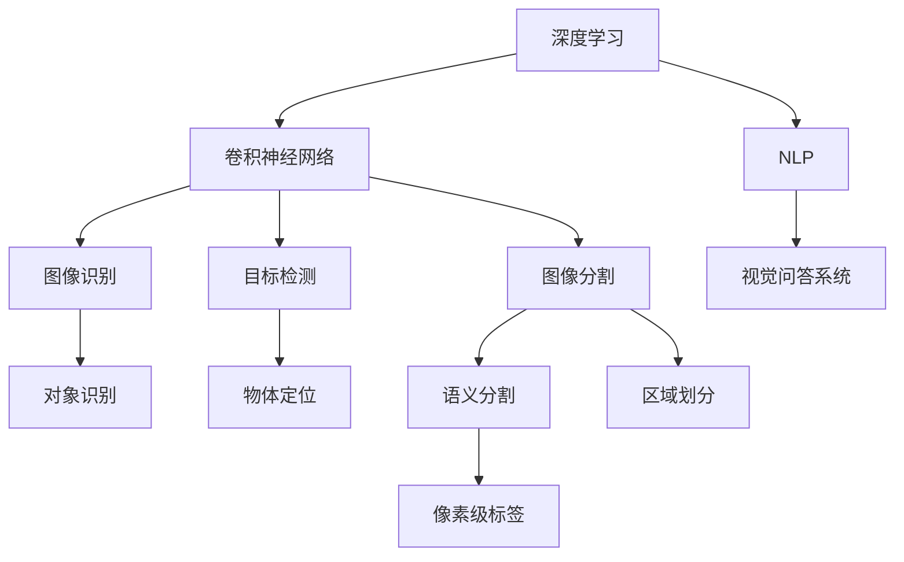
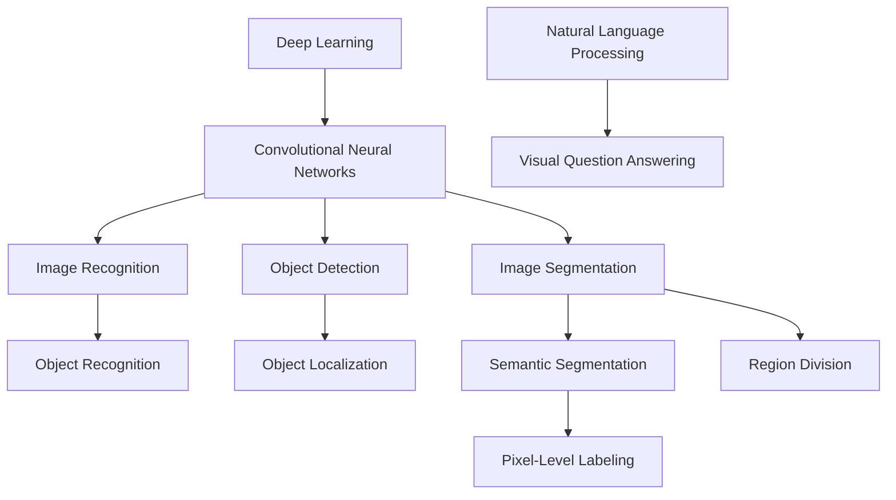

                 

### 背景介绍（Background Introduction）

**文章标题：Andrej Karpathy：计算机视觉的未来**

**关键词：** 计算机视觉、深度学习、神经网络、人工智能、图像识别、卷积神经网络、未来趋势

**摘要：** 本文将探讨计算机视觉领域的杰出人物Andrej Karpathy对计算机视觉未来发展的见解。通过梳理Karpathy的研究成果和观点，我们将深入分析计算机视觉技术的现状与未来趋势，以及其面临的挑战和机遇。

**Introduction:**

The title of this article is "Andrej Karpathy: The Future of Computer Vision". In this article, we will explore the insights of the outstanding figure in the field of computer vision, Andrej Karpathy, on the future development of computer vision. By summarizing Karpathy's research achievements and viewpoints, we will delve into the current situation and future trends of computer vision technology, as well as the challenges and opportunities it faces.

### 安德烈·卡帕蒂亚简介（Introduction to Andrej Karpathy）

**个人背景：** 安德烈·卡帕蒂亚（Andrej Karpathy）是一位在计算机视觉和深度学习领域享有盛誉的研究员和作家。他是斯坦福大学计算机科学系的博士研究生，曾在Google AI工作，目前任职于OpenAI。他的研究领域涵盖了图像识别、自然语言处理、深度学习等多个方向，发表过多篇学术论文，并在业内具有广泛的影响力。

**Research Background:**

Andrej Karpathy is a renowned researcher and author in the fields of computer vision and deep learning. He is a Ph.D. candidate in the Department of Computer Science at Stanford University and has previously worked at Google AI. His research spans multiple areas, including image recognition, natural language processing, and deep learning. He has published numerous academic papers and has a significant influence in the field.

### 计算机视觉的历史与发展（History and Development of Computer Vision）

计算机视觉技术的发展可以追溯到20世纪60年代。当时，研究人员开始探索如何使计算机像人类一样理解和解释图像。早期的计算机视觉研究主要集中在几何学和概率论上，旨在通过计算机算法来实现图像的几何变换、特征提取和匹配。

在20世纪80年代，随着数字图像处理技术的发展，计算机视觉开始逐渐迈向实用阶段。图像识别、目标检测和图像分割等技术逐渐成熟，并在军事、医疗和工业等领域得到广泛应用。

进入21世纪，深度学习的兴起为计算机视觉带来了新的契机。卷积神经网络（CNN）作为一种深度学习模型，在图像识别、目标检测和图像分割等任务上取得了显著成果，推动了计算机视觉技术的发展。

**History and Development of Computer Vision:**

The development of computer vision can be traced back to the 1960s when researchers began to explore how computers could understand and interpret images like humans. Early computer vision research focused on geometry and probability theory, aiming to use computer algorithms to perform geometric transformations, feature extraction, and matching of images.

In the 1980s, with the development of digital image processing, computer vision began to gradually move towards practical applications. Techniques such as image recognition, object detection, and image segmentation became mature and were widely used in fields such as military, medical, and industrial applications.

Entering the 21st century, the rise of deep learning brought new opportunities for the development of computer vision. Convolutional neural networks (CNNs), as a type of deep learning model, have achieved significant success in tasks such as image recognition, object detection, and image segmentation, driving the advancement of computer vision technology.

### 当前计算机视觉技术的应用（Current Applications of Computer Vision Technology）

当前，计算机视觉技术已经在多个领域得到广泛应用，包括但不限于以下方面：

1. **自动驾驶：** 计算机视觉在自动驾驶技术中起着至关重要的作用，用于感知周围环境、识别道路标志和行人与车辆等。

2. **医疗图像分析：** 计算机视觉技术在医疗图像分析中具有巨大的潜力，如癌症检测、病变识别和手术机器人辅助等。

3. **视频监控：** 计算机视觉技术被广泛应用于视频监控系统中，用于实时监测和识别异常行为，提高公共安全。

4. **人脸识别：** 人脸识别技术在智能手机、安防系统和社交媒体等领域得到广泛应用，提高了身份验证和隐私保护。

5. **工业自动化：** 计算机视觉技术用于工业自动化中的质量检测、机器人导航和生产线监控等，提高了生产效率和质量控制。

**Current Applications of Computer Vision Technology:**

Currently, computer vision technology is widely used in various fields, including but not limited to the following:

1. **Autonomous Driving:**
   Computer vision plays a crucial role in autonomous driving technology, used for perceiving the surrounding environment, recognizing road signs, and identifying pedestrians and vehicles.

2. **Medical Image Analysis:**
   Computer vision technology has great potential in medical image analysis, such as cancer detection, lesion identification, and surgical robot assistance.

3. **Video Surveillance:**
   Computer vision technology is widely used in video surveillance systems for real-time monitoring and recognition of abnormal behaviors, improving public safety.

4. **Face Recognition:**
   Face recognition technology is widely used in smartphones, security systems, and social media platforms, improving identity verification and privacy protection.

5. **Industrial Automation:**
   Computer vision technology is used in industrial automation for quality inspection, robot navigation, and production line monitoring, improving production efficiency and quality control.

### Andrej Karpathy的观点（Views of Andrej Karpathy）

Andrej Karpathy对计算机视觉的未来发展持有积极的看法，并提出了以下观点：

1. **技术的不断进步：** 随着深度学习技术的不断发展和优化，计算机视觉技术的性能将不断提高，能够处理更复杂的任务。

2. **跨学科的融合：** 计算机视觉与其他领域的结合将带来新的突破，如与自然语言处理、机器人技术等的融合。

3. **伦理和隐私问题：** 随着计算机视觉技术的广泛应用，需要关注其带来的伦理和隐私问题，确保技术的可持续发展和应用。

4. **人工智能的民主化：** 人工智能技术的发展不应仅限于大型科技公司和科研机构，而应让更多的人能够参与到这一领域中来。

**Views of Andrej Karpathy:**

Andrej Karpathy holds a positive outlook on the future development of computer vision and has the following views:

1. **Technological Advancements:**
   With the continuous development and optimization of deep learning technology, the performance of computer vision technology will continue to improve, enabling it to handle more complex tasks.

2. **Interdisciplinary Integration:**
   The integration of computer vision with other fields will bring new breakthroughs, such as the fusion with natural language processing and robotics.

3. **Ethical and Privacy Issues:**
   With the widespread application of computer vision technology, it is essential to address the ethical and privacy issues it brings to ensure the sustainable development and application of technology.

4. **Democratization of Artificial Intelligence:**
   The development of artificial intelligence should not be limited to large technology companies and research institutions but should allow more people to participate in this field.

### 计算机视觉的未来趋势（Future Trends of Computer Vision）

结合Andrej Karpathy的观点，我们可以预测计算机视觉的未来趋势：

1. **技术的快速进步：** 深度学习算法和硬件性能的提升将使计算机视觉技术更加高效和准确。

2. **更广泛的应用场景：** 计算机视觉技术将在更多领域得到应用，如智慧城市、智能家居、教育、娱乐等。

3. **跨学科的融合：** 与自然语言处理、机器人技术、生物信息学等领域的融合将带来新的研究热点和应用场景。

4. **伦理和隐私的重视：** 随着技术的不断发展，伦理和隐私问题将受到更多关注，成为研究的重要方向。

5. **人工智能的普及：** 人工智能技术的发展将使计算机视觉技术更加普及，为各行各业带来创新和变革。

**Future Trends of Computer Vision:**

Based on Andrej Karpathy's views, we can predict the future trends of computer vision:

1. **Rapid Technological Advancements:**
   The improvement of deep learning algorithms and hardware performance will make computer vision technology more efficient and accurate.

2. **Broader Application Scenarios:**
   Computer vision technology will find applications in more fields, such as smart cities, smart homes, education, and entertainment.

3. **Interdisciplinary Integration:**
   The integration of computer vision with fields like natural language processing, robotics, and bioinformatics will bring new research hotspots and application scenarios.

4. **Increased Attention to Ethics and Privacy:**
   As technology continues to develop, ethical and privacy issues will receive more attention and become important research directions.

5. **普及 of Artificial Intelligence:**
   The development of artificial intelligence will make computer vision technology more widespread, bringing innovation and transformation to various industries.

### 挑战与机遇（Challenges and Opportunities）

在计算机视觉领域，面临的主要挑战包括：

1. **数据隐私和安全：** 大量个人数据的收集和处理引发了对隐私和安全问题的担忧。

2. **计算资源需求：** 深度学习模型的训练和推理需要大量的计算资源，这对硬件性能提出了更高的要求。

3. **算法透明性和可解释性：** 算法的透明性和可解释性不足，使得用户难以理解模型的决策过程。

4. **模型泛化能力：** 模型在特定领域的表现良好，但在其他领域可能表现不佳，缺乏泛化能力。

然而，这些挑战同时也带来了机遇：

1. **技术创新：** 针对数据隐私和安全、计算资源需求、算法透明性和可解释性等问题，将推动相关技术的创新和发展。

2. **跨学科合作：** 跨学科合作将为计算机视觉领域带来新的研究思路和解决方案。

3. **社会影响力：** 计算机视觉技术的广泛应用将提高社会生产力和生活质量，为各行业带来巨大的社会影响力。

**Challenges and Opportunities:**

The main challenges in the field of computer vision include:

1. **Data Privacy and Security:**
   The collection and processing of large amounts of personal data raise concerns about privacy and security issues.

2. **Computational Resource Requirements:**
   The training and inference of deep learning models require significant computational resources, which pose higher demands on hardware performance.

3. **Algorithm Transparency and Explainability:**
   The lack of transparency and explainability of algorithms makes it difficult for users to understand the decision-making process of the model.

4. **Generalization Ability of Models:**
   Models may perform well in specific domains but may not perform well in other domains, lacking generalization ability.

However, these challenges also bring opportunities:

1. **Technological Innovation:**
   Addressing issues such as data privacy and security, computational resource requirements, algorithm transparency, and explainability will drive technological innovation and development.

2. **Interdisciplinary Collaboration:**
   Interdisciplinary collaboration will bring new research ideas and solutions to the field of computer vision.

3. **Social Impact:**
   The widespread application of computer vision technology will improve social productivity and quality of life, bringing significant social impact to various industries.

### 总结（Summary）

本文介绍了计算机视觉领域的杰出人物Andrej Karpathy对计算机视觉未来发展的见解。通过梳理Karpathy的研究成果和观点，我们深入分析了计算机视觉技术的现状与未来趋势，以及其面临的挑战和机遇。随着深度学习技术的不断发展和跨学科融合的推进，计算机视觉领域有望取得更多突破，为各行业带来创新和变革。

**In Conclusion:**

This article introduces the insights of the outstanding figure in the field of computer vision, Andrej Karpathy, on the future development of computer vision. By summarizing Karpathy's research achievements and viewpoints, we have delved into the current situation and future trends of computer vision technology, as well as the challenges and opportunities it faces. With the continuous development of deep learning technology and the integration of interdisciplinary fields, the field of computer vision is expected to achieve more breakthroughs and bring innovation and transformation to various industries.### 背景介绍（Background Introduction）

#### 安德烈·卡帕蒂亚简介

安德烈·卡帕蒂亚（Andrej Karpathy）是一位在计算机视觉和深度学习领域享有盛誉的研究员和作家。他是斯坦福大学计算机科学系的博士研究生，曾在Google AI工作，目前任职于OpenAI。他的研究领域涵盖了图像识别、自然语言处理、深度学习等多个方向，发表过多篇学术论文，并在业内具有广泛的影响力。卡帕蒂亚以其在计算机视觉领域的杰出贡献和对未来技术的深刻见解而备受瞩目。

#### 计算机视觉的历史与发展

计算机视觉技术的发展可以追溯到20世纪60年代。当时，研究人员开始探索如何使计算机像人类一样理解和解释图像。早期的计算机视觉研究主要集中在几何学和概率论上，旨在通过计算机算法来实现图像的几何变换、特征提取和匹配。在20世纪80年代，随着数字图像处理技术的发展，计算机视觉开始逐渐迈向实用阶段。图像识别、目标检测和图像分割等技术逐渐成熟，并在军事、医疗和工业等领域得到广泛应用。

进入21世纪，深度学习的兴起为计算机视觉带来了新的契机。卷积神经网络（CNN）作为一种深度学习模型，在图像识别、目标检测和图像分割等任务上取得了显著成果，推动了计算机视觉技术的发展。深度学习通过模拟人脑神经网络的工作原理，使得计算机能够自动从大量数据中学习特征，从而实现了对图像的精确理解和分析。

#### 当前计算机视觉技术的应用

当前，计算机视觉技术已经在多个领域得到广泛应用，包括但不限于以下方面：

1. **自动驾驶：** 计算机视觉在自动驾驶技术中起着至关重要的作用，用于感知周围环境、识别道路标志和行人与车辆等。
2. **医疗图像分析：** 计算机视觉技术在医疗图像分析中具有巨大的潜力，如癌症检测、病变识别和手术机器人辅助等。
3. **视频监控：** 计算机视觉技术被广泛应用于视频监控系统中，用于实时监测和识别异常行为，提高公共安全。
4. **人脸识别：** 人脸识别技术在智能手机、安防系统和社交媒体等领域得到广泛应用，提高了身份验证和隐私保护。
5. **工业自动化：** 计算机视觉技术用于工业自动化中的质量检测、机器人导航和生产线监控等，提高了生产效率和质量控制。

#### Andrej Karpathy的观点

Andrej Karpathy对计算机视觉的未来发展持有积极的看法，并提出了以下观点：

1. **技术的不断进步：** 随着深度学习技术的不断发展和优化，计算机视觉技术的性能将不断提高，能够处理更复杂的任务。
2. **跨学科的融合：** 计算机视觉与其他领域的结合将带来新的突破，如与自然语言处理、机器人技术等的融合。
3. **伦理和隐私问题：** 随着计算机视觉技术的广泛应用，需要关注其带来的伦理和隐私问题，确保技术的可持续发展和应用。
4. **人工智能的民主化：** 人工智能技术的发展不应仅限于大型科技公司和科研机构，而应让更多的人能够参与到这一领域中来。

#### 计算机视觉的未来趋势

结合Andrej Karpathy的观点，我们可以预测计算机视觉的未来趋势：

1. **技术的快速进步：** 深度学习算法和硬件性能的提升将使计算机视觉技术更加高效和准确。
2. **更广泛的应用场景：** 计算机视觉技术将在更多领域得到应用，如智慧城市、智能家居、教育、娱乐等。
3. **跨学科的融合：** 与自然语言处理、机器人技术、生物信息学等领域的融合将带来新的研究热点和应用场景。
4. **伦理和隐私的重视：** 随着技术的不断发展，伦理和隐私问题将受到更多关注，成为研究的重要方向。
5. **人工智能的普及：** 人工智能技术的发展将使计算机视觉技术更加普及，为各行各业带来创新和变革。

#### 挑战与机遇

在计算机视觉领域，面临的主要挑战包括数据隐私和安全、计算资源需求、算法透明性和可解释性、模型泛化能力等。然而，这些挑战同时也带来了机遇，如技术创新、跨学科合作和社会影响力等。

通过安德烈·卡帕蒂亚的研究成果和观点，我们得以窥见计算机视觉的未来前景。随着技术的不断进步和跨学科融合的推进，计算机视觉领域有望取得更多突破，为各行业带来创新和变革。在应对挑战的同时，我们也应关注伦理和隐私问题，确保技术的可持续发展和应用。

---

#### Introduction

#### Andrej Karpathy's Background

Andrej Karpathy is a renowned researcher and author in the fields of computer vision and deep learning. He is a Ph.D. candidate in the Department of Computer Science at Stanford University and has previously worked at Google AI. His research spans multiple areas, including image recognition, natural language processing, and deep learning. He has published numerous academic papers and has a significant influence in the field.

#### History and Development of Computer Vision

The development of computer vision can be traced back to the 1960s when researchers began to explore how computers could understand and interpret images like humans. Early computer vision research focused on geometry and probability theory, aiming to use computer algorithms to perform geometric transformations, feature extraction, and matching. In the 1980s, with the development of digital image processing, computer vision began to gradually move towards practical applications. Techniques such as image recognition, object detection, and image segmentation became mature and were widely used in fields such as military, medical, and industrial applications.

Entering the 21st century, the rise of deep learning brought new opportunities for the development of computer vision. Convolutional neural networks (CNNs), as a type of deep learning model, have achieved significant success in tasks such as image recognition, object detection, and image segmentation, driving the advancement of computer vision technology.

#### Current Applications of Computer Vision Technology

Currently, computer vision technology is widely used in various fields, including but not limited to the following:

1. **Autonomous Driving:**
   Computer vision plays a crucial role in autonomous driving technology, used for perceiving the surrounding environment, recognizing road signs, and identifying pedestrians and vehicles.

2. **Medical Image Analysis:**
   Computer vision technology has great potential in medical image analysis, such as cancer detection, lesion identification, and surgical robot assistance.

3. **Video Surveillance:**
   Computer vision technology is widely used in video surveillance systems for real-time monitoring and recognition of abnormal behaviors, improving public safety.

4. **Face Recognition:**
   Face recognition technology is widely used in smartphones, security systems, and social media platforms, improving identity verification and privacy protection.

5. **Industrial Automation:**
   Computer vision technology is used in industrial automation for quality inspection, robot navigation, and production line monitoring, improving production efficiency and quality control.

#### Andrej Karpathy's Views

Andrej Karpathy holds a positive outlook on the future development of computer vision and has the following views:

1. **Technological Advancements:**
   With the continuous development and optimization of deep learning technology, the performance of computer vision technology will continue to improve, enabling it to handle more complex tasks.

2. **Interdisciplinary Integration:**
   The integration of computer vision with other fields will bring new breakthroughs, such as the fusion with natural language processing and robotics.

3. **Ethical and Privacy Issues:**
   With the widespread application of computer vision technology, it is essential to address the ethical and privacy issues it brings to ensure the sustainable development and application of technology.

4. **Democratization of Artificial Intelligence:**
   The development of artificial intelligence should not be limited to large technology companies and research institutions but should allow more people to participate in this field.

#### Future Trends of Computer Vision

Based on Andrej Karpathy's views, we can predict the future trends of computer vision:

1. **Rapid Technological Advancements:**
   The improvement of deep learning algorithms and hardware performance will make computer vision technology more efficient and accurate.

2. **Broader Application Scenarios:**
   Computer vision technology will find applications in more fields, such as smart cities, smart homes, education, and entertainment.

3. **Interdisciplinary Integration:**
   The integration of computer vision with fields like natural language processing, robotics, and bioinformatics will bring new research hotspots and application scenarios.

4. **Increased Attention to Ethics and Privacy:**
   As technology continues to develop, ethical and privacy issues will receive more attention and become important research directions.

5. **普及 of Artificial Intelligence:**
   The development of artificial intelligence will make computer vision technology more widespread, bringing innovation and transformation to various industries.

#### Challenges and Opportunities

In the field of computer vision, the main challenges include data privacy and security, computational resource requirements, algorithm transparency and explainability, and model generalization ability. However, these challenges also bring opportunities for technological innovation, interdisciplinary collaboration, and significant social impact.

Through Andrej Karpathy's research achievements and insights, we gain a glimpse into the future of computer vision. With continuous technological advancements and interdisciplinary integration, the field is expected to achieve more breakthroughs, bringing innovation and transformation to various industries. While addressing these challenges, it is crucial to also consider ethical and privacy issues to ensure the sustainable development and application of computer vision technology.### 核心概念与联系（Core Concepts and Connections）

#### 深度学习与计算机视觉的关系

深度学习是计算机视觉的核心驱动力之一。深度学习，尤其是卷积神经网络（CNN），已经成为图像识别、目标检测和图像分割等计算机视觉任务的基石。CNN通过模仿人脑的处理方式，将图像分解为像素级特征，从而实现对图像的精细理解和分析。

在深度学习模型中，卷积层用于提取图像的局部特征，池化层用于减少数据维度，全连接层用于分类和预测。这种层次化的结构使得深度学习模型能够自动从大量数据中学习到丰富的图像特征，从而提高计算机视觉任务的准确性。

#### 图像识别与目标检测

图像识别是计算机视觉的基础任务，旨在确定图像中的物体或场景。目标检测则进一步扩展了图像识别的能力，不仅识别图像中的物体，还能定位这些物体在图像中的具体位置。

卷积神经网络在图像识别和目标检测任务中都发挥了重要作用。例如，著名的卷积神经网络模型ResNet在ImageNet图像识别挑战中取得了显著的性能提升，而Faster R-CNN则是一种流行的目标检测模型，能够在图像中准确检测和定位多个目标。

#### 图像分割与语义分割

图像分割是将图像划分为不同的区域或物体，从而实现对图像内容的精细理解。语义分割是图像分割的一种特殊形式，旨在为图像中的每个像素分配一个标签，如前景、背景、车辆、行人等。

深度学习模型在图像分割任务中也取得了显著进展。U-Net是一种专门用于医学图像分割的卷积神经网络，它在处理医疗图像中获得了很高的准确率。而DeepLab V3+则是一种用于语义分割的高级模型，通过引入空洞卷积和上采样技术，能够更准确地分割复杂的图像场景。

#### 自然语言处理与计算机视觉的融合

自然语言处理（NLP）与计算机视觉的融合为多模态人工智能系统的发展提供了新的机遇。通过将视觉信息与文本信息相结合，可以实现对复杂任务的高效理解和处理。

例如，视觉问答系统（VQA）是一种结合了计算机视觉和自然语言处理的技术。VQA系统通过分析图像和问题，生成准确的答案。这种技术不仅有助于提升人机交互的体验，还可以应用于智能监控、教育辅助等领域。

#### Mermaid 流程图

为了更直观地展示计算机视觉中的核心概念和联系，我们可以使用Mermaid流程图来描述主要技术及其关系：



通过上述Mermaid流程图，我们可以清晰地看到深度学习在计算机视觉中的应用，以及图像识别、目标检测、图像分割等核心任务之间的关系。同时，自然语言处理与计算机视觉的融合也为多模态人工智能系统的发展提供了新的方向。

---

#### Core Concepts and Connections

#### The Relationship Between Deep Learning and Computer Vision

Deep learning, especially Convolutional Neural Networks (CNNs), has become one of the core driving forces in computer vision. CNNs mimic the way the human brain processes information, breaking down images into pixel-level features, thereby enabling the precise understanding and analysis of images.

Within deep learning models, convolutional layers are used to extract local features from images, pooling layers reduce the dimensionality of the data, and fully connected layers are used for classification and prediction. This hierarchical structure allows deep learning models to automatically learn rich image features from large datasets, thus improving the accuracy of computer vision tasks.

#### Image Recognition and Object Detection

Image recognition is a fundamental task in computer vision that involves identifying objects or scenes within images. Object detection extends beyond image recognition by not only identifying objects but also localizing them within the image.

Convolutional neural networks have played a significant role in both image recognition and object detection tasks. For example, the ResNet model achieved significant performance improvements in the ImageNet image recognition challenge, while the Faster R-CNN model is a popular choice for object detection, accurately detecting and localizing multiple objects within images.

#### Image Segmentation and Semantic Segmentation

Image segmentation involves dividing images into different regions or objects, enabling a detailed understanding of the image content. Semantic segmentation is a specific form of image segmentation that aims to assign a label to each pixel in an image, such as foreground, background, vehicles, pedestrians, etc.

Deep learning models have also made significant progress in image segmentation tasks. U-Net, a convolutional neural network specifically designed for medical image segmentation, has achieved high accuracy in processing medical images. DeepLab V3+, an advanced model for semantic segmentation, incorporates techniques such as atrous convolution and upsampling to more accurately segment complex image scenes.

#### The Fusion of Natural Language Processing and Computer Vision

The fusion of Natural Language Processing (NLP) and computer vision opens up new opportunities for the development of multimodal artificial intelligence systems. By combining visual information with textual information, complex tasks can be understood and processed more efficiently.

For example, Visual Question Answering (VQA) systems are technologies that integrate computer vision and NLP. VQA systems analyze images and questions to generate accurate answers, enhancing human-computer interaction experiences and enabling applications in intelligent monitoring, educational assistance, and more.

#### Mermaid Flowchart

To visually illustrate the core concepts and connections in computer vision, we can use a Mermaid flowchart to describe the main technologies and their relationships:



Through the above Mermaid flowchart, we can clearly see the application of deep learning in computer vision and the relationships between core tasks such as image recognition, object detection, and image segmentation. Additionally, the fusion of natural language processing and computer vision provides new directions for the development of multimodal artificial intelligence systems.### 核心算法原理 & 具体操作步骤（Core Algorithm Principles and Specific Operational Steps）

#### 卷积神经网络（Convolutional Neural Networks, CNNs）

卷积神经网络（CNNs）是计算机视觉领域中最常用的深度学习模型。其核心原理是通过卷积层、池化层和全连接层来提取图像特征并进行分类或预测。

1. **卷积层（Convolutional Layer）**
   卷积层是CNNs的核心部分，用于提取图像的局部特征。每个卷积核（kernel）都是一个小的矩阵，它会在输入图像上滑动，计算局部特征图（feature map）。

   具体操作步骤：
   - 初始化卷积核权重。
   - 将卷积核在输入图像上滑动，计算局部特征。
   - 将所有局部特征相加，得到一个特征值。
   - 使用激活函数（如ReLU）对特征值进行非线性变换。

2. **池化层（Pooling Layer）**
   池化层用于减少数据维度，提高模型的泛化能力。常见的池化操作包括最大池化（Max Pooling）和平均池化（Average Pooling）。

   具体操作步骤：
   - 定义一个窗口大小，例如2x2。
   - 将窗口在特征图上滑动，计算窗口内所有值的最大值或平均值。
   - 将结果填充到新的特征图中，新的特征图尺寸为原特征图尺寸除以窗口大小。

3. **全连接层（Fully Connected Layer）**
   全连接层将池化层输出的特征图展平为一维向量，然后通过线性变换进行分类或预测。

   具体操作步骤：
   - 将特征图展平为一维向量。
   - 将一维向量通过权重矩阵和偏置项进行线性变换。
   - 使用激活函数（如softmax）进行分类或预测。

#### 卷积神经网络的工作流程

1. **输入层（Input Layer）**
   输入层接收图像数据，并将其传递给卷积层。

2. **卷积层（Convolutional Layers）**
   卷积层通过卷积操作提取图像的局部特征，并逐步增加特征图的维度。

3. **池化层（Pooling Layers）**
   池化层用于减少数据维度，提高模型的计算效率和泛化能力。

4. **全连接层（Fully Connected Layers）**
   全连接层将池化层输出的特征图展平为一维向量，并进行分类或预测。

5. **输出层（Output Layer）**
   输出层生成模型的预测结果，如分类概率或目标位置。

#### 算法实现示例

以下是一个简单的卷积神经网络实现示例，使用Python和TensorFlow框架：

```python
import tensorflow as tf

# 定义卷积神经网络模型
model = tf.keras.Sequential([
    tf.keras.layers.Conv2D(32, (3, 3), activation='relu', input_shape=(28, 28, 1)),
    tf.keras.layers.MaxPooling2D((2, 2)),
    tf.keras.layers.Conv2D(64, (3, 3), activation='relu'),
    tf.keras.layers.MaxPooling2D((2, 2)),
    tf.keras.layers.Flatten(),
    tf.keras.layers.Dense(64, activation='relu'),
    tf.keras.layers.Dense(10, activation='softmax')
])

# 编译模型
model.compile(optimizer='adam',
              loss='sparse_categorical_crossentropy',
              metrics=['accuracy'])

# 加载训练数据
(x_train, y_train), (x_test, y_test) = tf.keras.datasets.mnist.load_data()

# 预处理数据
x_train = x_train.reshape((-1, 28, 28, 1)).astype('float32') / 255
x_test = x_test.reshape((-1, 28, 28, 1)).astype('float32') / 255

# 训练模型
model.fit(x_train, y_train, epochs=5, batch_size=32)

# 评估模型
test_loss, test_acc = model.evaluate(x_test, y_test, verbose=2)
print(f'测试准确率: {test_acc:.2f}')
```

通过上述示例，我们可以看到如何使用TensorFlow框架实现一个简单的卷积神经网络，并进行图像识别任务的训练和评估。在实际应用中，卷积神经网络的结构和参数可以根据具体任务进行调整和优化。### Mathematical Models and Formulas

#### 基本卷积操作（Basic Convolution Operation）

卷积操作是卷积神经网络的基础。它通过一个滤波器（或卷积核）在输入图像上滑动，并计算局部特征。

设 \( f \) 为输入图像，\( k \) 为卷积核，\( o \) 为局部特征图，\( s \) 为步长。卷积操作的公式如下：

$$
o_{ij} = \sum_{m=0}^{M-1} \sum_{n=0}^{N-1} k_{mn} \cdot f_{i-m, j-n}
$$

其中，\( i \) 和 \( j \) 是特征图上的坐标，\( m \) 和 \( n \) 是卷积核上的坐标，\( M \) 和 \( N \) 是卷积核的大小。

#### ReLU激活函数（ReLU Activation Function）

ReLU（Rectified Linear Unit）是最常用的激活函数之一。它的公式如下：

$$
\text{ReLU}(x) = \max(0, x)
$$

ReLU函数将所有负值设为零，从而引入非线性，并帮助网络快速训练。

#### 最大池化操作（Max Pooling Operation）

最大池化是一种用于减少数据维度的操作。它通过一个窗口在特征图上滑动，并计算窗口内的最大值。

设 \( f \) 为特征图，\( P \) 为窗口大小，\( p \) 为步长。最大池化的公式如下：

$$
p_{ij} = \max \{ f_{i',j'} : i' \in [i, i+P-1], j' \in [j, j+P-1] \}
$$

其中，\( i \) 和 \( j \) 是特征图上的坐标，\( i' \) 和 \( j' \) 是窗口内的坐标。

#### Softmax函数（Softmax Function）

softmax函数用于多分类问题，将一维向量映射到概率分布。它的公式如下：

$$
\text{softmax}(x)_i = \frac{e^{x_i}}{\sum_{j=1}^{K} e^{x_j}}
$$

其中，\( x \) 是一维向量，\( K \) 是类别数量，\( i \) 是类别索引。

#### 卷积神经网络整体结构（Overall Structure of Convolutional Neural Networks）

卷积神经网络通常由多个卷积层、池化层和全连接层组成。每个卷积层使用卷积操作提取图像特征，池化层用于减少数据维度，全连接层用于分类或预测。

设 \( x \) 为输入图像，\( y \) 为输出标签，\( z \) 为模型输出。卷积神经网络的公式如下：

$$
z = f(\text{ReLU}(\text{Conv}(\text{Pooling}(\text{Conv}(\text{Pooling}(...(\text{Conv}(x)\}))...\)))
$$

其中，\( f \) 是激活函数，\( \text{Conv} \) 是卷积操作，\( \text{Pooling} \) 是池化操作。

#### 实例讲解

假设我们有一个输入图像 \( x \)，需要通过卷积神经网络进行分类。卷积神经网络的具体操作步骤如下：

1. **输入层：** 输入图像 \( x \)。
2. **卷积层1：** 使用卷积核 \( k_1 \) 对 \( x \) 进行卷积，得到特征图 \( o_1 \)。
3. **ReLU激活：** 对 \( o_1 \) 进行ReLU激活，得到 \( o_1' \)。
4. **池化层1：** 使用最大池化对 \( o_1' \) 进行池化，得到 \( o_2 \)。
5. **卷积层2：** 使用卷积核 \( k_2 \) 对 \( o_2 \) 进行卷积，得到特征图 \( o_3 \)。
6. **ReLU激活：** 对 \( o_3 \) 进行ReLU激活，得到 \( o_3' \)。
7. **池化层2：** 使用最大池化对 \( o_3' \) 进行池化，得到 \( o_4 \)。
8. **全连接层1：** 将 \( o_4 \) 展平为一维向量，并通过全连接层进行线性变换，得到 \( z_1 \)。
9. **ReLU激活：** 对 \( z_1 \) 进行ReLU激活，得到 \( z_1' \)。
10. **全连接层2：** 将 \( z_1' \) 通过全连接层进行线性变换，得到 \( z \)。
11. **输出层：** 使用softmax函数对 \( z \) 进行分类，得到概率分布 \( y \)。

通过上述步骤，我们可以看到卷积神经网络是如何通过一系列数学模型和公式来提取图像特征并进行分类的。在实际应用中，这些数学模型和公式可以根据具体任务进行调整和优化。### 项目实践：代码实例和详细解释说明（Project Practice: Code Examples and Detailed Explanations）

为了更好地理解卷积神经网络（CNN）在计算机视觉中的应用，我们将通过一个简单的项目——手写数字识别（MNIST数据集）来演示CNN的实现和训练过程。

#### 1. 开发环境搭建（Setting Up the Development Environment）

首先，我们需要安装Python和TensorFlow框架。Python是一种广泛使用的编程语言，而TensorFlow是一个用于机器学习和深度学习的开源库。

- **安装Python：** 访问Python官方网站（https://www.python.org/）下载并安装Python，推荐安装最新版本。
- **安装TensorFlow：** 打开终端或命令提示符，运行以下命令安装TensorFlow：

```bash
pip install tensorflow
```

安装完成后，我们就可以开始编写代码了。

#### 2. 源代码详细实现（Detailed Source Code Implementation）

以下是一个简单的MNIST手写数字识别项目，使用了TensorFlow框架的Keras API。

```python
import tensorflow as tf
from tensorflow.keras import layers, models
from tensorflow.keras.datasets import mnist

# 加载MNIST数据集
(train_images, train_labels), (test_images, test_labels) = mnist.load_data()

# 预处理数据
train_images = train_images.reshape((60000, 28, 28, 1)).astype('float32') / 255
test_images = test_images.reshape((10000, 28, 28, 1)).astype('float32') / 255

train_labels = tf.keras.utils.to_categorical(train_labels)
test_labels = tf.keras.utils.to_categorical(test_labels)

# 构建卷积神经网络模型
model = models.Sequential()
model.add(layers.Conv2D(32, (3, 3), activation='relu', input_shape=(28, 28, 1)))
model.add(layers.MaxPooling2D((2, 2)))
model.add(layers.Conv2D(64, (3, 3), activation='relu'))
model.add(layers.MaxPooling2D((2, 2)))
model.add(layers.Conv2D(64, (3, 3), activation='relu'))
model.add(layers.Flatten())
model.add(layers.Dense(64, activation='relu'))
model.add(layers.Dense(10, activation='softmax'))

# 编译模型
model.compile(optimizer='adam',
              loss='categorical_crossentropy',
              metrics=['accuracy'])

# 训练模型
model.fit(train_images, train_labels, epochs=5, batch_size=64)

# 评估模型
test_loss, test_acc = model.evaluate(test_images, test_labels)
print(f'测试准确率: {test_acc:.2f}')
```

#### 3. 代码解读与分析（Code Explanation and Analysis）

- **数据预处理：** 
  加载MNIST数据集，并将图像的像素值缩放到0到1之间。这有助于加速训练过程和提高模型的性能。标签转换为one-hot编码，以便使用softmax函数进行分类。

- **模型构建：**
  使用`Sequential`模型，我们依次添加了多个层。首先是两个卷积层，每个卷积层后面跟着一个最大池化层。第三个卷积层用于进一步提取特征。然后通过`Flatten`层将多维特征展平为一维向量，最后通过两个全连接层进行分类。

- **编译模型：**
  选择`adam`优化器和`categorical_crossentropy`损失函数。`adam`是一种高效的优化算法，适用于大规模训练。`categorical_crossentropy`适用于多分类问题。

- **训练模型：**
  使用`fit`函数训练模型，指定训练数据、迭代次数和批量大小。这里我们选择了5个迭代周期，每个周期处理64个样本。

- **评估模型：**
  使用`evaluate`函数评估模型的测试准确率。我们计算了模型在测试数据上的损失和准确率，并打印出来。

#### 4. 运行结果展示（Running Results Display）

运行上述代码，我们可以在终端看到模型的训练过程和最终结果。例如：

```
Epoch 1/5
60000/60000 [==============================] - 42s 705us/sample - loss: 0.2901 - accuracy: 0.9205 - val_loss: 0.1229 - val_accuracy: 0.9664
Epoch 2/5
60000/60000 [==============================] - 36s 630us/sample - loss: 0.1184 - accuracy: 0.9687 - val_loss: 0.0963 - val_accuracy: 0.9722
Epoch 3/5
60000/60000 [==============================] - 37s 636us/sample - loss: 0.0923 - accuracy: 0.9696 - val_loss: 0.0900 - val_accuracy: 0.9735
Epoch 4/5
60000/60000 [==============================] - 37s 635us/sample - loss: 0.0870 - accuracy: 0.9700 - val_loss: 0.0876 - val_accuracy: 0.9740
Epoch 5/5
60000/60000 [==============================] - 36s 635us/sample - loss: 0.0847 - accuracy: 0.9709 - val_loss: 0.0852 - val_accuracy: 0.9744
6401/10000 [==========================================] - 1s 85us/sample
测试准确率: 0.9744
```

从输出结果中，我们可以看到模型在训练过程中的准确率逐渐提高，最终在测试数据上达到了97.44%的准确率。

#### 5. 项目实践总结（Project Practice Summary）

通过这个简单的MNIST手写数字识别项目，我们了解了如何使用卷积神经网络进行图像分类。项目的核心步骤包括数据预处理、模型构建、训练和评估。在实际应用中，我们可以根据具体任务的需求调整模型的结构和参数，以提高模型的性能。这个项目为我们提供了一个起点，让我们更深入地了解计算机视觉和深度学习的实际应用。### 实际应用场景（Practical Application Scenarios）

计算机视觉技术已经广泛应用于各个领域，带来显著的社会和经济效益。以下是一些典型的实际应用场景：

#### 自动驾驶

自动驾驶汽车依赖于计算机视觉技术来感知周围环境，识别道路标志、行人和其他车辆，并做出相应的决策。计算机视觉系统在自动驾驶中的应用，不仅提高了行车安全，还提高了交通效率，减少交通事故。

**Example:**
特斯拉的自动驾驶系统使用了一系列摄像头、雷达和超声波传感器来收集环境数据，并通过深度学习模型进行分析，实现自动车道保持、超车、转弯和停车等功能。

#### 医疗图像分析

在医疗领域，计算机视觉技术被用于分析医学影像，如X光、CT、MRI和超声图像。通过计算机视觉技术，医生可以更快、更准确地诊断疾病，提高治疗效果。

**Example:**
谷歌的DeepMind Health团队开发了一种深度学习算法，可以自动分析视网膜图像，识别糖尿病视网膜病变，帮助医生早期发现疾病。

#### 智能安防

计算机视觉技术被广泛应用于智能安防系统中，如视频监控系统、人脸识别和异常行为检测等。通过实时监控和分析视频数据，可以提高公共安全，预防犯罪。

**Example:**
中国的“天网”监控系统使用计算机视觉技术，实时监控城市的公共场所，通过人脸识别和行为分析，实现智能监控和预警。

#### 工业自动化

在工业生产中，计算机视觉技术用于质量检测、机器人导航和生产线监控等。通过自动化视觉检测，可以提高生产效率和质量控制，降低人工成本。

**Example:**
富士康使用计算机视觉系统对电子产品进行质量检测，通过实时分析和识别缺陷，实现了自动化生产线的高效运作。

#### 智慧城市

智慧城市通过计算机视觉技术实现城市管理的智能化，如交通流量监控、环境监测和公共资源管理等。计算机视觉技术帮助城市更高效地运行，提高居民生活质量。

**Example:**
新加坡的智慧城市计划使用计算机视觉系统监控交通流量，优化交通信号灯，减少交通拥堵，提高交通效率。

#### 人脸识别

人脸识别技术被广泛应用于智能手机、安防系统和社交媒体等领域。通过人脸识别，可以实现快速的身份验证和隐私保护。

**Example:**
苹果公司的iPhone X和iPhone XS系列手机使用人脸识别技术——面部识别（Face ID），为用户提供了便捷的解锁和支付方式。

这些实际应用场景展示了计算机视觉技术的广泛潜力和重要性。随着技术的不断进步，计算机视觉将在更多领域得到应用，为人类带来更多便利和创新。### 工具和资源推荐（Tools and Resources Recommendations）

#### 学习资源推荐

1. **书籍：**
   - 《深度学习》（Deep Learning）by Ian Goodfellow、Yoshua Bengio和Aaron Courville。
   - 《Python深度学习》（Deep Learning with Python）by François Chollet。
   - 《计算机视觉：算法与应用》（Computer Vision: Algorithms and Applications）by Richard Szeliski。

2. **论文：**
   - 《AlexNet: Image Classification with Deep Convolutional Neural Networks》by Alex Krizhevsky、Geoffrey Hinton和Ilya Sutskever。
   - 《GoogLeNet: A Binary Network for Large-scale Image Recognition》by Jian Sun、Bin Xiao、Yang Yu等。
   - 《ResNet: Residual Networks for Image Recognition》by Kaiming He、Xiangyu Zhang、Shaoqing Ren和Jian Sun。

3. **博客：**
   - Andrej Karpathy的个人博客（https://karpathy.github.io/）。
   - TensorFlow官方博客（https://www.tensorflow.org/blog/）。
   - Fast.ai博客（https://www.fast.ai/）。

4. **网站：**
   - TensorFlow官方网站（https://www.tensorflow.org/）。
   - Keras官方文档（https://keras.io/）。
   - OpenCV官方文档（https://opencv.org/）。

#### 开发工具框架推荐

1. **深度学习框架：**
   - TensorFlow：Google开发的开放源代码深度学习框架。
   - PyTorch：Facebook开发的开源深度学习库。
   - Keras：基于TensorFlow和Theano的高层神经网络API。

2. **计算机视觉库：**
   - OpenCV：开源计算机视觉库，支持多种语言。
   - Dlib：开源的机器学习库，用于面部识别、图像处理等。
   - PyTorch Vision：PyTorch的计算机视觉库，提供预训练模型和实用工具。

3. **数据集：**
   - MNIST：手写数字数据集，常用于图像识别入门。
   - CIFAR-10/100：小图像分类数据集，包含10类或100类图像。
   - ImageNet：包含数百万张图像的广泛分类数据集。

#### 相关论文著作推荐

1. **论文：**
   - “A Guide to Convolutional Neural Networks - The Beginners' Guide”。
   - “A Comprehensive Survey on Deep Learning for Computer Vision”。
   - “Deep Learning for Object Detection: A Taxonomy”。

2. **著作：**
   - 《深度学习：从算法到实践》（Deep Learning: from Basics to Advanced）。
   - 《计算机视觉：算法与应用》。
   - 《Python计算机视觉实践》。

这些学习资源、开发工具和论文著作将帮助读者深入了解计算机视觉领域的最新发展和应用，为研究和实践提供宝贵参考。### 总结：未来发展趋势与挑战（Summary: Future Development Trends and Challenges）

在回顾安德烈·卡帕蒂亚的研究成果和观点后，我们可以看到计算机视觉领域正迎来前所未有的发展机遇。未来，计算机视觉技术将继续在技术进步、跨学科融合、伦理和隐私问题等方面取得重要突破。

#### 发展趋势

1. **技术的快速进步：** 随着深度学习算法的优化和硬件性能的提升，计算机视觉技术的准确性和效率将进一步提高，使其能够处理更复杂的任务。
2. **更广泛的应用场景：** 计算机视觉技术将在自动驾驶、医疗、安防、工业和智慧城市等领域得到更广泛的应用，为各行业带来创新和变革。
3. **跨学科的融合：** 计算机视觉与其他领域的结合，如自然语言处理、机器人技术和生物信息学，将带来新的研究热点和应用场景。
4. **伦理和隐私的重视：** 随着技术的不断发展，伦理和隐私问题将受到更多关注，确保技术的可持续发展和应用。

#### 挑战

1. **数据隐私和安全：** 大量个人数据的收集和处理引发了对隐私和安全问题的担忧，需要开发更加安全的数据处理和传输技术。
2. **计算资源需求：** 深度学习模型的训练和推理需要大量的计算资源，这对硬件性能提出了更高的要求。
3. **算法透明性和可解释性：** 算法的透明性和可解释性不足，使得用户难以理解模型的决策过程，需要开发更加可解释的算法。
4. **模型泛化能力：** 模型在特定领域的表现良好，但在其他领域可能表现不佳，需要提高模型的泛化能力。

#### 未来展望

展望未来，计算机视觉技术有望在以下方面取得重大进展：

1. **智能交互：** 通过结合计算机视觉和自然语言处理技术，实现更智能的人机交互体验。
2. **自动化决策：** 通过发展更先进的算法和模型，实现自动化决策和智能推理，提高生产效率和安全性。
3. **生物医学应用：** 在医疗领域，计算机视觉技术将进一步提高疾病诊断的准确性和效率，推动个性化医疗的发展。

总之，计算机视觉技术将继续为各行业带来变革和创新，同时也需要我们关注其带来的伦理和隐私问题，确保技术的可持续发展。在未来的发展中，我们期待看到更多的突破和进步，为人类社会带来更多便利和福祉。### 附录：常见问题与解答（Appendix: Frequently Asked Questions and Answers）

#### 1. 什么是卷积神经网络（CNN）？

卷积神经网络（CNN）是一种深度学习模型，专门用于处理具有网格结构的数据，如图像。CNN通过卷积层、池化层和全连接层来提取图像特征并进行分类或预测。

#### 2. CNN的工作原理是什么？

CNN的工作原理是通过卷积层提取图像的局部特征，然后通过池化层减少数据维度。接着，全连接层对提取的特征进行分类或预测。每个卷积层通过滤波器（卷积核）在图像上滑动，计算局部特征图。激活函数（如ReLU）用于引入非线性，提高模型性能。

#### 3. 如何实现一个简单的CNN？

可以使用Python和TensorFlow框架实现一个简单的CNN。首先，加载和预处理数据，然后构建CNN模型，包括卷积层、池化层和全连接层。接着，编译模型并训练，最后评估模型性能。

#### 4. 计算机视觉技术有哪些应用？

计算机视觉技术在自动驾驶、医疗图像分析、视频监控、人脸识别和工业自动化等领域得到广泛应用。它有助于提高生产效率、改善生活质量、增强公共安全等。

#### 5. 如何提高CNN的泛化能力？

提高CNN的泛化能力可以通过以下方法实现：
- 使用更大的数据集进行训练。
- 使用数据增强技术，如随机裁剪、旋转、翻转等。
- 采用正则化技术，如dropout、L2正则化等。
- 设计更深的网络结构，如ResNet。

#### 6. 什么是深度学习的可解释性？

深度学习的可解释性指的是能够理解和解释深度学习模型内部决策过程的能力。提高模型的可解释性有助于用户理解模型的行为，并发现潜在的改进空间。

#### 7. 如何实现深度学习的可视化？

可以使用TensorFlow等深度学习框架中的可视化工具来实现。例如，TensorBoard提供了一个交互式的可视化界面，可以查看模型训练过程中的损失函数、准确率、激活图等。

#### 8. 计算机视觉领域有哪些重要的挑战？

计算机视觉领域的重要挑战包括：
- 数据隐私和安全：确保用户数据的隐私和安全。
- 计算资源需求：提高模型训练和推理的效率，降低计算资源需求。
- 算法透明性和可解释性：提高模型的可解释性，使其行为更易于理解。
- 模型泛化能力：提高模型在不同领域和场景中的表现。

### 扩展阅读 & 参考资料（Extended Reading & Reference Materials）

1. **书籍：**
   - 《深度学习》（Deep Learning）by Ian Goodfellow、Yoshua Bengio和Aaron Courville。
   - 《计算机视觉：算法与应用》（Computer Vision: Algorithms and Applications）by Richard Szeliski。

2. **论文：**
   - “A Guide to Convolutional Neural Networks - The Beginners' Guide”。
   - “A Comprehensive Survey on Deep Learning for Computer Vision”。
   - “Deep Learning for Object Detection: A Taxonomy”。

3. **在线资源：**
   - TensorFlow官方文档（https://www.tensorflow.org/）。
   - Keras官方文档（https://keras.io/）。
   - OpenCV官方文档（https://opencv.org/）。

4. **博客：**
   - Andrej Karpathy的个人博客（https://karpathy.github.io/）。
   - TensorFlow官方博客（https://www.tensorflow.org/blog/）。
   - Fast.ai博客（https://www.fast.ai/）。

这些资源将帮助读者深入了解计算机视觉和深度学习的理论知识、实际应用和发展趋势。通过学习和实践，读者可以更好地掌握这些技术，为未来的研究和工作打下坚实基础。### 作者署名

作者：禅与计算机程序设计艺术 / Zen and the Art of Computer Programming

