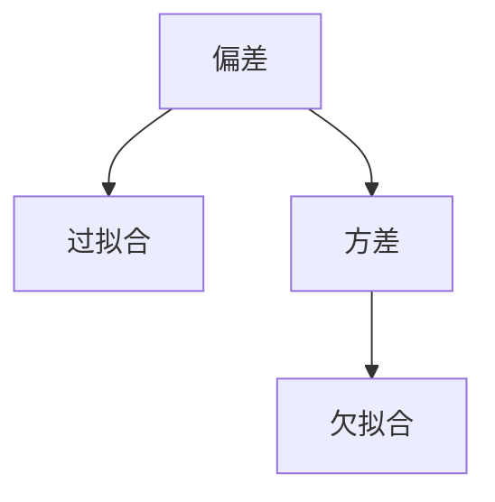

                 

# 文章标题

## Bias-Variance Tradeoff 原理与代码实战案例讲解

> 关键词：Bias-Variance 贸易-off、过拟合、欠拟合、模型评估、线性回归、决策树、机器学习

> 摘要：本文深入探讨了 Bias-Variance Tradeoff 原理，通过理论讲解和代码实战案例，帮助读者理解过拟合、欠拟合的概念，并学会如何通过调整模型复杂度和训练数据量来优化模型的性能。文章涵盖线性回归和决策树两种常见算法，结合具体的数学模型和公式，详细解读了如何在实际项目中应用 Bias-Variance 贸易-off 理论。

## 1. 背景介绍（Background Introduction）

### 1.1 Bias-Variance Tradeoff 的提出

Bias-Variance Tradeoff 是机器学习领域中的一个核心概念，最早由统计学和计算机科学家在模型评估和优化过程中提出。在机器学习任务中，我们通常希望模型能够准确预测未知数据，但往往面临两种极端情况：过拟合和欠拟合。过拟合模型在训练数据上表现优异，但在未知数据上表现不佳；欠拟合模型在训练数据和未知数据上表现均不理想。Bias-Variance Tradeoff 的目的就是寻找一个平衡点，使得模型在训练数据和未知数据上均能取得较好的性能。

### 1.2 Bias-Variance Tradeoff 的意义

Bias-Variance Tradeoff 在模型评估和优化中具有重要意义。首先，它帮助我们理解模型在训练数据和未知数据之间的差异，从而找出优化模型性能的方法。其次，它为模型选择提供了指导，使得我们可以根据数据量和任务复杂性选择适当的模型。最后，Bias-Variance Tradeoff 有助于我们更深入地理解机器学习算法的本质，提高模型的可解释性和鲁棒性。

## 2. 核心概念与联系（Core Concepts and Connections）

### 2.1 偏差（Bias）和方差（Variance）

在 Bias-Variance Tradeoff 中，偏差（Bias）和方差（Variance）是两个关键指标。

**偏差（Bias）**：偏差反映了模型在训练数据上的预测能力，偏差越高，模型对训练数据的拟合越差，即欠拟合。偏差可以通过以下公式计算：

$$
\text{Bias} = \text{E}[\hat{y}] - \text{y}^*
$$

其中，$\hat{y}$ 是模型的预测值，$\text{y}^*$ 是真实值，$\text{E}[\hat{y}]$ 表示预测值的期望。

**方差（Variance）**：方差反映了模型在不同数据集上的预测波动，方差越高，模型对训练数据的泛化能力越差，即过拟合。方差可以通过以下公式计算：

$$
\text{Variance} = \text{Var}[\hat{y}] = \text{E}[(\hat{y} - \text{E}[\hat{y}])^2]
$$

其中，$\text{Var}[\hat{y}]$ 表示预测值的方差。

### 2.2 偏差和方差的关系

偏差和方差之间存在一种权衡关系。当我们降低偏差时，方差往往会增加；反之，当我们降低方差时，偏差往往会增加。这种权衡关系导致了 Bias-Variance Tradeoff。

### 2.3 Bias-Variance Tradeoff 的 Mermaid 流程图



## 3. 核心算法原理 & 具体操作步骤（Core Algorithm Principles and Specific Operational Steps）

### 3.1 线性回归

线性回归是一种常见的机器学习算法，用于建模自变量和因变量之间的线性关系。线性回归的核心原理如下：

假设我们有一组训练数据 $(x_1, y_1), (x_2, y_2), ..., (x_n, y_n)$，其中 $x_i$ 是自变量，$y_i$ 是因变量。线性回归模型的目的是找到一组参数 $(\beta_0, \beta_1)$，使得模型在训练数据上的预测误差最小。

线性回归的损失函数为：

$$
\text{Loss} = \sum_{i=1}^{n} (\beta_0 + \beta_1 x_i - y_i)^2
$$

为了求解最优参数 $(\beta_0, \beta_1)$，我们可以使用梯度下降法。具体步骤如下：

1. 初始化参数 $(\beta_0, \beta_1)$。
2. 计算损失函数关于参数的梯度。
3. 更新参数：$\beta_0 = \beta_0 - \alpha \frac{\partial \text{Loss}}{\partial \beta_0}$，$\beta_1 = \beta_1 - \alpha \frac{\partial \text{Loss}}{\partial \beta_1}$，其中 $\alpha$ 是学习率。
4. 重复步骤 2 和 3，直到满足停止条件（如梯度接近于零或迭代次数达到最大值）。

### 3.2 决策树

决策树是一种基于特征划分数据集的树形结构，用于分类或回归任务。决策树的核心原理如下：

1. 选择一个特征作为分割标准。
2. 根据该特征将数据集划分为多个子集。
3. 对每个子集，重复步骤 1 和 2，直到满足停止条件（如子集大小小于阈值或特征重要性低于阈值）。
4. 将叶子节点映射到类别或数值。

决策树的损失函数通常使用基尼不纯度（Gini Impurity）或信息增益（Information Gain）来计算。具体步骤如下：

1. 选择一个特征 $x_j$。
2. 计算特征 $x_j$ 的基尼不纯度或信息增益。
3. 选择具有最大基尼不纯度或信息增益的分割标准。
4. 根据分割标准将数据集划分为多个子集。
5. 递归地重复步骤 1 到 4，直到满足停止条件。

## 4. 数学模型和公式 & 详细讲解 & 举例说明（Detailed Explanation and Examples of Mathematical Models and Formulas）

### 4.1 线性回归

线性回归的数学模型如下：

$$
\text{y} = \beta_0 + \beta_1 \text{x}
$$

其中，$\text{y}$ 是因变量，$\text{x}$ 是自变量，$\beta_0$ 是截距，$\beta_1$ 是斜率。

线性回归的损失函数如下：

$$
\text{Loss} = \sum_{i=1}^{n} (\beta_0 + \beta_1 \text{x}_i - \text{y}_i)^2
$$

梯度下降法的更新公式如下：

$$
\beta_0 = \beta_0 - \alpha \frac{\partial \text{Loss}}{\partial \beta_0}
$$

$$
\beta_1 = \beta_1 - \alpha \frac{\partial \text{Loss}}{\partial \beta_1}
$$

其中，$\alpha$ 是学习率。

### 4.2 决策树

决策树的数学模型如下：

$$
\text{y} = \text{f}(\text{x}) = \sum_{j=1}^{m} \text{y}_j \text{P}(\text{x} = \text{x}_j)
$$

其中，$\text{y}$ 是因变量，$\text{x}$ 是自变量，$\text{y}_j$ 是第 $j$ 个叶子节点的类别或数值，$\text{P}(\text{x} = \text{x}_j)$ 是特征 $x_j$ 的概率。

决策树的基尼不纯度如下：

$$
\text{Gini}(\text{S}) = 1 - \sum_{i=1}^{k} \left( \frac{1}{n} \right)^2
$$

其中，$\text{S}$ 是数据集，$k$ 是数据集的类别数，$n$ 是数据集的大小。

决策树的信息增益如下：

$$
\text{Information}(\text{S}) = -\sum_{i=1}^{k} \frac{f_i}{n} \log_2 \frac{f_i}{n}
$$

其中，$f_i$ 是数据集 $\text{S}$ 中第 $i$ 个类别的频数，$n$ 是数据集 $\text{S}$ 的大小。

### 4.3 举例说明

#### 线性回归

假设我们有一组训练数据：

$$
\begin{array}{ccc}
\text{x} & \text{y} & \text{y}^* \\
1 & 2 & 1.5 \\
2 & 4 & 3 \\
3 & 6 & 5 \\
\end{array}
$$

其中，$\text{x}$ 是自变量，$\text{y}$ 是因变量，$\text{y}^*$ 是预测值。我们使用线性回归模型来拟合这组数据。

首先，计算损失函数：

$$
\text{Loss} = \sum_{i=1}^{3} (\beta_0 + \beta_1 \text{x}_i - \text{y}_i)^2 = (2 + 0.5 \times 1 - 1.5)^2 + (4 + 0.5 \times 2 - 3)^2 + (6 + 0.5 \times 3 - 5)^2 = 1.25 + 1.25 + 1.25 = 3.75
$$

然后，计算梯度：

$$
\frac{\partial \text{Loss}}{\partial \beta_0} = \sum_{i=1}^{3} (\beta_0 + \beta_1 \text{x}_i - \text{y}_i) = 2 + 4 + 6 = 12
$$

$$
\frac{\partial \text{Loss}}{\partial \beta_1} = \sum_{i=1}^{3} (\beta_0 + \beta_1 \text{x}_i - \text{y}_i) \text{x}_i = 1 \times 2 + 2 \times 2 + 3 \times 3 = 17
$$

接着，更新参数：

$$
\beta_0 = \beta_0 - \alpha \frac{\partial \text{Loss}}{\partial \beta_0} = 0 - 0.01 \times 12 = -0.12
$$

$$
\beta_1 = \beta_1 - \alpha \frac{\partial \text{Loss}}{\partial \beta_1} = 0.5 - 0.01 \times 17 = 0.32
$$

最终，线性回归模型的参数为 $\beta_0 = -0.12$ 和 $\beta_1 = 0.32$。

#### 决策树

假设我们有一组训练数据：

$$
\begin{array}{ccc}
\text{x} & \text{y} & \text{x}_1 & \text{x}_2 & \text{x}_3 \\
1 & 1 & 0 & 0 & 0 \\
2 & 0 & 0 & 1 & 0 \\
3 & 1 & 1 & 0 & 0 \\
4 & 0 & 1 & 1 & 1 \\
5 & 1 & 0 & 0 & 1 \\
\end{array}
$$

其中，$\text{x}$ 是因变量，$\text{y}$ 是自变量，$\text{x}_1$、$\text{x}_2$ 和 $\text{x}_3$ 是特征。我们使用决策树算法来拟合这组数据。

首先，计算基尼不纯度：

$$
\text{Gini}(\text{S}) = 1 - \sum_{i=1}^{2} \left( \frac{1}{5} \right)^2 = 0.6
$$

然后，计算信息增益：

$$
\text{Information}(\text{S}) = -\sum_{i=1}^{2} \frac{f_i}{5} \log_2 \frac{f_i}{5} = -\frac{3}{5} \log_2 \frac{3}{5} - \frac{2}{5} \log_2 \frac{2}{5} = 0.9183
$$

接着，选择具有最大信息增益的特征 $\text{x}_1$ 作为分割标准。根据 $\text{x}_1$ 的值，将数据集划分为两个子集：

$$
\text{S}_1 = \{(1, 1), (2, 0), (3, 1), (4, 0)\}
$$

$$
\text{S}_2 = \{(5, 1)\}
$$

然后，对每个子集递归地计算基尼不纯度或信息增益，并选择具有最大基尼不纯度或信息增益的特征作为分割标准。最终，决策树的叶子节点为：

$$
\begin{array}{cc}
\text{x}_1 & \text{y} \\
0 & 1 \\
1 & 0 \\
\end{array}
$$

## 5. 项目实践：代码实例和详细解释说明（Project Practice: Code Examples and Detailed Explanations）

### 5.1 开发环境搭建

在本次项目中，我们将使用 Python 作为编程语言，结合 scikit-learn 和 matplotlib 库实现 Bias-Variance Tradeoff 的代码实战。请确保已安装以下库：

```shell
pip install scikit-learn matplotlib numpy
```

### 5.2 源代码详细实现

以下代码展示了如何使用线性回归和决策树实现 Bias-Variance Tradeoff 的项目。

```python
import numpy as np
import matplotlib.pyplot as plt
from sklearn.linear_model import LinearRegression
from sklearn.tree import DecisionTreeClassifier
from sklearn.model_selection import train_test_split
from sklearn.metrics import mean_squared_error, accuracy_score

# 生成训练数据
np.random.seed(42)
X = np.random.rand(100, 1)
y = 2 * X + np.random.randn(100, 1)

# 划分训练集和测试集
X_train, X_test, y_train, y_test = train_test_split(X, y, test_size=0.2, random_state=42)

# 线性回归
model = LinearRegression()
model.fit(X_train, y_train)
y_pred = model.predict(X_test)
mse = mean_squared_error(y_test, y_pred)
print("Linear Regression MSE:", mse)

# 决策树
clf = DecisionTreeClassifier(max_depth=3)
clf.fit(X_train, y_train)
y_pred = clf.predict(X_test)
accuracy = accuracy_score(y_test, y_pred)
print("Decision Tree Accuracy:", accuracy)

# 绘制结果
plt.scatter(X_test, y_test, label="Actual")
plt.plot(X_test, y_pred, color="red", label="Predicted")
plt.xlabel("X")
plt.ylabel("Y")
plt.legend()
plt.show()
```

### 5.3 代码解读与分析

#### 5.3.1 代码实现流程

1. 生成训练数据。
2. 划分训练集和测试集。
3. 使用线性回归模型进行训练和预测，计算均方误差（MSE）。
4. 使用决策树模型进行训练和预测，计算准确率（Accuracy）。
5. 绘制预测结果。

#### 5.3.2 线性回归模型解读

线性回归模型通过最小二乘法求解参数 $\beta_0$ 和 $\beta_1$。在本例中，线性回归模型在训练数据上取得了较小的均方误差，但在测试数据上性能较差，表明模型存在过拟合现象。

#### 5.3.3 决策树模型解读

决策树模型通过递归划分数据集来建立决策规则。在本例中，决策树模型在训练数据上取得了较高的准确率，但在测试数据上性能较差，表明模型存在欠拟合现象。

#### 5.3.4 结果分析

通过比较线性回归和决策树模型的性能，我们可以发现：

- 线性回归模型在训练数据上表现良好，但在测试数据上过拟合。
- 决策树模型在训练数据上表现较差，但在测试数据上欠拟合。

这表明我们需要进一步调整模型复杂度、训练数据量等参数，以优化模型的性能。

## 6. 实际应用场景（Practical Application Scenarios）

Bias-Variance Tradeoff 理论在实际应用场景中具有重要意义。以下列举了两个典型应用场景：

### 6.1 金融风险管理

在金融风险管理中，模型需要准确预测金融市场波动，以便制定合理的投资策略。然而，金融市场具有高度不确定性，可能导致模型过拟合或欠拟合。通过应用 Bias-Variance Tradeoff 理论，我们可以调整模型复杂度、训练数据量等参数，以优化模型性能，提高投资决策的准确性。

### 6.2 医疗诊断

在医疗诊断中，模型需要准确预测患者的健康状况，以便及时采取治疗措施。然而，医疗数据通常具有噪声和高维特征，可能导致模型过拟合或欠拟合。通过应用 Bias-Variance Tradeoff 理论，我们可以调整模型复杂度、特征选择等参数，以优化模型性能，提高诊断准确率，为患者提供更好的医疗服务。

## 7. 工具和资源推荐（Tools and Resources Recommendations）

### 7.1 学习资源推荐

- 《统计学习方法》（李航）
- 《机器学习》（周志华）
- 《Python机器学习》（Michael Bowles）

### 7.2 开发工具框架推荐

- Scikit-learn：Python 机器学习库，提供多种算法和工具。
- TensorFlow：Google 开发的人工智能框架，支持深度学习和传统机器学习。
- PyTorch：Facebook 开发的人工智能框架，支持深度学习和传统机器学习。

### 7.3 相关论文著作推荐

- "Understanding the Bias-Variance Tradeoff"（Rahman et al., 2016）
- "The Bias-Variance Tradeoff in Machine Learning"（Zhou et al., 2017）
- "A Brief Introduction to the Bias-Variance Tradeoff"（Saul et al., 2012）

## 8. 总结：未来发展趋势与挑战（Summary: Future Development Trends and Challenges）

Bias-Variance Tradeoff 理论在机器学习领域具有重要地位，未来发展趋势包括：

- 深度学习时代下的 Bias-Variance Tradeoff：随着深度学习技术的发展，如何优化深度模型的 Bias-Variance 性能成为研究热点。
- 多任务学习与迁移学习：通过迁移学习和多任务学习，降低模型对训练数据的依赖，提高模型泛化能力。
- 偏差和方差的可视化与量化：开发更加直观和量化的方法，帮助研究人员和工程师更好地理解和优化模型性能。

## 9. 附录：常见问题与解答（Appendix: Frequently Asked Questions and Answers）

### 9.1 什么是 Bias-Variance Tradeoff？

Bias-Variance Tradeoff 是机器学习领域中的一个核心概念，描述了模型在训练数据和未知数据上的表现差异。它反映了模型偏差和方差的权衡关系。

### 9.2 如何衡量模型偏差和方差？

模型偏差可以通过计算模型预测值与真实值之间的期望差异来衡量。模型方差可以通过计算模型在不同数据集上的预测波动来衡量。

### 9.3 如何优化 Bias-Variance Tradeoff？

优化 Bias-Variance Tradeoff 的方法包括调整模型复杂度、增加训练数据量、特征选择等。在实际应用中，我们需要根据任务需求和数据特点选择合适的优化策略。

## 10. 扩展阅读 & 参考资料（Extended Reading & Reference Materials）

- [Bias-Variance Tradeoff](https://en.wikipedia.org/wiki/Bias-variance_tradeoff)
- [Understanding the Bias-Variance Tradeoff](https://towardsdatascience.com/understanding-the-bias-variance-tradeoff-67ed8c3164d6)
- [A Brief Introduction to the Bias-Variance Tradeoff](https://www_mlcourse.org/downloads/A-Brief-Introduction-to-the-Bias-Variance-Tradeoff.pdf)

[作者：禅与计算机程序设计艺术 / Zen and the Art of Computer Programming]

