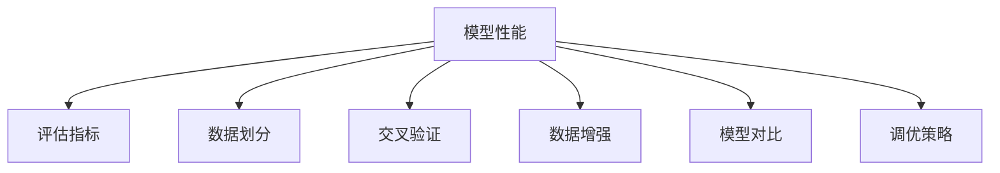

                 

# 第十三章：评估和衡量性能

在人工智能（AI）和机器学习（ML）领域，模型性能的评估和衡量是一个极其关键且复杂的过程。在当前的深度学习时代，模型的表现好坏直接关系到其在实际应用中的效果和实用性。本章将深入探讨评估和衡量性能的诸多核心概念、算法原理以及操作步骤，并通过实例代码加以详细解释和分析，为读者提供全面的理解。

## 1. 背景介绍

### 1.1 问题由来
随着深度学习模型的不断发展和应用，如何评估和衡量这些模型的性能成为了一个重要课题。模型的性能评估不仅仅是为了在学术界和工业界进行成果比较，更是为了确保模型在实际应用中能够满足需求，并持续优化。在实际应用中，模型的性能评估涉及多个方面，包括但不限于准确性、速度、鲁棒性、可解释性等。因此，在模型设计、开发和部署的全过程中，进行科学的性能评估和衡量至关重要。

### 1.2 问题核心关键点
模型性能评估的核心关键点包括以下几个方面：
- 选择合适的评估指标：准确性、召回率、F1分数、混淆矩阵等指标。
- 数据划分策略：训练集、验证集、测试集的划分，确保模型的泛化性能。
- 交叉验证和测试集：使用交叉验证等技术，确保评估结果的稳定性。
- 数据增强与扩充：通过数据增强、合成数据等方法，扩充数据集，提升模型鲁棒性。
- 模型对比与调优：通过模型对比和调优，不断提升模型性能。

## 2. 核心概念与联系

### 2.1 核心概念概述

为了更好地理解模型性能的评估和衡量，本节将介绍几个密切相关的核心概念：

- 模型性能（Model Performance）：模型在特定任务上的执行效果，通常通过一系列评估指标来衡量。
- 评估指标（Evaluation Metrics）：用于衡量模型性能的指标，如准确性、召回率、F1分数、混淆矩阵等。
- 数据划分（Data Partitioning）：将数据集划分为训练集、验证集和测试集，用于模型训练、验证和测试。
- 交叉验证（Cross-Validation）：通过多轮交叉验证，评估模型在未见数据上的性能，避免过拟合。
- 数据增强（Data Augmentation）：通过对训练数据进行增强，扩充数据集，提升模型鲁棒性。
- 模型对比（Model Comparison）：通过对比不同模型的性能，选择最优模型。
- 调优策略（Tuning Strategies）：通过调整模型参数、学习率等，优化模型性能。

这些核心概念之间的逻辑关系可以通过以下Mermaid流程图来展示：



这个流程图展示了一系列评估和衡量模型性能的步骤，从选择评估指标，到数据划分、交叉验证、数据增强、模型对比，最后是调优策略的运用。

## 3. 核心算法原理 & 具体操作步骤
### 3.1 算法原理概述

模型性能的评估和衡量一般包括以下几个关键步骤：

1. 选择合适的评估指标。
2. 对数据集进行划分。
3. 在验证集上进行模型验证。
4. 在测试集上进行模型测试。
5. 对比不同模型的性能。
6. 调整模型参数以提升性能。

评估和衡量模型性能的算法原理，本质上是对模型在特定任务上的表现进行量化和比较。这通常涉及到数学公式的推导和实际操作的执行。

### 3.2 算法步骤详解

下面将详细介绍各个步骤的算法原理和具体操作步骤。

#### 3.2.1 选择合适的评估指标

在模型训练和评估过程中，需要选择合适的评估指标来衡量模型的性能。常用的评估指标包括：

- 准确性（Accuracy）：模型正确预测的样本数占总样本数的比例。
- 召回率（Recall）：模型正确预测的正样本数占实际正样本数的比例。
- F1分数（F1 Score）：准确性和召回率的调和平均数。
- 混淆矩阵（Confusion Matrix）：显示模型预测结果与实际结果的对比。

这些指标适用于不同的任务和应用场景，需要根据具体情况进行选择。

#### 3.2.2 数据划分

数据划分是将数据集划分为训练集、验证集和测试集的过程。训练集用于模型训练，验证集用于模型验证和调参，测试集用于模型最终的性能评估。

常用的数据划分策略包括：

- 固定比例划分：如70%训练集、15%验证集、15%测试集。
- 随机划分：通过随机抽样将数据集划分为训练集和测试集。
- 留一法（Leave-One-Out, LOOCV）：每个样本单独作为测试集，其余作为训练集。

#### 3.2.3 在验证集上进行模型验证

模型训练过程中，使用验证集对模型进行验证和调参，以防止过拟合。验证集上的评估指标可以用于指导模型参数的选择和优化。

常用的验证方法包括：

- 单次验证：使用单个验证集对模型进行评估。
- 交叉验证：将数据集分成多个子集，轮流作为验证集，进行多轮验证。

#### 3.2.4 在测试集上进行模型测试

模型训练完成后，使用测试集对模型进行最终的性能评估，以评估模型在未见数据上的表现。测试集上的评估指标可以用于比较不同模型的性能。

#### 3.2.5 对比不同模型的性能

通过对比不同模型的评估指标，选择最优模型。常用的比较方法包括：

- ROC曲线和AUC值：用于二分类任务的比较。
- R-squared值：用于回归任务的比较。
- 交叉验证平均指标：通过多轮交叉验证得到的平均指标，评估模型在不同数据集上的表现。

#### 3.2.6 调整模型参数以提升性能

通过调整模型参数，如学习率、正则化系数等，优化模型性能。常用的调参方法包括：

- 网格搜索（Grid Search）：通过遍历预定义的参数空间，寻找最优参数组合。
- 随机搜索（Random Search）：通过随机选择参数组合，加速调参过程。
- 贝叶斯优化（Bayesian Optimization）：通过构建模型性能的贝叶斯后验分布，选择最优参数。

### 3.3 算法优缺点

模型性能评估和衡量的方法具有以下优点：

1. 提供量化结果：评估指标可以提供模型的量化结果，帮助开发者进行模型选择和调参。
2. 帮助避免过拟合：通过验证集进行模型验证和调参，避免模型在训练集上过拟合。
3. 评估模型泛化性能：使用测试集进行模型测试，评估模型在未见数据上的表现。
4. 对比模型性能：通过对比不同模型的评估指标，选择最优模型。

同时，这些方法也存在一些缺点：

1. 评估指标选择困难：选择合适的评估指标取决于具体任务，不同指标之间可能存在冲突。
2. 数据划分可能不均衡：数据划分策略可能导致训练集、验证集和测试集的数据分布不均衡，影响评估结果。
3. 模型对比可能存在偏差：不同模型之间的对比可能受到数据、模型结构和训练策略等因素的影响。
4. 调参过程耗时耗力：调参过程需要大量时间和计算资源，可能耗费不菲。

### 3.4 算法应用领域

模型性能评估和衡量的方法在各个领域都得到了广泛应用，例如：

- 自然语言处理（NLP）：如文本分类、情感分析、机器翻译等任务。
- 计算机视觉（CV）：如图像分类、目标检测、图像分割等任务。
- 语音识别（ASR）：如自动语音识别、语音合成等任务。
- 推荐系统：如协同过滤、基于内容的推荐等任务。

这些领域内的任务，通常需要通过评估和衡量模型性能，以确保模型在实际应用中的效果。

## 4. 数学模型和公式 & 详细讲解 & 举例说明

### 4.1 数学模型构建

模型性能的评估和衡量通常涉及到数学模型的构建和公式的推导。

假设有一个二分类任务，其中模型预测结果为 $y_{pred}$，实际结果为 $y_{true}$，则常用的评估指标包括：

- 准确性（Accuracy）：
$$
Accuracy = \frac{\text{TP} + \text{TN}}{\text{TP} + \text{TN} + \text{FP} + \text{FN}}
$$
其中 $\text{TP}$ 表示真正例，$\text{TN}$ 表示真反例，$\text{FP}$ 表示假正例，$\text{FN}$ 表示假反例。

- 召回率（Recall）：
$$
Recall = \frac{\text{TP}}{\text{TP} + \text{FN}}
$$

- F1分数（F1 Score）：
$$
F1 Score = \frac{2 \times Precision \times Recall}{Precision + Recall}
$$
其中 $Precision = \frac{\text{TP}}{\text{TP} + \text{FP}}$。

### 4.2 公式推导过程

以准确性为例，推导其计算公式：

假设模型在一个二分类任务上进行了 $n$ 次预测，其中正确预测的正例数为 $TP$，正确预测的反例数为 $TN$，错误预测的正例数为 $FP$，错误预测的反例数为 $FN$。则准确性的计算公式为：
$$
Accuracy = \frac{TP + TN}{TP + TN + FP + FN}
$$

其中，$TP + TN$ 表示正确预测的样本数，$FP + FN$ 表示错误预测的样本数。

### 4.3 案例分析与讲解

下面以一个简单的文本分类任务为例，解释如何通过代码实现模型性能的评估和衡量。

#### 4.3.1 数据准备

假设我们有一个文本分类任务，数据集包括训练集、验证集和测试集，每个样本包含文本和标签。我们可以使用Pandas库来处理数据：

```python
import pandas as pd

# 读取数据集
train_df = pd.read_csv('train.csv')
val_df = pd.read_csv('val.csv')
test_df = pd.read_csv('test.csv')

# 数据预处理
train_texts = train_df['text'].tolist()
train_labels = train_df['label'].tolist()
val_texts = val_df['text'].tolist()
val_labels = val_df['label'].tolist()
test_texts = test_df['text'].tolist()
test_labels = test_df['label'].tolist()
```

#### 4.3.2 模型训练

假设我们使用Scikit-learn的Logistic Regression模型进行训练：

```python
from sklearn.linear_model import LogisticRegression
from sklearn.metrics import accuracy_score, recall_score, f1_score, confusion_matrix

# 训练模型
model = LogisticRegression()
model.fit(train_texts, train_labels)

# 验证模型
val_preds = model.predict(val_texts)
val_accuracy = accuracy_score(val_labels, val_preds)
val_recall = recall_score(val_labels, val_preds)
val_f1 = f1_score(val_labels, val_preds)
val_confusion = confusion_matrix(val_labels, val_preds)
```

#### 4.3.3 模型评估

使用测试集对模型进行最终的评估：

```python
test_preds = model.predict(test_texts)
test_accuracy = accuracy_score(test_labels, test_preds)
test_recall = recall_score(test_labels, test_preds)
test_f1 = f1_score(test_labels, test_preds)
test_confusion = confusion_matrix(test_labels, test_preds)

# 输出评估结果
print(f'Test Accuracy: {test_accuracy:.2f}')
print(f'Test Recall: {test_recall:.2f}')
print(f'Test F1 Score: {test_f1:.2f}')
print('Test Confusion Matrix:')
print(test_confusion)
```

通过上述代码，我们可以计算出模型在测试集上的准确性、召回率和F1分数，并提供混淆矩阵。这些结果可以帮助我们评估模型的性能，并进行后续的调优。

## 5. 项目实践：代码实例和详细解释说明

### 5.1 开发环境搭建

为了进行模型性能的评估和衡量，我们需要搭建一个开发环境。这里推荐使用Python和Scikit-learn库：

1. 安装Python：下载并安装Python，可以从官网或Anaconda中获取。
2. 安装Scikit-learn：
   ```bash
   pip install scikit-learn
   ```

### 5.2 源代码详细实现

下面是一个简单的文本分类任务的代码实现：

```python
import pandas as pd
from sklearn.linear_model import LogisticRegression
from sklearn.metrics import accuracy_score, recall_score, f1_score, confusion_matrix

# 读取数据集
train_df = pd.read_csv('train.csv')
val_df = pd.read_csv('val.csv')
test_df = pd.read_csv('test.csv')

# 数据预处理
train_texts = train_df['text'].tolist()
train_labels = train_df['label'].tolist()
val_texts = val_df['text'].tolist()
val_labels = val_df['label'].tolist()
test_texts = test_df['text'].tolist()
test_labels = test_df['label'].tolist()

# 训练模型
model = LogisticRegression()
model.fit(train_texts, train_labels)

# 验证模型
val_preds = model.predict(val_texts)
val_accuracy = accuracy_score(val_labels, val_preds)
val_recall = recall_score(val_labels, val_preds)
val_f1 = f1_score(val_labels, val_preds)
val_confusion = confusion_matrix(val_labels, val_preds)

# 测试模型
test_preds = model.predict(test_texts)
test_accuracy = accuracy_score(test_labels, test_preds)
test_recall = recall_score(test_labels, test_preds)
test_f1 = f1_score(test_labels, test_preds)
test_confusion = confusion_matrix(test_labels, test_preds)

# 输出评估结果
print(f'Test Accuracy: {test_accuracy:.2f}')
print(f'Test Recall: {test_recall:.2f}')
print(f'Test F1 Score: {test_f1:.2f}')
print('Test Confusion Matrix:')
print(test_confusion)
```

### 5.3 代码解读与分析

我们可以通过上述代码实现模型性能的评估和衡量，具体步骤如下：

1. 读取数据集。
2. 数据预处理，将文本和标签转换为列表。
3. 训练模型，使用Logistic Regression进行训练。
4. 在验证集上进行模型验证，计算准确性、召回率和F1分数，并输出混淆矩阵。
5. 在测试集上进行模型测试，计算评估指标，并输出混淆矩阵。
6. 输出最终评估结果。

## 6. 实际应用场景

模型性能评估和衡量在实际应用场景中有着广泛的应用。以下列举几个典型的应用场景：

### 6.1 自然语言处理

在自然语言处理领域，模型性能的评估和衡量尤为重要。例如，在情感分析任务中，模型需要在情感分类上达到较高的准确性和召回率，以确保模型能够正确识别出文本的情感倾向。通过评估模型在验证集和测试集上的性能，可以进行调参和模型优化，确保模型在实际应用中的表现。

### 6.2 计算机视觉

在计算机视觉领域，模型性能的评估和衡量同样重要。例如，在图像分类任务中，模型需要在分类准确性上达到较高的性能，以确保模型能够正确识别图像中的物体和场景。通过评估模型在验证集和测试集上的性能，可以进行调参和模型优化，确保模型在实际应用中的表现。

### 6.3 推荐系统

在推荐系统中，模型性能的评估和衡量是关键。例如，在协同过滤推荐任务中，模型需要在准确性和多样性上达到较高的性能，以确保推荐结果符合用户兴趣和偏好。通过评估模型在验证集和测试集上的性能，可以进行调参和模型优化，确保推荐系统的稳定性和有效性。

### 6.4 未来应用展望

未来，模型性能评估和衡量的方法将进一步发展，以适应更复杂和多样化的应用场景。例如：

1. 多模态融合：将文本、图像、语音等多种模态的数据进行融合，进行联合评估和衡量。
2. 模型对比和融合：通过对比不同模型的性能，并进行模型融合，提升综合性能。
3. 自动调参：使用自动调参技术，自动选择最优模型和参数组合，优化模型性能。
4. 模型解释：通过模型解释技术，解释模型的决策过程，提升模型可解释性。

## 7. 工具和资源推荐

### 7.1 学习资源推荐

为了帮助开发者深入理解模型性能评估和衡量的方法，这里推荐一些优质的学习资源：

1. 《机器学习实战》：一本详细介绍机器学习算法和评估指标的书籍。
2. 《深度学习》：由Ian Goodfellow等人撰写的深度学习经典教材，详细介绍了模型评估和衡量的方法。
3. 《Scikit-learn官方文档》：Scikit-learn库的官方文档，提供了丰富的评估指标和模型评估示例。
4. Kaggle平台：一个数据科学竞赛平台，提供了大量的模型评估和衡量案例。

### 7.2 开发工具推荐

为了提升模型性能评估和衡量的工作效率，这里推荐一些常用的开发工具：

1. Jupyter Notebook：一个交互式笔记本，支持代码编写、数据可视化等，非常适合进行模型评估和衡量。
2. TensorBoard：TensorFlow配套的可视化工具，可以实时监测模型训练状态，提供丰富的图表呈现方式。
3. Weights & Biases：一个实验跟踪工具，可以记录和可视化模型训练过程中的各项指标，方便对比和调优。

### 7.3 相关论文推荐

为了深入了解模型性能评估和衡量的方法，这里推荐一些相关的经典论文：

1. "Evaluating a Statistical Study"：一篇关于模型评估指标选择和对比的经典论文。
2. "Performance Evaluation of Machine Learning Algorithms"：一篇详细介绍模型评估方法和技术的书籍。
3. "Model Evaluation and Validation Techniques"：一篇关于模型评估和验证技术的综述论文。

## 8. 总结：未来发展趋势与挑战

### 8.1 总结

本文详细介绍了模型性能评估和衡量的方法和步骤，涵盖评估指标的选择、数据划分、交叉验证、模型验证和调优等多个方面。通过深入讲解算法原理和操作步骤，并为读者提供了完整的代码实现和详细解读，帮助开发者更好地理解模型性能评估和衡量的方法。

### 8.2 未来发展趋势

未来，模型性能评估和衡量的方法将朝着更加全面、高效和智能的方向发展：

1. 自动化调参：使用自动调参技术，自动化选择最优模型和参数组合。
2. 多模态融合：将文本、图像、语音等多种模态的数据进行融合，进行联合评估和衡量。
3. 模型对比和融合：通过对比不同模型的性能，并进行模型融合，提升综合性能。
4. 模型解释：通过模型解释技术，解释模型的决策过程，提升模型可解释性。

### 8.3 面临的挑战

尽管模型性能评估和衡量的方法已经得到了广泛应用，但在实际应用过程中仍面临诸多挑战：

1. 数据分布不均衡：数据分布不均衡可能导致模型在验证集和测试集上的性能差异较大。
2. 评估指标选择困难：选择合适的评估指标取决于具体任务，不同指标之间可能存在冲突。
3. 模型对比可能存在偏差：不同模型之间的对比可能受到数据、模型结构和训练策略等因素的影响。
4. 调参过程耗时耗力：调参过程需要大量时间和计算资源，可能耗费不菲。

### 8.4 研究展望

未来，在模型性能评估和衡量领域，还需要进一步研究和发展：

1. 自动调参方法：通过自动化调参，减少人工调参的耗时和成本。
2. 多模态融合方法：将文本、图像、语音等多种模态的数据进行融合，进行联合评估和衡量。
3. 模型解释方法：通过模型解释技术，解释模型的决策过程，提升模型可解释性。
4. 跨领域评估方法：研究跨领域的模型性能评估方法，确保模型在多种任务上的表现一致。

这些研究方向的发展将进一步推动模型性能评估和衡量方法的进步，为模型的实际应用提供更全面的支持和保障。

## 9. 附录：常见问题与解答

**Q1：如何选择合适的评估指标？**

A: 选择合适的评估指标取决于具体任务和应用场景。例如，在分类任务中，通常使用准确性、召回率和F1分数作为评估指标；在回归任务中，通常使用均方误差和R-squared值作为评估指标。

**Q2：如何处理数据不平衡的问题？**

A: 数据不平衡可能导致模型在验证集和测试集上的性能差异较大。常见的处理方法包括：

1. 重采样：通过过采样或欠采样，平衡数据集的类别分布。
2. 类别权重：为少数类别赋予更高的权重，提高其对模型训练的贡献。
3. 生成合成数据：使用生成对抗网络（GAN）等方法生成合成数据，扩充少数类别的数据集。

**Q3：如何提高模型解释性？**

A: 模型解释技术可以帮助解释模型的决策过程，提升模型可解释性。常见的模型解释方法包括：

1. 特征重要性分析：分析模型特征的重要性，找出对模型预测有重要影响的特征。
2. 可视化技术：使用可视化技术展示模型决策过程，直观展示模型的决策依据。
3. 模型反演：通过模型反演，找出导致模型错误预测的原因。

**Q4：如何选择最优模型？**

A: 选择最优模型通常需要综合考虑评估指标、数据分布、模型结构等因素。常见的选择方法包括：

1. 网格搜索（Grid Search）：通过遍历预定义的参数空间，寻找最优参数组合。
2. 随机搜索（Random Search）：通过随机选择参数组合，加速调参过程。
3. 贝叶斯优化（Bayesian Optimization）：通过构建模型性能的贝叶斯后验分布，选择最优参数。

**Q5：如何处理模型过拟合问题？**

A: 模型过拟合是指模型在训练集上表现良好，但在测试集上表现较差。常见的处理方法包括：

1. 数据增强：通过数据增强技术扩充训练集，提高模型泛化性能。
2. 正则化：使用L2正则化、Dropout等技术，防止模型过拟合。
3. 早停策略：在验证集上设置阈值，早停训练过程，防止过拟合。

通过回答这些问题，我们希望能够为开发者提供更全面、更系统的指导，帮助他们更好地理解模型性能评估和衡量的方法，并应用于实际项目中。

---

作者：禅与计算机程序设计艺术 / Zen and the Art of Computer Programming

