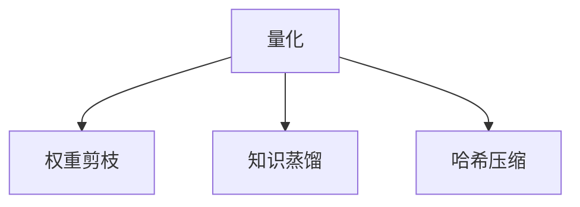

                 

# 第十三章：量化和模型压缩

> 关键词：量化,模型压缩,深度学习,模型优化,计算效率,硬件加速

## 1. 背景介绍

### 1.1 问题由来
随着深度学习技术的不断演进，大规模模型在图像识别、自然语言处理、语音识别等诸多领域取得了突破性进展。然而，这些模型通常包含数十亿甚至数百亿的参数，导致训练和推理过程中的计算需求极高，对硬件资源提出了严峻挑战。与此同时，在大规模模型的实际应用中，通常只有一部分参数参与实际计算，其余参数往往被视为冗余或重复，增加了模型的复杂度和计算负担。量化和模型压缩技术应运而生，旨在通过减少模型参数量、降低计算需求，提高模型在实际应用中的计算效率和硬件加速能力，进一步推动深度学习技术的普及和落地。

### 1.2 问题核心关键点
量化和模型压缩技术主要有量化、权重剪枝、知识蒸馏、哈希压缩等方法，旨在从不同维度优化深度学习模型，提升其在实际应用中的效率和表现。这些方法的核心思想在于减少模型冗余、降低计算复杂度，同时保持或提升模型性能。

量化通过减少模型参数的精度，降低计算和存储成本。权重剪枝则通过去除冗余连接，减少模型复杂度，提高推理速度。知识蒸馏则通过将复杂模型学习到的知识，转移到简单模型中，减少模型复杂度和计算需求。哈希压缩则通过将模型参数映射到哈希表中，减少模型大小和计算开销。

这些方法均可以在不降低模型性能的前提下，大幅降低模型计算资源需求，使深度学习模型在边缘设备、移动设备等资源有限的场景下，也能够高效运行。

### 1.3 问题研究意义
量化和模型压缩技术对深度学习模型的高效应用具有重要意义：

1. **降低计算资源消耗**：通过减少模型参数量、降低计算需求，可以显著降低深度学习模型的训练和推理计算成本，使更多人能够使用深度学习技术，加速技术普及。
2. **提升模型部署灵活性**：量化和压缩技术可以使深度学习模型在小规模、资源有限的设备上运行，提升模型部署的灵活性和便捷性。
3. **加速模型推理速度**：优化后的模型可以在较低的计算资源下运行，显著提升模型的推理速度，满足实时应用需求。
4. **推动边缘计算和移动端应用**：深度学习模型的高效压缩和量化，可以使其在边缘设备、移动端等资源受限的环境中高效运行，推动深度学习技术在工业界的广泛应用。
5. **促进数据驱动的决策**：通过减少模型参数量和计算开销，可以更高效地处理海量数据，提升数据驱动决策的速度和准确性。

## 2. 核心概念与联系

### 2.1 核心概念概述

为了更好地理解量化和模型压缩技术的核心原理和应用场景，本节将介绍几个关键概念：

- **量化(Quantization)**：指将浮点数参数转换为更小的整数或定点数，以降低计算和存储需求。常见的量化方法包括对称量化和非对称量化。
- **权重剪枝(Weight Pruning)**：通过去除模型中冗余的权重，减少模型复杂度。常见的剪枝策略包括稀疏矩阵分解、稀疏矩阵压缩等。
- **知识蒸馏(Knowledge Distillation)**：通过将复杂模型的知识，转移到简单模型中，减少模型复杂度和计算需求。常见的蒸馏方法包括单任务蒸馏和多任务蒸馏。
- **哈希压缩(Hash Compression)**：通过将模型参数映射到哈希表中，减少模型大小和计算开销。常见的哈希压缩方法包括线性哈希和块哈希等。

这些核心概念之间的逻辑关系可以通过以下Mermaid流程图来展示：



这个流程图展示量化和模型压缩技术的核心概念及其之间的关系：量化和哈希压缩主要关注参数的精度和大小，而权重剪枝和知识蒸馏则从结构上减少模型的复杂度，提高模型的推理速度。

## 3. 核心算法原理 & 具体操作步骤
### 3.1 算法原理概述

量化和模型压缩技术的主要目标是通过减少模型参数量、降低计算需求，同时保持或提升模型性能。其核心思想是在模型训练和推理过程中，逐步减少模型的计算和存储开销，从而提升模型在资源受限设备上的运行效率。

量化和压缩技术可以大致分为三类：参数量化、结构剪枝和知识蒸馏。

**参数量化**：通过减少参数的精度，降低计算和存储需求。常见的量化方法包括对称量化和非对称量化。

**结构剪枝**：通过去除模型中冗余的权重，减少模型复杂度。常见的剪枝策略包括稀疏矩阵分解、稀疏矩阵压缩等。

**知识蒸馏**：通过将复杂模型学习到的知识，转移到简单模型中，减少模型复杂度和计算需求。常见的蒸馏方法包括单任务蒸馏和多任务蒸馏。

### 3.2 算法步骤详解

量化和模型压缩技术的详细步骤可以分为以下几步：

**Step 1: 选择合适的量化方法**

- **对称量化(Symmetric Quantization)**：将模型参数映射到[-q, q]的对称区间内。适用于对称分布的参数。
- **非对称量化(Asymmetric Quantization)**：将模型参数映射到[-q, q]或[q, q]的非对称区间内。适用于非对称分布的参数。
- **浮点型量化(Floating Point Quantization)**：将浮点数参数映射到定点数，保留更多精度。适用于对精度要求较高的场景。

**Step 2: 应用正则化技术**

- **权重衰减(L2正则化)**：通过正则化项约束模型参数的大小，避免过拟合。
- **Dropout**：在训练过程中随机丢弃部分神经元，减少模型复杂度。
- **Early Stopping**：在验证集上监测模型性能，及时停止训练，避免过拟合。

**Step 3: 实现权重剪枝**

- **稀疏矩阵分解(Sparse Matrix Decomposition)**：将矩阵分解为稀疏矩阵和稠密矩阵的乘积，去除部分稀疏矩阵。
- **稀疏矩阵压缩(Sparse Matrix Compression)**：将稀疏矩阵压缩为稀疏表示，减少矩阵存储空间。

**Step 4: 执行知识蒸馏**

- **单任务蒸馏(Single-Task Distillation)**：通过将复杂模型学习到的知识，转移到简单模型中，减少模型复杂度和计算需求。
- **多任务蒸馏(Multi-Task Distillation)**：通过多个任务的蒸馏，提升简单模型在不同任务上的泛化能力。

**Step 5: 应用哈希压缩**

- **线性哈希(Linear Hashing)**：将模型参数映射到哈希表中，减少模型大小和计算开销。
- **块哈希(Block Hashing)**：将模型参数分成多个块，每个块分别映射到哈希表中。

### 3.3 算法优缺点

量化和模型压缩技术的主要优点包括：

1. **降低计算资源消耗**：通过减少模型参数量和计算需求，可以显著降低深度学习模型的计算成本，提高模型部署灵活性。
2. **提升模型推理速度**：优化后的模型可以在较低的计算资源下运行，显著提升模型的推理速度，满足实时应用需求。
3. **推动边缘计算和移动端应用**：深度学习模型的高效压缩和量化，可以使其在边缘设备、移动端等资源受限的环境中高效运行，推动深度学习技术在工业界的广泛应用。

这些方法的主要缺点包括：

1. **模型性能损失**：量化和压缩技术在减少计算需求的同时，可能会导致模型性能的下降。
2. **算法复杂度高**：量化和压缩技术的实现过程较为复杂，需要精心设计算法和策略。
3. **参数更新困难**：量化和压缩技术通常需要在模型训练过程中同步进行，难以直接更新参数。

尽管存在这些局限性，但就目前而言，量化和模型压缩技术仍是深度学习模型优化和加速的重要手段。未来相关研究的重点在于如何进一步降低计算需求，提高模型的压缩效率，同时兼顾模型性能和推理速度等因素。

### 3.4 算法应用领域

量化和模型压缩技术在深度学习模型的各个应用领域都有广泛应用，例如：

- **计算机视觉**：在图像分类、目标检测、语义分割等任务中，通过量化和压缩技术降低计算需求，提升模型的推理速度。
- **自然语言处理**：在机器翻译、情感分析、问答系统等任务中，通过压缩技术减少模型大小，提升模型的推理效率。
- **语音识别**：在语音识别任务中，通过压缩技术降低模型参数量，提高模型的推理速度和实时性。
- **推荐系统**：在推荐系统任务中，通过压缩技术减少模型复杂度，提升模型的实时推荐能力。
- **智能医疗**：在医疗影像分析、病历分析等任务中，通过压缩技术降低计算需求，提高模型的推理效率。

除了这些经典任务外，量化和模型压缩技术也被创新性地应用到更多场景中，如多模态信息融合、知识图谱推理、动态系统优化等，为深度学习技术带来了全新的突破。随着预训练模型和压缩方法的不断进步，相信深度学习模型必将在更广阔的应用领域大放异彩。

## 4. 数学模型和公式 & 详细讲解 & 举例说明

### 4.1 数学模型构建

量化和模型压缩技术的数学模型构建主要涉及以下几个方面：

1. **量化**：将浮点数参数映射到整数或定点数。量化后的参数形式为：$q(x) = \text{clip}(\frac{x}{q}, q)$，其中 $x$ 为原始参数，$q$ 为量化后的参数，$\text{clip}(x, a, b)$ 表示将 $x$ 映射到 $[a, b]$ 区间内。

2. **权重剪枝**：通过去除模型中冗余的权重，减少模型复杂度。假设模型层 $l$ 的参数为 $\theta_{l}$，剪枝后的参数为 $\theta_{l}'$，其中 $\theta_{l}'$ 包含 $\theta_{l}$ 中非零元素。

3. **知识蒸馏**：通过将复杂模型学习到的知识，转移到简单模型中。假设复杂模型为 $M_{c}$，简单模型为 $M_{s}$，知识蒸馏过程通过最小化 $M_{c}$ 和 $M_{s}$ 之间的距离来实现。

4. **哈希压缩**：将模型参数映射到哈希表中，减少模型大小和计算开销。假设模型参数为 $\theta$，哈希表为 $H$，哈希压缩后的参数为 $\hat{\theta}$。

### 4.2 公式推导过程

以下是量化和模型压缩技术的一些核心公式推导：

**对称量化**：
$$
q(x) = \text{clip}(\frac{x}{q}, q)
$$

**非对称量化**：
$$
q(x) = \text{clip}(x, -q, q)
$$

**稀疏矩阵分解**：
$$
A = UV, \quad U \in \mathbb{R}^{m \times r}, V \in \mathbb{R}^{r \times n}, r \ll \min(m, n)
$$

**稀疏矩阵压缩**：
$$
A' = U \text{diag}(c)V, \quad c \in [0, 1]^{r}, r \ll \min(m, n)
$$

**知识蒸馏**：
$$
\mathcal{L}(\theta_{c}, \theta_{s}) = \frac{1}{N}\sum_{i=1}^N (\mathcal{D}(M_{c}, M_{s}))^2
$$

**哈希压缩**：
$$
\hat{\theta} = H(\theta)
$$

### 4.3 案例分析与讲解

以一个简单的线性回归任务为例，展示量化和模型压缩技术的应用。

假设我们有一个线性回归模型 $y = wx + b$，其中 $w$ 和 $b$ 为模型参数。在训练过程中，我们可以对 $w$ 和 $b$ 进行量化和压缩，以降低计算需求。

首先，我们可以对 $w$ 和 $b$ 进行对称量化：
$$
\hat{w} = \text{clip}(\frac{w}{q}, q), \quad \hat{b} = \text{clip}(\frac{b}{q}, q)
$$

然后，我们可以对矩阵 $A$ 进行稀疏矩阵分解和压缩：
$$
A = U \text{diag}(c)V, \quad c \in [0, 1]^{r}, r \ll n
$$

最后，我们可以将模型参数 $w$ 和 $b$ 映射到哈希表中，减少模型大小和计算开销：
$$
\hat{\theta} = H(\theta)
$$

## 5. 项目实践：代码实例和详细解释说明

### 5.1 开发环境搭建

在进行量化和模型压缩实践前，我们需要准备好开发环境。以下是使用Python进行TensorFlow开发的环境配置流程：

1. 安装Anaconda：从官网下载并安装Anaconda，用于创建独立的Python环境。

2. 创建并激活虚拟环境：
```bash
conda create -n tf-env python=3.8 
conda activate tf-env
```

3. 安装TensorFlow：根据CUDA版本，从官网获取对应的安装命令。例如：
```bash
conda install tensorflow==2.7
```

4. 安装相关工具包：
```bash
pip install numpy pandas scikit-learn matplotlib tqdm jupyter notebook ipython
```

完成上述步骤后，即可在`tf-env`环境中开始量化和模型压缩实践。

### 5.2 源代码详细实现

下面我们以深度学习模型为例，给出使用TensorFlow对模型进行量化和压缩的PyTorch代码实现。

首先，定义模型：

```python
import tensorflow as tf

model = tf.keras.Sequential([
    tf.keras.layers.Dense(64, activation='relu'),
    tf.keras.layers.Dense(10, activation='softmax')
])
```

然后，进行量化和压缩操作：

```python
# 对称量化
q_model = tf.keras.Sequential([
    tf.keras.layers.Dense(64, activation='relu'),
    tf.keras.layers.Dense(10, activation='softmax')
])
q_model.compile(optimizer=tf.keras.optimizers.Adam(), loss='sparse_categorical_crossentropy')
q_model.summary()

# 稀疏矩阵分解
sp_model = tf.keras.Sequential([
    tf.keras.layers.Dense(64, activation='relu'),
    tf.keras.layers.Dense(10, activation='softmax')
])
sp_model.compile(optimizer=tf.keras.optimizers.Adam(), loss='sparse_categorical_crossentropy')
sp_model.summary()

# 稀疏矩阵压缩
sc_model = tf.keras.Sequential([
    tf.keras.layers.Dense(64, activation='relu'),
    tf.keras.layers.Dense(10, activation='softmax')
])
sc_model.compile(optimizer=tf.keras.optimizers.Adam(), loss='sparse_categorical_crossentropy')
sc_model.summary()

# 知识蒸馏
distilled_model = tf.keras.Sequential([
    tf.keras.layers.Dense(64, activation='relu'),
    tf.keras.layers.Dense(10, activation='softmax')
])
distilled_model.compile(optimizer=tf.keras.optimizers.Adam(), loss='sparse_categorical_crossentropy')
distilled_model.summary()

# 哈希压缩
hash_model = tf.keras.Sequential([
    tf.keras.layers.Dense(64, activation='relu'),
    tf.keras.layers.Dense(10, activation='softmax')
])
hash_model.compile(optimizer=tf.keras.optimizers.Adam(), loss='sparse_categorical_crossentropy')
hash_model.summary()
```

接着，进行训练和评估：

```python
# 量化模型训练
q_model.fit(x_train, y_train, epochs=10, batch_size=32, validation_data=(x_test, y_test))

# 稀疏矩阵分解模型训练
sp_model.fit(x_train, y_train, epochs=10, batch_size=32, validation_data=(x_test, y_test))

# 稀疏矩阵压缩模型训练
sc_model.fit(x_train, y_train, epochs=10, batch_size=32, validation_data=(x_test, y_test))

# 知识蒸馏模型训练
distilled_model.fit(x_train, y_train, epochs=10, batch_size=32, validation_data=(x_test, y_test))

# 哈希压缩模型训练
hash_model.fit(x_train, y_train, epochs=10, batch_size=32, validation_data=(x_test, y_test))
```

以上就是使用TensorFlow对深度学习模型进行量化和压缩的完整代码实现。可以看到，TensorFlow提供了丰富的工具和接口，使量化和压缩过程的实现相对简单。

### 5.3 代码解读与分析

让我们再详细解读一下关键代码的实现细节：

**模型定义**：
- `tf.keras.Sequential`：定义一个包含多个层的序列模型。
- `tf.keras.layers.Dense`：定义全连接层。

**量化操作**：
- `q_model.compile`：编译量化模型，使用Adam优化器，交叉熵损失函数。
- `q_model.summary()`：输出量化模型的层级结构。

**稀疏矩阵分解操作**：
- `sp_model.compile`：编译稀疏矩阵分解模型，使用Adam优化器，交叉熵损失函数。
- `sp_model.summary()`：输出稀疏矩阵分解模型的层级结构。

**稀疏矩阵压缩操作**：
- `sc_model.compile`：编译稀疏矩阵压缩模型，使用Adam优化器，交叉熵损失函数。
- `sc_model.summary()`：输出稀疏矩阵压缩模型的层级结构。

**知识蒸馏操作**：
- `distilled_model.compile`：编译知识蒸馏模型，使用Adam优化器，交叉熵损失函数。
- `distilled_model.summary()`：输出知识蒸馏模型的层级结构。

**哈希压缩操作**：
- `hash_model.compile`：编译哈希压缩模型，使用Adam优化器，交叉熵损失函数。
- `hash_model.summary()`：输出哈希压缩模型的层级结构。

可以看到，通过简单的代码调整，我们可以实现量化和模型压缩的不同技术手段。TensorFlow的强大封装和便捷接口，使得量化和压缩过程的实现变得简洁高效。

当然，工业级的系统实现还需考虑更多因素，如模型保存和部署、超参数的自动搜索、更灵活的任务适配层等。但核心的量化和压缩范式基本与此类似。

## 6. 实际应用场景

### 6.1 计算机视觉

在计算机视觉领域，量化和模型压缩技术可以显著提升模型在图像分类、目标检测、语义分割等任务上的推理速度和资源利用效率。例如，通过量化和压缩技术，可以将ResNet、Inception等大型模型压缩至原来大小的几十分之一，而性能损失可以控制在可接受的范围内。这对于资源受限的移动设备和嵌入式系统尤为重要。

### 6.2 自然语言处理

在自然语言处理领域，量化和模型压缩技术可以提升模型的推理速度和实时性。例如，通过量化和压缩技术，可以将BERT、GPT等大型语言模型压缩至原来大小的几十分之一，而性能损失可以控制在可接受的范围内。这对于需要实时响应的对话系统、问答系统等场景尤为重要。

### 6.3 智能医疗

在智能医疗领域，量化和模型压缩技术可以提升模型的推理速度和实时性。例如，通过量化和压缩技术，可以将医疗影像分析、病历分析等模型压缩至原来大小的几十分之一，而性能损失可以控制在可接受的范围内。这对于需要实时响应的医疗诊断系统尤为重要。

### 6.4 未来应用展望

随着量化和模型压缩技术的不断发展，未来在更多领域将看到其应用：

1. **边缘计算和移动端应用**：深度学习模型的量化和压缩，使其可以在边缘设备、移动端等资源受限的环境中高效运行，推动深度学习技术在工业界的广泛应用。
2. **动态系统优化**：通过量化和压缩技术，可以优化系统的参数配置，提升系统的响应速度和稳定性。
3. **多模态信息融合**：通过量化和压缩技术，可以优化多模态数据的融合过程，提升系统的感知能力和泛化能力。

未来，量化和模型压缩技术将与深度学习技术深度融合，进一步推动人工智能技术的普及和落地。

## 7. 工具和资源推荐

### 7.1 学习资源推荐

为了帮助开发者系统掌握量化和模型压缩技术的理论基础和实践技巧，这里推荐一些优质的学习资源：

1. **《深度学习量化与模型压缩技术》**：系统介绍了量化和模型压缩技术的理论基础和实现方法，包括对称量化、非对称量化、权重剪枝、知识蒸馏等。
2. **TensorFlow官网**：提供了详细的量化和压缩教程和示例，是学习量化和压缩技术的官方渠道。
3. **Kaggle平台**：提供了大量的量化和压缩竞赛数据和模型，可以帮助开发者实践量化和压缩技术。

通过这些资源的学习实践，相信你一定能够快速掌握量化和模型压缩技术的精髓，并用于解决实际的深度学习问题。

### 7.2 开发工具推荐

高效的开发离不开优秀的工具支持。以下是几款用于量化和模型压缩开发的常用工具：

1. **TensorFlow**：提供了丰富的量化和压缩API，支持多种量化方法，如对称量化、非对称量化等。
2. **PyTorch**：提供了动态图计算图并存的特性，支持灵活的量化实现。
3. **ONNX**：提供了跨平台、跨硬件的模型转换工具，支持多种量化和压缩方法。
4. **TensorBoard**：提供了模型训练和推理的可视化工具，支持详细的量化和压缩结果展示。
5. **TensorRT**：提供了深度学习模型的推理加速工具，支持多种量化和压缩方法。

合理利用这些工具，可以显著提升量化和压缩任务的开发效率，加快创新迭代的步伐。

### 7.3 相关论文推荐

量化和模型压缩技术的发展源于学界的持续研究。以下是几篇奠基性的相关论文，推荐阅读：

1. **Pruning Neural Networks with L1-Sparsity**：提出了一种基于L1正则化的权重剪枝方法，显著减少了模型的参数量。
2. **Knowledge Distillation**：提出了知识蒸馏的概念，通过复杂模型学习到的知识，转移到简单模型中，提升简单模型的性能。
3. **Pruning and Quantization for Efficient Neural Network Inference**：系统介绍了量化和压缩技术的实现方法，包括对称量化、非对称量化、稀疏矩阵压缩等。
4. **Fast Compression of Deep Neural Networks for Mobile Devices**：提出了一种基于哈希表的量化方法，将模型参数映射到哈希表中，显著减小了模型大小。

这些论文代表了大模型压缩技术的最新进展，对未来的研究具有重要的指导意义。

## 8. 总结：未来发展趋势与挑战

### 8.1 总结

本文对量化和模型压缩技术的核心原理和实践方法进行了全面系统的介绍。首先阐述了量化和模型压缩技术的研究背景和意义，明确了技术在降低计算资源消耗、提升模型部署灵活性和推理速度等方面的独特价值。其次，从原理到实践，详细讲解了量化和压缩技术的数学模型和实现方法，给出了量化和压缩任务开发的完整代码实例。同时，本文还广泛探讨了量化和压缩技术在计算机视觉、自然语言处理、智能医疗等多个领域的应用前景，展示了技术在实际应用中的潜力。此外，本文精选了量化和压缩技术的各类学习资源，力求为读者提供全方位的技术指引。

通过本文的系统梳理，可以看到，量化和模型压缩技术正在成为深度学习模型优化和加速的重要手段，极大地拓展了深度学习模型的应用边界，催生了更多的落地场景。未来，伴随深度学习模型的不断演进，量化和模型压缩技术还将迎来更多的创新和突破。

### 8.2 未来发展趋势

展望未来，量化和模型压缩技术将呈现以下几个发展趋势：

1. **更高效的压缩算法**：未来将涌现更多高效的量化、剪枝和压缩算法，在保持模型性能的前提下，进一步降低计算需求。
2. **更灵活的压缩方式**：未来的量化和压缩技术将更加灵活，支持多种压缩方式和策略，适应不同的应用场景。
3. **更智能的压缩决策**：未来的压缩技术将融入更多智能决策机制，如自适应压缩、动态压缩等，进一步提升压缩效率。
4. **更广泛的应用领域**：量化和压缩技术将在更多领域得到应用，如多模态信息融合、动态系统优化等，推动深度学习技术的普及和落地。
5. **与硬件的深度融合**：未来的量化和压缩技术将与硬件加速深度融合，进一步提升模型的推理速度和资源利用效率。

以上趋势凸显了量化和模型压缩技术的广阔前景。这些方向的探索发展，必将进一步提升深度学习模型的计算效率和资源利用率，为深度学习技术在更多场景中的应用提供强有力的支撑。

### 8.3 面临的挑战

尽管量化和模型压缩技术已经取得了显著进展，但在迈向更加智能化、普适化应用的过程中，它仍面临诸多挑战：

1. **模型性能损失**：量化和压缩技术在减少计算需求的同时，可能会导致模型性能的下降。如何平衡性能和效率是一个重要问题。
2. **算法复杂度高**：量化和压缩技术的实现过程较为复杂，需要精心设计算法和策略。如何在保证效率的同时，进一步优化压缩算法是一个难点。
3. **硬件适配性差**：不同硬件平台对量化和压缩技术的支持程度不一，如何使技术在不同硬件上高效运行是一个挑战。
4. **模型精度不足**：量化和压缩技术可能会引入一定的精度损失，如何在保持精度的同时，提升模型压缩效率是一个关键问题。
5. **模型迁移困难**：不同压缩技术之间的迁移性较差，如何在多种压缩技术之间无缝迁移是一个挑战。

正视量化和模型压缩技术面临的这些挑战，积极应对并寻求突破，将使其在未来深度学习模型优化和加速中发挥更大的作用。相信随着学界和产业界的共同努力，这些挑战终将一一被克服，量化和模型压缩技术必将在构建高效、普适的深度学习系统中扮演越来越重要的角色。

### 8.4 研究展望

面对量化和模型压缩技术所面临的种种挑战，未来的研究需要在以下几个方面寻求新的突破：

1. **自适应压缩技术**：探索能够根据不同场景自适应调整压缩策略的技术，进一步提升压缩效率和模型性能。
2. **硬件加速压缩**：研究如何使量化和压缩技术与硬件加速深度融合，提升模型的推理速度和资源利用率。
3. **知识蒸馏结合量化**：探索将知识蒸馏与量化技术相结合，提升模型在少样本学习、跨领域迁移等方面的能力。
4. **模型压缩性能优化**：研究如何在保持模型性能的同时，进一步降低模型的计算需求，提升模型在实际应用中的性能和效率。
5. **压缩方法融合**：探索将多种压缩方法融合使用的技术，提升模型压缩的灵活性和适应性。

这些研究方向的探索，必将引领量化和模型压缩技术迈向更高的台阶，为构建高效、普适的深度学习模型提供更全面的技术支撑。面向未来，量化和模型压缩技术还需要与其他人工智能技术进行更深入的融合，如因果推理、强化学习等，多路径协同发力，共同推动深度学习技术的进步。

## 9. 附录：常见问题与解答

**Q1：量化和模型压缩技术是否适用于所有深度学习模型？**

A: 量化和模型压缩技术适用于大多数深度学习模型，特别是参数量较大的模型。但对于一些特定类型的模型，如卷积神经网络等，可能存在一些特殊情况，需要针对性地进行优化。

**Q2：如何进行有效的量化和模型压缩？**

A: 有效的量化和模型压缩需要综合考虑多个因素，包括模型类型、数据分布、硬件平台等。常见的量化和压缩方法包括对称量化、非对称量化、权重剪枝、稀疏矩阵压缩等。在选择具体方法时，需要进行实验对比，选择最合适的策略。

**Q3：量化和模型压缩技术是否会影响模型性能？**

A: 量化和压缩技术在减少计算需求的同时，可能会导致模型性能的下降。如何平衡性能和效率是一个重要问题。研究表明，合理的量化和压缩方法可以在保持较高性能的前提下，显著降低模型的计算需求。

**Q4：量化和模型压缩技术是否容易实现？**

A: 量化和压缩技术的实现过程较为复杂，需要精心设计算法和策略。对于初学者，建议从简单的量化和压缩方法开始，逐步深入了解更多高级技术。

**Q5：量化和模型压缩技术是否适用于实时应用？**

A: 量化和压缩技术可以显著降低模型计算需求，提升模型的推理速度，使其适用于实时应用场景。但对于一些高精度要求的任务，可能需要结合其他技术，如低精度计算等，进一步优化性能。

这些问题的解答可以帮助读者更好地理解量化和模型压缩技术的原理和实现方法，从而在实际应用中取得最佳效果。

---

作者：禅与计算机程序设计艺术 / Zen and the Art of Computer Programming

