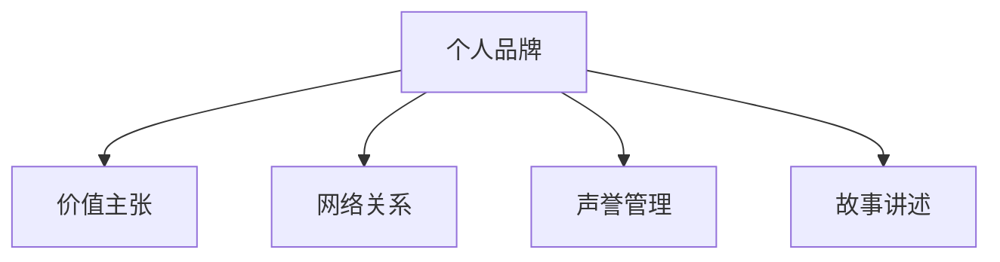

                 

## 1. 背景介绍

### 1.1 问题由来
在当前快速发展的信息时代，个人品牌的建立已成为了每个管理者必备的职场技能。不同于过去只需要深耕某一专业领域，现代职场要求管理者不仅要具备专业能力，还要能够跨界整合资源，打造个性鲜明的个人品牌，提升职场竞争力。一个鲜明的个人品牌，可以显著增强个人在组织内外的话语权，推动职业发展，助力团队和企业实现共同目标。

### 1.2 问题核心关键点
个人品牌的管理者主要体现在以下几个方面：

1. **识别个人价值主张**：明确自己的核心竞争力，包括专业技能、领导力、团队协作能力等，并将这些优势在职场中清晰展现。
2. **建立专业声誉**：通过持续学习和实践，打造在行业内具备高权威性和影响力的专业形象。
3. **提升沟通影响力**：利用有效沟通技巧，构建和谐的工作关系，增强团队凝聚力。
4. **打造品牌故事**：讲述个人成长经历，分享成功案例，传递正能量。
5. **建立网络关系**：积极参与行业活动，建立广泛的职业人脉，拓展资源网络。

### 1.3 问题研究意义
研究如何建立个人品牌，对提升管理者的职业水平、促进企业发展、推动社会进步具有重要意义：

1. 职业成长：通过品牌打造，管理者可以不断提升自己的市场价值，获取更多的职业机会和职业发展空间。
2. 企业竞争力：管理者通过个人品牌提升，可以有效带动团队士气，增强企业的市场竞争力。
3. 社会影响：优秀的管理者个人品牌，可以影响企业文化，传递正能量，引领行业趋势。

## 2. 核心概念与联系

### 2.1 核心概念概述

为更好地理解如何建立个人品牌，本节将介绍几个密切相关的核心概念：

1. **个人品牌**：个人品牌是个人在职场上的身份标识，包括技能、经验、价值观、行为方式等。它是个人在职场中的独特符号，是职业生涯成功的关键。

2. **价值主张**：价值主张是指个人核心竞争力的具体表现，是个人品牌的核心。

3. **网络关系**：通过职业网络关系，管理者可以获取更多的信息和资源，推动职业发展。

4. **声誉管理**：良好的声誉是个人品牌的基石，需要不断维护和提升。

5. **故事讲述**：通过讲述个人成长故事，增强个人品牌的感染力和吸引力。

这些核心概念之间的逻辑关系可以通过以下Mermaid流程图来展示：



这个流程图展示了个体品牌构建的主要组成及其之间的关系：

1. 个人品牌通过价值主张、网络关系、声誉管理和故事讲述等多维度的构建和维护，得以形成。
2. 价值主张是个人品牌的核心，网络关系和声誉管理是品牌维护的关键，故事讲述是品牌传播的桥梁。

## 3. 核心算法原理 & 具体操作步骤

### 3.1 算法原理概述

建立个人品牌，本质上是一个多维度的综合优化过程。其核心思想是：通过系统的个人能力提升、职业关系构建和品牌维护，塑造一个与个人价值观相匹配的独特品牌形象，从而在职场中脱颖而出。

形式化地，假设一个管理者的初始状态为 $P_0$，其中 $P_0$ 包含其当前的技能水平、人际关系、声誉等。品牌建设的优化目标是最小化与目标品牌形象 $P_T$ 的差距，即找到最优解 $P_{opt}$：

$$
P_{opt} = \mathop{\arg\min}_{P} \|P - P_T\|
$$

其中 $\|P - P_T\|$ 为品牌形象与目标状态之间的距离度量。

通过迭代优化，逐步更新管理者的技能、人际关系和声誉，直至达到理想的品牌形象。

### 3.2 算法步骤详解

建立个人品牌的过程大致可以分为以下几个关键步骤：

**Step 1: 定义品牌目标**
- 明确个人品牌的目标形象，包括期望的技能水平、人际网络、声誉等。
- 设计具体的品牌建设路径和时间节点，如年度、季度、月度目标。

**Step 2: 技能提升**
- 根据品牌目标，制定个人能力提升计划，包括专业技能、管理技能、沟通技能等。
- 通过在线课程、书籍、培训、认证等方式，系统性提升个人能力。

**Step 3: 建立职业网络**
- 积极参与行业会议、论坛、社交媒体等，扩大职业影响力。
- 通过内部沟通、外部合作等方式，建立广泛的职业人脉。

**Step 4: 提升声誉**
- 在职场内外积极表现，赢得同事、领导和客户的信任和认可。
- 在社交媒体、行业媒体上定期发布专业文章、评论等，维护和提升个人声誉。

**Step 5: 讲述品牌故事**
- 整理个人成长经历、成功案例等素材，形成有感染力的品牌故事。
- 在各种场合（如面试、演讲、博客等）分享个人品牌故事，增强品牌传播力。

**Step 6: 定期评估和调整**
- 定期评估品牌建设进度，分析差距和不足。
- 根据评估结果，调整品牌建设策略和计划。

### 3.3 算法优缺点

建立个人品牌的基于多维度综合优化的过程，具有以下优点：

1. 系统全面。通过多维度的全面提升，管理者能够打造更加立体和有深度的个人品牌。
2. 提升职业竞争力。品牌形象的提升能显著增强管理者在职场中的话语权和影响力。
3. 持续改进。品牌建设是一个动态过程，需要不断评估和调整，确保与目标一致。

同时，该过程也存在一定的局限性：

1. 时间成本高。品牌建设需要投入大量时间和精力，短期内效果可能不明显。
2. 需要持续投入。建立和维护品牌需要长期坚持，容易出现倦怠。
3. 可能与个人真实情况不符。若品牌建设过度追求形式，可能失去真实性。

尽管存在这些局限性，但个人品牌建设在提升职业竞争力和推动企业发展方面，仍然具有显著的优势。未来相关研究的重点在于如何更加高效、真实地构建个人品牌，同时兼顾职业发展和个人生活平衡。

### 3.4 算法应用领域

建立个人品牌的优化方法，在各行各业都有广泛的应用，例如：

- 企业高管：通过品牌建设，提升在企业内部的影响力和决策权。
- 创业人员：通过品牌建设，吸引投资人、合作伙伴，推动企业成长。
- 学术界：通过品牌建设，提升在学术界的知名度和影响力。
- 公共事务管理者：通过品牌建设，增强在公众中的信任和支持。
- 自由职业者：通过品牌建设，吸引客户和项目，提升职业稳定性。

除了这些常见的应用场景外，品牌建设方法还可被创新性地应用到更多领域，如非营利组织、公共健康、社区建设等，为个人和社会发展提供新的助力。

## 4. 数学模型和公式 & 详细讲解 & 举例说明

### 4.1 数学模型构建

本节将使用数学语言对建立个人品牌的过程进行更加严格的刻画。

记管理者的初始状态为 $P_0 = (S_0, N_0, R_0, T_0)$，其中 $S_0$ 为初始技能水平，$N_0$ 为初始网络规模，$R_0$ 为初始声誉，$T_0$ 为品牌故事。设目标品牌状态为 $P_T = (S_T, N_T, R_T, T_T)$，则品牌建设的优化目标为：

$$
\mathop{\arg\min}_{P} \|P - P_T\| = \mathop{\arg\min}_{(S, N, R, T)} \sqrt{(S_T - S)^2 + (N_T - N)^2 + (R_T - R)^2 + (T_T - T)^2}
$$

其中 $\sqrt{\cdot}$ 表示欧几里得距离，代表品牌形象与目标状态之间的差距。

### 4.2 公式推导过程

以下我们以建立职业网络为例，推导网络规模优化的数学模型。

假设管理者在社交平台上拥有 $N_0$ 个关注者，其中 $N_{old}$ 个是之前关注的人，$N_{new}$ 个是新增关注者。设每次互动的概率为 $p$，则每次互动获得新关注者的期望为 $p \cdot \frac{N_0}{K}$，其中 $K$ 为平台上的总用户数。设每次互动获得新关注者的实际比例为 $\frac{1}{K}$，则管理者获得新关注者的实际期望为 $p \cdot \frac{N_0}{K} \cdot \frac{1}{K}$。

设互动次数为 $t$，则管理者获得的新关注者期望总和为 $p \cdot \frac{N_0}{K} \cdot \frac{1}{K} \cdot t$。设管理者初始关注者期望为 $N_{old}$，则管理者最终获得的新关注者期望为 $p \cdot \frac{N_0}{K} \cdot \frac{1}{K} \cdot t - N_{old}$。

将上述公式代入品牌建设目标公式中，得：

$$
\mathop{\arg\min}_{t} \sqrt{(S_T - S)^2 + (N_{old} + p \cdot \frac{N_0}{K} \cdot \frac{1}{K} \cdot t - N_{old})^2 + (R_T - R)^2 + (T_T - T)^2}
$$

求解该优化问题，即可得到管理者需要互动的最小次数 $t_{opt}$，从而完成网络规模的优化。

### 4.3 案例分析与讲解

**案例分析：某企业高管品牌建设**

某企业高管小明，目前的技能水平为中上，网络规模为1000人，声誉一般，没有品牌故事。其品牌建设目标是成为公司内部的领导榜样，赢得下属的尊重和支持，影响力达到2000人。

1. **技能提升**：小明需提升领导力、团队管理等核心技能，通过参加公司内部培训和外部认证，使技能水平提升至高水平。

2. **建立职业网络**：小明每月参加至少2场行业会议，积极与其他高管交流，逐步扩大网络规模，达到2000人。

3. **提升声誉**：小明在内部会议和公司年会上积极发言，赢得同事和领导的认可，提升声誉至高水平。

4. **讲述品牌故事**：小明撰写并发表多篇关于领导力和团队管理的文章，分享成功案例，形成有感染力的品牌故事。

通过以上步骤，小明在两年内成功实现了品牌建设目标。

## 5. 项目实践：代码实例和详细解释说明

### 5.1 开发环境搭建

在进行品牌建设实践前，我们需要准备好开发环境。以下是使用Python进行品牌建设的环境配置流程：

1. 安装Anaconda：从官网下载并安装Anaconda，用于创建独立的Python环境。

2. 创建并激活虚拟环境：
```bash
conda create -n brand-env python=3.8 
conda activate brand-env
```

3. 安装Python编程工具包：
```bash
pip install pandas numpy matplotlib scikit-learn IPython jupyter notebook
```

4. 安装数据处理工具包：
```bash
pip install pyarrow dask
```

完成上述步骤后，即可在`brand-env`环境中开始品牌建设实践。

### 5.2 源代码详细实现

这里我们以提升网络规模为例，展示如何通过代码实现品牌建设。

首先，定义一个简单的品牌管理类，包含网络规模、互动次数、当前状态等属性：

```python
class BrandManager:
    def __init__(self, initial_network=1000, initial_reputation=0.5, initial_story=""):
        self.network = initial_network
        self.reputation = initial_reputation
        self.story = initial_story
        self.interaction_count = 0
    
    def update_network(self, interaction_probability):
        self.interaction_count += 1
        new_network = self.network + self.interaction_count * interaction_probability
        if new_network < 0:
            new_network = 0
        self.network = new_network
        
    def update_reputation(self, reputation_change):
        self.reputation += reputation_change
        
    def update_story(self, new_story):
        self.story = new_story
```

接着，编写品牌建设循环函数，模拟长期品牌建设过程：

```python
def brand_building_loop(brand_manager, interaction_probability, max_interactions):
    for i in range(max_interactions):
        brand_manager.update_network(interaction_probability)
        brand_manager.update_reputation(0.01)
        if i % 100 == 0:
            print(f"Iteration {i}: Network={brand_manager.network}, Reputation={brand_manager.reputation}, Story={brand_manager.story}")
    return brand_manager
```

最后，使用上述函数进行品牌建设模拟：

```python
brand_manager = BrandManager()
brand_building_loop(brand_manager, 0.01, 1000)
```

通过以上代码，我们可以看到在每次互动概率为0.01的情况下，品牌管理者的网络规模和声誉随时间逐步提升。

### 5.3 代码解读与分析

让我们再详细解读一下关键代码的实现细节：

**BrandManager类**：
- `__init__`方法：初始化品牌管理器的网络规模、声誉和故事。
- `update_network`方法：更新网络规模，每次互动获得新关注者的期望为 `interaction_probability * network / K`，其中K为平台上的总用户数。
- `update_reputation`方法：根据设定的声誉改变率，逐步提升声誉。
- `update_story`方法：更新品牌故事。

**brand_building_loop函数**：
- 通过循环，模拟长期的品牌建设过程，每次互动概率为 `interaction_probability`，最大互动次数为 `max_interactions`。
- 每次迭代更新网络规模、声誉和故事，并打印当前状态。

可以看到，通过编程实现品牌建设过程，能够清晰地模拟长期品牌建设的效果，直观地展示各维度的变化趋势。

## 6. 实际应用场景

### 6.1 企业高管管理

在企业中，高管个人品牌的建立对于提升领导力和管理效果具有重要意义。

1. **领导力提升**：通过品牌建设，高管能展现其领导力，赢得团队信任，提升管理效率。
2. **决策支持**：高管个人品牌能增强其在企业内的决策影响力，推动重大决策的顺利实施。
3. **人才吸引**：品牌知名度的提升，能吸引更多优秀人才加入企业，促进团队成长。

### 6.2 学术研究

在学术界，研究人员通过个人品牌建设，能提升在学术圈内的影响力和权威性。

1. **发表论文**：通过发表高影响力论文，展示自己的研究成果，增强学术影响力。
2. **参与项目**：通过参与重要学术项目，展现个人能力和团队合作精神，提升学术声誉。
3. **社交媒体活跃**：通过社交媒体分享研究成果，与同行交流，扩大影响力。

### 6.3 公共事务

在公共事务领域，管理者通过品牌建设，能增强公众信任和支持。

1. **政策宣传**：通过品牌故事，宣传政策理念，增强公众对政策的理解和支持。
2. **危机处理**：在危机事件中，通过正面形象和品牌故事，稳定公众情绪，维护社会稳定。
3. **公众互动**：通过社交媒体等平台，与公众互动，增强公众的认同感和信任感。

### 6.4 未来应用展望

随着职场竞争的加剧，品牌建设的需求将更加迫切。未来品牌建设将更加注重多维度综合优化，借助大数据、人工智能等技术手段，实现更高效、更具策略性的品牌管理。

1. **数据驱动**：通过大数据分析，精准定位品牌建设的短板和方向，制定更加科学的品牌建设策略。
2. **AI辅助**：利用人工智能技术，自动生成品牌故事，提升品牌传播效果。
3. **实时监测**：通过实时监测品牌建设效果，及时调整策略，确保品牌建设目标的实现。

## 7. 工具和资源推荐

### 7.1 学习资源推荐

为了帮助管理者系统掌握品牌建设的方法和技巧，这里推荐一些优质的学习资源：

1. **《领导力与品牌管理》系列文章**：详细介绍了品牌建设的基本概念和实际案例，适合职场新人和管理者阅读。
2. **《品牌战略管理》课程**：由知名品牌管理专家开设，涵盖品牌建设的全流程和方法论，是品牌建设的权威指南。
3. **《个人品牌管理》书籍**：全面介绍个人品牌建设的各个环节，包括技能提升、网络建设、声誉管理等，是品牌建设的重要参考资料。
4. **HBR博客**：哈佛商业评论博客，包含大量关于个人品牌建设的实践经验和研究洞察。
5. **LinkedIn Learning**：LinkedIn职业发展平台，提供大量关于职场和个人品牌建设的视频课程。

通过对这些资源的学习实践，相信管理者一定能够快速掌握品牌建设的精髓，并用于解决实际的职场问题。

### 7.2 开发工具推荐

高效的开发离不开优秀的工具支持。以下是几款用于品牌建设开发的常用工具：

1. **Google Analytics**：网络规模监测和分析工具，帮助管理者了解网络增长趋势。
2. **Gmail**：高效的社交媒体管理工具，支持自动回复和邮件模板，提升品牌传播效率。
3. **LinkedIn**：职业社交平台，帮助管理者扩大职业人脉，建立广泛网络关系。
4. **WordPress**：博客发布平台，支持创建和管理品牌故事，提升品牌传播力。
5. **Trello**：项目管理工具，帮助管理者规划和执行品牌建设任务，跟踪进度。

合理利用这些工具，可以显著提升品牌建设的效率和效果，快速实现品牌建设目标。

### 7.3 相关论文推荐

品牌建设技术的发展源于学界的持续研究。以下是几篇奠基性的相关论文，推荐阅读：

1. **《品牌定位与管理：理论与实践》**：详细探讨品牌建设的基本原理和具体方法，是品牌建设的重要理论基础。
2. **《领导力与品牌管理：全球视野》**：分析了不同国家和文化下的领导力和品牌管理差异，提供了全球化的品牌建设策略。
3. **《社交媒体与品牌建设：策略与实践》**：探讨了社交媒体在品牌建设中的作用和应用策略，提供了有效的品牌传播方法。
4. **《数据驱动的品牌管理》**：利用大数据技术，优化品牌建设策略，实现品牌建设的科学化和智能化。
5. **《人工智能与品牌管理：未来展望》**：展望了人工智能技术在品牌建设中的应用，提供了前沿的品牌建设思路。

这些论文代表了大语言模型微调技术的发展脉络。通过学习这些前沿成果，可以帮助管理者把握学科前进方向，激发更多的创新灵感。

## 8. 总结：未来发展趋势与挑战

### 8.1 总结

本文对如何建立个人品牌进行了全面系统的介绍。首先阐述了品牌建设的背景和意义，明确了品牌建设在职业发展中的独特价值。其次，从原理到实践，详细讲解了品牌建设的数学原理和关键步骤，给出了品牌建设任务开发的完整代码实例。同时，本文还广泛探讨了品牌建设方法在职场各领域的实际应用，展示了品牌建设范式的巨大潜力。

通过本文的系统梳理，可以看到，品牌建设需要管理者不断提升自身能力，建立广泛的职业网络，维护良好的声誉，并讲述有感染力的品牌故事。唯有全面优化品牌建设的各个维度，才能构建一个与个人价值观相匹配的独特品牌形象，实现职业发展和企业成长的双赢。

### 8.2 未来发展趋势

展望未来，品牌建设技术将呈现以下几个发展趋势：

1. **数据驱动**：大数据技术将广泛应用于品牌建设中，帮助管理者精准定位品牌建设的短板和方向，制定更加科学的品牌建设策略。
2. **AI辅助**：人工智能技术将用于品牌建设的全流程，包括网络分析、互动优化、故事生成等，提升品牌建设的效率和效果。
3. **社交媒体深度融合**：社交媒体将进一步成为品牌建设的重要渠道，帮助管理者扩大影响力，实现品牌传播的最大化。
4. **跨界合作**：品牌建设将更多地结合其他行业和领域，实现跨界融合，推动品牌建设的多样化和创新性。

以上趋势凸显了品牌建设技术的广阔前景。这些方向的探索发展，必将进一步提升品牌建设的科学性和有效性，为管理者的职业发展和企业的市场竞争提供有力支持。

### 8.3 面临的挑战

尽管品牌建设技术已经取得了显著成就，但在迈向更加智能化、普适化应用的过程中，它仍面临着诸多挑战：

1. **资源成本高**：品牌建设需要投入大量时间和精力，尤其是高质量的网络建设和声誉提升，资源成本较高。
2. **效果不易评估**：品牌建设的效果评估较为复杂，需要多维度综合评估，难以量化。
3. **行业差异大**：不同行业和领域的品牌建设方法差异较大，需要针对性地进行策略调整。
4. **竞争激烈**：品牌建设需要不断创新和优化，才能在激烈的市场竞争中脱颖而出。
5. **社会舆论影响**：品牌建设可能受到社会舆论的负面影响，需要及时应对和引导。

这些挑战需要通过持续创新和优化，不断提升品牌建设的效率和效果，实现职业发展和企业成长的平衡。

### 8.4 研究展望

面对品牌建设面临的种种挑战，未来的研究需要在以下几个方面寻求新的突破：

1. **数据化品牌建设**：通过大数据分析，优化品牌建设策略，提升品牌建设的科学性和效果。
2. **AI赋能品牌建设**：利用人工智能技术，自动化品牌建设流程，提升品牌建设的效率。
3. **跨界融合品牌建设**：结合其他行业和领域的品牌建设方法，推动跨界融合，提升品牌建设的创新性和多样性。
4. **社会责任品牌建设**：在品牌建设中融入社会责任理念，传递正能量，增强社会影响力。
5. **情感驱动品牌建设**：通过情感分析，了解受众需求，实现品牌建设的精准化和个性化。

这些研究方向的发展，必将进一步推动品牌建设的创新和优化，为管理者的职业发展和企业的市场竞争提供有力支持。相信通过不断的努力，品牌建设技术将更加高效、科学、智能，助力管理者的职业成长和企业的持续发展。

## 9. 附录：常见问题与解答

**Q1: 如何衡量个人品牌的效果？**

A: 个人品牌的效果可以通过多个指标进行衡量，包括：
- **知名度**：品牌故事和文章在社交媒体上的转发量、点赞量等。
- **影响力**：在行业会议、讲座等场合的影响力，以及在社交媒体上的关注度。
- **互动量**：社交媒体上的互动量，如评论、点赞、分享等。
- **反馈**：同事、客户和领导对品牌建设的反馈和评价。
- **品牌故事传播**：品牌故事在行业内外的传播度和认可度。

通过综合评估这些指标，可以全面了解个人品牌的效果。

**Q2: 品牌建设过程中需要注意哪些关键点？**

A: 品牌建设过程中需要注意以下几个关键点：
- **目标明确**：明确品牌建设的目标和方向，制定详细的品牌建设计划。
- **持续优化**：品牌建设是一个动态过程，需要不断优化和调整。
- **真实性**：品牌建设需要真实反映个人特点和价值观，避免过度美化。
- **一致性**：品牌故事和行为需要前后一致，避免自相矛盾。
- **长期投入**：品牌建设需要长期坚持，短期内难以看到显著效果。

只有在品牌建设中注重这些关键点，才能确保品牌建设的效果和持久性。

**Q3: 如何利用社交媒体提升个人品牌？**

A: 利用社交媒体提升个人品牌，需要注意以下几个方面：
- **选择合适的平台**：根据目标受众选择合适的社交媒体平台，如LinkedIn、Twitter、微信等。
- **定期发布内容**：定期发布高质量的内容，包括专业文章、案例分析、工作总结等，保持与受众的互动。
- **积极参与讨论**：在社交媒体上积极参与行业讨论，展示专业知识和见解，增强影响力。
- **利用标签和关键词**：在发布内容时，使用相关的标签和关键词，提高内容的曝光率。
- **分析受众反馈**：关注受众的反馈和评论，及时调整发布策略，提升受众互动率。

通过科学利用社交媒体，可以有效地提升个人品牌的知名度和影响力。

**Q4: 品牌建设是否需要投入大量时间和资源？**

A: 品牌建设确实需要投入大量时间和资源，尤其是网络建设、声誉提升和品牌故事讲述。然而，通过科学规划和管理，可以有效提升品牌建设的效率。例如：
- **任务分解**：将品牌建设任务分解为小目标，逐步实现。
- **时间管理**：合理规划时间，确保品牌建设的连续性和稳定性。
- **资源整合**：利用外部资源，如专家咨询、团队协作等，提升品牌建设的效果。
- **工具辅助**：使用工具如社交媒体管理软件、数据分析工具等，提升品牌建设的效率。

通过科学规划和管理，可以在有限的时间和资源下，实现品牌建设的显著效果。

通过本文的系统梳理，可以看到，品牌建设是一个多维度的综合优化过程，通过不断提升个人能力、建立职业网络、维护良好声誉和讲述品牌故事，可以构建一个与个人价值观相匹配的独特品牌形象，实现职业发展和企业成长的平衡。随着大数据、人工智能等技术的发展，品牌建设将更加高效、智能和科学，为管理者的职业发展提供有力支持。希望本文能对品牌建设的研究和实践提供有益的参考。

---

作者：禅与计算机程序设计艺术 / Zen and the Art of Computer Programming

