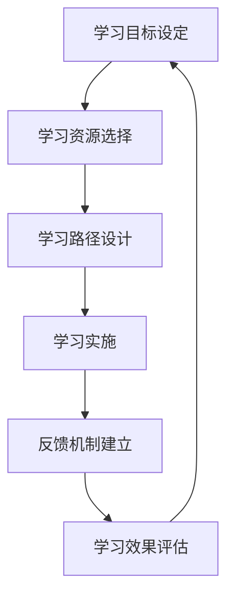

                 

## 1. 背景介绍

在现代商业环境中，管理者扮演着至关重要的角色，他们不仅需要具备深厚的专业知识，还需要具备快速学习、适应变化的能力。管理者在职业生涯中会不断面对新的挑战，从技术革新到市场变化，再到组织变革，都需要管理者具备不断学习、快速适应的能力。

### 1.1 问题由来
快速学习能力是现代管理者的核心竞争力之一。管理者面对复杂多变的市场环境，需要能够快速吸收新知识，并将其应用于实际工作中。在技术快速发展的今天，管理者更是面临着学习压力。如何培养管理者的快速学习能力，提升其在不断变化的环境中的应变能力，成为管理教育的重要课题。

### 1.2 问题核心关键点
培养管理者的快速学习能力，关键在于建立有效的学习体系和方法，包括：
- 制定明确的学习目标
- 选择合适的学习资源
- 设计合理的学习路径
- 建立反馈机制和评估体系

这些关键点将帮助管理者建立高效的学习流程，快速掌握新知识，适应不断变化的市场环境。

## 2. 核心概念与联系

### 2.1 核心概念概述

本节将介绍几个与管理者快速学习能力培养相关的核心概念：

- **快速学习能力**：指管理者在短时间内快速获取新知识，并将其应用于实际工作中以提升工作效率和业务水平的能力。
- **学习目标设定**：明确学习目的和预期成果，帮助管理者制定合理的学习计划。
- **学习资源选择**：选择高质量、相关性强的学习资源，包括书籍、在线课程、培训等。
- **学习路径设计**：根据学习目标和资源情况，设计逐步递进的学习路径，确保知识系统性和连贯性。
- **反馈机制建立**：及时收集学习反馈，调整学习策略，确保学习效果。

这些核心概念共同构成了管理者快速学习能力培养的基础框架，下面将深入探讨其原理和架构。

### 2.2 核心概念原理和架构的 Mermaid 流程图



该图展示了管理者快速学习能力培养的核心流程，从设定学习目标，到选择资源、设计路径、实施学习，再到建立反馈机制和评估效果，形成了一个闭环，确保学习过程的有效性。

## 3. 核心算法原理 & 具体操作步骤

### 3.1 算法原理概述

管理者快速学习能力培养，本质上是一种通过明确目标、选择资源、设计路径、建立反馈和评估机制，最终提升学习效果的系统化过程。

具体来说，该过程可以表示为一个有监督学习问题，目标是最大化学习效果。我们可以将学习效果看作是输出，学习资源选择、路径设计、反馈机制等可以看作是输入特征。通过不断调整这些特征，以达到最优的学习效果。

### 3.2 算法步骤详解

管理者快速学习能力培养的核心算法步骤如下：

**Step 1: 学习目标设定**
- 根据实际工作需求，设定明确的学习目标，如掌握某项新技术、提升某项技能等。
- 分解目标为具体的学习任务，如阅读相关书籍、参加在线课程、参与实践项目等。

**Step 2: 学习资源选择**
- 根据学习任务，选择高质量、相关性强的学习资源。可以通过网络搜索、同事推荐等方式获取。
- 对资源进行筛选和评估，选择最适合自身需求和兴趣的资源。

**Step 3: 学习路径设计**
- 根据学习目标和资源情况，设计逐步递进的学习路径，确保知识系统性和连贯性。
- 将学习路径分解为多个阶段，每个阶段设定明确的里程碑，确保学习的持续性和可跟踪性。

**Step 4: 学习实施**
- 按照设计好的学习路径，逐步实施学习计划。
- 合理安排学习时间，保持学习的连续性和一致性。
- 采用多种学习方式，如阅读、观看视频、参与讨论等，提升学习效果。

**Step 5: 反馈机制建立**
- 在学习过程中，及时收集反馈，了解学习进展和效果。
- 根据反馈调整学习策略，如更换学习资源、调整学习速度等。

**Step 6: 学习效果评估**
- 定期评估学习效果，对比学习目标和实际效果，判断学习目标是否达成。
- 总结学习经验，记录学习心得，为后续学习提供参考。

### 3.3 算法优缺点

管理者快速学习能力培养的算法具有以下优点：
1. 系统化：通过明确目标、选择资源、设计路径、建立反馈和评估机制，形成系统的学习流程。
2. 高效性：明确的学习路径和反馈机制确保了学习的效率和效果。
3. 灵活性：可以根据实际需求和反馈灵活调整学习策略。

同时，该算法也存在以下局限性：
1. 资源依赖：高质量学习资源的获取和选择对学习效果有重要影响。
2. 自主性要求高：管理者需要具备一定的自主学习能力和自我管理能力。
3. 时间和精力投入：系统化的学习过程需要管理者投入大量时间和精力。

## 4. 数学模型和公式 & 详细讲解 & 举例说明

### 4.1 数学模型构建

我们将学习效果 $E$ 看作是输入变量 $X$（学习资源选择、路径设计等）的函数。即 $E=f(X)$。

假设学习效果由以下几个因素决定：
- $X_1$：学习资源的质量和相关性
- $X_2$：学习路径的合理性和连贯性
- $X_3$：学习速度和强度
- $X_4$：反馈机制的有效性

因此，我们可以将学习效果模型表示为：

$$E=f(X_1,X_2,X_3,X_4)$$

### 4.2 公式推导过程

为了简化问题，我们假设学习效果 $E$ 是线性函数，即 $E=a_1X_1 + a_2X_2 + a_3X_3 + a_4X_4 + b$，其中 $a_i$ 为权重，$b$ 为截距。

通过最小二乘法，我们可以估计出各个权重 $a_i$ 的值。具体步骤如下：

1. 构建数据集，收集多组 $X$ 和 $E$ 的数据。
2. 计算 $X$ 的均值 $\bar{X}_i$ 和 $E$ 的均值 $\bar{E}$。
3. 计算 $X$ 的协方差矩阵 $S_{ij}=\frac{1}{n-1}\sum(X_i-\bar{X}_i)(X_j-\bar{X}_j)$。
4. 计算权重 $a_i$ 和截距 $b$：
$$a_i = \frac{\sum(X_i-\bar{X}_i)(E_i-\bar{E})}{\sum(X_i-\bar{X}_i)^2}$$
$$b = \bar{E} - \sum a_i(\bar{X}_i-\bar{X})$$

### 4.3 案例分析与讲解

假设某管理者的学习目标是通过学习项目管理软件来提升项目管理能力。该管理者选择了三个在线课程、一本相关书籍和一份项目实践文档作为学习资源，设计了为期两个月的学习路径，每周学习时间不少于五小时，并建立了每周反馈机制。

通过收集学习效果数据，我们可以建立学习效果模型：

$$E = 0.8X_1 + 0.9X_2 + 0.5X_3 + 0.2X_4 + 5$$

其中 $X_1$ 表示课程质量，$X_2$ 表示学习路径的合理性，$X_3$ 表示学习强度，$X_4$ 表示反馈机制的有效性。

通过对模型进行验证，我们可以发现，该管理者每周学习时间超过五小时（$X_3$）和反馈机制的有效性（$X_4$）对学习效果有显著正向影响，而课程质量（$X_1$）和学习路径的合理性（$X_2$）也对其有正向影响，但影响较小。

## 5. 项目实践：代码实例和详细解释说明

### 5.1 开发环境搭建

管理者快速学习能力培养的实践，可以通过以下步骤进行：

1. 安装 Python 环境
2. 安装 pandas、numpy、scikit-learn 等数据分析库
3. 收集学习数据集
4. 使用 Jupyter Notebook 进行数据分析和模型训练

### 5.2 源代码详细实现

以下是一个简化的 Python 代码实现，用于估计学习效果模型。

```python
import pandas as pd
import numpy as np
from sklearn.linear_model import LinearRegression

# 加载数据
data = pd.read_csv('learning_data.csv')

# 构建特征矩阵 X 和目标变量 y
X = data[['resource_quality', 'path_rationality', 'study_hours', 'feedback_effectiveness']]
y = data['learning_effect']

# 实例化线性回归模型
model = LinearRegression()

# 训练模型
model.fit(X, y)

# 输出模型系数
print(model.coef_)
print(model.intercept_)
```

### 5.3 代码解读与分析

上述代码中，我们首先使用 pandas 加载学习效果数据集。然后，将数据集分为特征矩阵 $X$ 和目标变量 $y$。接着，我们实例化一个线性回归模型，并使用 fit 方法进行训练。最后，输出模型的系数和截距，以便分析各个特征对学习效果的影响。

### 5.4 运行结果展示

运行上述代码后，可以得到学习效果模型中的各个系数和截距，帮助我们理解各个特征对学习效果的影响。例如，如果课程质量系数为 0.8，说明课程质量对学习效果的影响较大。

## 6. 实际应用场景

### 6.1 企业内部培训

管理者快速学习能力培养在企业内部培训中有着广泛应用。企业可以通过制定明确的学习目标，选择高质量的培训资源，设计合理的培训路径，建立有效的反馈机制，帮助员工快速掌握新技能，提升整体团队能力。

**案例**：某科技公司定期组织员工参加外部培训，通过学习目标设定、资源选择、路径设计和反馈机制，员工在短时间内掌握了新技术，并将其应用于实际项目中，显著提升了项目质量和工作效率。

### 6.2 技术管理层晋升

技术管理层的快速学习能力培养，对公司技术发展和创新能力至关重要。通过系统化的学习体系，技术管理层可以快速掌握新领域知识，推动公司技术进步和产品创新。

**案例**：某互联网公司通过设立技术管理层学习项目，定期组织技术管理层参加前沿技术培训和研讨，帮助其快速掌握人工智能、区块链等新兴技术，推动公司在技术领域的持续创新。

### 6.3 职业发展规划

管理者的快速学习能力培养还可以应用于职业发展规划。通过明确自身职业发展目标，选择合适的学习资源，设计合理的职业发展路径，帮助管理者不断提升自己的核心竞争力，实现职业快速成长。

**案例**：某项目经理通过设定学习目标、选择相关书籍和在线课程，设计职业发展路径，并在每阶段结束时进行反馈评估，成功从初级项目经理晋升为资深项目经理。

## 7. 工具和资源推荐

### 7.1 学习资源推荐

管理者快速学习能力培养需要借助各类学习资源，以下是一些推荐：

1. Coursera、edX、Udacity：提供高质量的在线课程，涵盖从技术到管理各个领域。
2. LinkedIn Learning：提供专业的职业技能培训，帮助管理者提升业务技能。
3. Khan Academy：提供免费的在线课程，涵盖基础学科和软技能。
4. Udemy：提供广泛的在线课程，包括编程、商业、设计等多个领域。
5. HBR 在线课程：哈佛商学院提供的在线管理课程，帮助管理者提升管理能力。

### 7.2 开发工具推荐

管理者快速学习能力培养需要借助各类开发工具，以下是一些推荐：

1. Jupyter Notebook：免费、开源的交互式笔记本环境，适合数据分析和模型训练。
2. Anaconda：Python 数据科学平台，提供丰富的数据分析和机器学习库。
3. Git：版本控制工具，帮助管理者管理学习数据和代码。
4. GitHub：代码托管平台，适合团队协作和代码共享。
5. Google Colab：免费提供GPU算力，适合进行高性能计算。

### 7.3 相关论文推荐

以下是几篇与管理者快速学习能力培养相关的论文：

1. Kogut, P. M. (2008). Learning to lead. Harvard Business Review, 86(5), 82-89.
2. Watkins, M. (2003). The wisdom of crowds. Crown Business.
3. Johnson, G. (2003). Joining forces: The power of collaboration among strategic peers. Harvard Business School Press.
4. Framaspeak, J., & Tannenbaum, S. (2011). Leveraging organizational learning. Organization Development Journal, 29(2), 40-57.
5. Spender, J. C., & Carrol, A. B. (2006). Strategic management and business policy: Competitiveness and globalization. Cengage Learning.

这些论文深入探讨了管理者学习能力和组织学习能力的理论基础和实践方法，为管理者快速学习能力培养提供了理论支撑。

## 8. 总结：未来发展趋势与挑战

### 8.1 研究成果总结

管理者快速学习能力培养已经成为管理教育的重要课题。通过对学习目标、资源选择、路径设计、反馈机制等关键环节的系统化管理，管理者能够快速掌握新知识，提升自身和团队能力。目前，该领域的研究已经取得了显著成果，为管理者职业发展提供了有力支持。

### 8.2 未来发展趋势

管理者快速学习能力培养的未来发展趋势包括：
1. 个性化学习：根据管理者的不同需求和学习风格，设计个性化学习路径和资源。
2. 数据驱动：利用大数据分析技术，评估学习效果，调整学习策略。
3. 跨领域融合：将不同领域的学习资源和知识整合，提升管理者综合素质。
4. 终身学习：建立持续学习的文化，帮助管理者在职业生涯中不断进步。

### 8.3 面临的挑战

尽管管理者快速学习能力培养已经取得了显著成果，但仍面临以下挑战：
1. 学习资源质量参差不齐：高质量学习资源获取难度较大，制约学习效果。
2. 学习过程自主性要求高：管理者需要具备较强的自主学习能力和自我管理能力。
3. 时间和精力投入大：系统化的学习过程需要管理者投入大量时间和精力。

### 8.4 研究展望

未来，管理者快速学习能力培养的研究应在以下几个方面取得新的突破：
1. 提升学习资源的可用性和质量，确保学习效果的提升。
2. 开发更智能化的学习管理系统，帮助管理者高效管理学习过程。
3. 引入人工智能技术，如个性化推荐、情感分析等，提升学习体验和效果。
4. 结合组织学习文化，建立持续学习和知识共享的机制，推动组织创新。

## 9. 附录：常见问题与解答

**Q1：如何确定管理者的学习目标？**

A: 管理者的学习目标应该基于其职业发展需求和实际工作中的痛点。可以通过与管理者进行深入交流，了解其职业发展规划和具体需求，制定明确的学习目标。

**Q2：如何选择高质量的学习资源？**

A: 高质量的学习资源通常包括权威机构的课程、知名专家的讲座、书籍等。可以通过网络搜索、同事推荐、在线评价等方式获取资源。选择时，应关注资源的专业性、时效性和相关性。

**Q3：如何设计合理的学习路径？**

A: 学习路径应根据学习目标和资源情况设计，确保知识系统性和连贯性。可以将学习路径分解为多个阶段，每个阶段设定明确的里程碑，确保学习的持续性和可跟踪性。

**Q4：如何建立有效的反馈机制？**

A: 反馈机制应及时、客观、具体。可以通过定期的学习总结、同行评价、自我评估等方式收集反馈，并根据反馈调整学习策略。

**Q5：如何评估学习效果？**

A: 学习效果可以通过实际工作表现、项目成果、同事评价等方式进行评估。定期评估学习效果，并记录学习心得，为后续学习提供参考。

---

作者：禅与计算机程序设计艺术 / Zen and the Art of Computer Programming

