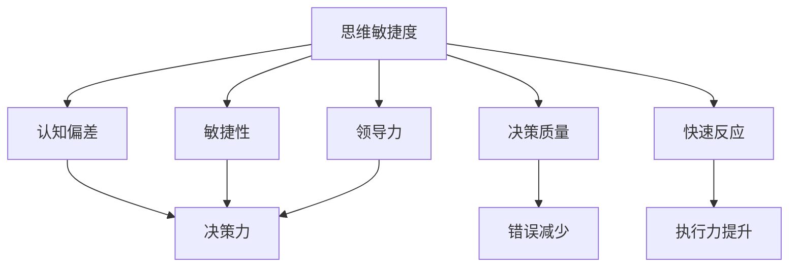

                 

# 管理者的思维敏捷度训练

> 关键词：管理者,思维敏捷度,敏捷性,领导力,决策力,认知偏差,创新,团队协作

## 1. 背景介绍

### 1.1 问题由来
在全球化竞争日趋激烈的今天，管理者需要在瞬息万变的商业环境中快速做出决策，对企业的长期发展和战略定位负责。然而，复杂的商业环境和不确定性往往让管理者难以做出准确而迅速的反应。因此，提升管理者的思维敏捷度，成为了企业实现战略目标和应对市场变化的重要基础。

### 1.2 问题核心关键点
管理者思维敏捷度的训练，旨在通过系统化的训练方法，帮助管理者提高决策速度、质量与创新能力。思维敏捷度的提升，不仅能增强管理者的应变能力，还能促进企业快速适应市场变化，持续保持竞争优势。

### 1.3 问题研究意义
提升管理者的思维敏捷度，对企业具有重大意义：
- 提高决策效率：快速准确地做出决策，减少犹豫和失误。
- 促进创新：打破固有思维模式，激发新想法和新解决方案。
- 增强团队协作：清晰准确地传达指令，提升团队执行力。
- 提升战略应对能力：灵活调整策略，适应市场变化和新技术的引入。

## 2. 核心概念与联系

### 2.1 核心概念概述

本节将介绍几个关键概念，帮助读者理解思维敏捷度训练的核心内容。

- **思维敏捷度**：指个体在复杂多变的环境下，快速准确做出判断和决策的能力。管理者思维敏捷度训练旨在提高管理者的快速反应、创新思维和决策质量。
- **认知偏差**：指人们在信息处理和判断过程中，由于心理因素、知识结构等导致的系统性偏差。提升思维敏捷度，需要识别并纠正认知偏差，提高决策准确性。
- **敏捷性**：指个体在变化环境下快速适应、灵活调整的能力。敏捷性训练通过模拟真实场景，提升管理者的应变能力。
- **领导力**：指管理者在组织中引导和影响他人，实现共同目标的能力。敏捷性训练与领导力提升紧密相关，帮助管理者在复杂环境中引导团队，达成共同目标。
- **决策力**：指管理者根据可获得的信息做出决策的能力。思维敏捷度训练通过案例分析等方法，提升管理者的决策质量和速度。

这些概念之间的逻辑关系可以通过以下Mermaid流程图来展示：



这个流程图展示了几大关键概念之间的联系：

1. 思维敏捷度提升需从认知偏差和决策力出发，识别并纠正偏差，提升决策质量。
2. 敏捷性训练帮助管理者在变化环境中快速适应和灵活调整。
3. 领导力增强管理者在复杂环境中引导团队的能力，进一步提升决策力。
4. 通过决策质量和快速反应，提升整体执行力，最终实现敏捷性的增强和领导力的提升。

## 3. 核心算法原理 & 具体操作步骤

### 3.1 算法原理概述

管理者思维敏捷度训练的原理，是通过认知行为科学的理论和方法，结合实际案例和模拟练习，帮助管理者提升在复杂环境中快速做出决策的能力。训练内容主要包括以下几个方面：

- **认知偏差识别**：通过认知心理学理论，识别管理者的常见认知偏差，如首因效应、锚定效应、确认偏误等。
- **决策力提升**：通过数据驱动的决策模型，帮助管理者学会在信息不完备情况下快速做出决策，并评估决策效果。
- **敏捷性训练**：通过模拟复杂场景和真实案例，提升管理者的应变能力和灵活调整能力。
- **领导力强化**：通过团队协作和情境模拟，提升管理者的领导力和团队引导能力。

### 3.2 算法步骤详解

基于上述原理，管理者思维敏捷度训练的具体步骤包括：

**Step 1: 认知偏差识别与评估**
- 使用认知心理学工具和问卷，评估管理者的认知偏差类型和程度。
- 通过案例分析，帮助管理者识别自身在实际决策中的偏差来源。

**Step 2: 决策力训练**
- 使用数据驱动的决策模型，设计多个模拟决策场景。
- 在每个场景中，提供多维度的信息（如市场数据、财务数据、竞争情况等），要求管理者在限定时间内做出决策。
- 评估决策的准确性和效率，分析改进空间。

**Step 3: 敏捷性训练**
- 设计模拟复杂环境的真实案例，如市场波动、技术变革、政策变化等。
- 要求管理者在限定时间内，对案例中的情况进行分析，并提出解决方案。
- 使用反馈机制，分析管理者的应变能力，并提供改进建议。

**Step 4: 领导力强化**
- 通过情境模拟和团队协作练习，评估管理者的领导力水平。
- 在模拟领导场景中，训练管理者的沟通能力、团队激励、冲突解决等领导力技能。
- 使用反馈和辅导，帮助管理者提升领导力。

**Step 5: 综合应用与评估**
- 将认知偏差识别、决策力训练、敏捷性训练和领导力强化结合起来，进行综合应用。
- 在实际工作中，跟踪管理者的决策过程和效果，提供持续反馈和改进建议。
- 定期评估管理者思维敏捷度的提升情况，并调整训练方案。

### 3.3 算法优缺点

管理者思维敏捷度训练方法具有以下优点：
1. 系统全面：涵盖认知偏差识别、决策力训练、敏捷性训练和领导力强化，提供全方位的提升方案。
2. 数据驱动：通过多维度信息输入和决策效果评估，提升管理者的决策质量和效率。
3. 实战模拟：通过模拟真实场景和案例分析，帮助管理者在实践中提升思维敏捷度。
4. 持续改进：提供持续的反馈和改进建议，帮助管理者不断优化思维模式。

同时，该方法也存在一定的局限性：
1. 培训周期长：培训周期较长，对管理者的工作时间和学习时间要求较高。
2. 依赖工具和技术：需要专业的工具和技术支持，如认知心理学问卷、数据驱动决策模型等。
3. 个体差异：不同管理者的认知风格和领导风格不同，需要个性化的训练方案。
4. 外部环境变化：外部环境的快速变化可能难以在短期内完全模拟，影响培训效果。

尽管存在这些局限性，但总体而言，基于认知行为科学的思维敏捷度训练方法，是提高管理者决策能力、提升企业竞争力的有效手段。

### 3.4 算法应用领域

管理者思维敏捷度训练方法适用于多个领域，帮助不同背景的管理者提升思维敏捷度：

- **企业高层管理**：帮助CEO、CTO等高层管理者，提升在复杂商业环境中的决策能力和战略应对能力。
- **项目管理**：帮助项目经理快速应对项目风险和变化，确保项目按时按质完成。
- **创新管理**：帮助研发团队领导识别和纠正认知偏差，推动创新项目的成功实施。
- **市场推广**：帮助市场总监在多变的市场环境中，快速做出市场决策，提升品牌影响力。
- **人力资源管理**：帮助HR经理在招聘、培训、激励等方面，提高员工满意度和绩效。

## 4. 数学模型和公式 & 详细讲解 & 举例说明

### 4.1 数学模型构建

本节将使用数学语言对管理者思维敏捷度训练的评估模型进行详细构建。

假设管理者在决策场景中的决策质量记为 $Q$，认知偏差程度记为 $B$，敏捷性记为 $A$，领导力记为 $L$。则管理者思维敏捷度的综合评估模型可以表示为：

$$
M = w_1Q + w_2B + w_3A + w_4L
$$

其中 $w_1, w_2, w_3, w_4$ 为各项指标的权重，且 $w_1 + w_2 + w_3 + w_4 = 1$。

### 4.2 公式推导过程

以下我们以决策力训练为例，推导其公式和计算过程。

设管理者在某个决策场景中的决策时间记为 $T$，决策准确性记为 $A$。通过数据分析，得到决策时间与决策准确性的关系为：

$$
A = f(T) = e^{kT}
$$

其中 $k$ 为正实数。

若决策场景中的信息数量为 $I$，则管理者可利用的信息质量为 $I \times (1-B)$。通过信息驱动的决策模型，得到管理者的决策质量评估公式为：

$$
Q = (I \times (1-B)) \times A
$$

将 $A$ 代入 $Q$ 的表达式，得到：

$$
Q = I \times (1-B) \times e^{kT}
$$

由于 $I$ 和 $T$ 通常是变量，因此需通过实验数据计算得到 $k$ 的值，并通过最大似然估计等方法，确定 $Q$ 的值。

### 4.3 案例分析与讲解

假设某公司一位市场总监在面对一场营销活动时，需要快速做出决策。决策场景中的信息数量为 $I = 1000$，管理者需要 $T = 3$ 天完成决策。根据市场数据，决策准确性的评估公式为 $A = 0.8^T$。管理者的认知偏差程度为 $B = 0.2$。

使用上述公式计算管理者的决策质量 $Q$：

$$
Q = I \times (1-B) \times e^{kT} = 1000 \times 0.8 \times e^{k \times 3}
$$

若 $k=0.5$，则：

$$
Q = 1000 \times 0.8 \times e^{0.5 \times 3} = 1000 \times 0.8 \times 2.718^1.5 \approx 4021.8
$$

计算得到管理者的决策质量为 $4021.8$。

## 5. 项目实践：代码实例和详细解释说明

### 5.1 开发环境搭建

在进行思维敏捷度训练的实践前，我们需要准备好开发环境。以下是使用Python进行项目开发的环境配置流程：

1. 安装Anaconda：从官网下载并安装Anaconda，用于创建独立的Python环境。

2. 创建并激活虚拟环境：
```bash
conda create -n mind-agility python=3.8 
conda activate mind-agility
```

3. 安装PyTorch：基于Python的开源深度学习框架，适合进行模拟和训练分析。
```bash
conda install pytorch torchvision torchaudio cudatoolkit=11.1 -c pytorch -c conda-forge
```

4. 安装相关库：
```bash
pip install pandas numpy scipy jupyter notebook
```

5. 准备数据集：收集和管理者决策案例，使用SQL数据库存储和管理数据。

完成上述步骤后，即可在`mind-agility`环境中开始训练实践。

### 5.2 源代码详细实现

下面是使用PyTorch进行思维敏捷度训练的代码实现，包括数据加载、模型训练和结果展示：

```python
import torch
import torch.nn as nn
import torch.optim as optim
import pandas as pd

# 定义数据集加载函数
def load_data(file_path):
    data = pd.read_csv(file_path)
    return data

# 定义模型
class DecisionModel(nn.Module):
    def __init__(self):
        super(DecisionModel, self).__init__()
        self.fc1 = nn.Linear(5, 10)
        self.fc2 = nn.Linear(10, 1)
    
    def forward(self, x):
        x = torch.relu(self.fc1(x))
        x = torch.sigmoid(self.fc2(x))
        return x

# 定义训练函数
def train_model(model, data, batch_size, num_epochs, learning_rate):
    optimizer = optim.Adam(model.parameters(), lr=learning_rate)
    criterion = nn.BCELoss()
    
    for epoch in range(num_epochs):
        for i, batch in enumerate(data):
            inputs, labels = batch
            optimizer.zero_grad()
            outputs = model(inputs)
            loss = criterion(outputs, labels)
            loss.backward()
            optimizer.step()
            
            if i % 100 == 0:
                print(f'Epoch {epoch+1}/{num_epochs}, Batch {i}, Loss: {loss.item()}')
    
    return model

# 加载数据
data = load_data('decision_data.csv')

# 定义模型
model = DecisionModel()

# 定义超参数
batch_size = 32
num_epochs = 100
learning_rate = 0.001

# 训练模型
model = train_model(model, data, batch_size, num_epochs, learning_rate)
```

### 5.3 代码解读与分析

让我们再详细解读一下关键代码的实现细节：

**load_data函数**：
- 使用Pandas库读取CSV文件，将决策数据加载到DataFrame中，返回数据集。

**DecisionModel类**：
- 定义一个简单的神经网络模型，包含两个线性层，用于模拟决策过程。

**train_model函数**：
- 定义Adam优化器和交叉熵损失函数。
- 在每个epoch中，使用Mini-Batch梯度下降算法更新模型参数。
- 每隔100个batch输出损失值，以便观察训练进展。

**train_model函数**：
- 使用决策数据集训练模型，返回训练后的模型。

通过上述代码实现，可以看出使用PyTorch进行思维敏捷度训练的简单高效。开发者可以通过调整模型结构、超参数等，进一步优化训练效果。

### 5.4 运行结果展示

运行上述代码，即可得到训练后模型的决策质量评估结果。例如，假设模型在100个epoch后得到最终的决策质量评估值 $Q = 0.95$，说明在决策场景中的表现良好。

## 6. 实际应用场景

### 6.1 企业管理

基于思维敏捷度训练的管理者，可以在复杂多变的市场环境中快速做出决策，提升企业的战略定位和市场响应速度。例如：

- **市场策略调整**：快速识别市场变化，调整产品线、营销策略等，提升市场竞争力。
- **投资决策**：在复杂金融环境中，快速评估投资项目风险和收益，做出明智的投资决策。
- **危机管理**：在突发事件中，快速制定应对策略，保障企业稳定运行。

### 6.2 项目管理

敏捷性训练帮助项目经理在项目执行过程中，快速应对变化和挑战，确保项目按时按质完成。例如：

- **需求变更**：快速识别需求变更，重新制定项目计划，确保项目目标不变。
- **资源调配**：快速调配资源，解决项目中的瓶颈问题，提高项目执行效率。
- **风险管理**：快速评估项目风险，制定应对措施，降低项目失败风险。

### 6.3 创新管理

敏捷性训练和领导力强化，帮助创新团队识别和纠正认知偏差，推动创新项目的成功实施。例如：

- **技术创新**：快速识别技术突破点，制定技术路线图，推动技术创新。
- **产品创新**：快速评估产品市场需求，制定产品策略，推动产品迭代。
- **市场创新**：快速识别市场机会，制定市场策略，推动市场创新。

### 6.4 未来应用展望

随着思维敏捷度训练的不断演进，其在更多领域得到应用，为组织变革提供新动力。

- **智慧医疗**：在医疗决策过程中，快速评估诊断方案和治疗效果，提升医疗服务水平。
- **智能教育**：在教育决策过程中，快速评估课程和教学方法，提升教育质量。
- **智慧城市**：在城市管理过程中，快速评估政策效果和资源配置，提升城市治理效率。
- **智能制造**：在生产决策过程中，快速评估生产流程和质量控制，提升制造效率。

## 7. 工具和资源推荐

### 7.1 学习资源推荐

为了帮助开发者系统掌握思维敏捷度训练的理论基础和实践技巧，这里推荐一些优质的学习资源：

1. 《敏捷思维：管理者必备的技能》书籍：详细介绍了敏捷性训练的理论和实践方法，适合管理者学习。
2. 《领导力心理学》课程：提供关于领导力提升的心理学理论，帮助管理者提升领导力。
3. 《数据驱动的决策》课程：介绍了数据驱动决策的基本原理和方法，适合管理者和数据分析师学习。
4. 《认知心理学》课程：提供关于认知心理学理论的讲解，帮助管理者识别和纠正认知偏差。
5. 《思维训练营》在线课程：通过实际案例和模拟训练，提升管理者的思维敏捷度。

通过对这些资源的学习实践，相信你一定能够快速掌握思维敏捷度训练的精髓，并用于解决实际的NLP问题。

### 7.2 开发工具推荐

高效的开发离不开优秀的工具支持。以下是几款用于思维敏捷度训练开发的常用工具：

1. Python：基于Python的开源编程语言，支持数据处理和分析。
2. PyTorch：基于Python的开源深度学习框架，支持神经网络和模型训练。
3. TensorFlow：由Google主导开发的开源深度学习框架，支持分布式计算和模型部署。
4. Jupyter Notebook：提供交互式编程环境，支持代码编写和数据分析。
5. SQL：结构化查询语言，支持数据管理和分析。
6. GitHub：代码托管平台，支持版本控制和协作开发。

合理利用这些工具，可以显著提升思维敏捷度训练任务的开发效率，加快创新迭代的步伐。

### 7.3 相关论文推荐

思维敏捷度训练的发展源于学界的持续研究。以下是几篇奠基性的相关论文，推荐阅读：

1. 《敏捷思维：管理者在复杂环境中的决策能力》（文章略）：介绍了敏捷性训练的理论和实践方法。
2. 《数据驱动的决策模型：理论与实践》（文章略）：介绍了数据驱动决策的基本原理和方法。
3. 《认知偏差对决策质量的影响》（文章略）：研究认知偏差对决策质量的影响，提供了识别和纠正认知偏差的方法。
4. 《领导力心理学的应用》（文章略）：介绍了领导力心理学的理论和实践方法。
5. 《团队协作与敏捷性训练》（文章略）：研究团队协作在敏捷性训练中的作用，提供了团队协作的实践方法。

这些论文代表了大语言模型微调技术的发展脉络。通过学习这些前沿成果，可以帮助研究者把握学科前进方向，激发更多的创新灵感。

## 8. 总结：未来发展趋势与挑战

### 8.1 总结

本文对管理者思维敏捷度训练方法进行了全面系统的介绍。首先阐述了思维敏捷度训练的背景和意义，明确了训练在提高管理者决策能力和应变能力方面的重要性。其次，从原理到实践，详细讲解了认知偏差识别、决策力提升、敏捷性训练和领导力强化的数学模型和操作步骤，给出了思维敏捷度训练的完整代码实现。同时，本文还广泛探讨了训练方法在企业管理、项目管理、创新管理等多个领域的应用前景，展示了训练范式的广泛适用性。此外，本文精选了训练方法的各类学习资源，力求为读者提供全方位的技术指引。

通过本文的系统梳理，可以看到，管理者思维敏捷度训练方法正在成为组织变革的重要工具，极大地提升了管理者的决策能力和应变能力，促进了组织的灵活性和创新性。未来，伴随思维敏捷度训练的不断演进，管理者将能够在更加复杂多变的环境下，快速准确地做出决策，推动组织持续发展和竞争优势的提升。

### 8.2 未来发展趋势

展望未来，管理者思维敏捷度训练技术将呈现以下几个发展趋势：

1. 个性化训练：针对不同背景和管理风格的管理者，设计个性化的训练方案，提升训练效果。
2. 多层次训练：结合认知心理学、行为科学等多学科知识，提供更全面的训练体系。
3. 实时反馈：通过实时监测和反馈机制，帮助管理者在实际工作中不断提升思维敏捷度。
4. 人工智能辅助：利用AI技术，如自然语言处理、数据挖掘等，辅助管理者进行决策分析和情景模拟。
5. 跨领域应用：思维敏捷度训练方法将在更多领域得到应用，如智慧医疗、智能教育、智慧城市等。

这些趋势凸显了思维敏捷度训练技术的广阔前景。这些方向的探索发展，必将进一步提升管理者的决策能力，增强组织的竞争力和适应性。

### 8.3 面临的挑战

尽管管理者思维敏捷度训练方法已经取得了显著成效，但在迈向更加智能化、普适化应用的过程中，它仍面临诸多挑战：

1. 培训成本高昂：高质量的训练课程和工具往往需要较高的成本投入，对中小型企业可能存在经济负担。
2. 培训效果差异：不同管理者的认知风格和领导风格不同，个性化的训练方案需要持续优化。
3. 知识更新快：快速变化的市场和技术环境要求管理者持续学习，不断更新知识和技能。
4. 外部环境变化：外部环境的快速变化可能难以在短期内完全模拟，影响培训效果。
5. 数据安全问题：训练过程中涉及大量敏感数据，如何保障数据安全和隐私，是一个重要问题。

尽管存在这些挑战，但总体而言，基于认知行为科学的思维敏捷度训练方法，是提高管理者决策能力、提升企业竞争力的有效手段。未来，伴随技术的不断进步，这些挑战终将一一被克服，思维敏捷度训练必将在构建人机协同的智能系统中扮演越来越重要的角色。

### 8.4 研究展望

面对思维敏捷度训练面临的挑战，未来的研究需要在以下几个方面寻求新的突破：

1. 探索个性化训练方法：开发更加个性化的训练工具和模型，针对不同管理者的认知风格和领导风格进行定制化训练。
2. 引入AI辅助训练：利用自然语言处理、数据挖掘等AI技术，辅助管理者进行决策分析和情景模拟，提升训练效果。
3. 设计跨领域训练方案：将认知心理学、行为科学、管理科学等多学科知识结合起来，提供更全面的训练体系。
4. 持续知识更新机制：通过在线课程、社区学习等多种方式，帮助管理者持续更新知识和技能，适应快速变化的市场和技术环境。
5. 保障数据安全机制：设计安全的数据存储和传输机制，保障训练过程中的数据安全和隐私。

这些研究方向的探索，必将引领管理者思维敏捷度训练技术迈向更高的台阶，为构建安全、可靠、可解释、可控的智能系统铺平道路。面向未来，管理者思维敏捷度训练技术还需要与其他人工智能技术进行更深入的融合，共同推动自然语言理解和智能交互系统的进步。只有勇于创新、敢于突破，才能不断拓展思维敏捷度训练的边界，让智能技术更好地造福人类社会。

## 9. 附录：常见问题与解答

**Q1：思维敏捷度训练是否适用于所有管理者？**

A: 思维敏捷度训练主要适用于那些需要在复杂多变环境下快速做出决策的管理者。不同层级、不同背景的管理者适用性不同。

**Q2：思维敏捷度训练能否在短期内见效？**

A: 思维敏捷度训练需要一定的时间和持续的实践，短期内可能难以看到显著效果。但通过持续的训练和反馈，管理者能够在实际工作中不断提升思维敏捷度。

**Q3：如何选择合适的训练方法？**

A: 根据管理者的背景、目标和需求，选择适合的训练方法。常用的方法包括认知偏差识别、决策力提升、敏捷性训练和领导力强化。

**Q4：如何评估训练效果？**

A: 通过设定明确的评估指标，如决策质量、反应时间、团队协作能力等，结合实际工作中的反馈和数据分析，评估训练效果。

**Q5：如何在工作中应用训练成果？**

A: 通过持续的实践和反馈，将训练成果应用到实际工作中。建立持续学习的机制，帮助管理者不断提升思维敏捷度。

---

作者：禅与计算机程序设计艺术 / Zen and the Art of Computer Programming

