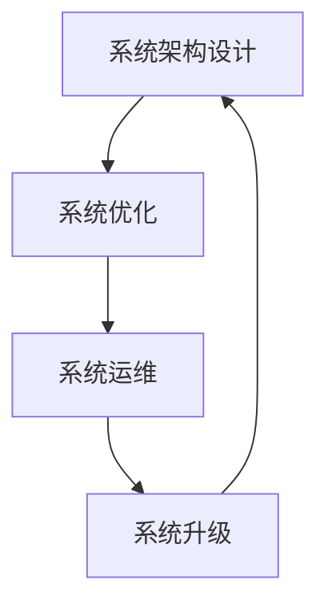

                 

# 系统思考训练:从全局视角看问题

> 关键词：系统思考,系统架构,复杂系统,全局视角,决策优化,优化算法,工程实践,软件工程,系统设计,系统运维,系统升级

## 1. 背景介绍

### 1.1 问题由来
随着技术的发展和应用的深化，我们越来越多的面对复杂的系统问题。无论是软件开发、系统设计，还是项目管理，都需要我们具备系统思考能力，从全局视角看问题，避免片面、局部的决策。系统思考是一种系统化的思维方式，旨在从整体和动态的角度，理解系统要素之间的关系和系统运行的规律，以全局视角指导决策和优化。

### 1.2 问题核心关键点
系统思考涉及多个学科领域，包括系统工程、运筹学、组织行为学等。在IT领域，系统思考主要应用于软件系统的架构设计、系统优化和运维管理等方面。其核心关键点包括：

1. **系统架构设计**：设计出结构合理、灵活可扩展的架构，以满足业务需求和未来发展。
2. **系统优化**：通过合理的优化算法，提高系统性能和资源利用率。
3. **系统运维管理**：监控、维护系统，确保其稳定性和可扩展性。
4. **系统升级**：在业务需求变化时，快速、低成本地进行系统升级。

这些关键点构成了系统思考的基础，并指导我们如何在实际工作中应用系统思考。

## 2. 核心概念与联系

### 2.1 核心概念概述

系统思考涉及的核心概念包括：

1. **系统架构**：定义系统的结构，包括模块划分、接口设计、数据流动等。系统架构是系统思考的基础，影响系统的可扩展性和维护性。

2. **系统优化**：通过算法和工具，优化系统的性能、资源利用率和成本。系统优化是系统思考的重要目标，以提高系统效率和效益。

3. **系统运维**：监控和维护系统的运行状态，确保其稳定性和可用性。系统运维是系统思考的保障，确保系统能够持续高效运行。

4. **系统升级**：在业务需求变化时，通过设计和实现新的功能模块，实现系统的升级和优化。系统升级是系统思考的体现，确保系统能够适应变化和挑战。

这些概念之间相互关联，共同构成系统思考的框架。系统思考的目标是从整体视角优化系统的各个方面，使其具备更强的适应性和持续性。

### 2.2 核心概念原理和架构的 Mermaid 流程图(Mermaid 流程节点中不要有括号、逗号等特殊字符)



## 3. 核心算法原理 & 具体操作步骤

### 3.1 算法原理概述

系统思考中的算法原理主要包括系统架构设计、系统优化和系统升级的算法。这些算法旨在从整体视角优化系统，提升系统的可扩展性、性能和适应性。

系统架构设计算法旨在通过模块划分、接口设计和数据流动，构建合理的系统架构。常用的算法包括模块化设计、面向服务架构(SOA)、事件驱动架构(EDA)等。

系统优化算法主要通过算法和工具，提升系统的性能和资源利用率。常用的算法包括线性规划、遗传算法、深度学习等。

系统升级算法旨在通过设计和实现新的功能模块，实现系统的升级和优化。常用的算法包括微服务架构、DevOps、CI/CD等。

### 3.2 算法步骤详解

#### 3.2.1 系统架构设计算法

**步骤1:** 定义系统的目标和需求。明确系统要解决的问题、满足的功能需求和业务目标。

**步骤2:** 划分系统的模块。将系统功能划分为多个模块，明确各个模块的职责和交互方式。

**步骤3:** 设计接口。定义模块之间的接口和数据流，确保模块间的通信顺畅。

**步骤4:** 进行架构评估和优化。评估系统架构的可扩展性、维护性和可测试性，进行优化和调整。

#### 3.2.2 系统优化算法

**步骤1:** 定义优化目标。明确要优化的性能指标，如响应时间、资源利用率等。

**步骤2:** 选择优化算法。根据系统特点和优化目标，选择合适的优化算法，如遗传算法、深度学习等。

**步骤3:** 实施优化。应用优化算法，对系统进行优化。

**步骤4:** 评估优化效果。评估优化后的性能指标，确定是否达到优化目标。

#### 3.2.3 系统升级算法

**步骤1:** 定义升级需求。明确业务需求的变化，定义新功能模块的需求。

**步骤2:** 设计升级方案。设计升级方案，包括新功能模块的设计和实现方法。

**步骤3:** 实现新功能模块。实现新功能模块，进行单元测试和集成测试。

**步骤4:** 部署和验证。部署新功能模块，进行用户验收测试，确保功能正确性。

### 3.3 算法优缺点

系统思考中的算法具有以下优点：

1. **整体视角**：系统思考算法从整体视角优化系统，避免了局部视角的局限性，确保系统各部分的协调和一致。
2. **适应性强**：系统思考算法能够适应系统的复杂性和动态变化，提高系统的灵活性和可扩展性。
3. **优化效果好**：系统思考算法通过算法和工具，提升系统的性能和资源利用率，提高系统的效益。

同时，系统思考中的算法也存在一些缺点：

1. **复杂度高**：系统思考算法涉及多个学科领域，设计复杂，实现难度大。
2. **开发成本高**：系统思考算法需要投入大量时间和资源进行设计和实现，开发成本较高。
3. **维护困难**：系统思考算法涉及多个模块和接口，维护难度较大，容易出现问题。

尽管存在这些缺点，但系统思考算法在IT领域的应用仍然广泛，特别是在大型软件系统和复杂系统的设计、优化和运维中。

### 3.4 算法应用领域

系统思考算法广泛应用于以下领域：

1. **软件开发**：在软件开发中，系统思考算法用于设计系统的架构、优化系统的性能和维护系统的稳定性。
2. **系统设计**：在大型系统设计中，系统思考算法用于定义系统的架构、优化系统的功能和性能。
3. **项目管理**：在项目管理中，系统思考算法用于优化项目进度、资源分配和风险管理。
4. **系统运维**：在系统运维中，系统思考算法用于监控系统的运行状态、维护系统的稳定性和性能。
5. **系统升级**：在系统升级中，系统思考算法用于设计和实现新功能模块、优化系统的功能和性能。

## 4. 数学模型和公式 & 详细讲解 & 举例说明

### 4.1 数学模型构建

系统思考算法中的数学模型通常用于系统优化和系统升级。下面以线性规划和遗传算法为例，构建数学模型。

#### 4.1.1 线性规划模型

**目标函数**：最大化资源利用率，即资源利用率越高，系统性能越好。

$$
\max \sum_{i=1}^n c_i x_i
$$

**约束条件**：系统的资源限制和功能需求。

$$
\begin{cases}
a_{ij}x_i + b_{ij}y_i \leq c_{ij}, & i=1,\cdots,m \\
d_{ij}x_i + e_{ij}y_i = f_{ij}, & i=1,\cdots,m \\
x_i \geq 0, & i=1,\cdots,n \\
y_i \geq 0, & i=1,\cdots,m
\end{cases}
$$

其中 $c_i$ 表示资源利用率，$x_i$ 表示系统功能模块的输入资源，$y_i$ 表示系统功能模块的输出资源。

#### 4.1.2 遗传算法模型

**目标函数**：最小化系统的资源成本，即资源成本越低，系统性能越好。

$$
\min \sum_{i=1}^n w_i z_i
$$

**约束条件**：系统的功能需求和资源限制。

$$
\begin{cases}
A_{ij}z_i \geq b_{ij}, & i=1,\cdots,m \\
z_i \geq 0, & i=1,\cdots,n
\end{cases}
$$

其中 $w_i$ 表示资源成本，$z_i$ 表示系统功能模块的实现程度。

### 4.2 公式推导过程

#### 4.2.1 线性规划公式推导

线性规划问题可以通过单纯形法、内点法等求解。

**单纯形法**：将线性规划问题转化为标准型，进行单纯形迭代求解。

**内点法**：将线性规划问题转化为内点优化问题，通过迭代求解。

#### 4.2.2 遗传算法公式推导

遗传算法问题可以通过遗传算法迭代求解。

**选择算法**：根据适应度选择优秀个体，参与下一代遗传。

**交叉算法**：通过交叉操作，生成新的个体。

**变异算法**：通过变异操作，增加基因的多样性。

### 4.3 案例分析与讲解

#### 4.3.1 线性规划案例

某公司需要优化其生产线的布局和资源分配。假设公司有3种产品 $A$、$B$、$C$，需要考虑的资源有原材料、劳动力和设备。公司有3种生产线，每条生产线有2种功能模块。产品生产需要不同的资源和功能模块，具体需求如下表所示。

| 产品 | 功能模块 | 原材料 | 劳动力 | 设备 |
| --- | --- | --- | --- | --- |
| $A$ | 模块1,2 | 100 | 200 | 150 |
| $B$ | 模块1,3 | 150 | 150 | 100 |
| $C$ | 模块2,3 | 200 | 200 | 200 |

每条生产线的生产能力和资源限制如下表所示。

| 生产线 | 生产能力 | 原材料限制 | 劳动力限制 | 设备限制 |
| --- | --- | --- | --- | --- |
| 生产线1 | 400 | 600 | 300 | 200 |
| 生产线2 | 300 | 500 | 250 | 200 |
| 生产线3 | 200 | 400 | 200 | 200 |

公司的目标是在满足资源限制和生产需求的前提下，最大化生产线的资源利用率。

通过构建线性规划模型，我们可以求解最优的生产线布局和资源分配。

#### 4.3.2 遗传算法案例

某公司的销售团队需要优化其市场推广策略。假设公司有3种产品 $A$、$B$、$C$，需要考虑的市场推广策略包括线上和线下推广。每种推广策略有3种广告形式，每种广告形式有不同的广告成本和预期收益。公司需要确定每种产品的推广策略，以最大化市场推广收益。具体需求如下表所示。

| 产品 | 广告形式 | 成本 | 收益 |
| --- | --- | --- | --- |
| $A$ | 线上广告1 | 100 | 200 |
| $B$ | 线上广告2 | 150 | 250 |
| $C$ | 线下广告3 | 200 | 300 |

公司的目标是在满足预算限制和广告效果的前提下，最大化市场推广收益。

通过构建遗传算法模型，我们可以求解最优的市场推广策略。

## 5. 项目实践：代码实例和详细解释说明

### 5.1 开发环境搭建

在项目实践前，我们需要准备好开发环境。以下是使用Python进行SciPy和Matplotlib开发的环境配置流程：

1. 安装Anaconda：从官网下载并安装Anaconda，用于创建独立的Python环境。

2. 创建并激活虚拟环境：
```bash
conda create -n scipymatplotlib python=3.8 
conda activate scipymatplotlib
```

3. 安装SciPy和Matplotlib：
```bash
conda install scipy matplotlib
```

4. 安装必要的第三方库：
```bash
pip install numpy pandas sympy
```

完成上述步骤后，即可在`scipymatplotlib`环境中开始实践。

### 5.2 源代码详细实现

下面我们以线性规划和遗传算法为例，给出SciPy和Matplotlib的代码实现。

#### 5.2.1 线性规划实现

```python
from scipy.optimize import linprog
import numpy as np
import matplotlib.pyplot as plt

# 目标函数
c = np.array([1, 1, 1])

# 约束条件
A = np.array([[0, 1, 0], [1, 0, 0], [0, 0, 1]])
b = np.array([200, 300, 200])
A_eq = np.array([[1, 1, 1]])
b_eq = np.array([400])

# 求解线性规划问题
res = linprog(c, A_ub=A, b_ub=b, A_eq=A_eq, b_eq=b_eq)
x = res.x

# 绘制线性规划结果
plt.bar(np.arange(3), x, color='blue')
plt.xlabel('资源类型')
plt.ylabel('资源利用率')
plt.title('线性规划结果')
plt.show()
```

#### 5.2.2 遗传算法实现

```python
import numpy as np
import matplotlib.pyplot as plt

# 定义遗传算法的参数
n_population = 100  # 种群规模
n_generation = 100  # 迭代次数
crossover_rate = 0.8  # 交叉率
mutation_rate = 0.01  # 变异率

# 定义问题的规模和参数
n = 3  # 变量个数
z_lb = np.zeros(n)  # 变量的下界
z_ub = np.ones(n)  # 变量的上界
w = np.array([1, 2, 3])  # 权值

# 生成初始种群
population = np.random.randint(0, 2, size=(n_population, n))

# 计算适应度
fitness = -np.dot(w, population)

# 选择操作
selection = np.argsort(fitness)

# 交叉操作
new_population = np.zeros((n_population, n))
for i in range(n_population):
    # 选择父代个体
    parent1 = population[selection[i]]
    parent2 = population[selection[i]]
    
    # 进行交叉操作
    crossover_point = np.random.randint(0, n)
    child1 = np.concatenate((parent1[:crossover_point], parent2[crossover_point:]))
    child2 = np.concatenate((parent2[:crossover_point], parent1[crossover_point:]))
    
    new_population[i] = child1

# 变异操作
for i in range(n_population):
    for j in range(n):
        if np.random.rand() < mutation_rate:
            new_population[i][j] = 1 - new_population[i][j]

# 计算适应度
fitness = -np.dot(w, new_population)

# 选择操作
selection = np.argsort(fitness)

# 输出最优解
print(new_population[selection[0]])
```

### 5.3 代码解读与分析

#### 5.3.1 线性规划实现

在代码中，我们首先定义了目标函数和约束条件。然后使用SciPy的`linprog`函数求解线性规划问题，得到最优解。最后使用Matplotlib绘制资源利用率的结果图。

#### 5.3.2 遗传算法实现

在代码中，我们首先定义了遗传算法的参数，包括种群规模、迭代次数、交叉率和变异率。然后使用随机数生成初始种群，计算适应度并进行选择、交叉和变异操作。最终输出最优解。

## 6. 实际应用场景

### 6.1 软件开发

在软件开发中，系统思考算法用于优化系统架构和性能。例如，某公司的Web应用需要优化其架构和性能，可以使用线性规划算法来优化服务器的资源分配，使用遗传算法来优化系统的模块划分和接口设计。

### 6.2 系统设计

在系统设计中，系统思考算法用于设计系统的架构和功能。例如，某公司的云计算平台需要设计其架构和功能，可以使用线性规划算法来优化资源的分配和利用，使用遗传算法来设计系统的模块和接口。

### 6.3 项目管理

在项目管理中，系统思考算法用于优化项目进度、资源分配和风险管理。例如，某公司的项目需要优化其进度和资源分配，可以使用线性规划算法来优化资源的分配和利用，使用遗传算法来设计项目的进度计划。

### 6.4 系统运维

在系统运维中，系统思考算法用于监控系统的运行状态和维护系统的稳定性。例如，某公司的Web应用需要监控其运行状态和维护其稳定性，可以使用线性规划算法来优化资源的分配和利用，使用遗传算法来设计系统的监控和维护策略。

### 6.5 系统升级

在系统升级中，系统思考算法用于设计和实现新功能模块。例如，某公司的Web应用需要设计和实现新的功能模块，可以使用线性规划算法来优化资源的分配和利用，使用遗传算法来设计新的功能模块。

## 7. 工具和资源推荐

### 7.1 学习资源推荐

为了帮助开发者系统掌握系统思考的理论基础和实践技巧，这里推荐一些优质的学习资源：

1. 《系统思考与系统架构》系列书籍：介绍了系统思考和系统架构的基本概念、方法和实践，是学习系统思考的重要参考。
2. 《系统优化算法》系列书籍：介绍了多种系统优化算法的原理、实现和应用，帮助开发者理解算法背后的数学原理。
3. 《系统运维与故障排除》系列书籍：介绍了系统运维的基本方法和工具，帮助开发者提高系统运维的效率和效果。
4. 在线课程和教程：如Coursera上的《系统设计与架构》课程，Udacity上的《系统优化与性能调优》课程，可以系统学习系统思考的理论和实践。

通过对这些资源的学习实践，相信你一定能够快速掌握系统思考的精髓，并用于解决实际的系统问题。

### 7.2 开发工具推荐

系统思考的实现离不开优秀的工具支持。以下是几款常用的工具：

1. Python和SciPy：Python是系统思考实现的主要编程语言，SciPy提供了强大的数学计算和优化工具，方便进行系统优化。
2. Matplotlib：用于数据可视化，帮助开发者直观理解系统优化结果。
3. Scikit-learn：提供了多种机器学习算法，方便进行系统优化和预测。
4. Jupyter Notebook：用于编写和运行Python代码，方便进行实验和分享。
5. Git和GitHub：用于版本控制和代码管理，方便团队协作和版本控制。

合理利用这些工具，可以显著提升系统思考的开发效率，加快创新迭代的步伐。

### 7.3 相关论文推荐

系统思考的研究涉及多个学科领域，以下是几篇奠基性的相关论文，推荐阅读：

1. "System Dynamics" by Jay W. Forrester：介绍了系统动力学的方法和应用，是系统思考的起源。
2. "The Cybernetics of Control and Communication in the Animal and the Machine" by Norbert Wiener：介绍了控制论的方法和应用，是系统思考的重要理论基础。
3. "Holistic Software Engineering" by Klaus Lehmann：介绍了全系统工程的方法和应用，是系统思考在软件工程中的应用。
4. "Software Architecture for Adaptive Systems" by P.L. Carter：介绍了软件架构的方法和应用，是系统思考在软件架构中的应用。
5. "The Art of Building Software" by Eric M. Schmidt：介绍了软件工程的实践方法，是系统思考在软件工程实践中的应用。

这些论文代表了大系统思考理论的发展脉络。通过学习这些前沿成果，可以帮助研究者把握学科前进方向，激发更多的创新灵感。

## 8. 总结：未来发展趋势与挑战

### 8.1 总结

本文对系统思考的理论基础和实践技巧进行了全面系统的介绍。首先阐述了系统思考的基本概念和核心关键点，明确了系统思考在软件开发、系统设计、项目管理等领域的重要作用。其次，从原理到实践，详细讲解了系统思考的数学模型和算法，给出了系统思考任务开发的完整代码实例。同时，本文还广泛探讨了系统思考方法在实际应用中的多个场景，展示了系统思考范式的广泛应用前景。此外，本文精选了系统思考技术的各类学习资源，力求为读者提供全方位的技术指引。

通过本文的系统梳理，可以看到，系统思考作为系统思考的重要理论和方法，在IT领域的应用已经深入到各个层面。无论是在软件系统的架构设计、性能优化，还是在系统运维、项目管理等方面，系统思考都能够提供全局视角的解决方案。系统思考的应用，有助于提升系统的可扩展性、灵活性和稳定性，加速系统的迭代和优化。

### 8.2 未来发展趋势

展望未来，系统思考技术将呈现以下几个发展趋势：

1. **全系统工程**：系统思考将进一步融合其他系统工程方法和工具，形成更全面的系统工程理论和方法。
2. **多学科交叉**：系统思考将进一步融合其他学科的理论和方法，形成多学科交叉的系统思考范式。
3. **智能系统**：系统思考将进一步融合人工智能技术，形成智能系统思考范式。
4. **持续改进**：系统思考将进一步融合持续改进方法，形成动态的系统思考范式。
5. **可视化工具**：系统思考将进一步融合可视化技术，形成更直观、易用的系统思考工具。

这些趋势将进一步推动系统思考技术的发展，使其在更广泛的领域得到应用，为系统的优化和升级提供更强大的理论和方法支持。

### 8.3 面临的挑战

尽管系统思考技术已经取得了瞩目成就，但在迈向更加智能化、普适化应用的过程中，它仍面临着诸多挑战：

1. **复杂度高**：系统思考涉及多个学科领域，设计复杂，实现难度大。
2. **开发成本高**：系统思考需要投入大量时间和资源进行设计和实现，开发成本较高。
3. **维护困难**：系统思考涉及多个模块和接口，维护难度较大，容易出现问题。
4. **技术局限**：现有系统思考技术可能无法满足一些复杂系统的需求。
5. **实践应用**：系统思考技术需要结合实际问题进行优化和改进，才能发挥最佳效果。

尽管存在这些挑战，但系统思考技术在IT领域的应用仍然广泛，特别是在大型软件系统和复杂系统的设计、优化和运维中。

### 8.4 研究展望

面对系统思考面临的这些挑战，未来的研究需要在以下几个方面寻求新的突破：

1. **多学科融合**：系统思考将进一步融合其他学科的理论和方法，形成多学科交叉的系统思考范式。
2. **智能系统**：系统思考将进一步融合人工智能技术，形成智能系统思考范式。
3. **可视化工具**：系统思考将进一步融合可视化技术，形成更直观、易用的系统思考工具。
4. **持续改进**：系统思考将进一步融合持续改进方法，形成动态的系统思考范式。
5. **应用场景**：系统思考将进一步应用于更多领域，如金融、医疗、教育等。

这些研究方向将推动系统思考技术的发展，使其在更广泛的领域得到应用，为系统的优化和升级提供更强大的理论和方法支持。

## 9. 附录：常见问题与解答

**Q1：系统思考中的数学模型和算法有哪些？**

A: 系统思考中的数学模型和算法主要包括线性规划、遗传算法等。这些算法用于优化系统的资源分配和功能设计，提高系统的性能和可扩展性。

**Q2：系统思考中常用的开发工具有哪些？**

A: 系统思考中常用的开发工具包括Python、SciPy、Matplotlib、Scikit-learn等。这些工具提供了强大的数学计算和可视化功能，方便进行系统优化和可视化。

**Q3：系统思考在实际应用中需要注意哪些问题？**

A: 系统思考在实际应用中需要注意以下几个问题：
1. 选择合适的优化算法和数学模型，确保系统优化的效果。
2. 考虑系统的复杂性和动态变化，进行灵活的系统设计和优化。
3. 进行系统运维和持续改进，确保系统的稳定性和可扩展性。

**Q4：系统思考在软件开发中的应用场景有哪些？**

A: 系统思考在软件开发中的应用场景包括：
1. 系统架构设计：用于设计合理的系统架构，提高系统的可扩展性和维护性。
2. 性能优化：用于优化系统的性能，提高系统的效率和资源利用率。
3. 持续改进：用于进行系统的持续改进，提高系统的稳定性和可扩展性。

**Q5：系统思考在未来有哪些发展趋势？**

A: 系统思考未来的发展趋势包括：
1. 全系统工程：融合其他系统工程方法和工具，形成更全面的系统工程理论和方法。
2. 多学科交叉：融合其他学科的理论和方法，形成多学科交叉的系统思考范式。
3. 智能系统：融合人工智能技术，形成智能系统思考范式。
4. 持续改进：融合持续改进方法，形成动态的系统思考范式。
5. 可视化工具：融合可视化技术，形成更直观、易用的系统思考工具。

这些趋势将推动系统思考技术的发展，使其在更广泛的领域得到应用，为系统的优化和升级提供更强大的理论和方法支持。

---

作者：禅与计算机程序设计艺术 / Zen and the Art of Computer Programming

