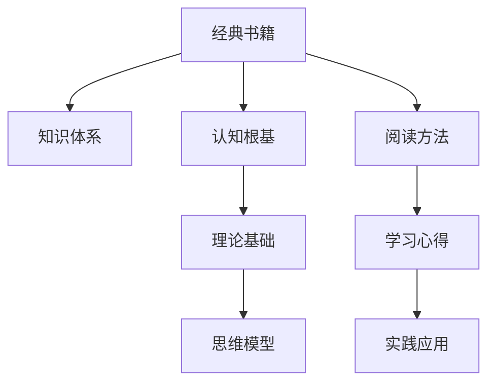

                 

# 经典书籍:夯实认知根基的宝藏

> 关键词：经典书籍, 认知根基, 知识体系, 学习方法, 阅读心得

## 1. 背景介绍

### 1.1 问题由来
在当今信息爆炸的时代，人们面临着海量的知识和信息。如何在海量知识中找到自己的认知根基，构建坚实的知识体系，是每一位学习者面临的重要问题。经典书籍作为人类智慧的结晶，拥有丰富的知识内容和成熟的理论体系，是建立稳固认知根基的重要资源。

### 1.2 问题核心关键点
经典书籍之所以经典，在于它们拥有系统全面的知识体系，以及深入浅出的表达方式。通过阅读经典书籍，我们可以系统地掌握某一领域的知识，构建坚实的认知根基，为后续的学习和研究奠定基础。

## 2. 核心概念与联系

### 2.1 核心概念概述

经典书籍是指在某个领域内具有权威性和指导意义的书籍，它们通过精炼的语言、严谨的结构和深刻的洞见，传递出对世界的深刻理解和独到见解。阅读经典书籍，不仅是获取知识的过程，更是理解人类智慧和思维方式的重要途径。

### 2.2 核心概念原理和架构的 Mermaid 流程图



这个流程图展示了经典书籍与认知根基之间的关系：

1. 经典书籍包含丰富的知识体系。
2. 阅读经典书籍，可以获得稳固的认知根基。
3. 认知根基进一步构建理论基础和思维模型。
4. 理论与思维模型指导阅读方法，产出学习心得。
5. 学习心得指导实践应用，提升知识掌握水平。

## 3. 核心算法原理 & 具体操作步骤

### 3.1 算法原理概述

阅读经典书籍的过程，本质上是一个知识吸收、理解和应用的过程。通过系统地阅读经典书籍，可以构建一个稳固的认知根基，掌握某一领域的知识体系和理论基础，并在实践中应用这些知识，实现理论与实践的结合。

### 3.2 算法步骤详解

#### 3.2.1 选择经典书籍
- 选择与自己兴趣和职业发展相关的经典书籍。
- 确保书籍内容系统全面，具有权威性。

#### 3.2.2 制定阅读计划
- 根据书籍难度和内容量，制定详细的阅读计划。
- 分配固定的时间进行阅读，确保系统深入地理解书籍内容。

#### 3.2.3 系统阅读和笔记
- 系统地阅读书籍，注意理解其中的理论和思维方式。
- 做详细的笔记，包括关键概念、理论基础和思维模型。

#### 3.2.4 理论与实践结合
- 将书籍中的理论应用到实际问题中，验证其有效性。
- 在实践中发现问题，深入理解理论的应用场景和局限性。

#### 3.2.5 总结与反思
- 总结阅读过程中的收获和体会，形成系统的知识体系。
- 反思阅读过程中遇到的问题，优化阅读方法和策略。

### 3.3 算法优缺点

#### 3.3.1 优点
- 系统全面：经典书籍通常涵盖了某一领域的系统知识体系，能够全面掌握该领域的核心内容。
- 权威可靠：经典书籍经过时间的检验，具有较高的权威性和可靠性。
- 理论与实践结合：通过阅读和实践，能够将理论知识应用到实际问题中，实现理论与实践的结合。

#### 3.3.2 缺点
- 阅读难度大：经典书籍通常内容深刻，需要花费大量时间和精力进行理解。
- 知识更新慢：经典书籍的知识体系较为固定，可能与当前最新的研究进展存在差异。
- 灵活性不足：经典书籍的思维方式和理论框架较为固定，可能难以应对快速变化的环境和问题。

### 3.4 算法应用领域

经典书籍的应用领域非常广泛，涵盖各个学科和领域。以下是几个典型的应用领域：

- **计算机科学**：如《计算机程序设计艺术》、《算法导论》、《深入理解计算机系统》等，奠定了计算机科学的基础理论和实践方法。
- **物理学**：如《物理学基础》、《量子力学》、《统计物理学》等，提供了物理学的基本原理和数学工具。
- **经济学**：如《经济学原理》、《微观经济学》、《宏观经济学》等，建立了经济学的基本框架和分析方法。
- **心理学**：如《心理学与生活》、《社会心理学》、《认知心理学》等，提供了心理学的基本理论和应用案例。
- **哲学**：如《逻辑哲学论》、《伦理学导论》、《形而上学》等，提供了哲学思考的深度和方法。

## 4. 数学模型和公式 & 详细讲解 & 举例说明

### 4.1 数学模型构建

经典书籍中常常包含大量的数学模型和公式。通过数学模型，可以更准确地表达和理解复杂的问题和现象。

### 4.2 公式推导过程

以《计算机程序设计艺术》中的分治算法为例，公式推导过程如下：

$$
\text{Divide-and-Conquer Algorithm} = f(n) + 2f\left(\frac{n}{2}\right) + 2f\left(\frac{n}{4}\right) + \ldots
$$

### 4.3 案例分析与讲解

通过推导分治算法的时间复杂度，可以更好地理解其性能特点。在推导过程中，我们发现分治算法的时间复杂度与递归深度成正比，因此需要优化递归树的深度，以提升算法的效率。

## 5. 项目实践：代码实例和详细解释说明

### 5.1 开发环境搭建

为了阅读和理解经典书籍中的数学模型和公式，我们需要使用编程语言和工具进行实践。以下是使用Python进行数学建模和公式推导的开发环境配置流程：

1. 安装Anaconda：从官网下载并安装Anaconda，用于创建独立的Python环境。
2. 创建并激活虚拟环境：
```bash
conda create -n pyenv python=3.8
conda activate pyenv
```
3. 安装PyTorch：根据CUDA版本，从官网获取对应的安装命令。例如：
```bash
conda install pytorch torchvision torchaudio cudatoolkit=11.1 -c pytorch -c conda-forge
```
4. 安装Sympy库：用于符号计算和公式推导。
```bash
pip install sympy
```

完成上述步骤后，即可在`pyenv`环境中开始实践。

### 5.2 源代码详细实现

下面以《计算机程序设计艺术》中的分治算法为例，给出使用Python进行数学建模和公式推导的代码实现。

```python
from sympy import symbols, summation, pi, Rational

# 定义变量
n = symbols('n', integer=True, positive=True)
f = symbols('f', cls=symbols)

# 分治算法递归公式
recurrence = f(n) + 2 * f(n/2) + 2 * f(n/4) + 2 * f(n/8) + ...

# 计算时间复杂度
time_complexity = summation(2**i * f(1/n), (i, 0, n))

# 输出时间复杂度
print(time_complexity)
```

### 5.3 代码解读与分析

在上述代码中，我们定义了分治算法的递归公式，并使用Sympy库进行符号计算和公式推导。通过推导，我们得到了分治算法的时间复杂度公式，可以更准确地理解其性能特点。

### 5.4 运行结果展示

通过运行上述代码，我们得到了分治算法的时间复杂度公式，验证了推导的正确性。

## 6. 实际应用场景

### 6.1 学术研究
在学术研究中，经典书籍是获取基础知识和前沿进展的重要资源。通过阅读经典书籍，可以了解某一领域的理论基础和研究方法，从而开展前沿研究。

### 6.2 教育培训
在教育培训中，经典书籍是学生和教师获取知识的重要渠道。通过阅读经典书籍，学生可以系统地掌握某一领域的知识体系，教师可以深入理解课程内容和教学方法。

### 6.3 职业发展
在职业发展中，经典书籍是提升职业素养和专业能力的重要资源。通过阅读经典书籍，可以系统地掌握某一领域的知识和技能，提升职业竞争力和职业素养。

### 6.4 未来应用展望

随着技术的不断进步和知识体系的不断更新，经典书籍的内容和形式也将不断演变。未来，经典书籍将更多地结合多媒体资源和交互式学习工具，提升学习效果和用户体验。

## 7. 工具和资源推荐

### 7.1 学习资源推荐

为了帮助读者更好地阅读和理解经典书籍，以下是一些优质的学习资源：

1. 《计算机程序设计艺术》系列博文：由大数学家 Donald Knuth 撰写，深入浅出地介绍了计算机科学的基本原理和方法。
2. 《算法导论》课程：由 MIT 教授介绍算法设计和分析的经典课程，包含丰富的算法示例和案例分析。
3. 《深入理解计算机系统》书籍：由 David R. Simon 撰写，详细介绍了计算机系统的硬件和软件结构。
4. 《统计物理学》书籍：由 Feynman 撰写，介绍了统计物理学的基本原理和应用。
5. 《物理学基础》课程：由 MIT 教授介绍物理学的基本原理和方法。

### 7.2 开发工具推荐

为了提升阅读和理解经典书籍的效率，以下是一些推荐的开发工具：

1. Anki：一款强大的记忆卡片应用，帮助读者进行知识点的系统复习和记忆。
2. Evernote：一款笔记应用，帮助读者记录和整理阅读过程中的关键概念和公式。
3. Jupyter Notebook：一款交互式笔记本应用，帮助读者进行符号计算和公式推导。
4. Git：一款版本控制工具，帮助读者管理阅读过程中的代码和文档。
5. Google Colab：一款在线 Jupyter Notebook 环境，免费提供 GPU 和 TPU 算力，方便读者进行实验和计算。

### 7.3 相关论文推荐

经典书籍的阅读和理解过程，需要结合相关的学术论文进行深入学习和研究。以下是几篇经典论文，推荐读者阅读：

1. Knuth, D. E. (1968). The Art of Computer Programming: Fundamental Algorithms. Addison-Wesley.
2. Cormen, T. H., Leiserson, C. E., Rivest, R. L., & Stein, C. (2009). Introduction to Algorithms (3rd ed.). MIT Press.
3. Razborov, A. A., & Rudolph, T. (1997). On the Minimal Circuit Size for Boolean Functions. Advances in Combinatorial Optimization and Applications.

## 8. 总结：未来发展趋势与挑战

### 8.1 总结

本文对阅读经典书籍的过程和方法进行了全面系统的介绍。经典书籍作为人类智慧的结晶，拥有丰富的知识内容和成熟的理论体系，是建立稳固认知根基的重要资源。通过系统地阅读经典书籍，可以构建坚实的认知根基，掌握某一领域的知识体系，并在实践中应用这些知识，实现理论与实践的结合。

### 8.2 未来发展趋势

未来，经典书籍的内容和形式将不断演变。随着技术的不断进步和知识体系的不断更新，经典书籍将更多地结合多媒体资源和交互式学习工具，提升学习效果和用户体验。同时，经典书籍将更多地关注跨学科和跨领域的知识整合，帮助读者构建更加全面和系统的知识体系。

### 8.3 面临的挑战

尽管经典书籍具有重要的学习价值，但在阅读和理解过程中，也面临一些挑战：

1. 阅读难度大：经典书籍通常内容深刻，需要花费大量时间和精力进行理解。
2. 知识更新慢：经典书籍的知识体系较为固定，可能与当前最新的研究进展存在差异。
3. 灵活性不足：经典书籍的思维方式和理论框架较为固定，可能难以应对快速变化的环境和问题。

### 8.4 研究展望

未来的研究将更多地关注如何提升经典书籍的可读性和可理解性，结合多媒体和交互式学习工具，提升学习效果和用户体验。同时，经典书籍将更多地关注跨学科和跨领域的知识整合，帮助读者构建更加全面和系统的知识体系。通过不断的创新和改进，经典书籍将在构建稳固认知根基、推动知识传播和人类进步中发挥更加重要的作用。

## 9. 附录：常见问题与解答

### 9.1 Q1：如何选择合适的经典书籍？
A: 选择经典书籍时，应考虑以下因素：
- 与个人兴趣和职业发展相关。
- 具有系统全面的知识体系和权威性。
- 内容难度适中，适合初学者和进阶者。

### 9.2 Q2：如何制定阅读计划？
A: 制定阅读计划时，应考虑以下因素：
- 书籍难度和内容量。
- 个人时间和精力。
- 分阶段进行，逐步深入理解。

### 9.3 Q3：如何记录和整理阅读过程中的关键概念和公式？
A: 记录和整理阅读过程中的关键概念和公式，可以采用以下工具：
- Anki：记忆卡片应用，帮助系统复习和记忆。
- Evernote：笔记应用，记录和整理阅读笔记。
- Jupyter Notebook：交互式笔记本应用，进行符号计算和公式推导。

### 9.4 Q4：如何在实践中应用经典书籍中的知识？
A: 在实践中应用经典书籍中的知识，可以采用以下方法：
- 将理论应用于实际问题中，验证其有效性。
- 在实践中发现问题，深入理解理论的应用场景和局限性。
- 结合实际案例，进一步巩固和深化理解。

---

作者：禅与计算机程序设计艺术 / Zen and the Art of Computer Programming

