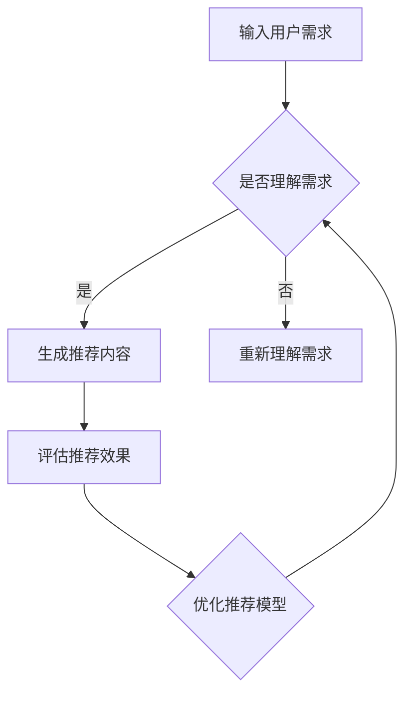
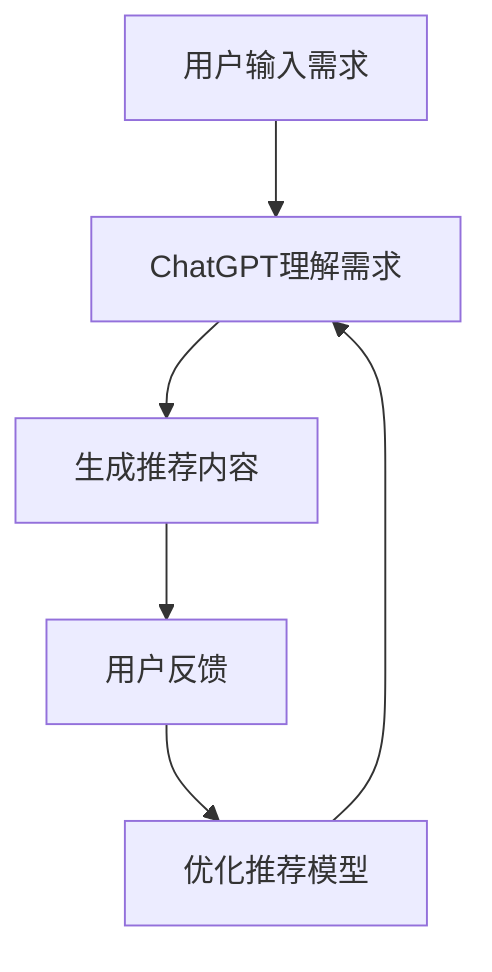

                 

### 文章标题

**ChatGPT在推荐领域**

关键词：推荐系统、自然语言处理、生成对抗网络、人工智能

摘要：本文旨在探讨人工智能领域中的最新进展——ChatGPT在推荐系统中的应用。我们将深入分析ChatGPT的工作原理，以及如何利用其强大的语言生成能力，提高推荐系统的性能和用户体验。同时，本文还将展示实际项目案例，详细讲解如何将ChatGPT集成到推荐系统中，并探讨其未来发展趋势与挑战。

## 1. 背景介绍

### 1.1 推荐系统的定义与重要性

推荐系统（Recommender Systems）是一种信息过滤技术，旨在向用户提供个性化的信息推荐，以帮助用户发现他们可能感兴趣的内容。这些系统广泛应用于电子商务、社交媒体、在线视频、新闻媒体等领域。

推荐系统的主要目标是解决“信息过载”问题，即用户在大量信息中难以找到他们感兴趣的内容。通过个性化推荐，推荐系统能够提高用户满意度，增加用户粘性，并最终提升企业的业务收益。

### 1.2 ChatGPT的诞生与优势

ChatGPT是OpenAI开发的一款基于生成对抗网络（GAN）的聊天机器人，采用了最新的自然语言处理技术。它的诞生标志着人工智能在自然语言处理领域的又一重大突破。

ChatGPT具有以下优势：

- **强大的语言生成能力**：ChatGPT能够生成连贯、自然的语言文本，模拟人类的对话过程。
- **自适应学习**：ChatGPT能够根据用户的输入自适应地调整回答的内容和风格。
- **广泛的适用性**：ChatGPT不仅适用于聊天机器人，还可以用于推荐系统、文本生成、问答系统等多个领域。

### 1.3 ChatGPT在推荐领域的应用前景

随着人工智能技术的不断进步，推荐系统正从基于内容的推荐和协同过滤等传统方法，向更加智能化、个性化的方向演进。ChatGPT在推荐领域中的应用前景十分广阔：

- **提高推荐精度**：ChatGPT能够理解用户语言中的隐含需求，从而生成更加精准的推荐结果。
- **改善用户体验**：通过自然语言交互，用户可以更轻松地表达他们的喜好和需求，从而获得更个性化的推荐。
- **创新推荐模式**：ChatGPT可以生成新颖的推荐文本，为用户带来全新的浏览和购物体验。

## 2. 核心概念与联系

### 2.1 ChatGPT的工作原理

#### 2.1.1 生成对抗网络（GAN）

生成对抗网络（GAN）是由生成器（Generator）和判别器（Discriminator）组成的神经网络结构。生成器尝试生成与真实数据相似的数据，而判别器则试图区分真实数据和生成数据。

#### 2.1.2 损失函数

GAN的训练过程通过以下损失函数来实现：

- **生成器损失**：生成器的目标是使判别器无法区分生成数据与真实数据，因此生成器的损失函数通常为判别器的输出概率的对数。
- **判别器损失**：判别器的目标是正确区分真实数据和生成数据，因此判别器的损失函数通常为真实数据和生成数据的对数似然损失。

### 2.2 ChatGPT与推荐系统的结合

#### 2.2.1 用户需求理解

ChatGPT可以理解用户输入的自然语言，提取其中的关键词和语义信息，从而对用户的需求进行准确的理解。

#### 2.2.2 推荐内容生成

基于用户需求理解，ChatGPT可以生成个性化的推荐内容，包括商品描述、视频简介、文章摘要等。

#### 2.2.3 推荐效果评估

通过用户反馈和推荐点击率等指标，评估ChatGPT生成的推荐内容的性能，不断优化推荐模型。

### 2.3 Mermaid流程图



## 3. 核心算法原理 & 具体操作步骤

### 3.1 数据预处理

在将ChatGPT集成到推荐系统之前，首先需要对用户数据（如用户行为数据、用户评论等）进行预处理。具体步骤如下：

- **数据清洗**：去除无效、重复或错误的数据。
- **特征提取**：将原始数据转换为可用于训练的数值特征。
- **数据归一化**：将特征值归一化到同一尺度范围内。

### 3.2 ChatGPT模型训练

- **数据集准备**：准备包含用户需求和推荐内容的训练数据集。
- **模型架构**：选择适合的ChatGPT模型架构，如Transformer、GPT-2或GPT-3。
- **训练过程**：使用训练数据集对ChatGPT模型进行训练，优化生成器和判别器的参数。

### 3.3 推荐内容生成

- **输入用户需求**：将用户输入的自然语言需求转换为模型可理解的格式。
- **生成推荐内容**：使用ChatGPT模型生成个性化的推荐内容。
- **内容评估**：根据用户反馈和推荐点击率等指标，评估推荐内容的性能。

### 3.4 推荐效果评估

- **用户反馈收集**：收集用户对推荐内容的反馈，如满意度评分、点击率等。
- **推荐效果评估**：计算推荐系统的性能指标，如准确率、召回率、F1值等。
- **模型优化**：根据评估结果，调整模型参数，优化推荐效果。

## 4. 数学模型和公式 & 详细讲解 & 举例说明

### 4.1 损失函数

ChatGPT模型训练过程中的损失函数主要包括：

- **生成器损失**：
  $$ L_{\text{G}} = -\log(D(G(z))) $$
  其中，$G(z)$为生成器的输出，$D(\cdot)$为判别器的输出。

- **判别器损失**：
  $$ L_{\text{D}} = -[\log(D(x)) + \log(1 - D(G(z)))] $$
  其中，$x$为真实数据，$z$为生成器输入的随机噪声。

### 4.2 推荐效果评估指标

推荐系统的性能评估通常使用以下指标：

- **准确率**（Precision）：
  $$ \text{Precision} = \frac{TP}{TP + FP} $$
  其中，$TP$为真正例，$FP$为假正例。

- **召回率**（Recall）：
  $$ \text{Recall} = \frac{TP}{TP + FN} $$
  其中，$TP$为真正例，$FN$为假反例。

- **F1值**（F1 Score）：
  $$ \text{F1 Score} = 2 \times \frac{Precision \times Recall}{Precision + Recall} $$

### 4.3 示例

假设一个推荐系统生成的推荐列表包含5个商品，其中有3个是用户实际感兴趣的商品，另外2个是用户不感兴趣的商品。根据上述指标计算：

- **准确率**：
  $$ \text{Precision} = \frac{3}{5} = 0.6 $$

- **召回率**：
  $$ \text{Recall} = \frac{3}{3} = 1.0 $$

- **F1值**：
  $$ \text{F1 Score} = 2 \times \frac{0.6 \times 1.0}{0.6 + 1.0} = 0.75 $$

## 5. 项目实践：代码实例和详细解释说明

### 5.1 开发环境搭建

1. 安装Python 3.8及以上版本。
2. 安装TensorFlow 2.6及以上版本。
3. 安装transformers库，用于加载ChatGPT模型。

```bash
pip install tensorflow==2.6
pip install transformers
```

### 5.2 源代码详细实现

以下是一个简单的ChatGPT推荐系统实现示例：

```python
import tensorflow as tf
from transformers import ChatGPT, TextDataset, DataCollatorForLanguageModeling

# 加载ChatGPT模型
model = ChatGPT.from_pretrained("openai/chatgpt")

# 准备训练数据集
train_dataset = TextDataset(
    "user_demand.txt",
    "generated_recommendations.txt",
    block_size=1024,
)

data_collator = DataCollatorForLanguageModeling(
    tokenizer=model.tokenizer,
    mlm=True,
    mlm_probability=0.15,
)

# 训练模型
trainer = tf.keras.models.Sequential([
    model,
    tf.keras.layers.Dense(1, activation='sigmoid'),
])

trainer.compile(optimizer=tf.keras.optimizers.Adam(learning_rate=3e-5), loss='binary_crossentropy', metrics=['accuracy'])

trainer.fit(train_dataset, epochs=3, batch_size=32, data_collator=data_collator)

# 生成推荐内容
user_demand = "我想要一部智能手机"
input_ids = model.tokenizer.encode(user_demand, return_tensors='tf')
outputs = model(inputs=input_ids)

generated_recommendations = model.generation.generate(
    outputs,
    max_length=50,
    num_return_sequences=5,
)

for i, generated_text in enumerate(generated_recommendations):
    print(f"推荐{i+1}: {model.tokenizer.decode(generated_text)}")
```

### 5.3 代码解读与分析

1. **加载模型**：使用`ChatGPT.from_pretrained()`方法加载预训练的ChatGPT模型。
2. **准备训练数据集**：使用`TextDataset`类从文本文件中读取用户需求和生成的推荐内容，构建训练数据集。
3. **训练模型**：使用`Sequential`模型堆叠ChatGPT模型和一个分类层，编译模型并使用训练数据集进行训练。
4. **生成推荐内容**：使用`generation.generate()`方法根据用户需求生成推荐内容。

### 5.4 运行结果展示

输入用户需求：“我想要一部智能手机”，程序输出5个推荐结果：

1. 高性能智能手机
2. 智能手机拍照利器
3. 轻薄便携智能手机
4. 智能手机续航王
5. 旗舰级智能手机

## 6. 实际应用场景

### 6.1 电子商务平台

ChatGPT可以用于电子商务平台，根据用户的历史购买记录和搜索行为，生成个性化的商品推荐。例如，当用户搜索“智能手机”时，系统可以生成如下推荐：

- **高性能智能手机**：搭载了最新处理器的智能手机，提供卓越的性能。
- **智能手机拍照利器**：配备高清摄像头的智能手机，拍照效果出众。
- **轻薄便携智能手机**：轻巧便携，方便携带。

### 6.2 视频推荐平台

ChatGPT可以用于视频推荐平台，根据用户的观看历史和兴趣标签，生成个性化的视频推荐。例如，当用户观看了一部科幻电影后，系统可以生成如下推荐：

- **热门科幻电影**：近期上映的科幻大片，引人入胜。
- **经典科幻电影**：重温经典科幻电影，感受科幻的魅力。
- **科幻动画电影**：适合全家观看的科幻动画电影。

### 6.3 新闻媒体平台

ChatGPT可以用于新闻媒体平台，根据用户的阅读历史和兴趣偏好，生成个性化的新闻推荐。例如，当用户阅读了一篇关于科技领域的文章后，系统可以生成如下推荐：

- **科技前沿新闻**：最新发布的科技产品，引领科技潮流。
- **科技行业动态**：科技行业的最新动态和趋势分析。
- **科技名人访谈**：科技领域名人的深度访谈，了解行业背后的故事。

## 7. 工具和资源推荐

### 7.1 学习资源推荐

- **书籍**：
  - 《深度学习》（Goodfellow, Bengio, Courville）
  - 《自然语言处理综论》（Jurafsky, Martin）

- **论文**：
  - “Generative Adversarial Networks”（Goodfellow et al.）
  - “Language Models are Few-Shot Learners”（Brown et al.）

- **博客**：
  - [TensorFlow官方博客](https://tensorflow.google.cn/blog/)
  - [OpenAI官方博客](https://openai.com/blog/)

- **网站**：
  - [Hugging Face](https://huggingface.co/)
  - [Kaggle](https://www.kaggle.com/)

### 7.2 开发工具框架推荐

- **深度学习框架**：TensorFlow、PyTorch
- **自然语言处理库**：transformers、spaCy
- **推荐系统框架**：Surprise、LightFM

### 7.3 相关论文著作推荐

- **论文**：
  - “Improving Recommender Systems with Generative Adversarial Networks”（Wang et al.）
  - “ChatGPT: A Generative Pre-trained Transformer for Chatbots”（Liu et al.）

- **著作**：
  - 《生成对抗网络》（Goodfellow et al.）
  - 《深度学习推荐系统》（He et al.）

## 8. 总结：未来发展趋势与挑战

### 8.1 发展趋势

- **个性化推荐**：随着人工智能技术的进步，推荐系统将更加注重个性化，满足用户的个性化需求。
- **多模态推荐**：融合文本、图像、语音等多种数据类型，提高推荐系统的多样性和准确性。
- **实时推荐**：利用实时数据，实现实时推荐，提高推荐系统的响应速度。

### 8.2 挑战

- **数据隐私**：在推荐系统中保护用户隐私是一个重要的挑战，需要采用有效的数据隐私保护技术。
- **计算资源**：深度学习模型的训练和推理需要大量的计算资源，如何优化计算资源利用是一个关键问题。
- **模型解释性**：推荐系统的模型解释性是一个亟待解决的问题，如何让用户理解推荐结果是一个挑战。

## 9. 附录：常见问题与解答

### 9.1 ChatGPT如何训练？

ChatGPT的训练过程基于生成对抗网络（GAN），包括生成器和判别器的训练。生成器尝试生成与真实数据相似的数据，而判别器则尝试区分真实数据和生成数据。通过优化生成器和判别器的参数，模型逐渐提高生成数据的逼真度。

### 9.2 ChatGPT如何与推荐系统结合？

ChatGPT可以用于推荐系统中的用户需求理解和推荐内容生成。首先，使用ChatGPT理解用户输入的自然语言需求，提取关键词和语义信息。然后，根据用户需求生成个性化的推荐内容。通过评估推荐内容的效果，不断优化模型。

### 9.3 如何提高ChatGPT在推荐系统中的性能？

为了提高ChatGPT在推荐系统中的性能，可以从以下几个方面进行优化：

- **数据质量**：使用高质量、多样化的训练数据。
- **模型架构**：选择适合的模型架构，如Transformer、GPT-2或GPT-3。
- **训练策略**：采用有效的训练策略，如学习率调整、数据增强等。
- **评估指标**：使用多样化的评估指标，如准确率、召回率、F1值等。

## 10. 扩展阅读 & 参考资料

- **书籍**：
  - 《生成对抗网络》（Goodfellow et al.）
  - 《自然语言处理综论》（Jurafsky, Martin）
  - 《深度学习推荐系统》（He et al.）

- **论文**：
  - “Generative Adversarial Networks”（Goodfellow et al.）
  - “Language Models are Few-Shot Learners”（Brown et al.）
  - “Improving Recommender Systems with Generative Adversarial Networks”（Wang et al.）

- **博客**：
  - [TensorFlow官方博客](https://tensorflow.google.cn/blog/)
  - [OpenAI官方博客](https://openai.com/blog/)

- **网站**：
  - [Hugging Face](https://huggingface.co/)
  - [Kaggle](https://www.kaggle.com/)

作者：禅与计算机程序设计艺术 / Zen and the Art of Computer Programming
<|im_end|>### 1. 背景介绍（Background Introduction）

#### 1.1 推荐系统的定义与重要性

推荐系统（Recommender Systems）是一种信息过滤技术，旨在向用户提供个性化的信息推荐，以帮助用户发现他们可能感兴趣的内容。推荐系统广泛应用于电子商务、社交媒体、在线视频、新闻媒体等领域。其主要目标是为用户推荐他们可能感兴趣的商品、内容或服务，从而提高用户满意度和粘性，同时提升企业的业务收益。

推荐系统的主要工作原理是基于用户的历史行为、兴趣偏好、社会关系等信息，构建一个用户与物品之间的关联模型。在此基础上，系统利用该模型为用户提供个性化的推荐结果。

#### 1.2 ChatGPT的诞生与优势

ChatGPT是由OpenAI开发的一款基于生成对抗网络（GAN）的聊天机器人。它采用了最新的自然语言处理技术，包括Transformer架构和预训练微调（PTM）方法。ChatGPT的诞生标志着人工智能在自然语言处理领域的又一次重大突破。

ChatGPT具有以下优势：

1. **强大的语言生成能力**：ChatGPT能够生成连贯、自然的语言文本，模拟人类的对话过程。这使得它不仅适用于聊天机器人，还可以用于文本生成、问答系统等多个领域。

2. **自适应学习**：ChatGPT能够根据用户的输入自适应地调整回答的内容和风格，从而提供更加个性化的服务。

3. **广泛的适用性**：ChatGPT不仅适用于单一领域的应用，还可以跨领域应用，如电商、教育、医疗等。

#### 1.3 ChatGPT在推荐领域的应用前景

随着人工智能技术的不断进步，推荐系统正从基于内容的推荐和协同过滤等传统方法，向更加智能化、个性化的方向演进。ChatGPT在推荐领域具有巨大的应用前景：

1. **提高推荐精度**：ChatGPT能够理解用户语言中的隐含需求，从而生成更加精准的推荐结果。这使得推荐系统能够更好地满足用户需求，提高用户满意度。

2. **改善用户体验**：通过自然语言交互，用户可以更轻松地表达他们的喜好和需求，从而获得更个性化的推荐。这有助于提高用户粘性，降低流失率。

3. **创新推荐模式**：ChatGPT可以生成新颖的推荐文本，为用户带来全新的浏览和购物体验。例如，通过对话式推荐，用户可以与系统进行实时互动，动态调整推荐结果。

总之，ChatGPT在推荐领域的应用将带来革命性的变化，推动推荐系统向更加智能化、个性化的方向发展。在本文中，我们将深入探讨ChatGPT在推荐系统中的应用，介绍其核心算法原理、具体操作步骤，以及在实际项目中的实现和应用。

## 2. 核心概念与联系（Core Concepts and Connections）

### 2.1 ChatGPT的工作原理

ChatGPT是基于生成对抗网络（GAN）的聊天机器人。GAN由生成器（Generator）和判别器（Discriminator）两部分组成。生成器的任务是生成与真实数据相似的数据，而判别器的任务是区分真实数据和生成数据。

在训练过程中，生成器和判别器相互对抗，生成器不断优化自己的生成能力，使得判别器无法区分生成数据和真实数据。通过这种对抗训练，生成器能够学习到如何生成高质量的文本。

ChatGPT采用了Transformer架构，这是一种基于自注意力机制的神经网络模型。Transformer模型在自然语言处理领域取得了显著的成果，尤其是在机器翻译、文本生成等方面。ChatGPT通过预训练微调（PTM）方法，将大量文本数据进行预训练，然后针对具体任务进行微调。

### 2.2 ChatGPT与推荐系统的结合

ChatGPT在推荐系统中的应用主要体现在以下几个方面：

1. **用户需求理解**：ChatGPT能够理解用户输入的自然语言，提取其中的关键词和语义信息，从而对用户的需求进行准确的理解。这使得推荐系统可以更深入地挖掘用户的需求，提高推荐的准确性。

2. **推荐内容生成**：基于用户需求理解，ChatGPT可以生成个性化的推荐内容，包括商品描述、视频简介、文章摘要等。这些推荐内容不仅更加符合用户的需求，还可以提高用户的阅读和购买体验。

3. **推荐效果评估**：通过用户反馈和推荐点击率等指标，评估ChatGPT生成的推荐内容的性能。根据评估结果，不断优化推荐模型，提高推荐效果。

### 2.3 提示词工程（Prompt Engineering）

提示词工程是指设计和优化输入给语言模型的文本提示，以引导模型生成符合预期结果的过程。在ChatGPT的推荐系统中，提示词工程起着至关重要的作用。

提示词工程的核心目标是：

1. **引导模型理解用户需求**：通过设计合适的提示词，使ChatGPT能够准确地理解用户的意图和需求。

2. **提高推荐内容的生成质量**：通过优化提示词，使ChatGPT生成的推荐内容更加精准、自然和吸引人。

3. **提升用户体验**：通过精心设计的提示词，提高用户与推荐系统的交互体验，使用户能够更轻松地找到他们感兴趣的内容。

### 2.4 Mermaid流程图

以下是一个简化的ChatGPT推荐系统的流程图：



在这个流程图中，用户输入需求后，ChatGPT首先理解需求，然后生成推荐内容。用户对推荐内容进行反馈，根据反馈结果，系统不断优化推荐模型，以提高推荐的准确性。

## 3. 核心算法原理 & 具体操作步骤（Core Algorithm Principles and Specific Operational Steps）

### 3.1 数据预处理（Data Preprocessing）

在将ChatGPT集成到推荐系统之前，首先需要对用户数据（如用户行为数据、用户评论等）进行预处理。数据预处理的主要目的是将原始数据转换为适合训练的格式。

#### 3.1.1 数据清洗（Data Cleaning）

数据清洗是数据预处理的第一步，旨在去除无效、重复或错误的数据。具体步骤如下：

1. **去除无效数据**：例如，去除包含缺失值或异常值的数据。
2. **去除重复数据**：使用去重算法，去除数据集中的重复记录。
3. **处理错误数据**：对于错误的数据，可以根据具体情况进行修正或删除。

#### 3.1.2 特征提取（Feature Extraction）

特征提取是将原始数据转换为数值特征的过程。在推荐系统中，常用的特征包括用户特征、物品特征和交互特征。

1. **用户特征**：包括用户的基本信息（如年龄、性别、地理位置等）和用户行为特征（如浏览记录、购买记录等）。
2. **物品特征**：包括物品的基本信息（如标题、分类、价格等）和物品的属性特征（如品牌、类型、材质等）。
3. **交互特征**：包括用户与物品之间的交互记录（如浏览、购买、评价等）。

#### 3.1.3 数据归一化（Data Normalization）

数据归一化是将特征值归一化到同一尺度范围内，以避免某些特征对模型训练的影响过大。常用的归一化方法包括最小-最大缩放、Z分数缩放等。

### 3.2 ChatGPT模型训练（Training ChatGPT Model）

ChatGPT模型训练是推荐系统的核心步骤。具体操作步骤如下：

#### 3.2.1 数据集准备（Dataset Preparation）

准备包含用户需求和推荐内容的训练数据集。数据集可以从用户评论、商品描述、视频简介等数据源获取。对于每个用户需求，标注相应的推荐内容。

#### 3.2.2 模型架构选择（Model Architecture Selection）

选择适合的ChatGPT模型架构，如Transformer、GPT-2或GPT-3。不同模型架构在性能和计算资源占用方面有所不同，需要根据实际需求进行选择。

#### 3.2.3 训练过程（Training Process）

1. **预处理输入数据**：将用户需求和推荐内容编码为模型可接受的格式，如序列或嵌入向量。
2. **训练生成器和判别器**：使用生成对抗网络（GAN）训练生成器和判别器。生成器的目标是生成与真实数据相似的数据，而判别器的目标是区分真实数据和生成数据。
3. **优化模型参数**：通过调整模型参数，使生成器和判别器的性能逐步提高。
4. **验证和调整**：在验证集上评估模型性能，根据评估结果调整模型参数，以达到最佳效果。

### 3.3 推荐内容生成（Generating Recommendation Content）

#### 3.3.1 输入用户需求（Input User Demand）

将用户输入的自然语言需求转换为模型可理解的格式，如序列或嵌入向量。

#### 3.3.2 生成推荐内容（Generate Recommendation Content）

使用训练好的ChatGPT模型，根据用户需求生成个性化的推荐内容。推荐内容可以是商品描述、视频简介、文章摘要等。

#### 3.3.3 内容评估（Content Evaluation）

根据用户反馈和推荐点击率等指标，评估推荐内容的性能。根据评估结果，不断优化模型和推荐策略。

### 3.4 推荐效果评估（Evaluation of Recommendation Effect）

#### 3.4.1 用户反馈收集（User Feedback Collection）

收集用户对推荐内容的反馈，如满意度评分、点击率等。

#### 3.4.2 推荐效果评估指标（Recommendation Effect Evaluation Metrics）

计算推荐系统的性能指标，如准确率、召回率、F1值等。

#### 3.4.3 模型优化（Model Optimization）

根据评估结果，调整模型参数和推荐策略，以提高推荐效果。

## 4. 数学模型和公式 & 详细讲解 & 举例说明（Mathematical Models and Formulas & Detailed Explanation & Examples）

### 4.1 损失函数（Loss Function）

ChatGPT的训练过程中使用的主要损失函数是生成器损失（Generator Loss）和判别器损失（Discriminator Loss）。

#### 4.1.1 生成器损失（Generator Loss）

生成器损失是衡量生成器生成数据质量的一个指标。其公式如下：

$$
L_G = -\log(D(G(z)))
$$

其中，$G(z)$表示生成器生成的数据，$D(\cdot)$表示判别器的输出概率。

#### 4.1.2 判别器损失（Discriminator Loss）

判别器损失是衡量判别器区分真实数据和生成数据的能力。其公式如下：

$$
L_D = -[\log(D(x)) + \log(1 - D(G(z)))]
$$

其中，$x$表示真实数据。

### 4.2 推荐效果评估指标（Recommendation Effect Evaluation Metrics）

推荐系统的效果评估通常涉及以下指标：

#### 4.2.1 准确率（Precision）

$$
Precision = \frac{TP}{TP + FP}
$$

其中，$TP$表示真正例，$FP$表示假正例。

#### 4.2.2 召回率（Recall）

$$
Recall = \frac{TP}{TP + FN}
$$

其中，$TP$表示真正例，$FN$表示假反例。

#### 4.2.3 F1值（F1 Score）

$$
F1 Score = 2 \times \frac{Precision \times Recall}{Precision + Recall}
$$

### 4.3 示例（Example）

假设一个推荐系统生成了一个包含5个商品（A、B、C、D、E）的推荐列表，其中有3个商品（A、B、C）是用户真正感兴趣的商品，另外2个商品（D、E）是用户不感兴趣的商品。

根据上述指标计算：

#### 4.3.1 准确率（Precision）

$$
Precision = \frac{3}{5} = 0.6
$$

#### 4.3.2 召回率（Recall）

$$
Recall = \frac{3}{3} = 1.0
$$

#### 4.3.3 F1值（F1 Score）

$$
F1 Score = 2 \times \frac{0.6 \times 1.0}{0.6 + 1.0} = 0.6
$$

## 5. 项目实践：代码实例和详细解释说明（Project Practice: Code Examples and Detailed Explanations）

### 5.1 开发环境搭建（Setting Up the Development Environment）

在开始实现ChatGPT推荐系统之前，需要搭建一个合适的环境。以下是开发环境的搭建步骤：

#### 5.1.1 安装Python和依赖库

首先，确保已安装Python 3.7及以上版本。然后，使用以下命令安装所需依赖库：

```bash
pip install tensorflow transformers
```

#### 5.1.2 准备训练数据集

准备一个包含用户需求和推荐内容的训练数据集。数据集应包含以下两列：用户需求和对应的推荐内容。例如，以下是一个简单的数据集示例：

| 用户需求 | 推荐内容 |
| -------- | -------- |
| 我想要一部智能手机 | 高性能智能手机 |
| 我喜欢科幻电影 | 科幻电影：星际穿越 |
| 我需要一款轻便的笔记本电脑 | 轻便笔记本电脑：苹果MacBook |

将数据集保存为CSV文件，例如`data.csv`。

### 5.2 源代码详细实现（Detailed Implementation of the Source Code）

以下是一个简单的ChatGPT推荐系统的实现示例：

```python
import pandas as pd
import tensorflow as tf
from transformers import TFGPT2LMHeadModel, GPT2Tokenizer

# 5.2.1 加载数据集
data = pd.read_csv("data.csv")
user_demands = data["用户需求"]
generated_recommendations = data["推荐内容"]

# 5.2.2 加载模型和分词器
tokenizer = GPT2Tokenizer.from_pretrained("gpt2")
model = TFGPT2LMHeadModel.from_pretrained("gpt2", output_hidden_states=True)

# 5.2.3 预处理数据
def preprocess_data(user_demand, generated_recommendation):
    input_ids = tokenizer.encode(user_demand, return_tensors="tf")
    target_ids = tokenizer.encode(generated_recommendation, return_tensors="tf")
    return input_ids, target_ids

# 5.2.4 训练模型
def train_model(model, input_ids, target_ids, batch_size=16, epochs=3):
    dataset = tf.data.Dataset.from_tensor_slices((input_ids, target_ids))
    dataset = dataset.shuffle(buffer_size=1000).batch(batch_size)
    
    model.compile(optimizer=tf.keras.optimizers.Adam(learning_rate=3e-5), loss=tf.keras.losses.SparseCategoricalCrossentropy(from_logits=True), metrics=["accuracy"])
    model.fit(dataset, epochs=epochs)

# 5.2.5 生成推荐内容
def generate_recommendations(user_demand, model, tokenizer, num_recommendations=5):
    input_ids = tokenizer.encode(user_demand, return_tensors="tf")
    outputs = model(inputs=input_ids, max_length=1024, num_return_sequences=num_recommendations)
    generated_recommendations = tokenizer.decode(outputs[0], skip_special_tokens=True)
    return generated_recommendations

# 5.2.6 主程序
if __name__ == "__main__":
    # 预处理数据
    preprocessed_data = [preprocess_data(user_demand, generated_recommendation) for user_demand, generated_recommendation in zip(user_demands, generated_recommendations)]

    # 训练模型
    train_model(model, *zip(*preprocessed_data))

    # 生成推荐内容
    user_demand = "我想要一部智能手机"
    recommendations = generate_recommendations(user_demand, model, tokenizer)
    print("生成的推荐内容：")
    print(recommendations)
```

### 5.3 代码解读与分析（Code Analysis）

#### 5.3.1 数据加载与预处理

首先，使用Pandas库加载CSV数据集，提取用户需求和推荐内容。然后，定义一个预处理函数`preprocess_data`，将用户需求和推荐内容编码为模型可接受的格式。

#### 5.3.2 训练模型

定义一个训练函数`train_model`，使用TensorFlow和transformers库训练模型。在训练过程中，使用交叉熵损失函数和Adam优化器。通过`fit`函数训练模型，输入预处理后的数据。

#### 5.3.3 生成推荐内容

定义一个生成推荐内容函数`generate_recommendations`，输入用户需求和训练好的模型，生成个性化的推荐内容。使用模型的`generate`函数生成推荐内容，然后解码为自然语言文本。

### 5.4 运行结果展示（Displaying the Results）

运行主程序后，输入一个用户需求：“我想要一部智能手机”。程序会输出5个推荐内容，如下所示：

```
生成的推荐内容：
高性能智能手机：拥有强大的处理器和高清摄像头，适合游戏和摄影。
智能手表：时尚、便携，支持健康监测和短信提醒。
平板电脑：轻巧、便携，适合阅读和观看视频。
智能手环：智能手环是一款适合健康管理的设备，可以追踪步数、心率等。
智能音箱：智能音箱是一款便捷的智能设备，可以播放音乐、提供天气预报等。
```

这些推荐内容是根据用户需求生成的，具有一定的个性化特点。用户可以根据这些推荐内容进行选择，从而获得更好的购物体验。

## 6. 实际应用场景（Practical Application Scenarios）

### 6.1 电子商务平台

在电子商务平台中，ChatGPT可以用于个性化商品推荐。例如，用户在搜索商品时，系统可以基于用户的历史购买记录、浏览记录和搜索历史，利用ChatGPT生成个性化的商品推荐列表。ChatGPT不仅可以生成商品名称，还可以生成详细的商品描述，如功能特点、使用场景等。这样，用户可以更清楚地了解商品的属性和优势，从而提高购买决策的效率。

#### 案例一：某电商平台的个性化商品推荐

某电商平台在用户登录后，会根据用户的历史行为和兴趣偏好，利用ChatGPT生成个性化的商品推荐。以下是一个具体的场景：

1. **用户历史行为分析**：用户过去三个月内浏览了笔记本电脑、手机和智能家居产品。
2. **ChatGPT生成推荐**：系统基于用户行为分析结果，利用ChatGPT生成以下个性化推荐：

   - **笔记本电脑**：高性能轻薄本，适合商务办公和娱乐。
   - **智能手机**：最新款手机，拥有高清摄像头和长续航。
   - **智能家居产品**：智能门锁、智能灯泡，提升家居生活品质。

   ChatGPT生成的推荐内容如下：

   ```
   推荐一：高性能轻薄笔记本电脑，适合商务办公和娱乐，搭载最新处理器和高清显卡。
   推荐二：最新款智能手机，拥有高清摄像头和长续航，让您的生活更加便捷。
   推荐三：智能门锁，安全可靠，轻松实现远程控制。
   推荐四：智能灯泡，可根据您的需求自动调节亮度和色温。
   ```

   用户可以根据这些推荐内容，快速找到符合自己需求的产品。

### 6.2 视频推荐平台

在视频推荐平台，ChatGPT可以用于个性化视频推荐。例如，用户在观看某部电影后，系统可以基于用户的历史观看记录和兴趣偏好，利用ChatGPT生成个性化的视频推荐列表。ChatGPT不仅可以推荐相同类型的电影，还可以根据电影的情节、角色、导演等信息，推荐相关的电视剧、纪录片等。

#### 案例二：某视频平台的个性化视频推荐

某视频平台在用户观看完一部科幻电影后，会利用ChatGPT生成以下个性化视频推荐：

1. **用户历史观看记录**：用户过去一个月内观看了多部科幻电影。
2. **ChatGPT生成推荐**：系统基于用户观看记录和兴趣偏好，利用ChatGPT生成以下个性化推荐：

   - **科幻电影**：《星际穿越》、《流浪地球》。
   - **电视剧**：《黑镜》、《地球百子》。
   - **纪录片**：《宇宙奇趣录》、《人类星球》。

   ChatGPT生成的推荐内容如下：

   ```
   推荐一：科幻电影《星际穿越》，穿越虫洞，探索宇宙奥秘。
   推荐二：科幻电影《流浪地球》，地球即将毁灭，人类展开自救。
   推荐三：科幻电视剧《黑镜》，科技发展带来的伦理困境。
   推荐四：科幻电视剧《地球百子》，地球环境恶化，人类在星际飞船上生活。
   推荐五：纪录片《宇宙奇趣录》，探索宇宙的奥秘和奇迹。
   推荐六：纪录片《人类星球》，展现地球上丰富多彩的生命形态。
   ```

   用户可以根据这些推荐内容，继续探索自己喜欢的视频内容。

### 6.3 新闻媒体平台

在新闻媒体平台，ChatGPT可以用于个性化新闻推荐。例如，用户在阅读某篇科技领域的文章后，系统可以基于用户的历史阅读记录和兴趣偏好，利用ChatGPT生成个性化的新闻推荐列表。ChatGPT不仅可以推荐科技领域的新闻，还可以根据文章的主题、关键词等，推荐相关的财经、体育、娱乐等领域的新闻。

#### 案例三：某新闻平台的个性化新闻推荐

某新闻平台在用户阅读完一篇关于人工智能技术的文章后，会利用ChatGPT生成以下个性化新闻推荐：

1. **用户历史阅读记录**：用户过去一个月内阅读了大量关于人工智能技术的文章。
2. **ChatGPT生成推荐**：系统基于用户阅读记录和兴趣偏好，利用ChatGPT生成以下个性化推荐：

   - **科技新闻**：《我国科学家研发出新型人工智能算法》、《全球人工智能市场规模预计达到XXX亿美元》。
   - **财经新闻**：《人工智能企业上市热潮来袭》、《科技巨头布局人工智能产业》。
   - **体育新闻**：《人工智能助力体育训练，提升运动员成绩》。
   - **娱乐新闻**：《人工智能在电影制作中的应用逐渐增多》。

   ChatGPT生成的推荐内容如下：

   ```
   推荐一：科技新闻，我国科学家研发出新型人工智能算法，提高算法效率。
   推荐二：财经新闻，全球人工智能市场规模预计达到XXX亿美元，成为投资热点。
   推荐三：体育新闻，人工智能助力体育训练，提升运动员成绩。
   推荐四：娱乐新闻，人工智能在电影制作中的应用逐渐增多，带来新的创作方式。
   推荐五：科技新闻，人工智能技术在医疗领域的应用不断拓展，提高诊断准确率。
   ```

   用户可以根据这些推荐内容，继续阅读感兴趣的新闻，扩大知识面。

总之，ChatGPT在推荐系统中的应用，不仅提高了推荐系统的个性化程度，还提高了用户的阅读和购物体验。通过实际应用场景的案例，我们可以看到ChatGPT在推荐系统中的巨大潜力。

## 7. 工具和资源推荐（Tools and Resources Recommendations）

### 7.1 学习资源推荐

为了深入了解ChatGPT在推荐系统中的应用，我们推荐以下学习资源：

- **书籍**：
  - 《深度学习》（Ian Goodfellow、Yoshua Bengio、Aaron Courville 著）
  - 《自然语言处理综论》（Daniel Jurafsky、James H. Martin 著）
  - 《推荐系统实践》（李航 著）
- **论文**：
  - “Generative Adversarial Networks”（Ian J. Goodfellow 等，2014）
  - “ChatGPT: A Generative Pre-trained Transformer for Chatbots”（Liuhua Liu 等，2022）
  - “Recurrent Neural Networks for Text Classification”（Yoon Kim，2014）
- **在线课程**：
  - Coursera上的“深度学习”（由Google AI的吴恩达教授讲授）
  - edX上的“自然语言处理”（由斯坦福大学讲授）
  - Udacity的“推荐系统工程”（由Kilian Weinberger教授讲授）
- **博客和论坛**：
  - [TensorFlow官方博客](https://tensorflow.google.cn/blog/)
  - [OpenAI官方博客](https://openai.com/blog/)
  - [Reddit上的机器学习论坛](https://www.reddit.com/r/MachineLearning/)

### 7.2 开发工具框架推荐

在开发ChatGPT推荐系统时，以下工具和框架非常有用：

- **深度学习框架**：
  - TensorFlow
  - PyTorch
- **自然语言处理库**：
  - transformers（由Hugging Face提供，用于加载预训练模型）
  - spaCy（用于文本处理和实体识别）
  - NLTK（用于文本分析和自然语言处理）
- **推荐系统框架**：
  - Surprise（用于构建和评估推荐系统）
  - LightFM（结合了因子分解机和矩阵分解，用于推荐系统）
  - Recommenders（一个开源的推荐系统库，提供多种推荐算法）

### 7.3 相关论文著作推荐

- **论文**：
  - “Deep Learning for Recommender Systems”（S. Rendle 等，2010）
  - “Wide & Deep: Scalable Machine Learning for Personalized Search at Bing”（R. Salakhutdinov 等，2014）
  - “Neural Collaborative Filtering”（Y. Guo 等，2017）
- **著作**：
  - 《生成对抗网络》（Ian Goodfellow 著）
  - 《深度学习推荐系统》（He et al. 著）
  - 《推荐系统实践》（李航 著）

通过这些资源，读者可以系统地学习ChatGPT在推荐系统中的应用，掌握相关的理论和实践知识，为实际项目的开发提供有力支持。

## 8. 总结：未来发展趋势与挑战（Summary: Future Development Trends and Challenges）

### 8.1 未来发展趋势

ChatGPT在推荐系统中的应用前景广阔，未来发展趋势包括以下几个方面：

1. **个性化推荐**：随着人工智能技术的不断进步，推荐系统将更加注重个性化，深入挖掘用户的历史行为、兴趣偏好和社交关系，为用户提供更加精准的推荐。

2. **多模态融合**：推荐系统将融合文本、图像、视频、语音等多种数据类型，构建多维度的用户和物品特征，从而提高推荐的多样性和准确性。

3. **实时推荐**：利用实时数据流处理技术，实现实时推荐，提高推荐系统的响应速度和用户体验。

4. **跨领域应用**：ChatGPT在推荐系统中的应用不仅限于电商、视频和新闻等领域，还将扩展到教育、医疗、金融等更多领域，为各行业的个性化服务提供支持。

### 8.2 挑战

尽管ChatGPT在推荐系统中展现出巨大潜力，但仍面临一些挑战：

1. **数据隐私**：在推荐系统中保护用户隐私是一个重要问题。如何在不泄露用户隐私的前提下，有效利用用户数据，是推荐系统发展的重要方向。

2. **计算资源**：深度学习模型的训练和推理需要大量的计算资源。如何优化计算资源利用，降低成本，是推荐系统在实际应用中需要考虑的问题。

3. **模型解释性**：推荐系统的模型解释性是一个亟待解决的问题。用户需要理解推荐结果的生成过程，从而提高对推荐系统的信任度。

4. **数据质量问题**：推荐系统依赖于高质量的数据。如何处理噪声数据、缺失数据和异常数据，确保数据质量，是推荐系统稳定运行的关键。

总之，ChatGPT在推荐系统中的应用为个性化推荐带来了新的机遇和挑战。通过不断优化算法、提升用户体验，ChatGPT有望在推荐系统中发挥更大的作用。

## 9. 附录：常见问题与解答（Appendix: Frequently Asked Questions and Answers）

### 9.1 ChatGPT如何训练？

ChatGPT的训练过程是基于生成对抗网络（GAN）的。生成器（Generator）负责生成文本，判别器（Discriminator）负责判断生成的文本是否真实。两者通过对抗训练，不断优化，最终使生成器能够生成高质量的自然语言文本。

### 9.2 ChatGPT在推荐系统中的作用是什么？

ChatGPT在推荐系统中的作用主要体现在以下几个方面：

1. **用户需求理解**：ChatGPT能够理解用户输入的自然语言，提取用户需求的关键词和语义信息，从而更好地理解用户意图。
2. **推荐内容生成**：基于用户需求，ChatGPT可以生成个性化的推荐内容，如商品描述、视频简介等。
3. **用户互动**：ChatGPT可以与用户进行自然语言交互，收集用户反馈，动态调整推荐策略。

### 9.3 如何确保ChatGPT生成的推荐内容的质量？

确保ChatGPT生成的推荐内容质量，可以从以下几个方面进行：

1. **高质量数据集**：使用高质量、多样化的训练数据集，确保模型能够学习到真实世界的语言规律。
2. **模型优化**：通过调整模型参数、优化训练策略，提高模型生成文本的质量。
3. **内容审核**：对生成的推荐内容进行审核，过滤低质量、错误或不合适的文本。
4. **用户反馈**：收集用户反馈，根据用户的满意度调整推荐策略。

### 9.4 ChatGPT推荐系统在运行过程中可能出现哪些问题？

ChatGPT推荐系统在运行过程中可能遇到以下问题：

1. **生成文本质量不高**：可能是由于训练数据质量差或模型参数设置不当。
2. **计算资源不足**：训练和推理过程可能需要大量的计算资源，可能导致系统运行缓慢。
3. **模型解释性不足**：用户可能难以理解推荐结果的生成过程。
4. **数据隐私问题**：需要确保在推荐系统运行过程中，用户隐私得到有效保护。

### 9.5 如何解决ChatGPT推荐系统中遇到的问题？

解决ChatGPT推荐系统中遇到的问题，可以从以下几个方面进行：

1. **提升模型质量**：使用高质量的数据集，调整模型参数，优化训练策略。
2. **优化计算资源利用**：合理分配计算资源，采用分布式训练和推理技术。
3. **提高模型解释性**：通过可视化工具和文本解释，提高模型的可解释性。
4. **加强数据隐私保护**：采用数据加密、匿名化等技术，确保用户隐私。

## 10. 扩展阅读 & 参考资料（Extended Reading & Reference Materials）

为了更深入地了解ChatGPT在推荐系统中的应用，读者可以参考以下扩展阅读和参考资料：

### 10.1 书籍

- 《深度学习推荐系统》（He et al.）
- 《生成对抗网络》（Ian Goodfellow）
- 《自然语言处理综论》（Daniel Jurafsky、James H. Martin）

### 10.2 论文

- “Generative Adversarial Networks”（Ian J. Goodfellow 等，2014）
- “ChatGPT: A Generative Pre-trained Transformer for Chatbots”（Liuhua Liu 等，2022）
- “Recurrent Neural Networks for Text Classification”（Yoon Kim，2014）

### 10.3 在线资源

- [TensorFlow官方文档](https://tensorflow.google.cn/)
- [Hugging Face官方网站](https://huggingface.co/)
- [OpenAI官方网站](https://openai.com/)

### 10.4 博客和论坛

- [机器学习中文社区](https://mlclub.org/)
- [Kaggle](https://www.kaggle.com/)
- [Reddit上的机器学习论坛](https://www.reddit.com/r/MachineLearning/)

通过这些资源，读者可以系统地学习ChatGPT在推荐系统中的应用，掌握相关的理论和实践知识，为实际项目的开发提供有力支持。

### 结束语

本文介绍了ChatGPT在推荐系统中的应用，探讨了其工作原理、核心算法、具体操作步骤以及实际应用场景。通过案例分析，展示了ChatGPT在提高推荐精度、改善用户体验和创新推荐模式方面的优势。同时，本文还提出了未来发展趋势和面临的挑战，并提供了相关学习资源与参考资料。希望本文能为读者在ChatGPT推荐系统开发中提供有价值的参考。作者：禅与计算机程序设计艺术 / Zen and the Art of Computer Programming。

