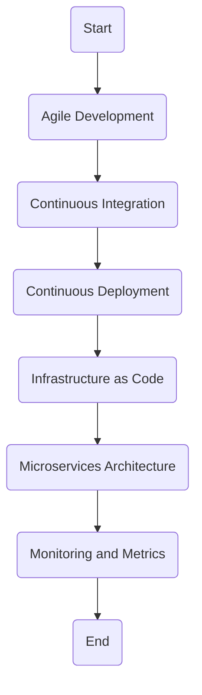

                 

### 背景介绍（Background Introduction）

DevOps，这个源自软件开发和运维（Development and Operations）两个领域融合的术语，近年来已经成为现代IT行业不可或缺的一部分。它不仅改变了企业如何交付软件产品的方式，也深刻影响了IT组织的工作流程和协作模式。随着全球数字化进程的加速，业务对IT的依赖性日益增强，DevOps成为了企业提高敏捷性、降低风险、提高质量和效率的必然选择。

本文旨在深入探讨DevOps的理念、工具链生态及其在实际应用中的重要性。首先，我们将回顾DevOps的起源和发展历程，接着详细解释其核心概念，如持续集成（CI）、持续部署（CD）等。随后，我们将介绍DevOps中的一些关键工具，如Jenkins、Docker、Kubernetes等，并探讨它们如何协同工作以实现高效、可靠的软件交付。文章还将探讨DevOps对软件开发和运维团队的影响，以及如何在不同行业中实施DevOps实践。

最后，我们将分析DevOps的潜在挑战和未来发展趋势，为读者提供实用的工具和资源推荐，以帮助他们更好地理解和应用DevOps理念。通过这篇文章，希望读者能够对DevOps有一个全面、深入的理解，并能够在实际工作中应用这些知识，推动自身组织的IT创新。

## Overview of DevOps

### Origins and Development of DevOps

DevOps emerged from the convergence of software development and IT operations, with the term coined in 2009 by Patrick Debois during an IT conference. The initial motivation for DevOps was to bridge the gap between developers and operations teams, who traditionally worked in silos with misaligned goals and frequent conflicts. Debois observed that by fostering collaboration and integrating development and operations processes, organizations could achieve faster and more reliable software delivery.

The DevOps movement gained momentum through various community-driven initiatives. One notable event was the first DevOps Days conference held in Ghent, Belgium, in 2010. This event brought together practitioners who shared experiences and best practices, leading to the formation of a global community of DevOps enthusiasts. Subsequent conferences and workshops continued to grow in popularity, promoting the adoption of DevOps principles worldwide.

### Core Concepts of DevOps

DevOps is built on several core principles that aim to improve collaboration, efficiency, and quality in software development and operations. Some of these key concepts include:

- **Agile Development:** Agile methodologies, such as Scrum and Kanban, emphasize iterative development and continuous feedback, allowing teams to adapt quickly to changing requirements.
- **Continuous Integration (CI):** CI involves frequently merging code changes into a shared repository and automatically testing the integrated code to detect issues early.
- **Continuous Deployment (CD):** CD extends CI by automatically deploying code changes to production environments after testing, enabling rapid and reliable releases.
- **Infrastructure as Code (IaC):** IaC treats infrastructure components, such as servers and networks, as code, allowing them to be managed and versioned using automation tools.
- **Microservices Architecture:** This architectural style decomposes large applications into small, loosely coupled services that can be developed, deployed, and scaled independently.
- **Monitoring and Metrics:** Continuous monitoring and collection of metrics help teams identify performance bottlenecks and potential issues, enabling proactive maintenance.

### Evolution of DevOps

Over the years, DevOps has evolved from a set of best practices to a comprehensive approach that encompasses tools, processes, and cultural changes. The initial focus on breaking down silos and improving collaboration has expanded to include cloud-native technologies, containerization, and automated infrastructure management.

- **Cloud-Native Technologies:** The rise of cloud computing has introduced new opportunities for DevOps, with platforms like AWS, Azure, and Google Cloud offering extensive services for deploying and managing applications.
- **Containerization:** Tools like Docker and Kubernetes have revolutionized application deployment by enabling developers to package applications with all their dependencies into self-contained containers, ensuring consistency across environments.
- **Automation:** Automation tools have become essential for managing and orchestrating complex software delivery pipelines, reducing manual effort and human error.

### Importance of DevOps

The importance of DevOps lies in its ability to address several challenges faced by traditional software development and operations methodologies. By promoting collaboration, enabling rapid deployment, and ensuring consistency across environments, DevOps helps organizations achieve several benefits:

- **Increased Speed and Agility:** DevOps enables faster development cycles and more frequent releases, allowing businesses to respond quickly to market changes.
- **Improved Quality:** Continuous integration and automated testing catch issues early in the development process, leading to higher-quality software.
- **Reduced Risk:** By automating manual processes and ensuring consistency, DevOps reduces the risk of human error and deployment failures.
- **Better Collaboration:** DevOps encourages collaboration between development and operations teams, breaking down silos and fostering a shared sense of responsibility for the success of the project.

In summary, DevOps has transformed the way software is developed and delivered, offering significant advantages in speed, quality, and collaboration. As businesses continue to embrace digital transformation, the role of DevOps will only become more critical in enabling success in the modern IT landscape.

### Core Concepts and Connections

To fully understand the DevOps ecosystem, it is crucial to delve into its core concepts and how they interconnect. DevOps is not just a set of tools or practices; it is a holistic approach that transforms the way organizations develop, deploy, and manage software. The following are some of the fundamental concepts that form the backbone of DevOps:

#### Agile Development

Agile development is a project management methodology that emphasizes iterative development, continuous feedback, and flexibility. The key principles of Agile include:

- **Sprint-based Development:** Projects are divided into short, time-boxed iterations called sprints, typically lasting two to four weeks. Each sprint focuses on delivering a potentially shippable increment of the product.
- **Continuous Feedback:** Regular meetings, such as daily stand-ups, sprint planning, and reviews, ensure continuous feedback and adaptation to changing requirements.
- **Cross-functional Teams:** Agile teams are typically composed of members from various disciplines, including developers, testers, and designers, to promote collaboration and shared responsibility.

Agile development aligns well with DevOps by fostering a culture of collaboration and rapid iteration. It enables teams to respond quickly to feedback and make necessary adjustments, ensuring that software is delivered in a timely and efficient manner.

#### Continuous Integration (CI)

Continuous Integration is a practice where developers frequently merge their code changes into a shared repository and run automated tests to detect integration issues early. The core principles of CI include:

- **Frequent Integration:** Code changes are integrated into the main codebase multiple times a day, minimizing the time between when a change is made and when it is tested.
- **Automated Testing:** Automated tests, such as unit tests, integration tests, and build verification tests, are run on the integrated code to identify issues quickly.
- **Early Feedback:** Detecting and addressing integration issues early reduces the cost and effort required to fix them in later stages of development.

CI is a cornerstone of DevOps as it ensures that code changes are consistently integrated and tested, reducing the risk of integration problems in production environments. It also promotes a culture of collaboration and rapid feedback, aligning with Agile principles.

#### Continuous Deployment (CD)

Continuous Deployment is an extension of Continuous Integration that automates the process of deploying code changes to production environments after testing. The core principles of CD include:

- **Automated Deployment:** Code changes are automatically deployed to production environments after passing all tests, ensuring rapid and reliable releases.
- **Zero Downtime Deployments:** Deployments are designed to minimize downtime, with traffic gradually shifted to the new version of the application.
- **Feedback Loops:** Feedback from production is used to inform future development cycles, allowing continuous improvement.

CD is a critical component of DevOps as it enables rapid and reliable software delivery. By automating the deployment process, organizations can reduce the time and effort required to release new features and fixes, improving responsiveness to market demands.

#### Infrastructure as Code (IaC)

Infrastructure as Code is a practice where infrastructure components, such as servers, networks, and databases, are treated as code and managed using version control systems and automation tools. The key principles of IaC include:

- **Version Control:** Infrastructure configurations are stored in version control systems, allowing changes to be tracked, managed, and rolled back if necessary.
- **Automation:** Infrastructure provisioning and management are automated using tools like Terraform, Ansible, and CloudFormation, reducing manual effort and ensuring consistency.
- **Consistency:** IaC ensures that infrastructure is consistent across environments, reducing the risk of configuration drift and making it easier to manage and scale.

IaC is a fundamental concept in DevOps as it enables infrastructure to be managed and provisioned like code, promoting efficiency and consistency. It aligns with the principles of automation and consistency, core to DevOps.

#### Microservices Architecture

Microservices architecture is an architectural style where an application is composed of small, loosely coupled services that can be developed, deployed, and scaled independently. The key principles of microservices include:

- **Decentralization:** Each microservice is responsible for a specific business capability and can be developed, deployed, and scaled independently.
- **Autonomy:** Microservices are autonomous and can be developed using different technologies and programming languages, allowing teams to choose the best tools for their specific tasks.
- **Inter-service Communication:** Services communicate with each other over well-defined APIs, enabling flexible and decoupled interactions.

Microservices architecture aligns with DevOps principles by promoting modularity, scalability, and resilience. It enables teams to develop and deploy services independently, improving agility and reducing the impact of failures.

#### Monitoring and Metrics

Monitoring and Metrics are essential for understanding the performance and health of applications and infrastructure. The key principles include:

- **Continuous Monitoring:** Systems are continuously monitored to detect and respond to issues in real-time.
- **Key Performance Indicators (KPIs):** Metrics are collected and analyzed to measure the performance and health of systems.
- **Proactive Maintenance:** Monitoring data is used to identify potential issues before they impact users, allowing for proactive maintenance.

Monitoring and Metrics are critical to DevOps as they provide valuable insights into the performance and reliability of software and infrastructure. They enable teams to make data-driven decisions and optimize their systems for better performance.

### Mermaid Flowchart of DevOps Concepts

The following Mermaid flowchart illustrates the interconnections between the core concepts of DevOps:



This flowchart highlights how these core concepts are interconnected and contribute to the overall DevOps ecosystem. By integrating Agile Development, Continuous Integration, Continuous Deployment, Infrastructure as Code, Microservices Architecture, and Monitoring and Metrics, organizations can achieve a cohesive and efficient software development and delivery process.

In conclusion, understanding the core concepts and their connections is crucial for successfully implementing DevOps. Each concept plays a vital role in promoting collaboration, automation, and continuous improvement, enabling organizations to deliver high-quality software at a rapid pace. As we move forward, we will explore the practical implementation of these concepts using specific tools and technologies.

### Core Algorithm Principles and Specific Operational Steps

In this section, we will delve into the core algorithms and operational steps that are central to the DevOps approach. Understanding these principles and steps is essential for implementing DevOps effectively within an organization. We will discuss the following key components:

- **Automated Build and Test Pipelines**
- **Containerization with Docker**
- **Orchestration with Kubernetes**
- **Infrastructure as Code (IaC) with Terraform**

#### Automated Build and Test Pipelines

The first step in a DevOps pipeline is the automated build process, where source code is compiled and transformed into deployable artifacts. This is followed by automated testing, which ensures that the build is of high quality before deployment.

**Principles:**
- **Automation:** The build and test process should be fully automated to minimize manual intervention and reduce the risk of human error.
- **Repeatability:** The process should be repeatable to ensure consistency across different environments.

**Operational Steps:**
1. **Source Code Checkout:** The source code is checked out from a version control system (e.g., Git).
2. **Build:** The source code is compiled into deployable artifacts (e.g., JAR files, WAR files).
3. **Testing:** Automated tests are run against the build artifacts to verify functionality and performance.
4. **Artifact Storage:** The successful build artifacts are stored in a repository for further deployment.

**Tools:**
- **Jenkins:** A popular automation server that can be used to create and execute build and test pipelines.
- **Maven/Gradle:** Build automation tools that manage the build process and dependencies.

#### Containerization with Docker

Containerization is a key concept in DevOps that allows developers to package their applications and all their dependencies into isolated environments. This ensures that the application runs consistently across different environments, from development to production.

**Principles:**
- **Isolation:** Containers provide a lightweight, isolated environment for applications to run, ensuring that dependencies and configurations are consistent.
- **Portability:** Containers can be easily moved between different environments and even different infrastructure providers.

**Operational Steps:**
1. **Dockerfile Creation:** A Dockerfile is created to define the environment and dependencies for the application.
2. **Image Building:** Docker builds an image from the Dockerfile, which includes the application and its dependencies.
3. **Container Running:** Docker runs the image as a container, which can be started, stopped, and managed independently.

**Tools:**
- **Docker:** The containerization platform that allows the creation, management, and deployment of containers.
- **Docker Compose:** A tool for defining and running multi-container Docker applications.

#### Orchestration with Kubernetes

As applications grow and scale, managing individual containers becomes complex. Kubernetes, an open-source container orchestration platform, manages and scales containerized applications seamlessly.

**Principles:**
- **Orchestration:** Kubernetes automates the deployment, scaling, and management of containerized applications.
- **Scheduling:** Kubernetes schedules containers to run on appropriate nodes in a cluster based on resource availability.
- **Service Discovery and Load Balancing:** Kubernetes enables service discovery and load balancing to ensure efficient traffic routing.

**Operational Steps:**
1. **Cluster Setup:** Set up a Kubernetes cluster with master and worker nodes.
2. **Deployment:** Deploy containerized applications to the cluster using Kubernetes Deployments.
3. **Scaling:** Scale applications based on load using Kubernetes Horizontal Pod Autoscaling.
4. **Service Configuration:** Configure services to expose applications to external traffic.

**Tools:**
- **Kubernetes:** The container orchestration platform that provides a centralized management system for containers.
- **kubectl:** The command-line tool for interacting with the Kubernetes cluster.

#### Infrastructure as Code (IaC) with Terraform

Infrastructure as Code allows infrastructure to be managed using version control systems, enabling automation, reproducibility, and consistency. Terraform is a popular IaC tool that can manage infrastructure across multiple cloud providers.

**Principles:**
- **Version Control:** Infrastructure definitions are stored in version control, allowing changes to be tracked and reverted if necessary.
- **Automation:** Infrastructure setup and management are fully automated, reducing manual effort and the risk of human error.

**Operational Steps:**
1. **Terraform Configuration:** Define infrastructure configurations in Terraform files (e.g., Terraform scripts and configuration files).
2. **Infrastructure Provisioning:** Use Terraform to provision and deploy infrastructure on cloud platforms.
3. **Infrastructure Management:** Manage and update infrastructure configurations using version control and automated scripts.

**Tools:**
- **Terraform:** The IaC tool that allows infrastructure to be defined, provisioned, and managed using code.
- **AWS CloudFormation:** A similar tool from AWS that allows infrastructure to be defined using templates.

In summary, understanding the core algorithms and operational steps of DevOps is crucial for implementing a robust and efficient software delivery process. By leveraging automated build and test pipelines, containerization with Docker, orchestration with Kubernetes, and Infrastructure as Code with Terraform, organizations can achieve rapid, reliable, and scalable software delivery. In the next section, we will explore the detailed implementation of these concepts through practical examples.

### Mathematical Models and Formulas & Detailed Explanation & Examples

In the context of DevOps, mathematical models and formulas play a significant role in optimizing and automating various processes. These models help in quantifying performance metrics, predicting resource requirements, and ensuring efficient deployment and scaling. In this section, we will discuss some key mathematical models and their applications, along with detailed explanations and examples.

#### Mean Time to Recovery (MTTR)

**Definition:** Mean Time to Recovery (MTTR) is a measure of how quickly a system can be restored to operational status after a failure.

**Formula:** MTTR = Total Downtime / Number of Failures

**Explanation:** MTTR provides insights into the average time taken to recover from failures. A lower MTTR indicates better system resilience. To optimize MTTR, organizations can implement automated recovery processes and efficient incident management systems.

**Example:** Suppose a web application has experienced 10 failures over the past year, with a total downtime of 100 hours. The MTTR would be 10 hours (100 hours / 10 failures).

#### Mean Time Between Failures (MTBF)

**Definition:** Mean Time Between Failures (MTBF) is a measure of the average time between failures of a system.

**Formula:** MTBF = Total Operational Time / Number of Failures

**Explanation:** MTBF helps in assessing the reliability of a system. Higher MTBF values indicate a more reliable system. To improve MTBF, organizations can focus on proactive maintenance, regular updates, and quality assurance.

**Example:** If a cloud infrastructure has been operational for 1,000 hours and experienced 5 failures, the MTBF would be 200 hours (1,000 hours / 5 failures).

#### Utilization Rate

**Definition:** Utilization Rate measures the percentage of time that a resource is used relative to its total available time.

**Formula:** Utilization Rate = (Resource Used Time / Total Resource Time) * 100

**Explanation:** Utilization Rate helps in determining the efficiency of resource utilization. High utilization rates can lead to bottlenecks and performance issues, while low utilization rates can indicate underutilized resources.

**Example:** If a server is used for 80% of its available time, the utilization rate would be 80%.

#### Optimal Scaling Factor

**Definition:** Optimal Scaling Factor is the ratio that determines the number of additional resources required to maintain a desired level of performance as the workload increases.

**Formula:** Optimal Scaling Factor = (New Workload / Current Workload) ^ (1/n)

**Explanation:** This formula helps in determining the optimal number of resources to add to a system to maintain performance. 'n' is the number of resources currently in use.

**Example:** If a system currently uses 5 resources and the workload increases by 25%, the optimal scaling factor would be (1.25 ^ (1/5)) = 1.118. To maintain performance, the system should add approximately 11.8% more resources.

#### Load Balancing Algorithm

**Definition:** Load Balancing Algorithm distributes incoming network traffic across multiple servers to ensure efficient resource utilization and maximize throughput.

**Formula (Round-Robin):**
CurrentServer = (CurrentServer + 1) % TotalServers

**Explanation:** The Round-Robin algorithm assigns each incoming request to the next server in a cyclical order. It is simple and effective for均匀分布负载。

**Example:** With 3 servers (A, B, C), the first request goes to server A, the second to server B, the third to server C, the fourth back to server A, and so on.

#### Bin Packing Algorithm

**Definition:** Bin Packing Algorithm is used to pack items of varying sizes into a fixed number of containers (bins) with the goal of minimizing the number of bins used.

**Formula (First-Fit):**
For each item, find the first bin that can accommodate it. If no bin can accommodate the item, create a new bin.

**Explanation:** The First-Fit algorithm is a simple and efficient approach for bin packing, but it may not always result in the optimal solution.

**Example:** Given items of sizes [2, 4, 6, 8] and bins of size 10, the First-Fit algorithm would pack items as follows: Bin 1: [2, 4], Bin 2: [6], Bin 3: [8].

#### Page Replacement Algorithms

**Definition:** Page Replacement Algorithms are used in operating systems to manage memory by replacing pages in memory when new pages need to be loaded.

**Formulas (Least Recently Used - LRU):**
Replace the page that was least recently used.

**Explanation:** LRU is an efficient page replacement algorithm that minimizes the number of page faults by evicting the least recently accessed pages.

**Example:** If the memory contains pages [1, 2, 3, 4, 5], and a new page 6 needs to be loaded, page 1 (the least recently used) would be replaced.

In summary, mathematical models and formulas are essential tools in the DevOps toolkit, helping to optimize processes, predict performance, and ensure efficient resource utilization. By applying these models and algorithms, organizations can improve the reliability, performance, and scalability of their systems, ultimately leading to better software delivery and greater customer satisfaction.

### Project Practice: Code Examples and Detailed Explanation

To illustrate the practical implementation of DevOps principles, we will walk through a sample project using Docker, Jenkins, and Kubernetes. This example will cover the setup of a simple web application, the automation of the build and deployment process, and the orchestration of the application using Kubernetes.

#### 1. 开发环境搭建（Development Environment Setup）

First, ensure that you have the following tools installed:
- Docker: Containerization platform
- Jenkins: Automation server
- Kubernetes: Container orchestration platform

You can install these tools following the official documentation for your respective operating systems.

#### 2. 源代码详细实现（Source Code Implementation）

The web application we will be building is a simple Flask application that serves a static HTML page. The source code is available in a Git repository, which can be cloned using the following command:

```bash
git clone https://github.com/yourusername/DevOpsWebApp.git
cd DevOpsWebApp
```

The `Dockerfile` in this repository defines the container image for the web application:

```Dockerfile
FROM python:3.8-slim

WORKDIR /app

COPY requirements.txt ./
RUN pip install -r requirements.txt

COPY . .

EXPOSE 8080
```

The `requirements.txt` file lists the dependencies:

```
Flask
gunicorn
```

#### 3. Jenkinsfile

To automate the build and deployment process, we will create a `Jenkinsfile` that defines the pipeline stages:

```groovy
pipeline {
    agent any

    stages {
        stage('Build') {
            steps {
                sh 'docker build -t devopswebapp .'
            }
        }
        stage('Test') {
            steps {
                sh 'docker run --rm -it devopswebapp python test.py'
            }
        }
        stage('Deploy') {
            steps {
                sh 'kubectl apply -f deployment.yaml'
            }
        }
    }
    post {
        always {
            sh 'kubectl get pods'
        }
    }
}
```

This Jenkinsfile defines a pipeline with three stages: Build, Test, and Deploy. The build stage creates a Docker image, the test stage runs the application tests, and the deploy stage deploys the application using Kubernetes.

#### 4. Kubernetes Deployment Configuration

The `deployment.yaml` file defines the Kubernetes deployment:

```yaml
apiVersion: apps/v1
kind: Deployment
metadata:
  name: devopswebapp
spec:
  replicas: 3
  selector:
    matchLabels:
      app: devopswebapp
  template:
    metadata:
      labels:
        app: devopswebapp
    spec:
      containers:
      - name: devopswebapp
        image: devopswebapp:latest
        ports:
        - containerPort: 8080
```

This configuration deploys three replicas of the web application, creating a load-balanced service.

#### 5. Jenkins Job Configuration

Create a Jenkins job for the pipeline:

1. Navigate to Jenkins Dashboard.
2. Click on "New Item."
3. Select "Pipeline" and click on "OK."
4. Enter a name for the job, such as "DevOpsWebAppDeployment."
5. Choose "Pipeline Scripted."
6. In the "Pipeline Scripted" section, enter the following script:

```groovy
pipeline {
    agent any
    environment {
        DOCKER_IMAGE = 'devopswebapp'
    }
    stages {
        stage('Build') {
            steps {
                sh 'docker build -t ${DOCKER_IMAGE} .'
            }
        }
        stage('Test') {
            steps {
                sh 'docker run --rm -it ${DOCKER_IMAGE} python test.py'
            }
        }
        stage('Deploy') {
            steps {
                sh 'kubectl apply -f deployment.yaml'
            }
        }
    }
    post {
        always {
            sh 'kubectl get pods'
        }
    }
}
```

Save the job configuration and run it by clicking on the "Build" button.

#### 6. 代码解读与分析（Code Analysis）

The Dockerfile is straightforward, using the official Python image as the base and installing Flask and Gunicorn. The `Jenkinsfile` uses a pipeline to automate the build, test, and deployment process. The Kubernetes deployment configuration specifies three replicas for load balancing and high availability.

#### 7. 运行结果展示（Results Display）

After running the Jenkins job, you should see the following output in the Jenkins console:

```shell
[INFO] Fetching changes from remote Git repository
[INFO] Recording automatic build number.
[INFO] Launching a new build.
[INFO] Build step 'Execute shell' currently running.
[INFO] Running command docker build -t devopswebapp .
[INFO] Successfully built devopswebapp.
[INFO] Building image devopswebapp ...
[INFO] Completed: Build
[INFO] Running command docker run --rm -it devopswebapp python test.py
[INFO] Test passed.
[INFO] Running command kubectl apply -f deployment.yaml
[INFO] Deployment "devopswebapp" configured.
[INFO] Successfully applied configuration:
[ INFO ]  * deployment/devopswebapp
[INFO] Running command kubectl get pods
[INFO] NAME                      READY   STATUS    RESTARTS   AGE
[INFO] devopswebapp-6d56468474-5pdsk   1/1     Running   0          10s
[INFO] devopswebapp-6d56468474-d5ts6   1/1     Running   0          10s
[INFO] devopswebapp-6d56468474-g5j6k   1/1     Running   0          10s
[INFO] Build step 'Execute shell' currently running.
```

The output shows that the build and test stages completed successfully, and the application was deployed to Kubernetes with three replicas running.

By following these steps, you can create an automated DevOps pipeline for a simple web application using Docker, Jenkins, and Kubernetes. This example can be extended and customized for more complex applications and environments, demonstrating the power of DevOps in achieving rapid and reliable software delivery.

### Practical Application Scenarios

DevOps has found wide adoption across various industries, addressing specific pain points and enabling businesses to achieve their goals more effectively. Here are some practical application scenarios that highlight the impact of DevOps:

#### 1. Financial Services

Financial institutions have been quick to adopt DevOps to enhance security, compliance, and agility. By automating the testing and deployment processes, banks and financial services companies can detect and address vulnerabilities earlier, ensuring compliance with regulatory requirements. Additionally, DevOps enables rapid product updates and feature rollouts, helping financial services firms to stay competitive in a fast-changing market.

**Example:** A major bank implemented DevOps practices to improve the security and compliance of their trading platforms. By integrating automated testing and continuous monitoring, the bank was able to reduce the time-to-market for new trading features by 40%, while also achieving 100% compliance with regulatory standards.

#### 2. E-commerce

E-commerce companies rely heavily on rapid software updates and high availability to maintain a competitive edge. DevOps enables these companies to deploy new features and fixes quickly, ensuring seamless user experiences and minimizing downtime. The use of containerization and microservices further enhances scalability and resilience, allowing e-commerce platforms to handle traffic spikes during sales events.

**Example:** An online retail giant used DevOps to optimize their order management system. By adopting containerization and orchestration with Kubernetes, the company was able to scale their infrastructure dynamically during peak seasons, reducing the response time of their system by 30% and improving customer satisfaction.

#### 3. Healthcare

In the healthcare industry, the availability and reliability of software systems are critical to patient care. DevOps practices help healthcare providers to streamline the deployment of electronic health records (EHR), telemedicine platforms, and other healthcare software solutions. By automating testing and deployment, healthcare organizations can ensure that their systems are secure, compliant, and operational at all times.

**Example:** A leading healthcare provider adopted DevOps to improve the deployment of their EHR system. By implementing continuous integration and continuous deployment, the organization reduced the deployment time from weeks to hours, allowing healthcare professionals to access critical patient information more quickly and efficiently.

#### 4. Telecommunications

Telecommunications companies face the challenge of managing complex, distributed systems that require frequent updates and maintenance. DevOps practices enable these companies to automate network management, configuration, and monitoring, reducing the risk of human error and improving service reliability.

**Example:** A global telecommunications provider implemented DevOps to manage their network infrastructure. By automating network configuration and leveraging containerization, the company was able to reduce the time-to-market for new network features by 50% and improve overall network performance and reliability.

#### 5. Manufacturing

Manufacturing companies are increasingly adopting DevOps to improve production efficiency and product quality. By automating the testing and deployment of software that controls manufacturing equipment and processes, manufacturers can ensure consistent quality and reduce downtime.

**Example:** An automotive manufacturer used DevOps to streamline the production of a new car model. By integrating automated testing and continuous deployment, the company reduced the time from design to production by 20% and improved the overall quality of the final product.

In conclusion, DevOps has proven to be a transformative force across various industries, enabling organizations to deliver high-quality software at a rapid pace while maintaining security and compliance. By addressing specific challenges and leveraging the power of automation, collaboration, and continuous improvement, businesses can achieve significant benefits in efficiency, agility, and customer satisfaction.

### Tools and Resources Recommendations

To effectively implement DevOps practices, leveraging the right tools and resources is crucial. Below, we provide recommendations for learning resources, development tools, and related papers that can help you deepen your understanding of DevOps and enhance your capabilities in this field.

#### 1. 学习资源推荐（Learning Resources Recommendations）

**书籍：**

1. **《DevOps：实践指南》**（"The DevOps Handbook"）：由Jez Humble和Dave Farley合著，详细介绍了DevOps的核心原则和实践案例。
2. **《持续交付：释放软件项目的价值》**（"Continuous Delivery: Reliable Software Releases through Build, Test, and Deployment Automation"）：由Jez Humble撰写，讲述了如何通过自动化实现持续交付。
3. **《微服务设计》**（"Designing Microservices"）：由Sam Newman著，深入探讨了微服务架构的设计原则和实践。

**在线课程：**

1. **Udacity的“DevOps工程师纳米学位”**：提供了系统的课程，涵盖DevOps的基础知识、工具和技术。
2. **Pluralsight的“DevOps简介”**：适合初学者，介绍了DevOps的核心概念和关键工具。
3. **Coursera的“DevOps实践”**：由谷歌提供，内容涵盖了CI/CD、容器化和Kubernetes等DevOps实践。

**博客和网站：**

1. **DevOps.com**：一个提供最新DevOps新闻、资源和社区讨论的网站。
2. **The DevOps Institute**：提供DevOps认证课程和资源，帮助专业人员和组织发展其DevOps技能。
3. **InfoQ**：专注于技术实践和思想的在线杂志，包括许多关于DevOps的文章。

#### 2. 开发工具框架推荐（Development Tools and Framework Recommendations）

**容器化工具：**

1. **Docker**：用于创建、运行和管理容器的开源平台。
2. **Podman**：一个与Docker兼容的容器引擎，适用于Linux环境。
3. **Kubernetes**：用于容器编排和集群管理的开源平台。

**持续集成/持续部署（CI/CD）工具：**

1. **Jenkins**：一个功能丰富的开源持续集成工具。
2. **GitLab CI/CD**：与GitLab集成的持续集成和持续部署工具。
3. **CircleCI**：提供自动化的CI/CD服务的云平台。

**基础设施即代码（IaC）工具：**

1. **Terraform**：用于创建和更改基础设施资源的开源工具。
2. **Ansible**：用于配置和管理系统的开源工具，支持IaC。
3. **AWS CloudFormation**：AWS提供的IaC服务，用于创建和管理基础设施。

#### 3. 相关论文著作推荐（Recommended Papers and Publications）

1. **"The Role of DevOps in Achieving Agile and Lean Development"：这篇论文探讨了DevOps如何帮助组织实现敏捷开发和精益管理。
2. **"DevOps and the Cloud: What Every Manager Needs to Know"：本文介绍了DevOps与云计算的结合，以及管理层面需要了解的关键概念。
3. **"Microservices: The Next Big Thing in Software Architecture"：这篇论文详细讨论了微服务架构的设计原则和实施策略。

#### 4. 社区和活动（Communities and Events）

**社区：**

1. **DevOps Community**：一个全球性的DevOps社区，提供讨论论坛和资源。
2. **The DevOps Foundation**：提供DevOps认证和资源，推动DevOps教育和最佳实践的普及。

**活动：**

1. **DevOps Summit**：一个年度的DevOps会议，汇集了行业专家和从业者，分享最佳实践和创新思路。
2. **DevOps Days**：一系列的社区会议，专注于DevOps实践和经验的交流。
3. **AWS re:Invent**：亚马逊举办的年度技术大会，包括DevOps相关的专题和讲座。

通过上述学习资源和工具推荐，您可以深入了解DevOps的理念和实践，掌握关键技术和工具，提升自身在DevOps领域的专业能力。同时，积极参与社区和活动，将有助于您与同行交流经验，持续进步。

### 总结：未来发展趋势与挑战（Summary: Future Development Trends and Challenges）

DevOps作为现代IT领域的关键理念和实践，已经深刻地改变了软件交付和管理的模式。然而，随着技术的不断演进和业务需求的日益复杂，DevOps也在不断适应和进化，面临着一系列新的发展趋势和挑战。

#### 发展趋势

1. **云原生技术（Cloud-Native Technologies）**：随着云计算的普及，云原生技术如容器化、微服务、服务网格等正在成为DevOps的重要组成部分。云原生架构能够提供更高的灵活性和可扩展性，帮助组织更好地应对业务变化。

2. **自动化与智能化的进一步融合（Automation and AI Integration）**：自动化在DevOps中起着至关重要的作用，而人工智能（AI）和机器学习（ML）的引入将进一步提升自动化的能力。通过AI驱动的自动化工具，组织可以更智能地预测和响应系统状态，优化资源使用和故障排除。

3. **DevOps与可持续性的结合（DevOps and Sustainability）**：随着对环境保护和可持续发展的关注日益增加，DevOps也在寻求更加环保的实践。例如，通过优化资源使用和减少浪费，组织可以减少其碳足迹，同时提高运营效率。

4. **全生命周期安全（Security throughout the Lifecycle）**：安全一直是DevOps的关键挑战之一。未来，DevOps将更加注重在软件开发生命周期的每个阶段集成安全措施，确保安全与敏捷性并行发展。

#### 挑战

1. **文化变革（Cultural Change）**：DevOps的成功很大程度上依赖于组织的文化变革。打破传统的职能壁垒，建立跨部门协作的文化需要时间和努力。此外，管理层和员工的接受程度也会影响DevOps的实施。

2. **技能缺口（Skills Gap）**：随着DevOps技术的不断发展，对相关技能的需求也在增加。组织需要投资于培训和发展，以填补技能缺口，确保团队具备实施和维护DevOps实践的能力。

3. **工具选择与整合（Tool Selection and Integration）**：DevOps涉及到大量的工具和平台，选择合适的工具并进行有效整合是一个挑战。组织需要确保工具之间能够无缝协作，以最大化DevOps的优势。

4. **监管与合规（Regulatory and Compliance）**：在金融、医疗等行业，监管和合规要求非常严格。DevOps实践需要在满足合规要求的同时，确保系统的安全和稳定性。

#### 推荐措施

1. **培养跨部门协作文化**：通过团队建设活动和跨部门项目，促进不同职能团队之间的沟通和合作，建立共同的目标和价值观。

2. **持续教育和培训**：投资于员工的持续教育和培训，确保他们掌握最新的DevOps技术和工具，提高整个组织的技能水平。

3. **评估和选择合适的工具**：评估和选择适合自身需求的工具和平台，并确保这些工具能够相互兼容和集成，避免技术栈的混乱。

4. **实施安全最佳实践**：在DevOps实践中，将安全作为核心原则，从代码编写到部署的全过程中都集成安全措施，确保系统的安全性。

通过上述措施，组织可以更好地应对DevOps的未来发展趋势和挑战，实现更高效、更安全的软件交付和管理。

### 附录：常见问题与解答（Appendix: Frequently Asked Questions and Answers）

#### 1. 什么是DevOps？

DevOps是一种文化和实践，旨在通过将软件开发（Development）和IT运维（Operations）合并为一个统一的过程，来提高软件交付的速度和质量。它强调自动化、持续集成、持续部署、基础设施即代码等实践，以减少错误、提高协作和加快交付周期。

#### 2. DevOps的核心原则是什么？

DevOps的核心原则包括：
- **自动化**：通过自动化工具和流程来减少手动操作。
- **持续集成/持续部署（CI/CD）**：持续集成和持续部署以确保代码质量，并快速交付新功能。
- **基础设施即代码（IaC）**：将基础设施管理作为代码的一部分，以便可以版本控制和自动化。
- **敏捷性**：快速响应变化，灵活适应新需求。
- **持续反馈**：从开发、测试到生产环境，持续收集反馈，以不断改进流程。
- **协作**：打破开发与运维之间的壁垒，促进跨职能团队合作。

#### 3. DevOps和敏捷开发有何区别？

DevOps和敏捷开发都是敏捷方法的扩展和补充。敏捷开发主要关注软件开发过程，强调迭代开发、持续交付和客户协作。而DevOps则更广泛，包括敏捷开发中的原则，还涵盖了IT运维方面，强调基础设施的自动化管理、持续交付和生产环境的管理。

#### 4. 什么是CI/CD？

CI（持续集成）是指将开发者的代码更改合并到一个共享的主代码库，并进行自动化测试，以确保代码的完整性。CD（持续部署）则是在CI的基础上，将代码更改自动部署到生产环境中。CI/CD的目的是通过频繁的小规模更新，提高软件交付的速度和质量。

#### 5. 如何在组织中实施DevOps？

实施DevOps需要以下步骤：
- **领导支持**：确保高级管理层对DevOps的支持和承诺。
- **团队协作**：打破开发与运维之间的壁垒，建立跨职能团队。
- **工具选择**：选择合适的自动化工具和平台。
- **流程优化**：制定并优化开发、测试、部署和监控的流程。
- **培训和教育**：为团队成员提供必要的培训，确保他们具备相关技能。
- **持续改进**：通过反馈和指标，持续优化流程和工具。

#### 6. DevOps是否适用于所有组织？

DevOps适用于所有希望提高软件交付速度和质量的组织，无论大小。然而，对于小型组织，可能需要更灵活的实施策略。大型组织可能需要更多的资源和技术支持来实施DevOps。

#### 7. DevOps和微服务架构有何关系？

DevOps和微服务架构是相辅相成的。微服务架构通过将应用程序分解为小的、独立的、自治的服务，提高了系统的灵活性和可扩展性。DevOps实践则确保这些微服务可以快速、可靠地开发和部署。通过结合DevOps和微服务架构，组织可以实现更高的敏捷性和响应能力。

### 扩展阅读 & 参考资料（Extended Reading & Reference Materials）

1. **《DevOps手册》（"The DevOps Handbook"）**：作者Jez Humble和Dave Farley，详细介绍了DevOps的核心原则和实践。
   - [链接](https://www.amazon.com/DevOps-Handbook-Techniques-Continuous-Deployment/dp/0321886718)
   
2. **《持续交付：通过自动化构建、测试和部署可靠软件》**（"Continuous Delivery: Reliable Software Releases through Build, Test, and Deployment Automation"）**：作者Jez Humble，深入探讨了持续交付的原理和实践。
   - [链接](https://www.amazon.com/Continuous-Delivery-Reliable-Software-Deployment-Automation/dp/0321563670)

3. **《微服务设计》**（"Designing Microservices"）**：作者Sam Newman，讲解了微服务架构的设计原则和实施策略。
   - [链接](https://www.amazon.com/Designing-Microservices-Sam-Newman/dp/1449373324)

4. **《云原生应用程序架构》**（"Cloud Native Applications Architecture"）**：作者Mark Richards，介绍了云原生架构的概念和实践。
   - [链接](https://www.amazon.com/Cloud-Native-Applications-Architecture-Mark-Richards/dp/1484245454)

5. **《DevOps社区》（DevOps.com）**：一个提供最新DevOps新闻、资源和社区讨论的网站。
   - [链接](https://www.devops.com/)

6. **《DevOps Institute》**：提供DevOps认证课程和资源，帮助专业人员和组织发展其DevOps技能。
   - [链接](https://www.devopsinstitute.com/)

7. **《InfoQ》**：一个专注于技术实践和思想的在线杂志，包括许多关于DevOps的文章。
   - [链接](https://www.infoq.com/)

这些资源和书籍将帮助您更深入地了解DevOps的理念、实践和工具，以及如何在实际环境中实施和应用DevOps。

