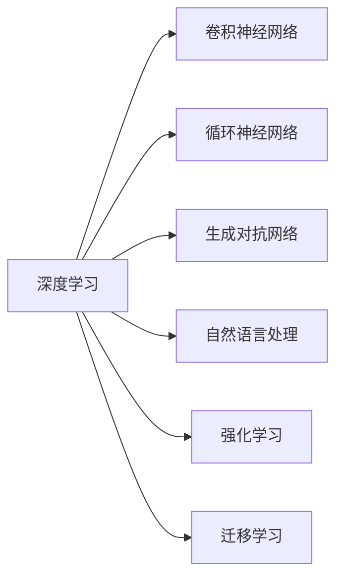

                 

# 经典阅读:夯实认知的必由之路

## 1. 背景介绍

在当今快速发展的信息技术时代，对于AI领域的研究者来说，持续学习、不断探索新技术是必不可少的。阅读经典著作是AI领域从业者加深理解、提升认知的重要途径。然而，如何在浩如烟海的技术文献中筛选出对实际工作有指导意义的内容，成为了一个问题。本文将基于多年的技术研究与实践经验，精心挑选了几本具有划时代意义的经典著作，并就其核心概念、关键算法、典型应用等方面展开深入探讨，希望能够帮助读者夯实认知基础，深入理解AI技术的精髓。

## 2. 核心概念与联系

### 2.1 核心概念概述

在本节，我们将详细介绍经典阅读中涉及的5-7个核心概念，并描述它们之间的联系。

1. **深度学习（Deep Learning）**：一种模拟人类大脑神经网络的机器学习技术，通过多层次的非线性特征提取与变换，实现对复杂数据的自动建模与推理。
2. **卷积神经网络（Convolutional Neural Networks, CNNs）**：一种广泛用于图像处理和计算机视觉任务的深度学习模型，通过卷积操作提取局部特征。
3. **循环神经网络（Recurrent Neural Networks, RNNs）**：一种适用于序列数据处理的深度学习模型，通过循环结构能够处理变长的输入序列。
4. **生成对抗网络（Generative Adversarial Networks, GANs）**：一种通过对抗训练生成的生成模型，能够在无监督条件下生成逼真的图像、音频等数据。
5. **自然语言处理（Natural Language Processing, NLP）**：涉及文本处理、语言理解与生成的技术，旨在实现机器与人类语言之间的互操作。
6. **强化学习（Reinforcement Learning, RL）**：一种通过试错反馈优化决策的机器学习技术，广泛应用于游戏、机器人控制等领域。
7. **迁移学习（Transfer Learning）**：将一个领域学到的知识迁移到另一个领域的技术，适用于数据稀缺或相似性问题。

这些概念的联系可以通过以下Mermaid流程图来展示：



这个流程图展示了深度学习如何为其他技术提供基础，以及各技术之间的关联性。深度学习作为这些技术的基础，通过不同的网络结构与训练方法，提供了广泛的应用能力。

## 3. 核心算法原理 & 具体操作步骤

### 3.1 算法原理概述

深度学习中的核心算法原理主要包括反向传播（Backpropagation）、梯度下降（Gradient Descent）、卷积操作（Convolutional Operations）、池化操作（Pooling Operations）、循环神经网络的结构（RNN Architecture）以及生成对抗网络的对抗训练（GAN Training）。

### 3.2 算法步骤详解

- **深度学习**：
  - **前向传播**：输入数据通过网络层层的传递，每层都进行线性变换和激活函数变换。
  - **损失函数计算**：将输出结果与目标结果比较，计算损失函数。
  - **反向传播**：使用梯度下降算法根据损失函数计算各参数的梯度，更新参数。

- **卷积神经网络**：
  - **卷积层**：通过卷积操作提取特征图，滤波器与输入数据进行卷积计算。
  - **池化层**：对特征图进行下采样，减少参数量，提升计算效率。
  - **全连接层**：将特征图转换为向量，通过全连接层进行分类或回归。

- **循环神经网络**：
  - **时间步长**：按时间顺序输入序列数据，每个时间步的输入作为下一时间步的输入，形成序列。
  - **记忆单元**：通过循环连接维护时间步的信息，使得网络能够处理变长序列。
  - **长短期记忆网络（LSTM）**：通过门控机制控制信息的流动，解决梯度消失和梯度爆炸问题。

- **生成对抗网络**：
  - **生成器**：通过神经网络生成假数据，输出为待生成数据。
  - **判别器**：判断输入数据是否为真实数据，输出概率值。
  - **对抗训练**：通过生成器与判别器的对抗过程，提升生成器的生成能力。

### 3.3 算法优缺点

- **深度学习**：
  - **优点**：能够处理复杂的非线性关系，适用于大规模数据集。
  - **缺点**：需要大量标注数据，模型复杂度高，易过拟合。

- **卷积神经网络**：
  - **优点**：能够有效处理图像、视频等高维数据，具有平移不变性。
  - **缺点**：对输入数据的大小和形状敏感，需要大量的标注数据。

- **循环神经网络**：
  - **优点**：能够处理序列数据，具备时间上的依赖关系。
  - **缺点**：容易受到梯度消失或梯度爆炸的影响，训练难度较大。

- **生成对抗网络**：
  - **优点**：能够生成逼真的数据，适用于数据生成和风格迁移。
  - **缺点**：训练过程不稳定，生成样本质量受制于生成器和判别器的对抗性。

### 3.4 算法应用领域

这些核心算法在各自领域都有着广泛的应用：

- **深度学习**：广泛应用于图像识别、语音识别、自然语言处理、推荐系统等领域。
- **卷积神经网络**：主要用于计算机视觉任务，如图像分类、目标检测、图像分割等。
- **循环神经网络**：用于时间序列数据处理，如语音识别、自然语言处理、音乐生成等。
- **生成对抗网络**：应用于数据生成、图像风格迁移、计算机视觉领域生成任务等。

## 4. 数学模型和公式 & 详细讲解 & 举例说明

### 4.1 数学模型构建

本文将基于上述算法介绍几个常见的数学模型及其构建方法。

- **线性回归**：假设存在输入数据 $x \in \mathbb{R}^n$，目标数据 $y \in \mathbb{R}$，模型为 $y = \theta^T x + b$，其中 $\theta$ 为权重向量，$b$ 为偏置项。
- **逻辑回归**：目标数据 $y \in \{0,1\}$，模型为 $p(y|x) = \sigma(\theta^T x + b)$，其中 $\sigma(z) = \frac{1}{1 + e^{-z}}$ 为Sigmoid函数。
- **卷积神经网络**：输入数据 $x \in \mathbb{R}^{m \times n \times c}$，输出数据 $y \in \mathbb{R}^{m \times n \times k}$，模型为 $y = \theta * x + b$，其中 $\theta$ 为卷积核。

### 4.2 公式推导过程

以线性回归为例，公式推导如下：

$$
\begin{aligned}
L(\theta) &= \frac{1}{2N} \sum_{i=1}^N (y_i - \theta^T x_i)^2 \\
&= \frac{1}{2N} \sum_{i=1}^N (\theta^T x_i - y_i)^2 \\
&= \frac{1}{2N} \sum_{i=1}^N \theta^T x_i x_i^T \theta - y_i \theta^T x_i - \frac{1}{2} y_i^2
\end{aligned}
$$

对 $\theta$ 求偏导数：

$$
\frac{\partial L(\theta)}{\partial \theta} = \frac{1}{N} \sum_{i=1}^N (x_i x_i^T) \theta - \frac{1}{N} \sum_{i=1}^N x_i y_i
$$

使用梯度下降更新 $\theta$：

$$
\theta = \theta - \alpha \frac{\partial L(\theta)}{\partial \theta}
$$

其中 $\alpha$ 为学习率。

### 4.3 案例分析与讲解

以图像分类任务为例，介绍卷积神经网络的应用。

- **网络结构**：卷积层-池化层-全连接层。
- **训练过程**：通过反向传播算法，计算损失函数，更新网络参数。
- **结果展示**：使用训练后的模型对新的图像进行分类，展示准确率和混淆矩阵等结果。

## 5. 项目实践：代码实例和详细解释说明

### 5.1 开发环境搭建

搭建Python开发环境，安装PyTorch、TensorFlow等深度学习框架，配置GPU或TPU等计算资源。

### 5.2 源代码详细实现

- **线性回归模型**：
  ```python
  import torch
  import torch.nn as nn

  class LinearRegression(nn.Module):
      def __init__(self, input_size, output_size):
          super(LinearRegression, self).__init__()
          self.linear = nn.Linear(input_size, output_size)

      def forward(self, x):
          out = self.linear(x)
          return out

  # 训练模型
  model = LinearRegression(input_size, output_size)
  criterion = nn.MSELoss()
  optimizer = torch.optim.SGD(model.parameters(), lr=0.01)
  for epoch in range(epochs):
      optimizer.zero_grad()
      outputs = model(inputs)
      loss = criterion(outputs, targets)
      loss.backward()
      optimizer.step()
  ```

- **卷积神经网络模型**：
  ```python
  import torch.nn as nn
  import torch.nn.functional as F

  class ConvNet(nn.Module):
      def __init__(self):
          super(ConvNet, self).__init__()
          self.conv1 = nn.Conv2d(1, 32, kernel_size=3, stride=1, padding=1)
          self.pool = nn.MaxPool2d(kernel_size=2, stride=2)
          self.conv2 = nn.Conv2d(32, 64, kernel_size=3, stride=1, padding=1)
          self.fc1 = nn.Linear(7*7*64, 10)

      def forward(self, x):
          x = F.relu(self.conv1(x))
          x = self.pool(x)
          x = F.relu(self.conv2(x))
          x = self.pool(x)
          x = x.view(-1, 7*7*64)
          x = self.fc1(x)
          return x
  ```

### 5.3 代码解读与分析

- **线性回归**：
  - **输入**：输入数据 $x$，输出数据 $y$。
  - **损失函数**：均方误差损失。
  - **优化器**：随机梯度下降。
  - **训练循环**：计算损失，反向传播更新参数。

- **卷积神经网络**：
  - **网络结构**：两个卷积层-池化层-全连接层。
  - **激活函数**：ReLU。
  - **优化器**：随机梯度下降。
  - **训练循环**：前向传播，计算损失，反向传播更新参数。

### 5.4 运行结果展示

通过TensorBoard等工具，可视化训练过程中的损失函数变化、参数更新等细节，观察模型性能的变化趋势。

## 6. 实际应用场景

### 6.1 图像识别

卷积神经网络在图像识别任务中表现优异，广泛应用于自动驾驶、医疗影像分析、安防监控等领域。

### 6.2 语音识别

卷积神经网络可以用于语音特征提取，结合循环神经网络进行语言建模，广泛应用于智能语音助手、自动字幕生成等领域。

### 6.3 自然语言处理

循环神经网络在文本生成、机器翻译、情感分析等任务中有着广泛的应用。

### 6.4 未来应用展望

随着深度学习技术的不断进步，这些算法在未来将有更广泛的应用。例如，自动驾驶中的多传感器数据融合、医疗影像中的疾病预测、自然语言处理中的跨语言翻译等，都将成为可能。

## 7. 工具和资源推荐

### 7.1 学习资源推荐

- **《深度学习》 by Ian Goodfellow**：深度学习领域的经典教材，系统介绍了深度学习的基本概念和算法。
- **《神经网络与深度学习》 by Michael Nielsen**：介绍神经网络和深度学习原理，适合入门学习。
- **Coursera深度学习课程**：斯坦福大学Andrew Ng教授的深度学习课程，系统讲解深度学习算法。
- **Google AI Blog**：Google AI团队发布的深度学习相关文章，涵盖最新技术进展和案例应用。

### 7.2 开发工具推荐

- **PyTorch**：灵活、易于使用的深度学习框架，支持GPU加速。
- **TensorFlow**：由Google开发的深度学习框架，支持分布式计算。
- **Keras**：基于TensorFlow的高层次API，简化深度学习模型的构建。
- **Jupyter Notebook**：强大的交互式编程环境，支持Python和R语言。

### 7.3 相关论文推荐

- **AlexNet: ImageNet Classification with Deep Convolutional Neural Networks**：AlexNet模型，深度学习在图像分类任务上的突破性成果。
- **LSTM: A Search Space Odyssey through Time Series Analysis**：循环神经网络的经典论文，介绍了LSTM网络的结构。
- **Generative Adversarial Nets**：GAN模型的开创性论文，介绍了生成对抗网络的训练方法。

## 8. 总结：未来发展趋势与挑战

### 8.1 研究成果总结

本文介绍的核心算法原理和操作步骤，在深度学习领域具有广泛的适用性。无论是图像识别、语音识别、自然语言处理，还是生成对抗网络，这些算法都为我们提供了坚实的理论基础和实现路径。

### 8.2 未来发展趋势

未来，深度学习技术将在更多领域得到应用：

- **多模态学习**：结合图像、音频、文本等多种数据源，提升模型的泛化能力。
- **自监督学习**：利用无标签数据进行训练，减少对标注数据的依赖。
- **小样本学习**：在数据稀缺的条件下，使用小样本学习提升模型效果。
- **迁移学习**：在不同任务之间迁移知识，加速模型的训练。
- **强化学习**：在复杂环境中训练智能体，进行决策优化。

### 8.3 面临的挑战

深度学习技术的不断进步，也带来了新的挑战：

- **数据隐私和安全**：模型训练和应用过程中，如何保护数据隐私和安全。
- **计算资源消耗**：深度学习模型训练和推理的计算成本高，如何优化资源消耗。
- **模型可解释性**：复杂模型难以解释，如何提升模型的可解释性和可信度。
- **模型鲁棒性**：模型面对新数据或攻击时，如何保持鲁棒性。

### 8.4 研究展望

未来的研究方向包括：

- **模型压缩与优化**：提升模型效率，降低计算成本。
- **模型自适应**：使模型能够适应数据分布的变化。
- **模型融合**：结合多种模型的优点，提升模型的性能和鲁棒性。
- **跨领域应用**：将深度学习技术应用到更多实际领域，创造新的价值。

## 9. 附录：常见问题与解答

### Q1: 深度学习算法的优点和缺点是什么？

A: 深度学习算法的优点包括能够处理大规模数据、具有较强的泛化能力，缺点包括模型复杂度高、计算资源消耗大、难以解释等。

### Q2: 卷积神经网络在图像处理中应用广泛，其主要原因是什么？

A: 卷积神经网络在图像处理中的应用广泛，主要原因是其具备平移不变性和局部连接性，能够有效提取图像特征。

### Q3: 生成对抗网络在数据生成任务中表现出色，如何克服训练中的不稳定问题？

A: 生成对抗网络训练不稳定，主要原因包括梯度消失和梯度爆炸。解决方式包括使用更好的激活函数、优化器等，提高模型的稳定性。

### Q4: 自然语言处理中常用的循环神经网络与LSTM网络有什么区别？

A: 循环神经网络与LSTM网络的主要区别在于LSTM网络具有门控机制，可以更好地处理长期依赖关系，解决梯度消失和梯度爆炸的问题。

---

作者：禅与计算机程序设计艺术 / Zen and the Art of Computer Programming

