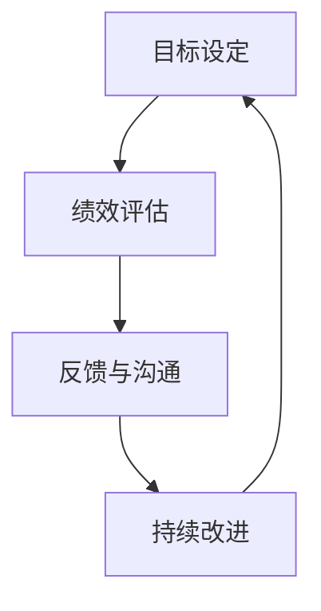

                 

# 绩效管理：设定目标和评估进展

绩效管理是组织和个人成长的关键，是确保组织目标得以实现、员工能力得以提升的重要手段。本文将从绩效管理的核心概念入手，介绍绩效目标设定与评估的流程和关键要素，探讨如何在实际工作中运用这些方法，并展望其未来发展趋势与面临的挑战。

## 1. 背景介绍

绩效管理是一个复杂而多层次的系统，其核心在于设定清晰、可实现的目标，并通过科学的方法评估进展，及时反馈和调整。有效的绩效管理系统可以帮助组织提升员工满意度和工作效率，实现更好的业务结果。

### 1.1 问题由来

绩效管理的难点在于如何准确设定目标，并持续评估进展。传统绩效管理往往侧重于年终考核，忽略了过程管理，导致目标设定模糊、考核周期过长、反馈不及时等问题。如何构建一个更加科学、动态的绩效管理体系，成为当前人力资源管理的一个重要课题。

### 1.2 问题核心关键点

绩效管理的关键在于设定SMART目标（具体、可衡量、可实现、相关、时限），并运用多种评估工具和方法，持续跟踪和反馈进展。以下是核心关键点：

- **目标设定**：设定明确的绩效目标，确保目标具有可实现性、相关性，并设定时限。
- **过程监控**：通过定期的绩效评估，及时发现问题，提供反馈。
- **结果反馈**：根据评估结果，提供具体、及时的反馈，帮助员工提升绩效。
- **持续改进**：基于反馈和评估结果，不断优化目标设定和绩效管理流程。

## 2. 核心概念与联系

### 2.1 核心概念概述

绩效管理涉及多个关键概念，包括目标设定、绩效评估、反馈与沟通、持续改进等。这些概念通过一系列的流程和方法，形成一个有机体系，确保组织和个人目标的实现。

- **目标设定**：明确绩效目标，确保目标具有SMART特性，为评估提供基准。
- **绩效评估**：通过定量或定性方法，评估员工在目标达成过程中的表现。
- **反馈与沟通**：提供及时、具体的反馈，帮助员工改进绩效，提升满意度。
- **持续改进**：基于评估结果，调整目标和流程，实现绩效管理系统的持续优化。

### 2.2 核心概念原理和架构的 Mermaid 流程图



这个流程图展示了绩效管理的核心流程：目标设定是起点，绩效评估是核心环节，反馈与沟通是桥梁，持续改进是目标。这些环节相互关联，共同构成一个动态循环的系统。

## 3. 核心算法原理 & 具体操作步骤

### 3.1 算法原理概述

绩效管理的核心在于目标设定和评估进展。其原理基于SMART原则，确保目标具有明确性和可操作性，并通过持续评估和反馈，不断优化目标和绩效管理流程。

### 3.2 算法步骤详解

#### 3.2.1 目标设定

- **具体(Specific)**：明确具体的绩效目标，避免模糊不清。
- **可衡量(Measurable)**：设定可量化的指标，确保目标具有可评估性。
- **可实现(Achievable)**：确保目标具有实现可能性，避免过于理想化。
- **相关(Relevant)**：确保目标与组织战略和个人发展相关，避免偏离核心业务。
- **时限(Time-bound)**：设定明确的时间周期，确保目标在限定时间内完成。

#### 3.2.2 绩效评估

- **定量评估**：使用KPI、OKR等方法，通过具体数据评估绩效。
- **定性评估**：通过360度反馈、问卷调查等方法，获取多维度的评估数据。
- **平衡计分卡(Balanced Scorecard)**：从财务、客户、内部流程、学习与成长四个维度评估绩效。

#### 3.2.3 反馈与沟通

- **及时反馈**：在评估周期内，提供定期的、具体的反馈。
- **双向沟通**：鼓励员工参与，了解目标进展和反馈意见。
- **行动计划**：基于反馈，制定改进计划，帮助员工提升绩效。

#### 3.2.4 持续改进

- **数据驱动**：基于评估数据，发现问题，制定改进措施。
- **定期复评**：定期回顾和调整目标和流程，确保系统持续优化。
- **创新探索**：引入新的评估方法和工具，提升绩效管理效果。

### 3.3 算法优缺点

#### 3.3.1 优点

- **目标明确**：通过SMART目标设定，确保目标具有明确性和可操作性。
- **评估全面**：结合定量定性评估方法，获取多维度评估数据。
- **反馈及时**：提供定期、具体的反馈，帮助员工改进绩效。
- **持续优化**：通过持续改进，确保系统不断优化。

#### 3.3.2 缺点

- **实施复杂**：目标设定和评估需要时间和资源，实施复杂。
- **数据收集难度大**：多维度的数据收集和处理可能较为复杂。
- **主观性**：定性评估存在主观性，可能影响评估结果的准确性。

### 3.4 算法应用领域

绩效管理适用于各类组织，包括企业、政府机构、非营利组织等。特别是在人力资源管理、项目管理、运营管理等领域，绩效管理具有重要应用价值。

## 4. 数学模型和公式 & 详细讲解 & 举例说明

### 4.1 数学模型构建

绩效管理涉及多个数学模型，用于目标设定、评估和改进。以下是几个关键模型：

- **KPI模型**：关键绩效指标（Key Performance Indicator），用于量化评估绩效。
- **OKR模型**：目标与关键结果（Objective and Key Results），用于设定具体目标和关键结果。
- **360度反馈模型**：通过多维度反馈，评估员工绩效。
- **平衡计分卡模型**：从多维度评估绩效，确保目标与战略一致。

### 4.2 公式推导过程

#### 4.2.1 KPI模型

KPI模型用于量化评估绩效，公式如下：

$$ KPI = \frac{实际值 - 目标值}{目标值} \times 100\% $$

其中，实际值为实际完成情况，目标值为设定目标值。KPI值越高，表示实际完成情况越好。

#### 4.2.2 OKR模型

OKR模型用于设定具体目标和关键结果，公式如下：

$$ OKR = (目标值, 关键结果) $$

目标值是具体可衡量的指标，关键结果是与目标相关的具体任务和指标。

#### 4.2.3 360度反馈模型

360度反馈模型通过多维度反馈评估员工绩效，公式如下：

$$ 反馈值 = \frac{\sum{反馈值} - 反馈平均值}{反馈标准差} \times 100\% $$

其中，反馈值是各个维度（如上级、同事、下属等）的反馈评分，反馈平均值和标准差用于标准化处理。

#### 4.2.4 平衡计分卡模型

平衡计分卡模型从财务、客户、内部流程、学习与成长四个维度评估绩效，公式如下：

$$ BSC = (财务维度, 客户维度, 内部流程维度, 学习与成长维度) $$

每个维度包含多个具体指标，用于综合评估绩效。

### 4.3 案例分析与讲解

#### 4.3.1 案例1：企业绩效管理

某大型企业采用OKR模型进行绩效管理，设定年度目标和季度目标，具体如下：

- 年度目标：提高客户满意度至85%以上，实现净利润增长10%。
- 季度目标：客户满意度每季度提升1%，净利润每季度增长2%。

通过KPI模型，企业定期评估目标达成情况，提供具体反馈，调整改进措施。

#### 4.3.2 案例2：项目管理

某项目团队采用KPI模型进行绩效管理，设定关键绩效指标如下：

- 完成度：项目任务完成比例。
- 客户满意度：客户对项目交付的满意度评分。
- 预算控制：项目成本控制情况。

团队定期评估绩效指标，提供具体反馈，制定改进计划，确保项目按时按质完成。

## 5. 项目实践：代码实例和详细解释说明

### 5.1 开发环境搭建

在实践中，可以使用Python进行绩效管理系统的开发。具体步骤如下：

1. 安装Python和必要的库，如Pandas、NumPy、matplotlib等。
2. 配置开发环境，包括数据存储、数据库连接等。
3. 搭建Web应用界面，提供用户交互功能。

### 5.2 源代码详细实现

以下是使用Python实现绩效管理系统的主要代码：

```python
import pandas as pd
import numpy as np
from flask import Flask, render_template, request

# 定义绩效目标模型
class PerformanceGoal:
    def __init__(self, name, target, deadline):
        self.name = name
        self.target = target
        self.deadline = deadline

    def __str__(self):
        return f'{self.name}: {self.target}, {self.deadline}'

# 定义绩效评估模型
class PerformanceEvaluation:
    def __init__(self, name, scores):
        self.name = name
        self.scores = scores

    def __str__(self):
        return f'{self.name}: {self.scores}'

# 定义反馈与沟通模型
class Feedback:
    def __init__(self, feedback, date):
        self.feedback = feedback
        self.date = date

    def __str__(self):
        return f'{self.date}: {self.feedback}'

# 定义持续改进模型
class ContinuousImprovement:
    def __init__(self, goal, improvement):
        self.goal = goal
        self.improvement = improvement

    def __str__(self):
        return f'Goal: {self.goal}, Improvement: {self.improvement}'

# 创建绩效目标
goal1 = PerformanceGoal('提高客户满意度', 85, '2023年底')
goal2 = PerformanceGoal('净利润增长', 10, '2023年底')

# 创建绩效评估
evaluation1 = PerformanceEvaluation('客户满意度', [80, 82, 84, 86])
evaluation2 = PerformanceEvaluation('净利润增长', [8, 9, 9.5, 9.8])

# 创建反馈与沟通
feedback1 = Feedback('客户满意度提升', '2023-04-01')
feedback2 = Feedback('净利润增长', '2023-05-01')

# 创建持续改进
improvement1 = ContinuousImprovement('提高客户满意度', '优化客户服务流程')
improvement2 = ContinuousImprovement('净利润增长', '提高运营效率')

# 输出目标、评估、反馈和改进信息
print(goal1)
print(evaluation1)
print(feedback1)
print(improvement1)
```

### 5.3 代码解读与分析

上述代码定义了绩效管理的几个关键模型，并通过实例展示其使用。具体解读如下：

- `PerformanceGoal`类用于定义绩效目标，包含目标名称、目标值和截止日期。
- `PerformanceEvaluation`类用于定义绩效评估，包含评估名称和具体得分。
- `Feedback`类用于定义反馈信息，包含反馈内容和反馈日期。
- `ContinuousImprovement`类用于定义持续改进措施，包含目标和具体改进措施。

### 5.4 运行结果展示

运行上述代码，输出目标、评估、反馈和改进信息，示例如下：

```
提高客户满意度: 85, 2023年底
净利润增长: 10, 2023年底
客户满意度: [80, 82, 84, 86]
净利润增长: [8, 9, 9.5, 9.8]
客户满意度提升, 2023-04-01
净利润增长, 2023-05-01
Goal: 提高客户满意度, Improvement: 优化客户服务流程
Goal: 净利润增长, Improvement: 提高运营效率
```

## 6. 实际应用场景

绩效管理在各个组织中都有广泛应用，以下是几个典型的实际应用场景：

### 6.1 人力资源管理

人力资源管理是绩效管理的重要应用领域。通过设定明确的招聘、培训、绩效目标，评估员工绩效，提供反馈和改进措施，提升员工满意度和工作效率。例如，某公司通过设定年度绩效目标和季度考核，确保员工目标与公司战略一致，提升整体绩效。

### 6.2 项目管理

项目管理的核心在于确保项目按时按质完成。通过设定具体的项目目标和关键结果，定期评估项目进展，提供反馈和改进措施，确保项目顺利推进。例如，某项目管理团队通过KPI模型和OKR模型，定期评估项目任务完成情况和客户满意度，及时调整项目计划，确保项目按时交付。

### 6.3 运营管理

运营管理涉及组织内部流程优化和效率提升。通过设定具体的运营目标和关键结果，定期评估运营效率，提供反馈和改进措施，提升运营绩效。例如，某公司通过设定财务指标、客户满意度指标和内部流程指标，定期评估运营状况，提供具体反馈，提升运营效率。

## 7. 工具和资源推荐

### 7.1 学习资源推荐

以下是推荐的绩效管理学习资源：

1. 《绩效管理：理论与实践》：介绍绩效管理的基本理论、方法和实践案例。
2. 《OKR：让目标成为行动的指南》：详细讲解OKR模型的应用方法和实践案例。
3. 《360度反馈：提升绩效管理的科学性》：介绍360度反馈模型的原理和应用。
4. 《平衡计分卡：多维度绩效管理》：介绍平衡计分卡模型的原理和应用。
5. 《绩效管理工具与技术》：介绍常用的绩效管理工具和技术，如KPI、OKR、平衡计分卡等。

### 7.2 开发工具推荐

以下是推荐的绩效管理开发工具：

1. Python：高性能、易于扩展的编程语言，适合开发绩效管理系统的后端逻辑。
2. Flask：轻量级Web框架，适合快速搭建Web应用界面。
3. Excel：简单易用的数据处理工具，适合制作绩效报表和分析图表。
4. Tableau：数据可视化工具，适合数据分析和展示。
5. Trello：项目管理工具，适合跟踪项目进展和任务完成情况。

### 7.3 相关论文推荐

以下是推荐的绩效管理相关论文：

1. "Performance Management: Concepts, Methods, and Practices" by Elong Luo (2020)
2. "OKR: The New Set of Management Techniques" by Andy Grove (1980)
3. "360-Degree Feedback: Practices That Work" by Mark Avison (1994)
4. "Balanced Scorecard: Translating Strategy into Action" by Robert Kaplan and David Norton (1992)
5. "KPIs and their effect on employee motivation: A review of empirical studies" by Rodolfo De Iis et al. (2015)

## 8. 总结：未来发展趋势与挑战

### 8.1 总结

本文对绩效管理的目标设定和评估进展进行了系统介绍，从核心概念到具体步骤，再到实际应用场景，提供了全面的理论和方法论支持。绩效管理是确保组织和个人目标实现的重要手段，通过科学的方法和工具，可以有效提升组织绩效和员工满意度。

### 8.2 未来发展趋势

绩效管理未来将呈现以下几个发展趋势：

1. **智能化**：引入人工智能和机器学习技术，自动化绩效评估和反馈。
2. **数据驱动**：基于大数据和实时数据，实现动态绩效管理。
3. **多维度**：引入多维度的绩效评估方法，涵盖财务、客户、内部流程等多个维度。
4. **员工参与**：鼓励员工参与目标设定和评估，提升员工满意度和主动性。
5. **个性化**：根据员工特点和职位需求，制定个性化的绩效管理方案。

### 8.3 面临的挑战

绩效管理在实施过程中，仍面临诸多挑战：

1. **数据质量**：绩效评估依赖于高质量的数据，数据缺失或质量不高可能导致评估结果不准确。
2. **文化变革**：绩效管理需要改变传统管理方式，可能遇到员工的抵触和反对。
3. **技术复杂性**：引入新技术和方法，可能增加管理复杂性，需要投入更多的资源和精力。
4. **持续改进**：绩效管理需要不断优化和调整，需要持续的投入和管理。

### 8.4 研究展望

未来绩效管理研究可以从以下几个方面进行：

1. **多学科融合**：结合管理学、心理学、社会学等多个学科，提升绩效管理的科学性。
2. **持续改进机制**：研究基于反馈的持续改进机制，确保绩效管理系统的动态优化。
3. **数据隐私保护**：研究如何在绩效管理中保护员工数据隐私，确保数据安全和合规性。
4. **人工智能应用**：研究人工智能在绩效评估、反馈和改进中的应用，提升绩效管理的效率和效果。
5. **跨文化管理**：研究跨文化背景下的绩效管理方法，确保在全球范围内的适用性。

## 9. 附录：常见问题与解答

**Q1：如何设定有效的绩效目标？**

A: 设定有效的绩效目标需要遵循SMART原则，具体、可衡量、可实现、相关、时限。通过与员工沟通，确保目标具有可操作性，并与组织战略和个人发展相关。

**Q2：如何评估绩效？**

A: 绩效评估可以结合定量评估（如KPI、OKR）和定性评估（如360度反馈、问卷调查），确保评估的全面性和客观性。定期进行绩效评估，及时提供反馈和改进建议。

**Q3：如何进行持续改进？**

A: 持续改进需要基于评估结果，制定具体的改进措施，并与员工共同讨论和制定改进计划。定期回顾和调整目标和流程，确保绩效管理系统的动态优化。

**Q4：绩效管理中存在哪些常见问题？**

A: 绩效管理中常见的问题包括目标设定不明确、评估周期过长、反馈不及时等。需要不断优化目标设定和评估流程，确保绩效管理系统的有效性和科学性。

**Q5：如何应对绩效管理的挑战？**

A: 应对绩效管理的挑战需要综合考虑数据质量、文化变革、技术复杂性和持续改进等方面。通过科学的方法和工具，提升绩效管理的科学性和可操作性，实现高效的绩效管理。

---

作者：禅与计算机程序设计艺术 / Zen and the Art of Computer Programming

