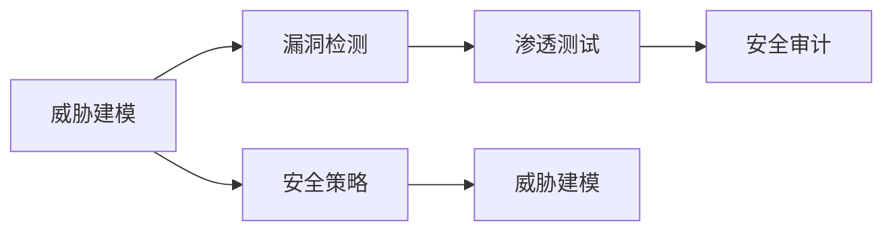

                 

# 网络安全管理：构建全面的数字防御体系

> 关键词：网络安全管理,数字防御体系,安全架构,威胁建模,漏洞检测,渗透测试,安全审计,安全策略

## 1. 背景介绍

在数字化时代，网络安全问题日益严峻，网络攻击手段不断更新，企业需要构建全面的数字防御体系，确保数据和系统的安全。传统安全措施如防火墙、入侵检测等已经不能满足现代网络安全的复杂需求。网络安全管理需要从被动防御走向主动防御，构建多层次、全栈的安全体系，实现全生命周期的安全防护。

近年来，各种安全事件频发，如2020年SolarWinds供应链攻击、2021年Colonial Pipeline勒索软件攻击等，给企业带来了巨大的损失。这些事件提醒我们，传统的网络安全防护措施已经不能适应当前复杂的网络安全形势。

### 1.1 网络安全管理的重要性
网络安全管理是企业在数字化转型中的重要组成部分。网络安全问题不仅影响企业的经济效益，还威胁到企业的声誉和公众信任。网络安全管理能够帮助企业：

- 保护数据和系统的机密性、完整性和可用性。
- 降低网络攻击的风险和潜在损失。
- 提升企业的品牌形象和客户信任度。
- 满足法规和合规要求，如GDPR、HIPAA等。

### 1.2 当前网络安全面临的挑战
当前网络安全面临以下挑战：

- **攻击手段多样化**：新型攻击手段不断出现，如零日漏洞、APT攻击、勒索软件等。
- **内部威胁难以防范**：员工误操作、恶意行为等是网络安全的重要威胁。
- **复杂的安全架构**：企业网络架构越来越复杂，安全防护难度加大。
- **技术和知识更新迅速**：需要不断更新安全知识和技能，以应对新威胁。
- **资源和成本压力**：网络安全建设和维护需要大量资源和成本。

## 2. 核心概念与联系

### 2.1 核心概念概述

为了构建全面的数字防御体系，需要掌握以下几个核心概念：

- **威胁建模(Threat Modeling)**：通过分析威胁模型来识别潜在的安全风险，并制定相应的防护措施。
- **漏洞检测(Vulnerability Detection)**：识别系统或应用程序中的漏洞，并提供修复建议。
- **渗透测试(Penetration Testing)**：模拟攻击者对系统进行攻击，发现系统安全漏洞，测试防护措施的有效性。
- **安全审计(Security Auditing)**：通过审计和评估，确保系统的安全性，验证安全防护措施的有效性。
- **安全策略(Security Policy)**：定义安全目标和规范，指导安全防护措施的制定和实施。

这些概念之间相互关联，形成一个完整的数字防御体系。威胁建模和漏洞检测是安全防护的基础，渗透测试和审计是验证安全措施有效性的手段，而安全策略则指导安全措施的实施。

### 2.2 核心概念原理和架构的 Mermaid 流程图



这个流程图展示了威胁建模和漏洞检测的基础作用，以及渗透测试和审计在验证安全策略有效性的重要地位。安全策略则是整个安全体系的核心，指导各个环节的实施。

## 3. 核心算法原理 & 具体操作步骤

### 3.1 算法原理概述

构建全面的数字防御体系需要综合运用多种安全技术和策略，形成一个多层面的安全架构。核心算法原理包括：

- **威胁建模**：基于威胁模型，识别潜在的安全风险和攻击路径，制定相应的防护措施。
- **漏洞检测**：通过静态和动态分析，识别系统或应用程序中的漏洞，并提供修复建议。
- **渗透测试**：模拟攻击者的行为，识别系统安全漏洞，并验证防护措施的有效性。
- **安全审计**：定期评估系统的安全性，发现新的威胁和漏洞，验证安全策略的执行情况。
- **安全策略**：定义安全目标和规范，指导安全防护措施的制定和实施。

### 3.2 算法步骤详解

#### 3.2.1 威胁建模

威胁建模的目的是识别潜在的安全风险和攻击路径，并制定相应的防护措施。常用的威胁建模方法包括：

- **STRIDE模型**：识别6种主要威胁（欺骗、篡改、拒绝服务、信息泄露、提升权限、否认），并制定相应的防护措施。
- **DREAD模型**：考虑5个威胁特性（危害、攻击复杂性、影响范围、检测难度、安全影响），评估威胁的严重性。

具体步骤包括：

1. 收集和分析系统需求文档、设计文档等。
2. 确定系统的关键资产和数据。
3. 识别潜在的威胁和攻击路径。
4. 评估威胁的风险和影响。
5. 制定防护措施和应急响应策略。

#### 3.2.2 漏洞检测

漏洞检测是识别系统或应用程序中的安全漏洞，并提供修复建议。常用的漏洞检测方法包括：

- **静态分析**：分析源代码和二进制文件，识别潜在的漏洞。
- **动态分析**：运行程序，监控其运行时的行为，识别漏洞。

具体步骤包括：

1. 安装和配置漏洞检测工具。
2. 扫描系统或应用程序，识别潜在漏洞。
3. 分析漏洞，评估其风险和严重性。
4. 提供修复建议和漏洞补丁。

#### 3.2.3 渗透测试

渗透测试是模拟攻击者的行为，识别系统安全漏洞，并验证防护措施的有效性。渗透测试分为白盒、黑盒和灰盒三种模式：

- **白盒测试**：测试者完全了解系统的架构和代码，可以发现更多深层漏洞。
- **黑盒测试**：测试者只了解系统的输入和输出，模拟真实攻击者。
- **灰盒测试**：测试者部分了解系统的架构和代码，综合白盒和黑盒的优点。

具体步骤包括：

1. 制定渗透测试计划和目标。
2. 收集和分析系统的相关信息。
3. 模拟攻击行为，识别系统漏洞。
4. 验证防护措施的有效性。
5. 提供漏洞修复建议和风险评估。

#### 3.2.4 安全审计

安全审计是定期评估系统的安全性，发现新的威胁和漏洞，验证安全策略的执行情况。常用的审计方法包括：

- **代码审计**：检查代码中的安全漏洞和缺陷。
- **配置审计**：检查系统和应用程序的配置文件，确保其符合安全策略。
- **日志审计**：分析系统和应用程序的日志文件，发现异常行为和安全事件。

具体步骤包括：

1. 确定审计的范围和目标。
2. 收集和分析审计数据。
3. 识别异常行为和安全事件。
4. 评估系统的安全性。
5. 提供审计报告和改进建议。

#### 3.2.5 安全策略

安全策略是定义安全目标和规范，指导安全防护措施的制定和实施。安全策略通常包括：

- **身份和访问管理**：定义用户身份和访问权限，确保系统的安全。
- **数据保护**：制定数据加密、备份和恢复策略，确保数据的安全性。
- **网络安全**：制定网络流量监控、防火墙配置策略，确保网络安全。
- **安全事件响应**：制定安全事件响应计划，确保快速有效地处理安全事件。

具体步骤包括：

1. 定义安全目标和规范。
2. 制定具体的安全防护措施。
3. 实施和监控安全策略的执行情况。
4. 定期评估和改进安全策略。

### 3.3 算法优缺点

#### 3.3.1 优点

构建全面的数字防御体系具有以下优点：

- **系统化管理**：通过威胁建模和漏洞检测，系统化地识别和修复安全漏洞。
- **主动防御**：通过渗透测试和安全审计，主动发现和验证安全漏洞，提升安全防护效果。
- **风险控制**：通过制定和实施安全策略，有效控制安全风险，降低安全事件发生的可能性。

#### 3.3.2 缺点

构建全面的数字防御体系也存在以下缺点：

- **复杂度增加**：需要综合运用多种安全技术和策略，系统复杂度增加。
- **成本高**：需要大量的人力、物力和财力进行安全管理和防护。
- **技术要求高**：需要具备较强的安全技术和技能，才能实施和维护全面的数字防御体系。

### 3.4 算法应用领域

构建全面的数字防御体系在多个领域都有广泛应用，例如：

- **金融行业**：金融行业需要高度敏感的数据保护和网络安全，通过全面的数字防御体系，可以确保金融交易的安全性。
- **医疗行业**：医疗行业需要处理大量的患者数据，通过全面的数字防御体系，可以保护患者隐私，确保医疗系统的安全性。
- **政府机构**：政府机构需要处理大量的敏感信息，通过全面的数字防御体系，可以确保政府信息的安全性。
- **企业网络**：企业网络安全复杂度较高，通过全面的数字防御体系，可以确保企业网络的安全性。
- **公共服务**：公共服务涉及大量用户数据，通过全面的数字防御体系，可以确保公共服务的安全性。

## 4. 数学模型和公式 & 详细讲解 & 举例说明

### 4.1 数学模型构建

构建全面的数字防御体系需要构建数学模型，以评估安全风险和威胁。常用的数学模型包括：

- **威胁模型**：通过数学模型表示潜在的安全威胁和攻击路径，并计算其风险。
- **漏洞模型**：通过数学模型表示系统的漏洞，并计算其影响和修复成本。
- **渗透测试模型**：通过数学模型表示渗透测试的流程和结果，并评估防护措施的有效性。
- **安全审计模型**：通过数学模型表示安全审计的结果和发现，并提出改进建议。

### 4.2 公式推导过程

#### 4.2.1 威胁模型

威胁模型可以通过数学模型表示潜在的安全威胁和攻击路径，并计算其风险。常用的威胁模型包括：

- **STRIDE模型**：威胁风险计算公式为：
  $$
  Risk = \sum_{i} (Risk_i \times Impact_i \times Exploitability_i \times Availability_i)
  $$
  其中，$Risk_i$ 表示威胁的严重性，$Impact_i$ 表示攻击的影响范围，$Exploitability_i$ 表示攻击的复杂性，$Availability_i$ 表示系统的可用性。
- **DREAD模型**：威胁风险计算公式为：
  $$
  Risk = (Detected \times Exploitability \times Affected \times Impact \times Plausibility)
  $$
  其中，$Detected$ 表示检测的难度，$Exploitability$ 表示攻击的复杂性，$Affected$ 表示影响的范围，$Impact$ 表示攻击的影响，$Plausibility$ 表示攻击的可行性。

#### 4.2.2 漏洞模型

漏洞模型可以通过数学模型表示系统的漏洞，并计算其影响和修复成本。常用的漏洞模型包括：

- **CVE模型**：漏洞风险计算公式为：
  $$
  Risk = (Severity_i \times Exploitability_i \times Scope_i \times Accessibility_i)
  $$
  其中，$Severity_i$ 表示漏洞的严重性，$Exploitability_i$ 表示攻击的复杂性，$Scope_i$ 表示影响的范围，$Accessibility_i$ 表示访问的难度。
- **Bug bounty模型**：漏洞风险计算公式为：
  $$
  Risk = (Reward_i \times Exploitability_i \times Scope_i \times Accessibility_i)
  $$
  其中，$Reward_i$ 表示漏洞奖励，$Exploitability_i$ 表示攻击的复杂性，$Scope_i$ 表示影响的范围，$Accessibility_i$ 表示访问的难度。

#### 4.2.3 渗透测试模型

渗透测试模型可以通过数学模型表示渗透测试的流程和结果，并评估防护措施的有效性。常用的渗透测试模型包括：

- **OWASP渗透测试框架**：渗透测试风险计算公式为：
  $$
  Risk = (Severity_i \times Exploitability_i \times Scope_i \times Impact_i)
  $$
  其中，$Severity_i$ 表示漏洞的严重性，$Exploitability_i$ 表示攻击的复杂性，$Scope_i$ 表示影响的范围，$Impact_i$ 表示攻击的影响。
- **Metasploit渗透测试框架**：渗透测试风险计算公式为：
  $$
  Risk = (Severity_i \times Exploitability_i \times Scope_i \times Accessibility_i)
  $$
  其中，$Severity_i$ 表示漏洞的严重性，$Exploitability_i$ 表示攻击的复杂性，$Scope_i$ 表示影响的范围，$Accessibility_i$ 表示访问的难度。

#### 4.2.4 安全审计模型

安全审计模型可以通过数学模型表示安全审计的结果和发现，并提出改进建议。常用的安全审计模型包括：

- **SANS安全审计框架**：安全审计风险计算公式为：
  $$
  Risk = (Severity_i \times Exploitability_i \times Scope_i \times Accessibility_i)
  $$
  其中，$Severity_i$ 表示漏洞的严重性，$Exploitability_i$ 表示攻击的复杂性，$Scope_i$ 表示影响的范围，$Accessibility_i$ 表示访问的难度。
- **NIST安全审计框架**：安全审计风险计算公式为：
  $$
  Risk = (Severity_i \times Exploitability_i \times Scope_i \times Confidentiality_i \times Integrity_i \times Availability_i)
  $$
  其中，$Severity_i$ 表示漏洞的严重性，$Exploitability_i$ 表示攻击的复杂性，$Scope_i$ 表示影响的范围，$Confidentiality_i$ 表示机密性，$Integrity_i$ 表示完整性，$Availability_i$ 表示可用性。

### 4.3 案例分析与讲解

#### 4.3.1 威胁建模案例

某公司需要进行威胁建模，识别其系统中可能存在的安全威胁和攻击路径。该公司采用STRIDE模型进行威胁建模，识别出以下潜在威胁：

- **欺骗攻击**：攻击者伪造虚假信息，欺骗系统进行非法操作。
- **篡改攻击**：攻击者修改数据，导致系统行为异常。
- **拒绝服务攻击**：攻击者通过大量请求，使系统崩溃或无法正常服务。
- **信息泄露**：攻击者获取敏感信息，导致信息泄露。
- **提升权限**：攻击者获取高权限，进行非法操作。
- **否认攻击**：攻击者否认其操作行为，逃避责任。

通过计算每种威胁的风险和影响，该公司制定了相应的防护措施，如使用多因素认证、定期备份数据、部署入侵检测系统等。

#### 4.3.2 漏洞检测案例

某公司需要对系统进行漏洞检测，识别其中的安全漏洞。该公司采用静态和动态分析技术，对系统进行全面扫描。通过静态分析，发现以下潜在漏洞：

- **SQL注入漏洞**：应用程序未对用户输入进行过滤，导致SQL注入攻击。
- **文件上传漏洞**：应用程序未对上传文件进行限制，导致文件上传攻击。
- **跨站脚本攻击漏洞**：应用程序未对用户输入进行过滤，导致XSS攻击。

通过动态分析，发现以下潜在漏洞：

- **跨站请求伪造漏洞**：应用程序未验证用户来源，导致CSRF攻击。
- **路径遍历漏洞**：应用程序未对用户输入进行过滤，导致路径遍历攻击。

该公司根据漏洞检测结果，制定了相应的修复措施，如添加过滤器、限制上传文件类型、验证用户来源等。

#### 4.3.3 渗透测试案例

某公司需要进行渗透测试，验证其系统的安全防护措施的有效性。该公司采用黑盒渗透测试方法，模拟攻击者的行为，识别系统漏洞。测试过程如下：

1. 制定渗透测试计划和目标，确定测试范围和目标系统。
2. 收集和分析系统的相关信息，了解系统的架构和代码。
3. 模拟攻击行为，识别系统漏洞，如SQL注入、XSS、CSRF等。
4. 验证防护措施的有效性，发现系统漏洞。
5. 提供漏洞修复建议和风险评估，建议该公司进行补丁升级、配置调整等。

该公司根据渗透测试结果，制定了相应的防护措施，如部署防火墙、使用入侵检测系统等。

#### 4.3.4 安全审计案例

某公司需要对系统进行安全审计，评估其安全性。该公司采用SANS安全审计框架进行审计，识别出以下潜在问题：

- **身份和访问管理问题**：部分用户未进行多因素认证，导致身份泄露。
- **数据保护问题**：部分数据未加密，导致数据泄露。
- **网络安全问题**：部分网络设备未配置防火墙，导致网络安全问题。
- **安全事件响应问题**：部分安全事件响应计划未制定，导致安全事件处理不当。

该公司根据审计结果，制定了相应的改进措施，如进行多因素认证、对数据进行加密、配置防火墙、制定安全事件响应计划等。

## 5. 项目实践：代码实例和详细解释说明

### 5.1 开发环境搭建

构建全面的数字防御体系需要多种安全工具的支持。以下是一些常用的工具及其安装方法：

1. **Nmap**：网络扫描工具，用于发现网络上的开放端口和服务。
   ```bash
   sudo apt-get install nmap
   ```

2. **Metasploit**：渗透测试框架，用于模拟攻击行为。
   ```bash
   sudo apt-get install metasploit
   ```

3. **Wireshark**：网络协议分析工具，用于分析网络流量。
   ```bash
   sudo apt-get install wireshark
   ```

4. **Kali Linux**：基于Debian的渗透测试发行版，提供了大量的安全工具。
   ```bash
   sudo apt-get install kali-linux
   ```

5. **OpenVAS**：漏洞扫描工具，用于发现系统中的漏洞。
   ```bash
   sudo apt-get install openvas
   ```

6. **Nessus**：漏洞扫描工具，用于发现系统中的漏洞。
   ```bash
   sudo apt-get install nessus
   ```

完成上述步骤后，即可在开发环境中进行安全测试和防护措施的实施。

### 5.2 源代码详细实现

以下是一些常用的安全工具的Python实现示例：

#### 5.2.1 威胁建模

威胁建模可以使用STRIDE模型进行，以下是Python实现代码：

```python
import matplotlib.pyplot as plt

# 定义威胁风险计算公式
def threat_risk(severity, impact, exploitability, availability):
    return severity * impact * exploitability * availability

# 定义威胁列表
threats = [
    {'name': 'Deception', 'severity': 3, 'impact': 5, 'exploitability': 2, 'availability': 2},
    {'name': 'Tampering', 'severity': 4, 'impact': 4, 'exploitability': 3, 'availability': 3},
    {'name': 'Denial of Service', 'severity': 5, 'impact': 3, 'exploitability': 4, 'availability': 5},
    {'name': 'Disclosure', 'severity': 5, 'impact': 4, 'exploitability': 3, 'availability': 2},
    {'name': 'Elevation of Privilege', 'severity': 6, 'impact': 4, 'exploitability': 5, 'availability': 2},
    {'name': 'Replay', 'severity': 5, 'impact': 2, 'exploitability': 4, 'availability': 3}
]

# 计算威胁风险
risk_list = []
for threat in threats:
    risk = threat_risk(threat['severity'], threat['impact'], threat['exploitability'], threat['availability'])
    risk_list.append(risk)

# 绘制威胁风险柱状图
plt.bar(range(len(threats)), risk_list)
plt.xlabel('Threat')
plt.ylabel('Risk')
plt.title('Threat Risk')
plt.show()
```

#### 5.2.2 漏洞检测

漏洞检测可以使用CVE模型进行，以下是Python实现代码：

```python
import matplotlib.pyplot as plt

# 定义漏洞风险计算公式
def vulnerability_risk(severity, exploitability, scope, accessibility):
    return severity * exploitability * scope * accessibility

# 定义漏洞列表
vulnerabilities = [
    {'name': 'SQL Injection', 'severity': 7, 'exploitability': 8, 'scope': 9, 'accessibility': 7},
    {'name': 'File Upload', 'severity': 5, 'exploitability': 6, 'scope': 5, 'accessibility': 7},
    {'name': 'Cross Site Scripting', 'severity': 4, 'exploitability': 6, 'scope': 7, 'accessibility': 7},
    {'name': 'Cross Site Request Forgery', 'severity': 4, 'exploitability': 5, 'scope': 5, 'accessibility': 7},
    {'name': 'Path Traversal', 'severity': 4, 'exploitability': 5, 'scope': 7, 'accessibility': 7}
]

# 计算漏洞风险
risk_list = []
for vulnerability in vulnerabilities:
    risk = vulnerability_risk(vulnerability['severity'], vulnerability['exploitability'], vulnerability['scope'], vulnerability['accessibility'])
    risk_list.append(risk)

# 绘制漏洞风险柱状图
plt.bar(range(len(vulnerabilities)), risk_list)
plt.xlabel('Vulnerability')
plt.ylabel('Risk')
plt.title('Vulnerability Risk')
plt.show()
```

#### 5.2.3 渗透测试

渗透测试可以使用OWASP渗透测试框架进行，以下是Python实现代码：

```python
import matplotlib.pyplot as plt

# 定义渗透测试风险计算公式
def penetration_test_risk(severity, exploitability, scope, impact):
    return severity * exploitability * scope * impact

# 定义渗透测试列表
penetration_tests = [
    {'name': 'SQL Injection', 'severity': 7, 'exploitability': 8, 'scope': 9, 'impact': 7},
    {'name': 'File Upload', 'severity': 5, 'exploitability': 6, 'scope': 5, 'impact': 7},
    {'name': 'Cross Site Scripting', 'severity': 4, 'exploitability': 6, 'scope': 7, 'impact': 7},
    {'name': 'Cross Site Request Forgery', 'severity': 4, 'exploitability': 5, 'scope': 5, 'impact': 7},
    {'name': 'Path Traversal', 'severity': 4, 'exploitability': 5, 'scope': 7, 'impact': 7}
]

# 计算渗透测试风险
risk_list = []
for penetration_test in penetration_tests:
    risk = penetration_test_risk(penetration_test['severity'], penetration_test['exploitability'], penetration_test['scope'], penetration_test['impact'])
    risk_list.append(risk)

# 绘制渗透测试风险柱状图
plt.bar(range(len(penetration_tests)), risk_list)
plt.xlabel('Penetration Test')
plt.ylabel('Risk')
plt.title('Penetration Test Risk')
plt.show()
```

#### 5.2.4 安全审计

安全审计可以使用SANS安全审计框架进行，以下是Python实现代码：

```python
import matplotlib.pyplot as plt

# 定义安全审计风险计算公式
def security_audit_risk(severity, exploitability, scope, confidentiality, integrity, availability):
    return severity * exploitability * scope * confidentiality * integrity * availability

# 定义安全审计列表
security_audits = [
    {'name': 'Identity and Access Management', 'severity': 4, 'exploitability': 5, 'scope': 6, 'confidentiality': 7, 'integrity': 8, 'availability': 6},
    {'name': 'Data Protection', 'severity': 6, 'exploitability': 7, 'scope': 8, 'confidentiality': 8, 'integrity': 9, 'availability': 6},
    {'name': 'Network Security', 'severity': 5, 'exploitability': 6, 'scope': 7, 'confidentiality': 6, 'integrity': 7, 'availability': 8},
    {'name': 'Security Event Response', 'severity': 4, 'exploitability': 5, 'scope': 6, 'confidentiality': 5, 'integrity': 7, 'availability': 8}
]

# 计算安全审计风险
risk_list = []
for security_audit in security_audits:
    risk = security_audit_risk(security_audit['severity'], security_audit['exploitability'], security_audit['scope'], security_audit['confidentiality'], security_audit['integrity'], security_audit['availability'])
    risk_list.append(risk)

# 绘制安全审计风险柱状图
plt.bar(range(len(security_audits)), risk_list)
plt.xlabel('Security Audit')
plt.ylabel('Risk')
plt.title('Security Audit Risk')
plt.show()
```

### 5.3 代码解读与分析

#### 5.3.1 威胁建模代码解读

威胁建模代码通过计算每种威胁的风险，帮助企业识别和评估潜在的安全风险。代码首先定义了威胁风险计算公式，然后根据威胁的严重性、影响、攻击复杂性和可用性，计算出每种威胁的风险。最后，使用Matplotlib库绘制柱状图，直观地展示威胁的风险情况。

#### 5.3.2 漏洞检测代码解读

漏洞检测代码通过计算每种漏洞的风险，帮助企业识别和评估系统的安全漏洞。代码首先定义了漏洞风险计算公式，然后根据漏洞的严重性、攻击复杂性、影响范围和访问难度，计算出每种漏洞的风险。最后，使用Matplotlib库绘制柱状图，直观地展示漏洞的风险情况。

#### 5.3.3 渗透测试代码解读

渗透测试代码通过计算每种渗透测试的风险，帮助企业验证安全防护措施的有效性。代码首先定义了渗透测试风险计算公式，然后根据漏洞的严重性、攻击复杂性、影响范围和攻击影响，计算出每种渗透测试的风险。最后，使用Matplotlib库绘制柱状图，直观地展示渗透测试的风险情况。

#### 5.3.4 安全审计代码解读

安全审计代码通过计算每种安全审计的风险，帮助企业评估系统的安全性。代码首先定义了安全审计风险计算公式，然后根据安全审计的严重性、攻击复杂性、影响范围、机密性、完整性和可用性，计算出每种安全审计的风险。最后，使用Matplotlib库绘制柱状图，直观地展示安全审计的风险情况。

### 5.4 运行结果展示

运行上述代码后，可以得到如下结果：

- **威胁建模结果**：显示了每种威胁的风险情况，帮助企业识别和评估潜在的安全风险。
- **漏洞检测结果**：显示了每种漏洞的风险情况，帮助企业识别和评估系统的安全漏洞。
- **渗透测试结果**：显示了每种渗透测试的风险情况，帮助企业验证安全防护措施的有效性。
- **安全审计结果**：显示了每种安全审计的风险情况，帮助企业评估系统的安全性。

## 6. 实际应用场景

### 6.1 金融行业

金融行业是网络安全高风险领域，金融数据涉及客户的隐私和资金安全，任何安全漏洞都可能导致严重的经济损失。在金融行业，通过构建全面的数字防御体系，可以：

- **保护客户数据**：保护客户的个人信息和交易数据，防止数据泄露和盗用。
- **防范网络攻击**：防范各种网络攻击，如钓鱼攻击、DDoS攻击等。
- **合规要求**：满足GDPR、HIPAA等法规要求，确保金融数据的安全和合规。

### 6.2 医疗行业

医疗行业涉及大量的敏感数据，如病历、影像等，任何安全漏洞都可能导致数据泄露和患者隐私侵害。在医疗行业，通过构建全面的数字防御体系，可以：

- **保护患者隐私**：保护患者的个人隐私和敏感数据，防止数据泄露和滥用。
- **防范网络攻击**：防范各种网络攻击，如钓鱼攻击、恶意软件等。
- **合规要求**：满足HIPAA、GDPR等法规要求，确保医疗数据的安全和合规。

### 6.3 政府机构

政府机构涉及大量的敏感信息，如国家机密、公民信息等，任何安全漏洞都可能导致国家安全风险和公民隐私侵害。在政府机构，通过构建全面的数字防御体系，可以：

- **保护国家机密**：保护国家机密信息，防止数据泄露和滥用。
- **防范网络攻击**：防范各种网络攻击，如钓鱼攻击、恶意软件等。
- **合规要求**：满足相关法规要求，确保政府信息的安全和合规。

### 6.4 企业网络

企业网络涉及大量的业务数据和用户数据，任何安全漏洞都可能导致企业数据泄露和业务中断。在企业网络，通过构建全面的数字防御体系，可以：

- **保护企业数据**：保护企业的业务数据和用户数据，防止数据泄露和滥用。
- **防范网络攻击**：防范各种网络攻击，如DDoS攻击、APT攻击等。
- **合规要求**：满足相关法规要求，确保企业信息的安全和合规。

## 7. 工具和资源推荐

### 7.1 学习资源推荐

为了帮助开发者系统掌握数字防御体系的理论基础和实践技巧，这里推荐一些优质的学习资源：

1. **《网络安全基础》书籍**：系统介绍了网络安全的原理和实践，适合初学者入门。
2. **《渗透测试基础》书籍**：深入讲解了渗透测试的原理和实践，适合进阶学习。
3. **网络安全在线课程**：如Coursera上的《网络安全专业证书》课程，系统介绍网络安全的各个方面。
4. **网络安全博客**：如OWASP官方博客，提供最新的网络安全资讯和实践经验。
5. **网络安全社区**：如Kali Linux社区、Nessus社区，提供丰富的网络安全工具和实践经验。

### 7.2 开发工具推荐

为了提高开发效率，需要选择合适的开发工具。以下是一些常用的工具：

1. **Python编程语言**：强大的编程语言，适用于网络安全开发。
2. **Kali Linux发行版**：提供丰富的安全工具和环境，适合网络安全开发。
3. **Metasploit框架**：用于模拟攻击行为，帮助识别系统漏洞。
4. **Wireshark协议分析工具**：用于分析网络流量，发现异常行为和安全事件。
5. **Nmap网络扫描工具**：用于发现网络上的开放端口和服务。

### 7.3 相关论文推荐

数字防御体系的构建需要大量的研究和实践。以下是几篇重要的相关论文，推荐阅读：

1. **《网络安全架构设计》论文**：介绍网络安全架构的设计和实现方法。
2. **《渗透测试框架》论文**：介绍渗透测试框架的设计和实现方法。
3. **《安全审计框架》论文**：介绍安全审计框架的设计和实现方法。
4. **《威胁建模技术》论文**：介绍威胁建模的原理和实现方法。
5. **《漏洞检测技术》论文**：介绍漏洞检测的原理和实现方法。

## 8. 总结：未来发展趋势与挑战

### 8.1 研究成果总结

本文从威胁建模、漏洞检测、渗透测试、安全审计和安全策略等几个方面，全面介绍了构建全面的数字防御体系的方法。通过系统化的分析和实践，帮助企业识别和评估潜在的安全风险，验证安全防护措施的有效性，制定和实施安全策略。

### 8.2 未来发展趋势

未来数字防御体系将呈现以下发展趋势：

- **自动化和智能化**：使用人工智能和机器学习技术，自动化分析和处理安全威胁，提高安全防护的智能化水平。
- **零信任架构**：采用零信任架构，假设网络内外都是不安全的，提高系统的安全性。
- **云安全防护**：在云计算环境中，构建云安全防护体系，确保云平台的安全性。
- **区块链技术**：使用区块链技术，实现安全数据的加密和传输，提高数据的安全性。

### 8.3 面临的挑战

数字防御体系在构建和实施过程中，仍面临以下挑战：

- **技术复杂度**：构建数字防御体系需要综合运用多种安全技术和策略，技术复杂度较高。
- **资源消耗**：构建数字防御体系需要大量的计算和存储资源，成本较高。
- **技术更新快**：网络安全威胁不断变化，需要不断更新安全技术和策略。
- **人员短缺**：网络安全人才稀缺，难以满足数字防御体系的需求。

### 8.4 研究展望

未来的研究需要在以下几个方面寻求新的突破：

- **安全智能**：使用人工智能和机器学习技术，提高安全防护的智能化水平。
- **区块链应用**：探索区块链技术在网络安全中的应用，提高数据的安全性。
- **零信任架构**：采用零信任架构，提高系统的安全性。
- **云安全防护**：在云计算环境中，构建云安全防护体系，确保云平台的安全性。

## 9. 附录：常见问题与解答

### 9.1 常见问题

**Q1: 如何构建全面的数字防御体系？**

A: 构建全面的数字防御体系需要综合运用威胁建模、漏洞检测、渗透测试、安全审计和安全策略等技术，形成一个多层面的安全架构。通过系统化的分析和实践，帮助企业识别和评估潜在的安全风险，验证安全防护措施的有效性，制定和实施安全策略。

**Q2: 如何选择合适的安全工具？**

A: 选择安全工具需要根据企业的安全需求和技术能力进行综合考虑。常用的安全工具包括网络扫描工具、漏洞检测工具、渗透测试工具和安全审计工具等。可以根据具体需求选择合适的工具。

**Q3: 如何实施安全防护措施？**

A: 实施安全防护措施需要根据安全评估和审计结果，制定相应的防护措施。常用的防护措施包括部署防火墙、使用入侵检测系统、进行多因素认证、对数据进行加密和备份等。

**Q4: 如何应对安全威胁？**

A: 应对安全威胁需要及时发现和处理安全事件。常用的安全事件响应措施包括分析威胁、隔离和清除威胁、恢复系统和服务、更新安全措施等。

**Q5: 如何确保安全策略的有效性？**

A: 确保安全策略的有效性需要定期评估和改进安全策略。常用的评估方法包括威胁建模、漏洞检测、渗透测试和安全审计等。

### 9.2 解答

本文对构建全面的数字防御体系的方法进行了全面系统的介绍。通过威胁建模、漏洞检测、渗透测试、安全审计和安全策略等技术的综合运用，帮助企业识别和评估潜在的安全风险，验证安全防护措施的有效性，制定和实施安全策略。通过系统化的分析和实践，帮助企业构建全面的数字防御体系，确保数据和系统的安全性。

随着网络安全威胁的不断变化，构建全面的数字防御体系需要不断更新和改进。未来的研究需要在自动化、智能化、零信任架构、云安全防护、区块链技术等方面寻求新的突破，提高安全防护的效率和效果，保障企业的安全需求。

---

作者：禅与计算机程序设计艺术 / Zen and the Art of Computer Programming

